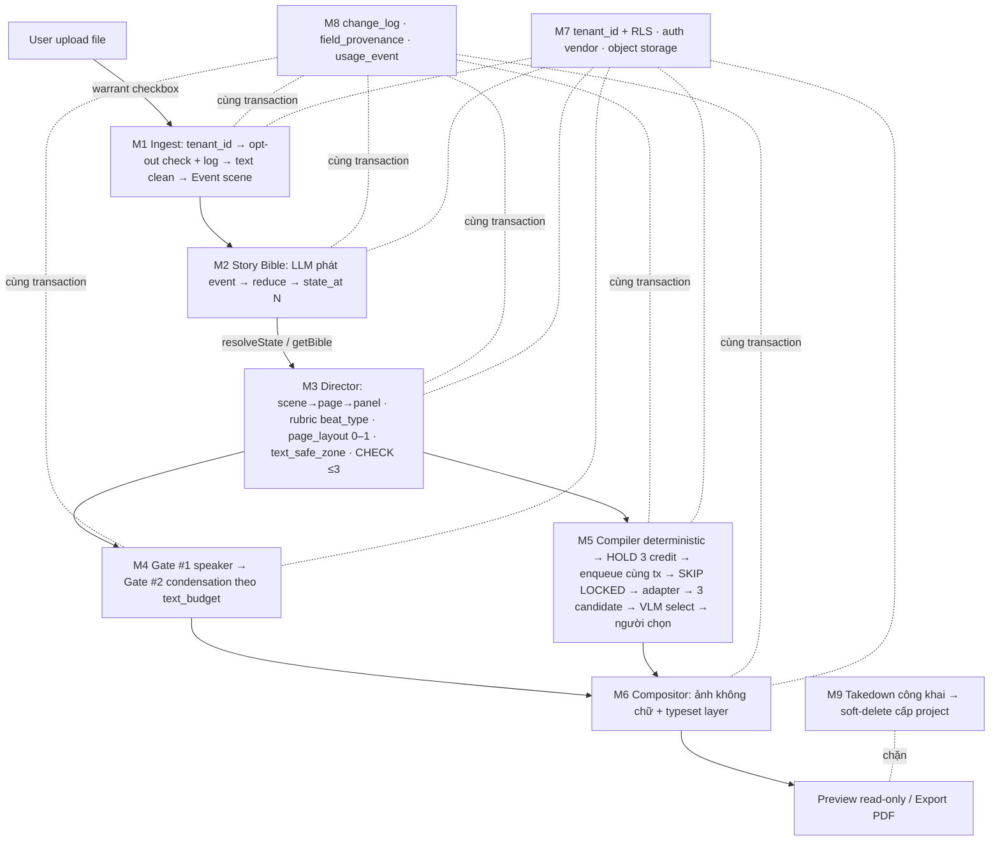

# Findings — architect

> Lens **READ-ONLY** của bước fan-out Phase 2. Tài liệu này **enumerate**, không thiết kế. Không tài liệu nào trong `docs/030-Specs/` được tạo ở dispatch này.
>
> Nguồn đã đọc: [SRS-Comic-Studio](../../../../020-Requirements/SRS-Comic-Studio.md) (toàn văn), [MVP-Scope](../../../MVP-Scope.md) §3/§4/§5/§6, [Backlog-Priority](../../../../022-User-Stories/Backlog-Priority.md) §3/§4/§5, 11 Use Case (main flow), 12 Story trong `docs/022-User-Stories/Backlog/`.
>
> Quy ước trích dẫn: `SRS L{n}` = số dòng thật của file SRS. `MVP-Scope L{n}` = số dòng thật của file MVP-Scope. Mọi dòng dưới đây đều đã đọc trực tiếp, không suy ra từ file chưa mở.

---

## 0. Ranh giới phạm vi — phải đọc trước mục 1

`⭐` trong [Backlog-Priority](../../../../022-User-Stories/Backlog-Priority.md) **KHÔNG có nghĩa là "trong phạm vi"**. Định nghĩa nguyên văn (`Backlog-Priority` L113):

> `⭐` ⟺ `Mốc ∈ {Pre-cycle/MVP0, MVP1, MVP2}` **VÀ** `Scope-Label ∈ {✅, 🟡}` **VÀ** `G ∈ {G2, G1}`

Tức là: *"Story bắt buộc phải xong để **một exit criterion** của một mốc trong horizon đạt được"* (L117). Điều kiện `G ∈ {G2,G1}` **cố ý loại** một số hàng `✅` trong horizon (L120) — đó là bộ lọc *"có chặn gate không"*, không phải bộ lọc *"có phải build không"*.

Hệ quả cho Phase 2: em chia enumerate thành **ba tầng**, và mọi mục dưới đây đều dán nhãn theo ba tầng này.

| Tầng | Định nghĩa | Số lượng |
|---|---|---|
| **[24⭐]** | 24 Story `⭐` — phạm vi đã chốt với khách hàng | 24 |
| **[H-non⭐]** | Story **trong horizon MVP0–MVP2**, `Scope-Label = ✅/🟡`, **nhưng không `⭐`** — và **SRS đánh CHỐT** cho requirement tương ứng | 17 (trong đó **7 hàng CHỐT** liệt kê ở [§7 G1](#g1--24-mvp-story--toàn-bộ-build-của-mvp1mvp2--gate-1)) |
| **[OoH]** | Ngoài horizon (MVP3/MVP4) nhưng **retrofit bị cấm** ⇒ kiến trúc phải chừa chỗ | 10 (không có file) + 5 có file |

⚠️ **Không tự ý mở rộng phạm vi.** Tầng `[H-non⭐]` được **liệt kê có nhãn**, không được trộn vào `[24⭐]`. Bỏ hẳn nó ra khỏi enumerate thì bản enumerate **sai** (mất `change_log`, job queue, object storage, auth) — xem [§7 G1](#g1--24-mvp-story--toàn-bộ-build-của-mvp1mvp2--gate-1).

---

## 1. Quyết định kiến trúc ĐÃ BỊ CHỐT SẴN trong Phase 1

> **Đây là ranh giới cứng.** Phase 2 **không được quyết lại** bất kỳ hàng nào dưới đây — chỉ được **ghi lại thành ADR** và đặc tả chi tiết hiện thực.
>
> Cột **Độ rắn** copy nguyên hệ nhãn ba mức của SRS (L49): **CHỐT** (không mở lại) · **MẶC ĐỊNH** (đã chọn, có đường lui ghi rõ) · **LAI** (cơ chế CHỐT, tham số bên trong `TBD`).
>
> ⚠️ **Checksum**: SRS L344 tự khai phân bố **55 CHỐT · 6 MẶC ĐỊNH · 7 TBD** trên **68 hàng** `SRS-FR-01…42` + `SRS-NFR-01…26`. Bảng dưới đây là một **cách nhóm lại theo trục kiến trúc**, **không phải** đếm lại 68 hàng đó — số hàng của em (**69** = `D-01`…`D-69`, không có khoảng trống) không phải và không nên bằng 68. Một `D-xx` có thể gộp nhiều `SRS-id`, và ngược lại một `SRS-id` có thể xuất hiện ở nhiều `D-xx`.

### 1.1 Topology triển khai

| # | Quyết định đã chốt | Căn cứ (file + dòng) | Độ rắn |
|---|---|---|:--:|
| **D-01** | **Modular monolith**: 1 process · 1 PostgreSQL · **3 schema** `story`/`comic`/`generation`; module boundary bằng **package + interface**, **KHÔNG HTTP nội bộ** | `SRS` L141, L249, L387 · `MVP-Scope` L148 (`E5`), L197 | **CHỐT** |
| **D-02** | Worker là **process triển khai riêng, CÙNG codebase** — 2 entrypoint (`api`, `worker`) trên cùng image, khác command. Yêu cầu: *"worker chết mà API vẫn sống"* | `SRS` L142, L250 · `MVP-Scope` L150 (`E7`) | **CHỐT** — nhưng `E7` = `⛔` ở MVP1/MVP2, `✅` từ MVP3 ⇒ **`[OoH]`**, kiến trúc phải chừa chỗ |
| **D-03** | **Job queue nằm TRONG PostgreSQL**, không broker ngoài; claim bằng `SELECT … FOR UPDATE SKIP LOCKED`; **transactional enqueue** (`INSERT generation` + `INSERT job` trong **một** transaction) ⇒ không bao giờ có job mồ côi | `SRS` L143, L179, L386 · `MVP-Scope` L118 (`A5`) | **CHỐT** |
| **D-04** | **Lint rule cấm import chéo module**: `comic` gọi `story` qua **DUY NHẤT** `resolveState()` và `getBible()`, cưỡng chế ở CI | `SRS` L251, L387 · `Story-Modular-Monolith-Three-Schemas` L32 | **CHỐT** |
| **D-05** | ⛔ **KHÔNG** microservices (3 service) · **KHÔNG** 2 PostgreSQL · **KHÔNG** Vector DB riêng · **KHÔNG** job queue ngoài Postgres. Lý do: 2 DB = mất transaction boundary (`KC-4`), và **RLS không bảo vệ được join phía application** | `SRS` L477, L482 · `MVP-Scope` L149 (`E6`), L203–L205 | **CHỐT** (negative) |
| **D-06** | `pgvector` **KHÔNG bị cấm** nhưng `❌` toàn horizon MVP0–MVP4; ở MVP dùng **Story Bible là index của mình** + PostgreSQL **full-text search** | `SRS` L146, L477, L489–L493 · `MVP-Scope` L126 (`B5`) | **CHỐT** |
| **D-07** | **Không mua GPU.** API cho main path; self-host **chỉ** cho LoRA train / upscale / inpainting | `SRS` L145, L182, L373 | **CHỐT** |
| **D-08** | **Hoãn multi-region** khỏi horizon; hoãn SSO/SAML, team nhiều role, custom domain / white-label, fine-tune per-tenant, self-serve refund | `SRS` L149, L512 · `MVP-Scope` L151 (`E8`) | **CHỐT** (về việc hoãn) |

### 1.2 Multi-tenancy & bảo mật

| # | Quyết định đã chốt | Căn cứ (file + dòng) | Độ rắn |
|---|---|---|:--:|
| **D-09** | `tenant_id NOT NULL` trên **MỌI** bảng nghiệp vụ · là **cột ĐẦU TIÊN** của **mọi** composite index · **Postgres RLS** là lớp phòng thủ thứ hai. Mô hình **shared DB + shared schema** — **không** schema-per-tenant, **không** db-per-tenant | `SRS` L247 · `MVP-Scope` L144 (`E1`), L292 (`KC-5`) | **CHỐT** |
| **D-10** | ⛔ **Cấm** viết tenant isolation thành *"filter theo `tenant_id` ở tầng ứng dụng"*. Với **1 dev không code review**, RLS biến lỗi lập trình thành **no-op thay vì rò rỉ chéo tenant** | `SRS` L260 | **CHỐT** |
| **D-11** | `tenant` / `user` / `membership` là **BA entity riêng** ngay từ đầu, kể cả khi quan hệ 1:1. Mọi dữ liệu nghiệp vụ trỏ `tenant_id`, **KHÔNG** trỏ `user_id` | `SRS` L248 · `MVP-Scope` L145 (`E2`) | **CHỐT** |
| **D-12** | **MUA** auth và billing, **không tự viết** | `SRS` L253, L384 · `MVP-Scope` L147 (`E4`) | **CHỐT** (vendor = `TBD`, `SRS` L256) |
| **D-13** | Object storage **tách khỏi DB từ ngày đầu** (không bao giờ lưu blob ảnh trong Postgres); key **`tenant/{tenant_id}/{sha256}`**; content-address **TRONG phạm vi tenant**, ⛔ **KHÔNG dedup chéo tenant**; **signed URL có hạn**, ⛔ **không bao giờ public bucket** | `SRS` L144, L252, L385 · `MVP-Scope` L146 (`E3`) | **CHỐT** (TTL cụ thể = `TBD`, `SRS` L445) |
| **D-14** | Kỷ luật `ON DELETE CASCADE` + **một đường hard-delete tenant đã kiểm thử**, **tách biệt** khỏi soft-delete của takedown | `SRS` L254 | **CHỐT** |

### 1.3 Data model — khoá thời gian & Story Bible

| # | Quyết định đã chốt | Căn cứ (file + dòng) | Độ rắn |
|---|---|---|:--:|
| **D-15** | **Thay hẳn `(chapter, scene)`** làm khoá thời gian bằng: hai trục tách bạch `reading_order` / `story_order` (`NUMERIC` **sparse**, bước nhảy **1000**, **editable qua UI**); `timeline_id` có `kind ENUM(main/flashback/parallel/dream)` + `anchor_order`; state neo vào `Event` **mức scene** (chia nhỏ bằng `beat_no`), **không** mức chapter | `SRS` L195, L202, L424 · `MVP-Scope` L125 (`B4`) · `Story-Fix-Narrative-Time-Key` L32–L35 | **CHỐT** |
| **D-16** | Story Bible state là **hàm thuần**: `state_at(N) = reduce(events where story_order <= N)`. LLM **chỉ phát event** (`entity, attribute, value, permanence, evidence_span, confidence`) cho **một** chapter; ⭐ **code sở hữu state** | `SRS` L196 · `MVP-Scope` L124 (`B3`) · `UC-02` bước 2 | **CHỐT** |
| **D-17** | **ĐÚNG MỘT** hàm `resolveState(entity, at_event)` cho mọi query state + test guardrail: ⛔ **không được có `ORDER BY chapter_no`** trong bất kỳ đường resolve state nào | `SRS` L198 | **CHỐT** |
| **D-18** | **Chapter parse + text clean là bước ĐẦU TIÊN** của pipeline và là **code deterministic** (regex/heuristic), **không LLM** | `SRS` L197 · `MVP-Scope` L122 (`B1`) · `UC-01` bước 7 | **CHỐT** |
| **D-19** | Story Bible tách **hai trục**: **Identity** (bất biến qua chương) và **Appearance** (đổi theo trạng thái) — gộp hai thứ vào một field là lỗi thiết kế | `UC-02` bước 3 | **CHỐT** |

### 1.4 Comic IR / Layout / Typeset

| # | Quyết định đã chốt | Căn cứ (file + dòng) | Độ rắn |
|---|---|---|:--:|
| **D-20** | ⭐ **Nguyên tắc chi phối toàn hệ thống**: **spec là dữ liệu chính, ảnh chỉ là output/cache**. Panel spec **tách khỏi granularity render** — một page compile được nhiều panel spec thành một prompt | `SRS` L123, L210 · `MVP-Scope` L128 (`C1`) | **CHỐT** |
| **D-21** | **Cứng hoá trần ≤3 nhân vật/panel TRONG SCHEMA Comic IR** (CHECK constraint + validation ở **tầng DB**), ⛔ **không** phải guideline trong prompt | `SRS` L211, L415 · `MVP-Scope` L132 (`C5`) · `UC-03` bước 7 | **CHỐT** |
| **D-22** | Layout lưu bằng **toạ độ chuẩn hoá 0–1 trong `page_layout JSONB`** ngay từ MVP; **template chỉ là preset ghi vào CÙNG schema đó** — ⛔ không có schema thứ hai cho template. Cùng dữ liệu render được thumbnail **và** bản in 300 DPI | `SRS` L237 · `MVP-Scope` L193 · `UC-03` bước 5 · `UC-08` bước 6 | **CHỐT** |
| **D-23** | Layout quyết định bằng **rubric `beat_type` rời rạc** (enum có anchor example) + `dialogue_density` **do code đếm** + `character_count` **do code đếm** → **bảng tra deterministic**; cộng **emphasis budget theo phạm vi chapter** (tối đa 1 full page + 2–3 large panel). LLM **chỉ xếp hạng** beat, **code phân bổ** theo quota | `SRS` L212, L419 · `MVP-Scope` L130 (`C3`) | **CHỐT** (cơ chế) |
| **D-24** | ⛔ **CẮT HẲN Layout Score 5 số thực.** Cắt **cơ chế**, ⚠️ **GIỮ mục tiêu** (layout theo narrative importance) — thay bằng D-23 | `SRS` L478 · `MVP-Scope` L131 (`C4`), L211 | **CHỐT** (negative) |
| **D-25** | `text_safe_zone` + `text_budget` + `negative_space_hint` là **field của panel spec**; Visual Prompt Compiler **phải truyền yêu cầu chỗ trống xuống prompt** — ràng buộc đi **NGƯỢC** từ typesetting vào compiler | `SRS` L213 · `MVP-Scope` L133 (`C6`) | **CHỐT** |
| **D-26** | **HAI human gate BẮT BUỘC**: (1) speaker attribution, (2) dialogue condensation. ⛔ **Không phải tuỳ chọn, không dồn sang MVP4, không tồn tại đường code nào bypass — kể cả cờ cấu hình**. Kèm: anchor deterministic bằng regex **TRƯỚC** LLM; LLM bị **constrained** vào tập nhân vật có mặt trong scene; `UNKNOWN` là giá trị **hợp lệ**; lưu `speaker_confidence` và hiện cờ trong UI khi thấp | `SRS` L214 · `MVP-Scope` L134 (`C7`) · `UC-04` bước 3, 8 · `UC-05` bước 9–10 | **CHỐT** |
| **D-27** | Thứ tự pipeline: **dialogue condensation nằm SAU layout**, vì `text_budget` phụ thuộc **diện tích panel** | `SRS` L215 · `UC-05` bước 1–2 | **CHỐT** |
| **D-28** | **HAI field cho thoại**, không phải một: `dialogue_source` (nguyên văn + `source_span`, **BẤT BIẾN**) và `dialogue_rendered` (bản nén, người sửa được, và **edit của người phải KHOÁ LẠI** khỏi bị re-run ghi đè) | `SRS` L227 | **CHỐT** |
| **D-29** | **Chữ đi qua typeset layer riêng**: art sinh **KHÔNG có chữ** (`text, letters, watermark, speech bubble` vào **negative prompt**); bubble là **layer dữ liệu riêng** toạ độ chuẩn hoá **0–1**; ⛔ **không nướng chữ vào pixel** | `SRS` L170 · `MVP-Scope` L115 (`A2`) · `UC-06` bước 3 · `UC-07` bước 7 | **CHỐT** |
| **D-30** | Auto-placement bubble **phải tự build** (không mua): MVP là heuristic (gần speaker, tránh vùng có mặt, thứ tự đọc) + **cho user kéo tay**. Wrap tiếng Việt **phải dùng thư viện hiểu Unicode combining marks** | `SRS` L228 | **CHỐT** |
| **D-31** | Đổi layout template bằng **một click** — lối thoát khi rubric chấm sai | `SRS` L226 | **CHỐT** |
| **D-32** | **Preview server-side TÁI DÙNG compositor của export** — ⛔ không phải renderer thứ hai | `MVP-Scope` L262 (#4) · `UC-08` bước 11 · `UC-09` bước 6 | **CHỐT** |
| **D-33** | Diện tích panel đổi ⇒ **tính lại `text_budget`** ⇒ nếu dòng thoại đã PASS gate #2 thì **reset gate #2 về OPEN**. Sửa nội dung thoại cũng reset gate #2 của **đúng dòng đó** | `UC-07` bước 10 · `UC-08` bước 8 | **CHỐT** |

### 1.5 Pipeline sinh ảnh

| # | Quyết định đã chốt | Căn cứ (file + dòng) | Độ rắn |
|---|---|---|:--:|
| **D-34** | **Visual Prompt Compiler là code deterministic — ⛔ KHÔNG có LLM ở runtime.** Bản chất: tra bảng `field value → cụm từ`, sắp thứ tự, dedup, xử lý xung đột theo **precedence ladder**, thực thi **constraint budget** (**5–8** ràng buộc thị giác `[EM]`), ghi **drop log** vào `generation.degradations JSONB` | `SRS` L171, L418 · `MVP-Scope` L116 (`A3`) | **CHỐT** — và là **điều kiện cần** để bảng `Generation` có nghĩa |
| **D-35** | Compiler xuất **HAI** output: `text_prompt` **VÀ** `conditioning_set`. Identity reference **không được** cạnh tranh với mô tả cảnh trong cùng một chuỗi text | `SRS` L172, L382 | **CHỐT** |
| **D-36** | LLM chỉ được xuất hiện trong compiler ở **HAI chỗ hẹp**, và **PHẢI CACHE**: (a) soạn từ vựng **offline** một lần → người review → **lưu vào bảng** (là dữ liệu, không phải runtime); (b) dịch action tự do → cụm pose khi từ vựng chưa có entry, **cache theo hash của action text** | `SRS` L173 | **CHỐT** |
| **D-37** | **best-of-N**: sinh **N candidate cho MỌI panel** rồi VLM QA-select 1. ⚠️ **KHÔNG phải retry-on-failure** | `SRS` L174, L414 · `MVP-Scope` L114 (`A1`) | **LAI** — cơ chế **CHỐT**; **N = 3** là **MẶC ĐỊNH**, đường lui: `CF-8.5` buộc MVP0 đo *"N tối thiểu"*, mỗi bậc N giảm ≈ **33% COGS**. ⚠️ Budget vẫn phải tính ở **N=3** |
| **D-38** | **Continuity Checker = QA-based selection giữa N candidate**, output là **hàng đợi review được xếp hạng**. ⛔ Cắt hẳn `[Fix automatically]`; bản hợp lệ là *"Tạo lại với ràng buộc được nhấn mạnh"* — **giữ CẢ HAI version**, hiển thị side-by-side, **NGƯỜI CHỌN**, không bao giờ tự áp dụng. `unclear` là câu trả lời hợp lệ **hạng nhất** | `SRS` L175, L84 | **CHỐT** |
| **D-39** | Hệ thống **PHẢI hiện tường minh độ phủ của checker** cho user (*"đã kiểm N/M panel, M−N panel không kiểm được vì nhiều nhân vật"*, độ phủ **40–60%** `[EM]`). Đây là **FR minh bạch**, ⛔ **không phải chỉ tiêu chất lượng** | `SRS` L176, L421, L462 | **CHỐT** |
| **D-40** | **Adapter per image provider** là **seam bắt buộc** (một interface, nhiều provider: Gemini 3 Pro Image, FLUX.2); **pin model version tường minh** trong config | `SRS` L177, L380 · `MVP-Scope` L117 (`A4`) | **LAI** — seam **CHỐT**; provider chính **MẶC ĐỊNH** (Gemini batch), đường lui ghi rõ: FLUX.2 pro `$0.03` `[OFF]` |
| **D-41** | Dùng **batch API**, không realtime API | `SRS` L178, L381 | **MẶC ĐỊNH** — đường lui: `CF-3.11` lấy **giá standard** làm trần an toàn cho MVP0 |
| **D-42** | Câu **CLAIM job PHẢI CHỨA** điều kiện fairness per tenant: `in_flight_per_tenant < N` — nhồi vào sau là sửa lại **đúng câu SQL nóng nhất** | `SRS` L180, L447 · `MVP-Scope` L119 (`A6`) | **LAI** — cơ chế **CHỐT**; giá trị **N**: **CHƯA QUYẾT** → `TBD`, ⛔ **không con số nào trong repo** |
| **D-43** | Prop quan trọng đưa vào **reference image như một ENTITY RIÊNG**, ⛔ không mô tả bằng chữ trong prompt | `SRS` L181 | **CHỐT** |
| **D-44** | ⭐ **Mục tiêu của bảng `Generation` là AUDITABILITY + LINEAGE, ⛔ KHÔNG phải reproducibility.** Bit-exact không đạt được (API không cho set seed; silent model drift). **`seed` là provenance metadata, KHÔNG phải replay key** | `SRS` L185 · `MVP-Scope` L233 | **CHỐT** |
| **D-45** | Cập nhật trạng thái job cho client bằng **polling 2 giây**, ⛔ không WebSocket | `SRS` L229, L394, L425 | **MẶC ĐỊNH** — đường lui: tiền đề đảo (generation nhanh hơn nhiều) thì mở lại được |
| **D-46** | Render granularity: **per-panel** là mặc định; **whole-page** là **đường lui đã thiết kế sẵn**, đổi được **KHÔNG đổi data model**. ⛔ Không được đọc thành *"hạ N để cứu margin"* | `SRS` L275, L283 · `MVP-Scope` L120 (`A7`) | **MẶC ĐỊNH** — gắn vào gate `G2` |

### 1.6 Provenance & pháp lý — danh sách cứng `KC-1…KC-7`

| # | Quyết định đã chốt | Căn cứ (file + dòng) | Độ rắn |
|---|---|---|:--:|
| **D-47** | `parent_generation_id` (**nullable FK**) + `relation_kind ENUM('retry','variation','refine','continuity_fix')` — từ **MIGRATION SỐ 1**, không phải backlog. ⛔ **Không backfill được** | `SRS` L296 · `MVP-Scope` L288 (`KC-1`) · `Story-Provenance-Chain-Parent-Generation` L36 | **CHỐT** |
| **D-48** | `change_log` **append-only** ghi **MỌI** hành động người dùng — kể cả *"chọn generation X thay vì Y"*, sửa thoại, đổi camera, kéo bubble, **export**. ⭐ *"Prompt một mình không chứng minh được decisive contribution"* | `SRS` L236, L297, L367 · `MVP-Scope` L268, L289 (`KC-2`) · `UC-06` bước 10 · `UC-09` bước 9 · `UC-11` bước 7 | **CHỐT** |
| **D-49** | `field_provenance` (**mức FIELD**) + `generation.origin ENUM('ai','ai_edited','human')` | `SRS` L298 · `MVP-Scope` L290 (`KC-3`) | **CHỐT** |
| **D-50** | ⭐ **KC-1 + KC-2 + KC-3 phải commit CÙNG MỘT TRANSACTION** với artifact mà chúng chứng minh: `INSERT generation` + `INSERT change_log` + `INSERT usage_event` **bất khả phân**. *"Bằng chứng có thể thiếu ngẫu nhiên thì không phải bằng chứng."* | `SRS` L299 · `MVP-Scope` L291 (`KC-4`), L204 · `Story-Modular-Monolith-Three-Schemas` L33, L38 | **CHỐT** |
| **D-51** | **Guardrail tầng DB**: mọi `INSERT` vào `generation` **thiếu `origin` phải FAIL ở tầng DB**, không phải chỉ cảnh báo ở tầng ứng dụng | `SRS` L300 · `Story-Provenance-Chain-Parent-Generation` L37 | **CHỐT** |
| **D-52** | **Kiểm opt-out signal Điều 37b NGAY TRONG BƯỚC INGEST**: đọc metadata / rights-management-info của file upload, **log kết quả kèm timestamp** (kể cả khi *"không có signal"*), **chặn nếu có signal bảo lưu**. Ingest là nơi **DUY NHẤT** file của user lần đầu vào hệ thống | `SRS` L301 · `MVP-Scope` L293 (`KC-6`) · `UC-01` bước 5–6 | **CHỐT** |
| **D-53** | ⛔ **ANTI-FEATURE**: hệ thống **KHÔNG ĐƯỢC** có bộ phát hiện *"truyện này có thể có bản quyền của người khác"* (copyright detection / plagiarism / similarity scan) **trước khi có xác nhận của luật sư** — vì nó tạo ra đúng tri thức mà điều kiện (a) *"không biết"* của miễn trừ Điều 198b đang miễn trừ. ⚠️ Đây là chỗ **một dev sẽ làm ngược theo bản năng** | `SRS` L303, L484 · `UC-11` bước 5 | **CHỐT** |
| **D-54** | **Takedown = soft-delete + disable-access ở CẤP PROJECT**, ⛔ **KHÔNG hard delete** (phải giữ dữ liệu cho counter-notice). Công cụ tiếp nhận **công khai, không cần tài khoản**: form + `copyright@`; **đăng ký đầu mối (email + SĐT) với Bộ VHTTDL**; **SLA 72 giờ** `[OFF]` tính từ timestamp tiếp nhận | `SRS` L302, L396, L412 · `MVP-Scope` L162 (`GP-3`) · `UC-11` bước 2, 3, 6 | **CHỐT** |
| **D-55** | **AI provenance metadata field ở cấp page/panel** + **export path phải nhúng được machine-readable watermark**. Vì phạm vi khoản 4 Điều 11 chưa rõ ⇒ **thiết kế theo diễn giải RỘNG** (mọi nội dung AI) cho tới khi luật sư chốt. Cộng: cơ chế để **user nhận biết đang tương tác với hệ thống AI** | `SRS` L304, L305, L313 | **CHỐT** — quy tắc tạm thời *"diễn giải rộng"* **là một quyết định**, không phải `TBD` |
| **D-56** | ⛔ **KHÔNG UI duyệt CÂY generation** (tree view / diff / branch-merge) — **flat list** theo `created_at` + `approved_generation_id` là đủ. ⚠️ **Cắt UI, KHÔNG cắt cột dữ liệu**: `parent_generation_id` vẫn bắt buộc (D-47) | `SRS` L479, L496–L502 · `MVP-Scope` L141 (`D6`), L179, L301 | **CHỐT** (negative) |
| **D-57** | ToS: **user warrant + indemnify**; **assign toàn bộ quyền output cho user**; ⭐ **checkbox cam kết quyền gắn vào BƯỚC UPLOAD**, không chỉ ở trang ToS | `SRS` L307, L366 · `UC-01` bước 3 | **CHỐT** |

### 1.7 Kinh tế, credit & vận hành

| # | Quyết định đã chốt | Căn cứ (file + dòng) | Độ rắn |
|---|---|---|:--:|
| **D-58** | `usage_event` **append-only** + rollup `usage_daily`; billing/metric là **hàm tổng hợp trên event thô**, ⛔ **không** counter tăng tại chỗ. **Regen ratio là metric first-class**, đo **p50/p90** từ MVP0. Một lần best-of-N (N=3) tạo **đúng 3** `usage_event` row | `SRS` L272 · `MVP-Scope` L153 (`F1`) · `Story-Usage-Event-And-Daily-Rollup` L31–L34, L39 (idempotency key) | **CHỐT** |
| **D-59** | `cost_usd` + `model_id` + `model_version` + `attempt_no` trên **MỌI** `generation`, từ **generation ĐẦU TIÊN** — ⛔ dữ liệu lịch sử **không backfill được** | `SRS` L273 · `MVP-Scope` L154 (`F2`) | **CHỐT** |
| **D-60** | **Credit ledger append-only + HOLD TRƯỚC KHI ENQUEUE** (check-rồi-gọi là **race condition**) + `CHECK (available >= 0)` **ở tầng DB** + **hold reaper** cho `expires_at`. ⭐ **Hold reserve = 3 credit/panel** (vì N=3 là mặc định cho MỌI panel), ⛔ **không phải 1** | `SRS` L270, L280–L281, L416 · `MVP-Scope` L294 (`KC-7`) · `UC-06` bước 4 · `UC-10` bước 8, 11 | **CHỐT** — nhưng `F3` = `⛔` tới MVP3 (`MVP-Scope` L155) ⇒ **`[OoH]`** |
| **D-61** | **Hard quota cưỡng chế TRƯỚC khi enqueue**, ⛔ không đếm sau, không cảnh báo sau | `SRS` L271 · `MVP-Scope` L156 (`F4`) | **CHỐT** — `[OoH]` (MVP3) |
| **D-62** | Kiến trúc billing + ledger + onboarding phải đỡ được **BA TẦNG NGAY TỪ ĐẦU, ⛔ không retrofit**: tầng 1 **không image gen** · tầng 2 **credit pack không hết hạn** · tầng 3 **BYOK là tuỳ chọn MỞ KHOÁ**, không phải điều kiện dùng sản phẩm | `SRS` L274 | **CHỐT** |
| **D-63** | ⛔ **KHÔNG** subscription phẳng unlimited; ⛔ **KHÔNG** free tier kiểu *"100 ảnh/ngày"* | `SRS` L480 | **CHỐT** (negative) |
| **D-64** | ⛔ **Đừng dựa vào cache để cứu margin.** Hai chỗ ra tiền thật là **reference-sheet amortization** và **idempotency** | `SRS` L276, L451 | **CHỐT** |
| **D-65** | **HITL gate + eval kit NGAY TẠI MVP1**, ⛔ không dồn MVP4; **log preference data từ MVP1** | `SRS` L321 · `MVP-Scope` L166–L167 (`H1`,`H2`) | **CHỐT** |
| **D-66** | **Golden dataset regression 15–20 panel** (spec + ref + ảnh + bảng chấm), chạy **định kỳ**, **lưu bền** để so sánh theo thời gian — phòng **silent model drift**. ⛔ Không dùng VLM tự chấm thay người | `SRS` L322, L422 · `Story-Golden-Dataset-For-Regression` L33, L52 | **CHỐT** |
| **D-67** | **Abuse controls tối thiểu**: rate limit per tenant, giới hạn dung lượng/số upload, **ghi lại mọi lần provider từ chối vì content policy** | `SRS` L323, L398 | **LAI** — cơ chế **CHỐT**; **ngưỡng số: `TBD`** |
| **D-68** | Export **PDF / CBZ / webtoon** được **nâng ưu tiên lên sớm** (*"thứ duy nhất người dùng thật sự nhận được"*). MVP2 = **PDF**; CBZ/webtoon hiển thị **"chưa có"**, không phải lỗi | `SRS` L324 · `MVP-Scope` L169 (`H4`) · `UC-09` bước 4 | **CHỐT** |
| **D-69** | ⛔ **Điều kiện chặn xuất bản/export**: mọi page phải qua **CẢ HAI** human gate, và project không ở trạng thái disable-access. **Không tham số, cờ hay đường code nào bỏ qua** | `UC-09` bước 2–3 · `UC-04` bước 8, 10 · `UC-05` bước 10 | **CHỐT** |

### 1.8 Những gì Phase 1 CỐ Ý để mở (`TBD`) — Phase 2 được quyền quyết

| `SRS-id` | Nội dung mở | Căn cứ |
|---|---|---|
| `SRS-NFR-07` | Hosting / PaaS / container platform / region | `SRS` L255, L374 |
| `SRS-NFR-08` | **Vendor** auth / billing / object storage | `SRS` L256, L262 |
| `SRS-NFR-09` | **Ngôn ngữ / framework** backend & frontend | `SRS` L257 |
| `SRS-NFR-16` | SynthID có thoả nghĩa vụ đánh dấu máy đọc không — *"phải verify, không giả định"* | `SRS` L306, L388 |
| `SRS-NFR-17` | Ba câu hỏi pháp lý mang tới luật sư SHTT | `SRS` L308 — **LAI**: điều kiện chặn là CHỐT, nội dung trả lời `TBD` |
| `SRS-FR-26` | **N** của `in_flight_per_tenant < N` | `SRS` L447 |
| `SRS-NFR-20` | Ngưỡng rate limit / giới hạn upload | `SRS` L443–L444 |
| `SRS-FR-02` | **Thời hạn signed URL** | `SRS` L445 |
| — | Latency/response time · thời gian sinh panel p50/p95 · uptime SLA · RPO/RTO/backup retention · throughput job/giờ · queue depth alert | `SRS` L440–L448 |

> ⛔ **CẤM TUYỆT ĐỐI** (`SRS` L436): *"Không tự gán số cho bất kỳ hàng nào dưới đây. Bịa một con số performance là lỗi nghiêm trọng hơn để trống nó."* **14 hàng ở lại `TBD`.** Phase 2 sẽ sinh ra spec **có lỗ** — đó là **đúng**, không phải khiếm khuyết. Xem [§7 G8](#g8--14-nfr-tbd-làm-spec-phase-2-có-lỗ-hợp-lệ).

---

## 2. Danh sách ADR cần viết

Đường dẫn theo [RULE-001](../../../../../knowledge-base/99-Templates/Documents-Template.md) bảng Document Type Mapping: **`docs/030-Specs/Architecture/ADR-{NNN}-{Title}.md`**.

> ⚠️ Đã verify: [Specs-MOC.md](../../../../030-Specs/Specs-MOC.md) **rỗng hoàn toàn** và cả 4 thư mục con `Architecture/`, `API/`, `Schema/`, `Security/` **không có file nào**. ⇒ **Không có xung đột đánh số**, `ADR-001` bắt đầu sạch.

### 2.1 Nhóm A — ADR THỰC SỰ MỞ (Phase 2 phải quyết)

| ADR | Tiêu đề đề xuất | Quyết định cần chốt | Trạng thái | Bắt buộc? |
|---|---|---|:--:|:--:|
| **ADR-001** | `ADR-001-Backend-And-Frontend-Tech-Stack.md` | Ngôn ngữ + framework backend, frontend, ORM/migration tool. Ràng buộc bao trùm: **1 dev + AI assist** (`SRS` L98), phải chạy được **2 entrypoint trên cùng image** (D-02), phải có **thư viện wrap tiếng Việt hiểu Unicode combining marks** (D-30) | **MỞ HẲN** — `SRS-NFR-09` L257 | ✅ **BẮT BUỘC** — mọi ADR khác neo vào nó |
| **ADR-002** | `ADR-002-Hosting-Platform-And-Region.md` | PaaS / container platform / region đặt máy. Ràng buộc: worker riêng process (D-02), **không mua GPU** (D-07), multi-region **hoãn** (D-08) | **MỞ HẲN** — `SRS-NFR-07` L255 | ✅ **BẮT BUỘC** |
| **ADR-003** | `ADR-003-Auth-And-Billing-Vendor-Selection.md` | **Vendor nào** cho auth (MVP1) và billing (MVP3). ⚠️ *"Mua, không tự viết"* **đã CHỐT** (D-12) — ADR này **không được** mở lại câu hỏi build-vs-buy, chỉ chọn vendor + thiết kế seam để đổi vendor | **MỞ (vendor)** / CHỐT (mua) — `SRS-NFR-08` L256 | ✅ **BẮT BUỘC** |
| **ADR-004** | `ADR-004-Object-Storage-Vendor-And-Signed-URL.md` | Vendor object storage + **TTL của signed URL** (`TBD`, `SRS` L445) + chiến lược phát hành URL. ⚠️ Key schema `tenant/{tenant_id}/{sha256}` và *"không dedup chéo tenant"* **đã CHỐT** (D-13) | **MỞ (vendor + TTL)** / CHỐT (key schema) | 🟡 **TUỲ CHỌN** — gộp được vào ADR-003 thành một ADR *"Vendor Selection"* nếu PM muốn ít file hơn |
| **ADR-005** | `ADR-005-Platform-Table-Schema-Placement.md` | ⭐ **Bảng platform/cross-cutting nằm ở schema nào.** 3 schema đã chốt tên là `story`/`comic`/`generation` (D-01), nhưng `tenant`, `user`, `membership`, `change_log`, `field_provenance`, `usage_event`, `usage_daily`, `job`, `credit_ledger` **không thuộc cái nào theo tên**. **KHÔNG tài liệu Phase 1 nào quyết** | **MỞ HẲN — không có căn cứ** | ✅ **BẮT BUỘC** + [§7 G3](#g3--vị-trí-schema-của-bảng-platform-không-có-căn-cứ--gate-2) |
| **ADR-006** | `ADR-006-RLS-Tenant-Context-Injection.md` | ⭐ **Cách bơm tenant context vào session Postgres** để RLS policy đọc được: `SET LOCAL app.tenant_id` vs DB role per tenant vs chiến lược connection pool — **và cách worker làm điều đó khi không có HTTP request** (D-02). RLS *"bật"* đã chốt (D-09), **cơ chế bơm context thì không** | **MỞ HẲN — không có căn cứ** | ✅ **BẮT BUỘC** + [§7 G4](#g4--cơ-chế-bơm-tenant-context-cho-rls-không-có-căn-cứ--gate-3) |
| **ADR-007** | `ADR-007-VLM-Provider-For-QA-Select.md` | **Provider VLM nào** để chấm N candidate, và adapter cho nó. ⚠️ Đây là integration **KHÁC** image provider. Cơ chế đã CHỐT (D-37/D-38) nhưng **provider chưa ai chọn** và **chi phí là phần CHƯA TÍNH** của `CF-3.5` (`SRS` L383, L452) | **MỞ (provider)** / CHỐT (cơ chế) | ✅ **BẮT BUỘC** |
| **ADR-008** | `ADR-008-LLM-Provider-And-Usage-Boundaries.md` | Provider LLM cho extraction / speaker proposal / condensation / beat ranking / offline vocabulary. ⚠️ **Ranh giới sử dụng đã CHỐT** (D-16 code sở hữu state, D-34 không LLM ở compiler runtime, D-36 hai chỗ hẹp có cache) — ADR chỉ chọn provider + prompt/versioning/cache policy | **MỞ (provider)** / CHỐT (ranh giới) | 🟡 **TUỲ CHỌN** — gộp được vào ADR-007 thành *"Model Provider Strategy"* |

### 2.2 Nhóm B — ADR GHI LẠI quyết định đã chốt (record-only, không mở lại)

> Mục đích của nhóm này **không phải để quyết** mà để **đóng băng**: biến quyết định Phase 1 thành tài sản tri thức có thể trích dẫn, và để một run sau này không vô tình mở lại. Mỗi ADR trong nhóm này **phải có mục *"Đã quyết ở đâu"* trỏ đúng file + dòng của mục 1.**

| ADR | Tiêu đề đề xuất | Ghi lại quyết định nào | Trạng thái | Bắt buộc? |
|---|---|---|:--:|:--:|
| **ADR-009** | `ADR-009-Modular-Monolith-Three-Schemas.md` | D-01, D-04, D-05 — monolith 1 process/1 DB/3 schema, lint rule cưỡng chế ranh giới, và **lý do CẮT microservices** (mất transaction boundary + RLS không bảo vệ join phía app) | **ĐÃ CHỐT** | ✅ **BẮT BUỘC** — nền của SDD |
| **ADR-010** | `ADR-010-Tenant-Isolation-With-RLS.md` | D-09, D-10, D-11, D-14 — `tenant_id` mọi bảng + cột đầu mọi composite index + RLS, 3 entity định danh, hard-delete tenant tách khỏi soft-delete takedown | **ĐÃ CHỐT** | ✅ **BẮT BUỘC** |
| **ADR-011** | `ADR-011-Narrative-Time-Key-And-State-Reduction.md` | D-15, D-16, D-17, D-19 — hai trục `reading_order`/`story_order`, `timeline_id.kind`, `state_at(N)=reduce(events)`, một `resolveState()` duy nhất, tách trục Identity/Appearance | **ĐÃ CHỐT** | ✅ **BẮT BUỘC** — nền của DB schema `story` |
| **ADR-012** | `ADR-012-Comic-IR-Spec-As-Primary-Data.md` | D-20, D-21, D-22, D-23, D-24, D-25 — spec là dữ liệu chính, ≤3 nhân vật ở tầng DB, `page_layout JSONB` 0–1, rubric `beat_type` + emphasis quota, **cắt Layout Score** | **ĐÃ CHỐT** | ✅ **BẮT BUỘC** — nền của DB schema `comic` |
| **ADR-013** | `ADR-013-Typeset-Layer-Separate-From-Art.md` | D-28, D-29, D-30, D-32, D-33 — art không chữ, bubble là layer dữ liệu, hai field thoại, compositor dùng chung preview/export, quy tắc reset gate khi `text_budget` đổi | **ĐÃ CHỐT** | ✅ **BẮT BUỘC** |
| **ADR-014** | `ADR-014-Deterministic-Prompt-Compiler-And-Best-Of-N.md` | D-34, D-35, D-36, D-37, D-38, D-39, D-43, D-44 — compiler deterministic, hai output, hai chỗ LLM có cache, best-of-N, Continuity Checker = N-candidate selection, `seed` là provenance không phải replay key | **ĐÃ CHỐT** (cơ chế) / **MẶC ĐỊNH** (N=3) | ✅ **BẮT BUỘC** |
| **ADR-015** | `ADR-015-Job-Queue-In-Postgres.md` | D-03, D-42, D-45 — queue trong Postgres, `FOR UPDATE SKIP LOCKED`, transactional enqueue, fairness trong câu CLAIM, polling 2s. ⚠️ **Phần MỞ**: schema bảng `job`, retry/backoff policy, error taxonomy — `SRS` L95 xếp rõ vào tầng design. ⛔ **N của `in_flight_per_tenant` phải để `TBD`** | **LAI** — cơ chế CHỐT, policy MỞ, `N` = `TBD` | ✅ **BẮT BUỘC** |
| **ADR-016** | `ADR-016-Image-Provider-Adapter-And-Version-Pinning.md` | D-40, D-41, D-46 — adapter seam, pin model version, batch API, thang đường lui Gemini↔FLUX.2, đổi granularity không đổi data model | **LAI** — seam CHỐT, provider MẶC ĐỊNH | ✅ **BẮT BUỘC** |
| **ADR-017** | `ADR-017-Provenance-Chain-And-One-Transaction-Boundary.md` | D-47…D-51, D-56 — `parent_generation_id`+`relation_kind`, `change_log`, `field_provenance`+`origin`, **KC-4 một transaction**, guardrail DB, và ⚠️ **cắt UI cây ≠ cắt cột** | **ĐÃ CHỐT** | ✅ **BẮT BUỘC** — nền pháp lý, không được để sót |
| **ADR-018** | `ADR-018-Usage-Event-And-Rollup-Model.md` | D-58, D-59, D-64 — `usage_event` append-only + `usage_daily`, idempotency key chống đếm trùng, `cost_usd`/`model_id`/`model_version`/`attempt_no` trên mọi generation, ⛔ đừng dựa vào cache cứu margin | **ĐÃ CHỐT** | ✅ **BẮT BUỘC** |
| **ADR-019** | `ADR-019-Credit-Ledger-Hold-And-Quota.md` | D-60, D-61, D-62 — ledger append-only, HOLD **3 credit/panel** trước enqueue, `CHECK(available>=0)` tầng DB, hold reaper, ba tầng giá không retrofit | **ĐÃ CHỐT** — nhưng mốc **MVP3** | 🟡 **TUỲ CHỌN** ở lô này — nhưng **schema phải chừa chỗ ngay**, xem [§7 G6](#g6--uc-06-phụ-thuộc-hold-credit-mà-hold-thuộc-mvp3--gate-4) |

### 2.3 Những thứ em **KHÔNG** đẻ ADR (và vì sao)

| Không làm ADR cho | Lý do |
|---|---|
| Polling 2 giây thay WebSocket (D-45) | **MẶC ĐỊNH** cấp vi mô, không có đánh đổi đáng một ADR riêng ⇒ gộp vào **ADR-015** |
| Batch API thay realtime (D-41) | Như trên ⇒ gộp vào **ADR-016** |
| *"Mua auth thay vì tự viết"* | **Đã CHỐT** ở D-12, **không còn đánh đổi**. ADR-003 chỉ chọn vendor. Viết một ADR *"build vs buy"* là **mở lại một quyết định đã đóng** |
| Cắt infinite canvas / undo xuyên state / realtime collab / inpainting | Đây là **quyết định phạm vi sản phẩm** (`SRS` L511, `MVP-Scope` L270–L277), không phải quyết định kiến trúc có đánh đổi kỹ thuật. Đường nâng cấp đã sẵn nhờ toạ độ 0–1 (D-22) ⇒ ghi vào **SDD mục *"seam mở rộng"***, không phải ADR |
| Cắt `pgvector` | ⚠️ **Không phải "cắt"** — `SRS` L489–L493 cảnh báo đây là **bẫy cắt lẫn**: Vector DB riêng bị cắt hẳn, `pgvector` thì **cố ý để mở**. Viết ADR *"cấm vector search"* là **đóng một cánh cửa mà `B5` cố ý để mở** ⇒ chỉ ghi một dòng cảnh báo trong **ADR-009** |

### 2.4 Tổng kết mục 2

**19 ADR** — **16 bắt buộc**, **3 tuỳ chọn** (ADR-004 gộp được vào ADR-003 · ADR-008 gộp được vào ADR-007 · ADR-019 là `[OoH]` MVP3).
Trong đó: **8 ADR thực sự mở** (nhóm A) · **11 ADR record-only/lai** (nhóm B).

---

## 3. Danh sách DB entity cho phạm vi MVP

> Nhóm theo schema. ⚠️ **Cột "Schema"** của nhóm **P (platform)** ghi `??` — đó **không phải** em lười, mà là [§7 G3](#g3--vị-trí-schema-của-bảng-platform-không-có-căn-cứ--gate-2): không tài liệu Phase 1 nào quyết. **Không được bịa.**

### 3.1 Schema `story` — Story Intelligence

| Entity | Mục đích (1 dòng) | Quan hệ tới | Tầng | Căn cứ |
|---|---|---|:--:|---|
| `project` | Aggregate gốc *"tác phẩm"* của một tenant — **đơn vị của soft-delete + disable-access khi takedown** | `tenant`, `chapter` | **[24⭐]** | `UC-01` bước 1 · `UC-11` bước 6 · ⚠️ **không Story/SRS row nào sở hữu** — [§7 G13](#g13--entity-project-được-giả-định-nhưng-không-ai-đặc-tả) |
| `chapter` | Một chương truyện chữ đã upload; mang `timeline_id` + `story_order` do user khai | `project`, `timeline`, `event` | **[24⭐]** `Story-Chapter-Ingest-And-Text-Clean` | `UC-01` bước 2 |
| `timeline` | Mạch thời gian với `kind ENUM(main/flashback/parallel/dream)` + `anchor_order` | `event`, `chapter` | **[24⭐]** `Story-Fix-Narrative-Time-Key` | `SRS` L195 |
| `event` | Sự kiện **mức scene** — nơi state được neo vào. Hai trục `reading_order`/`story_order` (`NUMERIC` sparse bước 1000) + `beat_no` | `timeline`, `chapter`, `entity_attribute_event` | **[24⭐]** | `SRS` L195, L202 · `Story-Fix-Narrative-Time-Key` L32–L35 |
| `bible_entity` | Nhân vật / địa điểm / trang phục / prop — trục **Identity** (bất biến) | `entity_attribute_event`, `canonical_reference`, `panel_character` | **[24⭐]** `Story-Story-Bible-Extraction` | `UC-02` bước 3, 6–7 |
| `entity_attribute_event` | Event do LLM phát: `(entity, attribute, value, permanence, evidence_span, confidence)` — trục **Appearance**. ⭐ **Input duy nhất của `reduce()`; không đường nào cho LLM ghi thẳng vào state** | `bible_entity`, `event` | **[24⭐]** | `SRS` L196 · `Story-Timeline-State-Resolver` L36 |
| `canonical_reference` | Ảnh reference chuẩn của một entity/prop, dùng làm `conditioning_set` khi sinh ảnh. **Prop quan trọng là entity riêng, không mô tả bằng chữ** | `bible_entity`, object storage key | **[24⭐]** | `SRS` L181 · `UC-06` bước 6 |
| `ingest_check` | Log kết quả kiểm **opt-out signal Điều 37b** kèm timestamp — **kể cả khi kết quả là "không có signal"** | `chapter` | **[24⭐]** `Story-Opt-Out-Check-At-Ingest` | `SRS` L301 · `UC-01` bước 5–6 |
| `text_clean_report` | Tóm tắt những gì `text clean` đã loại bỏ, để tác giả đối chiếu ở bước 9–10 | `chapter` | **[24⭐]** | `UC-01` bước 9–10 |

### 3.2 Schema `comic` — Comic Director, Layout & Editor

| Entity | Mục đích (1 dòng) | Quan hệ tới | Tầng | Căn cứ |
|---|---|---|:--:|---|
| `page` | Một trang comic; giữ **`page_layout JSONB`** toạ độ chuẩn hoá **0–1**. Template chỉ là **preset ghi vào cùng cột này** | `chapter`, `panel` | **[24⭐]** `Story-Page-Template-Layout-And-Swap-Panel`* | `SRS` L237 · `UC-08` bước 2, 6 |
| `panel` | **Panel Specification (Comic IR)** — bố cục, camera, ràng buộc thị giác, `beat_type`, `text_safe_zone`, `text_budget`, `negative_space_hint`. ⭐ **spec là dữ liệu chính, ảnh chỉ là cache** | `page`, `panel_character`, `dialogue_line`, `generation` | **[24⭐]** `Story-Comic-IR-Panel-Specification` | `SRS` L210, L213 · `UC-03` bước 6–7 |
| `panel_character` | Join `panel` ↔ `bible_entity`. ⭐ **Nơi CHECK constraint ≤3 nhân vật/panel cắm vào ở tầng DB** | `panel`, `bible_entity` | **[24⭐]** `Story-Enforce-Max-Three-Characters-Per-Panel` | `SRS` L211 · `UC-03` bước 7 |
| `dialogue_line` | Một dòng thoại. **HAI field**: `dialogue_source` (nguyên văn + `source_span`, **bất biến**) và `dialogue_rendered` (nén, người sửa được, **khoá khỏi re-run**). Mang `speaker_id` + `speaker_confidence` | `panel`, `bible_entity`, `bubble` | **[24⭐]** hai Story human gate | `SRS` L227 · `UC-04` bước 5 · `UC-05` bước 4 |
| `human_gate_state` | Trạng thái **OPEN/PASS** của gate #1 (speaker) và gate #2 (condensation), mức `dialogue_line` và tổng hợp mức `page`. ⛔ **Không có trạng thái mặc định "đã xác nhận"** | `dialogue_line`, `page` | **[24⭐]** | `UC-04` bước 3, 7–8 · `UC-05` bước 9–10 |
| `bubble` | Phần tử **typeset layer**: vị trí chuẩn hoá 0–1 trong panel, kiểu bubble, đuôi trỏ (tail). ⛔ Không bao giờ nướng vào pixel ảnh | `panel`, `dialogue_line` | **[24⭐]** `Story-Typeset-Layer-And-Bubble-Overlay` | `SRS` L170 · `UC-07` bước 4, 6 — ⚠️ **danh mục kiểu bubble = `TBD`**, [§7 G9](#g9--danh-mục-kiểu-bubble-và-sfxnarration-box-là-tbd-trong-nguồn) |
| `export_artifact` | File thành phẩm (PDF ở MVP2) + trạng thái, gắn với chapter và điều kiện xuất bản | `chapter`, object storage key | **[24⭐]** `Story-Export-Chapter-To-PDF-CBZ-Webtoon` | `UC-09` bước 8, 10 |
| `preview_render` | Composite server-side read-only của một page/chapter. **Tái dùng compositor của export** | `page`, `chapter` | **[24⭐]** `Story-Server-Side-Page-And-Chapter-Preview` | `UC-08` bước 11 |
| `layout_template` | Catalog preset layout. ⚠️ **Có thể KHÔNG phải bảng** — nguồn nói template *"chỉ là preset ghi vào CÙNG schema"* | `page` (materialize vào `page_layout`) | **[24⭐]** | `SRS` L237 — ⚠️ hai cách đọc, [§7 G14](#g14--layout_template-là-bảng-hay-seed-data-hai-cách-đọc-đều-hợp-lệ) |

\* `Story-Page-Template-Layout-And-Swap-Panel` là MVP2 **không `⭐`** (`Backlog-Priority` L189) — nhưng `page_layout` được `Story-Auto-Director-Scene-To-Page-Panel` (⭐) và `Story-Server-Side-Page-And-Chapter-Preview` (⭐) tiêu thụ ⇒ entity **vẫn trong `[24⭐]`**.

### 3.3 Schema `generation` — Pipeline sinh ảnh

| Entity | Mục đích (1 dòng) | Quan hệ tới | Tầng | Căn cứ |
|---|---|---|:--:|---|
| `generation` | ⭐ **Hồ sơ pháp lý + lineage** của một lần sinh ảnh: `parent_generation_id` (nullable FK tự trỏ) · `relation_kind ENUM` · `origin ENUM('ai','ai_edited','human')` · `cost_usd` · `model_id` · `model_version` · `attempt_no` · `seed` (provenance, **không phải replay key**) · `degradations JSONB` | `panel`, `job`, `generation` (self), object storage key | **[24⭐]** `Story-Provenance-Chain-Parent-Generation` | `SRS` L296–L300, L185 · `Story-Provenance-Chain…` L36 |
| `job` | Hàng đợi **trong Postgres**; claim bằng `FOR UPDATE SKIP LOCKED`; enqueue **cùng transaction** với `generation`; câu CLAIM chứa `in_flight_per_tenant < N` | `generation`, `tenant` | **[H-non⭐]** `Story-Job-Queue-In-Postgres` — `A5` = `✅` MVP1 | `SRS` L179–L180 · `MVP-Scope` L118 |
| `prompt_compilation` | Output của Visual Prompt Compiler: `text_prompt` **+** `conditioning_set` + drop log. ⚠️ Có thể là **cột trên `generation`** thay vì bảng riêng — ADR-014 quyết | `generation`, `panel` | **[24⭐]** `Story-Deterministic-Visual-Prompt-Compiler` | `SRS` L171–L172 |
| `visual_vocabulary` | Từ vựng `field value → cụm từ` soạn **offline** bởi LLM → **người review** → lưu bảng. ⭐ **Là dữ liệu, không phải runtime** | `prompt_compilation` | **[24⭐]** | `SRS` L173 (a) |
| `action_pose_cache` | Cache dịch action tự do → cụm pose, **key theo hash của action text** | `visual_vocabulary` | **[24⭐]** | `SRS` L173 (b) |
| `vlm_evaluation` | Điểm chấm của VLM cho từng candidate + candidate được **preselect**. ⛔ Preselect **không** tự thành lựa chọn của người | `generation` | **[24⭐]** `Story-Generate-Panel-With-Reference-And-VLM-Select` | `SRS` L174–L175 · `UC-06` bước 7 |
| `golden_dataset_item` | 15–20 panel có **spec + ref + ảnh + bảng chấm**, lưu bền để chạy regression chống model drift | `panel`, `generation` | **[24⭐]** `Story-Golden-Dataset-For-Regression` | `SRS` L322, L422 · `Story-Golden-Dataset…` L33 |
| `eval_run` | Một lần chạy eval kit / HITL gate, lưu kết quả để so sánh theo thời gian. ⛔ **Không mở rộng sang đo `cost_usd`** — đó là phạm vi `usage_event` | `golden_dataset_item` | **[24⭐]** `Story-HITL-Gate-And-Eval-Kit` | `SRS` L321 · `Story-HITL-Gate…` L53 |
| `provider_refusal_log` | Ghi **mọi lần provider từ chối vì content policy** — tín hiệu abuse sớm gần như miễn phí | `generation` | **[H-non⭐]** `Story-Minimum-Abuse-Controls` | `SRS` L323 |

### 3.4 Nhóm P — Platform / cross-cutting (⚠️ **schema = `??`**)

| Entity | Schema | Mục đích (1 dòng) | Quan hệ tới | Tầng | Căn cứ |
|---|:--:|---|---|:--:|---|
| `tenant` | `??` | Đơn vị cô lập dữ liệu. **Mọi bảng nghiệp vụ trỏ `tenant_id`, không trỏ `user_id`** | tất cả | **[24⭐]** `Story-Tenant-User-Membership-As-Three-Entities` | `SRS` L248 |
| `user` | `??` | Định danh người dùng, **do auth provider mua ngoài sở hữu** — bảng này chỉ giữ ánh xạ | `membership` | **[24⭐]** | `SRS` L248, L253 |
| `membership` | `??` | Quan hệ `user`↔`tenant` — **entity riêng kể cả khi 1:1**, đã chuẩn bị sẵn cho ngày bán gói team | `user`, `tenant` | **[24⭐]** | `SRS` L248, L514 |
| `change_log` | `??` | ⭐ **Append-only, ghi MỌI hành động người dùng** — kể cả *"chọn X thay vì Y"*, export, takedown. **Bằng chứng "decisive contribution" theo Điều 5a** | tất cả artifact | **[H-non⭐]** `Story-Change-Log-On-Every-Editor-Action` — nhưng **`KC-2`** và bị **8/11 UC** tiêu thụ ⇒ *de facto* bắt buộc | `SRS` L297 · `MVP-Scope` L289 |
| `field_provenance` | `??` | Provenance **mức FIELD**: field nào do LLM rút, field nào người khai/sửa | `bible_entity`, `panel`, `dialogue_line` | **[24⭐]** | `SRS` L298 · `UC-02` bước 4 |
| `usage_event` | `??` | **Append-only**, mọi lần tiêu tài nguyên. Một best-of-N (N=3) ⇒ **đúng 3 row**. Có **idempotency key** chống đếm trùng khi retry | `generation`, `tenant` | **[24⭐]** `Story-Usage-Event-And-Daily-Rollup` | `SRS` L272 · `Story-Usage-Event…` L32, L39 |
| `usage_daily` | `??` | Rollup ngày, cho **p50/p90 regen ratio**. ⚠️ Ngày rollup lỗi phải **đánh dấu rõ**, ⛔ không hiển thị ngầm là `0` | `usage_event` | **[24⭐]** | `Story-Usage-Event…` L33, L38 |
| `takedown_request` | `??` | Yêu cầu hạ nội dung từ **actor KHÔNG có account**; giữ **timestamp tiếp nhận** = mốc đếm **SLA 72h** | `project` | **[24⭐]** `Story-Safe-Harbour-Checklist-Article-198b` | `SRS` L302 · `UC-11` bước 3 |
| `project_access_state` | `??` | Trạng thái **soft-delete + disable-access cấp project** do takedown. ⛔ **Tách biệt** khỏi đường hard-delete tenant | `project`, `takedown_request` | **[24⭐]** | `SRS` L254, L302 · `UC-11` bước 6 |
| `credit_ledger` | `??` | Append-only, căn cứ đối soát; `CHECK (available >= 0)` ở **tầng DB** | `tenant` | **[OoH]** MVP3 (`KC-7`) — **chừa chỗ ngay** | `SRS` L270 · `MVP-Scope` L294 |
| `credit_hold` | `??` | HOLD **3 credit/panel** trước enqueue + `expires_at` cho **hold reaper** | `credit_ledger`, `job` | **[OoH]** MVP3 | `SRS` L270, L281 · `UC-10` bước 8, 11 |

### 3.5 Tổng kết & khuyến nghị độ hạt file `DB-Entity-*`

**38 entity** tổng cộng: **33 thuộc `[24⭐]`** · **3 `[H-non⭐]`** (`job`, `change_log`, `provider_refusal_log`) · **2 `[OoH]`** (`credit_ledger`, `credit_hold`).
⚠️ Trong 33 hàng `[24⭐]` có **3 hàng còn tranh chấp mô hình** — `prompt_compilation`, `layout_template`, `human_gate_state` **có thể là cột trên bảng khác** thay vì bảng riêng (ADR-012/ADR-014 chốt). Chúng vẫn được đếm là entity vì dữ liệu thì chắc chắn phải tồn tại, chỉ hình thức lưu là mở.

> ⭐ **Khuyến nghị: cắt theo CỤM GẮN KẾT, KHÔNG cắt một-file-một-entity. 13 file.**

| File `docs/030-Specs/Schema/…` | Entity trong file | Vì sao cụm này đi cùng nhau |
|---|---|---|
| `DB-Entity-Narrative-Timeline.md` | `project`, `chapter`, `timeline`, `event` | Khoá thời gian hai trục là **một invariant duy nhất** trải trên cả 4 bảng; tách ra thì không ai đọc được vì sao `story_order` phải `NUMERIC` sparse |
| `DB-Entity-Story-Bible.md` | `bible_entity`, `entity_attribute_event`, `canonical_reference` | `state_at(N)=reduce(events)` chỉ có nghĩa khi cả 3 bảng ở cùng chỗ; tách ra thì mất ràng buộc *"LLM chỉ phát event, code sở hữu state"* |
| `DB-Entity-Comic-IR.md` | `page`, `panel`, `panel_character`, `layout_template` | ⭐ CHECK constraint **≤3 nhân vật** **trải qua `panel` + `panel_character`** — spec một bảng thôi thì constraint không viết được |
| `DB-Entity-Dialogue-And-Gate.md` | `dialogue_line`, `human_gate_state` | Hai human gate là invariant **trên cặp** bảng này; và quy tắc reset gate khi `text_budget` đổi chỉ mô tả được khi cả hai cùng chỗ |
| `DB-Entity-Typeset-Layer.md` | `bubble` | Đứng riêng vì nó là **ranh giới art↔chữ** (D-29) và vì nó mang `TBD` riêng (kiểu bubble) |
| `DB-Entity-Generation.md` | `generation`, `prompt_compilation`, `vlm_evaluation` | Lineage + compile artifact + điểm chấm là **một hồ sơ audit của một lần sinh**; tách ra thì `attempt_no`/`parent_generation_id` mất ngữ cảnh |
| `DB-Entity-Prompt-Vocabulary.md` | `visual_vocabulary`, `action_pose_cache` | Cặp *"từ vựng offline + cache runtime"* của D-36; đây là **hai chỗ LLM duy nhất được phép**, phải đọc cùng nhau |
| `DB-Entity-Job-Queue.md` | `job` | Đứng riêng: câu CLAIM là **SQL nóng nhất hệ thống**, cần một file có chỗ cho query + index + fairness |
| `DB-Entity-Tenancy.md` | `tenant`, `user`, `membership` | Ba entity của D-11, **luôn được nhắc cùng nhau** trong mọi nguồn |
| `DB-Entity-Provenance-And-Usage.md` | `change_log`, `field_provenance`, `usage_event`, `usage_daily` | ⭐ `KC-4` buộc `change_log` + `usage_event` commit **cùng transaction** với `generation` — invariant này **không tách được** |
| `DB-Entity-Compliance-And-Takedown.md` | `ingest_check`, `text_clean_report`, `takedown_request`, `project_access_state` | Cụm nghĩa vụ pháp lý: opt-out ở ingest + safe harbour ở takedown |
| `DB-Entity-Quality-Assets.md` | `golden_dataset_item`, `eval_run`, `provider_refusal_log` | Tài sản đo lường, vòng đời khác hẳn dữ liệu nghiệp vụ |
| `DB-Entity-Credit-Ledger.md` | `credit_ledger`, `credit_hold` | **`[OoH]` MVP3** — viết ở mức *"reserve chỗ"*, ⚠️ nhưng `SRS` L274 cấm retrofit ⇒ **không được bỏ hẳn** |

**Vì sao KHÔNG một-file-một-entity (38 file):** ba lý do cụ thể ở repo này —
1. **Invariant quan trọng nhất đều trải trên nhiều bảng**: `KC-4` (3 bảng, 2 schema), `≤3 nhân vật` (2 bảng), `state_at=reduce` (3 bảng). Tách file ⇒ invariant bị viết 3 lần hoặc bị mất.
2. `Story-Tenant-Id-And-RLS-Everywhere` L68 đã cảnh báo đúng mẫu lỗi này: *"`tenant_id` trên 8/10 bảng = **vẫn rò rỉ**"* — DoD là thuộc tính **toàn cục**, không phải đếm bảng.
3. Với đội **1 người** (`SRS` L98), 38 file schema là chi phí bảo trì thuần tuý.

⚠️ **Một ngoại lệ phải xử lý riêng**: invariant `KC-4` **cắt ngang** `DB-Entity-Generation.md` và `DB-Entity-Provenance-And-Usage.md`. ⇒ Khuyến nghị đặt nó ở **ADR-017** (nguồn duy nhất) và để hai file schema **trỏ tới**, ⛔ **không copy nội dung** — tránh tạo nguồn sự thật thứ hai.

---

## 4. Danh sách API resource + endpoint

> Phủ **11 Use Case**. Mỗi hàng neo vào **bước main flow** đã đọc, không suy diễn. Đường dẫn theo RULE-001: **`docs/030-Specs/API/Endpoint-{Name}.md`**.
>
> ⚠️ Con số endpoint là **`[EM]` — ước lượng của em ở mức resource**, không phải contract đã chốt. Contract thật sinh ra khi viết OpenAPI.

### 4.1 Bảng resource

| # | Resource | Endpoint `[EM]` | Phủ UC | Ghi chú kiến trúc |
|--:|---|--:|---|---|
| 1 | **Project** — list · create · get · patch | **4** | `UC-01` b1, `UC-11` b6 | Đơn vị của disable-access khi takedown |
| 2 | **Chapter & Ingest** — upload (kèm **checkbox warrant**) · list · get · get ingest-report · approve-ingest | **5** | `UC-01` b2–b3, b9–b10 | ⭐ Upload là nơi **duy nhất** chạy opt-out check (D-52); warrant checkbox **phải ở endpoint này**, không ở ToS |
| 3 | **Story Bible** — list entity · create · patch · delete · **`GET /bible`** (`getBible`) · **`GET …/state?at_event=N`** (`resolveState`) · approve | **7** | `UC-02` b5–b12 | ⭐ Hai endpoint cuối là **API DUY NHẤT** module `comic` được gọi sang `story` (D-04). Cần đánh dấu tường minh trong spec |
| 4 | **Timeline & Event** — list event · patch event (sửa `story_order`) · list timeline · create timeline | **4** | `UC-01` b8, `UC-02` b8 | `story_order` **editable qua UI** là yêu cầu chốt (D-15) ⇒ phải có PATCH |
| 5 | **Panel script (Comic IR)** — generate · get page list · get panel · patch panel · split · merge · approve | **7** | `UC-03` b1–b11 | PATCH panel phải sinh `change_log` + `field_provenance` **cùng transaction** (D-50) |
| 6 | **Page layout** — get layout · put layout · swap panel · reorder · list template · apply template · preview | **7** | `UC-08` b2–b11 | ⛔ Không endpoint nào ghi vào *"schema template thứ hai"* — template ghi vào **cùng `page_layout`** (D-22) |
| 7 | **Human gate — speaker** — list dialogue-line · patch speaker · get gate status | **3** | `UC-04` b4–b8 | ⛔ **Không có endpoint bypass gate.** Gate status là **read-only dẫn xuất**, không set được |
| 8 | **Human gate — condensation** — condense (chạy LLM) · patch rendered (accept/sửa/nén lại) · get gate status | **3** | `UC-05` b4–b9 | Phải chạy **SAU** layout vì `text_budget` phụ thuộc diện tích (D-27) |
| 9 | **Generation** — generate (POST panel) · list · get · approve variant · get signed image URL | **5** | `UC-06` b1, b8–b12 | ⭐ `approve variant` là **hành động authorship**: ghi `approved_generation_id` + `change_log` + `usage_event` + settle hold **trong MỘT transaction** |
| 10 | **Job status** — get job · list job by panel | **2** | `UC-06` b5 | **Polling 2 giây** (D-45); spec phải nêu rõ contract polling, không WebSocket |
| 11 | **Bubble / typeset** — list · create · patch position · patch text · delete | **5** | `UC-07` b3–b9 | ⛔ **Không endpoint nào gọi image generation** — mọi thay đổi render bằng code lên typeset layer (D-29) |
| 12 | **Preview & Export** — request preview · get preview · request export · get export | **4** | `UC-08` b10–b11, `UC-09` b5–b10 | ⛔ Export phải chặn nếu **chưa qua 2 gate** hoặc project **disable-access** (D-69) |
| 13 | **Tenancy** — `GET /me` · get tenant · list member · add member · auth webhook | **5** | `SRS` L248, L253 | Auth do vendor mua ngoài ⇒ phần lớn là **callback/webhook + ánh xạ**, không phải CRUD tự viết |
| 14 | **Usage & Credit** — get usage daily · list usage event · get credit balance* · buy credit pack* | **4** | `UC-10` b2–b3, b12 | \* Hai endpoint credit là **`[OoH]` MVP3**. ⛔ `available` **không được gộp** với credit đang HOLD (`UC-10` b2) |
| 15 | **Takedown (public)** — submit request (**không auth**) · list (admin) · patch (admin) | **3** | `UC-11` b2–b8 | ⭐ **Bề mặt công khai KHÔNG cần tài khoản** ⇒ **security posture khác hẳn** phần còn lại, phải là file riêng |
| 16 | **Eval kit & Golden dataset** — list run · create run · get dataset | **3** | `SRS` L321–L322 | Bề mặt vận hành cho Founder-operator, không phải cho tác giả |
| 17 | **AI disclosure / provenance readout** — get provenance của page/panel | **1** | `SRS` L304–L305 | Phục vụ nghĩa vụ Điều 11 (diễn giải RỘNG) |
| | **TỔNG** | **≈ 72** | | |

### 4.2 Khuyến nghị độ hạt file `Endpoint-*` — con số để PM quyết

| Cách cắt | Số file | Đánh giá |
|---|--:|---|
| **Một file / một endpoint** | **≈ 72** | ⛔ **Bác.** 72 file cho một đội 1 người; mỗi file ~1 request/response; các invariant xuyên endpoint (gate không bypass, một-transaction, RLS) bị lặp 72 lần hoặc mất |
| **Một file / một resource** | **17** | 🟡 Khả dĩ, nhưng có 4 file chỉ 1–3 endpoint (`Job status` 2, `AI disclosure` 1) — nhỏ tới mức không đáng một file |
| ⭐ **Một file / một resource, gộp các resource dính nhau** | **14** | ✅ **ĐỀ XUẤT CỦA EM** |

**14 file đề xuất** (gộp 3 cặp so với cách cắt thuần resource):

| File `docs/030-Specs/API/…` | Gộp resource | Endpoint |
|---|---|--:|
| `Endpoint-Project.md` | #1 | 4 |
| `Endpoint-Chapter-Ingest.md` | #2 | 5 |
| `Endpoint-Story-Bible.md` | #3 | 7 |
| `Endpoint-Timeline-Event.md` | #4 | 4 |
| `Endpoint-Panel-Script.md` | #5 | 7 |
| `Endpoint-Page-Layout.md` | #6 | 7 |
| `Endpoint-Human-Gates.md` | #7 **+** #8 | 6 |
| `Endpoint-Generation.md` | #9 **+** #10 | 7 |
| `Endpoint-Bubble-Typeset.md` | #11 | 5 |
| `Endpoint-Preview-Export.md` | #12 **+** #17 | 5 |
| `Endpoint-Tenancy.md` | #13 | 5 |
| `Endpoint-Usage-And-Credit.md` | #14 | 4 |
| `Endpoint-Takedown-Public.md` | #15 | 3 |
| `Endpoint-Eval-Kit.md` | #16 | 3 |

**Ba phép gộp — lý do cụ thể, không phải để giảm số file cho đẹp:**
- **#7 + #8 → `Endpoint-Human-Gates.md`**: `M2-4` là **thuộc tính chung của cả hai gate** — `UC-04` b9 ghi nguyên văn *"hai gate chỉ **xong** CÙNG NHAU"*. Tách file ⇒ mất đúng ràng buộc quan trọng nhất.
- **#9 + #10 → `Endpoint-Generation.md`**: job **không có vòng đời độc lập** với generation — chúng được `INSERT` trong **cùng một transaction** (D-03). Một file riêng cho *"get job"* mô tả một thứ không tồn tại một mình.
- **#12 + #17 → `Endpoint-Preview-Export.md`**: nghĩa vụ nhúng **machine-readable watermark** nằm ở **export path** (D-55) ⇒ provenance readout và export là **một bề mặt nghĩa vụ**.

**Ba thứ KHÔNG được gộp:**
- `Endpoint-Takedown-Public.md` — bề mặt **không auth, không tenant context** ⇒ RLS **không áp được**, threat model khác hẳn. Gộp vào file khác là mời một lỗ hổng.
- `Endpoint-Story-Bible.md` — chứa **`resolveState`/`getBible`**, hai hàm mà **lint rule ở CI đang bảo vệ** (D-04). Cần một file để chỉ vào.
- `Endpoint-Usage-And-Credit.md` — chứa endpoint **`[OoH]` MVP3**; giữ riêng để lô này chỉ viết phần MVP mà không phải sửa file khác sau.

⚠️ **Bốn ràng buộc xuyên-endpoint phải nằm ở SDD hoặc ADR, ⛔ KHÔNG lặp trong 14 file**: (a) mọi ghi sinh `change_log` + commit cùng transaction (D-48/D-50); (b) mọi query đi qua RLS với tenant context (D-09/ADR-006); (c) không đường nào bypass 2 human gate (D-26/D-69); (d) polling 2s là contract chung cho mọi tác vụ async (D-45).

---

## 5. Danh sách external integration

> Đường dẫn theo RULE-001: **`docs/030-Specs/API/Spec-Integration-{Name}.md`** (⚠️ **cùng thư mục `API/`**, không phải thư mục riêng — đã tra bảng Document Type Mapping).

| # | File đề xuất | Phục vụ Story / UC nào | Mức độ đã quyết ở Phase 1 | Tầng |
|--:|---|---|---|:--:|
| 1 | `Spec-Integration-Image-Provider.md` | `Story-Generate-Panel-With-Reference-And-VLM-Select` **[24⭐]** · `Story-Image-Provider-Adapter` **[H-non⭐]** · `UC-06` b6 | **Seam CHỐT** (adapter một interface nhiều provider, pin model version — `SRS` L177). **Provider MẶC ĐỊNH**: Gemini 3 Pro Image batch; **đường lui ghi rõ**: FLUX.2 pro `$0.03` `[OFF]`. **Chế độ gọi MẶC ĐỊNH**: batch API (`SRS` L178). ⚠️ **Còn mở**: retry policy, error taxonomy per provider (`SRS` L95) | **[24⭐]** |
| 2 | `Spec-Integration-VLM-QA-Select.md` | `Story-Generate-Panel-With-Reference-And-VLM-Select` **[24⭐]** · `UC-06` b7 | ⚠️ **Integration RIÊNG, không phải một phần của #1.** Cơ chế **CHỐT** (N-candidate selection, `unclear` hợp lệ, output là hàng đợi xếp hạng — `SRS` L174–L175). **Provider: KHÔNG tài liệu nào chọn.** ⛔ **Chi phí VLM call để score N candidate là phần CHƯA TÍNH của `CF-3.5`** (`SRS` L383, L452) ⇒ mọi ước lượng COGS đang thiếu khoản này | **[24⭐]** |
| 3 | `Spec-Integration-LLM-Provider.md` | `Story-Story-Bible-Extraction` · `Story-Human-Gate-Speaker-Attribution` · `Story-Human-Gate-Dialogue-Condensation` · `Story-Auto-Director-Scene-To-Page-Panel` (cả 4 **[24⭐]**) · `UC-02` b2, `UC-04` b2, `UC-05` b4, `UC-03` b3 | **Ranh giới sử dụng CHỐT** — 5 điểm: (a) chỉ phát event, code sở hữu state (D-16); (b) ⛔ **không LLM ở compiler runtime** (D-34); (c) chỉ 2 chỗ hẹp có cache trong compiler (D-36); (d) constrained vào nhân vật có mặt trong scene, `UNKNOWN` hợp lệ (D-26); (e) LLM **chỉ xếp hạng** beat, code phân bổ quota (D-23). **Provider: KHÔNG tài liệu nào chọn** | **[24⭐]** |
| 4 | `Spec-Integration-Auth-Provider.md` | `Story-Buy-Authentication-Provider` **[H-non⭐]** · `Story-Tenant-User-Membership-As-Three-Entities` **[24⭐]** | **"MUA, không tự viết" = CHỐT** (`SRS` L253 — *"tự viết auth là cách nhanh nhất để một dev đốt hai tháng và vẫn có lỗ hổng"*). **Vendor = `TBD`** (`SRS` L256). ⚠️ `E4` = `✅ auth` từ **MVP1** (`MVP-Scope` L147) ⇒ **trong horizon**, dù Story không `⭐` | **[H-non⭐]** — nhưng chặn mọi thứ khác |
| 5 | `Spec-Integration-Object-Storage.md` | `Story-Per-Tenant-Object-Storage-No-Cross-Dedup` **[H-non⭐]** · tiêu thụ bởi `generation`, `canonical_reference`, `export_artifact` **[24⭐]** | **Key schema CHỐT**: `tenant/{tenant_id}/{sha256}`, content-address **trong phạm vi tenant**, ⛔ **không dedup chéo tenant** (mâu thuẫn trực tiếp với lập luận bản quyền), signed URL có hạn, ⛔ không public bucket (`SRS` L252). **Vendor = `TBD`** · **TTL = `TBD`** (`SRS` L445) | **[H-non⭐]** — nhưng `E3` = `✅` MVP1 |
| 6 | `Spec-Integration-Billing-Provider.md` | `UC-10` b4–b6 · `Story-Buy-Billing-Provider` (**không có file**, MVP3) | **"MUA" = CHỐT** (`SRS` L253). ⛔ **Không tự viết luồng thanh toán** (`UC-10` b4). **Vendor `TBD`**. `E4 +billing` từ **MVP3** (`MVP-Scope` L147) | **[OoH]** — viết ở mức *"seam + chừa chỗ"*, vì `SRS` L274 cấm retrofit 3 tầng giá |
| 7 | `Spec-Integration-Takedown-Intake.md` | `Story-Safe-Harbour-Checklist-Article-198b` **[24⭐]** · `UC-11` b2–b4, b8 | **CHỐT**: form + email `copyright@` + **đăng ký đầu mối (email + SĐT) với Bộ VHTTDL** + **SLA 72h** `[OFF]` (`SRS` L302, L396, L412). ⚠️ **Nửa kỹ thuật nửa thủ tục** — phần *"đăng ký với Bộ VHTTDL"* là **hành động hành chính offline**, không phải integration code. ⚠️ **`TBD`**: nội dung/hình thức/thời hạn thông báo cho tenant bị hạ (`UC-11` b9) | **[24⭐]** |

**Tổng: 7 integration** — **4 trong `[24⭐]`** (#1, #2, #3, #7) · **2 `[H-non⭐]` nhưng `✅` ở MVP1** (#4, #5) · **1 `[OoH]` reserve** (#6).

⚠️ **Ba lưu ý cho PM khi cắt lô:**
1. **#2 tách khỏi #1 là bắt buộc, không phải sở thích.** Gộp chúng làm che mất chuyện **chi phí VLM chưa được tính vào bất kỳ con số COGS nào** — và `$12,06/chapter` là **SÀN, không phải trần** (`SRS` L426, `CẤM-04`).
2. **#4 và #5 không `⭐` nhưng `MVP-Scope` đánh `✅` ở MVP1.** Bỏ chúng khỏi lô ⇒ MVP1 không có đăng nhập và không có chỗ lưu ảnh. Xem [§7 G1](#g1--24-mvp-story--toàn-bộ-build-của-mvp1mvp2--gate-1).
3. ⛔ **`SRS-NFR-15` (D-53) áp cho toàn bộ mục này**: ⛔ **không integration nào được gọi dịch vụ copyright/plagiarism/similarity detection** trước khi luật sư xác nhận. Đây là chỗ *"một dev sẽ làm ngược theo bản năng"*.

---

## 6. Khung kiến trúc tổng thể (mức bullet — KHÔNG phải SDD)

> Mục này chỉ đủ để PM **biết SDD sẽ có những phần nào** và **chia được việc**. ⛔ Không viết thành SDD ở dispatch này.

### 6.1 Module / bounded context

| Module | Schema | Trách nhiệm | Ranh giới cứng |
|---|:--:|---|---|
| **M1. Ingest & Compliance Gate** | `story` | Nhận file, gắn `tenant_id`, **kiểm opt-out Điều 37b + log timestamp**, `text clean` deterministic, tách `Event` mức scene | ⭐ **Nơi DUY NHẤT** file user lần đầu vào hệ thống ⇒ opt-out check **không được đặt chỗ khác** |
| **M2. Story Intelligence** | `story` | Story Bible (Identity/Appearance), event do LLM phát, `state_at(N)=reduce(events)` | ⭐ **Xuất ra ngoài ĐÚNG 2 hàm**: `resolveState()` + `getBible()`. ⛔ Lint rule ở CI chặn mọi import khác |
| **M3. Comic Director & Layout** | `comic` | scene→page→panel, rubric `beat_type` + emphasis quota, `page_layout JSONB` 0–1, `text_safe_zone`, CHECK ≤3 nhân vật | ⛔ Chỉ được đọc `story` qua M2's 2 hàm. ⛔ Không truy vấn thẳng bảng schema `story` |
| **M4. Dialogue & Human Gates** | `comic` | Hai gate bắt buộc (speaker attribution, condensation), `dialogue_source`/`dialogue_rendered` | ⛔ **Không tồn tại đường code nào bypass** — kể cả cờ cấu hình. Phụ thuộc **SAU** M3 vì `text_budget` cần diện tích panel |
| **M5. Generation Pipeline** | `generation` | Visual Prompt Compiler (deterministic), adapter provider, best-of-N, VLM QA-select, job queue | ⛔ **Không LLM ở compiler runtime**. Nhận `Panel Specification`, trả `generation` + storage key |
| **M6. Typeset & Compositor** | `comic` | Bubble layer, auto-placement heuristic, render composite server-side | ⭐ **MỘT compositor duy nhất** dùng chung cho preview **và** export. ⛔ Không gọi image generation |
| **M7. Platform & Tenancy** | `??` | `tenant`/`user`/`membership`, tenant context cho RLS, auth vendor adapter, object storage adapter | ⭐ Mọi module đều phụ thuộc; **RLS là lớp phòng thủ thứ hai**, không thay thế `WHERE tenant_id` |
| **M8. Provenance & Usage** | `??` | `change_log`, `field_provenance`, `usage_event`/`usage_daily` | ⭐ **CROSS-CUTTING**: phải commit **CÙNG transaction** với artifact của M1–M6 (`KC-4`) |
| **M9. Legal & Takedown** | `??` | Tiếp nhận takedown công khai, soft-delete + disable-access cấp project, SLA 72h, AI disclosure | ⭐ Bề mặt **không auth, không tenant context** ⇒ RLS không áp được |
| **M10. Credit & Quota** *(reserve)* | `??` | Ledger append-only, HOLD 3 credit/panel, hold reaper, hard quota | **[OoH] MVP3** — ⛔ nhưng `SRS` L274 cấm retrofit ⇒ schema và seam phải sẵn từ MVP1 |

### 6.2 Ranh giới — bốn đường không được vượt

1. **`comic` → `story`**: chỉ qua `resolveState()` + `getBible()`, cưỡng chế bằng **lint rule ở CI** (D-04). Test: một PR cố tình import nội bộ `story` từ `comic` phải làm **CI đỏ**.
2. **API ↔ Worker**: cùng codebase, 2 entrypoint, giao tiếp **CHỈ qua bảng `job`** trong Postgres (D-02, D-03). ⛔ Không HTTP nội bộ, không broker.
3. **M1–M6 → M8**: **cùng một transaction**, không phải một event bus, không phải một async hook (D-50).
4. **Ảnh ↔ DB**: bytes ảnh **chỉ** ở object storage; DB chỉ giữ key `tenant/{tenant_id}/{sha256}` (D-13).

### 6.3 Sáu luồng dữ liệu chính

| # | Luồng | Ràng buộc quyết định |
|--:|---|---|
| **F1** | Upload → warrant → gắn `tenant_id` → **opt-out check + log timestamp** → `text clean` → tách `Event` | Thứ tự **cố định**: text clean là bước đầu tiên (D-18); opt-out check **trước** mọi xử lý nội dung (D-52) |
| **F2** | `Event` → LLM phát attribute event → `reduce()` → `state_at(N)` | ⛔ **Không đường nào cho LLM ghi thẳng vào bảng state**; **một** hàm resolve duy nhất (D-16, D-17) |
| **F3** | Chapter đã duyệt bible → Director → `page_layout JSONB` 0–1 → panel spec (CHECK ≤3) + `text_safe_zone` | Layout **trước** condensation (D-27); template ghi vào **cùng** `page_layout` (D-22) |
| **F4** | Panel spec → gate #1 speaker → tính `text_budget` từ diện tích → gate #2 condensation | Cả hai gate PASS mới mở đường xuất bản (D-69); đổi diện tích/thoại ⇒ **reset gate #2** (D-33) |
| **F5** | Panel spec → Compiler (`text_prompt` + `conditioning_set`) → **HOLD 3 credit** → **enqueue cùng transaction** → worker `SKIP LOCKED` → adapter → 3 candidate → VLM preselect → **người chọn** → `approved_generation_id` + `change_log` + `usage_event` **một transaction** → settle hold | ⭐ Đây là luồng dày ràng buộc nhất: D-34, D-35, D-60, D-03, D-37, D-38, D-48, D-50, D-58 |
| **F6** | Ảnh đã chọn (**không chữ**) + typeset layer → compositor server-side → preview → export PDF (nhúng watermark máy đọc) | Một compositor dùng chung (D-32); export chặn nếu chưa qua gate hoặc project bị disable-access (D-69) |
| **F7** | Takedown công khai → timestamp → operator đánh giá → soft-delete + disable-access **cấp project** trong 72h → `change_log` | ⛔ **Không hard delete** (giữ cho counter-notice); ⛔ hệ thống **không quét, không flag, không chấm điểm nghi vấn** (D-53, D-54) |

### 6.4 SDD sẽ có những mục nào (để PM cắt lô)

Một file: `docs/030-Specs/Architecture/SDD-Comic-Studio.md`. Các mục đề xuất:

1. Bối cảnh & ràng buộc bao trùm (1 dev + AI assist, không funding)
2. Phân rã module M1–M10 + bảng ánh xạ module ↔ schema ↔ Epic A–H
3. Bản đồ 3 schema + ⚠️ **vị trí bảng platform (chờ ADR-005)**
4. Ranh giới & cơ chế cưỡng chế (lint rule, CHECK constraint, RLS, DB guardrail)
5. Bảy luồng dữ liệu F1–F7 (Mermaid)
6. Cross-cutting: tenant context & RLS · một-transaction-boundary `KC-4` · observability & audit
7. Deployment: 2 entrypoint 1 image, worker chết mà API sống
8. ⭐ **Seam mở rộng cho 17 story `[H-non⭐]` + 15 story `[OoH]`** — nơi ghi *"chừa đường cho fairness per tenant, credit ledger, whole-page render, canvas, expression sheet, BYOK"*
9. ⚠️ Bảng `TBD` còn lại + ai chịu trách nhiệm đóng

⇒ **SDD cắt được thành 3 lô soạn thảo**: (mục 1–4) nền tảng · (mục 5–7) luồng & vận hành · (mục 8–9) seam & nợ.

---

## 7. Rủi ro và khoảng trống

> Sắp theo mức độ chặn. **4 hàng đầu em đề nghị đưa lên gate.**

### G1 — "24 MVP story" ≠ toàn bộ build của MVP1/MVP2 · **GATE 1**

`Backlog-Priority` L113 định nghĩa `⭐` = *"chặn một exit criterion"*, và L120 nói thẳng điều kiện `G ∈ {G2,G1}` **cố ý loại** một số hàng `✅` trong horizon. Đó **không phải** bộ lọc phạm vi build.

**7 Story trong horizon, `Scope-Label = ✅`, SRS đánh CHỐT, nhưng KHÔNG `⭐`:**

| Story (dòng trong `Backlog-Priority`) | Hạng mục | SRS | Bỏ đi thì mất gì |
|---|:--:|---|---|
| [Story-Change-Log-On-Every-Editor-Action](../../../../022-User-Stories/Backlog/Story-Change-Log-On-Every-Editor-Action.md) — L156 | `D1` | `SRS-FR-35` L297 | ⭐ **`KC-2`** — mất **bằng chứng "decisive contribution"** ⇒ **mất bảo hộ bản quyền**. Được **8/11 UC** tiêu thụ |
| [Story-Job-Queue-In-Postgres](../../../../022-User-Stories/Backlog/Story-Job-Queue-In-Postgres.md) — L170 | `A5` ✅ MVP1 | `SRS-FR-25` L179 | Không có queue ⇒ không có async job nào chạy |
| [Story-Per-Tenant-Object-Storage-No-Cross-Dedup](../../../../022-User-Stories/Backlog/Story-Per-Tenant-Object-Storage-No-Cross-Dedup.md) — L164 | `E3` ✅ MVP1 | `SRS-FR-02` L252 | Không có chỗ lưu ảnh; `SRS` L69 xếp key schema vào loại *"retrofit sau là migration xuyên hệ thống"* |
| [Story-Buy-Authentication-Provider](../../../../022-User-Stories/Backlog/Story-Buy-Authentication-Provider.md) — L165 | `E4` ✅ MVP1 | `SRS-FR-03` L253 | Không có đăng nhập ⇒ không có tenant context ⇒ RLS vô nghĩa |
| [Story-Timeline-State-Resolver](../../../../022-User-Stories/Backlog/Story-Timeline-State-Resolver.md) — L166 | `B3` ✅ MVP1 | `SRS-NFR-10` L198 | Không có `resolveState()` ⇒ **lint rule D-04 đang bảo vệ một hàm không tồn tại** |
| [Story-Generation-Cost-And-Model-Metadata](../../../../022-User-Stories/Backlog/Story-Generation-Cost-And-Model-Metadata.md) — L157 | `F2` ✅ MVP1 | `SRS-FR-31` L273 | `cost_usd`/`model_version` ⛔ **không backfill được** |
| [Story-ToS-User-Warrant-And-Tenant-Hard-Delete](../../../../022-User-Stories/Backlog/Story-ToS-User-Warrant-And-Tenant-Hard-Delete.md) — L167 | `GP-5` ✅ MVP1 | `SRS-NFR-05` L254 | Không có warrant checkbox ở bước upload (D-57) và không có đường hard-delete tenant đã kiểm thử |

**Đề nghị hỏi gate:** *phạm vi Phase 2 là "chỉ 24 `⭐`" hay "toàn bộ 41 story trong horizon"?* Em **không tự quyết** — nhưng ghi rõ: nếu chốt 24, kiến trúc sinh ra sẽ **thiếu `KC-2`, queue, storage, auth và `resolveState()`**, và đó là một sản phẩm không chạy được, không phải một sản phẩm nhỏ hơn.

### G2 — Con số trong brief không khớp repo

| Nguồn | Con số |
|---|---|
| Brief của run này | *"43 User Story"*, 24 MVP + **19** còn lại |
| `Backlog-Priority` L196 | *"**24/41** Story trong horizon đạt `⭐`"* |
| Đếm thật `docs/022-User-Stories/Backlog/` | **41** file (verify bằng `ls \| wc -l`) |
| `Backlog-Priority` L235 §5 | **10** story ngoài horizon **KHÔNG có file** |

⇒ 24 + **17** = 41 (có file), + 10 (không file) = **51** hạng mục story. Con số **19** trong brief không truy được về nguồn nào. **Đề nghị PM xác nhận con số hợp đồng trước khi báo cáo tiến độ theo %.**

### G3 — Vị trí schema của bảng platform: không có căn cứ · **GATE 2**

3 schema đã chốt tên là `story`/`comic`/`generation` (`SRS` L249). Nhưng **9 bảng** không thuộc cái nào theo tên: `tenant`, `user`, `membership`, `change_log`, `field_provenance`, `usage_event`, `usage_daily`, `job`, `credit_ledger`.

Em đã grep toàn bộ `SRS`, `MVP-Scope`, và 12 Story kiến trúc: **không hàng nào gán schema cho chúng**. `Story-Modular-Monolith-Three-Schemas` L30 chỉ đo *"database có đúng 3 schema"*, không nói bảng nào ở đâu; L33 nói `generation` ở schema `generation`, và `change_log`/`usage_event` chỉ được nhắc là *"cùng transaction"*, **không nêu schema**.

Ba phương án, ⚠️ **cả ba đều là suy luận của em, không có căn cứ Phase 1**:
- (a) Thêm schema thứ 4 `platform` — ⚠️ nhưng `SRS` L249 nói **"3 schema"**, thêm cái thứ 4 là **đổi một quyết định CHỐT**.
- (b) Đặt vào `public` — không đụng con số 3.
- (c) Rải theo module chủ sở hữu (`change_log` → mỗi schema một bảng) — ⛔ **phá `KC-4`** và phá quy tắc *"một `change_log` duy nhất"*.

⇒ **ADR-005 + câu hỏi gate.** ⛔ Em **không chọn giúp** — chọn giúp ở đây là tạo một *"quyết định"* không ai chịu trách nhiệm, đúng cái `SRS` L94 đã cấm.

### G4 — Cơ chế bơm tenant context cho RLS: không có căn cứ · **GATE 3**

`SRS-NFR-01` (L247) bắt buộc RLS. `Story-Tenant-Id-And-RLS-Everywhere` L36 chỉ đo *"RLS bật + có ≥1 policy"*. **Cách policy biết tenant hiện tại là ai thì không tài liệu nào nói.**

Vấn đề nhân đôi vì **worker là process riêng không có HTTP request** (D-02): tenant phải suy ra từ **row `job`**, và giữa lúc claim job và lúc set context có một khoảng mà RLS chưa có gì để chặn.

⇒ **ADR-006** + câu hỏi gate. Đây là chỗ *"1 dev không code review"* dễ thủng nhất, đúng loại rủi ro mà D-10 tồn tại để chặn.

### G5 — `A1` là `⛔` ở MVP1/MVP2 nhưng job queue là `✅` ở MVP1

`MVP-Scope` L114: `A1` (generate panel) = `✅` MVP0 → **`⛔` MVP1** → **`⛔` MVP2** → `✅` MVP3.
`MVP-Scope` L118: `A5` (job queue) = `❌` MVP0 → **`✅` MVP1**.

⇒ **Queue tồn tại ở MVP1 nhưng thứ chính chạy trên nó thì không.** Ứng viên cho tải của queue trong horizon: extraction (`B2` ✅ MVP1), rollup `usage_daily` (`F1` ✅ MVP1), composite preview/export (`D1`/`H4` MVP2). **Không tài liệu nào nói.**

Hệ quả trực tiếp cho lô soạn thảo: **`Endpoint-Generation.md`, `Spec-Integration-Image-Provider.md`, `Spec-Integration-VLM-QA-Select.md` có thuộc lô này không?** Nếu `A1` `⛔` suốt horizon thì chúng là spec cho MVP3. ⇒ **Cần PM xác nhận trước khi cắt lô.**

### G6 — `UC-06` phụ thuộc HOLD credit, mà HOLD thuộc MVP3 · **GATE 4**

`UC-06` bước 4 (main flow, bắt buộc): *"**HOLD 3 credit** cho panel này TRƯỚC khi enqueue. ⛔ Không gọi provider trước khi hold được ghi."*
Nhưng `MVP-Scope` L155: `F3` (credit ledger + HOLD) = `⛔` MVP1 → `⛔` MVP2 → `✅` **MVP3**.

⇒ **`UC-06` như đã viết KHÔNG hiện thực được trọn vẹn trong horizon 24 story.** API contract phải định nghĩa: ở MVP1–MVP2 khi chưa có ledger thì bước 4 là **no-op**, là **hard quota tạm**, hay generation **không mở cho user**? ⛔ Không tài liệu nào trả lời. **Không được tự chọn** — nó quyết định `Endpoint-Generation.md` viết thế nào.

### G7 — Mọi con số COGS đang thiếu chi phí VLM

`SRS` L383 và L452 ghi thẳng: **chi phí VLM call để score N candidate là phần CHƯA TÍNH của `CF-3.5`**. `SRS` L426 + `CẤM-04`: **`$12,06/chapter` là SÀN, không phải trần**.
⇒ Mọi ước lượng chi phí Phase 2 tạo ra **phải mang nhãn này**. Bỏ nhãn khi nhân một ước lượng là lỗi `SRS` L55 gọi là **"rửa sạch khoảng trống"**.

### G8 — 14 NFR `TBD` làm spec Phase 2 có lỗ (hợp lệ)

`SRS` L436 cấm gán số. **Cụ thể lỗ nào ở đâu:**

| Spec sẽ có lỗ | Thiếu con số nào | Nguồn |
|---|---|---|
| `Endpoint-Generation.md` (get signed URL) | **TTL signed URL** | `SRS` L445 |
| `ADR-015` (câu CLAIM) | **N** của `in_flight_per_tenant < N` | `SRS` L447 |
| `Spec-Security-*` | ngưỡng rate limit, giới hạn dung lượng/số upload | `SRS` L443–L444 |
| SDD mục vận hành | latency, p50/p95 sinh panel, uptime SLA, RPO/RTO/backup, throughput, queue depth alert | `SRS` L440–L448 |

⇒ **Đây là kết quả đúng, không phải khiếm khuyết.** PM cần đặt kỳ vọng: Phase 2 giao spec **có `TBD` tường minh**, không giao spec đầy số.

### G9 — Danh mục kiểu bubble và SFX/narration box là `TBD` trong nguồn

`UC-07` bước 6: *"chọn kiểu bubble… ⚠️ `TBD` — nguồn chỉ ghi *chọn kiểu*; **danh mục kiểu bubble cụ thể chưa được định nghĩa ở đâu**"*.
`UC-07` AF-6: SFX / narration box / caption **ngoài** bốn thao tác được liệt kê.
⇒ Chặn phần *"kiểu"* của `DB-Entity-Typeset-Layer.md` và `Endpoint-Bubble-Typeset.md`. Phase 2 phải hoặc để `TBD`, hoặc hỏi Founder.

### G10 — Thông báo cho tenant bị takedown là `TBD`

`UC-11` bước 9: *"**nội dung, hình thức và thời hạn của thông báo: `TBD`**"* — trong khi chính bước đó là **điều kiện tối thiểu để counter-notice tồn tại**. ⇒ `Spec-Integration-Takedown-Intake.md` sẽ không đầy đủ.

### G11 — `Specs-MOC.md` rỗng, nhưng RULE-001 bắt buộc cập nhật

Verify: [Specs-MOC.md](../../../../030-Specs/Specs-MOC.md) tồn tại nhưng **không có nội dung**; 4 thư mục con đều trống. RULE-001 quy tắc **#4** bắt buộc *"cập nhật file MOC tương ứng sau khi tạo tài liệu mới"*.
⇒ Phase 2 phải **viết `Specs-MOC.md` từ đầu**, và việc này **không thuộc story nào**. Nhỏ nhưng nếu quên thì vi phạm rule.

### G12 — Ai được sửa `SRS` để trỏ sang `030-Specs`?

`SRS` L71 và L549: *"**Không có link nào trong tài liệu này trỏ vào `docs/030-Specs/`**"* — cố ý, vì tầng đó rỗng lúc viết. Sau Phase 2 tầng đó **không còn rỗng**.
Đồng thời `SRS` L544 (`CẤM-18`): tài liệu `Analysis` **không được sửa**.
⇒ Cần chốt ở gate: Phase 2 chỉ link **một chiều lên** (`030` → `020`), hay được mở `SRS` để bổ sung link xuống? Em **mặc định một chiều** và **không chạm `SRS`**.

### G13 — Entity `project` được giả định nhưng không ai đặc tả

`UC-01` bước 1 (*"chọn tác phẩm hoặc tạo tác phẩm mới"*) và `UC-11` bước 6 (*"soft-delete + disable-access ở **CẤP PROJECT**"*) đều **giả định** một aggregate trên `chapter`. Em đã tra: **không `SRS-FR/NFR` nào, không hàng `MVP-Scope §3` nào, không Story nào sở hữu entity này.**
⇒ Phase 2 **phải phát minh** nó. Ghi rõ trong `DB-Entity-Narrative-Timeline.md` rằng đây là **phát minh của Phase 2**, không phải dẫn xuất — nếu không, một run sau sẽ tưởng nó có anchor.

### G14 — `layout_template` là bảng hay seed data? Hai cách đọc đều hợp lệ

`SRS` L237 / `MVP-Scope` L193: *"template chỉ là các preset ghi vào **CÙNG** schema đó"*; `UC-08` bước 6: *"**không có schema thứ hai cho template**"*.
- Đọc (A): **không có bảng template**, preset là hằng số trong code / seed rows của `page_layout`.
- Đọc (B): có **catalog table** nhưng nó **materialize** vào `page_layout`, không phải một schema layout song song.

Cả hai đều thoả nguyên văn. ⇒ **ADR-012 phải chốt**, và ghi rõ đây là làm rõ chứ không phải đổi quyết định.

### G15 — Ba mâu thuẫn nội bộ nhỏ đã phát hiện (không chặn, nhưng ghi để không bị đọc thành lỗi)

| Mâu thuẫn | Chi tiết |
|---|---|
| Tổng % editor tối thiểu | `MVP-Scope` L266 tự khai: cộng 5 dòng ra **20–30%** nhưng con số chuẩn giữ là **~20–25%**. Nguồn **đã ghi lại chênh lệch thay vì sửa** — ⛔ đừng "sửa giúp" |
| `Story-Comic-IR-Panel-Specification` | File L63 tự khai: Epic cha dẫn lý do về `findings/business-analyst.md §4.10` nhưng **bảng đó không có dòng cho Story này** — đã báo cáo, không tự lấp |
| `Story-Timeline-State-Resolver` | File L25 tự khai: **không exit criterion `M1-x` nào** đặt tên cho resolver; anchor phải mượn `P-4`. Trùng với G1 — Story này không `⭐` một phần vì lý do đó |

### G16 — Cảnh báo cho chính lô soạn thảo Phase 2

Ba cái bẫy mà `SRS` đã đặt biển báo, và Phase 2 rất dễ đạp phải:
1. ⛔ **Cắt UI cây generation ≠ cắt cột `parent_generation_id`** (`SRS` L496–L500, `CẤM-09`) — gộp nhầm thì **mất bảo hộ bản quyền**.
2. ⛔ **`pgvector` KHÔNG bị cấm** (`SRS` L489–L493) — viết *"cấm vector search"* vào ADR là **đóng cánh cửa `B5` cố ý để mở**.
3. ⛔ **Độ phủ Continuity Checker 40–60% là chỉ tiêu PHẢI CÔNG BỐ, không phải mục tiêu phải đạt** (`SRS` L421, L462) — đặt nó thành mục tiêu tạo động lực **tăng con số thay vì nói thật con số**.

---

## PM đọc được gì

- ⭐ **`⭐` là bộ lọc "chặn exit criterion", không phải bộ lọc phạm vi build** (§0, dẫn `Backlog-Priority` L113/L120). Câu hỏi phạm vi em đã hỏi anh ở Bước 1 dựa trên §4 của `Backlog-Priority` — tức trên một tiền đề **chưa đầy đủ**. G1 trở thành **câu hỏi số 1 của gate**, và phải được frame là *thông tin mới*, không phải hỏi lại điều anh đã chốt.
- **Con số để lập outline** — nhận toàn bộ khuyến nghị độ hạt file: **19 ADR** (16 bắt buộc, 3 tuỳ chọn) · **13 file** `DB-Entity-*` (không phải 38) · **14 file** `Endpoint-*` (không phải 72) · **7 file** `Spec-Integration-*` · **1 SDD** cắt được 3 lô. Lý do nhận: lập luận gộp dựa trên **invariant trải nhiều bảng/endpoint** (`KC-4`, CHECK ≤3 nhân vật, hai gate "chỉ xong cùng nhau"), không phải để giảm số file cho gọn.
- **G3 (vị trí schema bảng platform) — PM tự phân xử, KHÔNG đốt một câu hỏi gate.** Ba phương án tự loại nhau: (a) thêm schema thứ 4 đụng quyết định CHỐT *"3 schema"* (`SRS` L249); (c) rải theo module phá `KC-4`. Chỉ (b) `public` sống sót. → ADR-005 đi hướng (b), ghi trong `run-plan.md` để anh chỉnh tại gate nếu muốn.
- **G4 (cơ chế bơm tenant context cho RLS) — KHÔNG phải gate item.** Chính §1.8 xác nhận Phase 2 được quyền quyết những gì Phase 1 **cố ý** để mở. Đây là **deliverable ADR-006**, không phải câu hỏi cho anh.
- **G6 (UC-06 phụ thuộc HOLD credit thuộc MVP3)** — là quyết định **sản phẩm**, không phải kỹ thuật → gate câu 3.
- **G11**: `Specs-MOC.md` rỗng → thuộc **close-step của PM**, không cấp cho writer nào.
- **G12**: giữ mặc định **link một chiều `030` → `020`**, không chạm `SRS-Comic-Studio.md` — trừ khi anh duyệt việc bổ sung NFR ở câu gate số 2.
- **G16 + §4.2 ⚠️**: bốn ràng buộc xuyên-endpoint và `KC-4` **chỉ được viết một lần** (SDD/ADR-017), 14 file API và 2 file schema **trỏ tới**, ⛔ không copy. Ràng buộc này phải vào `[CONSTRAINTS]` của mọi lô soạn thảo.

## Mâu thuẫn với lens khác

**Không có mâu thuẫn phải phân xử.** Hai lens hội tụ độc lập vào **cùng một cảnh báo**: bộ lọc story giới hạn phạm vi **build**, không giới hạn phạm vi **schema**.

- `architect` tới đó từ định nghĩa `⭐` trong `Backlog-Priority` L113/L120 (§0, G1) — 7 Story CHỐT bị `⭐` bỏ sót.
- `business-analyst` tới đó từ ma trận UC và `KC-1`/`KC-7` (§1.3) — entity của UC-10 sẽ rơi khỏi DB Schema nếu lấy ma trận UC làm tiêu chí nghiệm thu duy nhất.

Hai đường đi khác nhau, cùng một kết luận ⇒ điều này **làm tăng trọng số** của G1 chứ không phải một ý kiến bị lặp lại hai lần.
