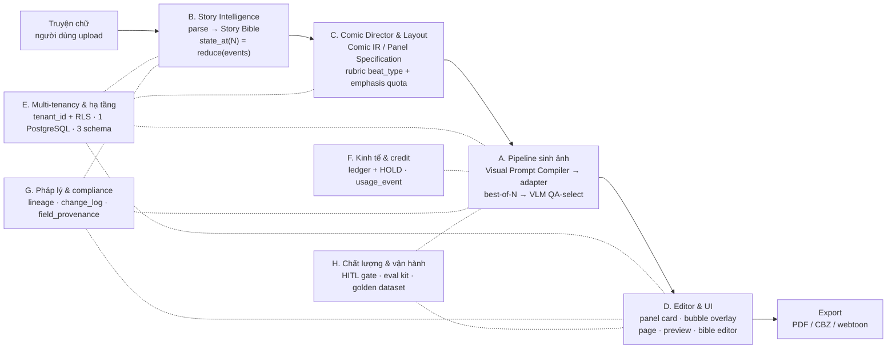

# 📐 SRS — Comic Studio (Software Requirements Specification)

Implements: [PRD-Comic-Studio](./PRD-Comic-Studio.md)

> [!IMPORTANT]
> Tài liệu này khẳng định **những gì đã được quyết** ở tầng Planning/Analysis và **không đảo được rẻ**. Mọi chi tiết hiện thực còn lại (DDL đầy đủ, API contract, thuật toán, tham số hoá, lựa chọn vendor) **đã được đặc tả tại tầng 030-Specs** — tầng đó đã tồn tại, nên SRS này **được phép link** vào `ADR-001`…`ADR-004` ở **những hàng đã được đóng**.

## Mục lục

1. [Introduction](#1-introduction)
2. [Overall Description](#2-overall-description)
3. [System Features](#3-system-features)
4. [External Interface Requirements](#4-external-interface-requirements)
5. [Other Non-functional Requirements](#5-other-non-functional-requirements)
6. [Negative requirements — những gì đã bị CẮT HẲN](#6-negative-requirements--những-gì-đã-bị-cắt-hẳn)
7. [Tài liệu tham khảo](#7-tài-liệu-tham-khảo)

---

## 1. Introduction

### 1.1 Purpose

Tài liệu này là **hợp đồng kỹ thuật** của `comic-studio` — nền tảng SaaS multi-tenant biến truyện chữ thành comic. Độc giả đích là **chính Founder ở vai architect, tại thời điểm viết dòng code đầu tiên**: dự án hiện **chưa có dòng code nào** (`CF-1.3` `[OFF]`), nên mọi ràng buộc dưới đây còn cơ hội được làm đúng ngay từ migration số 1.

Mục tiêu của tài liệu:

1. **Cố định các quyết định không backfill được** — `tenant_id`, provenance, credit hold, khoá thời gian. Đây là nhóm *rẻ khi làm từ đầu, không thể sửa về sau*.
2. **Ghi ra tường minh những gì đã bị cắt** (mục 6), để một khoảng trống trong tài liệu không bị đọc thành *"chưa quyết"*.
3. **Không lấn sang tầng design** — SRS **dẫn chiếu** quyết định của 030-Specs (được phép link tới `ADR-001`…`ADR-004` ở những hàng đã đóng), nhưng **không tự ra quyết định thay** tầng đó.

### 1.2 Document Conventions

#### a. Hai hệ nhãn **TRỰC GIAO** — không thay thế nhau

Đây là chỗ tài liệu này dễ bị đọc sai nhất. Mỗi hàng requirement mang **hai** loại nhãn độc lập:

| Hệ nhãn | Đo cái gì | Các giá trị |
|---|---|---|
| **Nhãn nguồn** | **Chất lượng bằng chứng** | `[OFF]` official/paper gốc · `[BCN]` báo cáo ngành có tên firm · `[TC]` nguồn thứ cấp · `[EM]` **ước lượng, KHÔNG phải số đo** · `[CHỐT]` quyết định của Founder tại gate |
| **Mức độ rắn** | **Độ cứng của quyết định** | **CHỐT** đã quyết, không mở lại · **MẶC ĐỊNH** đã chọn nhưng có đường lui ghi rõ · **CHƯA QUYẾT** → phải ghi `TBD` |

> [!WARNING]
> **Một caveat về bằng chứng KHÔNG làm lỏng quyết định.**
> Ví dụ điển hình: trần **≤3 nhân vật/panel** (`SRS-FR-08`) là quyết định **CHỐT** (`Charter §7 C3`), trong khi bằng chứng vẫn mang caveat `CF-6.4` — *"không benchmark độc lập nào đo frontier model ở 2–3 nhân vật"* ⇒ MVP0 phải tự đo. Hai điều này cùng đúng: **cơ chế đã chốt, phần cần đo lại thì đo lại.**

Hệ quả về cách viết: **khi copy một con số, copy cả nhãn nguồn** — nhãn `[EM]` phải đi theo con số qua mọi phép tính; bỏ nhãn khi nhân một ước lượng sẽ **rửa sạch** khoảng trống và biến giả định thành sự thật đo được (`Glossary` mục *nhãn nguồn*).

#### b. Tám hàng **LAI** — cơ chế CHỐT, tham số bên trong chưa quyết

`SRS-FR-20` · `SRS-FR-23` · `SRS-FR-26` · `SRS-NFR-17` · `SRS-NFR-20` · `SRS-NFR-07` · `SRS-NFR-08` · `SRS-NFR-09`. Cách đọc đúng: **cơ chế đã khẳng định**, `TBD` **chỉ áp cho tham số**. Không hàng nào trong tám hàng này bị hạ xuống `TBD` toàn phần, và **không tham số nào được tự chọn giúp**.

#### c. Quy ước anchor

`MVP-Scope §3 E1` = hàng `E1` bảng MVP vs Full Scope · `MVP-Scope §6 KC-5` = hàng danh sách cứng · `Analysis §5.7 #1` = mục con của Analysis · `CF-x.y` = hàng bảng Canonical Facts · `R-nn` = hàng Risk Log · `Charter §7 C3` = hàng ràng buộc Charter · `GP-n` = hàng nhóm compliance (⛔ **không viết tắt `G1` cho `GP-1`** — `G0`/`G1`/`G2` là **gate**, `CẤM-14`).

#### d. Ranh giới SRS ↔ 030-Specs

> **SRS khẳng định đúng những gì đã được quyết và KHÔNG đảo được rẻ — dưới dạng requirement hoặc design constraint *kiểm chứng được*, kèm anchor + nhãn, kể cả khi buộc phải nêu tên cơ chế.**

⚠️ **Không dùng phép chia "WHAT vs HOW"** — nó sai ở đúng repo này. `FOR UPDATE SKIP LOCKED` (`SRS-FR-25`) và storage key `tenant/{tenant_id}/{sha256}` (`SRS-FR-02`) đều là *"how"*, nhưng **phải** ở trong SRS, vì retrofit sau là **migration xuyên hệ thống**.

✅ **Tài liệu này được phép link tới `docs/030-Specs/`** ở **những hàng đã được đóng bằng ADR** (`ADR-001`…`ADR-004`). Tầng đó **đã tồn tại và đã ra quyết định**; những chỗ **chưa** có ADR đóng vẫn được viết dạng văn bản thuần, ⛔ không link để tránh trỏ vào chỗ chưa có nội dung.

#### e. Ba lệnh cấm số học áp cho toàn tài liệu

| # | Lệnh cấm | Nguồn |
|---|---|---|
| **CẤM-01** | ⛔ **CẤM TRỪ `CF-6.8` CHO `CF-6.7`** — hai mẫu số khác nhau (công cụ cá nhân vs SaaS). `50–60% − 20–25%` là **sai số học**, tạo ra một con số không tồn tại | `MVP-Scope §5.1` |
| **CẤM-03** | ⛔ **CẤM lấy chất lượng của N=3 mà tính chi phí của N=2.** Hạ N ⇒ phải chạy lại **G1**, không phải chỉ G2 | `CF-3.2` `[OFF]` |
| **CẤM-04** | ⛔ **CẤM dùng `$12,06` như chi phí thực tế mà không nêu nó là SÀN** | `Charter §7 C7` |

Hai định nghĩa canon phải dùng nguyên nghĩa ở mọi chỗ trong tài liệu:

- **best-of-N (N=3)**: sinh **N phương án** cho **MỌI** panel rồi chọn cái tốt nhất. ⚠️ **Phân biệt tuyệt đối với retry-on-failure** — best-of-N là mặc định của mọi panel, không phải chỉ khi panel lỗi. Nhầm hai khái niệm là nguồn của sai số chi phí **+50%** và của hold reserve sai (1 thay vì 3 credit/panel) (`Glossary`, `CẤM-03`).
- **Continuity Checker**: **QA-based selection giữa N candidate** — trả lời *"trong N cái này, cái nào consistent hơn"*, **không** phải *"panel này đúng hay sai"*. Nghĩa cũ (gắn nhãn ✓/✗ từng attribute rồi autofix) **đã bị bác**; `Glossary` ghi *"Mọi tài liệu mới phải dùng nghĩa sau"* (`CẤM-12`).

### 1.3 Project Scope

**Trong phạm vi SRS này**: toàn bộ 8 module `A`–`H` của `MVP-Scope §3`, ở mức requirement đã được quyết — pipeline sinh ảnh, Story Intelligence, Comic Director & Layout, editor tối thiểu, multi-tenancy & hạ tầng, kinh tế & credit, pháp lý & compliance, chất lượng & vận hành.

**Ngoài phạm vi**:

| Ngoài phạm vi | Vì sao |
|---|---|
| Lựa chọn vendor (auth / billing / object storage), hosting / PaaS / region, ngôn ngữ & framework | Không tài liệu nào quyết. Chọn giúp ở SRS làm tầng design mất quyền quyết định thật và tạo một *"quyết định"* không ai chịu trách nhiệm ⇒ `TBD` tại tầng 020 (mục 5.2), **đã được đặc tả tại tầng 030-Specs** ([ADR-001](../030-Specs/Architecture/ADR-001-Backend-And-Frontend-Tech-Stack.md)…[ADR-004](../030-Specs/Architecture/ADR-004-Object-Storage-Vendor-And-Signed-URL.md)); riêng **vendor billing** vẫn `TBD` |
| DDL đầy đủ, API contract, thuật toán chi tiết, error taxonomy, retry policy per provider | Thuộc tầng design — **sẽ được đặc tả tại tầng 030-Specs** |
| Requirement cho phân khúc **hoạ sĩ**, subscription phẳng unlimited, free tier *"100 ảnh/ngày"* | ⛔ `CẤM-17` — `CF-1.5` `[CHỐT]` phân khúc là **tác giả truyện chữ không biết vẽ**; `CF-2.7` cấm hai mô hình giá kia dưới bất kỳ dạng nào |

**Ràng buộc bao trùm** (`CF-1.2` `[CHỐT]`): đội **1 người + AI assist**, không funding. Mọi requirement phải chia được cho một người, và mọi thứ ở đây được chọn theo tiêu chí *cắt cái đắt-mà-không-kiểm-chứng-được, giữ cái rẻ-mà-không-backfill-được* (`MVP-Scope §2 NT-3`).

---

## 2. Overall Description

### 2.1 Product Perspective

`comic-studio` là **SaaS thương mại multi-tenant** — nền tảng cho **người khác tự upload truyện của họ** (`CF-1.1` `[CHỐT]`), không phải công cụ cá nhân. Đặc điểm này là nguồn của phần lớn ràng buộc trong tài liệu: nó thêm khối multi-tenancy, billing, auth, moderation vào mẫu số effort, và nó làm nghĩa vụ pháp lý (bảo hộ bản quyền cho tác phẩm **của khách hàng**, miễn trừ trung gian) trở thành requirement hạng nhất chứ không phải mục *"nice to have"*.

Chuỗi giá trị của hệ thống, theo đúng thứ tự phụ thuộc:

Nguyên tắc kiến trúc chi phối toàn bộ: **spec là dữ liệu chính, ảnh chỉ là output/cache** (`SRS-FR-07`). Nó là lý do đổi render granularity per-panel ↔ whole-page **không đổi data model** (`SRS-FR-33`).

Định vị cạnh tranh có hệ quả requirement: đối thủ mạnh nhất đánh trục **editor** (`CF-5.2`/`CF-5.3` `[TC]`), `comic-studio` đánh trục **Story Bible + Timeline State + Continuity** ⇒ **không đua editor** (`R-18`, củng cố `CF-9.1`). Điều này biện minh cho toàn bộ mục 6.3.

### 2.2 User Classes and Characteristics

| Lớp người dùng | Đặc điểm | Hệ quả requirement |
|---|---|---|
| **Tác giả truyện chữ (writer) KHÔNG biết vẽ** — primary actor | `CF-1.5` `[CHỐT]`. Không có kỹ năng thị giác, không muốn học công cụ vẽ. Đo giá trị bằng câu *"trang này đọc có ổn không?"* (`CF-10.10`) | Là primary actor của **mọi** use case người dùng. Hai human gate (`SRS-FR-14`) và variant picker là hành động sáng tạo của lớp này |
| **Power user** (cùng lớp trên, mức dùng cao) | 1 chapter @N=3 = **180 ảnh** `[EM]` `CF-3.9`, vượt ngưỡng **~125 ảnh/tháng** `[TC]` `CF-2.5` **ngay ở chapter đầu tiên** | `SRS-FR-29` hard quota cưỡng chế **trước** enqueue; `SRS-FR-32` ba tầng ngay từ đầu |
| **Founder ở vai operator** | Đội **1 người**, `bus factor = 1`, **không có code review** (`CF-1.2` `[CHỐT]`) | Là lý do RLS là *"bảo hiểm rẻ nhất tồn tại"* (`SRS-NFR-01`), lý do lint rule chặn import chéo (`SRS-NFR-04`), lý do guardrail đặt ở **tầng DB** chứ không ở code (`SRS-NFR-14`) |
| **Chủ sở hữu quyền (bên ngoài)** — actor không có account | Gửi yêu cầu takedown | `SRS-FR-38`: công cụ tiếp nhận + đầu mối đã đăng ký + SLA **72 giờ** `[OFF]` `CF-7.6` |
| ⛔ **KHÔNG phải người dùng đích: hoạ sĩ** | `CẤM-17` (`CF-1.5` + `CF-5.6`) | Cấm đặt requirement cho phân khúc này. Positioning **disclosure-first** là **ràng buộc phân phối**, không phải lựa chọn đạo đức (`Glossary`) |

### 2.3 Operating Environment

| Thành tố | Trạng thái đã quyết | Anchor |
|---|---|---|
| Kiến trúc triển khai | **Modular monolith**: 1 process · 1 PostgreSQL · 3 schema (`story`/`comic`/`generation`), module boundary bằng package + interface — **không HTTP nội bộ** | `SRS-NFR-02` |
| Worker | Process triển khai **riêng, cùng codebase** — hai entrypoint (`api`, `worker`) trên cùng image, khác command | `SRS-NFR-03` |
| Job queue | **Trong PostgreSQL**, không broker ngoài | `SRS-FR-25` |
| Object storage | Tách khỏi DB **từ ngày đầu**, key `tenant/{tenant_id}/{sha256}`, signed URL có hạn | `SRS-FR-02` |
| Compute sinh ảnh | **Không mua GPU** — API cho main path; self-host chỉ cho LoRA train, upscale, inpainting | `SRS-NFR-11` |
| Vector search | `pgvector` **không bị cấm** nhưng ❌ trong toàn horizon MVP0–MVP4; ở MVP dùng **Story Bible là index của mình** + PostgreSQL full-text search | mục 6.2 |
| Hosting / PaaS / container platform / region | **Container PaaS được quản lý** (⛔ không Kubernetes) · **một image → hai process type** · **managed PostgreSQL có PITR + restore đã diễn tập** · **ĐÚNG MỘT region** gần Việt Nam nhất · portability guardrail (**CHỐT**) — cụ thể **Render, region Singapore** (**MẶC ĐỊNH**, thang đường lui 3 bậc) — [ADR-002](../030-Specs/Architecture/ADR-002-Hosting-Platform-And-Region.md) | `SRS-NFR-07` |
| Ngôn ngữ / framework backend & frontend | **TypeScript trên Node.js LTS** — một ngôn ngữ cho API, worker và frontend (**CHỐT**) · **NestJS** · **Drizzle** dùng như query builder trên `node-postgres` · **Vite + React + TS + TanStack Query + shadcn/ui + Tailwind** (**MẶC ĐỊNH** — ba hạng mục này có đường lui ghi rõ) · **pnpm workspace** + **ESLint boundary rule** (**MẶC ĐỊNH**, ⛔ chưa ghi đường lui) — [ADR-001](../030-Specs/Architecture/ADR-001-Backend-And-Frontend-Tech-Stack.md) | `SRS-NFR-09` |
| Multi-region | **Hoãn** khỏi horizon | `SRS-NFR-26` |

> [!NOTE]
> **MVP0 không có database** (`MVP-Scope §3` hàng `A5` = ❌, `§3.1`). Đây là chủ ý: *"code của spike KHÔNG phải nền của sản phẩm"*. Mọi ràng buộc schema trong tài liệu này áp từ **MVP1** trở đi; MVP0 chỉ ghi tay ra CSV/file để đủ dữ liệu đo. ⛔ Không dùng tên khác cho MVP0 — không *"phase 0"*, không *"spike"*, không *"PoC"* (`CẤM-11`).

---

## 3. System Features

> **Tổ chức**: theo đúng phân rã module **A–H** của `MVP-Scope §3` — **không tạo taxonomy thứ hai**.
>
> **Ghi chú về việc đặt hàng vào module** (để mọi hàng đều truy được): `findings/architect.md §2` gộp **B + C** vào một bảng và **không có bảng riêng cho D**. SRS này tách B / C / D theo taxonomy A–H, **không tạo id mới** — mỗi hàng được đặt vào module theo **anchor `MVP-Scope §3` của chính nó** (ví dụ `SRS-FR-11` anchor `A2` ⇒ module A). Bảng audit ở [mục 3.9](#39-audit-đếm-hàng) chứng minh không hàng nào bị rơi.
>
> **Cột `Mức độ rắn` được copy nguyên trạng** từ `findings/architect.md §2`, kể cả phần mô tả đường lui — đường lui là **một phần của nhãn**.

### A. Pipeline sinh ảnh

Module này ánh xạ 1:1 sang [BRD-001-Image-Generation-Pipeline](./BRD/BRD-001-Image-Generation-Pipeline.md) (hàng `A1`–`A7` của `MVP-Scope §3`).

| id | Phát biểu requirement | Đã quyết ở đâu | Mức độ rắn |
|---|---|---|---|
| **SRS-FR-11** | **Chữ đi qua typeset layer riêng**: art sinh **KHÔNG có chữ** (`text, letters, watermark, speech bubble` vào negative prompt), bubble là **layer dữ liệu riêng** với toạ độ **chuẩn hoá 0–1** (cùng dữ liệu render được thumbnail và bản in 300 DPI), **không nướng vào ảnh** | `Charter §4 R2` · `MVP-Scope §3 A2` (`CF-8.11c`) · `Analysis §5.4` | **CHỐT** |
| **SRS-FR-17** | **Visual Prompt Compiler là code deterministic — KHÔNG có LLM ở runtime.** Bản chất: tra bảng `field value → cụm từ`, sắp thứ tự, dedup, xử lý xung đột theo **precedence ladder**, thực thi **constraint budget**, ghi **drop log** (`generation.degradations JSONB`) | `MVP-Scope §3 A3` · `Glossary` mục *Visual Prompt Compiler* · `Analysis §5.5` · `Charter §4 R8` | **CHỐT** — và là **điều kiện cần** để bảng `Generation` có nghĩa |
| **SRS-FR-18** | Compiler xuất **HAI** output: `text_prompt` **và** `conditioning_set`. Identity reference **không được** cạnh tranh với mô tả cảnh trong cùng một chuỗi text | `Analysis §5.5` | **CHỐT** |
| **SRS-FR-19** | LLM chỉ được xuất hiện trong compiler ở **hai chỗ hẹp**, và **phải cache**: (a) soạn từ vựng **offline** một lần → người review → **lưu vào bảng** (là dữ liệu, không phải runtime); (b) dịch action tự do → cụm pose khi từ vựng chưa có entry, **cache theo hash của action text**. Ngoài hai việc đó: không có LLM trong compiler | `Analysis §5.5` | **CHỐT** |
| **SRS-FR-20** | **best-of-N**: generate **N candidate cho MỌI panel** rồi VLM QA-select 1. ⚠️ **KHÔNG phải retry-on-failure.** N mặc định = **3** | `Charter §7 C8` `[OFF]` `CF-3.1`, `CF-3.2` · `MVP-Scope §3 A1` · `Glossary` mục *best-of-N (N=3)* | **LAI** — Cơ chế **CHỐT** · giá trị **N = 3** là **MẶC ĐỊNH**, đường lui ghi rõ: `CF-8.5` đặt *"N tối thiểu"* là **một trong ba chỉ số bắt buộc MVP0 phải đo**, mỗi bậc N giảm được là **~33% COGS**. ⚠️ **Budget** thì vẫn phải ở **N=3** (`Charter §4 R7`) |
| **SRS-FR-21** | **Continuity Checker = QA-based selection giữa N candidate**, output là **hàng đợi review được xếp hạng**. Cắt hẳn `[Fix automatically]`; phiên bản hợp lệ là **"Tạo lại với ràng buộc được nhấn mạnh"** — giữ **cả hai** version, hiển thị side-by-side, **người chọn**, không bao giờ tự áp dụng. `unclear` là câu trả lời hợp lệ **hạng nhất** | `Glossary` mục *Continuity Checker* (*"Mọi tài liệu mới phải dùng nghĩa sau"*) · `MVP-Scope §3 H3` · `CF-8.10` · `Analysis §5.2` | **CHỐT** |
| **SRS-FR-22** | Hệ thống **phải hiện tường minh độ phủ của checker** cho user: *"đã kiểm N/M panel, M−N panel không kiểm được vì có nhiều nhân vật"* | `Charter §8 A9` `[EM]` `CF-6.11` · `Analysis §5.2` (*"đây không phải chi tiết kỹ thuật mà là yêu cầu giao tiếp sản phẩm"*) | **CHỐT** — đây là **FR minh bạch**, **không phải** chỉ tiêu chất lượng |
| **SRS-FR-23** | **Adapter per image provider** là seam bắt buộc (một interface, nhiều provider: Gemini 3 Pro Image, FLUX.2); **pin model version tường minh** trong config | `MVP-Scope §3 A4` · `Analysis §6.2` seam #4 · `R-22` | **LAI** — Seam **CHỐT** · provider chính là **MẶC ĐỊNH**: Gemini batch mặc định, **đường lui đã ghi rõ** là FLUX.2 pro `$0.03` `[OFF]` (`R-10`, `R-22`) |
| **SRS-FR-24** | Dùng **batch API**, không realtime API — comic generation vốn là async job queue nên batch là fit tự nhiên | `Analysis §9` (*"khoản tiết kiệm lớn nhất mà không đánh đổi gì"*) | **MẶC ĐỊNH** — đường lui ghi rõ: `CF-3.11` lấy **giá standard** làm trần an toàn cho MVP0 *"vì cần vòng lặp nhanh nên batch khó dùng"* |
| **SRS-FR-25** | **Job queue nằm TRONG PostgreSQL**, claim bằng `SELECT ... FOR UPDATE SKIP LOCKED`; **transactional enqueue**: `INSERT generation` + `INSERT job` trong **một** transaction ⇒ **không bao giờ có job mồ côi** | `MVP-Scope §3 A5` · `Analysis §6.2` | **CHỐT** |
| **SRS-FR-26** | Câu **CLAIM job phải chứa** điều kiện fairness per tenant: `in_flight_per_tenant < N` — nhồi vào sau là sửa lại đúng câu SQL nóng nhất | `MVP-Scope §3 A6` · `Analysis §6.2` bảng seam kinh tế | **LAI** — Cơ chế **CHỐT** · giá trị **N**: **CHƯA QUYẾT** → `TBD` (**không con số nào trong repo**) |
| **SRS-FR-27** | Prop quan trọng đưa vào **reference image như một entity riêng**, không mô tả bằng chữ trong prompt | `R-13` (mitigation, status `accepted`) · `CF-6.3` `[OFF]` Props **4.19/5** là metric thấp nhất | **CHỐT** |
| **SRS-NFR-11** | **Không mua GPU.** API cho main path; self-host chỉ cho LoRA train, upscale, inpainting | `Analysis §9` | **CHỐT** |

> [!CAUTION]
> **Mục tiêu của bảng `Generation` là AUDITABILITY + LINEAGE, KHÔNG phải reproducibility.** Reproducibility bit-exact không đạt được: nhiều API không cho set seed, và provider cập nhật weights dưới cùng một tên model (silent model drift). Bảng phải trả lời được *"ảnh này sinh ra từ spec nào, ref nào (hash gì), tham số gì, tốn bao nhiêu, ai approve"*. **`seed` là provenance metadata, không phải replay key** (`Analysis §6.4`).

> **Ràng buộc thứ tự pipeline** (không phải hàng mới, nhắc lại để đọc module A không mất ngữ cảnh): `SRS-FR-06` (chapter parse + text clean) là bước **đầu tiên**; `SRS-FR-15` đặt dialogue condensation **sau** layout.

### 3.B. Story Intelligence

Module này ánh xạ 1:1 sang [BRD-002-Story-Intelligence](./BRD/BRD-002-Story-Intelligence.md) (hàng `B1`–`B5`).

| id | Phát biểu requirement | Đã quyết ở đâu | Mức độ rắn |
|---|---|---|---|
| **SRS-FR-04** | **Thay hẳn `(chapter, scene)`** làm khoá thời gian bằng: hai trục tách bạch `reading_order` / `story_order` (`NUMERIC` **sparse**, bước nhảy **1000**, **editable qua UI**); `timeline_id` có `kind` (`main`/`flashback`/`parallel`/`dream`) + `anchor_order`; state neo vào `Event` **mức scene** (cho phép chia nhỏ bằng `beat_no`), **không** mức chapter | `MVP-Scope §3 B4` (*"phải sửa trước dòng code đầu tiên"*) · `Analysis §5.1` · `R-15` | **CHỐT** |
| **SRS-FR-05** | Story Bible state là **hàm thuần** trên event: `state_at(N) = reduce(events where story_order <= N)`. LLM chỉ phát **event** (`entity, attribute, value, permanence, evidence_span, confidence`) cho **một** chapter; **code sở hữu state** | `MVP-Scope §3 B3` · `Analysis §5.5` | **CHỐT** |
| **SRS-FR-06** | **Chapter parse + text clean là bước ĐẦU TIÊN** của pipeline, và là **code deterministic** (regex/heuristic), **không LLM** | `MVP-Scope §3 B1` · `CF-8.7` · `Analysis §5.5` | **CHỐT** |
| **SRS-NFR-10** | **Một** hàm `resolveState(entity, at_event)` duy nhất cho mọi query state, cộng test guardrail: **không được có `ORDER BY chapter_no`** trong bất kỳ đường dẫn resolve state nào | `Analysis §5.1` điểm 6 · `R-15` cột trigger (*"hoặc có nhiều hơn một hàm truy vấn state trong codebase"*) | **CHỐT** |

> **Lý do `SRS-FR-04` không thể hoãn**: hai trục thời gian là **syuzhet** (thứ tự người đọc gặp) vs **fabula** (thứ tự sự kiện thực sự xảy ra). Dùng `(chapter, scene)` làm khoá **sai âm thầm ở mọi flashback** — lỗi không báo, chỉ ra kết quả sai (`Glossary` mục *syuzhet vs fabula*).
>
> **Ràng buộc kiểm chứng được, dừng ở đó**: bảng `event` phải có hai trục thời gian tách bạch, trong đó trục dùng cho **mọi** as-of state query là `story_order` kiểu `NUMERIC` sparse và editable. **DDL đầy đủ sẽ được đặc tả tại tầng 030-Specs.**

### 3.C. Comic Director & Layout

Module này ánh xạ 1:1 sang [BRD-003-Comic-Director-And-Layout](./BRD/BRD-003-Comic-Director-And-Layout.md) (hàng `C1`–`C7`; `C4` = ❌ cắt hẳn, xem [mục 6.1](#61-cắt-hẳn--loại-khỏi-thiết-kế-không-mở-lại)).

| id | Phát biểu requirement | Đã quyết ở đâu | Mức độ rắn |
|---|---|---|---|
| **SRS-FR-07** | Comic IR (Comic Intermediate Representation) / Panel Specification: **spec là dữ liệu chính, ảnh chỉ là output/cache**. Panel spec **tách khỏi granularity render** — một page compile được nhiều panel spec thành một prompt | `MVP-Scope §3 C1` · `Analysis §9b.3` | **CHỐT** |
| **SRS-FR-08** | **Cứng hoá trần ≤3 nhân vật/panel trong schema Comic IR** (constraint + validation), **không** phải guideline trong prompt. Cảnh đông người giải bằng shot xa / silhouette / crop | `Charter §7 C3` `[OFF]` `CF-6.5` · `Charter §4 R1` · `MVP-Scope §3 C5` · `R-12` | **CHỐT** *(bằng chứng mang caveat `CF-6.4`: không benchmark độc lập nào đo frontier model ở 2–3 nhân vật ⇒ MVP0 phải tự đo — caveat này **không** làm lỏng quyết định)* |
| **SRS-FR-09** | Layout quyết định bằng **rubric `beat_type` rời rạc** (enum có anchor example) + `dialogue_density` **do code đếm** + `character_count` **do code đếm** → **bảng tra deterministic**; cộng **emphasis budget theo phạm vi chapter**. LLM chỉ **xếp hạng** beat trong chapter, code phân bổ theo quota | `MVP-Scope §3 C3` · `CF-9.3` · `Analysis §5.3` (A)+(B) | **CHỐT** về cơ chế |
| **SRS-FR-13** | `text_safe_zone` + `text_budget` + `negative_space_hint` là **field của panel spec**, và Visual Prompt Compiler **phải truyền yêu cầu chỗ trống xuống prompt** — ràng buộc đi **ngược** từ typesetting vào compiler | `MVP-Scope §3 C6` (`CF-8.8`) · `Analysis §5.4` lý do 2 | **CHỐT** |
| **SRS-FR-14** | **Hai human gate bắt buộc**: (1) speaker attribution, (2) dialogue condensation. **Không phải tuỳ chọn, không dồn sang MVP4.** Kèm: anchor deterministic bằng regex **trước** LLM; LLM bị **constrained** vào tập nhân vật có mặt trong scene; `UNKNOWN` là giá trị **hợp lệ**; lưu `speaker_confidence` và **hiện cờ trong UI khi thấp** | `MVP-Scope §3 C7` · `CF-8.8` · `Analysis §5.4b` | **CHỐT** |
| **SRS-FR-15** | Thứ tự pipeline: **dialogue condensation nằm SAU layout**, vì `text_budget` phụ thuộc diện tích panel | `Analysis §5.4` (*"Thứ tự trong §17 làm sai chỗ này"*) | **CHỐT** |

> [!NOTE]
> **Căn cứ của `SRS-FR-14` là một ước lượng, không phải một chỉ tiêu.** Speaker attribution lỗi **30–50%** (3+ người) / **40–60%** (câu ngắn) — `CF-6.10` `[EM]`, **ước lượng, KHÔNG phải số đo**. Con số này **biện minh cho việc có human gate**; nó **không** được viết thành NFR chỉ tiêu (xem [mục 5.3](#53-hai-con-số-em-không-được-nâng-thành-nfr-chỉ-tiêu)).

### 3.D. Editor & UI

Module này ánh xạ 1:1 sang [BRD-004-Minimum-Editor](./BRD/BRD-004-Minimum-Editor.md) (hàng `D1`–`D7`; `D2`–`D5`, `D7` hoãn và `D6` = ❌ cắt hẳn, xem [mục 6](#6-negative-requirements--những-gì-đã-bị-cắt-hẳn)).

| id | Phát biểu requirement | Đã quyết ở đâu | Mức độ rắn |
|---|---|---|---|
| **SRS-FR-10** | User đổi layout template bằng **một click** — lối thoát khi rubric chấm sai | `Analysis §5.3` (D) (*"luôn phải có"*) | **CHỐT** |
| **SRS-FR-12** | **Hai** field cho thoại, không phải một: `dialogue_source` (nguyên văn + `source_span`, **bất biến**) và `dialogue_rendered` (bản đã nén, người sửa được, và **edit của người phải khoá lại** khỏi bị re-run ghi đè) | `Analysis §5.4` | **CHỐT** |
| **SRS-FR-16** | Auto-placement bubble **phải tự build**; ở MVP là heuristic (gần speaker, tránh vùng có mặt, thứ tự đọc) + **cho user kéo tay**. Wrap tiếng Việt phải dùng thư viện hiểu Unicode combining marks | `Analysis §5.4` · `R-18` (không cạnh tranh ở typesetting) | **CHỐT** |
| **SRS-NFR-06** | Cập nhật trạng thái job cho client bằng **polling 2 giây**, không WebSocket | `Analysis §6.2` | **MẶC ĐỊNH** — đường lui ghi rõ trong chính lý do: *"generation mất hàng chục giây, polling là quá đủ"* ⇒ tiền đề đảo (generation nhanh hơn nhiều) thì mở lại được |

**Phạm vi editor tối thiểu** — năm thành phần BẮT BUỘC (`MVP-Scope §5.2`, `~20–25%` effort `[EM]`, **mẫu số SaaS**): (1) **Panel card** form spec + preview + `Regenerate` + **variant picker**; (2) **Bubble/text overlay editor trong phạm vi MỘT panel**; (3) **Page**: chọn template layout, đổi chỗ / swap / reorder panel; (4) **Preview trang + chapter render server-side** (read-only); (5) **Story Bible editor**. ⚠️ Con số `~20–25%` là `[EM]` `CF-6.7` — **`CẤM-01`: không trừ nó cho `CF-6.8`**.

> [!IMPORTANT]
> **Hai ràng buộc thiết kế của module D — anchored, nhưng KHÔNG phải hàng mới trong bảng 68 hàng của `findings/architect.md §2`:**
>
> 1. **Mọi hành động của người dùng trong editor phải sinh một `change_log` row** — kể cả hành động chỉ là *"chọn ảnh này thay vì ảnh kia"* (`MVP-Scope §5.2` callout). Đây là điều kiện làm cho việc cắt canvas **hợp pháp**; không có nó thì cắt canvas trở thành cắt luôn lá chắn pháp lý. Requirement mang id là `SRS-FR-35`.
> 2. **Layout lưu bằng toạ độ chuẩn hoá 0–1 trong `page_layout JSONB`** ngay từ MVP (`MVP-Scope §4.1`, `CF-9.1`) — đường nâng cấp lên canvas về sau **không phải migrate**. Cùng dữ liệu render được thumbnail và bản in 300 DPI (`SRS-FR-11`). Mức độ rắn: **CHỐT**.
>
> Requirement liên quan nằm ở module khác, dẫn chiếu để không lặp nội dung: variant picker & side-by-side người chọn (`SRS-FR-21`), công bố độ phủ checker (`SRS-FR-22`), hai human gate (`SRS-FR-14`), cơ chế cho user nhận biết đang tương tác với hệ thống AI (`SRS-FR-40`).

### 3.E. Multi-tenancy & hạ tầng

Module này ánh xạ 1:1 sang [BRD-005-Multi-Tenancy-And-Platform](./BRD/BRD-005-Multi-Tenancy-And-Platform.md) (hàng `E1`–`E8`; `E6` = ❌ cắt hẳn, xem [mục 6.1](#61-cắt-hẳn--loại-khỏi-thiết-kế-không-mở-lại)).

| id | Phát biểu requirement | Đã quyết ở đâu | Mức độ rắn |
|---|---|---|---|
| **SRS-NFR-01** | `tenant_id NOT NULL` trên **MỌI** bảng nghiệp vụ, là **cột ĐẦU TIÊN** của mọi composite index, cộng **Postgres RLS** làm lớp phòng thủ thứ hai. Mô hình shared DB + shared schema — **không** schema-per-tenant, **không** db-per-tenant | `MVP-Scope §6 KC-5` (*"không mở ra thương lượng scope"*) · `MVP-Scope §3 E1` · `Analysis §5.7 #1` · `Charter §4` ba yêu cầu hạ tầng (`CF-8.7`) · `R-16` | **CHỐT** |
| **SRS-FR-01** | `tenant` / `user` / `membership` là **ba entity riêng** ngay từ đầu, kể cả khi quan hệ là 1:1. Mọi dữ liệu nghiệp vụ trỏ `tenant_id`, **không** trỏ `user_id` | `MVP-Scope §3 E2` · `Analysis §5.7 #2` | **CHỐT** |
| **SRS-NFR-02** | Modular monolith: **1 process**, **1 PostgreSQL**, **3 schema** (`story` / `comic` / `generation`), module boundary bằng package + interface — **không HTTP nội bộ** | `MVP-Scope §3 E5` · `MVP-Scope §4.2` (`CF-9.2`) · `Analysis §6.2` | **CHỐT** |
| **SRS-NFR-03** | Worker là **process triển khai riêng, CÙNG codebase** — hai entrypoint (`api`, `worker`) trên cùng repo/image, khác command. Yêu cầu vận hành: **worker chết mà API vẫn sống** | `MVP-Scope §3 E7` · `Analysis §6.2` bảng seam kinh tế | **CHỐT** |
| **SRS-NFR-04** | Lint rule **cấm import chéo module**: `comic` gọi `story` qua **DUY NHẤT** `resolveState()` và `getBible()` | `Analysis §6.2` seam #3 | **CHỐT** |
| **SRS-FR-02** | Object storage **tách khỏi DB từ ngày đầu** (không bao giờ lưu ảnh blob trong Postgres); key **`tenant/{tenant_id}/{sha256}`**, content-address **TRONG phạm vi tenant**, **KHÔNG dedup chéo tenant**; signed URL có hạn, **không bao giờ** public bucket | `MVP-Scope §3 E3` · `Analysis §5.7 #4` | **CHỐT** |
| **SRS-FR-03** | **Mua** auth và billing, **không tự viết** | `MVP-Scope §3 E4` · `Analysis §5.7` (*"tự viết auth là cách nhanh nhất để một dev đốt hai tháng và vẫn có lỗ hổng"*) | **CHỐT** |
| **SRS-NFR-05** | Kỷ luật `ON DELETE CASCADE` + **một đường hard-delete tenant đã kiểm thử**, tách biệt khỏi soft-delete của takedown | `MVP-Scope §3 GP-5` · `Analysis §5.7 #5` | **CHỐT** |
| **SRS-NFR-07** | Hosting / PaaS / container platform / region đặt máy [ADR-002](../030-Specs/Architecture/ADR-002-Hosting-Platform-And-Region.md) (tầng 030). Trước đó tầng 010/020 **không anchor được** — phần đã quyết chỉ gồm: 2 entrypoint 1 image (`E7`), worker riêng, **không mua GPU** (`Analysis §9`), multi-region hoãn (`E8`) | **LAI** — **CHỐT**: container PaaS **được quản lý** (⛔ không Kubernetes, ⛔ không tự quản VM cho main path) · build một lần → **một image → hai process type** cùng digest · scheduled job chỉ **gọi subcommand của chính image đó** · **managed PostgreSQL có PITR + backup tự động + một đường restore ĐÃ DIỄN TẬP** (điều kiện phát hành) · **đúng MỘT region** gần Việt Nam nhất · **portability guardrail** (⛔ không queue/pub-sub vendor, ⛔ không SDK secret manager — cấu hình **chỉ** qua biến môi trường, ⛔ chỉ tập con S3, log ra `stdout`/`stderr`, ⛔ không lưu trạng thái trên đĩa cục bộ) · **MẶC ĐỊNH**: **Render, region Singapore** — **thang đường lui ghi rõ**: `1.` Fly.io · `2.` GCP Cloud Run + Cloud SQL (`asia-southeast1`) · `3.` AWS ECS Fargate + RDS (`ap-southeast-1`); ⛔ **chưa mua** — 3 hạng mục phải verify trước khi mua · ⚠️ **Reopen trigger đã ghi trước**: nếu luật sư trả lời *"dữ liệu phải nằm trong lãnh thổ Việt Nam"* thì **cả `ADR-002` lẫn `ADR-004` phải mở lại** |
| **SRS-NFR-08** | Vendor cụ thể của auth / billing / object storage [ADR-003](../030-Specs/Architecture/ADR-003-Auth-And-Billing-Vendor-Selection.md) (auth, billing) · [ADR-004](../030-Specs/Architecture/ADR-004-Object-Storage-Vendor-And-Signed-URL.md) (object storage). Tầng 010 chỉ quyết *"mua"* (`MVP-Scope §3 E4`) và **key schema** (`E3`) | **LAI** — **CHỐT** (seam đổi vendor, đúng với MỌI vendor): vendor auth ⛔ **không** sở hữu `tenant` / `membership` / quyết định authorization · `user.external_auth_id` có `UNIQUE`, ⛔ không FK nghiệp vụ trỏ vào định danh vendor ⇒ **đổi vendor auth = remap ĐÚNG MỘT cột** · JWT verify qua **JWKS** chuẩn OIDC, ⛔ không SDK vendor trong đường xử lý request · ⭐ **custom claim của vendor ⛔ KHÔNG BAO GIỜ là nguồn sự thật cho `tenant_id` hay role** — tra từ bảng `membership` mỗi request · webhook là nguồn **SỰ KIỆN**, ⛔ không phải nguồn sự thật (verify chữ ký → inbox có khoá idempotency) · **vendor billing ⛔ KHÔNG sở hữu entitlement** — `credit_ledger` là nguồn sự thật duy nhất · ⛔ **không bao giờ chạm dữ liệu thẻ** · **MẶC ĐỊNH**: **auth = Clerk** (3 tiêu chí nghiệm thu spike; thang đường lui `1.` Auth0 · `2.` Supabase Auth / WorkOS · `3.` Keycloak/Ory self-host) và **object storage = Cloudflare R2** (thang đường lui `1.` AWS S3 · `2.` Backblaze B2 · `3.` object storage của chính PaaS) — ⛔ **cả hai đều CHƯA MUA**, còn hạng mục phải verify · ⭐ **CHƯA QUYẾT** → `TBD`: **vendor billing** — chặn bởi **quốc gia của pháp nhân bán hàng**, ⛔ **không phải** vì thiếu phân tích kỹ thuật; ⛔ không tài liệu nào trong repo trả lời. Ai đóng: **Founder** (quyết pháp nhân) + dev (verify khả dụng kỹ thuật) · Khi nào: **trước MVP3** — nhưng **seam phải có từ MVP1** (`D-62` cấm retrofit) |
| **SRS-NFR-09** | Ngôn ngữ / framework backend & frontend [ADR-001](../030-Specs/Architecture/ADR-001-Backend-And-Frontend-Tech-Stack.md) (tầng 030) — viết khi `src/`, `test/`, `openspec/changes/` **còn rỗng** (`CF-1.3` `[OFF]`), tức tại thời điểm chi phí đảo ngược thấp nhất | **LAI** — **CHỐT** (tầng CHỐT của `ADR-001` gồm 8 điều; ⭐ **ba điều dưới đây được `ADR-001` tuyên bố tường minh là KHÔNG có đường lui** — đổi chúng là viết ADR mới thay thế): **một ngôn ngữ duy nhất TypeScript trên Node.js LTS** cho API/worker/frontend · **migration SQL thô, đánh số, append-only là NGUỒN SỰ THẬT của schema** (⛔ không ORM sở hữu schema) · **API là hợp đồng duy nhất** giữa web và dữ liệu (SPA thuần, ⛔ không SSR, ⛔ không server action) · **MẶC ĐỊNH**: **NestJS** · **Drizzle** dùng như query builder trên `node-postgres` · **Vite + React + TS + TanStack Query + shadcn/ui + Tailwind** — **đường lui ghi rõ** ở `ADR-001` §*Đường lui* (lùi về Fastify · Kysely hoặc `pg` thuần · đổi riêng frontend). ⚠️ **pnpm workspace** và **ESLint boundary rule** cũng thuộc tầng MẶC ĐỊNH nhưng **⛔ CHƯA có đường lui ghi rõ** — ⛔ không đọc thành *"toàn bộ tầng MẶC ĐỊNH đều có đường lui"* · **CHƯA QUYẾT** → `TBD`: **phiên bản Node LTS pin cụ thể** (dev đóng ở commit đầu tiên) và **thư viện compositor + sinh PDF** (dev đóng ở spike MVP0) |

> [!WARNING]
> ⛔ **Không được viết `tenant isolation` thành *"filter theo `tenant_id` ở tầng ứng dụng"***. App-layer filter **sẽ có lúc bị lọt** — một query quên `WHERE tenant_id`. Với **1 dev không có code review**, **RLS biến lỗi lập trình thành no-op thay vì rò rỉ dữ liệu chéo tenant** (`Analysis §5.7 #1`). ⚠️ Giới hạn đã biết của RLS: **không** bảo vệ được join thực hiện phía application — đó chính là lý do tách 2 database bị cắt hẳn ([mục 6.1](#61-cắt-hẳn--loại-khỏi-thiết-kế-không-mở-lại)).
>
> Ba hàng trên **đã được đóng ở tầng 030-Specs** ([ADR-001](../030-Specs/Architecture/ADR-001-Backend-And-Frontend-Tech-Stack.md), [ADR-002](../030-Specs/Architecture/ADR-002-Hosting-Platform-And-Region.md), [ADR-003](../030-Specs/Architecture/ADR-003-Auth-And-Billing-Vendor-Selection.md), [ADR-004](../030-Specs/Architecture/ADR-004-Object-Storage-Vendor-And-Signed-URL.md)) — phần lớn ở mức **MẶC ĐỊNH**, ⛔ **không phải CHỐT**, và ⛔ **chưa vendor/platform nào được mua**. ⭐ **Phần duy nhất còn `TBD` thật là vendor billing** (`ADR-003`) — chặn bởi quyết định **quốc gia pháp nhân bán hàng** của Founder, ⛔ **không phải** bởi thiếu phân tích kỹ thuật. Ngoài ra `ADR-001` còn để mở hai tham số: **pin phiên bản Node LTS** và **thư viện compositor + sinh PDF**.

### 3.F. Kinh tế & credit

Module này ánh xạ 1:1 sang [BRD-006-Credit-And-Unit-Economics](./BRD/BRD-006-Credit-And-Unit-Economics.md) (hàng `F1`–`F6`).

| id | Phát biểu requirement | Đã quyết ở đâu | Mức độ rắn |
|---|---|---|---|
| **SRS-FR-28** | **Credit ledger append-only + HOLD trước khi enqueue** (check-rồi-gọi là **race condition**) + `CHECK (available >= 0)` **ở tầng DB** (chốt cuối, không bypass được bằng code) + **hold reaper** cho `expires_at`. **Hold reserve = N credit/panel** (N mặc định **3**, kế thừa `SRS-FR-20`), **không phải 1** | `MVP-Scope §6 KC-7` · `CF-6.12` · `Charter §4` ba yêu cầu hạ tầng · `R-14` | **CHỐT** |
| **SRS-FR-29** | **Hard quota cưỡng chế TRƯỚC khi enqueue**, không đếm sau, không cảnh báo sau | `MVP-Scope §3 F4` · `CF-8.11b` · `R-07` | **CHỐT** |
| **SRS-FR-30** | `usage_event` **append-only** + rollup `usage_daily`; billing/metric là **hàm tổng hợp trên event thô**, **không** counter tăng tại chỗ. **Regen ratio là metric first-class**, đo theo p50/p90 từ MVP0 | `MVP-Scope §3 F1` · `Analysis §5.7 #6` · `Analysis §6.2` bảng seam kinh tế | **CHỐT** |
| **SRS-FR-31** | `cost_usd` + `model_id` + `model_version` + `attempt_no` trên **MỌI** `generation`, từ **generation ĐẦU TIÊN** — dữ liệu lịch sử **không backfill được** | `MVP-Scope §3 F2` · `Analysis §5.7 #3` | **CHỐT** |
| **SRS-FR-32** | Kiến trúc billing + credit ledger + onboarding phải đỡ được **BA tầng ngay từ đầu, không retrofit**: tầng 1 **không có image gen** (không cần API key) · tầng 2 **credit pack không hết hạn** (managed inference) · tầng 3 **BYOK là tuỳ chọn MỞ KHOÁ**, không phải điều kiện dùng sản phẩm | `Charter §7 C2` `[CHỐT]` · `CF-2.1`–`CF-2.4` · `MVP-Scope §3 F5, F6` | **CHỐT** |
| **SRS-FR-33** | Render granularity: **per-panel** là mặc định (spec là đơn vị); **whole-page** là **đường lui đã thiết kế sẵn** và đổi được **không đổi data model** | `MVP-Scope §3 A7` (*"đường lui của G2"*) · `Analysis §9b.3` | **MẶC ĐỊNH** — đường lui tường minh, gắn vào gate `G2` |
| **SRS-NFR-12** | **Đừng dựa vào cache để cứu margin.** Hai chỗ ra tiền thật là **reference-sheet amortization** và **idempotency** | `CF-6.13` `[EM]` (hit rate **vài % → ~10%**, `architect` **tự khai là ước lượng**) · `R-17` status `accepted` | **CHỐT** |

> [!CAUTION]
> **Hai điều kiện làm cho `SRS-FR-28` có nghĩa, phải đọc cùng nhau:**
> - **Hold reserve phải là 3 credit/panel**, vì **N=3 là mặc định cho MỌI panel** (`CF-3.1` `[OFF]`), **không phải retry-on-failure** (`CF-3.2`). Reserve 1 credit rồi tính sau = **hợp lệ hoá số dư âm** (`MVP-Scope §6.1`).
> - **Thiếu hold reaper** ⇒ job crash sau khi hold thì hold treo **vĩnh viễn** ⇒ khách *"có credit mà không generate được"* — loại lỗi khó chẩn đoán nhất (`Glossary` mục *hold reaper*).
>
> **`SRS-FR-33` không được đọc thành "hạ N để cứu margin".** Đường lui khi `G2` FAIL là **đổi granularity**, không phải hạ N: `CF-10.7` ghi rõ đường **KHÔNG được đi** là hạ N từ 3 xuống 1, và `CẤM-03` buộc mọi thay đổi N phải chạy lại **G1**.

### 3.G. Pháp lý & compliance

Module này ánh xạ 1:1 sang [BRD-007-Legal-And-Compliance](./BRD/BRD-007-Legal-And-Compliance.md) (hàng `GP-1`–`GP-5`).

> [!IMPORTANT]
> **"Generation đầu tiên" theo nghĩa pháp lý = generation đầu tiên của SẢN PHẨM THẬT, tức MVP1.** MVP0 là spike bị vứt và **không có database** (`MVP-Scope §3` hàng `A5`, `§3.1`); ở MVP0 chỉ ghi tay ra CSV/file để đủ dữ liệu đo. Đọc *"phải có từ generation đầu tiên"* thành *"phải có ở MVP0"* là đọc sai.
>
> Và: `G0` / `BLOCKER-01` **chặn THƯƠNG MẠI HOÁ, KHÔNG chặn MVP0–MVP1** (`CẤM-10`, `Charter §9.2` gọi việc đọc sai điều này là *"cách hiểu nhầm đắt nhất"*).

| id | Phát biểu requirement | Đã quyết ở đâu | Mức độ rắn |
|---|---|---|---|
| **SRS-FR-34** | `parent_generation_id` (**nullable FK**) + `relation_kind ENUM('retry','variation','refine','continuity_fix')` — từ **migration số 1**, không phải backlog | `MVP-Scope §6 KC-1` · `CF-7.3` `[OFF]` · `CF-9.4` (PM run trước **tự thu hồi** khuyến nghị cắt) · `R-01` | **CHỐT** |
| **SRS-FR-35** | `change_log` append-only ghi **MỌI** hành động người dùng — kể cả *"chọn generation X thay vì Y"*, sửa thoại, đổi camera, kéo bubble. **Prompt một mình không chứng minh được *"decisive contribution"*** | `MVP-Scope §6 KC-2` · `CF-7.2` `[OFF]` NĐ 134/2026 Điều 5a | **CHỐT** |
| **SRS-FR-36** | `field_provenance` (mức **field**) + `generation.origin ENUM('ai','ai_edited','human')` | `MVP-Scope §6 KC-3` · `Glossary` mục *`field_provenance` / `change_log`* | **CHỐT** |
| **SRS-NFR-13** | **KC-1 + KC-2 + KC-3 phải commit CÙNG MỘT TRANSACTION** với artifact mà chúng chứng minh (`INSERT generation` + `INSERT change_log` + `INSERT usage_event` bất khả phân). *"Bằng chứng có thể thiếu ngẫu nhiên thì không phải bằng chứng."* | `MVP-Scope §6 KC-4` · `Analysis §6.2` lý do 2 (`CF-9.2`) | **CHỐT** |
| **SRS-NFR-14** | Guardrail tầng DB: mọi `INSERT` vào `generation` **thiếu `origin` phải fail ở tầng DB** | `R-01` cột mitigation | **CHỐT** |
| **SRS-FR-37** | **Kiểm opt-out signal Điều 37b ngay trong bước ingest**: đọc metadata / rights-management-info của file user upload, **log kết quả kèm timestamp**, **chặn nếu có signal bảo lưu**. Ingest là nơi **DUY NHẤT** file của user lần đầu vào hệ thống | `MVP-Scope §6 KC-6` · `MVP-Scope §3 GP-2` · `CF-7.5` `[OFF]` tóm tắt · `R-06` · `Analysis §8.3` item 6 | **CHỐT** |
| **SRS-FR-38** | **Checklist safe harbour Điều 198b**: công cụ tiếp nhận takedown (form + `copyright@`), **đăng ký đầu mối (email + số điện thoại) với Bộ VHTTDL**, và xử lý bằng **soft-delete + disable-access ở cấp project** — **KHÔNG hard delete**, còn phải giữ dữ liệu cho counter-notice | `MVP-Scope §3 GP-3` · `CF-7.6` `[OFF]` tóm tắt · `R-02` · `Analysis §8.3` | **CHỐT** |
| **SRS-NFR-15** | ⛔ **Anti-feature**: hệ thống **KHÔNG được** có bộ phát hiện *"truyện này có thể có bản quyền của người khác"* (copyright detection / plagiarism check / similarity scan) **trước khi có xác nhận của luật sư** — vì nó tạo ra đúng tri thức mà điều kiện (a) *"không biết"* của miễn trừ Điều 198b đang miễn trừ cho việc **không có**. Phân biệt rõ: **đọc opt-out signal do chính chủ quyền gắn vào file là dữ kiện khách quan, được phép** (`SRS-FR-37`) | `R-04` · `Analysis §8.3` khối *Nghịch lý safe harbour* | **CHỐT** |
| **SRS-FR-39** | **AI provenance metadata field ở cấp page/panel**, và **export path phải nhúng được machine-readable watermark**. Vì phạm vi khoản 4 Điều 11 chưa rõ, **thiết kế theo diễn giải RỘNG (mọi nội dung AI)** cho tới khi luật sư chốt | `Charter §7 C4` (*"phải thiết kế theo diễn giải rộng"*) · `MVP-Scope §3 GP-4` · `CF-7.7` `[OFF]` · `R-03` · `Analysis §8.4` | **CHỐT** — quy tắc tạm thời *"diễn giải rộng"* **là một quyết định**, không phải một `TBD` |
| **SRS-FR-40** | Cơ chế để **user nhận biết đang tương tác với hệ thống AI** (Điều 11 Luật TTNT 2025) | `Analysis §8.4` bảng Điều 11 · `R-03` cột trigger | **CHỐT** |
| **SRS-NFR-16** | Watermark của model provider (**SynthID** đã nhúng trong Nano Banana Pro) có thoả nghĩa vụ đánh dấu máy đọc hay không | `Analysis §8.4` (*"Phải verify, không giả định"*) · `R-03` · `RB-01` câu 2 | **CHƯA QUYẾT** → `TBD`. Đường lui đã ghi: nếu không được chấp nhận thì tự nhúng watermark ở export path — **chi phí chưa ước lượng** |
| **SRS-FR-41** | ToS: **user warrant + indemnify**; **assign toàn bộ quyền output cho user** kèm disclaimer bất định pháp lý theo jurisdiction; checkbox cam kết quyền gắn vào **BƯỚC UPLOAD**, không chỉ ở trang ToS. DMCA designated agent nếu nhắm thị trường Mỹ | `MVP-Scope §3 GP-5` · `R-05` · `Analysis §8.3` | **CHỐT** |
| **SRS-NFR-17** | **Ba câu hỏi pháp lý phải mang tới luật sư SHTT Việt Nam TRƯỚC khi thương mại hoá**: (Q1) Điều 37a có áp cho inference-time extraction? · (Q2) phạm vi khoản 4 Điều 11? · (Q3) nền tảng *hosting + processing* có được coi là trung gian theo Điều 198b? | `Charter §4 R6` · `Charter §9.1` điều kiện chặn cấp dự án · `CF-7.8`, `CF-7.9` · `RB-01` · `Analysis §8.5` | **LAI** — **CHỐT** là điều kiện chặn · **nội dung câu trả lời: CHƯA QUYẾT** → `TBD` (rủi ro **nhị phân** duy nhất của dự án) |

> [!WARNING]
> ⛔ **`CẤM-13`: không viết requirement như thể phạm vi Điều 37a đã rõ.** Hiểu biết hiện tại dựa trên **bản tóm tắt, không phải nguyên văn** (`CF-7.4` — thuvienphapluat/nhansu trả `403`, IAPP paywall). Luật sư phải đọc nguyên văn.
>
> **Cách xử lý đúng cho khoản 4 Điều 11** (`SRS-FR-39` vs `SRS-NFR-16`): phạm vi là `TBD`, **nhưng quy tắc tạm thời thì đã được quyết** — thiết kế theo **diễn giải RỘNG** cho tới khi luật sư chốt. Hạ `SRS-FR-39` xuống `TBD` là **mất một requirement**; riêng câu *"SynthID có thoả nghĩa vụ không"* mới là `TBD` (`SRS-NFR-16`).

### 3.H. Chất lượng & vận hành

Module này ánh xạ 1:1 sang [BRD-008-Quality-And-Operations](./BRD/BRD-008-Quality-And-Operations.md) (hàng `H1`–`H6`).

| id | Phát biểu requirement | Đã quyết ở đâu | Mức độ rắn |
|---|---|---|---|
| **SRS-NFR-18** | **HITL gate + eval kit ngay tại MVP1**, không dồn MVP4; **log preference data từ MVP1** | `MVP-Scope §3 H1, H2` · `CF-8.7` · `Charter §4 R9` | **CHỐT** |
| **SRS-NFR-19** | **Golden dataset regression** (spec + ref + ảnh + đánh giá), chạy **định kỳ**, lưu kết quả để so sánh theo thời gian — phòng **silent model drift** | `MVP-Scope §3 H6` · `R-22` | **CHỐT** |
| **SRS-NFR-20** | **Abuse controls tối thiểu**: rate limit per tenant, giới hạn dung lượng/số upload, **ghi lại mọi lần provider từ chối vì content policy** (tín hiệu abuse sớm gần như miễn phí) | `MVP-Scope §3 H5` · `Analysis §5.7` | **LAI** — Cơ chế **CHỐT** · **ngưỡng số: CHƯA QUYẾT** → `TBD` |
| **SRS-FR-42** | Export **PDF / CBZ / webtoon** — *"thứ duy nhất trong MVP4 người dùng thật sự nhận được"* ⇒ được **nâng ưu tiên lên sớm** | `MVP-Scope §3 H4` · `CF-8.10` | **CHỐT** |

> **Tiêu chí *"đủ tốt"* không thể bỏ**: cạnh mọi metric kỹ thuật phải có **đúng một câu người trả lời** — *"trang này đọc có ổn không?"* — và câu trả lời **được ghi lại từ MVP0** (`CF-10.10`, `Analysis §3.2`). Lỗi *"pass mọi check mà không ai muốn đọc"* là **vô hình đối với chính hệ thống**: Continuity Checker không bắt được, không metric nào trong `Request.md` bắt được. Dữ liệu này vừa là metric chất lượng thật, vừa là **preference data** cho moat (`SRS-NFR-18`).

### 3.9 Audit đếm hàng

| Module | id trong module | Số hàng |
|---|---|---:|
| **A. Pipeline sinh ảnh** | `SRS-FR-11`, `SRS-FR-17`…`SRS-FR-27`, `SRS-NFR-11` | **13** |
| **B. Story Intelligence** | `SRS-FR-04`, `SRS-FR-05`, `SRS-FR-06`, `SRS-NFR-10` | **4** |
| **C. Comic Director & Layout** | `SRS-FR-07`, `SRS-FR-08`, `SRS-FR-09`, `SRS-FR-13`, `SRS-FR-14`, `SRS-FR-15` | **6** |
| **D. Editor & UI** | `SRS-FR-10`, `SRS-FR-12`, `SRS-FR-16`, `SRS-NFR-06` | **4** |
| **E. Multi-tenancy & hạ tầng** | `SRS-FR-01`…`SRS-FR-03`, `SRS-NFR-01`…`SRS-NFR-05`, `SRS-NFR-07`…`SRS-NFR-09` | **11** |
| **F. Kinh tế & credit** | `SRS-FR-28`…`SRS-FR-33`, `SRS-NFR-12` | **7** |
| **G. Pháp lý & compliance** | `SRS-FR-34`…`SRS-FR-41`, `SRS-NFR-13`…`SRS-NFR-17` | **13** |
| **H. Chất lượng & vận hành** | `SRS-FR-42`, `SRS-NFR-18`…`SRS-NFR-20` | **4** |
| **Tổng mục 3** | | **62** |
| **Mục 6** (negative) | `SRS-NFR-21`…`SRS-NFR-26` | **6** |
| **TỔNG** | `SRS-FR-01`…`42` + `SRS-NFR-01`…`26` | **68** |

Phân bố theo mức độ rắn (`findings/architect.md §2.1`, run `2026-08-30` — quy tắc: một hàng **LAI** được xếp vào rổ của **thành phần YẾU NHẤT** của nó và chỉ được đếm **đúng MỘT lần**): **CHỐT** thuần **55** · **MẶC ĐỊNH** **7** (thuần 4: `SRS-NFR-06`, `SRS-FR-24`, `SRS-FR-33`, `SRS-NFR-25`; lai 3: `SRS-FR-20`, `SRS-FR-23`, `SRS-NFR-07`) · **CHƯA QUYẾT** → `TBD` **6** (thuần 1: `SRS-NFR-16`; lai 5: `SRS-FR-26`, `SRS-NFR-20`, `SRS-NFR-17`, `SRS-NFR-08`, `SRS-NFR-09`). Kiểm: `55 + 7 + 6 = 68` ✅ khớp **TỔNG** ở bảng trên; tổng hàng **LAI** = `3 + 5 = 8` ✅ khớp danh sách ở mục **1.2b**.

Bảy hàng phủ trọn `MVP-Scope §6` danh sách cứng — *"không mở ra thương lượng scope"*: `KC-1`→`SRS-FR-34` · `KC-2`→`SRS-FR-35` · `KC-3`→`SRS-FR-36` · `KC-4`→`SRS-NFR-13` · `KC-5`→`SRS-NFR-01` · `KC-6`→`SRS-FR-37` · `KC-7`→`SRS-FR-28`.

---

## 4. External Interface Requirements

> Mục này **chỉ dẫn chiếu bằng `SRS-id`**, không phát biểu lại nội dung requirement — phát biểu lại sẽ tạo nguồn sự thật thứ hai cho cùng một hàng. Mọi chi tiết interface (signature, payload shape, error taxonomy, TTL cụ thể) **sẽ được đặc tả tại tầng 030-Specs**.

### 4.1 User Interfaces

| Bề mặt | Requirement chi phối |
|---|---|
| Năm thành phần editor tối thiểu (panel card + variant picker · bubble/text overlay trong phạm vi một panel · page template & reorder · preview server-side · Story Bible editor) | [mục 3.D](#3d-editor--ui) (`MVP-Scope §5.2`) |
| Trạng thái job hiển thị cho client | `SRS-NFR-06` (polling **2 giây**) |
| Đổi layout template một click | `SRS-FR-10` |
| Kéo bubble tay, sửa thoại, chọn kiểu | `SRS-FR-16`, `SRS-FR-12` |
| Hai human gate không bypass được, `UNKNOWN` hợp lệ, cờ `speaker_confidence` thấp | `SRS-FR-14` |
| Side-by-side hai version, **người chọn**, không tự áp dụng | `SRS-FR-21` |
| Công bố độ phủ checker dạng *"đã kiểm N/M panel…"* | `SRS-FR-22` |
| Cơ chế cho user nhận biết đang tương tác với hệ thống AI | `SRS-FR-40` |
| Checkbox cam kết quyền **tại bước upload** | `SRS-FR-41` |
| Mọi hành động trong editor sinh một `change_log` row | `SRS-FR-35` |

### 4.2 Hardware Interfaces

| Hạng mục | Trạng thái | Requirement |
|---|---|---|
| GPU | **Không mua.** API cho main path; self-host chỉ cho LoRA train, upscale, inpainting | `SRS-NFR-11` |
| Hosting / container platform / region | Container PaaS **được quản lý**, một image → hai process type, managed Postgres có PITR, **đúng MỘT region** (**CHỐT**); cụ thể **Render · region Singapore** (**MẶC ĐỊNH**, thang đường lui 3 bậc, ⛔ **chưa mua**) — [ADR-002](../030-Specs/Architecture/ADR-002-Hosting-Platform-And-Region.md) | `SRS-NFR-07` |

### 4.3 Software Interfaces

| Interface | Trạng thái đã quyết | Requirement |
|---|---|---|
| Image model provider | **Adapter per provider** (một interface, nhiều provider), **pin model version tường minh** trong config; provider chính là **MẶC ĐỊNH** với đường lui đã ghi | `SRS-FR-23` |
| Chế độ gọi provider | **Batch API**, không realtime | `SRS-FR-24` |
| Đầu vào adapter | Hai output của compiler: `text_prompt` **và** `conditioning_set` | `SRS-FR-18` |
| VLM (QA-select giữa N candidate) | Cơ chế **CHỐT**; ⚠️ **chi phí VLM call để score N candidate là phần CHƯA TÍNH** của `CF-3.5` ⇒ không có số ([mục 5.2](#52-nfr-chưa-có-chỉ-tiêu--tbd)) | `SRS-FR-20`, `SRS-FR-21` |
| Auth & billing | **Mua, không tự viết**; **vendor auth = Clerk** (**MẶC ĐỊNH**, ⛔ **chưa mua** — 3 tiêu chí nghiệm thu spike phải đạt) — [ADR-003](../030-Specs/Architecture/ADR-003-Auth-And-Billing-Vendor-Selection.md); ⭐ **vendor billing vẫn `TBD`** (chặn bởi quốc gia pháp nhân bán hàng) | `SRS-FR-03`, `SRS-NFR-08` |
| Object storage | Key `tenant/{tenant_id}/{sha256}`, không dedup chéo tenant, signed URL có hạn, không public bucket; **vendor = Cloudflare R2** (**MẶC ĐỊNH**, ⛔ **chưa mua** — 4 hạng mục phải verify trước khi mua) — [ADR-004](../030-Specs/Architecture/ADR-004-Object-Storage-Vendor-And-Signed-URL.md) | `SRS-FR-02`, `SRS-NFR-08` |
| Job queue | **Trong PostgreSQL** — không broker ngoài (`SELECT ... FOR UPDATE SKIP LOCKED`, transactional enqueue) | `SRS-FR-25` |
| Giữa các module trong monolith | Package + interface, **KHÔNG HTTP nội bộ**; `comic` → `story` **chỉ** qua `resolveState()` và `getBible()`, có lint rule cưỡng chế | `SRS-NFR-02`, `SRS-NFR-04` |
| Watermark của provider (SynthID) | `TBD` — **phải verify, không giả định** | `SRS-NFR-16` |

### 4.4 Communication Interfaces

| Kênh | Trạng thái | Requirement |
|---|---|---|
| Client ↔ API cho trạng thái job | **Polling 2 giây**, không WebSocket | `SRS-NFR-06` |
| Phát hành ảnh cho client | **Signed URL có hạn**; **thời hạn cụ thể: `TBD`** (`Analysis §5.7 #4` chỉ nói *"có hạn"*) | `SRS-FR-02`, [mục 5.2](#52-nfr-chưa-có-chỉ-tiêu--tbd) |
| Tiếp nhận takedown từ bên ngoài | Form + `copyright@`; **đầu mối (email + số điện thoại) đăng ký với Bộ VHTTDL**; xử lý bằng soft-delete + disable-access cấp project | `SRS-FR-38` |
| Kênh xuất bản thành phẩm | Export **PDF / CBZ / webtoon**, export path nhúng được machine-readable watermark | `SRS-FR-42`, `SRS-FR-39` |
| Rate limit & giới hạn upload | Cơ chế **CHỐT**, **ngưỡng số `TBD`** | `SRS-NFR-20` |

---

## 5. Other Non-functional Requirements

> **Cách đọc mục này.** Các **hàng requirement** phi chức năng (`SRS-NFR-01`…`SRS-NFR-20`) nằm trong module của chính chúng ở [mục 3](#3-system-features) — xem [bảng audit 3.9](#39-audit-đếm-hàng) để tra id → module. Mục 5 dưới đây là **bảng chỉ tiêu**: 5.1 những chỉ tiêu **truy được về một con số cụ thể trong repo**, 5.2 những chỉ tiêu **chưa có số**.
>
> ⚠️ **Copy số thì copy cả nhãn.** Nhãn `[EM]` nghĩa là *khoảng trống dữ liệu được thừa nhận*, **không phải sự thật đã đo**.

### 5.1 NFR có chỉ tiêu đo được

| NFR | Chỉ tiêu | Nguồn | Nhãn | Requirement liên quan |
|---|---|---|---|---|
| **Takedown SLA** | **72 giờ** (quy trình kép *"72 giờ và 10 ngày làm việc"*; mốc **24 giờ** chỉ áp cho livestream ⇒ **không** áp cho comic-studio) | `CF-7.6` · `MVP-Scope §3 GP-3` · `R-02` · `Analysis §8.3` | `[OFF]` **tóm tắt, không phải nguyên văn điều luật** | `SRS-FR-38` |
| **Deadline compliance AI disclosure** | **~01/03/2027** (12 tháng chuyển tiếp từ 01/03/2026, lĩnh vực ngoài y tế/giáo dục/tài chính) | `Charter §7 C4` · `CF-7.7` · `Analysis §8.4` | `[OFF]` ⚠️ **hai nguồn mô tả phạm vi KHÁC NHAU** | `SRS-FR-39`, `SRS-FR-40` |
| **best-of-N** | **N = 3** candidate/panel, mặc định **mọi** panel (*"Performance saturates at N=3"*). ⚠️ **Không phải retry-on-failure** | `CF-3.1` · `Charter §7 C8` · `MVP-Scope §3 A1` | `[OFF]` arXiv 2604.13452 | `SRS-FR-20` |
| **Trần nhân vật/panel** | **≤ 3** | `CF-6.5` · `Charter §7 C3` · `MVP-Scope §3 C5` | `[OFF]` arXiv 2606.15867 — ID-Sim **42.33** (2) → **27.21** (3) → **2.67** (4) → **0.52** (5). ⚠️ caveat `CF-6.4`: **không benchmark độc lập nào** đo frontier model ở 2–3 nhân vật | `SRS-FR-08` |
| **Hold reserve credit** | **3 credit/panel** (= N của best-of-N), **không phải 1** | `MVP-Scope §6 KC-7` · `CF-6.12` · `R-14` | dẫn xuất từ `[OFF]` `CF-3.1` | `SRS-FR-28` |
| **Ngưỡng phân tuyến tầng 2 / tầng 3** | **~125 ảnh/tháng** (dưới ngưỡng credit thắng, trên ngưỡng BYOK thắng) | `CF-2.5` · `Charter §7 C2` · `R-07` | `[TC]` ⚠️ **vendor blog của bên bán managed inference** — chấp nhận được vì khuyến nghị **ngược chiều lợi ích** của họ; `R-07` ghi rõ ngưỡng này **cần đo lại bằng dữ liệu thật** | `SRS-FR-32` |
| **Constraint budget của compiler** | **5–8** ràng buộc thị giác được tôn trọng đồng thời (trong khi §16 gốc của `Request.md` bung ra dễ đạt **20–40**) | `Analysis §5.5` | `[EM]` — Analysis ghi rõ *"trần thực tế **ước lượng** 5-8"* | `SRS-FR-17` |
| **Emphasis budget/chapter** | tối đa **1 full page + 2–3 large panel** | `Analysis §5.3` (B) | `[EM]` — đề xuất của lens, không có hàng CF tương ứng | `SRS-FR-09` |
| **Cổng chất lượng check report-only** | **precision ≥ ~0.7** trên **≥ 100 panel dán nhãn tay**, **trước khi bật một check nào** — kể cả `face` | `Analysis §5.2` | `[EM]` — ngưỡng do lens đặt ra | `SRS-FR-21` |
| **Độ phủ Continuity Checker** | **40–60% số panel** (phần còn lại là panel nhiều nhân vật ⇒ không kiểm được vì vòng lặp re-identification) | `CF-6.11` · `Charter §8 A9` · `Analysis §5.2` | `[EM]` ⚠️ **đây là chỉ tiêu PHẢI CÔNG BỐ cho user, KHÔNG phải mục tiêu chất lượng để đạt** | `SRS-FR-22` |
| **Golden dataset regression** | **15–20 panel** (spec + ref + ảnh + đánh giá) | `MVP-Scope §3 H6` | quyết định run planning 2026-08-23 | `SRS-NFR-19` |
| **Expression sheet (MVP3)** | **3 góc + 3 biểu cảm** mỗi nhân vật (không phải sheet đầy đủ) | `MVP-Scope §3 D7` · `Analysis §6.3` | quyết định run planning 2026-08-23 | [mục 6.3](#63-hoãn-khỏi-horizon--hoãn--cắt-hẳn) |
| **`story_order` sparse step** | bước nhảy **1000**, kiểu `NUMERIC` (không `INT` tuần tự) | `Analysis §5.1` điểm 4 | quyết định kỹ thuật của lens `architect` | `SRS-FR-04` |
| **Polling interval trạng thái job** | **2 giây** | `Analysis §6.2` | quyết định kỹ thuật của lens `architect` | `SRS-NFR-06` |
| **COGS sàn/chapter** | **$12,06** @N=3, Gemini batch — ⛔ **là SÀN, không phải trần** (chưa tính VLM call để score 3 candidate) | `CF-3.5` · `Charter §7 C7` · `R-08` | `[EM tính từ OFF]` ⛔ `Charter §7 C7` **cấm** dùng con số này như chi phí thực tế mà không nêu nó là sàn (`CẤM-04`) | `SRS-FR-30`, `SRS-FR-31` |
| **Trần chi phí MVP0** | **~$12** (giá standard `$0.134`); **~$6** nếu batch. **Lấy số cao làm trần an toàn** | `CF-3.11` · `R-08` cột trigger | `[EM tính từ OFF]` | `SRS-FR-24` |
| **Gross margin kỳ vọng** | **50–60%**, **không phải 80%** | `CF-3.10` · `Charter §7 C6` | `[BCN]` ICONIQ 52%, Bessemer 50–60% | `SRS-FR-32`, `SRS-FR-33` |

> [!NOTE]
> **Thừa số gốc phải mang nhãn mỗi lần xuất hiện**: **60 ảnh/chapter** (15 page × 4 panel) — `[EM]` `CF-3.3`, **giả định của `researcher` run trước, KHÔNG phải số đo**. Mọi con số dẫn xuất từ nó (chi phí/chapter, ngưỡng ~125 ảnh, margin, giá tầng 2) **thừa hưởng nguyên vẹn sai số này**. Hệ quả đã ghi nhận: 1 chapter @N=3 = **180 ảnh** `[EM]` `CF-3.9`, vượt ngưỡng ~125 **ngay ở chapter đầu tiên** ⇒ BYOK **có thể không còn là "tuỳ chọn mở khoá" trên thực tế** — `MVP-Scope` gọi đây là *"một phát hiện phải ghi lại, không phải một lỗi đo"*.

### 5.2 NFR chưa có chỉ tiêu — `TBD`

> [!CAUTION]
> ⛔ **Không tự gán số cho bất kỳ hàng nào dưới đây.** Bịa một con số performance là **lỗi nghiêm trọng hơn để trống nó** — vì con số bịa sẽ được tầng design và tầng QA dùng làm chuẩn nghiệm thu. Hai mươi mốt hàng dưới đây **ở lại `TBD`**.

| NFR chưa có chỉ tiêu | Vì sao chưa có | Requirement liên quan |
|---|---|---|
| Latency / response time của API | Không tài liệu nào đặt mục tiêu | `TBD` |
| Thời gian sinh một panel end-to-end (p50/p95) | Chỉ có mốc tham chiếu self-host **bị loại** (`12–30s/ảnh`, `Analysis §9`) — không phải chỉ tiêu của kiến trúc đã chọn | `SRS-NFR-11` |
| Uptime / availability SLA | Không tài liệu nào đặt. Ràng buộc gần nhất là **định tính**: *"worker chết mà API vẫn sống"* | `SRS-NFR-03` |
| Rate limit cụ thể per tenant | `MVP-Scope §3 H5` quyết **cơ chế**, không quyết con số | `SRS-NFR-20` |
| Giới hạn dung lượng / số file upload | Như trên | `SRS-NFR-20` |
| Thời hạn signed URL | `Analysis §5.7 #4` chỉ nói *"có hạn"* | `SRS-FR-02` |
| RPO / RTO / backup retention | Không xuất hiện ở bất kỳ tài liệu nào | `TBD` |
| N của `in_flight_per_tenant < N` | `Analysis §6.2` viết đúng chữ `N`, **không cho giá trị** | `SRS-FR-26` |
| Throughput job/giờ, queue depth alert threshold | Không có | `SRS-FR-25` |
| **Human-reject rate sau VLM-select** | `CF-8.5` ghi rõ: ⭐ ***"chưa ai công bố con số này"*** — MVP0 phải đo. Đây là chỉ số quyết định checker có cắt được công người hay chỉ thêm chi phí | `SRS-FR-21` |
| Regen ratio p50/p90 thực tế | `CF-8.6` — biến quyết định của cả mô hình tài chính, MVP0 phải đo | `SRS-FR-30` |
| Cache hit rate | `CF-6.13` chỉ có `[EM]` **vài % → ~10%**, `architect` **tự khai là ước lượng** ⇒ **không dùng làm chỉ tiêu** (`R-17`) | `SRS-NFR-12` |
| Chi phí VLM call để score N candidate | `CF-3.5` ghi rõ đây là phần **chưa tính** ⇒ không có số | `SRS-FR-20` |
| Tổng effort person-month | Trong toàn bảng CF **chỉ có ĐÚNG MỘT thời lượng tuyệt đối** (MVP0 = 1–2 tuần, `CF-8.4`); ước lượng bottom-up hiện là `TBD` | `CF-10.8` |
| **`b-1`** — Mã hoá dữ liệu (at rest / in transit) + quản lý secret | Không tài liệu nào phát biểu nghĩa vụ này. ⚠️ **[ADR-002](../030-Specs/Architecture/ADR-002-Hosting-Platform-And-Region.md) tuyên bố tường minh ⛔ KHÔNG đóng hàng này**: điều 6 (portability guardrail) chỉ quyết **cách nạp cấu hình** — chỉ qua biến môi trường, ⛔ không SDK secret manager — ⛔ **không** quyết nghĩa vụ mã hoá. Ai đóng: **Dev** · Khi nào: **sau khi platform được mua**. Phần đã quyết chỉ gồm: signed URL có hạn, **không bao giờ** public bucket | `SRS-FR-02`, `SRS-NFR-07`, `SRS-NFR-08` |
| **`b-2`** — Cách lưu trữ và bảo vệ API key của khách trong BYOK | `SRS-FR-32` chốt **ba tầng ngay từ đầu, không retrofit** (tầng 3 = BYOK), nhưng chỉ ở mức mô hình kinh doanh — **không dòng nào nói key được lưu / mã hoá / thu hồi thế nào**. Phụ thuộc **cơ chế giữ secret chưa được thiết kế**: [ADR-002](../030-Specs/Architecture/ADR-002-Hosting-Platform-And-Region.md) điều 6 **cấm SDK secret manager của vendor** (cấu hình **chỉ** qua biến môi trường), nên nơi giữ key BYOK ⛔ **chưa có lời giải**. ⭐ Đóng đúng nghĩa **cần một ADR MỚI**. Ai đóng: **Architect + Founder** | `SRS-FR-32`, `SRS-NFR-08` |
| **`b-3`** — Chính sách lưu giữ / xoá dữ liệu nghiệp vụ (retention period) | ⚠️ **Khác hàng `RPO / RTO / backup retention` ở trên** — đó là **backup**, đây là **retention nghiệp vụ**. `SRS-FR-38` buộc giữ dữ liệu cho counter-notice nhưng **không nêu giữ bao lâu**: thời hạn là câu hỏi pháp lý **cùng nhóm chờ luật sư với `SRS-NFR-17`**. `SRS-NFR-05` có đường hard-delete đã kiểm thử nhưng **không có SLA**. Hệ quả: `change_log` (`SRS-FR-35`) và `usage_event` (`SRS-FR-30`) append-only **tăng vô hạn** nếu không có chính sách purge | `SRS-FR-38`, `SRS-NFR-05`, `SRS-NFR-17` |
| **`b-4`** — Bảo vệ dữ liệu cá nhân / quyền riêng tư | Tầng pháp lý đã có **chỉ bao bản quyền và AI disclosure**; không văn bản pháp luật nào về dữ liệu cá nhân xuất hiện trong tài liệu ⇒ **chưa ai xác định nghĩa vụ nào áp dụng**. Trong khi đó `SRS-FR-38` **bắt buộc thu email + số điện thoại của người gửi takedown** — người NGOÀI hệ thống, không có tài khoản. ⛔ **Không nêu tên văn bản cụ thể ở đây**: thuộc cùng nhóm câu hỏi cho luật sư với `SRS-NFR-17` | `SRS-FR-38`, `SRS-FR-03`, `SRS-NFR-17` |
| **`b-5`** — Mục tiêu scalability / capacity (số tenant, job đồng thời, dung lượng DB, kích thước chapter tối đa) | Không tài liệu nào đặt mục tiêu quy mô; trần tài nguyên chỉ xác định được **sau khi có số đo thật trên platform đã chọn** ([ADR-002](../030-Specs/Architecture/ADR-002-Hosting-Platform-And-Region.md): Render · Singapore, **MẶC ĐỊNH**) — ⚠️ **`ADR-002` tuyên bố tường minh ⛔ KHÔNG đóng hàng này**. Ai đóng: **Founder + dev** · Khi nào: **sau MVP0**. Hệ quả: `SRS-NFR-02` (modular monolith 1 process) là **CHỐT** nhưng **chưa có con số quy mô nào để chứng minh nó đủ** | `SRS-NFR-02`, `SRS-NFR-07`, `SRS-FR-26` |
| **`b-6`** — i18n / l10n | Artifact duy nhất là `SRS-FR-16` — một FR về **typesetting** (wrap tiếng Việt hiểu Unicode combining marks), **không phải NFR ngôn ngữ**. Nội dung đa ngôn ngữ hiện là **giả định vận hành** (tác giả web-novel dịch), chưa bao giờ được phát biểu thành requirement. Ảnh hưởng font / collation / full-text-search config. ⚠️ **[ADR-001](../030-Specs/Architecture/ADR-001-Backend-And-Frontend-Tech-Stack.md) — chính ADR đã đóng `SRS-NFR-09` — tuyên bố tường minh ⛔ KHÔNG đóng hàng này**: *"`D-30` là một FR về **typesetting**, ⛔ không phải NFR ngôn ngữ"*. Ai đóng: **Dev đề xuất, Founder duyệt** · Khi nào: **sau khi stack được dựng, trước MVP1** | `SRS-FR-16`, `SRS-NFR-09` |
| **`b-7`** — Observability / logging / alerting như một hạng mục | Chỉ có **mảnh vụn gắn với FR cụ thể**: `SRS-NFR-20` yêu cầu ghi lại mọi lần provider từ chối, còn `queue depth alert threshold` là một hàng `TBD` ở trên. **Chưa ai phát biểu observability thành một hạng mục**. ⚠️ **Cả [ADR-001](../030-Specs/Architecture/ADR-001-Backend-And-Frontend-Tech-Stack.md) lẫn [ADR-002](../030-Specs/Architecture/ADR-002-Hosting-Platform-And-Region.md) đều tuyên bố tường minh ⛔ KHÔNG đóng hàng này** — chọn ngôn ngữ/framework và chọn platform ⛔ **không** tương đương với việc phát biểu observability thành một hạng mục. Ai đóng: **Dev** · Khi nào: **sau khi platform được mua và MVP0 có số đo** | `SRS-NFR-20`, `SRS-FR-25`, `SRS-NFR-09` |

### 5.3 Hai con số `[EM]` KHÔNG được nâng thành NFR chỉ tiêu

| Con số | Vì sao **không phải** NFR |
|---|---|
| Speaker attribution lỗi **30–50%** (3+ người) / **40–60%** (câu ngắn) — `CF-6.10` `[EM]` | Đây là **căn cứ biện minh cho FR human gate** (`SRS-FR-14`), không phải chỉ tiêu chất lượng phải đạt. Viết nó vào mục NFR **biến một ước lượng thành một hợp đồng nghiệm thu** |
| Effort **~20–25%** (editor tối thiểu, `CF-6.7`, mẫu số **SaaS**) và **50–60%** (§14 đầy đủ, `CF-6.8`, mẫu số **công cụ cá nhân**) | ⛔ **`CẤM-01` — CẤM TRỪ `CF-6.8` CHO `CF-6.7`.** Hai mẫu số khác nhau; phép trừ tạo ra một con số không tồn tại. Đây là **ước lượng effort, không phải NFR**. Tổng effort hợp nhất hiện là `TBD` |

> **Và một cảnh báo về việc đặt độ phủ checker làm chỉ tiêu**: đặt *"độ phủ 40–60%"* thành mục tiêu chất lượng tạo ra động lực **tăng con số** thay vì **nói thật con số**. Nó là **giới hạn phải công bố** (`SRS-FR-22`), không phải chỉ tiêu nghiệm thu (`Analysis §5.2`).

---

## 6. Negative requirements — những gì đã bị CẮT HẲN

> [!IMPORTANT]
> **Vì sao mục này phải tồn tại thay vì im lặng.** Ba lý do: (a) `CF-9` ghi rõ *"đã có kết luận, **không mở lại**"*; (b) một SRS **im lặng** về những thứ đã bị cắt sẽ bị đọc là *"chưa quyết"*; (c) hai trong số này **rất dễ bị cắt lẫn sang thứ phải giữ** — xem [mục 6.2](#62-hai-bẫy-cắt-lẫn--đọc-trước-khi-cắt-bất-cứ-gì).
>
> Ký hiệu nguồn: `❌` ở cột **Full Scope** của `MVP-Scope §3` nghĩa là hạng mục bị **loại khỏi thiết kế**, không phải bị hoãn.

### 6.1 Cắt hẳn — loại khỏi thiết kế, không mở lại

| id | Phát biểu requirement (dạng phủ định) | Đã quyết ở đâu | Mức độ rắn |
|---|---|---|---|
| **SRS-NFR-21** | Hệ thống **KHÔNG** dùng microservices (**3 service**), **KHÔNG** **2 PostgreSQL**, **KHÔNG** **Vector DB riêng**, **KHÔNG** job queue ngoài Postgres. ⚠️ **`pgvector` KHÔNG bị cấm** — `B5` để mở ở Full Scope *"khi có bằng chứng SQL+FTS không đủ"* (xem [6.2](#62-hai-bẫy-cắt-lẫn--đọc-trước-khi-cắt-bất-cứ-gì)). Thay thế ở MVP: **Story Bible là index của mình** (SQL) + PostgreSQL full-text search | `MVP-Scope §3 E6` (`❌ cắt hẳn`) vs `B5` · `CF-9.2` · `Analysis §6.2` | **CHỐT** |
| **SRS-NFR-22** | Hệ thống **KHÔNG** dùng **Layout Score 5 số thực**. **Cắt cơ chế, GIỮ mục tiêu** (layout theo narrative importance) — thay bằng `SRS-FR-09` | `MVP-Scope §3 C4` (`❌ cắt hẳn`) · `CF-9.3` · `Analysis §6.3` | **CHỐT** |
| **SRS-NFR-23** | **KHÔNG** UI duyệt **cây** generation (tree view / diff view / branch-merge) — flat list theo `created_at` + `approved_generation_id` là đủ. ⚠️ **Cắt UI, KHÔNG cắt cột dữ liệu** — `parent_generation_id` vẫn bắt buộc (`SRS-FR-34`); xem [6.2](#62-hai-bẫy-cắt-lẫn--đọc-trước-khi-cắt-bất-cứ-gì) | `MVP-Scope §3 D6` (`❌ cắt hẳn`) vs `MVP-Scope §6 KC-1` · `MVP-Scope §3.1`, `§6.1` · `Analysis §6.3`–`§6.4` | **CHỐT** |
| **SRS-NFR-24** | **KHÔNG** subscription phẳng unlimited; **KHÔNG** free tier kiểu *"100 ảnh/ngày"* | `CF-2.7` · `Charter §4 R5` · `R-07` | **CHỐT** |

**Lý do cắt, ghi lại để không phải tranh luận lại** (`CF-9.2`, `MVP-Scope §4.2`): hai database = **mất transaction boundary**, mà nghĩa vụ audit đòi **một** transaction boundary — *"bằng chứng có thể thiếu ngẫu nhiên thì không phải bằng chứng"* (`SRS-NFR-13`); và **RLS không bảo vệ được join thực hiện phía application** ⇒ tách 2 DB làm mất chính lớp phòng thủ của `SRS-NFR-01`. Với Layout Score: **không có prior art**, *"chưa ai làm vì không đáng"* — cắt **cơ chế**, ⚠️ **không** cắt mục tiêu.

**Một anti-feature nữa, có id riêng ở module G, dẫn chiếu ở đây để không bị bỏ sót**: `SRS-NFR-15` — ⛔ **không** xây bộ phát hiện *"truyện này có thể có bản quyền của người khác"* trước khi có xác nhận của luật sư. Đây là chỗ **một dev sẽ làm ngược theo bản năng**, và làm ngược thì **phá miễn trừ Điều 198b** (điều kiện (a) của miễn trừ là *"không biết"*). Việc **được phép** là **đọc opt-out signal do chính chủ quyền gắn vào file** (`SRS-FR-37`) — đó là **dữ kiện khách quan**, không phải tri thức suy đoán.

### 6.2 Hai bẫy cắt-lẫn — đọc trước khi cắt bất cứ gì

> [!CAUTION]
> **Bẫy (a) — `pgvector` KHÔNG bị cấm.** Hai thứ khác nhau và rất dễ gộp:
> - **Vector DB riêng như một service** (`MVP-Scope §3 E6`) → **cắt hẳn** khỏi thiết kế (`SRS-NFR-21`).
> - **`pgvector` trong cùng PostgreSQL** (`MVP-Scope §3 B5`) → `❌` trong **toàn horizon MVP0–MVP4**, nhưng ở **Full Scope là `🟡` khi có bằng chứng cụ thể là SQL + FTS không đủ**.
>
> Viết *"cấm dùng vector search"* là **đóng một cánh cửa mà `B5` cố ý để mở**. Ở MVP: **Story Bible *là* index của mình** + PostgreSQL full-text search.

> [!CAUTION]
> **Bẫy (b) — cắt UI cây generation ≠ cắt cột `parent_generation_id`.** Hai quyết định **độc lập và trái chiều**, nằm sát nhau trong tài liệu và nghe như một:
> - **`MVP-Scope §3 D6` = `❌ cắt hẳn`** — UI duyệt cây generation (tree view / diff / branch-merge). Flat list `created_at` + `approved_generation_id` đủ 95% giá trị.
> - **`MVP-Scope §6 KC-1` = BẮT BUỘC** — cột `parent_generation_id` + `relation_kind` từ **migration số 1** (`SRS-FR-34`).
>
> ⛔ **Gộp nhầm hai thứ này thì MẤT BẢO HỘ BẢN QUYỀN** (`CẤM-09`; `MVP-Scope §6.1` xếp đây là một trong **ba hiểu nhầm hay gặp**). Lý do: theo NĐ 134/2026 Điều 5a, thứ chứng minh *"đóng góp trí tuệ đáng kể và mang tính quyết định"* của con người **không phải prompt** mà là **vết người đã chọn X thay vì Y** — dữ liệu, không phải UI. Và **không backfill được**: thêm cột sau thì mọi generation quá khứ có `parent = NULL` **vĩnh viễn** (`CF-7.3`).
>
> Nguyên tắc gốc: **nghĩa vụ pháp lý đặt lên tầng DỮ LIỆU, không đặt lên tầng UI** (`MVP-Scope §2 NT-2`). Đó là điều làm cho việc cắt canvas trở nên **hợp pháp** — với điều kiện `SRS-FR-35` được giữ.

### 6.3 Hoãn khỏi horizon — hoãn ≠ cắt hẳn

> [!NOTE]
> Hai hàng dưới đây **KHÔNG** thuộc nhóm *"cắt hẳn"* của tiêu đề mục 6. Chúng bị **hoãn khỏi horizon 6 tháng**, và cột Full Scope vẫn để cửa. Ghi ở đây vì đọc mục 6 mà không thấy chúng thì dễ tưởng chúng đã bị cắt.

| id | Phát biểu requirement (dạng phủ định) | Đã quyết ở đâu | Mức độ rắn |
|---|---|---|---|
| **SRS-NFR-25** | Hoãn khỏi horizon: infinite canvas / zoom-pan cả chapter / hình học panel tự do, undo-redo xuyên state phân tán, realtime collaboration, inpainting brush, expression sheet đầy đủ | `MVP-Scope §3 D2`–`D5`, `D7` · `CF-9.1` | **MẶC ĐỊNH** — đường lui ghi rõ ở cột Full Scope: `D2` = *"🟡 nếu có bằng chứng khách cần"*, `D5` = *"🟡 kèm `generation.origin='ai_edited'`"* |
| **SRS-NFR-26** | Hoãn khỏi horizon: SSO/SAML, team nhiều thành viên có role, custom domain / white-label, multi-region, fine-tune riêng từng tenant, self-serve refund tự động | `MVP-Scope §3 E8` · `Analysis §5.7` mục *"Hoãn được"* | **CHỐT** (về việc **hoãn**) |

Ba ghi chú vận hành đi kèm, tất cả đã có anchor: **undo/redo** chỉ có **cục bộ** trong form + vị trí bubble — **không undo qua generation**, vì một `Regenerate` tiêu tiền thật và không hoàn lại được (`MVP-Scope §5.3`); **realtime collaboration** hoãn được vì **1 user = 1 tenant** ở bản đầu, mà `membership` (`SRS-FR-01`) đã chuẩn bị sẵn cho ngày bán gói team; **infinite canvas** khi làm thì dùng thư viện sau một spike riêng — **không viết renderer từ đầu**, và đường nâng cấp đã sẵn nhờ toạ độ chuẩn hoá 0–1 ([mục 3.D](#3d-editor--ui)).

---

## 7. Tài liệu tham khảo

### 7.1 Tài liệu cùng tầng 020 (đang được viết song song trong cùng run)

| Tài liệu | Quan hệ |
|---|---|
| [PRD-Comic-Studio](./PRD-Comic-Studio.md) | Tài liệu cha — SRS này `Implements:` nó. PRD giữ FR mức sản phẩm và trỏ sang đây cho NFR |
| [BRD-001-Image-Generation-Pipeline](./BRD/BRD-001-Image-Generation-Pipeline.md) | Module **A** — [mục 3.A](#3a-pipeline-sinh-ảnh) |
| [BRD-002-Story-Intelligence](./BRD/BRD-002-Story-Intelligence.md) | Module **B** — [mục 3.B](#3b-story-intelligence) |
| [BRD-003-Comic-Director-And-Layout](./BRD/BRD-003-Comic-Director-And-Layout.md) | Module **C** — [mục 3.C](#3c-comic-director--layout) |
| [BRD-004-Minimum-Editor](./BRD/BRD-004-Minimum-Editor.md) | Module **D** — [mục 3.D](#3d-editor--ui) |
| [BRD-005-Multi-Tenancy-And-Platform](./BRD/BRD-005-Multi-Tenancy-And-Platform.md) | Module **E** — [mục 3.E](#3e-multi-tenancy--hạ-tầng) |
| [BRD-006-Credit-And-Unit-Economics](./BRD/BRD-006-Credit-And-Unit-Economics.md) | Module **F** — [mục 3.F](#3f-kinh-tế--credit) |
| [BRD-007-Legal-And-Compliance](./BRD/BRD-007-Legal-And-Compliance.md) | Module **G** — [mục 3.G](#3g-pháp-lý--compliance) |
| [BRD-008-Quality-And-Operations](./BRD/BRD-008-Quality-And-Operations.md) | Module **H** — [mục 3.H](#3h-chất-lượng--vận-hành) |

### 7.2 Nguồn của mọi requirement trong tài liệu này

| Nguồn | Vai trò |
|---|---|
| [findings/architect.md](../010-Planning/pm-runs/2026-08-24-khoi-tao-requirements-stories-comic-studio/findings/architect.md) | **Nguồn chính** — §1 nguyên tắc phân định SRS ↔ 030, §2.1–§2.8 toàn bộ 68 hàng `SRS-FR-01…42` / `SRS-NFR-01…26` kèm anchor và nhãn độ cứng, §3.1 17 NFR có số, §3.2 14 NFR `TBD`, §4 18 cảnh báo cho writer |
| [findings/business-analyst.md](../010-Planning/pm-runs/2026-08-24-khoi-tao-requirements-stories-comic-studio/findings/business-analyst.md) | §5.2 bảng **Canonical Facts** (nguồn của mọi con số + nhãn + caveat trong tài liệu này), §5.3 **18 lệnh cấm tường minh** |
| [MVP-Scope.md](../010-Planning/MVP-Scope.md) | §3 bảng MVP vs Full Scope (**taxonomy module A–H**, id hàng dùng làm anchor), §3.1, §4 cắt gì vì sao, §5 editor tối thiểu, §6 danh sách cứng `KC-1`…`KC-7`, §6.1, §7 ba gate |
| [Charter-Comic-Studio.md](../010-Planning/Charter-Comic-Studio.md) | §4 chín yêu cầu cấp cao `R1`–`R9`, §7 ràng buộc `C1`–`C10`, §8 giả định `A1`–`A13`, §9 điều kiện chặn |
| [Risk-Register.md](../010-Planning/Risk-Register.md) | Risk Log `R-01`…`R-23` (đặc biệt `R-01`, `R-02`, `R-04`, `R-06`, `R-12`, `R-13`, `R-14`, `R-15`, `R-16`, `R-17`, `R-18`, `R-22`), `RB-01` |
| [Roadmap.md](../010-Planning/Roadmap.md) | Mốc `MVP0`→`MVP4`, exit criteria từng mốc, trigger của nghĩa vụ safe harbour |
| [Analysis-Comic-Studio-Concept.md](../050-Research/Analysis-Comic-Studio-Concept.md) | §5 bảy vấn đề phải sửa, §6 cắt/không cắt + seam, §8.3–§8.5 pháp lý, §9–§9b kinh tế. ⛔ `CẤM-18`: tài liệu này **không được sửa** — nó là dấu vết quyết định tại thời điểm viết |
| [Glossary.md](../999-Resources/Glossary.md) | Định nghĩa canonical **54 term** — `Story Bible`, `Comic IR`, `Visual Prompt Compiler`, `Continuity Checker`, `best-of-N (N=3)`, `field_provenance`/`change_log`, `tenant_id`, `RLS`, `credit ledger + hold`, `hold reaper`, `typeset layer`, `syuzhet vs fabula`, `seam kinh tế vs seam kỹ thuật`, `MVP0` |
| [Template-SRS.md](../999-Resources/Templates/Template-SRS.md) | Khuôn tham chiếu — ⚠️ file thực tế có **5 mục** đánh số; mục 6 của tài liệu này là **bổ sung có chủ đích** để negative requirement không bị im lặng |
| [Documents-Template.md](../../knowledge-base/99-Templates/Documents-Template.md) | `RULE-001` — quy tắc #3 frontmatter · #5 **standard markdown link, không wiki-link** · #7 tra Document Type Mapping trước khi tạo tài liệu |

> ⚠️ **Không có link nào trong tài liệu này trỏ vào `docs/030-Specs/`** — tầng đó rỗng tại thời điểm viết và không thuộc scope của run tạo tài liệu này. Mọi chỗ cần trỏ sang design được viết dạng văn bản thuần *"sẽ được đặc tả tại tầng 030-Specs"*.
