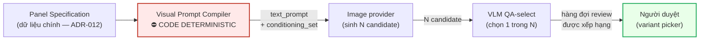

# ADR-014: Visual Prompt Compiler deterministic và best-of-N

Related to: [SDD-Comic-Studio](./SDD-Comic-Studio.md)

## Context

> [!IMPORTANT]
> ⛔ **ADR này là RECORD-ONLY.** Nó **đóng băng** tám quyết định đã CHỐT ở Phase 1 (`D-34`…`D-39`, `D-43`, `D-44`), ⛔ **không** quyết gì mới.
> ⭐ **Provider VLM và chi phí VLM ⛔ KHÔNG thuộc file này** — đã xử lý ở **[ADR-007](./ADR-007-VLM-Provider-For-QA-Select.md)**. ADR-014 **trỏ tới**, ⛔ **không lặp lại lập luận chi phí**, ⛔ **không nhắc lại con số COGS**.

Đường từ `Panel Specification` tới một ảnh được chọn đi qua **bốn trạm**, và ranh giới giữa chúng là phần quan trọng nhất của ADR này:

**Trạm B là nơi tính xác định của toàn hệ thống được bảo vệ.** Nếu compiler không xác định thì câu hỏi *"panel này sai vì spec sai hay vì hệ thống ngẫu nhiên?"* **không trả lời được** — và cùng lúc, bảng `Generation` mất hết ý nghĩa. `SRS-FR-17` ghi rõ compiler deterministic là **điều kiện cần để bảng `Generation` có nghĩa**.

**Trạm E là nơi quyền quyết định cuối cùng ở lại với người.** ⛔ Không có trạm nào trong sơ đồ tự áp dụng thay đổi lên tác phẩm.

### ⚠️ Ba ràng buộc phải đọc trước `## Decision`

**(a) ⛔ KHÔNG LLM Ở COMPILER RUNTIME (`D-34`).**
Đây là ranh giới **cứng nhất** của tầng sinh ảnh. Compiler là *"tra bảng `field value → cụm từ`, sắp thứ tự, dedup, xử lý xung đột theo **precedence ladder**, thực thi **constraint budget**, ghi **drop log**"*. Nó là **code**, và cách đo là: compiler **chạy được và sinh ra prompt ngay cả khi network bị cắt** ([Story-Deterministic-Visual-Prompt-Compiler](../../022-User-Stories/Backlog/Story-Deterministic-Visual-Prompt-Compiler.md) AC-2).

⚠️ Điều này **không mâu thuẫn** với `D-36`: hai chỗ LLM được phép **không nằm ở runtime** — chúng là **nguồn dữ liệu** đã cache. Xem `## Decision` điều 4.

**(b) `N = 3` là MẶC ĐỊNH, ⛔ KHÔNG PHẢI CHỐT.**
`SRS-FR-20` phân loại nguyên trạng là **LAI**: *cơ chế* best-of-N là **CHỐT**, còn *giá trị* `N = 3` là **MẶC ĐỊNH** với đường lui ghi tường minh — `CF-8.5` đặt *"N tối thiểu"* là **một trong ba chỉ số bắt buộc MVP0 phải đo**, mỗi bậc `N` giảm được là **~33% COGS**.

⚠️ Đường lui đó ⛔ **không** cho phép hạ `N` trước khi có số đo, và ⛔ **không** đổi ngân sách: ***budget vẫn phải tính ở `N = 3`*** (`Charter §4 R7`).

⇒ ⛔ Bất kỳ file nào sau này viết *"N = 3 đã chốt"* là **đọc sai nhãn**. Nhãn đúng: **MẶC ĐỊNH, chờ verdict MVP0**.

**(c) VLM và chi phí VLM ⛔ KHÔNG mở lại ở đây.**
[ADR-007](./ADR-007-VLM-Provider-For-QA-Select.md) đã đóng phần đó: nó chốt *"VLM QA-select là một integration riêng, có adapter riêng"*, để **provider = `TBD` có chủ**, và — quan trọng nhất — ghi tường minh ở mục `## Consequences` (*"⛔ Hệ quả BẮT BUỘC ĐỌC — chi phí và con số COGS"*) rằng:

> ⭐ **Chi phí VLM call để score N candidate là phần CHƯA TÍNH của `CF-3.5`.**

⇒ ⛔ ADR-014 **không** trích con số COGS nào, **không** lập luận lại kinh tế của best-of-N. Mọi câu hỏi *"best-of-N tốn bao nhiêu?"* trả lời bằng cách **đọc [ADR-007](./ADR-007-VLM-Provider-For-QA-Select.md)**, không phải bằng cách đọc file này.

---

## Decision

### Tầng CHỐT — ⛔ bất biến, không đổi mà không viết ADR mới

**1. Visual Prompt Compiler là CODE DETERMINISTIC (`D-34`).**

Năm việc nó làm, ⛔ không nhiều hơn:

| # | Việc | Tính chất |
|---|---|---|
| 1 | Tra bảng `field value → cụm từ` | thuần, dữ liệu ngoài code |
| 2 | Sắp thứ tự | xác định |
| 3 | Dedup | xác định |
| 4 | Xử lý xung đột theo ⭐ **precedence ladder** | xác định, có thứ hạng tường minh |
| 5 | Thực thi ⭐ **constraint budget** + ghi ⭐ **drop log** vào `generation.degradations JSONB` | xác định, để lại vết |

Tiêu chí nghiệm thu đã ký ([Story-Deterministic-Visual-Prompt-Compiler](../../022-User-Stories/Backlog/Story-Deterministic-Visual-Prompt-Compiler.md)):
- Cùng một spec chạy 2 lần cho ra prompt **giống hệt byte-for-byte**.
- Compiler sinh được prompt **khi network bị cắt** — đây là cách **chứng minh** ⛔ không có LLM/API nào ở runtime.
- Ràng buộc bị drop tuân **đúng** precedence ladder: ⭐ **identity refs KHÔNG BAO GIỜ bị drop**; camera angle / composition / props phụ bị drop **trước**.
- Mỗi lần drop, compiler **ghi log** ràng buộc đã bị drop.

**2. Ba hành vi biên là CHỐT, ⛔ không phải tuỳ chọn (`D-34`).**

| Tình huống | Hành vi bắt buộc | ⛔ Cấm |
|---|---|---|
| Spec chứa field **không có trong bảng tra** | **Báo lỗi rõ ràng** | ⛔ tự bịa cụm từ · ⛔ bỏ qua âm thầm |
| **Hai ràng buộc xung đột cùng ở bậc cao nhất** của precedence ladder (ví dụ hai identity ref mâu thuẫn) | **Dừng và yêu cầu sửa spec** | ⛔ tự chọn một bên |
| Budget vượt tới mức **identity refs cũng phải drop** mới vừa | **Từ chối sinh prompt** — đây là **lỗi thiết kế spec** | ⛔ sinh một prompt thiếu identity |

Ba hành vi này là lý do compiler **im lặng thì không bao giờ sai**: mọi trường hợp nó không xử lý được đều trồi lên thành lỗi, ⛔ không chìm xuống thành ảnh xấu.

**3. Compiler xuất HAI output, ⛔ không phải một (`D-35`).**

| Output | Nội dung |
|---|---|
| `text_prompt` | mô tả cảnh |
| `conditioning_set` | identity reference |

⛔ **Identity reference KHÔNG được cạnh tranh với mô tả cảnh trong cùng một chuỗi text.** Nhồi cả hai vào một chuỗi là để chúng giành attention budget của model với nhau — và identity là thứ thua trước.

**4. ⭐ CHỈ HAI CHỖ HẸP được dùng LLM, và CẢ HAI PHẢI CACHE (`D-36`).**

| Chỗ | Là gì | Vì sao ⛔ không phải runtime |
|---|---|---|
| **(a)** Soạn **từ vựng** (`field value → cụm từ`) | Chạy **OFFLINE một lần** → ⭐ **người review** → **lưu vào bảng** | Kết quả là **dữ liệu trong DB**. Compiler đọc bảng, ⛔ không gọi model |
| **(b)** Dịch **action tự do → cụm pose** khi từ vựng **chưa có entry** | ⭐ **Cache theo hash của action text** | Lần đầu tra cache miss; ⛔ mọi lần sau là tra cache |

⛔ **Ngoài hai việc đó: không có LLM trong compiler.**

⚠️ Ba điều dễ trượt:
- (a) đi kèm **người review** — ⛔ không có đường LLM ghi thẳng vào bảng từ vựng.
- (b) cache theo **hash của action text**, ⛔ không cache theo panel/spec — để hai panel cùng action dùng chung một entry.
- Cả hai chỗ **không** làm compiler mất tính xác định, vì tại thời điểm compile chúng **đã là dữ liệu**.

**5. best-of-N: sinh N candidate cho MỌI panel rồi VLM QA-select 1 (`D-37`).**
⛔ **KHÔNG phải retry-on-failure.** Khác biệt là bản chất, không phải mức độ:

| | best-of-N (`D-37`) | retry-on-failure (⛔ **không phải cái này**) |
|---|---|---|
| Khi nào sinh nhiều | ⭐ **MỌI panel, luôn luôn** | chỉ khi lần đầu bị đánh trượt |
| Chi phí | **biết trước**, tính được vào budget | phụ thuộc `reject_rate`, ⛔ không dự đoán được |
| Vai trò VLM | **chọn tốt nhất** trong N | **gác cổng** pass/fail |

**6. `N = 3` là MẶC ĐỊNH (`D-37`).** Xem callout (b) ở `## Context`. Ngân sách vẫn tính ở `N = 3`.

**7. Continuity Checker = QA-BASED SELECTION giữa N candidate (`D-38`).**
Output là ⭐ **hàng đợi review được XẾP HẠNG**, ⛔ không phải một danh sách lỗi, ⛔ không phải một hành động.

- ⛔ **CẮT HẲN `[Fix automatically]`.**
- Phiên bản hợp lệ là ⭐ ***"Tạo lại với ràng buộc được nhấn mạnh"***.
- ⭐ **GIỮ CẢ HAI version**, hiển thị **side-by-side**, ⭐ **NGƯỜI CHỌN**.
- ⛔ **Không bao giờ tự áp dụng.**
- ⭐ **`unclear` là câu trả lời hợp lệ HẠNG NHẤT** — ⛔ không phải một trạng thái lỗi, ⛔ không phải một giá trị cần khử.

**8. Hệ thống PHẢI hiện tường minh ĐỘ PHỦ của checker (`D-39`).**
Nguyên văn dạng thông điệp: *"đã kiểm **N/M** panel, **M−N** panel không kiểm được vì có nhiều nhân vật"*. Độ phủ ước lượng **40–60%** `[EM]` (`CF-6.11`).

⭐ Đây là **FR MINH BẠCH**, ⛔ **KHÔNG phải chỉ tiêu chất lượng.** `Analysis §5.2` nói thẳng: *"đây không phải chi tiết kỹ thuật mà là **yêu cầu giao tiếp sản phẩm**"*. ⚠️ Con số `40–60%` mang nhãn `[EM]` (ước lượng, ⛔ **không phải số đo**) và ⛔ **không được nâng thành NFR chỉ tiêu** — `SRS §5.3` liệt kê tường minh những con số `[EM]` không được nâng. Copy con số này sang tài liệu khác thì **copy cả nhãn** (`CẤM-15`).

**9. Prop quan trọng đưa vào REFERENCE IMAGE như một ENTITY RIÊNG (`D-43`).**
⛔ **Không** mô tả bằng chữ trong prompt. Nền: `CF-6.3` `[OFF]` — Props là metric **thấp nhất** (**4.19/5**) trong bộ đo; `R-13` là mitigation đã ở trạng thái `accepted`.

⇒ Prop có **cùng hình dạng dữ liệu** với identity reference nhân vật: một entity có ảnh tham chiếu, đi vào `conditioning_set`, ⛔ không đi vào `text_prompt`.

**10. ⭐ Mục tiêu của bảng `Generation` là AUDITABILITY + LINEAGE, ⛔ KHÔNG phải reproducibility (`D-44`).**

Bit-exact **không đạt được**, vì hai lý do **nằm ngoài tầm kiểm soát của hệ thống**:
1. Nhiều API **không cho set seed**.
2. Provider **cập nhật weights dưới cùng một tên model** — *silent model drift*.

⇒ ⭐ **`seed` là PROVENANCE METADATA, ⛔ KHÔNG PHẢI REPLAY KEY.**

Câu hỏi bảng `Generation` **phải** trả lời được: *"ảnh này sinh ra từ **spec nào**, **ref nào** (hash gì), **tham số gì**, **tốn bao nhiêu**, **ai approve**"*.
Câu hỏi nó ⛔ **không** hứa trả lời: *"chạy lại cho ra đúng ảnh này"*.

⚠️ **Hệ quả bắt buộc, nối sang [ADR-012](./ADR-012-Comic-IR-Spec-As-Primary-Data.md):** vì không tái tạo được bit-exact, chữ *"ảnh chỉ là cache"* của `SRS-FR-07` ⛔ **không** kéo theo *"ảnh xoá được"*. **Mất một object là mất VĨNH VIỄN một mắt xích provenance.** Xem [ADR-012](./ADR-012-Comic-IR-Spec-As-Primary-Data.md) `## Context` callout (a).

### `TBD` — ⛔ lô này KHÔNG đóng

| Khoảng trống | Vì sao chưa đóng được | **Ai đóng** | Khi nào |
|---|---|---|---|
| **Giá trị `N` cuối cùng** | `CF-8.5` xếp *"N tối thiểu"* vào **ba chỉ số bắt buộc MVP0 phải đo**; ⛔ chưa có số đo | **PM tại gate `G1`**, sau verdict MVP0 (`G1-b`) | Sau MVP0 — ⚠️ budget giữ ở `N = 3` cho tới lúc đó |
| **Provider VLM** cho QA-select | Đã xử lý ở nơi khác | ⭐ **[ADR-007](./ADR-007-VLM-Provider-For-QA-Select.md)** giữ hàng `TBD` này — ⛔ ADR-014 không đụng vào | xem [ADR-007](./ADR-007-VLM-Provider-For-QA-Select.md) |
| **Chi phí VLM per-call** và tổng khoản thiếu của `CF-3.5` | Đã xử lý ở nơi khác | ⭐ **[ADR-007](./ADR-007-VLM-Provider-For-QA-Select.md)** `## Consequences` — ⛔ ADR-014 không lặp lại | xem [ADR-007](./ADR-007-VLM-Provider-For-QA-Select.md) |
| **Số lượng ràng buộc thị giác** trong constraint budget | `findings/architect.md` §1.5 `D-34` ghi **5–8** `[EM]`; ⛔ con số này **không** xuất hiện trong `SRS-FR-17` ⇒ xử lý như **cấu hình**, ⛔ không hard-code | **Architect tại lô implementation**, hiệu chỉnh sau MVP0 | Khi cài đặt compiler |

---

## Alternatives considered

> ⛔ Ghi lại **vì sao các phương án kia bị LOẠI**, để không phải tranh luận lại.

### (a) Để LLM viết prompt (prompt generation bằng LLM ở runtime) — ⛔ LOẠI

**Vì sao có vẻ hợp lý**: đây là cách gần như mọi công cụ AI image làm. LLM viết prompt hay hơn bảng tra, xử lý được action lạ, và ⛔ không cần ai soạn từ vựng.

**Vì sao bị loại**:
1. ⭐ **Mất khả năng quy trách nhiệm.** Panel sai thì ⛔ **không biết** spec sai hay prompt-writer ngẫu nhiên. Story ký thẳng mục tiêu ngược lại: *"panel sai là do **spec sai**, không do hệ thống ngẫu nhiên"*.
2. **Bảng `Generation` mất nghĩa.** `SRS-FR-17` ghi compiler deterministic là **điều kiện cần** để bảng đó có nghĩa. Nếu prompt là output của một hàm không xác định thì lưu prompt cũng không tái dựng được lý do.
3. **Thêm một nguồn phi xác định vào một đường đã có sẵn phi xác định.** Model sinh ảnh vốn đã ngẫu nhiên. Chồng thêm một tầng ngẫu nhiên ở trước làm bài toán debug **nhân lên**, ⛔ không cộng vào.
4. **Chi phí và độ trễ trên mọi panel**, trong khi bảng tra là tra bộ nhớ.
5. **Không test được.** ⛔ Không có cách nào viết assertion cho *"prompt này đúng"*; byte-for-byte thì so được.

### (b) Nhồi identity reference vào cùng chuỗi `text_prompt` — ⛔ LOẠI

**Vì sao có vẻ hợp lý**: một output đơn giản hơn hai; adapter provider mỏng hơn; một số provider chỉ nhận text.

**Vì sao bị loại**: `SRS-FR-18` chốt hai output vì lý do **cơ chế**, ⛔ không phải lý do gọn: *"identity reference **không được cạnh tranh** với mô tả cảnh trong cùng một chuỗi text"*. Trong một chuỗi, mọi cụm từ giành attention với nhau, và identity — thứ **không bao giờ được drop** theo precedence ladder — lại là thứ dễ bị loãng nhất. Tách kênh là cách duy nhất bảo vệ nó bằng **cấu trúc**, ⛔ không phải bằng cách viết prompt khéo hơn.

⚠️ Provider chỉ nhận text ⇒ đó là việc của **adapter** (`D-40`, ghi ở lô ADR-016), ⛔ không phải lý do để compiler xuất một output.

### (c) Cho phép LLM ở compiler "chỉ khi cần" (fallback online, ⛔ không cache) — ⛔ LOẠI

**Vì sao có vẻ hợp lý**: nghe như một thoả hiệp đẹp — bảng tra cho 95% trường hợp, LLM cho phần đuôi. Trông giống hệt `D-36`(b).

**Vì sao bị loại**: nó ⛔ **không** giống `D-36`(b). Khác biệt nằm ở **cache**:
- `D-36`(b) **cache theo hash của action text** ⇒ tra cache miss **một lần duy nhất** cho mỗi action; sau đó nó là **dữ liệu**, và compiler vẫn xác định.
- Fallback không cache ⇒ **cùng một spec, hai thời điểm, hai prompt khác nhau**. Vi phạm trực tiếp AC *"byte-for-byte"* và AC *"chạy được khi network bị cắt"*.

⇒ `D-36` ⛔ **không phải** một sự nới lỏng của `D-34`. Nó là **hình dạng cụ thể** của cách `D-34` được giữ.

### (d) retry-on-failure thay best-of-N — ⛔ LOẠI

**Vì sao có vẻ hợp lý**: rẻ hơn ở kịch bản tốt — chỉ trả tiền lần 2 khi lần 1 hỏng. Trực giác chi phí rất mạnh.

**Vì sao bị loại**:
1. **Chi phí ⛔ không dự đoán được.** Nó là hàm của `reject_rate`, mà `reject_rate` chính là một trong ba chỉ số **MVP0 phải đo** (`G1-c`) — tức là **chưa biết**. Một mô hình chi phí phụ thuộc một số chưa biết ⛔ không lập ngân sách được.
2. **Đổi vai của VLM từ *chọn* thành *gác cổng*.** Gác cổng đòi một ngưỡng pass/fail tuyệt đối; `D-38` chốt rằng **`unclear` là câu trả lời hợp lệ hạng nhất** ⇒ ⛔ không có ngưỡng tuyệt đối để mà gác.
3. **Mất variant picker.** Nếu chỉ giữ bản đầu tiên "đạt", người dùng ⛔ không còn gì để chọn — mà chọn giữa các bản **là** thành phần #1 của editor tối thiểu.
4. ⚠️ **Đường lui đúng đã có sẵn và nó là đường khác**: hạ `N` sau khi đo (`CF-8.5`), ⛔ không phải đổi cơ chế. `SRS-FR-20` viết hẳn cảnh báo *"⚠️ **KHÔNG phải retry-on-failure**"* vào chính phát biểu requirement.

### (e) `[Fix automatically]` — Continuity Checker tự sửa panel sai — ⛔ LOẠI

**Vì sao có vẻ hợp lý**: nếu checker đã phát hiện được lỗi continuity thì để nó sửa luôn là tiết kiệm thời gian người dùng nhiều nhất trong cả sản phẩm.

**Vì sao bị loại**:
1. ⭐ **Checker có độ phủ 40–60% `[EM]`.** Một cơ chế tự sửa chạy trên nền một cơ chế phát hiện **không phủ hết** sẽ tự tin sai ở đúng những chỗ nó không nhìn thấy.
2. **`unclear` là câu trả lời hợp lệ hạng nhất** ⇒ ⛔ không tồn tại một phán quyết nhị phân để tự động hoá.
3. **Tự sửa là ghi đè tác phẩm của người khác.** `KC-1`…`KC-7` và `SRS-FR-35` (`change_log` ghi **mọi** hành động người dùng) dựng trên tiền đề *"người quyết định"*; một đường tự áp dụng làm hỏng chính lập luận *"decisive contribution"*.
4. Phiên bản hợp lệ **đã được thiết kế**: *"Tạo lại với ràng buộc được nhấn mạnh"* + **giữ CẢ HAI** + **side-by-side** + **người chọn**. Nó giữ nguyên lợi ích (đề xuất bản tốt hơn) mà ⛔ không lấy mất quyền quyết định.

### (f) Coi độ phủ checker là một chỉ tiêu chất lượng cần nâng — ⛔ LOẠI

**Vì sao có vẻ hợp lý**: `40–60%` trông như một con số cần cải thiện; biến nó thành NFR có vẻ là kỷ luật kỹ thuật tốt.

**Vì sao bị loại**: `D-39` phân loại nó là **FR minh bạch**, ⛔ **không** phải chỉ tiêu. Con số `40–60%` mang nhãn `[EM]` — **ước lượng, ⛔ không phải số đo** — và `SRS §5.3` liệt kê tường minh những con số `[EM]` ⛔ **không được nâng thành NFR chỉ tiêu**. Nâng một ước lượng thành chỉ tiêu là tạo ra một mục tiêu **không có gốc đo lường**, và làm hỏng chính thứ requirement này bảo vệ: **nói thật với người dùng về giới hạn của hệ thống**.

### (g) Mô tả prop quan trọng bằng chữ trong prompt — ⛔ LOẠI

**Vì sao có vẻ hợp lý**: rẻ, không cần chuẩn bị ảnh tham chiếu cho từng prop, và mô tả chữ linh hoạt hơn.

**Vì sao bị loại**: `CF-6.3` `[OFF]` cho thấy **Props là metric thấp nhất — 4.19/5** trong bộ đo. Tức là mô tả bằng chữ **đã được thử và đã là điểm yếu nhất**. `R-13` là mitigation ở trạng thái `accepted`. Đưa prop thành **entity riêng có reference image** là áp dụng đúng cơ chế đã hiệu quả với identity nhân vật, vào đúng chỗ đang yếu nhất.

### (h) Coi bảng `Generation` là công cụ reproducibility (lưu `seed` để replay) — ⛔ LOẠI

**Vì sao có vẻ hợp lý**: *"lưu seed để chạy lại"* là phản xạ chuẩn của mọi kỹ sư khi thiết kế bảng generation.

**Vì sao bị loại**: nó **bất khả thi**, và tin rằng nó khả thi là **nguy hiểm hơn** việc không có nó:
1. Nhiều API ⛔ **không cho set seed**.
2. **Silent model drift** — provider cập nhật weights dưới cùng một tên model. Kể cả seed cố định, cùng input **không** cho cùng output qua thời gian.
3. ⭐ **Nguy hiểm thật nằm ở hệ quả vận hành**: một đội tin vào replay sẽ cho phép xoá object *"vì tái tạo được"*, rồi phát hiện ra ⛔ **không tái tạo được** đúng lúc cần bằng chứng nhất. `SRS-NFR-13`: *"bằng chứng có thể thiếu ngẫu nhiên thì không phải bằng chứng"*.

⇒ Mục tiêu đúng là **AUDITABILITY + LINEAGE**. `seed` vẫn **lưu** — nhưng lưu như **provenance metadata**, ⛔ không phải replay key. Cắt **lời hứa**, ⛔ không cắt **cột dữ liệu**.

---

## Consequences

### ⭐ Hợp đồng mà lô DB Schema, lô API và lô implementation kế thừa

| # | Ràng buộc bắt buộc | Neo |
|---|---|---|
| 1 | Bảng **từ vựng** (`field value → cụm từ`) là **bảng dữ liệu trong DB**, có cột đánh dấu **đã người review**; ⛔ không có đường LLM ghi thẳng | `D-36`(a) |
| 2 | Bảng **cache pose**, khoá là ⭐ **hash của action text**, ⛔ không phải panel/spec id | `D-36`(b) |
| 3 | `generation.degradations JSONB` tồn tại và **mọi lần drop đều ghi vào đó** | `D-34` |
| 4 | Bảng `Generation` lưu: **spec id**, **ref + hash**, **tham số**, **chi phí**, **ai approve**, `seed`, `model_id`, `model_version` | `D-44` |
| 5 | `seed` là cột **provenance**; ⛔ ⚠️ không code path nào được dùng nó như replay key | `D-44` |
| 6 | Compiler xuất **hai** trường: `text_prompt` và `conditioning_set`; prop và identity đi vào `conditioning_set` | `D-35` · `D-43` |
| 7 | **N candidate của cùng một panel** cùng trỏ về một spec và phân biệt được với nhau (`attempt_no`); ⛔ không ghi đè lẫn nhau | `D-37` |
| 8 | Continuity Checker ghi ra **hàng đợi review có thứ hạng**; ⛔ **không tồn tại** endpoint/cột/cờ nào tự áp dụng thay đổi | `D-38` |
| 9 | `unclear` là **giá trị hợp lệ** của kết quả checker; ⛔ không phải `NULL`, ⛔ không phải lỗi | `D-38` |
| 10 | Cả hai version (bản gốc + bản *"tạo lại với ràng buộc được nhấn mạnh"*) **cùng tồn tại**; ⛔ không xoá bản thua | `D-38` |
| 11 | Có đường đọc trả ra **N/M panel đã kiểm** để UI hiển thị độ phủ | `D-39` |
| 12 | Ngưỡng `N` là **cấu hình tại một chỗ**, mặc định `3`; ⛔ không hard-code rải rác | `D-37` |

### Tích cực

1. ⭐ **Panel sai truy được về spec.** Compiler xác định ⇒ lỗi có **đúng một** nguồn khả dĩ ở tầng này.
2. **Compiler test được offline**, ⛔ không cần API key, ⛔ không cần network — vòng lặp phát triển nhanh và rẻ.
3. **Chi phí sinh ảnh biết trước** (`N` cố định), lập ngân sách được. ⚠️ Với **cảnh báo** ở [ADR-007](./ADR-007-VLM-Provider-For-QA-Select.md) rằng phần VLM **chưa nằm trong** con số nào.
4. **Identity được bảo vệ bằng cấu trúc** (kênh riêng + không bao giờ drop), ⛔ không phải bằng kỹ năng viết prompt.
5. **Quyền quyết định ở lại với người** ⇒ `change_log` chứng minh được *"decisive contribution"*.
6. **`unclear` hạng nhất ⇒ hệ thống nói thật khi nó không biết**, thay vì đoán.

### Tiêu cực — cái gì trở nên KHÓ HƠN

1. ⚠️ **Phải soạn và duy trì một bảng từ vựng.** Đây là chi phí **thường trực**, không phải một lần: thể loại mới, phong cách mới, action mới đều đòi entry mới, và mỗi entry đòi **người review**.
2. **Action lạ bị chặn cứng.** Field ⛔ không có trong bảng tra ⇒ **báo lỗi**, ⛔ không đoán. Người dùng gặp lỗi thay vì gặp một ảnh tạm được. Đây là **đánh đổi có chủ đích**.
3. **Chi phí `N` lần cho MỌI panel**, kể cả panel đơn giản mà lần đầu đã tốt. Đây là giá của tính dự đoán được. ⛔ Không được đọc thành *"hạ N để cứu margin"* trước khi có số đo.
4. **Checker chỉ phủ 40–60% `[EM]`** ⇒ phần còn lại **người phải tự nhìn**, và hệ thống **phải nói ra** điều đó.
5. ⚠️ **Không có replay.** Debug một ảnh sai không có đường *"chạy lại y hệt"*. Bù lại bằng **lineage đầy đủ** — và bằng kỷ luật ⛔ **không xoá object** ([ADR-012](./ADR-012-Comic-IR-Spec-As-Primary-Data.md) callout (a)).
6. **Prop cần ảnh tham chiếu** ⇒ thêm một loại asset phải chuẩn bị và quản lý vòng đời.

### Điều KHÔNG được suy ra từ ADR này

- ⛔ Không suy ra `N = 3` đã CHỐT — nhãn là **MẶC ĐỊNH**, chờ verdict MVP0.
- ⛔ Không suy ra rằng `D-36` nới lỏng `D-34` — hai chỗ LLM là **dữ liệu đã cache**, ⛔ không phải runtime.
- ⛔ Không suy ra chi phí của best-of-N từ file này — đọc **[ADR-007](./ADR-007-VLM-Provider-For-QA-Select.md)**.
- ⛔ Không suy ra rằng độ phủ `40–60%` là một chỉ tiêu phải đạt.
- ⛔ Không suy ra rằng `seed` cho phép chạy lại, và ⛔ **tuyệt đối** không suy ra rằng ảnh xoá được.

---

## Đã quyết ở đâu

> ⛔ Mọi hàng dưới đây **đã CHỐT ở Phase 1** (trừ hàng `N = 3` mang nhãn **MẶC ĐỊNH**). Neo bằng **mã requirement**, ⛔ không neo bằng số dòng.

| Quyết định | Mã `D-xx` | Nguồn (file + mã requirement) |
|---|:--:|---|
| ⭐ **Visual Prompt Compiler là code deterministic — ⛔ KHÔNG có LLM ở runtime**; tra bảng `field value → cụm từ`, sắp thứ tự, dedup, **precedence ladder**, **constraint budget**, **drop log** vào `generation.degradations JSONB` | `D-34` | [SRS](../../020-Requirements/SRS-Comic-Studio.md) **`SRS-FR-17`** (§3.A — ghi rõ *"điều kiện cần để bảng `Generation` có nghĩa"*) · `MVP-Scope §3 A3` · `Charter §4 R8` · `Glossary` mục *Visual Prompt Compiler* · `Analysis §5.5` |
| Tiêu chí nghiệm thu của `D-34`: **byte-for-byte** giữa 2 lần chạy · sinh được prompt **khi network bị cắt** · identity refs ⛔ **không bao giờ bị drop** · mỗi lần drop **ghi log** | `D-34` | [Story-Deterministic-Visual-Prompt-Compiler](../../022-User-Stories/Backlog/Story-Deterministic-Visual-Prompt-Compiler.md) AC-1…AC-4 |
| Ba hành vi biên CHỐT: field ngoài bảng tra ⇒ **báo lỗi** (⛔ không bịa) · xung đột cùng bậc cao nhất ⇒ **dừng** (⛔ không tự chọn) · phải drop identity mới vừa budget ⇒ **từ chối sinh prompt** | `D-34` | [Story-Deterministic-Visual-Prompt-Compiler](../../022-User-Stories/Backlog/Story-Deterministic-Visual-Prompt-Compiler.md) §Edge case |
| Số ràng buộc thị giác của constraint budget: **5–8** `[EM]` | `D-34` | `findings/architect.md` §1.5 hàng `D-34` — ⚠️ ⛔ **không** xuất hiện thành con số trong `SRS-FR-17`; xử lý như **cấu hình** (`CẤM-15`: copy số thì copy cả nhãn `[EM]`) |
| Compiler xuất **HAI output**: `text_prompt` **VÀ** `conditioning_set`; identity reference ⛔ **không được cạnh tranh** với mô tả cảnh trong cùng chuỗi text | `D-35` | [SRS](../../020-Requirements/SRS-Comic-Studio.md) **`SRS-FR-18`** (§3.A) · `Analysis §5.5` |
| ⭐ **CHỈ HAI chỗ hẹp được dùng LLM trong compiler, và PHẢI CACHE**: (a) soạn từ vựng **offline** → **người review** → **lưu vào bảng**; (b) dịch action tự do → cụm pose, **cache theo hash của action text**. ⛔ Ngoài hai việc đó: không có LLM | `D-36` | [SRS](../../020-Requirements/SRS-Comic-Studio.md) **`SRS-FR-19`** (§3.A) · `Analysis §5.5` |
| **best-of-N**: sinh **N candidate cho MỌI panel** rồi VLM QA-select 1. ⚠️ ⛔ **KHÔNG phải retry-on-failure** | `D-37` | [SRS](../../020-Requirements/SRS-Comic-Studio.md) **`SRS-FR-20`** (§3.A) · `MVP-Scope §3 A1` · `Charter §7 C8` `[OFF]` `CF-3.1`, `CF-3.2` · `Glossary` mục *best-of-N (N=3)* |
| ⚠️ **`N = 3` là MẶC ĐỊNH, ⛔ KHÔNG PHẢI CHỐT** — `CF-8.5` đặt *"N tối thiểu"* là **một trong ba chỉ số bắt buộc MVP0 phải đo**, mỗi bậc `N` giảm ≈ **33% COGS**; ⭐ **budget vẫn phải tính ở `N = 3`** | `D-37` | [SRS](../../020-Requirements/SRS-Comic-Studio.md) **`SRS-FR-20`** (nhãn nguyên trạng: **LAI** — cơ chế CHỐT, giá trị MẶC ĐỊNH) · `CF-8.5` · `Charter §4 R7` · gate `G1-b` |
| ⭐ **Continuity Checker = QA-based selection giữa N candidate**, output là **hàng đợi review được xếp hạng**. ⛔ Cắt hẳn `[Fix automatically]`; bản hợp lệ là *"Tạo lại với ràng buộc được nhấn mạnh"* — **giữ CẢ HAI** version, **side-by-side**, ⭐ **NGƯỜI CHỌN**, ⛔ không bao giờ tự áp dụng. ⭐ `unclear` là câu trả lời hợp lệ **hạng nhất** | `D-38` | [SRS](../../020-Requirements/SRS-Comic-Studio.md) **`SRS-FR-21`** (§3.A) · `Glossary` mục *Continuity Checker* (*"Mọi tài liệu mới phải dùng nghĩa sau"*) · `MVP-Scope §3 H3` · `CF-8.10` · `Analysis §5.2` |
| Hệ thống **PHẢI hiện tường minh độ phủ của checker**: *"đã kiểm N/M panel, M−N panel không kiểm được vì có nhiều nhân vật"*; độ phủ **40–60%** `[EM]`. ⭐ Đây là **FR minh bạch**, ⛔ **KHÔNG phải chỉ tiêu chất lượng** | `D-39` | [SRS](../../020-Requirements/SRS-Comic-Studio.md) **`SRS-FR-22`** (§3.A) · `Charter §8 A9` `[EM]` `CF-6.11` · `Analysis §5.2` (*"yêu cầu giao tiếp sản phẩm"*) · ⚠️ [SRS](../../020-Requirements/SRS-Comic-Studio.md) **§5.3** (hai con số `[EM]` ⛔ không được nâng thành NFR chỉ tiêu) |
| **Prop quan trọng đưa vào reference image như một ENTITY RIÊNG**, ⛔ không mô tả bằng chữ trong prompt | `D-43` | [SRS](../../020-Requirements/SRS-Comic-Studio.md) **`SRS-FR-27`** (§3.A) · `R-13` (mitigation, status `accepted`) · `CF-6.3` `[OFF]` (Props **4.19/5** — metric thấp nhất) |
| ⭐ **Mục tiêu bảng `Generation` là AUDITABILITY + LINEAGE, ⛔ KHÔNG phải reproducibility.** Bit-exact ⛔ không đạt được (API không cho set seed; silent model drift). ⭐ **`seed` là provenance metadata, ⛔ KHÔNG phải replay key** | `D-44` | [SRS](../../020-Requirements/SRS-Comic-Studio.md) **§3.A callout `[!CAUTION]`** ngay sau bảng module A (⚠️ callout này **không mang mã `SRS-FR` riêng**) · `Analysis §6.4` · **`SRS-NFR-13`** (*"bằng chứng có thể thiếu ngẫu nhiên thì không phải bằng chứng"*) |
| ⭐ **Chi phí VLM để score N candidate là phần CHƯA TÍNH của `CF-3.5`** — ⛔ ADR-014 **không** lặp lại lập luận chi phí | `D-37` / `D-38` (phần VLM) | ⭐ **[ADR-007](./ADR-007-VLM-Provider-For-QA-Select.md)** — `## Context` mục *"⛔ Khoản chi phí đang thiếu"* + `## Consequences` mục *"⛔ Hệ quả BẮT BUỘC ĐỌC — chi phí và con số COGS"* |
| **Provider VLM = `TBD`** và adapter riêng cho nó — ⛔ ADR-014 không chọn | `D-37` / `D-38` (phần VLM) | ⭐ **[ADR-007](./ADR-007-VLM-Provider-For-QA-Select.md)** `## Decision` **Q1**, **Q4**, **Q5** |

### Khoảng trống — ⛔ ADR này KHÔNG đóng

| Khoảng trống | Nguồn ghi nhận | **Ai đóng** |
|---|---|---|
| Giá trị **`N`** cuối cùng | `CF-8.5` · gate **`G1-b`** | **PM tại gate `G1`** sau verdict MVP0 — ⚠️ budget giữ `N = 3` cho tới lúc đó |
| **Provider VLM** + **chi phí VLM per-call** | ⭐ [ADR-007](./ADR-007-VLM-Provider-For-QA-Select.md) `## Consequences` mục *"Việc còn để `TBD`"* | ⭐ **[ADR-007](./ADR-007-VLM-Provider-For-QA-Select.md)** giữ — ⛔ ADR-014 không đụng |
| Số ràng buộc thị giác trong **constraint budget** (**5–8** `[EM]`) | `findings/architect.md` §1.5 `D-34` | **Architect tại lô implementation**, hiệu chỉnh sau MVP0 |

---

_Ghi lại bởi System Architect — lô L6 (record-only), Phase 2._
_Author: trisjr_
