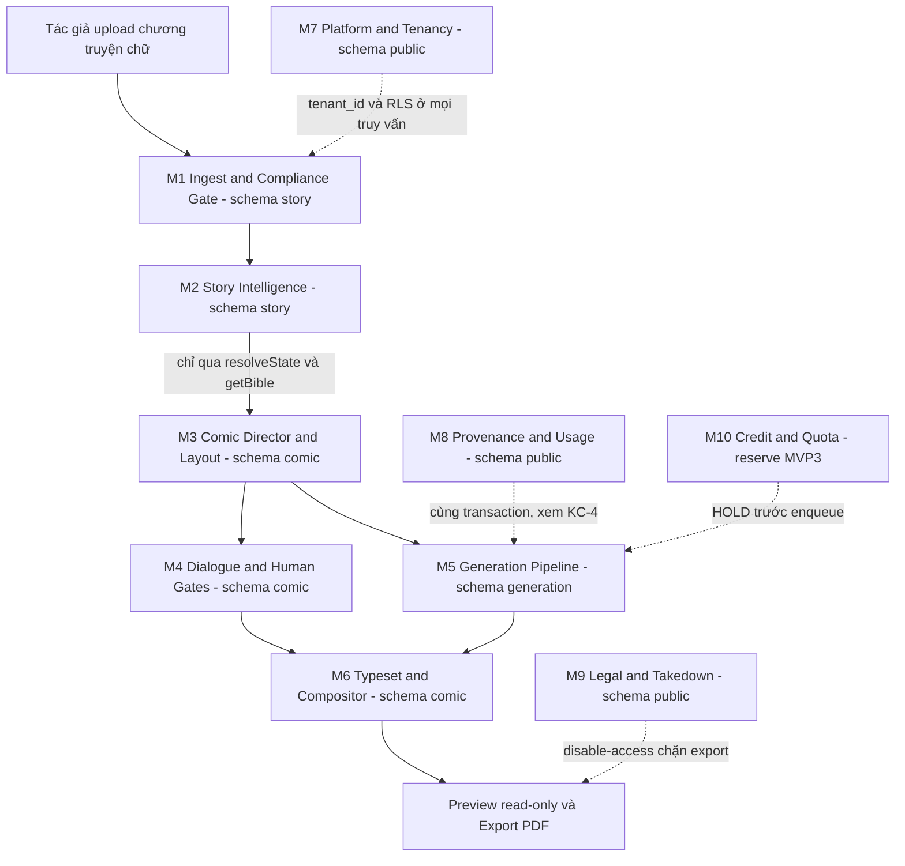
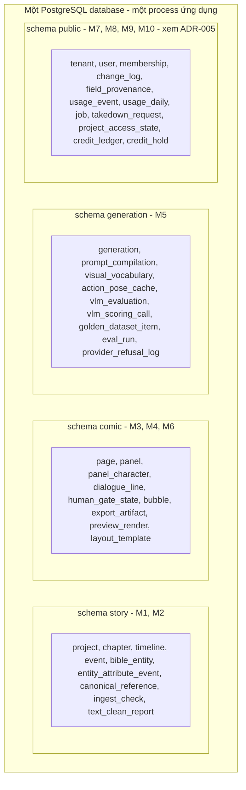
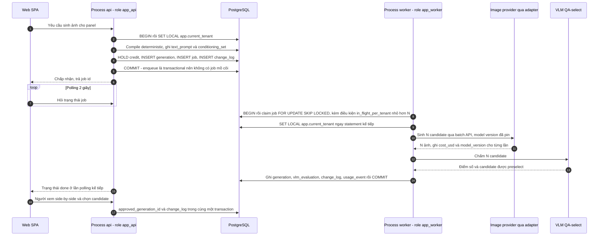
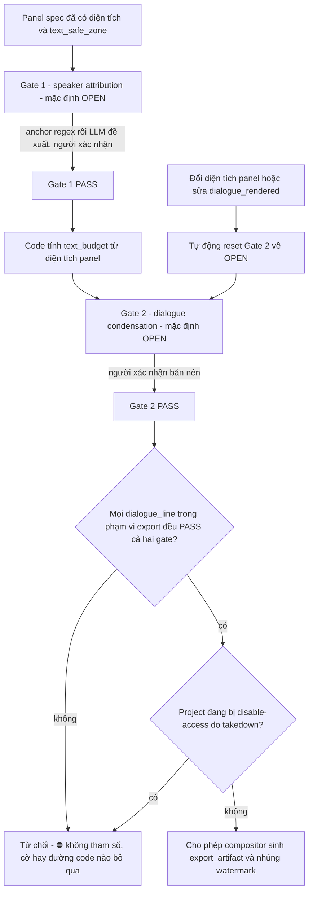
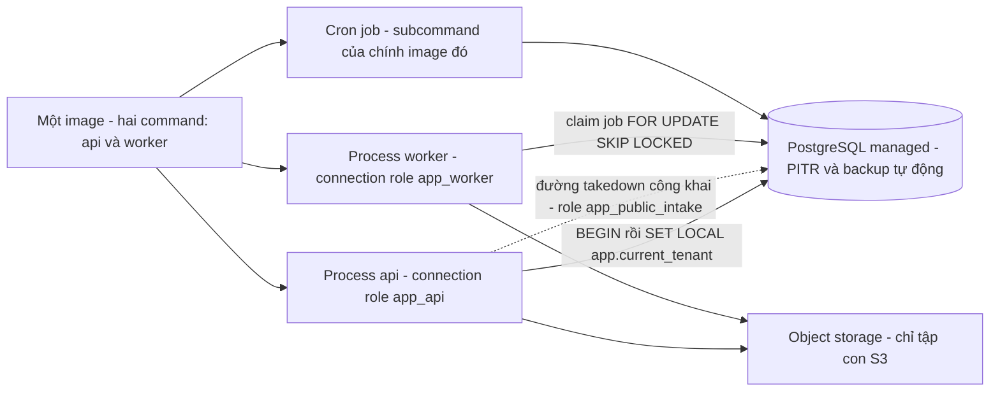

# SDD: Comic Studio — System Design Document

Implements: [PRD-Comic-Studio](../../020-Requirements/PRD-Comic-Studio.md)

> [!IMPORTANT]
> **Tài liệu này là BẢN ĐỒ, không phải nơi ra quyết định.**
> Mọi quyết định kiến trúc sống ở [ADR](./). SDD **trỏ** tới ADR và **không** lặp lại lập luận của chúng — trùng lặp nghĩa là hai nguồn sự thật phải đồng bộ tay, và với đội **1 người** thì đó là nợ chắc chắn vỡ.
> Ngược lại, có **đúng một** ràng buộc mà **SDD là nguồn duy nhất**: [`SDD-HG-01` — không đường nào bypass hai human gate](#63-sdd-hg-01--không-đường-nào-bypass-hai-human-gate--nguồn-duy-nhất). Mọi file API phải trỏ về đó, ⛔ không đặc tả lại.

## Mục lục

1. [Bối cảnh & ràng buộc bao trùm](#1-bối-cảnh--ràng-buộc-bao-trùm)
2. [Phân rã module M1–M10](#2-phân-rã-module-m1m10)
3. [Bản đồ schema](#3-bản-đồ-schema)
4. [Ranh giới & cơ chế cưỡng chế](#4-ranh-giới--cơ-chế-cưỡng-chế)
5. [Luồng dữ liệu F1–F7](#5-luồng-dữ-liệu-f1f7)
6. [Cross-cutting](#6-cross-cutting)
7. [Deployment](#7-deployment)
8. [Seam mở rộng cho nhóm ngoài horizon](#8-seam-mở-rộng-cho-nhóm-ngoài-horizon)
9. [Bảng `TBD` còn lại và ai chịu trách nhiệm đóng](#9-bảng-tbd-còn-lại-và-ai-chịu-trách-nhiệm-đóng)
10. [Tài liệu tham khảo](#10-tài-liệu-tham-khảo)

> ✅ **Mục 8, mục 9 và Tài liệu tham khảo đã nhập vào file.**
> ⚠️ **Phạm vi mục 8 HẸP HƠN** cấu trúc dự kiến ở [findings/architect §6.4](../../010-Planning/pm-runs/2026-08-28-phase-2-architecture-design-comic-studio/findings/architect.md): gate đã chốt phạm vi Phase 2 là **toàn horizon MVP0–MVP2, 41 story** ⇒ **17 story `[H-non⭐]` nằm TRONG phạm vi và đã được đặc tả ở §1–§7**, chúng ⛔ **không còn là seam**. Mục 8 chỉ còn viết seam cho tầng **`[OoH]`** — xem [§8](#8-seam-mở-rộng-cho-nhóm-ngoài-horizon).

### Quy ước trích dẫn của tài liệu này

| Ký hiệu | Nghĩa |
|---|---|
| `SRS-FR-nn` / `SRS-NFR-nn` | Mã requirement **bất biến** trong [SRS-Comic-Studio](../../020-Requirements/SRS-Comic-Studio.md). ⭐ **Neo bằng mã, ⛔ không neo bằng số dòng** — số dòng đổi theo mỗi lần sửa file, mã thì không |
| `D-nn` | Hàng quyết định đã chốt ở Phase 1, tra tại [findings/architect §1](../../010-Planning/pm-runs/2026-08-28-phase-2-architecture-design-comic-studio/findings/architect.md) |
| `A1`…`H6` | Hàng của bảng phạm vi [MVP-Scope §3](../../010-Planning/MVP-Scope.md) |
| `UC-nn` bước `k` | Bước trong main flow của Use Case tương ứng |
| `[24⭐]` / `[H-non⭐]` / `[OoH]` | Ba tầng phạm vi — định nghĩa ở [§1.3](#13-ba-tầng-phạm-vi-của-bản-thiết-kế-này) |

---

## 1. Bối cảnh & ràng buộc bao trùm

### 1.1 Ràng buộc gốc — và vì sao nó chi phối mọi mục còn lại

> **Đội 1 người + AI assist, không funding** — `CF-1.2` `[CHỐT]`, phát biểu tại [SRS §1.3](../../020-Requirements/SRS-Comic-Studio.md).
> Hệ quả trực tiếp: `bus factor = 1`, **không có code review**, không có ai bắt lỗi giúp ở lần merge thứ hai.

Đây **không** phải một dòng bối cảnh cho đẹp. Nó là ràng buộc **nặng nhất** của toàn bộ kiến trúc, và mọi mục §2–§7 phải đọc được ngược về nó:

| # | Hệ quả kiến trúc | Nó sinh ra điều gì trong tài liệu này | Neo |
|--:|---|---|---|
| **R-1** | ⭐ **Guardrail phải là thứ MÁY cưỡng chế được** — DB constraint, RLS policy, lint rule ở CI. ⛔ Không được là *"quy ước đội tự nhớ"*, vì đội có một người | Toàn bộ [§4](#4-ranh-giới--cơ-chế-cưỡng-chế); guardrail của [§6.1](#61-tenant-context--rls); [`SDD-HG-01`](#63-sdd-hg-01--không-đường-nào-bypass-hai-human-gate--nguồn-duy-nhất) | `SRS-NFR-01`, `SRS-NFR-04`, `SRS-NFR-14` |
| **R-2** | **Ít khái niệm vận hành nhất có thể.** Mỗi backing service thêm vào là một trang runbook thêm cho đúng một người trực | Queue nằm trong Postgres, ⛔ không broker; một image, hai command — [§7](#7-deployment) | `SRS-FR-25`, `SRS-NFR-02`, `SRS-NFR-03` |
| **R-3** | **Mua thứ mua được**, tự viết thứ không mua được | Auth/billing mua ([ADR-003](./ADR-003-Auth-And-Billing-Vendor-Selection.md)); auto-placement bubble và compositor **phải tự build** | `SRS-FR-03`, `SRS-FR-16` |
| **R-4** | Tiêu chí cắt phạm vi: **cắt cái đắt-mà-không-kiểm-chứng-được, giữ cái rẻ-mà-không-backfill-được** | Vì sao `parent_generation_id`, `cost_usd`, `change_log` có mặt từ migration số 1 dù chưa ai dùng; vì sao UI cây generation bị cắt mà **cột dữ liệu thì không** | `SRS-FR-31`, `SRS-FR-34`, `SRS-NFR-23` |
| **R-5** | **Không tự gán số** cho NFR chưa ai đo. Bịa một con số performance là lỗi **nặng hơn** để trống nó | Mọi chỗ thiếu số trong tài liệu này đều ghi `TBD` + **ai đóng, khi nào** — ⛔ không có số nào không có nguồn | [SRS §5.2](../../020-Requirements/SRS-Comic-Studio.md) |
| **R-6** | **Một ngôn ngữ** cho api + worker + web; **một** hợp đồng API | Không context-switch giữa ba runtime cho một người — [ADR-001](./ADR-001-Backend-And-Frontend-Tech-Stack.md) | `SRS-NFR-09` |

> [!WARNING]
> ⚠️ **Đọc ngược lại là sai.** *"Một dev nên làm cho nhanh, bỏ bớt guardrail"* là **ngược hoàn toàn** với `R-1`. Chính vì **không có code review**, guardrail mới phải nằm ở **tầng DB và CI** thay vì ở kỷ luật cá nhân: RLS biến một lỗi lập trình từ **rò rỉ chéo tenant** thành **no-op** (`D-10`, `SRS-NFR-01`).

### 1.2 Kiến trúc này KHÔNG được phép làm gì

Nhóm negative requirement là ràng buộc **cứng ngang** nhóm positive. Liệt kê ở đây để §2–§7 không phải nhắc lại:

| ⛔ Cấm | Neo |
|---|---|
| Microservices (3 service) · 2 PostgreSQL · Vector DB riêng · job queue ngoài Postgres | `SRS-NFR-21` (`D-05`) |
| Layout Score 5 số thực — **cắt cơ chế, GIỮ mục tiêu** | `SRS-NFR-22` (`D-24`) |
| UI duyệt **cây** generation — ⚠️ cắt UI, **KHÔNG** cắt cột dữ liệu | `SRS-NFR-23` (`D-56`) |
| Subscription phẳng unlimited · free tier kiểu *"100 ảnh/ngày"* | `SRS-NFR-24` (`D-63`) |
| ⭐ Bộ phát hiện copyright / plagiarism / similarity scan **trước khi luật sư xác nhận** — đây là **anti-feature**, và là chỗ *"một dev sẽ làm ngược theo bản năng"* | `SRS-NFR-15` (`D-53`) |
| Mua GPU cho main path | `SRS-NFR-11` (`D-07`) |

⚠️ **Bẫy cắt-lẫn phải nhớ**: `pgvector` **KHÔNG bị cấm** — nó `❌` toàn horizon nhưng **cố ý để mở** (`B5`, `D-06`). Viết một guardrail *"cấm vector search"* là đóng một cánh cửa mà nguồn cố ý để mở.

### 1.3 Ba tầng phạm vi của bản thiết kế này

Bản thiết kế phủ **toàn horizon MVP0–MVP2**. `⭐` trong [Backlog-Priority](../../022-User-Stories/Backlog-Priority.md) là bộ lọc *"có chặn gate không"*, ⛔ **không** phải bộ lọc *"có phải build không"* — nên chỉ thiết kế cho `[24⭐]` là thiết kế **thiếu** auth, object storage, job queue và `change_log`.

| Tầng | Định nghĩa | Số Story | Mức đặc tả trong SDD này |
|---|---|:--:|---|
| **[24⭐]** | Story `⭐` — phạm vi đã chốt với khách hàng | **24** | Đặc tả đầy đủ |
| **[H-non⭐]** | Trong horizon MVP0–MVP2, `Scope-Label` = `✅`/`🟡`, không `⭐`, và SRS đánh **CHỐT** | **17** | Đặc tả đầy đủ — ⛔ **không** được trộn nhãn vào `[24⭐]` |
| **[OoH]** | Ngoài horizon (MVP3/MVP4) nhưng **retrofit bị cấm** | 10 không có file + 5 có file | ⭐ **Chỉ "reserve chỗ"**: schema và seam phải sẵn, ⛔ không hiện thực |

⇒ **41 Story** trong horizon (`24 + 17`). Chi tiết ba tầng: [findings/architect §0](../../010-Planning/pm-runs/2026-08-28-phase-2-architecture-design-comic-studio/findings/architect.md).

### 1.4 Bản thiết kế này CỐ Ý có lỗ

**14 hàng NFR** ở lại `TBD` (latency, uptime SLA, RPO/RTO, throughput, ngưỡng rate limit, TTL signed URL, `N` của `in_flight_per_tenant`…). ⚠️ **Con số này nay là 21** — Phase 2 đã thêm **7 hàng `b-1`…`b-7`** (nhóm input an ninh mà Phase 1 im lặng) vào [SRS §5.2](../../020-Requirements/SRS-Comic-Studio.md); xem [§9](#9-tbd-và-điểm-chưa-đóng) để biết chi tiết. Đó là **đúng**, không phải khiếm khuyết: nguồn cấm tuyệt đối việc tự gán số ([SRS §5.2](../../020-Requirements/SRS-Comic-Studio.md)).

⇒ Ở mọi mục dưới đây, chỗ thiếu số được ghi `TBD` kèm **ai đóng / khi nào**. Danh sách hợp nhất sẽ nằm ở **mục 9** (lô kế tiếp).

---

## 2. Phân rã module M1–M10

### 2.1 Sơ đồ tổng thể

> Nét đứt = quan hệ **cross-cutting**: M7/M8 áp lên **mọi** module M1–M6, sơ đồ chỉ vẽ một cạnh đại diện để giữ hình đọc được. Ràng buộc đầy đủ ở [§4](#4-ranh-giới--cơ-chế-cưỡng-chế) và [§6](#6-cross-cutting).

### 2.2 Bảng ánh xạ module ↔ schema ↔ Epic

| Module | Trách nhiệm | Schema | Epic (theo [MVP-Scope §3](../../010-Planning/MVP-Scope.md)) | Requirement chính | Tầng |
|---|---|:--:|---|---|:--:|
| **M1. Ingest & Compliance Gate** | Nhận file, gắn `tenant_id`, kiểm **opt-out signal Điều 37b** + log timestamp, `text clean` deterministic, tách `Event` mức scene | `story` | **B** (`B1`) + **G** (`GP-2`, `GP-5`) | `SRS-FR-06`, `SRS-FR-37`, `SRS-FR-41` | `[24⭐]` |
| **M2. Story Intelligence** | Story Bible hai trục Identity/Appearance; LLM **chỉ phát event**; `state_at(N) = reduce(events)` | `story` | **B** (`B2`, `B3`, `B4`) | `SRS-FR-04`, `SRS-FR-05`, `SRS-NFR-10` | `[24⭐]` |
| **M3. Comic Director & Layout** | scene → page → panel; rubric `beat_type` + emphasis quota; `page_layout JSONB` toạ độ 0–1; `text_safe_zone`; trần ≤3 nhân vật | `comic` | **C** (`C1`, `C2`, `C3`, `C5`, `C6`) | `SRS-FR-07`, `SRS-FR-08`, `SRS-FR-09`, `SRS-FR-13` | `[24⭐]` |
| **M4. Dialogue & Human Gates** | Hai gate bắt buộc; `dialogue_source` bất biến / `dialogue_rendered` người sửa được | `comic` | **C** (`C7`) + **D** | `SRS-FR-14`, `SRS-FR-15`, `SRS-FR-12` | `[24⭐]` |
| **M5. Generation Pipeline** | Visual Prompt Compiler deterministic; adapter provider; best-of-N; VLM QA-select; job queue | `generation` (⚠️ bảng `job` ở `public`, xem [§3.3](#33-vị-trí-nhóm-bảng-platform--đã-chốt-ở-adr-005)) | **A** (`A1`…`A6`) | `SRS-FR-17`…`SRS-FR-27` | `[24⭐]` + `[H-non⭐]` (`job`) |
| **M6. Typeset & Compositor** | Bubble layer toạ độ 0–1; auto-placement heuristic; **một** compositor server-side dùng chung preview và export | `comic` | **A** (`A2`) + **D** + **H** (`H4`) | `SRS-FR-11`, `SRS-FR-16`, `SRS-FR-42` | `[24⭐]` |
| **M7. Platform & Tenancy** | `tenant`/`user`/`membership`; bơm tenant context cho RLS; adapter auth vendor; adapter object storage | `public` | **E** (`E1`…`E5`) | `SRS-FR-01`, `SRS-FR-02`, `SRS-FR-03`, `SRS-NFR-01`…`SRS-NFR-05` | `[24⭐]` + `[H-non⭐]` |
| **M8. Provenance & Usage** | `change_log`, `field_provenance`, `usage_event`/`usage_daily`; lineage của `generation` | `public` | **G** (`GP-1`) + **F** (`F1`, `F2`) | `SRS-FR-30`, `SRS-FR-31`, `SRS-FR-34`…`SRS-FR-36`, `SRS-NFR-13`, `SRS-NFR-14` | `[24⭐]` + `[H-non⭐]` (`change_log`) |
| **M9. Legal & Takedown** | Tiếp nhận takedown **công khai không cần account**; soft-delete + disable-access **cấp project**; SLA 72h; AI disclosure | `public` | **G** (`GP-3`, `GP-4`) | `SRS-FR-38`, `SRS-FR-39`, `SRS-FR-40` | `[24⭐]` |
| **M10. Credit & Quota** *(reserve)* | Ledger append-only; HOLD **3 credit/panel** trước enqueue; hold reaper; hard quota | `public` | **F** (`F3`, `F4`, `F6`) | `SRS-FR-28`, `SRS-FR-29`, `SRS-FR-32` | `[OoH]` MVP3 |

> [!NOTE]
> **Vì sao M10 có mặt trong một SDD của MVP0–MVP2**: `SRS-FR-32` cấm retrofit ba tầng giá, và `SRS-FR-28` đặt `CHECK (available >= 0)` ở **tầng DB**. Hai điều đó nghĩa là **schema và seam phải sẵn từ MVP1** dù tính năng `⛔` tới MVP3. ⇒ M10 được đặc tả ở mức *"reserve chỗ"*, ⛔ không hiện thực. Chi tiết seam: **mục 8** (lô kế tiếp).

### 2.3 Ba ràng buộc thứ tự giữa module — ⛔ không đảo được

1. **M1 trước tất cả.** `text clean` là bước **đầu tiên** của pipeline (`SRS-FR-06`), và opt-out check phải nằm **trước mọi xử lý nội dung** (`SRS-FR-37`, `UC-01` bước 5–6) — vì M1 là **nơi duy nhất** file của user lần đầu vào hệ thống.
2. **M4 sau M3.** `text_budget` phụ thuộc **diện tích panel**, nên dialogue condensation nằm **sau** layout (`SRS-FR-15`). Đảo thứ tự là nén thoại theo một ngân sách chưa tồn tại.
3. **M6 sau cả M4 và M5.** Compositor cần **ảnh không chữ** (từ M5) **và** typeset layer đã qua gate (từ M4) — `SRS-FR-11`.

---

## 3. Bản đồ schema

### 3.1 Sơ đồ

**39 entity** trên **4 schema** của **một** database. Ba schema `story`/`comic`/`generation` là ranh giới **module** đã chốt (`SRS-NFR-02`, `D-01`); `public` là ranh giới **tầng nền tảng** (xem [§3.3](#33-vị-trí-nhóm-bảng-platform--đã-chốt-ở-adr-005)).

> [!NOTE]
> ⭐ **Cập nhật cuối Phase 2**: `generation.vlm_scoring_call` là entity **thứ 39**, thêm ở [`E20`](../../010-Planning/pm-runs/2026-08-28-phase-2-architecture-design-comic-studio/escalations.md) để chi phí VLM-select ⛔ **không** nằm trong `public.usage_event` — nhờ đó AC đã ký (*"`COUNT(*)` `usage_event` của panel đó = **3**"*) giữ đúng phép đo **trần, ⛔ không lọc**.
> ⚠️ Bảng này nằm ở schema `generation` nhưng được **đặc tả trong** [`DB-Entity-Provenance-And-Usage.md`](../Schema/DB-Entity-Provenance-And-Usage.md) — vị trí schema ⛔ **không đồng nghĩa** quyền sở hữu tài liệu.
> ⭐ Danh sách `public` **⛔ không đổi** ⇒ closed list `G-2` của [ADR-005](./ADR-005-Platform-Table-Schema-Placement.md) **vẫn nguyên hiệu lực**.

### 3.2 Ba schema module

| Schema | Module sở hữu | Invariant sống trong schema này |
|---|---|---|
| `story` | M1, M2 | ⭐ `state_at(N) = reduce(events where story_order <= N)` — **hàm thuần**, code sở hữu state, LLM chỉ phát event (`SRS-FR-05`). Khoá thời gian là **hai trục** `reading_order`/`story_order` (`NUMERIC` sparse, bước 1000), ⛔ không phải `(chapter, scene)` (`SRS-FR-04`) |
| `comic` | M3, M4, M6 | ⭐ **spec là dữ liệu chính, ảnh chỉ là output/cache** (`SRS-FR-07`). Trần **≤3 nhân vật/panel** cưỡng chế ở **tầng DB** (`SRS-FR-08`). Layout là toạ độ **chuẩn hoá 0–1** trong `page_layout JSONB`, template chỉ là preset ghi vào **cùng** cột đó (`D-22`) |
| `generation` | M5 | ⭐ Mục tiêu của bảng `generation` là **auditability + lineage**, ⛔ **KHÔNG** phải reproducibility — `seed` là **provenance metadata**, ⛔ không phải replay key (`D-44`) |

⚠️ **Ba entity còn tranh chấp hình thức lưu** — `prompt_compilation`, `layout_template`, `human_gate_state` **có thể là cột trên bảng khác** thay vì bảng riêng. Dữ liệu thì chắc chắn phải tồn tại; hình thức lưu do [ADR-012](./ADR-012-Comic-IR-Spec-As-Primary-Data.md) và [ADR-014](./ADR-014-Deterministic-Prompt-Compiler-And-Best-Of-N.md) chốt *(hai ADR đang được viết ở lô song song)*. ⛔ SDD **không** quyết thay.

### 3.3 Vị trí nhóm bảng platform — ĐÃ CHỐT ở ADR-005

> ⭐ **Nhóm bảng platform / cross-cutting nằm ở schema `public`** của **cùng một** database.
> Nguồn duy nhất: **[ADR-005](./ADR-005-Platform-Table-Schema-Placement.md)** (`Q1` danh sách bảng · `Q2` quy tắc phân loại · `Q3` bốn guardrail · `Q4` ba ngoại lệ còn mở).
> ⛔ SDD **không quyết lại** và **không chép lập luận** — đọc ADR-005 để biết vì sao không phải schema thứ 4.

Chỉ mục guardrail để tra nhanh (nội dung ở [ADR-005 `Q3`](./ADR-005-Platform-Table-Schema-Placement.md)): `G-1` khoá quyền `CREATE` trên `public` · `G-2` closed list kiểm bằng CI · `G-3` bắt buộc **tên đủ điều kiện** trong mọi câu SQL · `G-4` bảng nhóm P có `tenant_id` vẫn tuân `SRS-NFR-01`.

> [!WARNING]
> ⚠️ **Một hiệu chỉnh so với findings — file DB Schema phải theo SDD, không theo findings.**
> [findings/architect §3.3](../../010-Planning/pm-runs/2026-08-28-phase-2-architecture-design-comic-studio/findings/architect.md) xếp bảng **`job`** vào schema `generation`. Đó là bản đồ viết **trước** ADR-005. [ADR-005 `Q1`](./ADR-005-Platform-Table-Schema-Placement.md) liệt kê tường minh **`public.job`**, và [ADR-006](./ADR-006-RLS-Tenant-Context-Injection.md) xây toàn bộ carve-out của worker **trên `public.job`**.
> ⇒ **Tên đúng là `public.job`.** `M5` vẫn là module **tiêu thụ** hàng đợi, nhưng bảng thuộc tầng nền tảng theo quy tắc `Q2`.

**Quy ước đặt tên bắt buộc cho 14 file `DB-Entity-*` và 14 file `Endpoint-*` sắp viết**: luôn dùng **tên đủ điều kiện** (`public.job`, `generation.generation`, `comic.panel`, `story.event`), ⛔ không dựa vào `search_path` để phân giải (`G-3`).

### 3.4 Ánh xạ schema → file DB Schema

Độ hạt file được khuyến nghị ở [findings/architect §3.5](../../010-Planning/pm-runs/2026-08-28-phase-2-architecture-design-comic-studio/findings/architect.md): **13 file**, cắt theo **cụm gắn kết**, ⛔ không một-file-một-entity — vì invariant quan trọng nhất đều **trải trên nhiều bảng**.

| Schema | File `docs/030-Specs/Schema/…` |
|---|---|
| `story` | `DB-Entity-Narrative-Timeline.md` · `DB-Entity-Story-Bible.md` · một phần `DB-Entity-Compliance-And-Takedown.md` (`ingest_check`, `text_clean_report`) |
| `comic` | `DB-Entity-Comic-IR.md` · `DB-Entity-Dialogue-And-Gate.md` · `DB-Entity-Typeset-Layer.md` |
| `generation` | `DB-Entity-Generation.md` · `DB-Entity-Prompt-Vocabulary.md` · một phần `DB-Entity-Quality-Assets.md` |
| `public` | `DB-Entity-Tenancy.md` · `DB-Entity-Job-Queue.md` · `DB-Entity-Provenance-And-Usage.md` · `DB-Entity-Credit-Ledger.md` · phần còn lại của `DB-Entity-Compliance-And-Takedown.md` |

⚠️ **Invariant `KC-4` cắt ngang** `DB-Entity-Generation.md` và `DB-Entity-Provenance-And-Usage.md` ⇒ nguồn duy nhất của nó là **ADR-017**, hai file schema **trỏ tới**, ⛔ không copy — xem [§6.2](#62-một-transaction-boundary-kc-4--nguồn-là-adr-017).

---

## 4. Ranh giới & cơ chế cưỡng chế

> ⭐ Mục này là chỗ **biến nguyên tắc thành thứ CI kiểm được**. Theo `R-1` ([§1.1](#11-ràng-buộc-gốc--và-vì-sao-nó-chi-phối-mọi-mục-còn-lại)), một ranh giới **không có cơ chế cưỡng chế** thì trong repo này coi như **không tồn tại**.

### 4.1 Bốn đường không được vượt

| # | Đường ranh giới | Cưỡng chế bằng | Kiểm bằng | Nguồn quyết định |
|--:|---|---|---|---|
| **B-1** | **`comic` → `story`**: chỉ qua **`resolveState()`** và **`getBible()`**. ⛔ Không truy vấn thẳng bảng schema `story` từ module `comic` | **Lint rule ở CI** — ESLint boundary rule / `dependency-cruiser`, fail build | Một PR cố tình `import` nội bộ `story` từ `comic` phải làm **CI đỏ** | `SRS-NFR-04` (`D-04`) · cơ chế: [ADR-001](./ADR-001-Backend-And-Frontend-Tech-Stack.md) |
| **B-2** | **API ↔ Worker**: cùng codebase, hai entrypoint, giao tiếp **CHỈ qua bảng `public.job`**. ⛔ Không HTTP nội bộ, ⛔ không broker ngoài | **Lint rule ở CI** cấm mọi truy vấn trực tiếp vào `public.job` ngoài **đúng một** hàm `claimJobAndBindTenant()` | Grep/lint: mọi tham chiếu `public.job` ngoài hàm đó ⇒ CI đỏ | `SRS-NFR-02`, `SRS-NFR-03`, `SRS-FR-25`, `SRS-NFR-21` · cơ chế: [ADR-006 `W-3`](./ADR-006-RLS-Tenant-Context-Injection.md) |
| **B-3** | **M1–M6 → M8**: bằng chứng (`change_log`, `field_provenance`, `usage_event`) commit **CÙNG MỘT transaction** với artifact nó chứng minh. ⛔ Không event bus, ⛔ không async hook | **Guardrail tầng DB** — `INSERT` vào `generation` thiếu `origin` phải **FAIL ở tầng DB**, không phải cảnh báo ở tầng ứng dụng | Test: `INSERT` thiếu `origin` ⇒ transaction abort | `SRS-NFR-13`, `SRS-NFR-14` (`D-50`, `D-51`) · nguồn đầy đủ: **ADR-017** ([§6.2](#62-một-transaction-boundary-kc-4--nguồn-là-adr-017)) |
| **B-4** | **Ảnh ↔ DB**: bytes ảnh **chỉ** nằm ở object storage; DB **chỉ** giữ key `tenant/{tenant_id}/{sha256}`. ⛔ Không bao giờ lưu blob trong Postgres; ⛔ **không dedup chéo tenant**; ⛔ không public bucket | **Schema constraint + test CI**: ⛔ không cột `bytea`/`blob` nào trong bốn schema; key luôn mang `tenant_id` ở tiền tố | Test CI liệt kê `information_schema.columns` — xuất hiện cột kiểu binary ⇒ CI đỏ | `SRS-FR-02` (`D-13`) · vendor + TTL: [ADR-004](./ADR-004-Object-Storage-Vendor-And-Signed-URL.md) |

> [!NOTE]
> **`B-4` — SDD là nơi đặt cơ chế kiểm.** `SRS-FR-02` chốt *nguyên tắc*; cách kiểm (`information_schema` test) là **quyết định của SDD này**, không phải của SRS. Nếu về sau có nhu cầu hợp lệ cho một cột binary, ⛔ không nới test — phải sửa mục này trước.

### 4.2 Ràng buộc cưỡng chế bổ sung ở tầng DB

⚠️ Đây **không** phải "đường ranh giới thứ 5–8" — chúng là các **invariant nghiệp vụ** mà nguồn yêu cầu đặt xuống tầng DB thay vì tầng ứng dụng, cùng lý do `R-1`.

| Invariant | Cưỡng chế bằng | Neo |
|---|---|---|
| **≤3 nhân vật/panel** | **CHECK constraint + validation ở tầng DB**, trải trên cặp `comic.panel` + `comic.panel_character`. ⛔ **Không** phải guideline trong prompt | `SRS-FR-08` (`D-21`) |
| **`tenant_id NOT NULL` trên MỌI bảng nghiệp vụ**, là **cột đầu tiên** của **mọi** composite index | Schema + test CI toàn cục. ⚠️ *"`tenant_id` trên 8/10 bảng = **vẫn rò rỉ**"* — DoD là thuộc tính **toàn cục**, ⛔ không phải đếm bảng | `SRS-NFR-01` (`D-09`) |
| **RLS bật trên mọi bảng có `tenant_id`** — lớp phòng thủ **thứ hai** | Policy + test hai tenant xen kẽ trên cùng pool | `SRS-NFR-01` · cơ chế: [ADR-006](./ADR-006-RLS-Tenant-Context-Injection.md) |
| **`generation.origin` không được thiếu** | Guardrail tầng DB (`B-3`) | `SRS-NFR-14` |
| **`CHECK (available >= 0)` trên credit ledger** | CHECK constraint ở tầng DB — ⛔ không bypass được bằng code | `SRS-FR-28` — `[OoH]` MVP3, **reserve chỗ** |
| **Hai human gate không bypass được** | Xem [`SDD-HG-01`](#63-sdd-hg-01--không-đường-nào-bypass-hai-human-gate--nguồn-duy-nhất) | `SRS-FR-14`, `D-69` |

> [!WARNING]
> ⚠️ **RLS ⛔ KHÔNG thay thế `WHERE tenant_id = ...` ở tầng ứng dụng.** `SRS-NFR-01` gọi RLS là **lớp phòng thủ thứ hai**; `D-10` ghi rõ RLS **không** bảo vệ join thực hiện phía application. Đọc thành *"có RLS rồi nên khỏi filter"* là hiểu ngược — và đó là lỗi mà một dev không có code review sẽ không ai chặn giúp.

---

## 5. Luồng dữ liệu F1–F7

> ⚠️ **Ghi chú về số lượng**: tiêu đề [findings/architect §6.3](../../010-Planning/pm-runs/2026-08-28-phase-2-architecture-design-comic-studio/findings/architect.md) viết *"Sáu luồng dữ liệu chính"* nhưng **bảng bên dưới liệt kê bảy hàng `F1`–`F7`**. SDD lấy theo **nội dung thật của bảng**: **7 luồng**. Ghi ra đây để chênh lệch này không bị đọc thành lỗi của SDD.

### 5.1 Bảng tổng hợp

| # | Luồng | Ràng buộc quyết định luồng |
|--:|---|---|
| **F1** | Upload → checkbox cam kết quyền → gắn `tenant_id` → **opt-out check + log timestamp** → `text clean` → tách `Event` mức scene | Thứ tự **cố định**: `text clean` là bước đầu tiên (`SRS-FR-06`); opt-out check **trước** mọi xử lý nội dung, và **log cả khi kết quả là "không có signal"** (`SRS-FR-37`); checkbox gắn vào **bước upload**, ⛔ không chỉ ở trang ToS (`SRS-FR-41`) |
| **F2** | `Event` → LLM phát attribute event → `reduce()` → `state_at(N)` | ⛔ **Không đường nào cho LLM ghi thẳng vào bảng state**; **đúng một** hàm `resolveState()`; ⛔ không `ORDER BY chapter_no` trong bất kỳ đường resolve nào (`SRS-FR-05`, `SRS-NFR-10`) |
| **F3** | Bible đã duyệt → Director → `page_layout JSONB` 0–1 → panel spec (CHECK ≤3) + `text_safe_zone` | Layout **trước** condensation (`SRS-FR-15`); template ghi vào **cùng** `page_layout` (`D-22`); LLM **chỉ xếp hạng** beat, **code phân bổ** theo quota (`SRS-FR-09`) |
| **F4** | Panel spec → **gate 1** speaker → tính `text_budget` từ diện tích → **gate 2** condensation | Cả hai gate PASS mới mở đường xuất bản (`D-69`); đổi diện tích hoặc sửa thoại ⇒ **reset gate 2** (`D-33`). Chi tiết chuẩn tắc: [`SDD-HG-01`](#63-sdd-hg-01--không-đường-nào-bypass-hai-human-gate--nguồn-duy-nhất) |
| **F5** | Panel spec → Compiler → **HOLD credit** → **enqueue cùng transaction** → worker `SKIP LOCKED` → adapter → N candidate → VLM preselect → **người chọn** → `approved_generation_id` + `change_log` + `usage_event` **một transaction** → settle hold | ⭐ Luồng **dày ràng buộc nhất**: `SRS-FR-17`, `SRS-FR-18`, `SRS-FR-20`, `SRS-FR-21`, `SRS-FR-25`, `SRS-FR-30`, `SRS-FR-35`, `SRS-NFR-13`, `SRS-FR-28` (`[OoH]`) |
| **F6** | Ảnh đã chọn (**không chữ**) + typeset layer → compositor server-side → preview → export PDF nhúng watermark máy đọc | **Một** compositor dùng chung preview và export (`D-32`); export **chặn** nếu chưa qua gate hoặc project bị disable-access (`D-69`); art sinh ra ⛔ không có chữ (`SRS-FR-11`) |
| **F7** | Takedown công khai → timestamp tiếp nhận → operator đánh giá → **soft-delete + disable-access cấp project** trong 72h → `change_log` | ⛔ **Không hard delete** (giữ dữ liệu cho counter-notice); ⛔ hệ thống **không quét, không flag, không chấm điểm nghi vấn** (`SRS-FR-38`, `SRS-NFR-15`) |

### 5.2 F5 — luồng sinh ảnh (dày ràng buộc nhất)

> [!WARNING]
> ⭐ **Cập nhật cuối Phase 2 — sơ đồ trên có HAI chỗ đã bị các quyết định sau đó vượt qua. Hợp đồng thi hành là `ADR`/`Schema`, ⛔ không phải sơ đồ này.**
>
> 1. **`HOLD credit` lúc enqueue ⛔ KHÔNG xảy ra ở MVP1–MVP2.** Founder chốt: ⛔ không có credit ledger/HOLD trong horizon này; chống lạm dụng chi phí là **rate limit per tenant cho `generate`, đếm SỐ REQUEST, ⛔ không đếm tiền** ([`E9`](../../010-Planning/pm-runs/2026-08-28-phase-2-architecture-design-comic-studio/escalations.md)). Bước `HOLD` là **no-op**; seam vẫn giữ để ⛔ không phải retrofit (`SRS-FR-32`).
> 2. ⚠️ **`INSERT change_log` lúc enqueue chưa có giá trị `action_type` nào phủ.** Danh mục `public.change_log.action_type` là **ĐÓNG** và ⛔ **không có** giá trị mang nghĩa *"ra lệnh generate"*. ⇒ Người triển khai phải chọn: bỏ dòng log đó, hay mở thêm một giá trị. ⛔ **Chưa nguồn nào quyết** — hàng `T-GEN-CL-ENQUEUE` ở [`Endpoint-Generation.md`](../API/Endpoint-Generation.md). **Ai đóng**: Architect + BA (⛔ đây là câu hỏi **ngữ nghĩa bằng chứng** của `KC-2`, ⛔ không phải câu hỏi kỹ thuật).
>
> ⚠️ Còn lại của sơ đồ (thứ tự, ranh giới transaction, polling 2s, `SET LOCAL` ngay statement kế tiếp) **vẫn đúng**.

**Bốn điều sơ đồ này cố ý nói rõ:**

1. **`N` của `in_flight_per_tenant < N` là `TBD`** — ⛔ **không con số nào trong repo** (`SRS-FR-26`). *Ai đóng*: Founder + dev, sau khi MVP0 có số đo. Cơ chế thì **CHỐT**: điều kiện fairness **phải nằm trong chính câu CLAIM**, nhồi vào sau là sửa lại đúng câu SQL nóng nhất.
2. **best-of-N ⛔ không phải retry-on-failure** — sinh `N` candidate cho **MỌI** panel rồi chọn 1 (`SRS-FR-20`). `N = 3` là **MẶC ĐỊNH**, ⛔ không phải bất biến.
3. **VLM chỉ *preselect*** — Continuity Checker là **QA-based selection**, output là **hàng đợi review xếp hạng**; `[Fix automatically]` bị **cắt hẳn**; giữ **cả hai** version, **người chọn** (`SRS-FR-21`). `unclear` là câu trả lời hợp lệ hạng nhất.
4. **HOLD credit là `[OoH]` MVP3** nhưng vẽ trong luồng vì nó phải **trước enqueue** — *check-rồi-gọi là race condition* (`SRS-FR-28`). Ở MVP1/MVP2 bước này **không hiện thực**, nhưng vị trí của nó trong luồng ⛔ không được để trống cho tương lai chèn vào sau.

### 5.3 F4 + F6 — hai human gate và điều kiện chặn export

⚠️ Cạnh `RS → RST → G2` là **vòng lặp bắt buộc**, ⛔ không phải trường hợp biên: một lần đổi layout sau khi đã PASS làm điều kiện export **không còn thoả**. Đặc tả chuẩn tắc ở [§6.3](#63-sdd-hg-01--không-đường-nào-bypass-hai-human-gate--nguồn-duy-nhất).

### 5.4 F1 và F7 — hai luồng chạm nghĩa vụ pháp lý

| | F1 — Ingest | F7 — Takedown |
|---|---|---|
| **Actor** | Tenant đã đăng nhập | ⭐ **Chủ sở hữu quyền — KHÔNG có account** |
| **Tenant context** | Có (`ADR-006` đường API) | ⛔ **Không có** — bề mặt công khai, role riêng `app_public_intake` ([ADR-006 `D6`](./ADR-006-RLS-Tenant-Context-Injection.md)) |
| **Bắt buộc ghi lại** | Kết quả opt-out check **kèm timestamp**, kể cả khi *"không có signal"* (`SRS-FR-37`) | **Timestamp tiếp nhận** — là mốc đếm **SLA 72 giờ** (`SRS-FR-38`, `UC-11` bước 3) |
| **Hành động khi vi phạm** | **Chặn** nếu có signal bảo lưu | **Soft-delete + disable-access cấp project**, ⛔ không hard delete (giữ cho counter-notice) |
| **⛔ Cấm tuyệt đối** | ⛔ Không đặt opt-out check ở chỗ khác — M1 là **nơi duy nhất** file lần đầu vào hệ thống | ⛔ Không quét / flag / chấm điểm nghi vấn bản quyền (`SRS-NFR-15`) |

---

## 6. Cross-cutting

> Mục này **giữ nguồn duy nhất** cho các ràng buộc xuyên suốt. Ba mục đầu có **quy tắc sở hữu khác nhau** — đọc kỹ dòng in đậm ở đầu mỗi mục trước khi trích dẫn.

### 6.1 Tenant context & RLS

> ⭐ **Nguồn duy nhất: [ADR-006](./ADR-006-RLS-Tenant-Context-Injection.md).** ⛔ SDD **không quyết lại** và **không chép** cơ chế.

Cơ chế đã chốt: GUC phạm vi **transaction** tên **`app.current_tenant`** đặt bằng **`SET LOCAL`**, và policy đọc context qua **một hàm helper duy nhất**.

Chỉ mục để tra đúng mục trong ADR-006:

| Cần biết | Đọc mục |
|---|---|
| Vì sao `SET LOCAL` chứ không `SET`; vì sao cấm `set_config(..., false)` | `D1`, `D5` |
| Vì sao policy phải qua **một hàm helper**, và vì sao ⛔ không viết `tenant_id::text = current_setting(...)` | `D2` |
| Trình tự đường **API** và **vòng lặp** *"đọc `membership` cần tenant context"* | `D3` |
| Đường **Worker**: role `app_worker`, carve-out **đúng một cặp policy trên `public.job`**, và ⭐ **khoảng hở dài đúng một statement** giữa claim và `SET LOCAL` | `D4.1`–`D4.5` |
| Bốn guardrail `W-1`…`W-4` cưỡng chế được | `D4.4` |
| Bề mặt **không có tenant** (takedown intake) và role `app_public_intake` | `D6` |
| Role owner cho migration | `D7` |

**Ba điều SDD nhấn lại vì chúng chạm mọi module** (⛔ không phải quyết định mới):

1. ⭐ **Mọi truy vấn chạm dữ liệu tenant phải nằm trong một transaction tường minh.** Query ở chế độ autocommit **không** có context ⇒ trả 0 row. Đây là hệ quả bắt buộc của `SET LOCAL`, và nó ràng buộc **cách viết mọi endpoint** trong 14 file API.
2. ⚠️ **`0 row` là fail-closed, ⛔ không phải "không có dữ liệu".** ADR-006 `D4.3` gọi tên rủi ro thật: phản ứng bản năng khi gặp `0 row` là **nới quyền role worker**. ⛔ **Tuyệt đối không cấp `BYPASSRLS`** — nó xoá RLS trên **mọi** bảng, ở đúng process phục vụ **nhiều tenant nhất**.
3. **RLS là lớp phòng thủ thứ hai** — code vẫn phải viết `WHERE tenant_id = ...` (`SRS-NFR-01`, xem [§4.2](#42-ràng-buộc-cưỡng-chế-bổ-sung-ở-tầng-db)).

**Còn `TBD`** (theo ADR-006): chi phí thực thi của hàm helper có khối xử lý ngoại lệ — *ai đóng*: Engineer, khi có bộ test tải đầu tiên. Policy RLS cụ thể cho `public.tenant` / `public.user` / `public.membership` và cho `public.takedown_request` — *ai đóng*: Architect, ở lô **DB Schema**, trước khi `DB-Entity-Tenancy.md` được duyệt ([ADR-005 `Q4`](./ADR-005-Platform-Table-Schema-Placement.md)).

### 6.2 Một-transaction-boundary `KC-4` — nguồn là ADR-017

> ⭐ **Nguồn duy nhất: [ADR-017](./ADR-017-Provenance-Chain-And-One-Transaction-Boundary.md)** *(đang được viết ở lô song song)*.
> ⛔ **SDD KHÔNG đặc tả lại `KC-4`.** Mục này chỉ ghi **nó áp ở đâu** trong bản đồ module.

`KC-4` phát biểu ràng buộc *"bằng chứng và artifact bất khả phân"* (`SRS-NFR-13`, `D-50`). Trong bản đồ này, nó là **ranh giới `B-3`** ([§4.1](#41-bốn-đường-không-được-vượt)) và nó **cắt ngang**:

| Chạm ở đâu | Vì sao |
|---|---|
| **M5 → M8** (`F5`) | `INSERT generation` + `change_log` + `usage_event` cùng một transaction — cả ở đường API lúc enqueue lẫn ở đường worker lúc ghi kết quả ([ADR-006 `D4.2`](./ADR-006-RLS-Tenant-Context-Injection.md) bước 4) |
| **M4 → M8** | Mỗi lần một gate chuyển `OPEN → PASS` là **một hành động người dùng** ⇒ sinh `change_log` row cùng transaction ([`SDD-HG-01.6`](#63-sdd-hg-01--không-đường-nào-bypass-hai-human-gate--nguồn-duy-nhất)) |
| **M6 → M8** | Export là hành động phải ghi `change_log` (`SRS-FR-35`, `UC-09` bước 9) |
| **M9 → M8** | Takedown và disable-access ghi `change_log` (`UC-11` bước 7) |
| Hai file schema | `DB-Entity-Generation.md` và `DB-Entity-Provenance-And-Usage.md` **trỏ** tới ADR-017, ⛔ không copy ([§3.4](#34-ánh-xạ-schema--file-db-schema)) |

⚠️ **Hệ quả kiến trúc phải nhớ**: `KC-4` là **một trong hai lý do** cắt hẳn kiến trúc 2 database — hai DB = **mất transaction boundary** (`SRS-NFR-21`, `D-05`). ⇒ Bất kỳ đề xuất nào tách dữ liệu ra database thứ hai đều **phá `KC-4` trước khi phá bất cứ thứ gì khác**.

### 6.3 `SDD-HG-01` — không đường nào bypass hai human gate ⭐ NGUỒN DUY NHẤT

> [!IMPORTANT]
> ⭐ **SDD LÀ nguồn duy nhất của ràng buộc này.** Không ADR nào sở hữu nó; `SRS-FR-14` chốt *sự tồn tại* của hai gate, `D-69` chốt *điều kiện chặn xuất bản*, còn **hình thức cưỡng chế thống nhất thì ở đây**.
> ⇒ **14 file API trỏ về mục này bằng ID điều khoản** (ví dụ: *"cưỡng chế `SDD-HG-01.4`"*), ⛔ **không đặc tả lại** nội dung.

**Định nghĩa hai gate** (`SRS-FR-14`, `D-26`, `UC-04`, `UC-05`):

- **Gate 1 — speaker attribution**: xác nhận ai nói dòng thoại nào. Anchor deterministic bằng **regex TRƯỚC** LLM; LLM bị **constrained** vào tập nhân vật có mặt trong scene.
- **Gate 2 — dialogue condensation**: xác nhận bản thoại đã nén vừa `text_budget` của panel.

Cả hai ở mức `dialogue_line`, tổng hợp lên mức `page` (`comic.human_gate_state`).

#### Các điều khoản chuẩn tắc

| ID | Điều khoản | Neo |
|---|---|---|
| **`SDD-HG-01.1`** | ⭐ **Trạng thái mặc định của mỗi gate là `OPEN`.** ⛔ **Không tồn tại trạng thái mặc định "đã xác nhận"**, ⛔ không có giá trị khởi tạo nào là `PASS`, ⛔ không migration/seed nào được ghi `PASS` | `UC-04` bước 3, 7–8 · `UC-05` bước 9–10 |
| **`SDD-HG-01.2`** | ⭐ **Chỉ hành động của CON NGƯỜI mới chuyển `OPEN → PASS`.** ⛔ Không job, ⛔ không LLM, ⛔ không worker, ⛔ không cron, ⛔ không cờ cấu hình, ⛔ không biến môi trường, ⛔ không tham số API nào được phép ghi `PASS` | `SRS-FR-14` (`D-26`) |
| **`SDD-HG-01.3`** | **`UNKNOWN` là giá trị hợp lệ** của speaker ⇒ gate 1 **được phép** PASS với `UNKNOWN`. ⚠️ PASS nghĩa là *"người đã xem"*, ⛔ **không** nghĩa là *"hệ thống đã biết"*. `speaker_confidence` được lưu và **hiện cờ trong UI khi thấp** | `SRS-FR-14` · `UC-04` bước 8 |
| **`SDD-HG-01.4`** | ⭐ **Điều kiện chặn xuất bản/export**: một `export_artifact` chỉ được sinh khi **MỌI** `dialogue_line` của **MỌI** `panel` của **MỌI** `page` trong phạm vi export ở trạng thái `PASS` **CẢ HAI** gate, **VÀ** project **không** ở trạng thái disable-access. ⛔ **Không tham số, cờ hay đường code nào bỏ qua** — ⛔ không `force`, không `skip_gates`, không `admin_override` | `D-69` · `UC-09` bước 2–3 · `UC-04` bước 8, 10 · `UC-05` bước 10 |
| **`SDD-HG-01.5`** | **Reset tự động**: diện tích panel đổi ⇒ tính lại `text_budget` ⇒ mọi `dialogue_line` bị ảnh hưởng **reset gate 2 về `OPEN`**. Sửa nội dung `dialogue_rendered` ⇒ reset gate 2 của **đúng dòng đó**. Reset là **hệ quả tự động**, ⛔ không phải tuỳ chọn của người dùng | `D-33` · `UC-07` bước 10 · `UC-08` bước 8 |
| **`SDD-HG-01.6`** | Mỗi lần chuyển `OPEN → PASS` là **một hành động người dùng** ⇒ sinh **một** `change_log` row, commit **cùng transaction** với thay đổi trạng thái gate | `SRS-FR-35`, `SRS-NFR-13` · [§6.2](#62-một-transaction-boundary-kc-4--nguồn-là-adr-017) |
| **`SDD-HG-01.7`** | **Bảo toàn `dialogue_source`**: bản nguyên văn + `source_span` là **BẤT BIẾN**; edit của người trên `dialogue_rendered` phải **KHOÁ LẠI** khỏi bị re-run ghi đè. ⛔ Không đường re-run nào được ghi đè bản người đã sửa | `SRS-FR-12` (`D-28`) |

#### Hệ quả bắt buộc cho 14 file API

| # | Quy tắc cho API contract | Điều khoản |
|--:|---|---|
| 1 | ⛔ **Không endpoint nào được nhận tham số bỏ qua gate** — không query param, không header, không field trong body, không scope/role nào mở được đường đó | `.2`, `.4` |
| 2 | Endpoint sinh `export_artifact` phải kiểm điều kiện `.4` **ở tầng server**, qua **đúng một** hàm dùng chung. ⛔ Không dựa vào việc UI ẩn nút. ⚠️ **Preview ⛔ KHÔNG bị chặn bởi gate** — người dùng phải preview được **trước** khi gate PASS, đó chính là cách họ đi tới PASS (`UC-08`) | `.4` |
| 3 | Endpoint ghi `PASS` phải yêu cầu **định danh người dùng thật** và sinh `change_log` cùng transaction | `.2`, `.6` |
| 4 | Endpoint sửa hình học panel / layout / `dialogue_rendered` phải **trả về danh sách gate bị reset** trong response. ⛔ **Không được reset im lặng** — người dùng phải biết trang vừa rời trạng thái xuất bản được | `.5` |
| 5 | Response của mọi endpoint đọc `page`/`panel` nên mang trạng thái tổng hợp gate, để client ⛔ không phải tự suy ra điều kiện `.4` | `.4` |

#### Cưỡng chế và phần còn mở

- **Tầng service (CHỐT ở SDD này)**: **đúng một** hàm kiểm điều kiện `.4`, dùng chung cho mọi đường sinh `export_artifact` — cùng khuôn với `resolveState()` của `B-1` và `claimJobAndBindTenant()` của `B-2`: **một đường duy nhất, lint rule chặn mọi đường khác**.
- **Test CI (CHỐT ở SDD này)**: seed một `page` có **đúng một** `dialogue_line` ở gate 2 `OPEN` ⇒ **mọi** endpoint export phải từ chối. Và: đổi diện tích panel của một page đã PASS ⇒ điều kiện `.4` phải trở thành **không thoả**.
- ⚠️ **Còn `TBD`**: điều kiện `.4` có được cưỡng chế **thêm** ở tầng DB (trigger/constraint trên `comic.export_artifact`) hay chỉ ở tầng service. ⛔ Không tự chọn giúp. *Ai đóng*: **Architect, ở lô DB Schema**. *Khi nào*: trước khi `DB-Entity-Dialogue-And-Gate.md` được duyệt.

### 6.4 Observability & audit

**Bốn dòng audit** của hệ thống — mỗi dòng có **mục đích khác nhau**, ⛔ không gộp:

| Dòng | Bảng | Mục đích | Neo |
|---|---|---|---|
| **Audit nghiệp vụ** | `public.change_log` (append-only), `public.field_provenance` | ⭐ Bằng chứng *"decisive contribution"* — ghi **MỌI** hành động người dùng, kể cả *"chọn generation X thay vì Y"*, sửa thoại, kéo bubble, **export**. *"Prompt một mình không chứng minh được decisive contribution"* | `SRS-FR-35`, `SRS-FR-36` |
| **Audit kinh tế** | `public.usage_event` (append-only) + rollup `public.usage_daily` | Billing/metric là **hàm tổng hợp trên event thô**, ⛔ không counter tăng tại chỗ. Một lần best-of-N (`N=3`) tạo **đúng 3** row. Có **idempotency key** chống đếm trùng khi retry. ⚠️ Ngày rollup lỗi phải **đánh dấu rõ**, ⛔ không hiển thị ngầm là `0` | `SRS-FR-30`, `SRS-FR-31` |
| **Audit pháp lý** | `story.ingest_check`, `public.takedown_request`, `public.project_access_state` | Log opt-out check **kèm timestamp kể cả khi không có signal**; timestamp tiếp nhận takedown là mốc **SLA 72h** | `SRS-FR-37`, `SRS-FR-38` |
| **Audit chất lượng model** | `generation.vlm_evaluation`, `generation.golden_dataset_item`, `generation.eval_run`, `generation.provider_refusal_log` | Chống **silent model drift** bằng golden dataset **15–20 panel** chạy định kỳ, **lưu bền để so sánh theo thời gian**; ⛔ không dùng VLM tự chấm thay người. Ghi **mọi lần provider từ chối vì content policy** | `SRS-NFR-18`, `SRS-NFR-19`, `SRS-NFR-20` |

**Ba guardrail observability cho hành vi AI** (⭐ đặc thù của hệ thống này):

1. **Mọi lần gọi model phải để lại vết**: `generation` mang `cost_usd` + `model_id` + `model_version` + `attempt_no` **từ generation đầu tiên** — ⛔ dữ liệu lịch sử **không backfill được** (`SRS-FR-31`).
2. **Drop log của compiler**: mọi ràng buộc thị giác bị loại do vượt constraint budget phải được ghi vào `generation.degradations JSONB` (`SRS-FR-17`). ⇒ *"prompt sinh ra khác spec ở chỗ nào"* là câu hỏi **truy được**, không phải phỏng đoán.
3. **Độ phủ checker là FR minh bạch, ⛔ không phải chỉ tiêu chất lượng**: hệ thống **phải hiện tường minh** cho user dạng *"đã kiểm N/M panel, M−N panel không kiểm được vì nhiều nhân vật"* (`SRS-FR-22`). ⛔ Không được giấu con số này để trông đẹp hơn.

**Kênh log**: ra `stdout`/`stderr`, ⛔ không ghi ra file, ⛔ không lưu trạng thái trên đĩa cục bộ ([ADR-002](./ADR-002-Hosting-Platform-And-Region.md) điều 6).

> [!WARNING]
> ⚠️ **Stack observability (logging / metrics / alerting như một hạng mục) là `TBD`.**
> [SRS §5.2](../../020-Requirements/SRS-Comic-Studio.md) hàng `b-7` ghi rõ hạng mục này **phụ thuộc `SRS-NFR-07` và `SRS-NFR-09`**; cả [ADR-001](./ADR-001-Backend-And-Frontend-Tech-Stack.md) lẫn [ADR-002](./ADR-002-Hosting-Platform-And-Region.md) đều tuyên bố **không đóng** hàng này.
> *Ai đóng*: **Dev**. *Khi nào*: sau khi platform được mua và MVP0 có số đo.
> ⛔ **Không có** ngưỡng alert queue depth, ⛔ **không có** uptime SLA, ⛔ **không có** RPO/RTO trong tài liệu này — bịa một con số ở đây là lỗi nặng hơn để trống (`R-5`).

---

## 7. Deployment

> **Platform: ⛔ SDD không chọn lại.** Nguồn duy nhất là **[ADR-002](./ADR-002-Hosting-Platform-And-Region.md)** — container PaaS được quản lý, **đúng một region** đặt gần Việt Nam nhất, PostgreSQL **managed có PITR + đường restore đã diễn tập**, và **portability guardrail** cấm primitive độc quyền của vendor rò vào code. Lựa chọn **MẶC ĐỊNH** cùng thang đường lui nằm ở ADR đó.

### 7.1 Hình triển khai

### 7.2 Hai entrypoint trên một image

| Điều | Nội dung | Neo |
|---|---|---|
| **Một image** | `apps/api` build ra **đúng một** image; hai command khác nhau; **cả hai process deploy cùng một image digest** | [ADR-001](./ADR-001-Backend-And-Frontend-Tech-Stack.md) tầng CHỐT #2 · [ADR-002](./ADR-002-Hosting-Platform-And-Region.md) tầng CHỐT #2 |
| **Cùng codebase** | Worker là **process triển khai riêng, CÙNG codebase** — ⛔ không phải service thứ hai, ⛔ không repo thứ hai | `SRS-NFR-03` (`D-02`) |
| **Giao tiếp** | **CHỈ** qua `public.job` trong Postgres. ⛔ Không HTTP nội bộ, ⛔ không broker | ranh giới `B-2` ([§4.1](#41-bốn-đường-không-được-vượt)) |
| **Scheduled job** | Chỉ được **GỌI một subcommand** của chính image đó. ⛔ Không một dòng logic nghiệp vụ nào sống trong cấu hình cron của platform | [ADR-002](./ADR-002-Hosting-Platform-And-Region.md) điều 3 |
| **Cấu hình** | **Chỉ** biến môi trường. ⛔ Không SDK secret manager, ⛔ không ghi log ra file, ⛔ không state trên đĩa cục bộ | [ADR-002](./ADR-002-Hosting-Platform-And-Region.md) điều 6 |

⚠️ **Sắc thái của `E7` — ⛔ đừng đọc quá**: `SRS-NFR-03` là **CHỐT** về việc *hai entrypoint tồn tại từ commit đầu tiên*; còn *tách deploy thật sự* chỉ `✅` từ **MVP3** ([MVP-Scope §3](../../010-Planning/MVP-Scope.md) hàng `E7`). ⇒ Ở MVP1/MVP2, chạy hai process trên **cùng một instance** **không vi phạm** kiến trúc, miễn là hai command đã tồn tại và **tách được bằng cấu hình** ([ADR-002](./ADR-002-Hosting-Platform-And-Region.md) tầng CHỐT #2).

### 7.3 "Worker chết mà API vẫn sống" — nghĩa cụ thể

Yêu cầu vận hành duy nhất có tính **định tính** của `SRS-NFR-03`. Để nó kiểm được thay vì chỉ là khẩu hiệu, nó có nghĩa **đúng năm điều**:

| # | Nghĩa cụ thể | Vì sao đạt được |
|--:|---|---|
| **1** | Process `api` ⛔ **không** chứa vòng lặp worker, ⛔ **không** in-process scheduler | Hai entrypoint tách bằng command trên cùng image; entrypoint worker ⛔ không mở HTTP ([ADR-001](./ADR-001-Backend-And-Frontend-Tech-Stack.md)) |
| **2** | Không có worker nào sống ⇒ API **vẫn nhận request và vẫn enqueue được**. Job **xếp hàng trong Postgres**, ⛔ không mất | Enqueue là `INSERT` vào `public.job` **cùng transaction** với `INSERT generation` ⇒ ⛔ **không bao giờ có job mồ côi** (`SRS-FR-25`) |
| **3** | Client thấy trạng thái **`queued` kéo dài**, ⛔ không thấy lỗi | Trạng thái job lấy bằng **polling 2 giây** trên API, ⛔ không WebSocket ⇒ ⛔ không có kết nối bền nào đứt theo worker (`SRS-NFR-06`) |
| **4** | Worker **chết giữa chừng** ⇒ job **quay lại hàng đợi**, ⛔ không kẹt vĩnh viễn | `FOR UPDATE SKIP LOCKED`: transaction abort ⇒ row lock nhả ⇒ instance khác claim được ([ADR-002](./ADR-002-Hosting-Platform-And-Region.md) mục *Disposability*) |
| **5** | Liveness của `api` và của `worker` được đánh giá **độc lập** | Hai process type riêng, ⛔ không chia sẻ vòng đời |

⚠️ **Điều 4 có một hệ quả chưa đóng**: job quay lại hàng đợi nghĩa là **có thể chạy lại** ⇒ `usage_event` phải có **idempotency key** chống đếm trùng (`SRS-FR-30`). **Retry/backoff policy và error taxonomy của bảng `job` ⛔ không thuộc SDD này** — chúng thuộc [ADR-015](./ADR-015-Job-Queue-In-Postgres.md) *(đang được viết ở lô song song)* và `DB-Entity-Job-Queue.md`.

### 7.4 Bốn DB role — hệ quả triển khai của ADR-006

Kiến trúc này cần **bốn** danh tính kết nối DB tách bạch, ⛔ không phải một:

| Role | Dùng ở | Đặc quyền đặc thù |
|---|---|---|
| `app_api` | Process `api`, đường đã đăng nhập | Tenant context bơm ở **một** middleware duy nhất |
| `app_worker` | Process `worker` | **Đúng một cặp policy** trên `public.job`; ⛔ **KHÔNG `BYPASSRLS`** |
| `app_public_intake` | Đường takedown **công khai** | **Chỉ** `INSERT` vào `public.takedown_request`; ⛔ không `SELECT` bảng nghiệp vụ nào |
| owner / migration | Chạy migration | Quyền DDL; ⛔ role ứng dụng **không** có DDL |

⇒ **Hệ quả cấu hình**: bốn connection string / credential, nạp **chỉ** qua biến môi trường ([ADR-002](./ADR-002-Hosting-Platform-And-Region.md) điều 6). Chi tiết từng role: [ADR-006 `D4`, `D6`, `D7`](./ADR-006-RLS-Tenant-Context-Injection.md).

> [!IMPORTANT]
> ⭐ **Cập nhật cuối Phase 2 — cần role THỨ NĂM `app_operator`, và ⛔ nó CHƯA được thêm vào đây.**
> Lô API sinh ra hai endpoint admin takedown (`TD-2`/`TD-3`) là **XUYÊN TENANT**. Review bảo mật độc lập chốt: phải là **role thứ năm `app_operator`** (`SELECT`/`UPDATE` `public.takedown_request` + `public.project_access_state`, `INSERT` `public.change_log`; ⛔ không `DELETE`, ⛔ không DDL, ⛔ không `BYPASSRLS`, ⛔ không `SELECT` bảng nghiệp vụ). ⛔ **Đường owner bị LOẠI** — owner ⛔ không chịu RLS, và `D7` chốt owner là role DDL.
> ⚠️ **`TD-2`/`TD-3` VẪN BỊ CHẶN** cho tới khi mục này và carve-out tương ứng ở [ADR-006](./ADR-006-RLS-Tenant-Context-Injection.md) được viết. Lập luận đầy đủ + cơ chế uỷ quyền (`C-13`) ở [Spec-Security-Threat-Model](../Security/Spec-Security-Threat-Model.md).
> ⇒ ⭐ **Nợ kỹ thuật, chủ: Architect.** ⛔ Phase 2 ⛔ không tự sửa §7.4 vì đó là **thay đổi mô hình quyền**, ⛔ không phải một ripple tài liệu.

### 7.5 Job theo đồng hồ

Chạy bằng **subcommand của chính image** ([ADR-002](./ADR-002-Hosting-Platform-And-Region.md) điều 3):

| Job | Tầng | Neo |
|---|:--:|---|
| Rollup `public.usage_daily` từ `public.usage_event` | `[24⭐]` | `SRS-FR-30` |
| Chạy golden dataset regression **định kỳ** | `[24⭐]` | `SRS-NFR-19` |
| **Hold reaper** cho `credit_hold.expires_at` | `[OoH]` MVP3 — **reserve chỗ** | `SRS-FR-28` |

### 7.6 Những gì mục này ⛔ KHÔNG đóng

| Còn `TBD` | Ai đóng | Khi nào |
|---|---|---|
| Uptime/availability SLA · RPO/RTO/backup retention · throughput job/giờ · ngưỡng cảnh báo queue depth | Founder + dev, sau khi MVP0 có số đo | Sau MVP0 |
| Mã hoá dữ liệu at-rest / in-transit + quản lý secret · mục tiêu scalability/capacity · stack observability | Dev (`b-1`, `b-7`) · Founder + dev (`b-5`) | Sau khi platform được mua và MVP0 có số đo |
| **Nghĩa vụ lưu trữ dữ liệu trong lãnh thổ Việt Nam** — ⚠️ **reopen trigger đã ghi trước** của [ADR-002](./ADR-002-Hosting-Platform-And-Region.md): nếu câu trả lời là *"phải"*, cả ADR-002 và [ADR-004](./ADR-004-Object-Storage-Vendor-And-Signed-URL.md) mở lại | **Luật sư SHTT/tuân thủ**, cùng gói câu hỏi `SRS-NFR-17` | Trước khi có khách hàng trả tiền |

⛔ **Không con số nào được gán giúp cho bảng trên** (`R-5`, [SRS §5.2](../../020-Requirements/SRS-Comic-Studio.md)).

---

## 8. Seam mở rộng cho nhóm ngoài horizon

> [!IMPORTANT]
> ⚠️ **Phạm vi mục này đã HẸP LẠI — đọc trước khi tra.**
> Gate đã chốt: phạm vi Phase 2 là **toàn horizon MVP0–MVP2 — 41 story** ([§1.3](#13-ba-tầng-phạm-vi-của-bản-thiết-kế-này)). ⇒ **17 story `[H-non⭐]` nằm TRONG phạm vi và đã được đặc tả đầy đủ ở §1–§7**; chúng ⛔ **không còn là "seam"**. Tìm `change_log`, `public.job`, object storage, auth, `resolveState()` ở [§2.2](#22-bảng-ánh-xạ-module--schema--epic) và [§3](#3-bản-đồ-schema), ⛔ **không** tìm ở đây.
> ⇒ Mục này **chỉ** viết seam cho tầng **`[OoH]`**: ngoài horizon (MVP3/MVP4) **nhưng retrofit bị cấm**.

### 8.1 Vì sao một bản thiết kế cho MVP lại phải biết MVP3

Đây là câu hỏi hợp lệ và phải trả lời bằng căn cứ, ⛔ không bằng trực giác *"thiết kế cho tương lai cho chắc"* — vì trực giác đó chính là over-engineering mà [§1.1](#11-ràng-buộc-gốc--và-vì-sao-nó-chi-phối-mọi-mục-còn-lại) `R-4` cấm. **Ba lý do, mỗi lý do có nguồn:**

> ⛔ **Ba hàng dưới đây CỐ Ý không có mã ID.** Mọi tiền tố mã trong tài liệu này (`R-`, `B-`, `W-`, `S-`, `T-`, `P-`, `D-`, `KC-`) đã có chủ — đặc biệt `W-1`…`W-4` đã là **bốn guardrail worker** của [§6.1](#61-tenant-context--rls). ⛔ Không tái sử dụng một tiền tố đã dùng cho nghĩa khác trong cùng một tài liệu mà 14 file API sẽ trích theo ID.

| # | Lý do | Neo |
|--:|---|---|
| **1** | ⭐ **Nguồn cấm retrofit bằng CHỮ, ⛔ không phải bằng hàm ý.** `SRS-FR-32`: kiến trúc billing + ledger + onboarding *"phải đỡ được **ba tầng ngay từ đầu, không retrofit**"*. `SRS-FR-26` còn gọi tên chi phí: *"nhồi vào sau là sửa lại **đúng câu SQL nóng nhất**"* | `SRS-FR-32`, `SRS-FR-26`, `SRS-FR-28` |
| **2** | **Tiêu chí cắt phạm vi `R-4`**: *"cắt cái đắt-mà-không-kiểm-chứng-được, giữ cái rẻ-mà-không-backfill-được"*. Mọi hàng dưới đây đều nằm ở vế thứ hai — **rẻ khi làm trước, ⛔ không backfill được khi làm sau** | [§1.1](#11-ràng-buộc-gốc--và-vì-sao-nó-chi-phối-mọi-mục-còn-lại) `R-4` |
| **3** | ⭐ **Seam chèn vào TRANSACTION, không chèn vào tính năng.** `S-1`, `S-2`, `S-3` đều nằm bên trong ranh giới `KC-4` đã chốt ([§6.2](#62-một-transaction-boundary-kc-4--nguồn-là-adr-017)). Chèn một bước vào giữa một transaction boundary đã đóng là **viết lại ranh giới**, ⛔ không phải thêm tính năng | `SRS-NFR-13` · [§6.2](#62-một-transaction-boundary-kc-4--nguồn-là-adr-017) |

⛔ **"Chừa chỗ" ≠ "hiện thực".** Mọi hàng dưới đây ở mức **reserve**: cột/bảng/hình dạng interface phải **sẵn** hoặc phải **không bị đóng**; code ⛔ **không viết** trong horizon.

> [!WARNING]
> ⭐ **Hai KIỂU seam — đọc nhầm kiểu là làm sai:**
>
> | Kiểu | Nghĩa của "chừa chỗ" | Áp cho |
> |---|---|---|
> | **Seam DƯƠNG** | **Phải THÊM ngay**: một cột, một bảng, một tham số ở chữ ký hàm, một vị trí trong luồng | `S-1`, `S-2`, `S-3`, `S-4`, `S-6`, `S-7` |
> | ⚠️ **Seam ÂM** | **Phải KHÔNG thêm**: chừa chỗ nghĩa là ⛔ **không siết** một ràng buộc mà "dọn dẹp cho sạch" sẽ siết theo bản năng | `S-5` |
>
> Seam âm nguy hiểm hơn seam dương, vì ⛔ **không có gì trong repo để nhìn thấy nó**: một `UNIQUE` thừa được thêm vào ở migration bất kỳ sẽ đóng nó **im lặng** và CI vẫn xanh.

### 8.2 Bảy seam `[OoH]`

| ID | Seam | Hạng mục [MVP-Scope §3](../../010-Planning/MVP-Scope.md) | Mốc | Kiểu | Nguồn quyết định |
|---|---|:--:|:--:|:--:|---|
| **`S-1`** | Fairness per tenant trong câu CLAIM job | `A6` | MVP3 | dương | `SRS-FR-26` (`D-42`) · [ADR-015](./ADR-015-Job-Queue-In-Postgres.md) |
| **`S-2`** | Credit ledger + **HOLD trước enqueue** + hard quota | `F3`, `F4` | MVP3 | dương | `SRS-FR-28`, `SRS-FR-29` (`D-60`, `D-61`) |
| **`S-3`** | Ba tầng giá | `F6` | MVP2–MVP3 | dương | `SRS-FR-32` (`D-62`) · [ADR-003](./ADR-003-Auth-And-Billing-Vendor-Selection.md) |
| **`S-4`** | BYOK — **tuỳ chọn MỞ KHOÁ** | `F5` | MVP4 | dương | `SRS-FR-32` tầng 3 |
| **`S-5`** | ⚠️ Whole-page render granularity | `A7` | MVP3 | **âm** | `SRS-FR-33` |
| **`S-6`** | Canvas editor và editor nâng cao | `D2` | ngoài horizon | dương | [MVP-Scope §4.1](../../010-Planning/MVP-Scope.md) · `D-22` |
| **`S-7`** | Expression sheet mỗi nhân vật | `D7` | MVP3 | dương | [MVP-Scope §3 `D7`](../../010-Planning/MVP-Scope.md) · `UC-06` bước 6 |

#### `S-1` — Fairness per tenant trong câu CLAIM job

**Chừa chỗ ở đâu:**

- **`public.job.tenant_id NOT NULL`** — ⛔ không phải cột *"cho đủ bộ"*: nó là **điều kiện tồn tại** của `in_flight_per_tenant`. Đã có mặt ở [§3.1](#31-sơ-đồ) và ở [§7.3](#73-worker-chết-mà-api-vẫn-sống--nghĩa-cụ-thể) điều 2.
- ⭐ **Khe fairness nằm TRONG chính câu CLAIM** — [ADR-015](./ADR-015-Job-Queue-In-Postgres.md) viết câu CLAIM đã có sẵn chỗ cho điều kiện `in_flight_per_tenant < N`, ⛔ **không phải** một bộ lọc chạy **sau** khi claim xong.
- **Hình dạng index của `public.job`** phải đỡ được subquery đếm job đang chạy của một tenant — DDL đầy đủ do lô DB Schema chốt (hàng `P-5` ở [§9.2](#92-tbd-còn-trong-phase-2--đã-chuyển-cho-lô-sau)).
- **Carve-out RLS của role `app_worker`** trên `public.job` ([ADR-006](./ADR-006-RLS-Tenant-Context-Injection.md) `D4`) phải cho subquery đếm đó **thấy đủ** row của tenant đang xét.

**Vì sao ⛔ không retrofit được:**

1. `SRS-FR-26` (`D-42`) phát biểu thẳng chi phí: *"nhồi vào sau là sửa lại **đúng câu SQL nóng nhất**"*. Câu CLAIM là điểm tranh chấp lock của **mọi** worker; sửa nó **sau** khi đã có tải thật là sửa ở chỗ ít đường lui nhất của hệ thống.
2. ⭐ **Nguy hiểm hơn phần chi phí**: điều kiện fairness chứa một **subquery đếm, và subquery ấy CŨNG đi qua RLS** ([ADR-015](./ADR-015-Job-Queue-In-Postgres.md)). Nếu `tenant_id` hoặc policy carve-out không đúng **ngay từ đầu**, subquery **đếm sai mà ⛔ không báo lỗi** — fairness hỏng **im lặng**. Đó đúng là lớp lỗi mà [§6.1](#61-tenant-context--rls) điều 2 gọi tên: `0 row` là **fail-closed**, ⛔ không phải *"không có dữ liệu"*.
3. ⚠️ **`N` = `TBD` ⛔ KHÔNG chặn seam này.** Đây là hàng **LAI**: cơ chế **CHỐT**, chỉ **tham số** mở — hàng `T-6` ở [§9.1](#91-tbd-mà-phase-2-không-có-thẩm-quyền-hoặc-chưa-đủ-dữ-kiện-để-đóng).

#### `S-2` — Credit ledger + HOLD trước enqueue

**Chừa chỗ ở đâu:**

- **Hai bảng `public.credit_ledger` + `public.credit_hold`** đã nằm trong bản đồ schema ([§3.1](#31-sơ-đồ)) và có file schema riêng `DB-Entity-Credit-Ledger.md` ([§3.4](#34-ánh-xạ-schema--file-db-schema)) — viết ở mức **reserve**.
- **`CHECK (available >= 0)` ở tầng DB** đã có hàng trong bảng invariant [§4.2](#42-ràng-buộc-cưỡng-chế-bổ-sung-ở-tầng-db) ⇒ số dư có **đúng một** nguồn sự thật, ⛔ không bypass được bằng code.
- ⭐ **Vị trí của bước HOLD trong luồng `F5`** — [§5.2](#52-f5--luồng-sinh-ảnh-dày-ràng-buộc-nhất) điều 4: HOLD nằm **trước enqueue**, trong **cùng transaction**. Ở MVP1/MVP2 bước này ⛔ không hiện thực, nhưng **chỗ của nó trong luồng ⛔ không được để trống** cho tương lai chèn vào.
- **`credit_hold.expires_at` + hold reaper** đã có hàng trong bảng job theo đồng hồ ([§7.5](#75-job-theo-đồng-hồ)).
- **`public.job` phải chừa chỗ tham chiếu tới hold** — [ADR-015](./ADR-015-Job-Queue-In-Postgres.md) route việc này cho lô DB Schema (hàng `P-5`).
- **Entitlement thuộc về `credit_ledger` của ta** — [ADR-003](./ADR-003-Auth-And-Billing-Vendor-Selection.md) điều 7: vendor billing sở hữu phương thức thanh toán, hoá đơn, nghĩa vụ thuế; ⛔ **vendor KHÔNG sở hữu entitlement**.

**Vì sao ⛔ không retrofit được:**

1. ⭐ `SRS-FR-28` (`D-60`): **check-rồi-gọi là race condition**. ⇒ HOLD ⛔ **không phải** một lời gọi thêm đặt trước enqueue, mà là **một câu ghi bên trong chính transaction enqueue**. Chèn nó vào sau = **viết lại ranh giới `KC-4`** ([§6.2](#62-một-transaction-boundary-kc-4--nguồn-là-adr-017)) — thứ mà chính [§6.2](#62-một-transaction-boundary-kc-4--nguồn-là-adr-017) xác định là **một trong hai lý do** cắt hẳn kiến trúc 2 database.
2. `CHECK (available >= 0)` ở **tầng DB** nghĩa là **mọi** đường tiêu credit phải đi qua ledger. Nếu MVP1/MVP2 lỡ dựng một counter ở chỗ khác *"cho nhanh"*, thì MVP3 ⛔ không phải là **thêm một bảng** — mà là **migrate dữ liệu tiền** với hai nguồn số dư đã lệch nhau.
3. **Hold reserve = 3 credit/panel** (vì `N=3` là mặc định cho **MỌI** panel), ⛔ **không phải 1** (`D-60`). Thiết kế reserve theo `1` là một giả định phải sửa ở đúng chỗ đã nói ở điểm 1.

> [!WARNING]
> ⚠️ **Một hệ quả đã biết, ⛔ không được lấp im lặng**: `UC-06` bước 4 (main flow, **bắt buộc**) yêu cầu HOLD, nhưng `F3` là `⛔` tới MVP3 ⇒ **`UC-06` ⛔ không hiện thực trọn vẹn được trong horizon**. Ở MVP1–MVP2 bước 4 là **no-op**, là **hard quota tạm**, hay generation ⛔ **không mở cho user**? Đó là **quyết định sản phẩm**, ⛔ SDD không tự chọn — hàng `T-25` ở [§9.1](#91-tbd-mà-phase-2-không-có-thẩm-quyền-hoặc-chưa-đủ-dữ-kiện-để-đóng).

#### `S-3` — Ba tầng giá

**Chừa chỗ ở đâu:**

- ⭐ **Ba tầng là ba hình dạng entitlement TRÊN CÙNG MỘT ledger**, ⛔ không phải ba nhánh code đọc ba nguồn khác nhau — hệ quả trực tiếp của [ADR-003](./ADR-003-Auth-And-Billing-Vendor-Selection.md) điều 7.
- **Bảng inbox webhook có khoá idempotency** — [ADR-003](./ADR-003-Auth-And-Billing-Vendor-Selection.md) điều 6: webhook vendor là **nguồn SỰ KIỆN**, ⛔ không phải nguồn sự thật; luồng đúng là *verify chữ ký → ghi inbox → xử lý bất đồng bộ → ghi **một** dòng ledger*. Bảng inbox này phải tồn tại **trước** khi có vendor billing thật.
- **Tầng 1 bán được mà ⛔ không có image gen** (`F6`) ⇒ đường chặn *"tenant này không được sinh ảnh"* phải nằm ở **tầng service dùng chung**, cùng khuôn với hàm kiểm `SDD-HG-01.4` ([§6.3](#63-sdd-hg-01--không-đường-nào-bypass-hai-human-gate--nguồn-duy-nhất)) — ⛔ **không** phải ẩn nút ở UI.
- **Nơi lưu tầng của một tenant** thuộc nhóm bảng platform (`public.tenant` / `public.membership`, [ADR-005](./ADR-005-Platform-Table-Schema-Placement.md)). ⛔ **SDD không đặt tên cột** — hình dạng cụ thể do lô DB Schema chốt (hàng `P-6`).

**Vì sao ⛔ không retrofit được:**

1. `SRS-FR-32` (`D-62`) cấm bằng chữ: *"phải đỡ được **BA TẦNG NGAY TỪ ĐẦU, ⛔ không retrofit**"*.
2. ⭐ **Lý do kỹ thuật, và đây là chỗ một dev sẽ đi sai theo bản năng**: nếu MVP đọc entitlement từ **trạng thái subscription của vendor** (đường ngắn nhất), thì **tầng 2 — credit pack KHÔNG hết hạn — ⛔ không biểu diễn được**. Subscription là trạng thái *đang / không đang*; credit pack là **số dư tích luỹ**. [ADR-003](./ADR-003-Auth-And-Billing-Vendor-Selection.md) đã bác tường minh đường đó ở phần *Alternatives* mục `G`.
3. ⛔ **Cấm đọc trạng thái subscription của vendor trong ĐƯỜNG NÓNG sinh ảnh** ([ADR-003](./ADR-003-Auth-And-Billing-Vendor-Selection.md) điều 7). Đường nóng đó là `F5`, và `F5` đã bị `KC-4` khoá vào một transaction ⇒ nhét một lời gọi mạng ra vendor vào giữa transaction ấy **hỏng cả hai ràng buộc cùng lúc**.

#### `S-4` — BYOK

**Chừa chỗ ở đâu:**

- ⭐ **Adapter provider nhận credential THEO TENANT ở chữ ký hàm**, ⛔ không đọc thẳng một biến môi trường toàn cục. Hình dạng adapter chốt ở [ADR-016](./ADR-016-Image-Provider-Adapter-And-Version-Pinning.md) và `Spec-Integration-Image-Provider.md` — ⛔ SDD không đặc tả lại.
- **`generation.cost_usd` phải PHÂN BIỆT ĐƯỢC** chi phí trên key của ta và chi phí trên key của khách. Nếu không, mọi hàng lịch sử trộn hai loại tiền, và dữ liệu lịch sử ⛔ **không backfill được** (`SRS-FR-31`, [§6.4](#64-observability--audit) guardrail 1).
- **`usage_event` vẫn ghi ĐỦ cho tenant BYOK** — billing khác đi, **đo thì không** ([§6.4](#64-observability--audit) dòng *audit kinh tế*).
- ⚠️ **Seam là CHỖ CẮM, ⛔ không phải cơ chế bảo vệ key.** Cách lưu / mã hoá / **thu hồi** key của khách là `TBD` — hàng `b-2` của [SRS §5.2](../../020-Requirements/SRS-Comic-Studio.md), tra ở `T-27` [§9.1](#91-tbd-mà-phase-2-không-có-thẩm-quyền-hoặc-chưa-đủ-dữ-kiện-để-đóng). ⛔ Không tự thiết kế cơ chế đó ở đây.

**Vì sao ⛔ không retrofit được:**

1. `SRS-FR-32` xếp BYOK là **tầng 3 của cùng một kiến trúc "không retrofit"** — nó ⛔ không phải một tính năng rời có thể bắt vào sau.
2. Nếu adapter **hardcode một credential toàn cục**, bật BYOK là **sửa mọi đường gọi model**, cộng thêm việc **⛔ không phân loại được** toàn bộ `usage_event` / `cost_usd` lịch sử ⇒ mất **chính con số** dùng để quyết định BYOK có đáng bật hay không.
3. ⚠️ **Nhãn bắt buộc khi trích số**: mọi ước lượng liên quan tới ngưỡng BYOK đều mang nhãn ước lượng của nguồn **và** thiếu **chi phí VLM** (findings/architect §7 `G7`). ⛔ Nhân một ước lượng rồi bỏ nhãn là lỗi mà nguồn gọi là *"rửa sạch khoảng trống"*.

#### `S-5` — Whole-page render granularity ⚠️ SEAM ÂM

**Chừa chỗ ở đâu — ở đây "chừa chỗ" nghĩa là ⛔ KHÔNG THÊM:**

- ⛔ **Không** đặt FK/`UNIQUE` bắt buộc **một `generation` ⟷ đúng một `panel`**.
- ⛔ **Không** đóng `prompt_compilation` vào hình dạng chỉ nhận **một** panel spec — một page phải compile được **nhiều panel spec thành MỘT prompt**.
- Nền móng thì **đã có sẵn**, ⛔ không phải thêm mới: nguyên tắc ⭐ *"spec là dữ liệu chính, ảnh chỉ là output/cache"* ([§3.2](#32-ba-schema-module)); và compositor đã là **một** đường dùng chung preview + export ([§5.1](#51-bảng-tổng-hợp) `F6`) ⇒ đổi granularity ⛔ không sinh đường thứ hai.

**Vì sao ⛔ không retrofit được:**

1. ⭐ `SRS-FR-33` nói đổi granularity **không đổi data model** — nhưng câu đó **đúng CÓ ĐIỀU KIỆN**: nó đúng **chừng nào** cardinality `panel` ⟷ `generation` chưa bị khoá. Một `UNIQUE(panel_id)` thêm vào *"cho sạch"* ở một migration bất kỳ **biến câu đó thành sai**, và ⛔ **không ai nhận ra** — vì ở chế độ per-panel nó **luôn đúng**.
2. `A7` là **đường lui của gate `G2`**. Một đường lui chỉ có giá trị nếu **mở được nhanh**; đường lui cần migration dữ liệu ⛔ **không phải đường lui**.
3. ⛔ **Một cách đọc sai phải chặn trước**: đường lui khi `G2` FAIL là **đổi granularity**, ⛔ **KHÔNG phải hạ `N`**. Nguồn ghi rõ đường **không được đi** là hạ `N` từ 3 xuống 1, và **mọi** thay đổi `N` buộc phải chạy lại gate `G1` (`SRS-FR-33` đọc kèm `SRS-FR-20`).

#### `S-6` — Canvas editor và editor nâng cao

**Chừa chỗ ở đâu:**

- ⭐ **Toạ độ CHUẨN HOÁ 0–1** trong `comic.page_layout JSONB` cho layout, và toạ độ 0–1 cho bubble layer ([§3.2](#32-ba-schema-module), `D-22`) — ⛔ **không** lưu pixel tuyệt đối theo một kích thước canvas cụ thể.
- **Template chỉ là preset ghi vào CÙNG cột `page_layout`**, ⛔ không có schema layout thứ hai ([§3.2](#32-ba-schema-module)).
- ⭐ **Đây trước hết là seam PHÁP LÝ, ⛔ không phải seam UI**: `change_log` + `field_provenance` + `generation.origin` có mặt từ MVP1 ([§6.4](#64-observability--audit)) là **điều kiện làm cho việc cắt canvas hợp pháp** — nghĩa vụ bảo hộ đặt lên **tầng DỮ LIỆU (audit event)**, ⛔ không đặt lên tầng canvas.

**Vì sao ⛔ không retrofit được:**

1. Lưu **pixel tuyệt đối** ⇒ lên canvas thật là **migrate toàn bộ toạ độ** của mọi page đã tạo, và ⛔ **không suy ngược được** kích thước gốc từ chính dữ liệu. Với toạ độ 0–1 thì chỉ **thay lớp tương tác**: dùng thư viện sẵn có sau một spike riêng, ⛔ **không viết renderer từ đầu** ([MVP-Scope §4.1](../../010-Planning/MVP-Scope.md)).
2. ⚠️ **Phần audit nặng hơn phần toạ độ**: nếu `change_log` ⛔ không có từ MVP1 thì cắt canvas trở thành **cắt luôn lá chắn pháp lý**, và dữ liệu lịch sử ⛔ không backfill được (`R-4`, `SRS-FR-35`).
3. ⛔ **Đọc nhầm phải chặn**: `D2`/`D3`/`D4`/`D5` là **HOÃN**; còn `D6` — UI duyệt **cây** generation — là **CẮT HẲN** ([§1.2](#12-kiến-trúc-này-không-được-phép-làm-gì)). ⚠️ Nhưng cắt `D6` là cắt **UI**, ⛔ **KHÔNG** cắt cột `parent_generation_id` — gộp nhầm hai thứ đó là **mất bảo hộ bản quyền**.

#### `S-7` — Expression sheet mỗi nhân vật

**Chừa chỗ ở đâu:**

- ⭐ **`story.canonical_reference` ĐÃ LÀ một bảng riêng** — nhiều ảnh reference cho **một** `bible_entity` — ⛔ **không phải** một cột `reference_image_url` trên `bible_entity` ([§3.1](#31-sơ-đồ), [§3.4](#34-ánh-xạ-schema--file-db-schema) `DB-Entity-Story-Bible.md`). Đây là phần seam **đã xong**.
- Chỗ chừa **còn lại** là **một trường phân loại** trên `canonical_reference` (góc máy / biểu cảm) để `conditioning_set` chọn đúng ảnh. ⛔ **SDD không đặt tên cột** — hình dạng cụ thể do lô DB Schema chốt (hàng `P-6`).
- **Object storage key** đã là `tenant/{tenant_id}/{sha256}`, content-address **trong phạm vi tenant** ([ADR-004](./ADR-004-Object-Storage-Vendor-And-Signed-URL.md)) ⇒ thêm ảnh reference ⛔ **không đụng** key schema.

**Vì sao ⛔ không retrofit được:**

1. Nếu reference là **một-cột-một-ảnh**, `D7` biến thành **đổi hình dạng `conditioning_set`** ⇒ mọi `prompt_compilation` lịch sử ⛔ **không so sánh được** với bản mới ⇒ mất chính khả năng phát hiện **silent model drift** mà golden dataset tồn tại để bảo vệ ([§6.4](#64-observability--audit) dòng *audit chất lượng model*, `SRS-NFR-19`).
2. Đây là ứng dụng trực tiếp của `R-4`: một trường phân loại **rẻ khi thêm trước**, ⛔ **không backfill được khi thêm sau** — ảnh reference cũ ⛔ không có nhãn góc/biểu cảm nào để gán ngược.

### 8.3 Ba thứ ⛔ KHÔNG phải seam của mục này

| ⛔ Không phải seam | Vì sao |
|---|---|
| **17 story `[H-non⭐]`** | **Trong phạm vi** sau gate ⇒ đặc tả **đầy đủ** ở §1–§7, ⛔ không phải *"chừa chỗ"*. Xếp chúng vào §8 là **hạ cấp một phạm vi đã chốt** |
| **`E7` — tách deploy worker** (`[OoH]` MVP3, `D-02`) | Seam của nó **đã nằm ở [§7.2](#72-hai-entrypoint-trên-một-image)**: hai entrypoint tồn tại từ commit đầu tiên và **tách được bằng cấu hình**. ⛔ Không đặc tả lại ở đây |
| ⚠️ **`pgvector` / vector search** (`B5`) | `❌` toàn horizon **nhưng CỐ Ý để mở** (`D-06`, [§1.2](#12-kiến-trúc-này-không-được-phép-làm-gì)) ⇒ ⛔ **không** viết guardrail cấm nó, và cũng ⛔ **không** dựng seam cho nó. Đây là hàng *"không làm gì cả"* |

---

## 9. Bảng `TBD` còn lại và ai chịu trách nhiệm đóng

> [!NOTE]
> ⚠️ **Hai con số phải đọc CÙNG NHAU — ⛔ không phải lỗi của mục này.**
> [§1.4](#14-bản-thiết-kế-này-cố-ý-có-lỗ) ghi *"**14 hàng** NFR ở lại `TBD`"* — đó là con số của bảng [SRS §5.2](../../020-Requirements/SRS-Comic-Studio.md) **trước khi** bảy hàng `b-1`…`b-7` được bổ sung **giữa run**; chính `SRS` §5.2 hiện tự đọc là **21 hàng**. §9 là **danh sách hợp nhất** mà [§1.4](#14-bản-thiết-kế-này-cố-ý-có-lỗ) đã hứa, nên nó lấy theo bảng `SRS` **hiện tại** và gom thêm các `TBD` sinh ra ở **tầng ADR**. ⇒ §9 dài hơn 14 hàng là **đúng**. Ghi ra đây theo đúng khuôn đã xử lý chênh lệch *"sáu / bảy luồng"* ở [§5](#5-luồng-dữ-liệu-f1f7).

> ⭐ **§9 ⛔ KHÔNG đóng hàng nào.** Nó chỉ trả lời **ai đóng** và **điều kiện gì mở khoá** — `R-5` ([§1.1](#11-ràng-buộc-gốc--và-vì-sao-nó-chi-phối-mọi-mục-còn-lại)). Mọi con số nằm ngoài thẩm quyền của tài liệu này.

### 9.1 `TBD` mà Phase 2 KHÔNG có thẩm quyền hoặc chưa đủ dữ kiện để đóng

**Nhóm A — Vendor và mua sắm** (`SRS-NFR-08`)

| `TBD` | Thuộc tài liệu nào | Ai đóng | Khi nào / điều kiện mở khoá |
|---|---|---|---|
| **`T-1`** ⛔ **Vendor billing — chưa chọn** | [ADR-003](./ADR-003-Auth-And-Billing-Vendor-Selection.md) | **Founder** (quyết pháp nhân bán hàng) + **dev** (verify khả dụng kỹ thuật) | Trước khi bắt đầu **MVP3**. ⚠️ Nhưng **seam `S-3` phải có từ MVP1** vì `D-62` cấm retrofit. Đầu vào còn thiếu: pháp nhân đặt ở đâu · khả dụng của từng PSP cho pháp nhân Việt Nam · tỷ trọng khách trong nước/quốc tế |
| **`T-2`** ⛔ **Vendor VLM — chưa chọn** | [ADR-007](./ADR-007-VLM-Provider-For-QA-Select.md) | **PM + Architect** | **Gate cuối MVP0**, khi có số đo |
| **`T-3`** ⛔ **Vendor LLM — chưa chọn** | [ADR-008](./ADR-008-LLM-Provider-And-Usage-Boundaries.md) | **Architect + PM** | Sau MVP0/MVP1, dựa trên **eval kit** của `D-65` |
| **`T-4`** **Vendor auth** — ⚠️ MẶC ĐỊNH **đã chọn**, phần **verify** còn mở | [ADR-003](./ADR-003-Auth-And-Billing-Vendor-Selection.md) | **dev** | Kickoff **MVP1**, spike **tối đa 1 ngày**. ⛔ Không dán giá — tra tại thời điểm mua |
| **`T-5`** **Vendor object storage** — ⚠️ MẶC ĐỊNH **đã chọn**, phần **verify** còn mở | [ADR-004](./ADR-004-Object-Storage-Vendor-And-Signed-URL.md) | **dev** | Trước lần deploy **MVP0** đầu tiên. Verify: tập con S3 + presign · versioning · khả năng ràng buộc vị trí lưu trữ (liên đới `T-22`) |

**Nhóm B — Tham số chờ số đo ⛔ CẤM gán số** (`R-5` · [SRS §5.2](../../020-Requirements/SRS-Comic-Studio.md))

| `TBD` | Thuộc tài liệu nào | Ai đóng | Khi nào / điều kiện mở khoá |
|---|---|---|---|
| **`T-6`** ⭐ **`N` của `in_flight_per_tenant < N`** — ⛔ **không con số nào trong repo** | [ADR-015](./ADR-015-Job-Queue-In-Postgres.md) · `SRS-FR-26` | **PM + Architect** | Sau khi **MVP0 đo tải thật**. ⚠️ **Cùng chủ, cùng mốc** với hàng tương ứng của [ADR-006](./ADR-006-RLS-Tenant-Context-Injection.md) — ⛔ hai ADR không được để hai đáp án khác nhau |
| **`T-7`** ⭐ **TTL của signed URL** | [ADR-004](./ADR-004-Object-Storage-Vendor-And-Signed-URL.md) · `SRS-FR-02` | **Dev đề xuất, Founder duyệt** | **MVP1**, khi editor có luồng thật để đo — ⛔ không sớm hơn. ⚠️ **Ràng buộc lên con số tương lai đã chốt sẵn** ở ADR-004: ngắn hơn TTL phiên đăng nhập · ⛔ không vô hạn, ⛔ không tính bằng ngày |
| **`T-8`** Thời hạn **lease** của `public.job` | [ADR-015](./ADR-015-Job-Queue-In-Postgres.md) | **Architect + Engineer** | Sau khi MVP0 đo **thời gian sinh panel** thật (bản thân con số đó cũng đang `TBD`, xem `T-9`) |
| **`T-9`** Uptime/availability SLA · RPO/RTO/backup retention · throughput job/giờ · **queue depth alert threshold** · latency API · thời gian sinh panel p50/p95 | [§7.6](#76-những-gì-mục-này--không-đóng) · [SRS §5.2](../../020-Requirements/SRS-Comic-Studio.md) · [ADR-015](./ADR-015-Job-Queue-In-Postgres.md) | **Founder + dev** | Sau **MVP0** |
| **`T-10`** Ngưỡng **rate limit** per tenant · giới hạn dung lượng/số file upload (`SRS-NFR-20`) | [ADR-008](./ADR-008-LLM-Provider-And-Usage-Boundaries.md) · [SRS §5.2](../../020-Requirements/SRS-Comic-Studio.md) | **PM + Architect** | Sau khi đo tải. ⚠️ Hàng **LAI**: **cơ chế CHỐT** (`D-67`), chỉ ngưỡng số mở |
| **`T-11`** ⭐ **Human-reject rate sau VLM-select** — *"chưa ai công bố con số này"* | [ADR-007](./ADR-007-VLM-Provider-For-QA-Select.md) · `SRS-FR-21` | **Engineer đo, PM đọc** | **MVP0**. Đây là chỉ số quyết định checker có **cắt được công người** hay chỉ thêm chi phí |
| **`T-12`** **Regen ratio p50/p90** thực tế · **cache hit rate** | [ADR-018](./ADR-018-Usage-Event-And-Rollup-Model.md) · [SRS §5.2](../../020-Requirements/SRS-Comic-Studio.md) | **Engineer đo, PM đọc** — ⚠️ cache hit rate thì ⛔ **không ai "chốt"**, chỉ **đo** | **MVP0**. ⛔ Cache hit rate **không được dùng làm chỉ tiêu** (`SRS-NFR-12`) |
| **`T-13`** **Chi phí VLM per-call** và tổng khoản thiếu của COGS | [ADR-007](./ADR-007-VLM-Provider-For-QA-Select.md) · [ADR-018](./ADR-018-Usage-Event-And-Rollup-Model.md) | **PM + Architect** | Sau đo MVP0. ⚠️ Tới lúc đó **mọi** ước lượng chi phí phải mang nhãn **"sàn, chưa gồm VLM"** |
| **`T-14`** **`N` tối thiểu** của best-of-N | [ADR-007](./ADR-007-VLM-Provider-For-QA-Select.md) | **PM** | Sau đo MVP0. ⚠️ Ngân sách **vẫn phải tính ở `N=3`**; mọi thay đổi `N` buộc **chạy lại gate `G1`** |
| **`T-15`** Chi phí LLM per chapter · tổng effort person-month | [ADR-008](./ADR-008-LLM-Provider-And-Usage-Boundaries.md) · [SRS §5.2](../../020-Requirements/SRS-Comic-Studio.md) | **PM** | Khi cập nhật mô hình tài chính sau MVP0 |
| **`T-16`** **`b-1`** — mã hoá at-rest / in-transit + quản lý secret · **`b-7`** — observability / logging / alerting **như một hạng mục** | [SRS §5.2](../../020-Requirements/SRS-Comic-Studio.md) · [§6.4](#64-observability--audit) · [§7.6](#76-những-gì-mục-này--không-đóng) | **Dev** | Sau khi **platform được mua** và MVP0 có số đo. ⚠️ Cả [ADR-001](./ADR-001-Backend-And-Frontend-Tech-Stack.md) lẫn [ADR-002](./ADR-002-Hosting-Platform-And-Region.md) đều **tuyên bố không đóng** `b-7` |
| **`T-17`** **`b-5`** — mục tiêu scalability / capacity (số tenant, job đồng thời, dung lượng DB, kích thước chapter tối đa) | [SRS §5.2](../../020-Requirements/SRS-Comic-Studio.md) · [§7.6](#76-những-gì-mục-này--không-đóng) | **Founder + dev** | Sau khi chọn hosting platform và MVP0 có số đo. ⚠️ Hệ quả đã ghi: `SRS-NFR-02` là **CHỐT** nhưng **chưa có con số quy mô nào chứng minh nó đủ** |

**Nhóm C — ⛔ CHỜ LUẬT SƯ · Phase 2 KHÔNG có thẩm quyền đóng**

> [!CAUTION]
> ⛔ **Bảy hàng dưới đây ⛔ không được viết lại thành "rủi ro đã đánh giá".** Chúng là **câu hỏi chưa có câu trả lời**. `SRS` gọi `SRS-NFR-17` (`T-18`…`T-20`) là **rủi ro nhị phân DUY NHẤT của dự án**; `T-21` (`SRS-NFR-16`) cùng lớp **rủi ro nhị phân** nhưng ⛔ **không mang chữ *"duy nhất"*** — ⛔ không nới nguyên văn của nguồn. Cả bảy hàng: ⛔ Architect, Engineer và Security Auditor **đều không có thẩm quyền** đóng.

| `TBD` | Thuộc tài liệu nào | Ai đóng | Khi nào / điều kiện mở khoá |
|---|---|---|---|
| **`T-18`** **`SRS-NFR-17` Q1** — Điều 37a có áp cho **inference-time extraction** không? | [SRS §3.G](../../020-Requirements/SRS-Comic-Studio.md) | **Luật sư SHTT Việt Nam** | **TRƯỚC khi thương mại hoá** — đây là **điều kiện chặn cấp dự án**, ⛔ không phải hạng mục backlog |
| **`T-19`** **`SRS-NFR-17` Q2** — phạm vi khoản 4 Điều 11 | như trên | như trên | như trên. ⚠️ **Quy tắc tạm thời thì ĐÃ QUYẾT**: thiết kế theo **diễn giải RỘNG** (`SRS-FR-39`) — ⛔ hạ `SRS-FR-39` xuống `TBD` là **mất một requirement** |
| **`T-20`** **`SRS-NFR-17` Q3** — nền tảng *hosting + processing* có được coi là **trung gian** theo Điều 198b không? | như trên | như trên | như trên. ⚠️ `SRS-NFR-15` (⛔ **anti-feature** copyright/plagiarism detection) **phụ thuộc trực tiếp** câu này |
| **`T-21`** **`SRS-NFR-16`** — SynthID của provider có **thoả nghĩa vụ đánh dấu máy đọc** không | [SRS §3.G](../../020-Requirements/SRS-Comic-Studio.md) | **Luật sư** + dev verify | *"Phải verify, ⛔ không giả định"*. Đường lui **đã ghi sẵn**: tự nhúng watermark ở export path — **chi phí chưa ước lượng** |
| **`T-22`** **Nghĩa vụ lưu trữ dữ liệu trong lãnh thổ Việt Nam** | [§7.6](#76-những-gì-mục-này--không-đóng) · [ADR-002](./ADR-002-Hosting-Platform-And-Region.md) · [ADR-004](./ADR-004-Object-Storage-Vendor-And-Signed-URL.md) | **Luật sư SHTT / tuân thủ** — cùng gói với `SRS-NFR-17` | Trước khi có **khách hàng trả tiền**. ⚠️ **Reopen trigger đã ghi trước**: nếu câu trả lời là *"phải"* thì **cả ADR-002 và ADR-004 mở lại** |
| **`T-23`** **`b-3`** — chính sách **lưu giữ / xoá dữ liệu nghiệp vụ** (retention), gồm cả purge cho `usage_event` | [SRS §5.2](../../020-Requirements/SRS-Comic-Studio.md) · [ADR-018](./ADR-018-Usage-Event-And-Rollup-Model.md) | **PM + Luật sư** (cùng nhóm `SRS-NFR-17`) | ⚠️ **Khác** hàng RPO/RTO ở `T-9` — đó là **backup**, đây là **retention nghiệp vụ**. Hệ quả nếu để mở: `change_log` và `usage_event` append-only **tăng vô hạn** |
| **`T-24`** **`b-4`** — bảo vệ **dữ liệu cá nhân / quyền riêng tư** | [SRS §5.2](../../020-Requirements/SRS-Comic-Studio.md) | **Luật sư** | ⚠️ `SRS-FR-38` **bắt buộc thu email + số điện thoại** của người gửi takedown — người **NGOÀI hệ thống, ⛔ không có tài khoản**. ⛔ Không nêu tên văn bản pháp luật cụ thể ở đây |

**Nhóm D — Chờ quyết định SẢN PHẨM của Founder** (⛔ không phải quyết định kỹ thuật)

| `TBD` | Thuộc tài liệu nào | Ai đóng | Khi nào / điều kiện mở khoá |
|---|---|---|---|
| **`T-25`** ⭐ Hành vi của **`UC-06` bước 4 (HOLD credit)** ở MVP1–MVP2 khi **chưa có ledger**: no-op · hard quota tạm · hay ⛔ không mở generation cho user | `UC-06` bước 4 · seam `S-2` · findings/architect §7 `G6` | **PM hỏi Founder** — ⛔ SDD và ADR **không tự chọn** | ⚠️ Phải đóng **TRƯỚC lô API**: nó quyết định `Endpoint-Generation.md` viết thế nào |
| **`T-26`** **Danh mục kiểu bubble** (speech / thought / shout / whisper…) và **hình dạng dữ liệu của SFX / narration box / caption** | [ADR-013](./ADR-013-Typeset-Layer-Separate-From-Art.md) · `UC-07` bước 6 và `AF-6` · findings/architect §7 `G9` | **PM hỏi Founder** → Architect ghi vào lô DB Schema / API | **Trước khi viết DDL của typeset layer**. ⛔ Không được suy ra danh mục — nguồn ⛔ chưa định nghĩa ở đâu |

**Nhóm E — ⛔ CHƯA XÁC ĐỊNH ĐƯỢC CHỦ** (⛔ không gán bừa)

| `TBD` | Thuộc tài liệu nào | Ai đóng | Khi nào / điều kiện mở khoá |
|---|---|---|---|
| **`T-27`** **`b-2`** — cách **lưu / mã hoá / THU HỒI** API key của khách trong BYOK | [SRS §5.2](../../020-Requirements/SRS-Comic-Studio.md) · seam `S-4` | ⭐ **Architect + Founder** — PM gán ở [`E22`](../../010-Planning/pm-runs/2026-08-28-phase-2-architecture-design-comic-studio/escalations.md); chọn cơ chế KMS **kéo theo** [ADR-002](./ADR-002-Hosting-Platform-And-Region.md) | Phụ thuộc `SRS-NFR-08` (vendor + nơi giữ secret) và `T-16` (`b-1`). ⚠️ Phải đóng **trước khi `F5` bật ở MVP4**. ⛔ **Đóng đúng nghĩa cần một ADR mới ⇒ ngoài phạm vi Phase 2** ⇒ **nợ kỹ thuật số 1** |
| **`T-28`** **`b-6`** — i18n / l10n | [SRS §5.2](../../020-Requirements/SRS-Comic-Studio.md) | ⛔ **owner: chưa xác định** | ⚠️ Hiện là **giả định vận hành**, ⛔ **chưa bao giờ được phát biểu thành requirement**. Mở khoá khi có người phát biểu nó thành requirement. Artifact duy nhất đang có là `SRS-FR-16` — một FR về **typesetting**, ⛔ không phải NFR ngôn ngữ |
| **`T-29`** **Nội dung / hình thức / thời hạn thông báo cho tenant bị takedown** | `UC-11` bước 9 · findings/architect §7 `G10` | ⭐ **Founder + luật sư**, PM điều phối — PM gán ở [`E22`](../../010-Planning/pm-runs/2026-08-28-phase-2-architecture-design-comic-studio/escalations.md) sau khi **chấp nhận lời từ chối** của Security Auditor (đây là quyết định **pháp lý**, ⛔ không phải kỹ thuật) | ⚠️ Chính bước đó là **điều kiện tối thiểu để counter-notice tồn tại** ⇒ `Spec-Integration-Takedown-Intake.md` sẽ **không đầy đủ** cho tới khi hàng này đóng |

⇒ **29 hàng** ở §9.1, trong đó **7 hàng chờ luật sư** (`T-18`…`T-24`).

> [!IMPORTANT]
> ⭐ **Cập nhật cuối Phase 2** — nhóm *"chưa có chủ"* nay **chỉ còn MỘT hàng**: **`T-28`** (i18n / l10n).
> `T-27` → **Architect + Founder** · `T-29` → **Founder + luật sư**, PM điều phối. Cả hai được gán ở [`E22`](../../010-Planning/pm-runs/2026-08-28-phase-2-architecture-design-comic-studio/escalations.md).
> ⚠️ **Có chủ ⛔ không có nghĩa là đã đóng** — cả hai vẫn **MỞ**, và `T-27` cần **một ADR mới** nên nằm ngoài phạm vi Phase 2.

### 9.2 `TBD` còn TRONG Phase 2 — đã chuyển cho lô sau

> Bảng này **⛔ không thuộc phạm vi câu hỏi *"ai ngoài Phase 2 phải đóng"***. Nó có mặt để §9 là **danh sách hợp nhất thật**, và để một lô sau ⛔ không tưởng rằng những hàng này bị bỏ quên. ⛔ SDD **không giải** hàng nào ở đây.

| `TBD` | Thuộc tài liệu nào | Ai đóng | Khi nào |
|---|---|---|---|
| **`P-1`** ⭐ Xung đột **`usage_event` vs AC *"đúng 3 row"***: nếu VLM call ghi thêm một row cho **cùng panel**, `COUNT(*)` thành **4** ⇒ **AC đã ký FAIL** | ⭐ **`DB-Entity-Provenance-And-Usage.md`** ([§3.4](#34-ánh-xạ-schema--file-db-schema)). ⚠️ [ADR-007](./ADR-007-VLM-Provider-For-QA-Select.md) `Q8` gọi đích là *"`DB-Entity-Usage-Event.md`"*; [ADR-018](./ADR-018-Usage-Event-And-Rollup-Model.md) **đã hợp nhất lệch tên** ⇒ **MỘT hàng, ⛔ không phải hai**, và ⛔ **không có** file `DB-Entity-Usage-Event.md` | **Architect, lô DB Schema** | Trước khi `DB-Entity-Provenance-And-Usage.md` được duyệt. ⛔ **Không** được giải bằng cách **không đo** chi phí VLM |
| ~~**`P-2`**~~ ✅ **ĐÃ ĐÓNG** — `SDD-HG-01.4` **CÓ** được cưỡng chế thêm ở tầng DB: trigger `BEFORE INSERT OR UPDATE` trên `comic.export_artifact`, gọi **chung đúng một vị từ** `comic.export_is_permitted()` với tầng service ⇒ một định nghĩa, hai thời điểm đánh giá | ⭐ Đóng ở [`DB-Entity-Preview-And-Export.md`](../Schema/DB-Entity-Preview-And-Export.md) (⛔ **không** phải `DB-Entity-Dialogue-And-Gate.md` — file đó ⛔ không sở hữu `export_artifact`) | Architect, lô DB Schema | ✅ Xong |
| **`P-3`** Policy RLS cụ thể cho `public.tenant` / `public.user` / `public.membership` và cho `public.takedown_request` | [§6.1](#61-tenant-context--rls) · [ADR-005](./ADR-005-Platform-Table-Schema-Placement.md) `Q4` · `DB-Entity-Tenancy.md` | **Architect, lô DB Schema** | Trước khi `DB-Entity-Tenancy.md` được duyệt |
| **`P-4`** Chi phí thực thi của **hàm helper RLS** có khối xử lý ngoại lệ | [§6.1](#61-tenant-context--rls) · [ADR-006](./ADR-006-RLS-Tenant-Context-Injection.md) | **Engineer** | Khi có bộ test tải đầu tiên |
| **`P-5`** DDL đầy đủ của **`public.job`**: kiểu cột · danh mục `job_type` · hình dạng index · thứ tự `ORDER BY` của câu CLAIM · **chỗ chừa cho HOLD credit** (`S-2`) | ⭐ **`DB-Entity-Job-Queue.md`** ([§3.4](#34-ánh-xạ-schema--file-db-schema)). ⚠️ [ADR-015](./ADR-015-Job-Queue-In-Postgres.md) gọi file này là *"`DB-Entity-Job.md`"* — **tên đúng theo [§3.4](#34-ánh-xạ-schema--file-db-schema)**, ⛔ không phải file thứ 14 | **Architect, lô DB Schema** (+ `ADR-019`, chưa tồn tại) | Trước khi `DB-Entity-Job-Queue.md` được duyệt |
| **`P-6`** Chỗ chừa ở tầng DB cho **ba tầng giá** (`S-3`), **credit ledger** (`S-2`) và **trường phân loại reference** (`S-7`) | [ADR-018](./ADR-018-Usage-Event-And-Rollup-Model.md) · `DB-Entity-Credit-Ledger.md` · `DB-Entity-Story-Bible.md` | **Architect, lô DB Schema** (+ `ADR-019`) | Trước khi lô DB Schema được duyệt |
| **`P-7`** Hình dạng **idempotency key** · cấu trúc `usage_daily` · cách đánh dấu *"rollup thiếu/lỗi"* · cách biểu diễn `cost_usd` *"chưa biết"* · thứ tự gắn `usage_event`/`cost_usd` trong vòng đời job | [ADR-018](./ADR-018-Usage-Event-And-Rollup-Model.md) · [ADR-017](./ADR-017-Provenance-Chain-And-One-Transaction-Boundary.md) | **Architect, lô DB Schema** | Cùng mốc `P-1` |
| **`P-8`** **Retry / backoff policy + error taxonomy per provider** | `Spec-Integration-Image-Provider.md` · `Spec-Integration-LLM-Provider.md` | **Architect, lô API** | Trước khi adapter đầu tiên chạy |
| **`P-9`** Bộ **câu hỏi kiểm tra** của Continuity Checker + **cổng precision cho TỪNG check** | [ADR-007](./ADR-007-VLM-Provider-For-QA-Select.md) | **Architect + Engineer** | **Trước khi bật check đầu tiên** |
| **`P-10`** Nội dung 5 **prompt template** + enum và anchor example của rubric `beat_type` · có cache cho 4 việc LLM ngoài compiler hay không | [ADR-008](./ADR-008-LLM-Provider-And-Usage-Boundaries.md) | **Architect + Engineer** | Lô Spec chi tiết `M2`/`M3`/`M4`. ⚠️ Việc cache phải cân với `SDD-HG-01.7` (khoá edit của người) |
| **`P-11`** Hình thức lưu của `prompt_compilation`, `layout_template`, `human_gate_state` — bảng riêng hay cột trên bảng khác | [§3.2](#32-ba-schema-module) · [ADR-012](./ADR-012-Comic-IR-Spec-As-Primary-Data.md) · [ADR-014](./ADR-014-Deterministic-Prompt-Compiler-And-Best-Of-N.md) | **Architect** | Trong hai ADR đó. ⛔ **SDD không quyết thay** |

⇒ **11 hàng** còn trong Phase 2.

### 9.3 Ba quy tắc đọc hai bảng trên

1. ⛔ **Một hàng `TBD` ⛔ KHÔNG phải giấy phép tự chọn.** `R-5` ([§1.1](#11-ràng-buộc-gốc--và-vì-sao-nó-chi-phối-mọi-mục-còn-lại)) và [SRS §5.2](../../020-Requirements/SRS-Comic-Studio.md) cấm tường minh: *"bịa một con số performance là **lỗi nghiêm trọng hơn để trống nó**"* — vì con số bịa sẽ được **tầng design và tầng QA dùng làm chuẩn nghiệm thu**.
2. ⭐ **Cơ chế CHỐT ≠ tham số mở.** `SRS-FR-20`, `SRS-FR-23`, `SRS-FR-26`, `SRS-NFR-17`, `SRS-NFR-20` là **năm hàng LAI**: cơ chế **đã khẳng định**, `TBD` **chỉ áp cho tham số bên trong**. ⚠️ Đọc một hàng LAI thành *"cả cơ chế cũng chưa quyết"* là **mất một requirement** — và đó là cách `S-1` bị bỏ khỏi câu CLAIM.
3. ⛔ **Không hàng nào ở [§9.1](#91-tbd-mà-phase-2-không-có-thẩm-quyền-hoặc-chưa-đủ-dữ-kiện-để-đóng) được đóng bởi một lô soạn thảo của Phase 2.** Nếu một lô sau thấy mình đang **điền số** vào một hàng §9.1, đó là dấu hiệu lô đó **đã ra khỏi thẩm quyền** — dừng lại và chuyển về đúng chủ ở cột *"Ai đóng"*.

---

## 10. Tài liệu tham khảo

### 10.1 Tầng 020 — Requirements (nguồn của mọi ràng buộc trong tài liệu này)

- [PRD-Comic-Studio.md](../../020-Requirements/PRD-Comic-Studio.md) — tài liệu mà SDD này **implements**
- [SRS-Comic-Studio.md](../../020-Requirements/SRS-Comic-Studio.md) — nguồn của mọi mã `SRS-FR-*` / `SRS-NFR-*`; §5.2 là nguồn của [§9](#9-bảng-tbd-còn-lại-và-ai-chịu-trách-nhiệm-đóng)
- [Requirements-MOC.md](../../020-Requirements/Requirements-MOC.md)
- Use Cases: [UC-01](../../020-Requirements/Use-Cases/UC-01-Upload-And-Ingest-Chapter.md) · [UC-02](../../020-Requirements/Use-Cases/UC-02-Review-And-Edit-Story-Bible.md) · [UC-03](../../020-Requirements/Use-Cases/UC-03-Review-Panel-Script.md) · [UC-04](../../020-Requirements/Use-Cases/UC-04-Human-Gate-Speaker-Attribution.md) · [UC-05](../../020-Requirements/Use-Cases/UC-05-Human-Gate-Dialogue-Condensation.md) · [UC-06](../../020-Requirements/Use-Cases/UC-06-Generate-Panel-And-Pick-Variant.md) · [UC-07](../../020-Requirements/Use-Cases/UC-07-Edit-Bubble-And-Dialogue-In-Panel.md) · [UC-08](../../020-Requirements/Use-Cases/UC-08-Arrange-Page-And-Preview.md) · [UC-09](../../020-Requirements/Use-Cases/UC-09-Export-Chapter.md) · [UC-10](../../020-Requirements/Use-Cases/UC-10-Manage-Credit-And-BYOK.md) · [UC-11](../../020-Requirements/Use-Cases/UC-11-Handle-Takedown-Request.md)

### 10.2 Tầng 010/022 — Planning và User Stories

- [MVP-Scope.md](../../010-Planning/MVP-Scope.md) — §3 là nguồn của mọi mã hàng `A1`…`H6`; §4.1 là nguồn của seam `S-6`
- [Backlog-Priority.md](../../022-User-Stories/Backlog-Priority.md) — định nghĩa `⭐`, nguồn của ba tầng phạm vi ở [§1.3](#13-ba-tầng-phạm-vi-của-bản-thiết-kế-này)
- [findings/architect.md](../../010-Planning/pm-runs/2026-08-28-phase-2-architecture-design-comic-studio/findings/architect.md) — §0 ba tầng phạm vi · §1 bảng `D-nn` · §7 rủi ro và khoảng trống (`G1`…`G16`)

### 10.3 ADR — mọi quyết định kiến trúc sống ở đây

| ADR | Nội dung | SDD trỏ tới ở mục |
|---|---|---|
| [ADR-001](./ADR-001-Backend-And-Frontend-Tech-Stack.md) | Tech stack backend + frontend | [§1.1](#11-ràng-buộc-gốc--và-vì-sao-nó-chi-phối-mọi-mục-còn-lại) · [§4.1](#41-bốn-đường-không-được-vượt) · [§7.2](#72-hai-entrypoint-trên-một-image) |
| [ADR-002](./ADR-002-Hosting-Platform-And-Region.md) | Hosting platform và region | [§6.4](#64-observability--audit) · [§7](#7-deployment) |
| [ADR-003](./ADR-003-Auth-And-Billing-Vendor-Selection.md) | Vendor auth và billing | [§1.1](#11-ràng-buộc-gốc--và-vì-sao-nó-chi-phối-mọi-mục-còn-lại) · seam `S-2`, `S-3` · `T-1`, `T-4` |
| [ADR-004](./ADR-004-Object-Storage-Vendor-And-Signed-URL.md) | Object storage và signed URL | seam `S-7` · `T-5`, `T-7`, `T-22` |
| [ADR-005](./ADR-005-Platform-Table-Schema-Placement.md) | Vị trí schema của nhóm bảng platform | [§3.3](#33-vị-trí-nhóm-bảng-platform--đã-chốt-ở-adr-005) · `P-3` |
| [ADR-006](./ADR-006-RLS-Tenant-Context-Injection.md) | Bơm tenant context cho RLS | [§6.1](#61-tenant-context--rls) · [§7.4](#74-bốn-db-role--hệ-quả-triển-khai-của-adr-006) · seam `S-1` |
| [ADR-007](./ADR-007-VLM-Provider-For-QA-Select.md) | VLM provider cho QA-select | `T-2`, `T-11`, `T-13`, `T-14` · `P-1`, `P-9` |
| [ADR-008](./ADR-008-LLM-Provider-And-Usage-Boundaries.md) | LLM provider và ranh giới sử dụng | `T-3`, `T-10`, `T-15` · `P-10` |
| [ADR-009](./ADR-009-Modular-Monolith-Three-Schemas.md) | Modular monolith, ba schema | [§2](#2-phân-rã-module-m1m10) · [§3](#3-bản-đồ-schema) |
| [ADR-010](./ADR-010-Tenant-Isolation-With-RLS.md) | Cô lập tenant bằng RLS | [§4.2](#42-ràng-buộc-cưỡng-chế-bổ-sung-ở-tầng-db) · [§6.1](#61-tenant-context--rls) |
| [ADR-011](./ADR-011-Narrative-Time-Key-And-State-Reduction.md) | Khoá thời gian và `state_at(N)` | [§3.2](#32-ba-schema-module) · [§5.1](#51-bảng-tổng-hợp) `F2` |
| [ADR-012](./ADR-012-Comic-IR-Spec-As-Primary-Data.md) | Comic IR — spec là dữ liệu chính | [§3.2](#32-ba-schema-module) · seam `S-5` · `P-11` |
| [ADR-013](./ADR-013-Typeset-Layer-Separate-From-Art.md) | Typeset layer tách khỏi art | [§5.1](#51-bảng-tổng-hợp) `F6` · `T-26` |
| [ADR-014](./ADR-014-Deterministic-Prompt-Compiler-And-Best-Of-N.md) | Prompt compiler deterministic và best-of-N | [§5.2](#52-f5--luồng-sinh-ảnh-dày-ràng-buộc-nhất) · `P-11` |
| [ADR-015](./ADR-015-Job-Queue-In-Postgres.md) | Job queue trong Postgres | [§7.3](#73-worker-chết-mà-api-vẫn-sống--nghĩa-cụ-thể) · seam `S-1` · `T-6`, `T-8` · `P-5` |
| [ADR-016](./ADR-016-Image-Provider-Adapter-And-Version-Pinning.md) | Adapter image provider và pin model version | [§5.2](#52-f5--luồng-sinh-ảnh-dày-ràng-buộc-nhất) · seam `S-4` |
| [ADR-017](./ADR-017-Provenance-Chain-And-One-Transaction-Boundary.md) | Chuỗi provenance và `KC-4` | [§6.2](#62-một-transaction-boundary-kc-4--nguồn-là-adr-017) · [§4.1](#41-bốn-đường-không-được-vượt) `B-3` |
| [ADR-018](./ADR-018-Usage-Event-And-Rollup-Model.md) | `usage_event` và mô hình rollup | [§6.4](#64-observability--audit) · `T-12`, `T-23` · `P-1`, `P-6`, `P-7` |

> ⚠️ **`ADR-019`** (credit ledger, `[OoH]` MVP3) **chưa tồn tại** tại thời điểm viết mục này — nó là đích đã ghi trước của seam `S-2` và hàng `P-6`. ⛔ Không trỏ link tới file chưa có.

### 10.4 Tài liệu sẽ TRỎ VỀ tài liệu này

Ba nhóm file sắp viết phải trỏ về SDD này **bằng ID điều khoản**, ⛔ **không đặc tả lại**:

| Nhóm | Phải trỏ về | Quy tắc |
|---|---|---|
| **14 file `Endpoint-*.md`** | ⭐ [`SDD-HG-01`](#63-sdd-hg-01--không-đường-nào-bypass-hai-human-gate--nguồn-duy-nhất) — trích theo ID điều khoản (`SDD-HG-01.4`…) | ⛔ Không đặc tả lại hai human gate ở bất kỳ file API nào |
| **14 file `DB-Entity-*.md`** ⭐ (13 theo bản đồ §3.4 + [`DB-Entity-Preview-And-Export.md`](../Schema/DB-Entity-Preview-And-Export.md) bổ sung ở [`E16`](../../010-Planning/pm-runs/2026-08-28-phase-2-architecture-design-comic-studio/escalations.md) cho `comic.preview_render` và `comic.export_artifact`) | [§3.3](#33-vị-trí-nhóm-bảng-platform--đã-chốt-ở-adr-005) tên đủ điều kiện · [§3.4](#34-ánh-xạ-schema--file-db-schema) ánh xạ file · [ADR-017](./ADR-017-Provenance-Chain-And-One-Transaction-Boundary.md) cho `KC-4` | ⛔ Không copy `KC-4`; ⛔ không dựa vào `search_path` |
| **`Spec-Security-*.md`** | [§9.1](#91-tbd-mà-phase-2-không-có-thẩm-quyền-hoặc-chưa-đủ-dữ-kiện-để-đóng) nhóm C | ⭐ Bảy hàng chờ luật sư phải xuất hiện dưới dạng **câu hỏi chưa có câu trả lời**, ⛔ không phải *"rủi ro đã đánh giá"* |

---

*Hết tài liệu. Mọi thay đổi §1–§7 phải qua ADR mới; §8 và §9 cập nhật khi một hàng `TBD` được đóng bởi đúng chủ ở cột "Ai đóng".*
