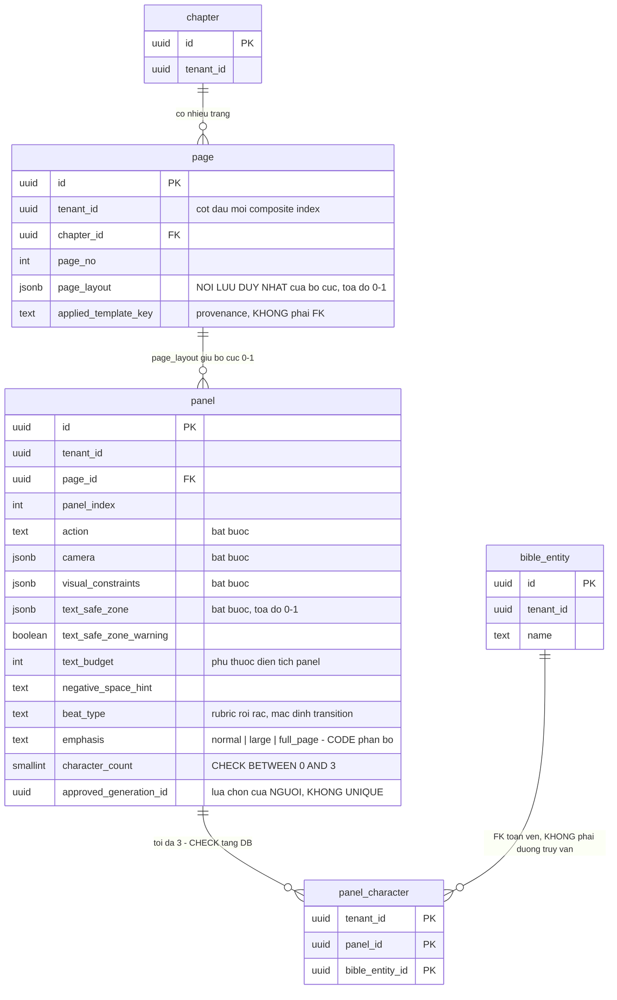

# DB Entity: Comic IR

Cụm `comic.page` · `comic.panel` · `comic.panel_character` (+ quyết định về `layout_template`) tồn tại để **spec là dữ liệu chính, ảnh chỉ là output** — và vì ⭐ **`CHECK` trần ≤3 nhân vật/panel trải qua CẢ HAI bảng `panel` + `panel_character`**: đặc tả một bảng thôi thì constraint đó ⛔ không viết được.

**Decided in:**

- [ADR-012 — Comic IR: spec là dữ liệu chính, ảnh chỉ là output](../Architecture/ADR-012-Comic-IR-Spec-As-Primary-Data.md) — `## Decision` điều 1–9 (`D-20`…`D-25`), `## Consequences` **hợp đồng #1–#9** mà file này kế thừa, và **hai `TBD` giao cho lô DB Schema**
- [ADR-009 — Modular monolith, ba schema](../Architecture/ADR-009-Modular-Monolith-Three-Schemas.md) — schema `comic` (`M3`, `M4`, `M6`); `B-1`
- [ADR-010 — Cô lập tenant bằng `tenant_id` + RLS](../Architecture/ADR-010-Tenant-Isolation-With-RLS.md) — `D1`, `D2`, `D3`
- [ADR-006 — RLS & tenant context injection](../Architecture/ADR-006-RLS-Tenant-Context-Injection.md) — `D2`
- [ADR-013 — Typeset layer tách khỏi art](../Architecture/ADR-013-Typeset-Layer-Separate-From-Art.md) — `D-33` (`text_budget` phụ thuộc diện tích panel)
- [SDD Comic Studio](../Architecture/SDD-Comic-Studio.md) — §3.2, §4.1, §4.2

---

## ⭐ Quyết định của lô này: `layout_template` là **SEED DATA / hằng số trong code**, ⛔ KHÔNG phải bảng

[ADR-012 mục `TBD`](../Architecture/ADR-012-Comic-IR-Spec-As-Primary-Data.md) giao câu hỏi này cho **Architect tại lô DB Schema** (PM duyệt tại gate), vì nguyên văn Phase 1 thoả **cả hai** cách đọc ([findings/architect §7 `G14`](../../010-Planning/pm-runs/2026-08-28-phase-2-architecture-design-comic-studio/findings/architect.md)). ⛔ Không để `TBD`.

> **CHỐT: preset layout là một registry hằng số, versioned trong code (seed), ⛔ không có bảng `comic.layout_template`.**

**Bốn lý do — theo thứ tự sức nặng:**

1. ⭐ **Quyết định này chỉ đảo được theo MỘT chiều, và chiều rẻ là chiều em đang chọn.** `D-22` chốt `page_layout JSONB` là **nơi lưu duy nhất** của bố cục ⇒ apply template = **copy** giá trị vào `page.page_layout`; dữ liệu bố cục **không bao giờ** sống trong template. Vì vậy thêm một catalog table về sau là **migration thuần cộng thêm**, ⛔ không đụng row nào đã có. Chiều ngược lại — dựng bảng ngay rồi bỏ — mới là chiều đắt.
2. **⛔ Không Story nào trong horizon ghi template lúc runtime.** [Story-Page-Template-Layout-And-Swap-Panel](../../022-User-Stories/Backlog/Story-Page-Template-Layout-And-Swap-Panel.md) là **MVP2, không `⭐`**, và nó chỉ **áp dụng** preset (`SRS-FR-10` — *"đổi layout template bằng một click"*). ⛔ Không hàng requirement nào cho người dùng **tạo** template.
3. **Mỗi bảng mới trong `comic` là một mở rộng của bề mặt cô lập tenant, đổi lấy 0 requirement.** Catalog preset hoặc là **toàn cục** (tạo tiền lệ *"bảng nghiệp vụ không có `tenant_id`"* — đúng thứ `SRS-NFR-01` và [ADR-010 `D1`](../Architecture/ADR-010-Tenant-Isolation-With-RLS.md) đo bằng thuộc tính **toàn cục**), hoặc phải **seed theo từng tenant** (một cỗ máy provisioning ⛔ không có anchor nào).
4. **`bus factor = 1`, ⛔ không có code review** (`CF-1.2`): hằng số trong code được **git + CI kiểm**; một catalog table trong DB ⛔ không có ai review.

**Hình dạng bắt buộc của registry** — đây là phần giữ quyết định nằm trong ranh giới [ADR-012 alternative (e)](../Architecture/ADR-012-Comic-IR-Spec-As-Primary-Data.md):

| Quy tắc | Nội dung |
|---|---|
| `LT-1` | Mỗi preset dùng **đúng cùng một hình dạng JSON** với `page.page_layout` — toạ độ **chuẩn hoá 0–1**. ⛔ **Không** hình dạng thứ hai, ⛔ không tầng dịch, ⛔ không renderer thứ hai (`CF-9.1`) |
| `LT-2` | Apply template = **copy** preset vào `page.page_layout` (**materialize**). Đường render ⛔ **không bao giờ** đọc registry — nó chỉ đọc `page.page_layout` |
| `LT-3` | `comic.page.applied_template_key TEXT NULL` ghi lại preset đã áp — **chỉ để provenance**, ⛔ **không phải khoá ngoại**, ⛔ không cột nào của đường render phụ thuộc nó |
| `LT-4` | Sửa một hằng số preset ⛔ **không** làm trôi các page đã apply — vì bố cục đã được materialize (`LT-2`). Đây là tính chất, không phải hệ quả phụ |
| `LT-5` | Registry được validate bởi **cùng** hàm `comic.is_normalized_layout()` (xem `INV-5`) trong một test CI, để preset ⛔ không lọt vào code với toạ độ ngoài `[0,1]` |

⚠️ **Điều kiện đảo quyết định** (ghi sẵn để run sau không phải suy đoán): xuất hiện một requirement cho **người dùng tự tạo/lưu template**, hoặc template cần **phạm vi theo tenant**. Khi đó thêm bảng `comic.layout_template` với `tenant_id NOT NULL` + RLS, và `applied_template_key` được nâng thành FK — ⛔ không đụng dữ liệu `page_layout` đã có.

⚠️ **Cần PM duyệt tại gate** theo đúng dòng *"**Architect tại lô DB Schema**, PM duyệt"* của [ADR-012 mục `TBD`](../Architecture/ADR-012-Comic-IR-Spec-As-Primary-Data.md).

---

## Bảng

### `comic.page`

Một trang comic. ⭐ `page_layout` là **nơi lưu duy nhất** của bố cục (`D-22`).

| Cột | Kiểu | NULL? | Mặc định | Mô tả |
|---|---|:--:|---|---|
| `id` | `UUID` | ⛔ | `gen_random_uuid()` | Khoá chính |
| `tenant_id` | `UUID` | ⛔ | — | `SRS-NFR-01` |
| `project_id` | `UUID` | ⛔ | — | Tác phẩm cha (phạm vi kiểm nhất quán) |
| `chapter_id` | `UUID` | ⛔ | — | Chapter mà page thuộc về |
| `page_no` | `INTEGER` | ⛔ | — | Thứ tự trang trong chapter |
| `page_layout` | `JSONB` | ⛔ | — | ⭐ Bố cục, **toạ độ chuẩn hoá 0–1**. ⛔ **Không `DEFAULT`** — xem `INV-1` |
| `applied_template_key` | `TEXT` | ✅ | `NULL` | Preset đã áp (`LT-3`). ⛔ **Không phải FK** |
| `created_at` | `TIMESTAMPTZ` | ⛔ | `now()` | — |
| `updated_at` | `TIMESTAMPTZ` | ⛔ | `now()` | — |

- **Khoá chính**: `(id)`
- **Khoá ngoại**: `(tenant_id, chapter_id, project_id) → story.chapter(tenant_id, id, project_id)` — ⚠️ FK chéo schema, xem `INV-8`
- ⛔ **Không cột trạng thái gate ở đây.** Trạng thái hai human gate ở **mức `dialogue_line`** và trạng thái mức page là **giá trị dẫn xuất, ⛔ không materialize** — xem [`DB-Entity-Dialogue-And-Gate.md`](./DB-Entity-Dialogue-And-Gate.md).

### `comic.panel`

⭐ **Panel Specification** — bản ghi dữ liệu chính của tầng `comic` (`D-20`).

| Cột | Kiểu | NULL? | Mặc định | Mô tả |
|---|---|:--:|---|---|
| `id` | `UUID` | ⛔ | `gen_random_uuid()` | Khoá chính |
| `tenant_id` | `UUID` | ⛔ | — | `SRS-NFR-01` |
| `project_id` | `UUID` | ⛔ | — | Phạm vi kiểm nhất quán |
| `page_id` | `UUID` | ⛔ | — | Trang cha |
| `panel_index` | `INTEGER` | ⛔ | — | Thứ tự đọc panel trong trang |
| `action` | `TEXT` | ⛔ | ⛔ **không có** | **Trường bắt buộc #2** của `STORY-C-01` — hành động |
| `camera` | `JSONB` | ⛔ | ⛔ **không có** | **Trường bắt buộc #3** — camera. Hình dạng chi tiết do Visual Prompt Compiler định nghĩa ([ADR-014](../Architecture/ADR-014-Deterministic-Prompt-Compiler-And-Best-Of-N.md), lô song song); lô này chỉ chốt `NOT NULL` |
| `visual_constraints` | `JSONB` | ⛔ | ⛔ **không có** | **Trường bắt buộc #4** — ràng buộc thị giác |
| `text_safe_zone` | `JSONB` | ⛔ | ⛔ **không có** | **Trường bắt buộc #5** — mảng ≥0 vùng toạ độ **0–1** (`D-25`). Mảng **rỗng** là hợp lệ cho panel gần kín khung, kèm `text_safe_zone_warning` |
| `text_safe_zone_warning` | `BOOLEAN` | ⛔ | `false` | Panel gần kín khung ⇒ vùng rỗng/tối thiểu **kèm cảnh báo**; ⛔ không ép một vùng đè lên nhân vật *"cho có"* |
| `text_budget` | `INTEGER` | ✅ | `NULL` | Ngân sách chữ, **phụ thuộc diện tích panel** (`BR-003-12`). `NULL` = chưa có layout ⇒ ⛔ chưa được chạy condensation (`SRS-FR-15`). ⚠️ **Đơn vị = `TBD`** |
| `negative_space_hint` | `TEXT` | ✅ | `NULL` | Gợi ý chỗ trống truyền **xuống prompt** (`D-25`) — ràng buộc đi **ngược** từ typesetting vào compiler |
| `beat_type` | `TEXT` | ⛔ | `'transition'` | Rubric **rời rạc** (`D-23`). Mặc định tường minh khi scene thiếu tín hiệu. Danh mục cưỡng chế bằng `CHECK (beat_type IN (…))` — giá trị khởi tạo xem hàng `TBD`. ⛔ **Không** Postgres enum type ([`E15`](../../010-Planning/pm-runs/2026-08-28-phase-2-architecture-design-comic-studio/escalations.md)) |
| `emphasis` | `TEXT` | ⛔ | `'normal'` | `CHECK (emphasis IN ('normal','large','full_page'))` — ⛔ **không** Postgres enum type ([`E15`](../../010-Planning/pm-runs/2026-08-28-phase-2-architecture-design-comic-studio/escalations.md)). Hạng diện tích **do CODE phân bổ theo quota**, ⛔ không do LLM (`D-23` điều 7) |
| `character_count` | `SMALLINT` | ⛔ | `0` | ⭐ Bộ đếm nhân vật — **chỗ cắm của `CHECK` trần ≤3** (`INV-2`), đồng thời là đầu vào *"code đếm"* của bảng tra `D-23` |
| `approved_generation_id` | `UUID` | ✅ | `NULL` | ⭐ **Lựa chọn của NGƯỜI** trong best-of-N. `NULL` = chưa duyệt bản nào. ⚠️ Hướng quan hệ này do lô song song chốt — [`DB-Entity-Generation.md`](./DB-Entity-Generation.md) `E-4` ghi *"lựa chọn của người sống ở `comic.panel.approved_generation_id` + `public.change_log`"*. Kiểu/đích FK sang `generation.generation` **do file đó sở hữu**; lô này chỉ mở cột trên bảng của mình. ⛔ **Không** UNIQUE, ⛔ không constraint nào từ cột này suy ra *"1 spec = 1 ảnh"* (`INV-12`) |
| `created_at` | `TIMESTAMPTZ` | ⛔ | `now()` | — |
| `updated_at` | `TIMESTAMPTZ` | ⛔ | `now()` | — |

- **Khoá chính**: `(id)`
- **Khoá ngoại**: `(tenant_id, page_id, project_id) → comic.page(tenant_id, id, project_id)`
- ⛔ **Không cột hình học** (`x`, `y`, `w`, `h`, `area`…) trên `panel` — bố cục **chỉ** sống trong `page.page_layout` (`D-22`, hợp đồng #5).
- ⛔ **Không cột điểm số thực** cho bố cục dưới bất kỳ tên nào (`D-24`, `SRS-NFR-22`, hợp đồng #9).

### `comic.panel_character`

Bảng liên kết `panel` ↔ `story.bible_entity`. ⭐ Vế thứ hai của `CHECK` trần ≤3.

| Cột | Kiểu | NULL? | Mặc định | Mô tả |
|---|---|:--:|---|---|
| `tenant_id` | `UUID` | ⛔ | — | `SRS-NFR-01`, và là **cột đầu của khoá chính** |
| `panel_id` | `UUID` | ⛔ | — | Panel |
| `bible_entity_id` | `UUID` | ⛔ | — | Nhân vật trong Story Bible |
| `created_at` | `TIMESTAMPTZ` | ⛔ | `now()` | — |

- **Khoá chính**: `(tenant_id, panel_id, bible_entity_id)` — vừa là PK vừa thoả quy tắc *"`tenant_id` là cột đầu"*
- **Khoá ngoại**: `(tenant_id, panel_id) → comic.panel(tenant_id, id)` **ON DELETE CASCADE** · `(tenant_id, bible_entity_id) → story.bible_entity(tenant_id, id)` — ⚠️ FK chéo schema, xem `INV-8`

---

## Index

> ⚠️ **`tenant_id` PHẢI là cột ĐẦU TIÊN của MỌI composite index** (`SRS-NFR-01`, [ADR-010 `D2`](../Architecture/ADR-010-Tenant-Isolation-With-RLS.md)).

| Bảng | Index | Kiểu | Phục vụ truy vấn |
|---|---|---|---|
| `comic.page` | `(id)` | PK | — |
| `comic.page` | `(tenant_id, id)` | UNIQUE | Đích FK từ `panel` và từ lô typeset |
| `comic.page` | `(tenant_id, id, project_id)` | UNIQUE | Đích composite FK |
| `comic.page` | `(tenant_id, chapter_id, page_no)` | UNIQUE | Duyệt trang theo chapter; chặn trùng số trang |
| `comic.panel` | `(id)` | PK | — |
| `comic.panel` | `(tenant_id, id)` | UNIQUE | ⭐ Đích FK từ `comic.dialogue_line`, `comic.bubble` và từ bảng ảnh của schema `generation` (hợp đồng #2) |
| `comic.panel` | `(tenant_id, id, project_id)` | UNIQUE | Đích composite FK |
| `comic.panel` | `(tenant_id, page_id, panel_index)` | UNIQUE | Thứ tự đọc panel trong trang |
| `comic.panel_character` | `(tenant_id, panel_id, bible_entity_id)` | PK | Đếm/kiểm nhân vật của một panel |
| `comic.panel_character` | `(tenant_id, bible_entity_id)` | BTREE | *"Nhân vật này xuất hiện ở những panel nào"* |

> [!WARNING]
> ⛔ **Không index/khoá/constraint nào được giả định *"1 spec = 1 ảnh"*** (hợp đồng #8, `D-20`, `SRS-FR-33`).
> Cụ thể: ⛔ **không** UNIQUE trên `panel_id` ở bất kỳ bảng ảnh nào, và ⛔ không constraint nào giới hạn số generation của một panel. Một page **compile được nhiều panel spec thành một prompt** — đường lui `G2` phải đổi được **mà không đổi data model**.

---

## Constraint & Invariant

| ID | Ràng buộc | Cưỡng chế bằng | Neo |
|---|---|---|---|
| `INV-1` | ⭐ **Spec thiếu trường bắt buộc bị DB TỪ CHỐI**, ⛔ không phải log cảnh báo | `NOT NULL` trên `action`, `camera`, `visual_constraints`, `text_safe_zone`, và trên `page.page_layout`. ⚠️ ⛔ **Tuyệt đối không đặt `DEFAULT`** cho năm cột này — `DEFAULT` biến *"thiếu trường"* thành *"lọt qua"* | Hợp đồng #3 · `STORY-C-01` |
| `INV-2` | ⭐⭐ **Trần ≤3 nhân vật/panel là `CHECK` ở TẦNG DB** — insert panel 4 nhân vật **bị từ chối**, ⛔ **không phải bị cảnh báo** | Xem khối *"Cơ chế trần ≤3"* bên dưới | `D-21` · `M2-2` · `Charter §7 C3` · hợp đồng #1 |
| `INV-3` | Trần chặn **cả đường `UPDATE`** (thêm nhân vật thứ 4 vào panel đã có 3), ⛔ không chỉ `INSERT` | Trigger chạy trên `INSERT`/`UPDATE`/`DELETE` của `panel_character` | [Story-Enforce-Max-Three-Characters-Per-Panel](../../022-User-Stories/Backlog/Story-Enforce-Max-Three-Characters-Per-Panel.md) |
| `INV-4` | Trần chặn được **race**: hai transaction đồng thời mỗi cái thêm 1 nhân vật vào panel đang có 2 ⛔ không được để lọt panel 4 nhân vật | ⭐ Trigger `UPDATE comic.panel SET character_count = character_count + 1` lấy **row lock** trên đúng row `panel` ⇒ transaction thứ hai **chờ**, rồi va `CHECK` và **rollback**. Kiểm tại thời điểm commit, ⛔ không phải tại thời điểm đọc | `D-21` |
| `INV-5` | ⭐ **Mọi toạ độ trong `page_layout` và `text_safe_zone` là `0–1`**, ⛔ không pixel | `CHECK (comic.is_normalized_layout(page_layout))` và `CHECK (comic.is_normalized_layout(text_safe_zone))` — **đúng một** hàm `IMMUTABLE` dùng chung cho cả hai cột **và** cho test CI của registry preset (`LT-5`) | `D-22`, `D-25` · hợp đồng #6 |
| `INV-6` | `page_layout` là **nơi lưu duy nhất** của bố cục; template chỉ **materialize** vào cột đó | `LT-1`…`LT-4` + ⛔ vắng mặt mọi cột hình học trên `panel` | `D-22` · hợp đồng #5 |
| `INV-7` | ⛔ **Không cột Layout Score / vector điểm số thực** cho bố cục, **dưới bất kỳ tên nào** | Review DDL + test CI liệt kê cột kiểu `NUMERIC[]`/`REAL[]` trong schema `comic` | `D-24` · `SRS-NFR-22` · hợp đồng #9 |
| `INV-8` | ⭐ **FK chéo schema là ràng buộc TOÀN VẸN, ⛔ KHÔNG phải một đường truy vấn.** `B-1` cấm module `comic` **truy vấn** bảng schema `story` (lint rule ở CI) — nó ⛔ không cấm khoá ngoại. Hợp đồng #4 **bắt buộc** spec tham chiếu `character_id` không tồn tại phải bị từ chối **tại thời điểm ghi**, ⛔ không phải phát hiện muộn lúc sinh ảnh ⇒ FK là cách duy nhất đạt điều đó ở tầng DB. Đọc dữ liệu vẫn **chỉ** qua `resolveState()`/`getBible()` | FK `(tenant_id, bible_entity_id) → story.bible_entity(tenant_id, id)` + lint rule `B-1` | `B-1` · hợp đồng #4 |
| `INV-9` | Ảnh sinh ra **luôn trỏ về một spec**; ⛔ **không có ảnh mồ côi** | Lô này cung cấp **đích**: `comic.panel(id)` PK và `comic.panel(tenant_id, id)` UNIQUE. Cột FK nằm ở schema `generation` ⇒ cưỡng chế thuộc [`DB-Entity-Generation.md`](./DB-Entity-Generation.md). ⚠️ File đó đã đóng theo hướng `CHECK` `P-7` (*đúng một* trong `panel_id`/`page_id` khác `NULL`) thay vì `NOT NULL` trên một cột — đó là cách đọc **đúng** khi hợp đồng #2 và #8 áp cùng lúc, vì `SRS-FR-33` cho phép đơn vị render là **page** | `D-20` · hợp đồng #2 + #8 |
| `INV-12` | ⛔ **`approved_generation_id` ⛔ KHÔNG được nâng thành UNIQUE/`NOT NULL`** — nó là *"bản người đã duyệt"*, ⛔ không phải *"ảnh duy nhất của spec"* | Review DDL; test CI liệt kê UNIQUE index chứa `approved_generation_id` ⇒ CI đỏ | `D-20` · hợp đồng #8 · `SRS-FR-33` |
| `INV-10` | Emphasis quota (**tối đa 1 full page + 2–3 large panel** / chapter) ⛔ **KHÔNG** cưỡng chế bằng `CHECK` | ⭐ Con số là **cấu hình**, ⛔ không hard-code (`D-23`) — một constraint sẽ đóng băng nó vào DDL. Cưỡng chế ở **code** (Director) + test đếm panel hạng lớn trong 1 chapter | `D-23` · [Story-Layout-Rubric-Beat-Type-And-Emphasis-Quota](../../022-User-Stories/Backlog/Story-Layout-Rubric-Beat-Type-And-Emphasis-Quota.md) |
| `INV-11` | ⛔ Không cột kiểu binary trong ba bảng này; ⛔ không TTL/eviction trên object mà panel đã duyệt trỏ tới | Test CI `information_schema.columns` + chính sách object storage | `B-4` · [ADR-012 `## Context` (a)](../Architecture/ADR-012-Comic-IR-Spec-As-Primary-Data.md) |

### ⭐ Cơ chế trần ≤3 nhân vật/panel

```sql
ALTER TABLE comic.panel
  ADD CONSTRAINT ck_panel_max_characters
  CHECK (character_count BETWEEN 0 AND 3);
```

| Điểm | Nội dung |
|---|---|
| **Nguồn duy nhất của ngưỡng** | ⭐ Chính constraint `ck_panel_max_characters`. Test CI đọc `pg_get_constraintdef()` và **so khớp** với hằng số cấu hình phía ứng dụng ⇒ hai chỗ ⛔ không lệch được mà CI vẫn xanh. Đây là cách thoả *"giá trị cấu hình được tại MỘT chỗ duy nhất"* mà ⛔ không cần constraint đọc từ bảng (`CHECK` phải `IMMUTABLE`) |
| **Đổi `3 → 2`** | **Một** migration: `DROP CONSTRAINT` → `ADD CONSTRAINT … NOT VALID` → `VALIDATE CONSTRAINT`. Bước `VALIDATE` **làm lộ** panel 3 nhân vật đang tồn tại thay vì âm thầm cho qua. ⛔ Hệ thống **không tự siết** — chỉ xảy ra sau verdict gate `G1-d` do người quyết (`D-21` điều 4, `BR-003-06`) |
| **Đồng bộ `character_count`** | Trigger `AFTER INSERT OR UPDATE OR DELETE ON comic.panel_character FOR EACH ROW` cộng/trừ `character_count` của row `panel` tương ứng (đổi `panel_id` = trừ ở panel cũ, cộng ở panel mới) |
| ⛔ **Không được làm** | ⛔ Không thay trigger bằng validation tầng ứng dụng; ⛔ không thay `CHECK` bằng cảnh báo UI (⛔ không thoả `M2-2`); ⛔ không nới trần để giải cảnh đông người — cảnh đông giải bằng **shot xa / silhouette / crop** |
| **`character_count = 0` là HỢP LỆ** | `[Kiến trúc suy luận]` — panel establishing shot không có nhân vật. `STORY-C-01` nói *"thiếu **trường bắt buộc**"* bị từ chối; danh sách nhân vật là một **quan hệ**, vắng mặt của nó là **danh sách rỗng**, ⛔ không phải *"thiếu trường"*. Năm trường bắt buộc được cưỡng chế bằng `NOT NULL` ở `INV-1`. ⚠️ Điểm này cần **BA xác nhận** |

### `TBD` còn lại — ⛔ không được bịa

| Khoảng trống | Ai đóng | Khi nào |
|---|---|---|
| **Tập giá trị đóng của `comic.panel.beat_type`.** [Story-Layout-Rubric…](../../022-User-Stories/Backlog/Story-Layout-Rubric-Beat-Type-And-Emphasis-Quota.md) chỉ nêu *"**ví dụ**: climax, reaction, transition, establishing"* và một mặc định tường minh. ⇒ Lô này khởi tạo danh mục `CHECK` bằng **đúng bốn giá trị ví dụ đó**, mặc định `'transition'`, và đánh dấu danh sách **chưa đóng** | **BA + Founder** (kèm *anchor example* cho từng giá trị, theo `D-23`) | Trước khi `Story-Layout-Rubric-Beat-Type-And-Emphasis-Quota` vào Active Sprint |
| **Đơn vị của `text_budget`** (số ký tự hay số từ). `Glossary` mô tả bản nén ở mức *"~8–20 từ"* nhưng ⛔ không có hàng nào định nghĩa đơn vị của chính cột này | **BA + Architect**, cùng lúc với đặc tả hàm tính `text_budget` theo diện tích | Trước gate `M2-3` |
| **Hình dạng JSON chi tiết** của `camera` và `visual_constraints` — thuộc hợp đồng của Visual Prompt Compiler | **Architect tại lô `ADR-014` / `DB-Entity-Prompt-Vocabulary.md`** | Trước khi compiler được implement |
| ~~**Con trỏ `approved_generation_id`**: cột trên `comic.panel` hay cờ trên bảng ảnh~~ ⇒ ✅ **ĐÃ ĐÓNG** bởi lô song song: [`DB-Entity-Generation.md`](./DB-Entity-Generation.md) `E-4` chốt *"lựa chọn của người sống ở `comic.panel.approved_generation_id`"*. File này đã mở cột tương ứng + `INV-12`. ⚠️ Còn lại: **kiểu và đích FK** sang `generation.generation` do file đó sở hữu | — (đã đóng) | — |

---

## RLS Policy

> ⭐ **Cơ chế là nguồn duy nhất ở [ADR-006](../Architecture/ADR-006-RLS-Tenant-Context-Injection.md)** (`D1`, `D2`). ⛔ File này không quyết lại.

```sql
ALTER TABLE comic.page ENABLE ROW LEVEL SECURITY;
ALTER TABLE comic.page FORCE  ROW LEVEL SECURITY;

CREATE POLICY p_page_tenant ON comic.page
  USING      (tenant_id = public.current_tenant_id())
  WITH CHECK (tenant_id = public.current_tenant_id());
```

Lặp **y hệt** cho `comic.panel` và `comic.panel_character`.

| Điểm | Quy tắc |
|---|---|
| `app_api` | `SELECT, INSERT, UPDATE, DELETE` trên cả ba bảng |
| `app_worker` | `SELECT` trên cả ba bảng (Director + compiler đọc spec). `INSERT`/`UPDATE` trên `comic.page`, `comic.panel`, `comic.panel_character` khi Director chạy như một job. ⛔ Không `DELETE` |
| `app_public_intake` | ⛔ Không quyền nào |
| ⚠️ `panel_character` | Trigger đếm chạy `SECURITY INVOKER` ⇒ nó **cũng chịu RLS** ⇒ ⛔ không có đường nào trigger cập nhật `character_count` của một tenant khác |
| ⛔ Cấm tuyệt đối | Không `BYPASSRLS` cho role ứng dụng (`ADR-006 D4.3`) |

⚠️ **RLS là lớp phòng thủ THỨ HAI** — code vẫn phải viết `WHERE tenant_id = ...` (`SRS-NFR-01`).

---

## ER Diagram



**Chú giải**: `page`, `panel`, `panel_character` thuộc schema **`comic`**; `bible_entity` và `chapter` thuộc schema **`story`** (vẽ rút gọn — đặc tả ở [`DB-Entity-Story-Bible.md`](./DB-Entity-Story-Bible.md) và [`DB-Entity-Narrative-Timeline.md`](./DB-Entity-Narrative-Timeline.md)). ⛔ **Không có node `layout_template`** — đó là quyết định của lô này, không phải thiếu sót.

---

## Tài liệu tham khảo

- [ADR-012 — Comic IR Spec As Primary Data](../Architecture/ADR-012-Comic-IR-Spec-As-Primary-Data.md) — `## Decision` 1–9, hợp đồng #1–#9, mục `TBD`, alternative (e)
- [ADR-013 — Typeset Layer Separate From Art](../Architecture/ADR-013-Typeset-Layer-Separate-From-Art.md) — `D-33`
- [ADR-009 — Modular Monolith Three Schemas](../Architecture/ADR-009-Modular-Monolith-Three-Schemas.md) · [ADR-010 — Tenant Isolation With RLS](../Architecture/ADR-010-Tenant-Isolation-With-RLS.md) · [ADR-006 — RLS Tenant Context Injection](../Architecture/ADR-006-RLS-Tenant-Context-Injection.md) · [ADR-005 — Platform Table Schema Placement](../Architecture/ADR-005-Platform-Table-Schema-Placement.md)
- [SDD Comic Studio](../Architecture/SDD-Comic-Studio.md) — §3.2, §4.1, §4.2
- [DB-Entity-Dialogue-And-Gate.md](./DB-Entity-Dialogue-And-Gate.md) · [DB-Entity-Story-Bible.md](./DB-Entity-Story-Bible.md) · [DB-Entity-Narrative-Timeline.md](./DB-Entity-Narrative-Timeline.md)
- [UC-03 — Review Panel Script](../../020-Requirements/Use-Cases/UC-03-Review-Panel-Script.md) bước 6–7 · [UC-08 — Arrange Page And Preview](../../020-Requirements/Use-Cases/UC-08-Arrange-Page-And-Preview.md) bước 6, `EX-6`
- [Story-Comic-IR-Panel-Specification](../../022-User-Stories/Backlog/Story-Comic-IR-Panel-Specification.md) · [Story-Enforce-Max-Three-Characters-Per-Panel](../../022-User-Stories/Backlog/Story-Enforce-Max-Three-Characters-Per-Panel.md) · [Story-Text-Safe-Zone-In-Panel-Spec](../../022-User-Stories/Backlog/Story-Text-Safe-Zone-In-Panel-Spec.md) · [Story-Layout-Rubric-Beat-Type-And-Emphasis-Quota](../../022-User-Stories/Backlog/Story-Layout-Rubric-Beat-Type-And-Emphasis-Quota.md) · [Story-Page-Template-Layout-And-Swap-Panel](../../022-User-Stories/Backlog/Story-Page-Template-Layout-And-Swap-Panel.md)
- [SRS Comic Studio](../../020-Requirements/SRS-Comic-Studio.md) — `SRS-FR-07`, `SRS-FR-08`, `SRS-FR-09`, `SRS-FR-10`, `SRS-FR-11`, `SRS-FR-13`, `SRS-FR-15`, `SRS-FR-33`, `SRS-NFR-01`, `SRS-NFR-22`

---

_Created by System Architect — lô L8, Phase 2._
_Author: trisjr_
