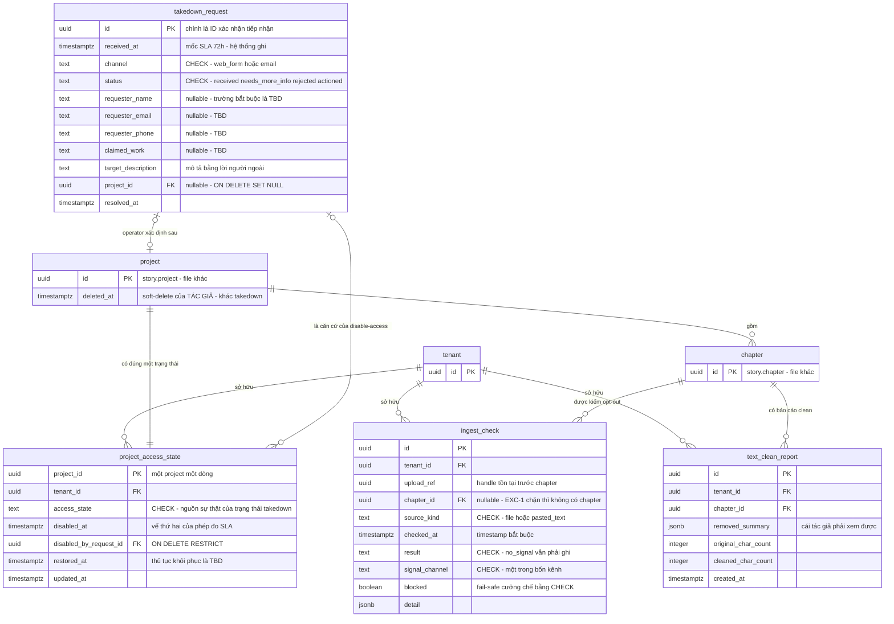

# DB Entity: Compliance & Takedown

Đặc tả bốn bảng `story.ingest_check`, `story.text_clean_report`, `public.takedown_request`, `public.project_access_state` — cụm nghĩa vụ pháp lý gồm **kiểm opt-out ở ingest** (Điều 37b) và **safe harbour ở takedown** (Điều 198b).

> [!IMPORTANT]
> ⚠️ **Cụm này nằm ở HAI schema, ⛔ không phải một** — tên đủ điều kiện bắt buộc (`G-3`):
>
> | Bảng | Schema | Vì sao |
> |---|:--:|---|
> | `story.ingest_check` · `story.text_clean_report` | **`story`** | [SDD §3.4](../Architecture/SDD-Comic-Studio.md) ghi tường minh *"schema `story` — một phần `DB-Entity-Compliance-And-Takedown.md` (`ingest_check`, `text_clean_report`)"*; [SDD §6.4](../Architecture/SDD-Comic-Studio.md) gọi tên `story.ingest_check`. Hai bảng này gắn với `story.chapter`, thuộc **đúng một** module nghiệp vụ ⇒ quy tắc phân loại [ADR-005 `Q2`](../Architecture/ADR-005-Platform-Table-Schema-Placement.md) đặt chúng ở schema module |
> | `public.takedown_request` · `public.project_access_state` | **`public`** | Nằm trong **closed list** của [ADR-005 `Q1`](../Architecture/ADR-005-Platform-Table-Schema-Placement.md) (tầng pháp lý `M9`) |
>
> ⛔ **⛔ Không đặt `ingest_check`/`text_clean_report` vào `public`**: chúng ⛔ không có trong closed list, và guardrail `G-2` bắt **sửa ADR-005 trước** — tầng Architecture đã đóng băng.

> [!CAUTION]
> ⛔⛔ **ANTI-FEATURE — `SRS-NFR-15`, độ rắn CHỐT. Đọc trước khi thiết kế bất kỳ cột nào.**
>
> Hệ thống **KHÔNG ĐƯỢC** có bộ phát hiện *"truyện này có thể có bản quyền của người khác"* — `copyright detection`, `plagiarism check`, `similarity scan`, `flag nội dung khả nghi` — **trước khi có xác nhận của luật sư**.
> **Lý do**: điều kiện (a) của miễn trừ Điều 198b là ***"không biết"***. Xây bộ phát hiện **tạo ra đúng tri thức mà luật đang miễn trừ cho việc không có** ⇒ **tự phá miễn trừ của chính mình**.
> ⚠️ ***"Một dev sẽ làm ngược điều này theo bản năng, vì 'chủ động kiểm tra' nghe như hành vi có trách nhiệm"*** ([UC-11](../../020-Requirements/Use-Cases/UC-11-Handle-Takedown-Request.md) `EF-4`).
>
> ⇒ **Hệ quả cho file này**: ⛔ **KHÔNG cột, KHÔNG bảng, KHÔNG index nào** phục vụ copyright/similarity detection. Không `similarity_score`, không `suspicion_level`, không `flagged_reason`, không `content_hash` dùng để đối chiếu chéo tenant.
> ⭐ **Ranh giới được phép**: đọc **opt-out signal do chính chủ quyền gắn vào file** là **dữ kiện khách quan** (`SRS-FR-37`) — ***"đọc nhãn không tạo ra tri thức suy đoán"***. Đó là toàn bộ những gì `story.ingest_check` làm, ⛔ không hơn.

## Decided in

| Nguồn | Nội dung kế thừa |
|---|---|
| [ADR-010 — Tenant Isolation With RLS](../Architecture/ADR-010-Tenant-Isolation-With-RLS.md) | `D1`, `D2`, `D3` · ⭐ `D7` **hai đường xoá TÁCH BIỆT** · Consequences: *"bề mặt không có tenant vẫn tồn tại"* |
| [ADR-005 — Platform Table Schema Placement](../Architecture/ADR-005-Platform-Table-Schema-Placement.md) | `Q1` closed list · `Q2` quy tắc phân loại · `Q3` `G-1`…`G-4` · ⭐ `Q4` route policy của `takedown_request` sang lô DB Schema |
| [ADR-006 — RLS Tenant Context Injection](../Architecture/ADR-006-RLS-Tenant-Context-Injection.md) | ⭐ `D6` bề mặt **không có tenant** — role `app_public_intake` **chỉ `INSERT`**; ⛔ không bypass RLS, ⛔ không `SELECT` bảng nghiệp vụ |
| [SDD §3.4, §6.4, §7.4, §9.2 `P-3`](../Architecture/SDD-Comic-Studio.md) | Vị trí hai bảng ở `story` · **dòng audit pháp lý** · bốn DB role |
| Requirement gốc | `SRS-FR-37` (opt-out Điều 37b) · `SRS-FR-38` (safe harbour Điều 198b) · ⛔ `SRS-NFR-15` (anti-feature) · `SRS-NFR-01` · `SRS-NFR-05` |
| Use Case | [UC-01](../../020-Requirements/Use-Cases/UC-01-Upload-And-Ingest-Chapter.md) bước 5–6, 9–10, `ALT-2`, `ALT-3`, `EXC-1`, `EXC-4` · [UC-11](../../020-Requirements/Use-Cases/UC-11-Handle-Takedown-Request.md) bước 2–7, `AF-1`, `AF-4`, `EF-1`…`EF-5` |
| Story | [Story-Opt-Out-Check-At-Ingest](../../022-User-Stories/Backlog/Story-Opt-Out-Check-At-Ingest.md) · [Story-Safe-Harbour-Checklist-Article-198b](../../022-User-Stories/Backlog/Story-Safe-Harbour-Checklist-Article-198b.md) · [Story-ToS-User-Warrant-And-Tenant-Hard-Delete](../../022-User-Stories/Backlog/Story-ToS-User-Warrant-And-Tenant-Hard-Delete.md) · [Story-Chapter-Ingest-And-Text-Clean](../../022-User-Stories/Backlog/Story-Chapter-Ingest-And-Text-Clean.md) |

> [!NOTE]
> **File này đóng phần `public.takedown_request` của hàng `P-3`** ([SDD §9.2](../Architecture/SDD-Comic-Studio.md)); phần ba bảng định danh đóng ở [`DB-Entity-Tenancy.md`](./DB-Entity-Tenancy.md).

---

## Bảng

### `story.ingest_check`

Một dòng = **một lần kiểm opt-out Điều 37b** trên một lần nạp nội dung. ⭐ **Ghi cả khi kết quả là *"không có signal"*** — đó là điều kiện để phép đo `M1-4` (*"100% file upload đi qua bước kiểm"*) có nghĩa.

| Cột | Kiểu | NULL? | Mặc định | Mô tả |
|---|---|:--:|---|---|
| `id` | `UUID` | ⛔ | `gen_random_uuid()` | Khoá chính |
| ⭐ `tenant_id` | `UUID` | ⛔ | — | `SRS-NFR-01` |
| ⭐ `upload_ref` | `UUID` | ⛔ | — | Định danh **lần nạp**. ⚠️ Tồn tại vì dòng `story.chapter` **có thể không bao giờ được tạo** — xem cảnh báo dưới |
| `chapter_id` | `UUID` | ✅ | `NULL` | Chapter được tạo từ lần nạp này, **nếu** nó đi tiếp |
| `source_kind` | `TEXT` | ⛔ | — | `CHECK (source_kind IN ('file','pasted_text'))` — `ALT-2` của [UC-01](../../020-Requirements/Use-Cases/UC-01-Upload-And-Ingest-Chapter.md): dán text **vẫn phải** kiểm |
| `checked_at` | `TIMESTAMPTZ` | ⛔ | `now()` | ⭐ **Timestamp bắt buộc** của bản ghi kiểm (`SRS-FR-37`) |
| `result` | `TEXT` | ⛔ | — | `CHECK (result IN ('no_signal','signal_found','unreadable','conflicting'))` |
| `signal_channel` | `TEXT` | ✅ | `NULL` | `CHECK` theo danh mục đóng bốn kênh. Kênh phát hiện — **bốn kênh bảo lưu quyền** của Điều 37b, xem [Danh mục `optout_channel`](#danh-mục-optout_channel) |
| ⭐ `blocked` | `BOOLEAN` | ⛔ | — | Pipeline có bị **chặn** không. Cưỡng chế fail-safe bằng `CHECK` — [`INV-IC-3`](#constraint--invariant) |
| `detail` | `JSONB` | ✅ | `NULL` | Bằng chứng thô đọc được từ nhãn quyền. ⛔ **Không** chứa bất kỳ điểm số/suy đoán nào (anti-feature) |

- **PK**: `(id)`
- **FK**: `tenant_id → public.tenant(id)` `ON DELETE CASCADE`
- **FK**: `chapter_id → story.chapter(id)` `ON DELETE CASCADE`

> [!WARNING]
> ⚠️ **Vì sao `chapter_id` NULLABLE mà `upload_ref` thì `NOT NULL`** — đây là chỗ dễ thiết kế sai nhất của bảng này.
> [UC-01](../../020-Requirements/Use-Cases/UC-01-Upload-And-Ingest-Chapter.md) `EXC-1`: tìm thấy opt-out signal ⇒ **hệ thống CHẶN**, chapter ⛔ **không** đi tiếp sang `text clean` ⇒ ở nhánh đó **⛔ không có dòng `story.chapter` nào tồn tại** để trỏ tới.
> ⇒ Nếu `chapter_id` là `NOT NULL`, thì **đúng những lần kiểm quan trọng nhất về pháp lý lại là những lần ⛔ không ghi được** — và `M1-4` (*"100%"*) trở thành ⛔ không thể đạt. `upload_ref` là handle tồn tại **trước** khi biết nội dung có đi tiếp hay không.

#### Danh mục `optout_channel`

**Bốn kênh bảo lưu quyền** theo NĐ 134/2026 Điều 37b `[OFF]` **tóm tắt** — danh mục **đóng**, ⛔ không thêm giá trị.

⚠️ **Mọi cột danh mục của file này (`source_kind`, `result`, `signal_channel`, `channel`, `status`, `access_state`) là `TEXT` + `CHECK`, ⛔ KHÔNG phải Postgres enum type** — quyết định toàn tầng Schema, ⛔ không ngoại lệ ([`E15`](../../010-Planning/pm-runs/2026-08-28-phase-2-architecture-design-comic-studio/escalations.md)).

| Giá trị | Kênh |
|---|---|
| `metadata` | Metadata gắn trong file |
| `technical_protection` | Biện pháp bảo vệ công nghệ |
| `rights_management_info` | Thông tin quản lý quyền **dạng máy đọc** |
| `collective_management_notice` | Thông báo công khai từ **tổ chức quản lý tập thể** đã biết |

⚠️ **Nhãn nguồn phải mang theo**: bốn kênh này đến từ bản **`[OFF]` tóm tắt** (`CF-7.5`), ⛔ **không phải nguyên văn điều luật** — nguồn gốc trả 403/paywall (`KT-5`). ⛔ Không tài liệu nào sau đây được trích bốn dòng trên như **nguyên văn luật**.
⛔ **Và ⛔ không mở rộng sang diễn giải phạm vi Điều 37a (TDM)** — đó là câu `Q1` của gate `G0`, thuộc luật sư (`CẤM-13`).

---

### `story.text_clean_report`

Một dòng = **tóm tắt những gì bước `text clean` đã loại bỏ** khỏi một chapter, để **tác giả đối chiếu** ở [UC-01](../../020-Requirements/Use-Cases/UC-01-Upload-And-Ingest-Chapter.md) bước 9–10.

| Cột | Kiểu | NULL? | Mặc định | Mô tả |
|---|---|:--:|---|---|
| `id` | `UUID` | ⛔ | `gen_random_uuid()` | Khoá chính |
| ⭐ `tenant_id` | `UUID` | ⛔ | — | `SRS-NFR-01` |
| `chapter_id` | `UUID` | ⛔ | — | Chapter đã được clean |
| `removed_summary` | `JSONB` | ⛔ | — | Danh sách đoạn bị loại kèm **lý do phân loại** (header/footer, quảng cáo, ghi chú dịch, ký tự lỗi) |
| `original_char_count` | `INTEGER` | ⛔ | — | Độ dài trước clean |
| `cleaned_char_count` | `INTEGER` | ⛔ | — | Độ dài sau clean |
| `created_at` | `TIMESTAMPTZ` | ⛔ | `now()` | |

- **PK**: `(id)`
- **FK**: `tenant_id → public.tenant(id)` `ON DELETE CASCADE`
- **FK**: `chapter_id → story.chapter(id)` `ON DELETE CASCADE`

⭐ **Vì sao bảng này tồn tại thay vì một dòng log**: [UC-01](../../020-Requirements/Use-Cases/UC-01-Upload-And-Ingest-Chapter.md) `EXC-4` — `text clean` là **deterministic** nên nó sai **một cách nhất quán**, và ***cách duy nhất phát hiện là cho người xem***. Bước 9 **bắt buộc** hiển thị phần bị loại; ⛔ không có bảng thì ⛔ không có gì để hiển thị.

⚠️ **Ranh giới**: trạng thái *"tác giả đã chấp nhận, chapter sẵn sàng cho UC-02"* (bước 10) sống trên `story.chapter` — thuộc [`DB-Entity-Narrative-Timeline.md`](./DB-Entity-Narrative-Timeline.md). ⛔ **File này không thêm cột trạng thái chapter.**

---

### `public.takedown_request`

Một dòng = **một yêu cầu hạ nội dung từ chủ sở hữu quyền — một actor NGOÀI hệ thống**, ⛔ không có tài khoản, ⛔ không thuộc tenant nào.

| Cột | Kiểu | NULL? | Mặc định | Mô tả |
|---|---|:--:|---|---|
| `id` | `UUID` | ⛔ | `gen_random_uuid()` | Khoá chính — chính là **ID xác nhận tiếp nhận** trả cho người gửi |
| ⭐ `received_at` | `TIMESTAMPTZ` | ⛔ | `now()` | ⭐ **Mốc đếm SLA 72 giờ.** ⛔ **DO HỆ THỐNG GHI** — xem [`INV-TR-1`](#constraint--invariant) |
| `channel` | `TEXT` | ⛔ | — | `CHECK (channel IN ('web_form','email'))` — hai kênh của `SRS-FR-38` (form + `copyright@`) |
| `status` | `TEXT` | ⛔ | `'received'` | `CHECK (status IN ('received','needs_more_info','rejected','actioned'))` |
| `requester_name` | `TEXT` | ✅ | `NULL` | ⚠️ Nullable **có chủ đích** — xem cảnh báo dưới |
| `requester_email` | `TEXT` | ✅ | `NULL` | ⚠️ Như trên |
| `requester_phone` | `TEXT` | ✅ | `NULL` | ⚠️ Như trên |
| `claimed_work` | `TEXT` | ✅ | `NULL` | Tác phẩm mà người gửi tuyên bố sở hữu quyền |
| `target_description` | `TEXT` | ✅ | `NULL` | Mô tả nội dung bị khiếu nại **bằng lời của người ngoài** — họ ⛔ không biết khoá nội bộ của ta |
| `project_id` | `UUID` | ✅ | `NULL` | Project mà **operator** xác định được sau khi đánh giá. ⛔ **Không** do người gửi cung cấp |
| `resolved_at` | `TIMESTAMPTZ` | ✅ | `NULL` | Thời điểm chuyển sang `'actioned'`/`'rejected'` |

- **PK**: `(id)`
- **FK**: `project_id → story.project(id)` **`ON DELETE SET NULL`**
- ⛔ **KHÔNG có `tenant_id`** — xem [Vì sao bảng này ⛔ không có `tenant_id`](#-vì-sao-publictakedown_request--không-có-tenant_id)

> [!CAUTION]
> ⚠️⛔ **Vì sao gần như mọi trường nội dung đều NULLABLE — đây ⛔ KHÔNG phải cẩu thả.**
> **Danh sách trường bắt buộc của một yêu cầu takedown HỢP LỆ là `TBD`.** [UC-11](../../020-Requirements/Use-Cases/UC-11-Handle-Takedown-Request.md) `EF-1(a)` ghi rõ lý do: **nguyên văn NĐ 17/2023 và NĐ 134/2026 chưa đọc được** (403 / paywall — `KT-5`), và cả `SRS-FR-38` lẫn `BRD-007` đều ⛔ **không** liệt kê trường bắt buộc.
> ⇒ Đặt `NOT NULL` bây giờ là **bịa một nghĩa vụ pháp lý** và biến nó thành **ràng buộc DB** — loại lỗi đắt nhất của cụm này: một yêu cầu thật, hợp lệ theo luật, có thể **bị DB từ chối** và **đồng hồ SLA ⛔ không bao giờ bắt đầu**.
> ⇒ **Tính hợp lệ được đánh giá ở tầng nghiệp vụ** (`status = 'needs_more_info'` + đường phản hồi yêu cầu bổ sung), ⛔ **không ở tầng constraint**. **Ai đóng**: luật sư SHTT (`SRS-NFR-17` nhóm câu hỏi gate `G0`) → PM.

#### ⭐ Vì sao `public.takedown_request` ⛔ không có `tenant_id`

⚠️ **Đây là ngoại lệ duy nhất của `D-09` trong cụm này, và nó đã được lường trước** — [ADR-010](../Architecture/ADR-010-Tenant-Isolation-With-RLS.md) Consequences: *"Bề mặt không có tenant vẫn tồn tại: công cụ tiếp nhận takedown là **công khai, không cần tài khoản** ⇒ có ít nhất một đường vào hệ thống không mang tenant context"*; và [ADR-005 `G-4`](../Architecture/ADR-005-Platform-Table-Schema-Placement.md) viết điều kiện là *"mọi bảng nhóm P **có `tenant_id`** vẫn tuân `D-09`"* — tức có bảng ⛔ không có.

| Lý do | Nội dung |
|---|---|
| **1. ⛔ Không có tenant ở thời điểm `INSERT`** | Người gửi là actor **ngoài mọi tenant**. Một `tenant_id NOT NULL` ⛔ không điền được; một `tenant_id NULL` thường trực là **cột nói dối** — nó gợi ý bảng này phân vùng theo tenant, mà ⛔ không |
| **2. ⭐ `ON DELETE CASCADE` sẽ XOÁ MẤT BẰNG CHỨNG CỦA CHÍNH NỀN TẢNG** | [Story-ToS](../../022-User-Stories/Backlog/Story-ToS-User-Warrant-And-Tenant-Hard-Delete.md) mục 4 bắt **100%** FK tới `tenant.id` dùng `ON DELETE CASCADE`. ⇒ Có `tenant_id` nghĩa là tenant hard-delete **xoá luôn hồ sơ SLA 72 giờ** — hồ sơ **của nền tảng**, ⛔ không phải dữ liệu của tenant. [UC-11](../../020-Requirements/Use-Cases/UC-11-Handle-Takedown-Request.md) `EF-3` cho thấy hai đường này **gặp nhau thật**: project đã bị hard-delete **trước** khi yêu cầu đến |
| **3. `project_id` là `ON DELETE SET NULL`, ⛔ không CASCADE** | Cùng lý do 2: project biến mất thì **dòng yêu cầu vẫn còn**, chỉ mất tham chiếu. Đúng trạng thái mà `EF-3` mô tả — *"nội dung không còn tồn tại trên hệ thống"* mà yêu cầu thì vẫn đã được tiếp nhận |

⚠️ **Hệ quả phải ghi ra**: dòng `takedown_request` **sống lâu hơn** tenant liên quan, và nó **chứa dữ liệu cá nhân của người ngoài** (email, số điện thoại). Chính sách **lưu giữ/xoá** cho nhóm dữ liệu này là **`TBD`** — `SRS` §5.2 hàng `b-4` ghi thẳng rằng ⛔ **chưa ai xác định nghĩa vụ dữ liệu cá nhân nào áp dụng**, dù `SRS-FR-38` **bắt buộc thu email + số điện thoại**. **Ai đóng**: PM + luật sư. ⛔ File này ⛔ không tự quyết.

---

### `public.project_access_state`

Một dòng = **trạng thái truy cập hiện hành của MỘT project**. ⭐ `PK` là `project_id` ⇒ **đúng một dòng cho mỗi project**.

| Cột | Kiểu | NULL? | Mặc định | Mô tả |
|---|---|:--:|---|---|
| `project_id` | `UUID` | ⛔ | — | Khoá chính — ⭐ **một project, một trạng thái** |
| ⭐ `tenant_id` | `UUID` | ⛔ | — | `SRS-NFR-01`. Bảng này **có** tenant ⇒ tuân `D-09` đầy đủ |
| `access_state` | `TEXT` | ⛔ | `'active'` | `CHECK (access_state IN ('active','disabled_by_takedown'))` |
| `disabled_at` | `TIMESTAMPTZ` | ✅ | `NULL` | Thời điểm disable-access — ⭐ **vế thứ hai của phép đo SLA 72 giờ** |
| `disabled_by_request_id` | `UUID` | ✅ | `NULL` | Yêu cầu takedown đã gây ra trạng thái này |
| `restored_at` | `TIMESTAMPTZ` | ✅ | `NULL` | Thời điểm khôi phục truy cập, nếu có. ⚠️ **Thủ tục khôi phục = `TBD`** — xem dưới |
| `updated_at` | `TIMESTAMPTZ` | ⛔ | `now()` | |

- **PK**: `(project_id)`
- **FK**: `project_id → story.project(id)` `ON DELETE CASCADE`
- **FK**: `tenant_id → public.tenant(id)` `ON DELETE CASCADE`
- **FK**: `disabled_by_request_id → public.takedown_request(id)` **`ON DELETE RESTRICT`** — ⛔ không được xoá một yêu cầu đang là căn cứ của một disable-access

⭐ **`PK = project_id` chính là lời giải cho AC unhappy path** *"nhiều yêu cầu takedown trùng lặp cho cùng một nội dung ⛔ không được tạo ra nhiều lần disable-access chồng chéo gây nhầm lẫn trạng thái"* ([Story-Safe-Harbour](../../022-User-Stories/Backlog/Story-Safe-Harbour-Checklist-Article-198b.md) mục 4). N yêu cầu → **một** dòng trạng thái. ⛔ Cấu trúc dữ liệu làm trạng thái chồng chéo **không biểu diễn được**, ⛔ không phải nhờ code cẩn thận.

⚠️ **Ranh giới với `story.project.deleted_at`** — hai khái niệm, ⛔ không gộp ([`DB-Entity-Narrative-Timeline.md`](./DB-Entity-Narrative-Timeline.md) đã ghi cùng phân biệt này):

| | `story.project.deleted_at` | `public.project_access_state.access_state` |
|---|---|---|
| Ai gây ra | **Tác giả** (tenant) tự xoá mềm | **Takedown** từ người ngoài |
| Nguồn sự thật cho câu hỏi *"project này có đang bị takedown không"* | ❌ ⛔ **KHÔNG** | ✅ **ĐÚNG — nguồn duy nhất** |

> **`CO-2`** — ràng buộc giao diện: ⛔ **không đường code nào được suy ra trạng thái takedown từ `deleted_at`**. Hai cột phải được đọc **độc lập**; đường đọc/export kiểm **cả hai**.

---

## Index

> ⭐ **Quy tắc**: `tenant_id` là **cột ĐẦU TIÊN** của **MỌI** composite index trên bảng **có** `tenant_id` (`SRS-NFR-01`, [ADR-010 `D2`](../Architecture/ADR-010-Tenant-Isolation-With-RLS.md)).

| Bảng | Index | Cột | Phục vụ truy vấn nào |
|---|---|---|---|
| `story.ingest_check` | `ix_ingest_check_upload` | `(tenant_id, upload_ref)` | Đối chiếu **1 lần nạp ↔ 1 bản ghi kiểm** — chính là phép đo `M1-4` |
| `story.ingest_check` | `ix_ingest_check_chapter` | `(tenant_id, chapter_id, checked_at DESC)` | *"Chapter này đã qua kiểm opt-out chưa"* — điều kiện của [Story-Safe-Harbour](../../022-User-Stories/Backlog/Story-Safe-Harbour-Checklist-Article-198b.md) mục 4 |
| `story.ingest_check` | `ix_ingest_check_blocked` | `(tenant_id, checked_at DESC)` **WHERE `blocked`** | ⭐ Operator **rà log định kỳ** các lần bị chặn (`R-06`). Partial index vì đây là thiểu số |
| `story.text_clean_report` | `ix_text_clean_chapter` | `(tenant_id, chapter_id, created_at DESC)` | Hiển thị tóm tắt ở bước 9 |
| `public.takedown_request` | *(PK)* | `(id)` | Tra theo ID xác nhận |
| ⚠️ `public.takedown_request` | `ix_takedown_sla` | `(status, received_at)` | ⭐ **Đếm ngược SLA 72 giờ** — *"quá 72 giờ chưa xử lý phải phát hiện được"*. ⚠️ **⛔ Không mở đầu bằng `tenant_id`** vì bảng ⛔ không có cột đó |
| `public.project_access_state` | *(PK)* | `(project_id)` | Kiểm trạng thái ở mọi đường đọc/export |
| `public.project_access_state` | `ix_pas_disabled` | `(tenant_id, access_state)` | *"Project nào của tenant này đang bị disable"* |

> [!WARNING]
> ⚠️ **`ix_takedown_sla` là một ngoại lệ của `D2` — ghi ra thay vì giấu.**
> `D2` phát biểu ràng buộc trên composite index của bảng **phân vùng theo tenant**. `public.takedown_request` ⛔ **không** phân vùng theo tenant (xem [lý do](#-vì-sao-publictakedown_request--không-có-tenant_id)) ⇒ ⛔ **không có `tenant_id` để đặt lên đầu**.
> ⇒ **Test catalog của `M1-1` phải mang allowlist gồm tên bảng này.** Hai ngoại lệ còn lại (`ux_user_external_auth`, `ix_membership_user`) ở [`DB-Entity-Tenancy.md` `INV-T-6`](./DB-Entity-Tenancy.md) — ⭐ **allowlist là hợp nhất của hai file, ⛔ không phải hai danh sách rời**.

---

## Constraint & Invariant

| Mã | Invariant | Cưỡng chế bằng |
|:--:|---|---|
| **`INV-IC-1`** | ⭐ **100%** lần nạp có **≥1** dòng `ingest_check` | ⚠️ ⛔ **KHÔNG cưỡng chế được bằng constraint** — ⛔ không tồn tại bảng *"lần nạp"* để đặt FK ngược. Cưỡng chế bằng **một stage bắt buộc trong pipeline** + đối chiếu số file với số dòng log (`M1-4`). ⛔ Ghi trung thực thay vì hứa một constraint không tồn tại |
| **`INV-IC-2`** | Kết quả `'no_signal'` **vẫn phải ghi một dòng** | Cùng cơ chế `INV-IC-1`. ⭐ Đây là điều dễ bị "tối ưu" nhất — *"không có signal thì ghi làm gì"* — và bỏ nó làm **sập** phép đo `100%` |
| **`INV-IC-3`** | ⭐ **Fail-safe**: `result <> 'no_signal'` ⇒ `blocked = TRUE` | `CHECK (result = 'no_signal' OR blocked)`. ⇒ `'unreadable'` (metadata hỏng) và `'conflicting'` (bốn kênh mâu thuẫn) **bắt buộc chặn**; ⛔ **không** được coi mặc định là *"không có signal"* rồi cho qua ([Story-Opt-Out](../../022-User-Stories/Backlog/Story-Opt-Out-Check-At-Ingest.md) mục 4, unhappy path) |
| **`INV-IC-4`** | `result = 'signal_found'` ⇒ `signal_channel IS NOT NULL` | `CHECK` — chặn ⇒ phải nói được **chặn vì kênh nào** |
| **`INV-IC-5`** | ⛔ **Không cột nào biểu diễn suy đoán vi phạm** | Review + test CI liệt kê `information_schema.columns` của bốn bảng. ⭐ Cưỡng chế `SRS-NFR-15` — xem [khối anti-feature](#db-entity-compliance--takedown) |
| **`INV-IC-6`** | ⛔ **Không có đường cấu hình nào bỏ qua phép kiểm** (`KC-6`) | ⚠️ Tầng pipeline, ⛔ không phải tầng DB. Phép đo là `M1-4` = **100%**, ⛔ không có ngoại lệ theo kênh nạp (kể cả `pasted_text`) |
| **`INV-TR-1`** | ⭐ `received_at` **do hệ thống ghi**, ⛔ không nhận từ client | `DEFAULT now()` + role `app_public_intake` ⛔ **không được** cấp quyền ghi cột này. ⚠️ Đây là **bằng chứng SLA**; nhận giá trị từ bên ngoài là để người khác đặt lại đồng hồ nghĩa vụ của mình |
| **`INV-TR-2`** | Trường nội dung **nullable** — tính hợp lệ đánh giá ở tầng nghiệp vụ | ⛔ Không `NOT NULL` — xem [cảnh báo](#publictakedown_request). Lý do: `EF-1(a)` = `TBD` |
| **`INV-TR-3`** | ⛔ **KHÔNG hard-delete** khi xử lý takedown | ⛔ Không có đường `DELETE` nào trên đường takedown; cơ chế **duy nhất** là đổi `access_state`. `D-54`: dữ liệu **phải giữ cho counter-notice** |
| **`INV-PAS-1`** | `access_state = 'disabled_by_takedown'` ⇔ `disabled_at IS NOT NULL` | `CHECK` |
| **`INV-PAS-2`** | `disabled_at IS NOT NULL` ⇒ `disabled_by_request_id IS NOT NULL` | `CHECK` — ⛔ không có disable-access nào **không truy được về một yêu cầu** |
| **`INV-PAS-3`** | Một project ⇒ **đúng một** dòng trạng thái | `PK (project_id)` |
| **`INV-PAS-4`** | ⭐ **Mọi đường đọc và export kiểm `access_state`** | ⚠️ Tầng service (`D-69`, [UC-09](../../020-Requirements/Use-Cases/UC-09-Export-Chapter.md) bước 3). ⛔ **Không** constraint DB nào cưỡng chế được *"mọi đường đọc"* — cơ chế thuộc `SDD-HG-01` và lô API |
| **`INV-PAS-5`** ⭐ | Dòng `project_access_state` được `INSERT` (`'active'`) **trong cùng transaction tạo `story.project`** ⇒ ⛔ **không project nào thiếu dòng trạng thái** | ⚠️ **`CO-3`** — ràng buộc giao diện với [`DB-Entity-Narrative-Timeline.md`](./DB-Entity-Narrative-Timeline.md) + lô API. ⭐ **Lý do là fail-closed**: nếu cho phép *"thiếu dòng"*, đường đọc buộc phải diễn giải **vắng mặt = được phép truy cập** — tức một dòng trạng thái bị mất sẽ **mở lại** một project đang bị takedown, và ⛔ **không báo lỗi nào**. ⛔ Đường đọc ⛔ không bao giờ được đọc *"thiếu dòng"* thành `'active'` |

### ⚠️ SLA 72 giờ là **phép đo**, ⛔ không phải constraint

`SRS-FR-38` chốt **72 giờ** `[OFF]` **tóm tắt**. Ràng buộc đó ⛔ **không** biểu diễn được bằng `CHECK`:

- Phép đo: `project_access_state.disabled_at − takedown_request.received_at ≤ 72h`. Hai cột **có mặt đầy đủ** để tính ⇒ nghĩa vụ **đo được**, đó là điều schema phải bảo đảm.
- ⛔ Nhưng một `CHECK` chỉ chạy **khi có dòng được ghi**; trường hợp nguy hiểm nhất — *"quá 72 giờ mà **chưa ai làm gì**"* (`EF-2`) — là trường hợp ⛔ **không có dòng nào được ghi**, tức ⛔ **không có gì để `CHECK`**.
- ⇒ Cơ chế **đếm ngược/cảnh báo** là của **tầng vận hành**, dựa trên `ix_takedown_sla`. **Ai đóng**: lô API + vận hành. ⚠️ Đây là `R-02` (`open`, owner `security-auditor`) và là điều kiện của `BLOCKER-02`.
- ⛔ **File này ⛔ không kết luận hệ quả pháp lý của việc trễ SLA** — đó là câu hỏi luật sư.

### ⛔ Hai đường xoá — ⛔ không gộp

⛔ **Takedown = soft-delete + disable-access cấp project, ⛔ KHÔNG hard delete.** Đường **hard-delete tenant** (`SRS-NFR-05`) là cơ chế **tách biệt**, do **tenant** khởi xướng.
⭐ **Bảng đối chiếu đầy đủ nằm ở [ADR-010 `D7`](../Architecture/ADR-010-Tenant-Isolation-With-RLS.md)** — ⛔ **file này không lặp lại**. Hệ quả lên schema đã ghi ở [`INV-TR-3`](#constraint--invariant) và ở `ON DELETE SET NULL` của `project_id`.

### ⚠️ Counter-notice — ⛔ KHÔNG tạo bảng ở lô này

[UC-11](../../020-Requirements/Use-Cases/UC-11-Handle-Takedown-Request.md) `AF-1` ghi rõ: repo **CHỈ** nói *"dữ liệu được giữ cho counter-notice"*, ⛔ **KHÔNG định nghĩa THỦ TỤC** — ⛔ không trường bắt buộc, ⛔ không thời hạn phản đối, ⛔ không điều kiện phục hồi, ⛔ không ai chịu trách nhiệm nếu phục hồi sai.
⇒ ⛔ **Không tạo bảng `counter_notice`.** Thiết kế một bảng cho một thủ tục chưa tồn tại là **bịa nghĩa vụ pháp lý**.
⇒ Điều schema **phải** bảo đảm — và đã bảo đảm — là **dữ liệu vẫn còn**: `INV-TR-3` + `ON DELETE RESTRICT` trên `disabled_by_request_id`. Cột `restored_at` tồn tại để trạng thái *"đã khôi phục"* có chỗ ghi, nhưng **thủ tục dẫn tới nó = `TBD`**. **Ai đóng**: luật sư SHTT → PM.

---

## RLS Policy

> ⭐ **Cơ chế: nguồn duy nhất là [ADR-006](../Architecture/ADR-006-RLS-Tenant-Context-Injection.md).** ⛔ File này không đặc tả lại.
> ⭐ **File này đóng phần `public.takedown_request` của hàng `P-3`** ([SDD §9.2](../Architecture/SDD-Comic-Studio.md)).

| Bảng | RLS | Policy |
|---|:--:|---|
| `story.ingest_check` | ✅ + `FORCE` | `USING (tenant_id = public.current_tenant_id())` — khuôn chuẩn [ADR-006 `D2`](../Architecture/ADR-006-RLS-Tenant-Context-Injection.md) |
| `story.text_clean_report` | ✅ + `FORCE` | Như trên |
| `public.project_access_state` | ✅ + `FORCE` | Như trên |
| ⭐ `public.takedown_request` | ✅ + `FORCE` | ⚠️ **Đúng MỘT policy**: `FOR INSERT TO app_public_intake WITH CHECK (true)`. ⛔ **Không** policy `SELECT` nào cho `app_api`/`app_worker` |

### ⭐ `CO-EX-1` — GRANT `SELECT` trên `public.project_access_state` cho đường export

> [!IMPORTANT]
> ⭐ **Mọi DB role được cấp `INSERT` trên `comic.export_artifact` (hiện tại là `app_api`, theo bảng grant của [`DB-Entity-Preview-And-Export.md`](./DB-Entity-Preview-And-Export.md)) BẮT BUỘC có `GRANT SELECT ON public.project_access_state`.**

| Hạng mục | Nội dung |
|---|---|
| **Phục vụ cái gì** | Trigger `export_artifact_gate_guard` (`BEFORE INSERT OR UPDATE` trên `comic.export_artifact`) gọi vị từ `comic.export_is_permitted()`; **vế (c)** của vị từ đó **đọc `public.project_access_state`** để kiểm project có đang bị takedown không (`D-69`) |
| ⚠️ **Vì sao phải pin tường minh** | Vị từ chạy **`SECURITY INVOKER`** ⇒ nó đọc bằng **quyền của role đang `INSERT`**, ⛔ không phải quyền của owner. Thiếu grant ⇒ Postgres ném **permission denied** ⇒ ⚠️ **MỌI lần export đều chết oan**, kể cả project hoàn toàn hợp lệ — một lỗi **fail-closed nhưng sai lý do**, và thông báo lỗi ⛔ không nói gì về gate |
| ⭐ **Grant ≠ RLS policy** | Bảng đã có policy tenant chuẩn ở hàng trên, nhưng **RLS chỉ lọc DÒNG NÀO đọc được — nó ⛔ không cấp quyền đọc BẢNG**. Đây đúng là khoảng trống mà `CO-EX-1` chỉ ra: ⛔ **không nguồn nào** trước lô này pin grant này |
| **Phạm vi tối thiểu** | ⛔ **CHỈ `SELECT`**, ⛔ không `INSERT`/`UPDATE`/`DELETE` — đường export ⛔ không bao giờ được **đổi** trạng thái takedown. RLS + `FORCE` vẫn áp bình thường: role chỉ thấy dòng của tenant trong context |
| ⚠️ **Ràng buộc mang theo** | Ngày có nguồn nói export chạy async ⇒ `app_worker` được cấp `INSERT` trên `comic.export_artifact` thì **cùng migration đó phải cấp `SELECT` bảng này** — ⛔ quên là export async chết oan y hệt |
| **Nguồn** | `CO-EX-1` của [`DB-Entity-Preview-And-Export.md`](./DB-Entity-Preview-And-Export.md) · cơ chế trigger ở chính file đó (⛔ file này không đặc tả lại) · `INV-PAS-4` |

### ⭐ Bề mặt **không auth, không tenant context** — RLS ⛔ không áp được ở đó

⚠️ **Đây là ngoại lệ duy nhất của mô hình RLS trong toàn hệ thống, và nó ⛔ không phải một lỗ hổng — nó là hình dạng bắt buộc của nghĩa vụ pháp lý.**

Công cụ tiếp nhận takedown là **công khai, không cần tài khoản** (`SRS-FR-38`, `D-54`) ⇒ ở thời điểm `INSERT`, ⛔ **không có tenant nào để bơm vào context**, và vì thế ⛔ **không có vị từ `tenant_id = current_tenant_id()` nào viết được**.

**Cách xử lý — đúng theo [ADR-006 `D6`](../Architecture/ADR-006-RLS-Tenant-Context-Injection.md), ⛔ không phát minh thêm:**

1. Đường này chạy dưới role riêng **`app_public_intake`**, quyền **CHỈ `INSERT`** vào `public.takedown_request` ([SDD §7.4](../Architecture/SDD-Comic-Studio.md)).
2. ⛔ **KHÔNG** giải bằng `BYPASSRLS`; ⛔ **KHÔNG** cho role này `SELECT` bất kỳ bảng nghiệp vụ nào.
3. RLS vẫn **bật** trên bảng: với `FORCE` + ⛔ không policy `SELECT`, mặc định của bảng là **fail-closed — 0 dòng** cho mọi session ⇒ ⛔ không ai đọc được bằng một câu query lạc.
4. Người gửi ⛔ **không** đọc lại được yêu cầu của mình qua database; xác nhận tiếp nhận là **ID + timestamp trả về ở tầng ứng dụng** ([Story-Safe-Harbour](../../022-User-Stories/Backlog/Story-Safe-Harbour-Checklist-Article-198b.md) mục 4).

> [!WARNING]
> ⚠️ **Một khoảng trống phải route, ⛔ không được lấp bằng cách tự phát minh role.**
> [ADR-006 `D6`](../Architecture/ADR-006-RLS-Tenant-Context-Injection.md) pin **đúng quyền `INSERT`** cho `app_public_intake`, và [SDD §7.4](../Architecture/SDD-Comic-Studio.md) chốt hệ thống có **BỐN** DB role. ⇒ ⛔ **Không nguồn nào pin ai được `SELECT`/`UPDATE` `public.takedown_request`** để operator xử lý (`received → needs_more_info / rejected / actioned`).
> **Hai đường khả dĩ**: (a) một role thứ **năm** `app_operator` — ⚠️ **sửa [SDD §7.4](../Architecture/SDD-Comic-Studio.md)**, ⛔ ngoài quyền sở hữu lô này; (b) đi qua đường **owner/vận hành** đã tồn tại.
> ⭐ **Khuyến nghị: (a)** — vì xử lý takedown là **hoạt động thường xuyên có SLA**, ⛔ không phải thao tác vận hành hiếm, và dùng role owner cho việc thường xuyên là mở rộng bề mặt DDL một cách ⛔ không cần thiết.
> **Ai đóng**: `Spec-Security-*` + `ADR-006`/`SDD §7.4`. **Khi nào**: trước khi công cụ takedown chạy thật (`BLOCKER-02`).

⚠️ **Phép đo `D3` — bảng này là ngoại lệ thứ ba**: `public.takedown_request` **có policy** mà ⛔ **không có cột `tenant_id`** ⇒ đưa vào cùng allowlist với hai bảng định danh ở [`DB-Entity-Tenancy.md`](./DB-Entity-Tenancy.md). ⭐ **Allowlist là một danh sách hợp nhất gồm ba tên**: `public.tenant`, `public."user"`, `public.takedown_request`.

---

## ER Diagram

⚠️ **Ba lưu ý đọc sơ đồ**: (1) `project` và `chapter` thuộc [`DB-Entity-Narrative-Timeline.md`](./DB-Entity-Narrative-Timeline.md), vẽ ở đây **chỉ để thấy quan hệ**; (2) ⭐ **`takedown_request` ⛔ KHÔNG có cạnh nào tới `tenant`** — đó là **điểm chính** của sơ đồ này, ⛔ không phải thiếu sót; (3) ⛔ **Không có thực thể nào biểu diễn "phát hiện vi phạm bản quyền"** — và đó cũng là một phát biểu thiết kế, theo `SRS-NFR-15`.

---

## `TBD` còn lại

| `TBD` | Ai đóng | Khi nào |
|---|---|---|
| ⭐ **Thông báo cho tenant bị takedown** — **nội dung / hình thức / thời hạn**. ⛔ Chưa ai quyết; ⛔ không nguồn nào trong repo nói | **PM / `security-auditor`** ([ADR-010](../Architecture/ADR-010-Tenant-Isolation-With-RLS.md) bảng `TBD`) | Trước khi công cụ takedown chạy thật |
| **Danh sách trường bắt buộc** của một yêu cầu takedown hợp lệ (`EF-1(a)`, `KT-5`) | **Luật sư SHTT** → PM | Gate `G0` |
| **Đồng hồ SLA 72h có tạm dừng khi chờ bổ sung thông tin không** (`EF-1(b)`) | **Luật sư SHTT** → PM | Gate `G0` |
| **Thủ tục counter-notice** — trường, thời hạn, điều kiện phục hồi, trách nhiệm (`AF-1`) | **Luật sư SHTT** → PM | Gate `G0` |
| Quyền `SELECT`/`UPDATE` `public.takedown_request` cho đường **operator** — role thứ năm hay đường owner | **`Spec-Security-*` + [ADR-006](../Architecture/ADR-006-RLS-Tenant-Context-Injection.md)/[SDD §7.4](../Architecture/SDD-Comic-Studio.md)** | Trước `BLOCKER-02` |
| **Retention / xoá dữ liệu cá nhân của người gửi takedown** (`SRS` §5.2 `b-4`) | PM + luật sư | Trước khi mở cho người ngoài upload |
| Cơ chế **đếm ngược / cảnh báo** SLA 72 giờ | Lô API + vận hành (`R-02`) | Cùng mốc trên |
| Nền tảng có được coi là *"doanh nghiệp cung cấp dịch vụ trung gian"* theo Điều 198b không (`EF-5`, câu `Q3` của `G0`) | **Luật sư SHTT** — ⛔ file này ⛔ không phân xử | Gate `G0` |

---

## Tài liệu tham khảo

- [ADR-010 — Tenant Isolation With RLS](../Architecture/ADR-010-Tenant-Isolation-With-RLS.md) — ⭐ `D7` bảng đối chiếu hard-delete vs takedown
- [ADR-005 — Platform Table Schema Placement](../Architecture/ADR-005-Platform-Table-Schema-Placement.md) — `Q1`, `Q2`, `Q3`, `Q4`
- [ADR-006 — RLS Tenant Context Injection](../Architecture/ADR-006-RLS-Tenant-Context-Injection.md) — ⭐ `D6` bề mặt không có tenant
- [SDD — Comic Studio](../Architecture/SDD-Comic-Studio.md) — §3.4, §6.4, §7.4, §9.2 `P-3`
- [SRS — Comic Studio](../../020-Requirements/SRS-Comic-Studio.md) — `SRS-FR-37`, `SRS-FR-38`, ⛔ `SRS-NFR-15`, `SRS-NFR-01`, `SRS-NFR-05`, `SRS-NFR-17`
- [UC-01 — Upload And Ingest Chapter](../../020-Requirements/Use-Cases/UC-01-Upload-And-Ingest-Chapter.md) — bước 5–6, 9–10, `ALT-2`, `ALT-3`, `EXC-1`, `EXC-4`
- [UC-11 — Handle Takedown Request](../../020-Requirements/Use-Cases/UC-11-Handle-Takedown-Request.md) — bước 2–7, `AF-1`, `AF-4`, `EF-1`…`EF-5`
- [Story-Opt-Out-Check-At-Ingest](../../022-User-Stories/Backlog/Story-Opt-Out-Check-At-Ingest.md)
- [Story-Safe-Harbour-Checklist-Article-198b](../../022-User-Stories/Backlog/Story-Safe-Harbour-Checklist-Article-198b.md)
- [Story-ToS-User-Warrant-And-Tenant-Hard-Delete](../../022-User-Stories/Backlog/Story-ToS-User-Warrant-And-Tenant-Hard-Delete.md)
- [`DB-Entity-Tenancy.md`](./DB-Entity-Tenancy.md) · [`DB-Entity-Narrative-Timeline.md`](./DB-Entity-Narrative-Timeline.md) · [`DB-Entity-Provenance-And-Usage.md`](./DB-Entity-Provenance-And-Usage.md)

---

_Created by system-architect_
_Author: trisjr_
