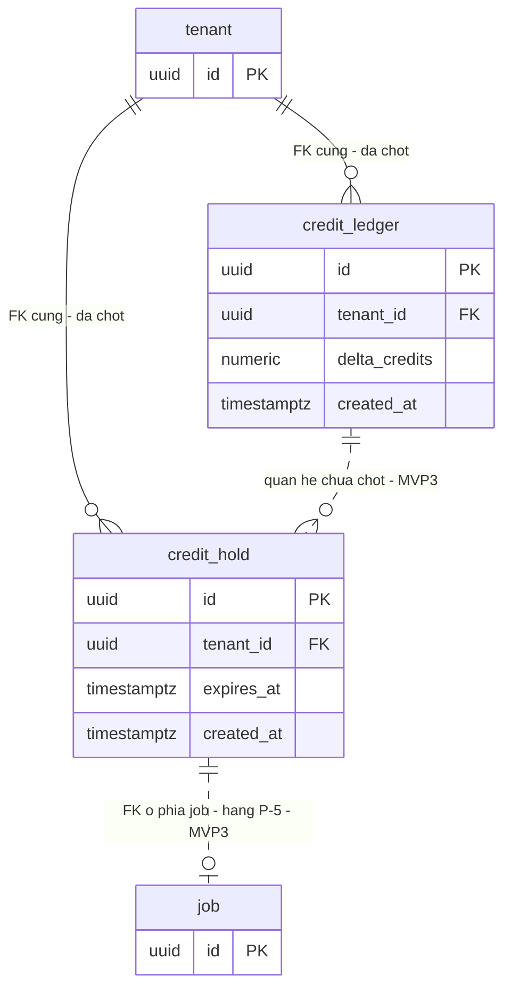

# DB Entity: Credit Ledger (RESERVE CHỖ — ⛔ chưa phải spec thi hành)

Hai bảng `public.credit_ledger` và `public.credit_hold` được **giữ chỗ** ở tầng schema để MVP3 ⛔ không phải retrofit một migration xuyên hệ thống — file này ⭐ **chỉ** chốt tên bảng, cột khoá, quan hệ với `public.tenant` và vị trí schema.

> [!IMPORTANT]
> ⚠️⚠️ **ĐỌC TRƯỚC — bốn điều làm cho file này khác mọi file `DB-Entity-*` khác:**
>
> 1. ⛔ **File này là RESERVE, KHÔNG phải spec thi hành.** ⛔ Không ai được implement hai bảng này dựa trên file này. Nó tồn tại để **giữ chỗ**, ⛔ không để hướng dẫn xây.
> 2. ⛔ **ADR-019 — ADR đặc tả credit ledger — CHƯA ĐƯỢC VIẾT (đã hoãn.)** Nêu bằng plain text, ⛔ cố ý không tạo link. Khi nào ADR đó ra đời thì **nó** là nguồn, ⛔ không phải file này.
> 3. ⚠️ **Bối cảnh đã đổi, phải đọc kỹ**: khách hàng đã chốt tại gate rằng **MVP1–MVP2 dùng rate limit per tenant cho generate** (đếm **số request**), ⛔ **KHÔNG** dùng HOLD credit. ⇒ HOLD **bất động** trong toàn horizon MVP0–MVP2. ⛔ Đừng đọc file này thành *"HOLD đã hoạt động"*. Thiết kế rate limit đó thuộc **lô song song**, ⛔ không thuộc file này.
> 4. ⛔ **Cố ý KHÔNG có ở đây**: vòng đời HOLD, hold reaper, ba tầng giá, công thức tính credit, danh sách trạng thái, quy tắc đối soát. Toàn bộ là việc của **MVP3**. Thêm bất kỳ thứ nào trong số đó vào file này là **vượt mức reserve**.

**Decided in:**

- [ADR-005 — Vị trí schema cho nhóm bảng platform](../Architecture/ADR-005-Platform-Table-Schema-Placement.md) — `Q1` liệt kê tường minh `public.credit_ledger` và `public.credit_hold`; `Q2` quy tắc phân loại (tầng kinh tế `M10` ⇒ `public`); hàng `TBD` cuối ADR route đúng việc này về lô DB Schema *"ở mức reserve chỗ"*
- [ADR-006 — Bơm tenant context vào session PostgreSQL cho RLS](../Architecture/ADR-006-RLS-Tenant-Context-Injection.md) — dạng policy duy nhất
- [ADR-003 — Auth và billing vendor](../Architecture/ADR-003-Auth-And-Billing-Vendor-Selection.md) — điều 7: ⭐ **vendor billing ⛔ KHÔNG sở hữu entitlement**; entitlement thuộc ledger của ta
- [SDD-Comic-Studio](../Architecture/SDD-Comic-Studio.md) §3.1 (hai bảng nằm ở `public`) · §3.4 (ánh xạ file) · §4.2 (invariant `CHECK (available >= 0)`) · §8.2 `S-2` (⭐ **định nghĩa mức "chừa chỗ"** cho cụm này) · §9.1 hàng `T-25`
- Requirement: [SRS-Comic-Studio](../../020-Requirements/SRS-Comic-Studio.md) `SRS-FR-28` (`KC-7`) · `SRS-FR-29` · `SRS-FR-32` (⭐ **ba tầng ngay từ đầu, ⛔ không retrofit** — lý do file này tồn tại) · `SRS-NFR-01`

> [!NOTE]
> **Vì sao ⛔ không được bỏ hẳn file này dù cụm là `[OoH]` MVP3**: `SRS-FR-32` cấm retrofit **bằng chữ**, và [SDD §8.2 `S-2`](../Architecture/SDD-Comic-Studio.md) nêu chi phí cụ thể — HOLD ⛔ không phải một lời gọi thêm đặt trước enqueue mà là **một câu ghi bên trong chính transaction enqueue**; chèn nó vào sau là **viết lại ranh giới `KC-4`**. Bỏ hẳn hai bảng này ⇒ MVP3 phải migrate **dữ liệu tiền** với hai nguồn số dư đã lệch nhau.

---

## Bảng

> ⚠️ **Danh sách cột dưới đây ⛔ KHÔNG đầy đủ và cố ý không đầy đủ.** Chỉ liệt kê **cột khoá** — thứ mà nếu thiếu ở migration đầu tiên thì MVP3 phải retrofit. Mọi cột nghiệp vụ khác (loại bút toán, trạng thái, tham chiếu hoá đơn, tầng giá…) ⛔ **chưa chốt**.

### 1. `public.credit_ledger`

**Mục đích (mức reserve)**: sổ cái **append-only** cho entitlement của một tenant — ⭐ **một nguồn sự thật duy nhất** cho số dư.

| Cột | Kiểu | NULL? | Mặc định | Mô tả |
|---|---|:--:|---|---|
| `id` | `uuid` | NOT NULL | — | Khoá chính |
| `tenant_id` | `uuid` | NOT NULL | — | ⭐ **Cột khoá của reserve.** Entitlement là **trên tenant**, ⛔ không trên artifact, ⛔ không trên user (`D-11`). Bắt buộc theo `SRS-NFR-01` + [ADR-005 `G-4`](../Architecture/ADR-005-Platform-Table-Schema-Placement.md) |
| `delta_credits` | `numeric` | NOT NULL | — | Biến thiên credit của **một** bút toán. ⚠️ **Đơn vị, thang số (`precision`/`scale`) và quy tắc dấu = `TBD` MVP3** — ⛔ file này không chốt |
| `created_at` | `timestamptz` | NOT NULL | `now()` | Thời điểm bút toán. Append-only ⇒ ⛔ không có `updated_at` |

- **PK**: `id`
- **FK**: `tenant_id` → `public.tenant(id)`
- ⛔ **Các cột còn lại: chưa chốt** (MVP3)

### 2. `public.credit_hold`

**Mục đích (mức reserve)**: giữ trước một lượng credit cho một request sinh ảnh. ⚠️ **Bất động trong horizon MVP0–MVP2** — xem cảnh báo đầu file.

| Cột | Kiểu | NULL? | Mặc định | Mô tả |
|---|---|:--:|---|---|
| `id` | `uuid` | NOT NULL | — | Khoá chính |
| `tenant_id` | `uuid` | NOT NULL | — | ⭐ Cột khoá của reserve, cùng lý do như trên |
| `expires_at` | `timestamptz` | NOT NULL | — | ⭐ Cột khoá của reserve: hold **phải có hạn**. [SDD §7.5](../Architecture/SDD-Comic-Studio.md) đã có hàng cho **hold reaper** trong bảng job theo đồng hồ. ⛔ **Cơ chế reaper KHÔNG đặc tả ở đây** |
| `created_at` | `timestamptz` | NOT NULL | `now()` | Thời điểm tạo hold |

- **PK**: `id`
- **FK**: `tenant_id` → `public.tenant(id)`
- ⛔ **Các cột còn lại: chưa chốt** (MVP3) — bao gồm lượng credit giữ, trạng thái hold, và **hướng tham chiếu tới `public.job`** (xem `CR-4`)

### Vị trí schema

Cả hai bảng nằm ở schema **`public`** của **cùng một** database, theo [ADR-005 `Q1`](../Architecture/ADR-005-Platform-Table-Schema-Placement.md) (liệt kê tường minh) và `Q2` (tầng kinh tế `M10` ⇒ `public`). Tên đủ điều kiện bắt buộc trong mọi câu SQL: `public.credit_ledger`, `public.credit_hold` (`G-3`).

---

## Index

> ⚠️ `SRS-NFR-01`: **`tenant_id` là cột ĐẦU TIÊN của mọi composite index**. PK của cả hai bảng là **một cột** (`id`) ⇒ ⛔ không phải composite index ⇒ không rơi vào phạm vi quy tắc cột đầu.

| Bảng | Index | Cột | Ghi chú mức reserve |
|---|---|---|---|
| `public.credit_ledger` | `idx_ledger_tenant_time` | `(tenant_id, created_at)` | Đường đọc cơ bản của một sổ cái append-only: liệt kê bút toán của **một** tenant theo thời gian. ⛔ Đây ⛔ **không** phải index tối ưu cho việc **tính số dư** — hình dạng đó phụ thuộc cách cưỡng chế `CHECK (available >= 0)`, còn `TBD` (`CR-2`) |
| `public.credit_hold` | `idx_hold_tenant_expires` | `(tenant_id, expires_at)` | Tra hold còn hiệu lực của **một** tenant |

> [!WARNING]
> ⚠️ **Một căng thẳng đã biết, ghi lại để MVP3 ⛔ không vấp — và ⛔ CỐ Ý không giải ở đây.**
> Hold reaper là job **theo đồng hồ**, quét hold hết hạn **xuyên tenant**. Nhưng `SRS-NFR-01` bắt `tenant_id` đứng **đầu** mọi composite index ⇒ `(tenant_id, expires_at)` ⛔ **không** phục vụ được một câu quét *"mọi hold đã hết hạn, mọi tenant"*. Đây đúng cùng một lớp vấn đề mà [ADR-006 `D4`](../Architecture/ADR-006-RLS-Tenant-Context-Injection.md) đã phải giải cho worker trên `public.job` (carve-out hẹp, tường minh, một bảng) — và nó phải được giải **cùng lúc** với RLS, ⛔ không phải sau.
> ⛔ File này **không** thiết kế index cho reaper và ⛔ **không** đề xuất carve-out. **Ai đóng**: Architect, ở MVP3, cùng lúc với ADR đặc tả credit ledger.

---

## Constraint & Invariant

| Mã | Nội dung | Trạng thái |
|---|---|---|
| **`CR-1`** | `tenant_id NOT NULL` trên cả hai bảng; RLS bật (`SRS-NFR-01`, [ADR-005 `G-4`](../Architecture/ADR-005-Platform-Table-Schema-Placement.md)) | ⭐ **CHỐT ngay** — đây là phần *"không backfill được"* của reserve |
| **`CR-2`** | ⭐ **`CHECK (available >= 0)` phải được cưỡng chế ở TẦNG DB** — [SDD §4.2](../Architecture/SDD-Comic-Studio.md) và `SRS-FR-28`: chốt cuối, ⛔ không bypass được bằng code. Hệ quả: **mọi** đường tiêu credit phải đi qua ledger; ⛔ **không** được dựng một counter ở chỗ khác *"cho nhanh"* | ⭐ **Yêu cầu CHỐT**, nhưng ⚠️ **cơ chế cưỡng chế = `TBD` MVP3**: một sổ cái append-only thuần ⛔ không có sẵn cột `available` để `CHECK`. Ba đường (cột số dư materialized · bảng số dư riêng · constraint trigger) đều có giá khác nhau. ⛔ File này **không chọn**. **Ai đóng**: Architect, MVP3 |
| **`CR-3`** | ⛔ **Vendor billing KHÔNG sở hữu entitlement** — [ADR-003](../Architecture/ADR-003-Auth-And-Billing-Vendor-Selection.md) điều 7. Số dư có đúng **một** nguồn: ledger này | ⭐ **CHỐT** ở tầng ADR-003 — ghi lại ở đây để ⛔ không ai đọc entitlement từ trạng thái subscription của vendor |
| **`CR-4`** | ⭐ **Tham chiếu giữa `public.job` và hold nằm ở PHÍA `public.job`, ⛔ không ở phía `credit_hold`.** [SDD §8.2 `S-2`](../Architecture/SDD-Comic-Studio.md) route việc này về hàng `P-5` — tức file schema của nhóm **job queue**, ⛔ không phải file này; và file đó đã giữ chỗ bằng một cột FK `NULL`-able trên `public.job`. ⇒ File này ⛔ **không** khai cột đối xứng `job_id` trên `credit_hold`. **Lý do**: hai chiều tham chiếu cho cùng một quan hệ là **hai nguồn sự thật**, và ở MVP3 chúng sẽ lệch nhau im lặng | ⭐ **Đóng ở file KHÁC** — ⛔ file này không mirror |
| **`CR-5`** | ⚠️ **HOLD ⛔ KHÔNG hoạt động ở MVP1–MVP2.** Khách hàng đã chốt tại gate: generate được chặn bằng **rate limit per tenant** (đếm số request). ⇒ ⛔ Không đường code nào trong horizon được ghi/đọc hai bảng này; hai bảng tồn tại **rỗng**. ⚠️ `UC-06` bước 4 (main flow) yêu cầu HOLD ⇒ trong horizon nó ⛔ không hiện thực trọn vẹn được — đó là hàng `T-25` ở [SDD §9.1](../Architecture/SDD-Comic-Studio.md), một **quyết định sản phẩm**, ⛔ file này không tự chọn | ⚠️ **Ràng buộc của horizon** — thiết kế rate limit thuộc **lô song song** |
| **`CR-6`** | ⚠️ **Một giả định sẽ sai nếu ai đó thiết kế theo bản năng**: lượng credit giữ trước cho một panel là **N credit** với `N` mặc định **3** (kế thừa best-of-N), ⛔ **không phải 1** — [SDD §8.2 `S-2`](../Architecture/SDD-Comic-Studio.md), `SRS-FR-28`. Nêu ở đây **chỉ** để MVP3 ⛔ không thiết kế theo `1`. ⛔ **Công thức tính credit KHÔNG thuộc file này** | ⚠️ **Con trỏ cảnh báo**, ⛔ không phải đặc tả |
| **`CR-7`** | ⛔ **File này KHÔNG đặc tả**: vòng đời HOLD (tạo → tiêu → nhả → hết hạn), cơ chế hold reaper, **ba tầng giá** (`SRS-FR-32`), bảng inbox webhook idempotent của vendor billing ([SDD §8.2 `S-3`](../Architecture/SDD-Comic-Studio.md)), công thức quy đổi credit, quy tắc đối soát | ⛔ **Ngoài phạm vi reserve** — thuộc MVP3 |

---

## RLS Policy

Cơ chế bơm tenant context: **[ADR-006](../Architecture/ADR-006-RLS-Tenant-Context-Injection.md)** — ⛔ file này không quyết lại.

| Điều | Nội dung |
|---|---|
| **Bật RLS** | Cả hai bảng có `tenant_id` ⇒ **bắt buộc** bật RLS ngay từ migration tạo bảng, ⛔ **không** hoãn tới MVP3. Bảng rỗng vẫn phải bật — [Story-Tenant-Id-And-RLS-Everywhere](../../022-User-Stories/Backlog/Story-Tenant-Id-And-RLS-Everywhere.md) đo *"RLS bật trên 100% bảng có `tenant_id`"*, và một bảng reserve **không** được phép làm phép đo đó đỏ |
| **Dạng policy** | Đúng **một** dạng theo [ADR-006 `D2`](../Architecture/ADR-006-RLS-Tenant-Context-Injection.md): `USING (tenant_id = public.current_tenant_id())` |
| **Ngoại lệ** | ⛔ **Không có ở mức reserve.** ⚠️ Hold reaper (job theo đồng hồ, quét xuyên tenant) **sẽ** cần một câu trả lời riêng ở MVP3 — xem cảnh báo ở mục [Index](#index). ⛔ Không cấp trước, ⛔ tuyệt đối không `BYPASSRLS` |

---

## ER Diagram

> ⚠️ Sơ đồ ở mức **reserve**: chỉ những quan hệ **đã chốt**. Quan hệ chưa chốt vẽ nét **đứt** kèm nhãn — nét đứt ở đây nghĩa là ⭐ *"cố ý chưa đóng"*, ⛔ không phải *"quên vẽ"*.

**Cách đọc sơ đồ:**

| Ký hiệu | Nghĩa |
|---|---|
| Nét **liền** | FK **cứng**, đã chốt ở mức reserve. ⭐ Chỉ có **hai** đường, và cả hai đều đi tới `public.tenant` |
| Nét **đứt** | ⭐ Quan hệ ở mức **reserve**: hoặc **cố ý chưa đóng** (`credit_ledger` ⟷ `credit_hold`), hoặc **cột giữ chỗ nằm ở file khác** và ⛔ **không hoạt động trong horizon** (`credit_hold` ⟷ `job`, xem `CR-4`). ⛔ Không đường đứt nào được biến thành quan hệ **hoạt động** trong MVP0–MVP2 |
| `tenant`, `job` | Vẽ ở mức **khung** — thuộc **file schema khác**, ⛔ file này không đặc tả |
| Tên trần | Tên đủ điều kiện: `public.tenant`, `public.credit_ledger`, `public.credit_hold`, `public.job` |

⚠️ **Thứ ⛔ KHÔNG có trên sơ đồ này, và đó là điều cố ý**: ⛔ không có đường nào nối hai bảng này với luồng sinh ảnh `F5` của horizon hiện tại. Ở MVP1–MVP2, đường chặn generate là **rate limit per tenant** (lô song song), ⛔ **không** phải HOLD (`CR-5`).

---

## Tài liệu tham khảo

| Tài liệu | Dùng cho phần nào |
|---|---|
| [SDD-Comic-Studio](../Architecture/SDD-Comic-Studio.md) | §3.1 vị trí schema · §3.4 ánh xạ file · §4.2 `CHECK (available >= 0)` · ⭐ §8.2 `S-2` định nghĩa mức *"chừa chỗ"* · §8.2 `S-3` ba tầng giá (⛔ ngoài phạm vi file này) · §7.5 hold reaper · §9.1 `T-25` |
| [ADR-005 — Platform Table Schema Placement](../Architecture/ADR-005-Platform-Table-Schema-Placement.md) | `Q1` tên đủ điều kiện · `Q2` quy tắc phân loại · `G-3`, `G-4` · hàng `TBD` route về lô này |
| [ADR-006 — RLS Tenant Context Injection](../Architecture/ADR-006-RLS-Tenant-Context-Injection.md) | Dạng policy · khuôn carve-out mà reaper sẽ phải mượn ở MVP3 |
| [ADR-003 — Auth And Billing Vendor Selection](../Architecture/ADR-003-Auth-And-Billing-Vendor-Selection.md) | Điều 7 — entitlement thuộc ledger của ta (`CR-3`) |
| [SRS-Comic-Studio](../../020-Requirements/SRS-Comic-Studio.md) | `SRS-FR-28` (`KC-7`) · `SRS-FR-29` · `SRS-FR-32` · `SRS-NFR-01` |
| [Story-Tenant-Id-And-RLS-Everywhere](../../022-User-Stories/Backlog/Story-Tenant-Id-And-RLS-Everywhere.md) | Phép đo *"RLS bật trên 100% bảng có `tenant_id`"* |
| **ADR-019** | ⚠️ **CHƯA ĐƯỢC VIẾT (đã hoãn)** — nêu bằng plain text, ⛔ cố ý không link. Khi ra đời, ADR đó **thay thế** file này làm nguồn |

---

_Created by architect_
_Author: trisjr_
