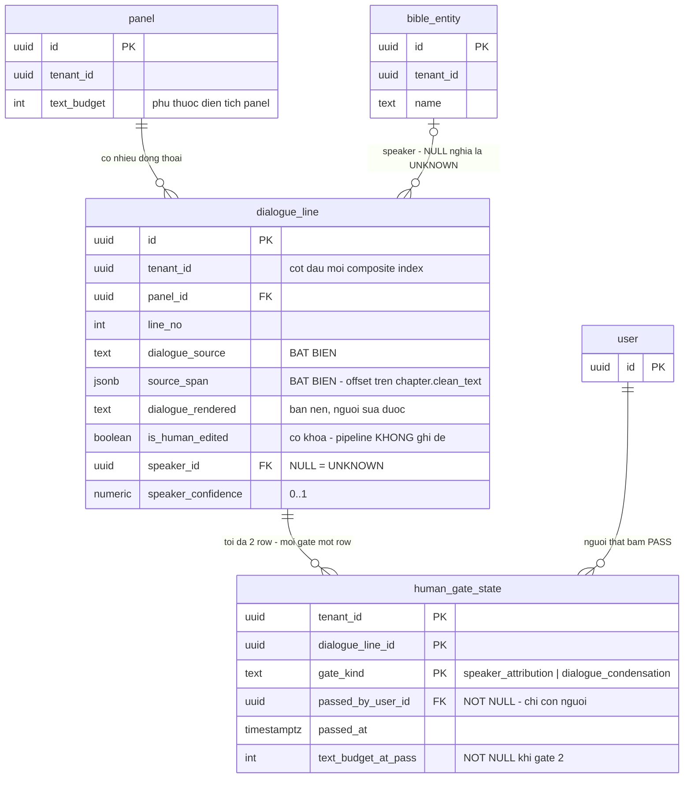

# DB Entity: Dialogue And Gate

Cặp bảng `comic.dialogue_line` · `comic.human_gate_state` tồn tại cùng một chỗ vì **hai human gate là invariant trên CẶP bảng này**: quy tắc reset gate khi `text_budget` đổi chỉ mô tả được khi cả hai nằm cạnh nhau.

**Decided in:**

- [ADR-013 — Typeset layer tách khỏi art](../Architecture/ADR-013-Typeset-Layer-Separate-From-Art.md) — `D-28` (hai field cho thoại), `D-33` (⭐ **hai trigger reset** `T1`/`T2`), `## Consequences` **hợp đồng #1, #2, #4, #5**
- [SDD Comic Studio §6.3 `SDD-HG-01`](../Architecture/SDD-Comic-Studio.md) — ⭐ **NGUỒN DUY NHẤT** của ràng buộc *"không đường nào bypass hai human gate"*: `SDD-HG-01.1`…`SDD-HG-01.7`. ⛔ File này **trỏ tới**, ⛔ **không đặc tả lại**
- [ADR-012 — Comic IR](../Architecture/ADR-012-Comic-IR-Spec-As-Primary-Data.md) — `D-25` (`text_budget` là field của panel spec)
- [ADR-017 — Provenance chain & one transaction boundary](../Architecture/ADR-017-Provenance-Chain-And-One-Transaction-Boundary.md) — ⭐ **nguồn duy nhất của `KC-4`**: `Q4.1` (phát biểu chuẩn), `Q4.2` (chính xác những bảng nào), `Q2` (`change_log`). ⛔ **Không copy nội dung**
- [ADR-010](../Architecture/ADR-010-Tenant-Isolation-With-RLS.md) `D1`–`D3` · [ADR-006](../Architecture/ADR-006-RLS-Tenant-Context-Injection.md) `D2` · [ADR-009](../Architecture/ADR-009-Modular-Monolith-Three-Schemas.md) `B-1`

---

## ⭐ Quyết định của lô này: `human_gate_state` là **BẢNG RIÊNG**, ⛔ không phải cột trên `dialogue_line`

[SDD §3.2](../Architecture/SDD-Comic-Studio.md) xếp `human_gate_state` vào nhóm *"còn tranh chấp hình thức lưu"* và ⛔ không quyết thay. ⇒ Câu hỏi thuộc lô này. ⛔ Không để `TBD`.

> **CHỐT: `comic.human_gate_state` là một bảng riêng, một row cho mỗi cặp `(dialogue_line, gate_kind)`. ⭐ Row TỒN TẠI ⇔ gate đã `PASS`; row VẮNG MẶT ⇔ gate `OPEN`.**

**Bốn lý do — theo thứ tự sức nặng:**

1. ⭐ **Tách quyền ghi ra khỏi row mang dữ liệu bất khả xâm phạm.** `dialogue_line` giữ `dialogue_source` (**BẤT BIẾN**, `SDD-HG-01.7`) và `dialogue_rendered` đã bị **khoá** khi người sửa (hợp đồng #2). Trong khi đó `T1` — reset gate #2 vì **diện tích panel đổi** — được kích hoạt từ **đường layout**, một module khác. Nếu gate state là cột, đường layout phải có quyền `UPDATE` lên **đúng row** đang giữ bản gốc bất biến và bản người đã sửa. Tách bảng cho phép cấp cho đường reset **chỉ** quyền `DELETE` trên `human_gate_state` và **không một quyền nào** trên `dialogue_line`. Với `bus factor = 1` và ⛔ không có code review, đây là khác biệt giữa *"một guardrail"* và *"một lời hứa"*.
2. ⭐ **`PASS` trở thành thứ ⛔ không thể phát sinh do sơ suất.** `SDD-HG-01.1` cấm mọi trạng thái mặc định *"đã xác nhận"*, ⛔ không migration/seed nào được ghi `PASS`. Ở dạng bảng, `PASS` **đòi một `INSERT`** mang `passed_by_user_id NOT NULL REFERENCES public.user` ⇒ một migration muốn ghi `PASS` phải **bịa ra một người có thật**, và FK sẽ chặn. Ở dạng cột, chỉ cần **một** dòng `ALTER … SET DEFAULT 'PASS'` viết nhầm.
3. **Đúng mức hạt mà `D-33` yêu cầu.** Hợp đồng #4: trạng thái gate #2 ở **mức DÒNG THOẠI**, ⛔ không phải mức panel/page — vì `T2` reset **đúng một dòng**. Khoá `(dialogue_line_id, gate_kind)` khiến `T1` (theo panel) và `T2` (theo dòng) là **hai câu `DELETE` khác phạm vi trên cùng một bảng**, ⛔ không phải hai cột phải nhớ cập nhật khác nhau.
4. **Khớp với cách nguồn đã gọi tên nó.** [SDD §3.1](../Architecture/SDD-Comic-Studio.md) liệt kê `human_gate_state` trong danh sách entity của schema `comic`, và §6.3 viết *"tổng hợp lên mức `page` (`comic.human_gate_state`)"* — tên đủ điều kiện của một bảng.

⚠️ **Hệ quả bắt buộc đi kèm — mức `page` là GIÁ TRỊ DẪN XUẤT, ⛔ KHÔNG materialize.**
[Story-Human-Gate-Speaker-Attribution](../../022-User-Stories/Backlog/Story-Human-Gate-Speaker-Attribution.md) có một AC đọc lướt sẽ tưởng là cột: *"page đó chuyển trạng thái 'đã qua gate speaker attribution'"*. ⛔ **Không được** đọc thành một cột trạng thái trên `comic.page`. Lý do là chính cảnh báo của [UC-08 `EX-2`](../../020-Requirements/Use-Cases/UC-08-Arrange-Page-And-Preview.md): *"màn hình gate vẫn hiển thị đầy đủ mà `M2-4` vẫn FAIL, nếu trạng thái `PASS` cũ được giữ lại trên một `text_budget` đã đổi"*. Một cột tổng hợp ở mức page **chính là** cái giá trị cũ bị giữ lại. ⇒ Trạng thái mức page được **tính** theo `SDD-HG-01.4` và trả ra trong response API (hệ quả #5 của `SDD-HG-01`), ⛔ không lưu.

---

## Bảng

### `comic.dialogue_line`

Một dòng thoại. ⭐ **HAI field cho thoại, ⛔ không phải một** (`D-28`).

| Cột | Kiểu | NULL? | Mặc định | Mô tả |
|---|---|:--:|---|---|
| `id` | `UUID` | ⛔ | `gen_random_uuid()` | Khoá chính |
| `tenant_id` | `UUID` | ⛔ | — | `SRS-NFR-01` |
| `project_id` | `UUID` | ⛔ | — | Phạm vi kiểm nhất quán |
| `panel_id` | `UUID` | ⛔ | — | Panel chứa dòng thoại |
| `line_no` | `INTEGER` | ⛔ | — | Thứ tự đọc trong panel |
| `dialogue_source` | `TEXT` | ⛔ | — | ⭐ **BẤT BIẾN** — nguyên văn lúc ingest. Ghi bởi hệ thống, ⛔ **không có đường `UPDATE` từ pipeline** (`INV-1`) |
| `source_span` | `JSONB` | ⛔ | — | ⭐ **BẤT BIẾN** — trỏ về văn bản gốc. Hình dạng `{"chapter_id": <uuid>, "start": <int>, "end": <int>}`, offset **nửa mở** trên `story.chapter.clean_text` (cùng quy ước với `evidence_span`) |
| `dialogue_rendered` | `TEXT` | ✅ | `NULL` | Bản đã nén. LLM đề xuất → **người duyệt**. `NULL` = chưa nén |
| `is_human_edited` | `BOOLEAN` | ⛔ | `false` | ⭐ **Cờ khoá** — người đã sửa. Pipeline re-run ⛔ **không được ghi đè** khi cờ bật (`INV-2`) |
| `speaker_id` | `UUID` | ✅ | `NULL` | Người nói. ⭐ `NULL` ≡ **`UNKNOWN`** — xem `INV-5` |
| `speaker_confidence` | `NUMERIC` | ✅ | `NULL` | Độ tin của bước gán tự động, `0..1`. **Được lưu** và hiện cờ trong UI khi thấp (`SDD-HG-01.3`) |
| `created_at` | `TIMESTAMPTZ` | ⛔ | `now()` | — |
| `updated_at` | `TIMESTAMPTZ` | ⛔ | `now()` | — |

- **Khoá chính**: `(id)`
- **Khoá ngoại**: `(tenant_id, panel_id, project_id) → comic.panel(tenant_id, id, project_id)` **ON DELETE CASCADE** · `(tenant_id, speaker_id) → story.bible_entity(tenant_id, id)` — ⚠️ FK chéo schema là ràng buộc **toàn vẹn**, ⛔ không phải đường truy vấn (`B-1`; xem `INV-8` của [`DB-Entity-Comic-IR.md`](./DB-Entity-Comic-IR.md))
- ⛔ **Không cột trạng thái gate ở đây** — đó là toàn bộ điểm của quyết định phía trên.
- ⛔ **Không cột hình học bubble ở đây.** Bubble là **layer dữ liệu riêng** (`D-29`, hợp đồng #3) và thuộc [`DB-Entity-Typeset-Layer.md`](./DB-Entity-Typeset-Layer.md) — lô song song.

### `comic.human_gate_state`

⭐ Bảng ghi **sự kiện `PASS` đang có hiệu lực** của hai human gate. Row **tồn tại** ⇔ `PASS`; row **vắng mặt** ⇔ `OPEN`.

| Cột | Kiểu | NULL? | Mặc định | Mô tả |
|---|---|:--:|---|---|
| `tenant_id` | `UUID` | ⛔ | — | `SRS-NFR-01`, và là **cột đầu của khoá chính** |
| `dialogue_line_id` | `UUID` | ⛔ | — | Dòng thoại đã qua gate |
| `gate_kind` | `TEXT` | ⛔ | — | `CHECK (gate_kind IN ('speaker_attribution','dialogue_condensation'))` — **đúng hai gate** của `SRS-FR-14`. ⚠️ ⛔ **Không** Postgres enum type: tầng Schema dùng `TEXT` + `CHECK`, ⛔ không ngoại lệ ([`E15`](../../010-Planning/pm-runs/2026-08-28-phase-2-architecture-design-comic-studio/escalations.md)) |
| `passed_by_user_id` | `UUID` | ⛔ | ⛔ **không có** | ⭐ **Người thật** đã bấm `PASS`. `NOT NULL` + FK là cưỡng chế của `SDD-HG-01.2` |
| `passed_at` | `TIMESTAMPTZ` | ⛔ | `now()` | Mốc `PASS` |
| `text_budget_at_pass` | `INTEGER` | ✅ | `NULL` | ⭐ `text_budget` của panel **tại thời điểm duyệt**. `NOT NULL` **khi và chỉ khi** `gate_kind='dialogue_condensation'` — xem `INV-6`. `[Kiến trúc suy luận]` |

- **Khoá chính**: `(tenant_id, dialogue_line_id, gate_kind)`
- **Khoá ngoại**: `(tenant_id, dialogue_line_id) → comic.dialogue_line(tenant_id, id)` **ON DELETE CASCADE** · `passed_by_user_id → public.user(id)` *(bảng `public.user` thuộc `DB-Entity-Tenancy.md` — lô song song)*
- ⛔ **Không cột `state`.** Có cột `state` là mở lại đúng cánh cửa mà lý do #2 của quyết định đóng: một giá trị mặc định viết nhầm. `OPEN` được biểu diễn bằng **vắng mặt row**, ⛔ không bằng một giá trị.

**Hai câu ghi chuẩn tắc — ⛔ chỉ có hai:**

| Hành động | Câu ghi | Ai được phép |
|---|---|---|
| `OPEN → PASS` | `INSERT INTO comic.human_gate_state (…) VALUES (…)` — **cùng transaction** với `change_log` row (`SDD-HG-01.6`; cơ chế: [ADR-017 `Q4.1`](../Architecture/ADR-017-Provenance-Chain-And-One-Transaction-Boundary.md)) | ⭐ **Chỉ hành động của CON NGƯỜI** qua `app_api` (`SDD-HG-01.2`) |
| Reset về `OPEN` | `DELETE FROM comic.human_gate_state WHERE …` | Đường `T1` (layout đổi) và `T2` (thoại đổi) — **hệ quả tự động**, ⛔ không phải tuỳ chọn của người dùng (`SDD-HG-01.5`) |

⛔ ⚠️ **Không có câu ghi thứ ba.** ⛔ Không `UPDATE`, ⛔ không `UPSERT` với `DO NOTHING`, ⛔ không job/cron/cờ cấu hình nào chạm bảng này.

---

## Index

> ⚠️ **`tenant_id` PHẢI là cột ĐẦU TIÊN của MỌI composite index** (`SRS-NFR-01`, [ADR-010 `D2`](../Architecture/ADR-010-Tenant-Isolation-With-RLS.md)).

| Bảng | Index | Kiểu | Phục vụ truy vấn |
|---|---|---|---|
| `comic.dialogue_line` | `(id)` | PK | — |
| `comic.dialogue_line` | `(tenant_id, id)` | UNIQUE | Đích FK từ `human_gate_state` và từ `comic.bubble` (lô typeset) |
| `comic.dialogue_line` | `(tenant_id, panel_id, line_no)` | UNIQUE | ⭐ Thứ tự đọc trong panel **và** phạm vi của reset `T1` (*"mọi dòng thuộc panel bị ảnh hưởng"*) |
| `comic.dialogue_line` | `(tenant_id, speaker_id)` | BTREE | *"Nhân vật này nói những dòng nào"*; rà soát dòng còn `UNKNOWN` |
| `comic.human_gate_state` | `(tenant_id, dialogue_line_id, gate_kind)` | PK | ⭐ Vị từ nóng nhất: *"dòng này đã PASS gate nào"* — phục vụ trực tiếp phép kiểm `SDD-HG-01.4` |
| `comic.human_gate_state` | `(tenant_id, gate_kind, passed_at)` | BTREE | Báo cáo tiến độ duyệt theo từng gate |

**Hình dạng của phép kiểm `SDD-HG-01.4`** (⛔ chỉ ghi hình dạng truy vấn, ⛔ **không** đặc tả lại điều kiện — nguồn duy nhất là [SDD §6.3](../Architecture/SDD-Comic-Studio.md)): đếm `dialogue_line` trong phạm vi export **so với** đếm row `human_gate_state` của cùng phạm vi cho **từng** `gate_kind`. Hai con số lệch ⇒ **fail-closed**. Đường join `dialogue_line → panel → page → chapter` được phục vụ bởi các UNIQUE index đã liệt kê ở đây và ở [`DB-Entity-Comic-IR.md`](./DB-Entity-Comic-IR.md).

---

## Constraint & Invariant

| ID | Ràng buộc | Cưỡng chế bằng | Neo |
|---|---|---|---|
| `INV-1` | ⭐ **`dialogue_source` + `source_span` là BẤT BIẾN** — ⛔ không có đường `UPDATE` từ pipeline | **Quyền mức cột**: `GRANT UPDATE (dialogue_rendered, is_human_edited, speaker_id, speaker_confidence, updated_at) ON comic.dialogue_line TO app_api, app_worker;` ⇒ hai cột kia ⛔ **không nằm trong danh sách** ⇒ mọi `UPDATE` chạm chúng bị DB từ chối. ⛔ Không dựa vào kỷ luật viết query | `D-28` · hợp đồng #1 · `SDD-HG-01.7` |
| `INV-2` | ⭐ **Pipeline re-run ⛔ không ghi đè bản người đã sửa** | Trigger `BEFORE UPDATE ON comic.dialogue_line`: `RAISE` khi `OLD.is_human_edited` **và** `dialogue_rendered` đổi **và** `current_user = 'app_worker'`. Đường người (`app_api`) vẫn sửa được — đó là chủ ý | `D-28` · hợp đồng #2 |
| `INV-3` | Trạng thái mặc định của mỗi gate là `OPEN`; ⛔ **không tồn tại** giá trị khởi tạo `PASS`, ⛔ không migration/seed nào ghi `PASS` | ⭐ **Cấu trúc**: `PASS` = một row với `passed_by_user_id NOT NULL REFERENCES public.user`. ⛔ Không `DEFAULT` nào biểu diễn được `PASS` | `SDD-HG-01.1`, `SDD-HG-01.2` |
| `INV-4` | Mỗi lần `OPEN → PASS` sinh **một** `change_log` row, commit **cùng transaction** với thay đổi trạng thái gate | ⭐ Nguồn duy nhất: [ADR-017 `Q4.1`](../Architecture/ADR-017-Provenance-Chain-And-One-Transaction-Boundary.md) + [`Q4.2`](../Architecture/ADR-017-Provenance-Chain-And-One-Transaction-Boundary.md). ⛔ File này **không đặc tả lại `KC-4`** | `SDD-HG-01.6` · `SRS-FR-35` |
| `INV-5` | ⭐ **`UNKNOWN` là giá trị speaker HỢP LỆ** ⇒ gate 1 **được phép** `PASS` với `UNKNOWN`. Biểu diễn: `speaker_id IS NULL`. ⇒ *"chưa gán"* và *"người đã quyết là UNKNOWN"* phân biệt được **bằng chính sự tồn tại của row gate 1**, ⛔ không cần cột thứ ba. ⚠️ AC của Story (*"⛔ không tự động gán unknown rồi cho qua"*) nói về **hệ thống tự PASS**; `SDD-HG-01.3` là nguồn thắng: `PASS` nghĩa là *"người đã xem"*, ⛔ không nghĩa là *"hệ thống đã biết"* | `speaker_id` `NULL`-able + `INV-3` | `SDD-HG-01.3` |
| `INV-6` | ⭐ **Row gate `dialogue_condensation` bắt buộc mang `text_budget_at_pass`.** `[Kiến trúc suy luận]` — hai tác dụng: (a) `text_budget` `NULL` (chưa có layout) ⇒ ⛔ **không thể** `PASS` gate 2 ⇒ ràng buộc thứ tự *"condensation SAU layout"* (`SRS-FR-15`) được cưỡng chế ở **tầng DB**, ⛔ không chỉ ở thứ tự gọi hàm; (b) một row gate 2 có `text_budget_at_pass <> panel.text_budget` là **bằng chứng một lần reset `T1` đã trượt** ⇒ có thứ để CI dò | `CHECK ((gate_kind = 'dialogue_condensation') = (text_budget_at_pass IS NOT NULL))` + test CI đối chiếu | `D-33` `T1` · `SDD-HG-01.5` · `UC-08` `EX-2` |
| `INV-7` | **Reset là hệ quả TỰ ĐỘNG**, ⛔ không phải tuỳ chọn của người dùng. Phạm vi: `T1` = **mọi dòng thuộc panel bị ảnh hưởng**; `T2` = **đúng một dòng** | Câu `DELETE` theo hai phạm vi khác nhau (bảng *"Hai câu ghi chuẩn tắc"*). ⛔ Nội dung quy tắc **không** được chép ở đây — nguồn là [`SDD-HG-01.5`](../Architecture/SDD-Comic-Studio.md) và [ADR-013 `D-33`](../Architecture/ADR-013-Typeset-Layer-Separate-From-Art.md) | `D-33` · `SDD-HG-01.5` |
| `INV-8` | ⛔ **Không tồn tại cột/cờ nào cho phép xuất bản page khi một gate chưa `PASS`** — ⛔ không `force`, không `skip_gates`, không `admin_override` | Vắng mặt cột + review DDL; điều kiện chặn là [`SDD-HG-01.4`](../Architecture/SDD-Comic-Studio.md) ở tầng service qua **đúng một** hàm dùng chung. ⭐ Ngoài vế service, `SDD-HG-01.4` còn được cưỡng chế bằng **trigger trên `comic.export_artifact`** — quyết định và cơ chế nằm ở [`DB-Entity-Preview-And-Export.md`](./DB-Entity-Preview-And-Export.md), ⛔ file này không chép lại | `SDD-HG-01.4` · `M2-4` · hợp đồng #6 |
| `INV-9` | ⛔ **Không materialize trạng thái gate ở mức panel/page.** Mức page là giá trị **tính được** | Vắng mặt cột trên `comic.page`/`comic.panel` (xem [`DB-Entity-Comic-IR.md`](./DB-Entity-Comic-IR.md)) | `UC-08` `EX-2` · hợp đồng #4 |
| `INV-10` | `speaker_confidence` nằm trong `[0,1]` | `CHECK (speaker_confidence >= 0 AND speaker_confidence <= 1)` | `SDD-HG-01.3` |
| `INV-11` | ⛔ Không cột kiểu binary trong hai bảng này | Test CI `information_schema.columns` | `B-4` |

**Hợp đồng của [ADR-013](../Architecture/ADR-013-Typeset-Layer-Separate-From-Art.md) — file này sở hữu hàng nào:**

| Hàng | Sở hữu bởi |
|:--:|---|
| #1 `dialogue_source` bất biến + `source_span` | ⭐ **File này** — `INV-1` |
| #2 cờ khoá trên `dialogue_rendered` | ⭐ **File này** — `INV-2` |
| #4 gate #2 ở mức dòng thoại | ⭐ **File này** — quyết định `human_gate_state` + `INV-9` |
| #5 đường reset kích hoạt bởi thay đổi layout | ⭐ **File này** — `INV-6`, `INV-7` |
| #3 typeset layer là bảng/JSONB riêng, toạ độ 0–1 | [`DB-Entity-Typeset-Layer.md`](./DB-Entity-Typeset-Layer.md) *(lô song song)* |
| #6 ⛔ không endpoint/cột/cờ bypass | **File này** ở phần DDL (`INV-8`) + 14 file API ở phần endpoint |
| #7 preview và export dùng **chung một** compositor | Lô API + [`DB-Entity-Typeset-Layer.md`](./DB-Entity-Typeset-Layer.md) |
| #8 mọi thao tác typeset sinh `change_log` row | [ADR-017 `Q2`](../Architecture/ADR-017-Provenance-Chain-And-One-Transaction-Boundary.md) — nguồn duy nhất |

### `TBD` còn lại — ⛔ không được bịa

| Khoảng trống | Ai đóng | Khi nào |
|---|---|---|
| ~~⭐ **Điều kiện `SDD-HG-01.4` có được cưỡng chế THÊM ở tầng DB** (trigger/constraint trên `comic.export_artifact`) hay **chỉ** ở tầng service~~ ⇒ ✅ **ĐÃ ĐÓNG**: **CÓ** — trigger `BEFORE INSERT OR UPDATE` trên `comic.export_artifact`, dùng chung **đúng một** vị từ `comic.export_is_permitted()` với tầng service. ⭐ Quyết định, lập luận và cơ chế nằm ở [`DB-Entity-Preview-And-Export.md`](./DB-Entity-Preview-And-Export.md) (lô sở hữu bảng đó) — ⛔ **file này không chép lại**. `INV-6` của file này (`text_budget_at_pass`) là **vật liệu** mà vị từ đó dùng | ✅ **Architect, lô sở hữu `comic.export_artifact`** (đã đóng) | — |
| **Gate #1 có reset không khi `speaker_id` bị sửa SAU khi đã `PASS`?** `SDD-HG-01.5` định nghĩa reset **chỉ** cho gate #2 (`T1`, `T2`); ⛔ **không hàng nguồn nào** nói về gate #1. ⛔ Lô này **không tự suy** — suy sai theo chiều nào cũng tạo một đường bypass hoặc một vòng lặp duyệt vô tận | **PM/BA + Architect** | Trước khi hai Story human gate vào Active Sprint (MVP2) |
| **Danh mục kiểu bubble** và **SFX / narration box / caption** — `TBD` đã đăng ký ở [ADR-013](../Architecture/ADR-013-Typeset-Layer-Separate-From-Art.md); ảnh hưởng gián tiếp tới `dialogue_line` nếu caption cũng cần hai field thoại | **PM hỏi Founder**; Architect ghi vào [`DB-Entity-Typeset-Layer.md`](./DB-Entity-Typeset-Layer.md) | Trước khi viết DDL của typeset layer |
| **Đơn vị của `text_budget`** (ký tự hay từ) — xem [`DB-Entity-Comic-IR.md`](./DB-Entity-Comic-IR.md); `text_budget_at_pass` kế thừa đúng đơn vị đó | **BA + Architect** | Trước gate `M2-3` |

---

## RLS Policy

> ⭐ **Cơ chế là nguồn duy nhất ở [ADR-006](../Architecture/ADR-006-RLS-Tenant-Context-Injection.md)** (`D1`, `D2`). ⛔ File này không quyết lại.

```sql
ALTER TABLE comic.dialogue_line     ENABLE ROW LEVEL SECURITY;
ALTER TABLE comic.dialogue_line     FORCE  ROW LEVEL SECURITY;
ALTER TABLE comic.human_gate_state  ENABLE ROW LEVEL SECURITY;
ALTER TABLE comic.human_gate_state  FORCE  ROW LEVEL SECURITY;

CREATE POLICY p_dialogue_line_tenant ON comic.dialogue_line
  USING      (tenant_id = public.current_tenant_id())
  WITH CHECK (tenant_id = public.current_tenant_id());

CREATE POLICY p_human_gate_state_tenant ON comic.human_gate_state
  USING      (tenant_id = public.current_tenant_id())
  WITH CHECK (tenant_id = public.current_tenant_id());
```

⭐ **Ma trận quyền — đây là nơi lý do #1 của quyết định trở thành thứ kiểm được:**

| Role | `comic.dialogue_line` | `comic.human_gate_state` |
|---|---|---|
| `app_api` | `SELECT`, `INSERT`, `DELETE`; `UPDATE` **chỉ trên** `dialogue_rendered`, `is_human_edited`, `speaker_id`, `speaker_confidence`, `updated_at` (`INV-1`) | `SELECT`, `INSERT` (đường người bấm `PASS`), `DELETE` (đường reset `T2`) |
| `app_worker` | `SELECT`, `INSERT`; `UPDATE` **chỉ trên** `dialogue_rendered`, `speaker_id`, `speaker_confidence`, `updated_at` — và vẫn bị `INV-2` chặn khi cờ khoá bật | ⭐ `SELECT`, `DELETE` **duy nhất** (đường reset `T1` khi layout đổi chạy như một job). ⛔ **KHÔNG `INSERT`** — ⛔ không job/worker nào được ghi `PASS` (`SDD-HG-01.2`) |
| `app_public_intake` | ⛔ Không quyền nào | ⛔ Không quyền nào |
| owner / migration | DDL | DDL. ⚠️ Migration ⛔ **không** được `INSERT` row `PASS` (`SDD-HG-01.1`) — và ⛔ không làm được nếu không bịa `passed_by_user_id` |

⚠️ ⭐ **Đọc kỹ hàng `app_worker`**: worker có `DELETE` mà ⛔ **không có `INSERT`** trên `human_gate_state`. Đó là toàn bộ nội dung của `SDD-HG-01.2` viết thành quyền DB: máy **mở lại** gate được, ⛔ **đóng** gate thì không.

⚠️ **RLS là lớp phòng thủ THỨ HAI** — code vẫn phải viết `WHERE tenant_id = ...` (`SRS-NFR-01`). ⛔ **Tuyệt đối không `BYPASSRLS`** (`ADR-006 D4.3`).

---

## ER Diagram



**Chú giải**: `dialogue_line`, `human_gate_state`, `panel` thuộc schema **`comic`**; `bible_entity` thuộc **`story`**; `user` thuộc **`public`** (`public.user` — [ADR-005 `Q1`](../Architecture/ADR-005-Platform-Table-Schema-Placement.md)). Mermaid ⛔ không nhận dấu chấm trong tên entity nên phần schema ghi ở chú giải.
⭐ **Row `human_gate_state` TỒN TẠI ⇔ gate đã `PASS`.** ⛔ Sơ đồ không có node nào biểu diễn `OPEN` — vì `OPEN` là **vắng mặt**, và đó là chủ ý.

---

## Tài liệu tham khảo

- [ADR-013 — Typeset Layer Separate From Art](../Architecture/ADR-013-Typeset-Layer-Separate-From-Art.md) — `D-28`, `D-29`, `D-33`, hợp đồng #1–#8
- [SDD Comic Studio](../Architecture/SDD-Comic-Studio.md) — ⭐ §6.3 `SDD-HG-01.1`…`.7` (**nguồn duy nhất**), §6.2, §4.1, §4.2, §7.4
- [ADR-017 — Provenance Chain And One Transaction Boundary](../Architecture/ADR-017-Provenance-Chain-And-One-Transaction-Boundary.md) — `Q2`, `Q4.1`, `Q4.2` (⛔ **không copy**)
- [ADR-012 — Comic IR Spec As Primary Data](../Architecture/ADR-012-Comic-IR-Spec-As-Primary-Data.md) — `D-25`
- [ADR-010](../Architecture/ADR-010-Tenant-Isolation-With-RLS.md) · [ADR-009](../Architecture/ADR-009-Modular-Monolith-Three-Schemas.md) · [ADR-006](../Architecture/ADR-006-RLS-Tenant-Context-Injection.md) · [ADR-005](../Architecture/ADR-005-Platform-Table-Schema-Placement.md)
- [DB-Entity-Comic-IR.md](./DB-Entity-Comic-IR.md) · [DB-Entity-Story-Bible.md](./DB-Entity-Story-Bible.md) · [DB-Entity-Typeset-Layer.md](./DB-Entity-Typeset-Layer.md)
- [UC-04 — Human Gate Speaker Attribution](../../020-Requirements/Use-Cases/UC-04-Human-Gate-Speaker-Attribution.md) bước 3, 7–8, 10 · [UC-05 — Human Gate Dialogue Condensation](../../020-Requirements/Use-Cases/UC-05-Human-Gate-Dialogue-Condensation.md) bước 9–10 · [UC-07 — Edit Bubble And Dialogue In Panel](../../020-Requirements/Use-Cases/UC-07-Edit-Bubble-And-Dialogue-In-Panel.md) bước 10, `EX-6`, `AF-5` · [UC-08 — Arrange Page And Preview](../../020-Requirements/Use-Cases/UC-08-Arrange-Page-And-Preview.md) bước 8, `EX-2` · [UC-09 — Export Chapter](../../020-Requirements/Use-Cases/UC-09-Export-Chapter.md) bước 2–3
- [Story-Human-Gate-Speaker-Attribution](../../022-User-Stories/Backlog/Story-Human-Gate-Speaker-Attribution.md) · [Story-Human-Gate-Dialogue-Condensation](../../022-User-Stories/Backlog/Story-Human-Gate-Dialogue-Condensation.md)
- [SRS Comic Studio](../../020-Requirements/SRS-Comic-Studio.md) — `SRS-FR-12`, `SRS-FR-14`, `SRS-FR-15`, `SRS-FR-35`, `SRS-NFR-01`, `SRS-NFR-13`

---

_Created by System Architect — lô L8, Phase 2._
_Author: trisjr_
