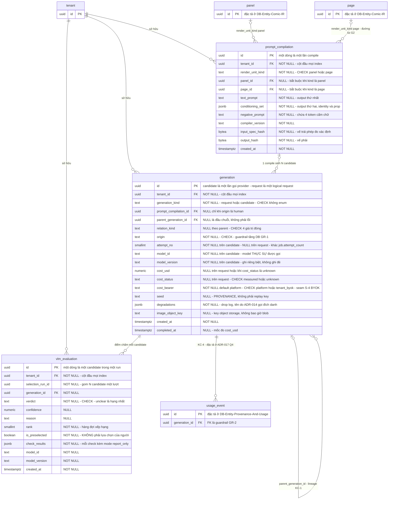

# DB Entity: Generation

Đặc tả cụm `generation.generation` + `generation.prompt_compilation` + `generation.vlm_evaluation` — **một hồ sơ audit của một lần sinh**: lineage, compile artifact, và điểm chấm.

> [!IMPORTANT]
> ⭐ **Vì sao ba bảng đi cùng một file**: tách ra thì `attempt_no` và `parent_generation_id` **mất ngữ cảnh**. `attempt_no` chỉ đọc được khi biết N candidate của **cùng một lần compile** là gì; `parent_generation_id` chỉ đọc được khi biết candidate nào đã được chấm và ai đã chọn.
> ⭐ **Mục tiêu của cụm này là AUDITABILITY + LINEAGE, ⛔ KHÔNG phải reproducibility** (`D-44`, `SRS` §3.A).

## Decided in

| Nguồn | Nội dung kế thừa |
|---|---|
| [ADR-014 — Deterministic Prompt Compiler And Best-Of-N](../Architecture/ADR-014-Deterministic-Prompt-Compiler-And-Best-Of-N.md) | `Decision` điều 1–3 (compiler, hành vi biên, **hai output**) · điều 5–7 (best-of-N, `N=3` **MẶC ĐỊNH**, QA-based selection) · điều 10 (`seed` là provenance) · `Consequences` hợp đồng #3…#12 |
| [ADR-017 — Provenance Chain And One Transaction Boundary](../Architecture/ADR-017-Provenance-Chain-And-One-Transaction-Boundary.md) | `Q1` hình dạng lineage · `Q3` `origin` mức row · ⭐ `Q4.1`, `Q4.2`, `GR-1`, `GR-4` (trích theo **hợp đồng `Q4.7`**) · `Q4.5` `TBD` được route |
| [ADR-018 — Usage Event And Rollup Model](../Architecture/ADR-018-Usage-Event-And-Rollup-Model.md) | ⭐ `Q4` bốn trường bắt buộc trên **MỌI** generation · `Q5` ba `usage_event` cho một panel · `Q6` ⛔ cache không cứu margin · `TBD-USAGE-VLM` |
| [ADR-016 — Image Provider Adapter And Version Pinning](../Architecture/ADR-016-Image-Provider-Adapter-And-Version-Pinning.md) | `Q1` hợp đồng adapter · `Q2` pin version, `model_version` ghi riêng biệt · `Q4` đổi granularity ⛔ không đổi data model |
| [ADR-007 — VLM Provider For QA-Select](../Architecture/ADR-007-VLM-Provider-For-QA-Select.md) | `Q1` integration riêng · `Q2` hợp đồng adapter (`verdict`, `unclear` hạng nhất) · `Q3` report-only mặc định · `Q8` xung đột route đi |
| [ADR-006](../Architecture/ADR-006-RLS-Tenant-Context-Injection.md) · [ADR-005](../Architecture/ADR-005-Platform-Table-Schema-Placement.md) | RLS + tenant context · tên đủ điều kiện `G-3` |
| [SDD §3.2, §4.1, §4.2, §5.2 `F5`, §6.2, ⭐ §8.2 `S-4`](../Architecture/SDD-Comic-Studio.md) | Invariant schema `generation` · ranh giới · luồng sinh ảnh · ⭐ **seam `S-4`: `cost_usd` phải phân biệt được chi phí BYOK** ([`E24`](../../010-Planning/pm-runs/2026-08-28-phase-2-architecture-design-comic-studio/escalations.md) — §8.2 từng ⛔ không nằm trong nguồn của lô Schema nào, và đó là lý do seam này bị sót) |
| Requirement gốc | `SRS-FR-17`…`SRS-FR-27`, `SRS-FR-31`, `SRS-FR-33`, `SRS-FR-34`, `SRS-NFR-01`, `SRS-NFR-13`, `SRS-NFR-14`, `SRS-NFR-19`, `SRS-NFR-20` |
| Story | [Story-Provenance-Chain-Parent-Generation](../../022-User-Stories/Backlog/Story-Provenance-Chain-Parent-Generation.md) · [Story-Generate-Panel-With-Reference-And-VLM-Select](../../022-User-Stories/Backlog/Story-Generate-Panel-With-Reference-And-VLM-Select.md) · [Story-Generation-Cost-And-Model-Metadata](../../022-User-Stories/Backlog/Story-Generation-Cost-And-Model-Metadata.md) · [Story-Deterministic-Visual-Prompt-Compiler](../../022-User-Stories/Backlog/Story-Deterministic-Visual-Prompt-Compiler.md) |

### ⭐ `KC-4` — file này TRỎ, ⛔ không đặc tả lại

Theo **hợp đồng trích dẫn `Q4.7`** của [ADR-017](../Architecture/ADR-017-Provenance-Chain-And-One-Transaction-Boundary.md), file này được phép trỏ tới đúng bốn mục và ⛔ không copy nội dung:

| Trỏ tới | Nó nói gì (một dòng để biết đang tra cái gì) |
|---|---|
| [ADR-017 `Q4.1`](../Architecture/ADR-017-Provenance-Chain-And-One-Transaction-Boundary.md) | Phát biểu chuẩn của `KC-4` |
| [ADR-017 `Q4.2`](../Architecture/ADR-017-Provenance-Chain-And-One-Transaction-Boundary.md) | Chính xác bốn bảng nằm trong transaction đó |
| [ADR-017 `GR-1`](../Architecture/ADR-017-Provenance-Chain-And-One-Transaction-Boundary.md) | `generation.origin NOT NULL` — cưỡng chế ở tầng DB |
| [ADR-017 `GR-4`](../Architecture/ADR-017-Provenance-Chain-And-One-Transaction-Boundary.md) | `parent_generation_id` là FK self-reference, **nullable** |

⛔ **Đừng viết ở đây rằng "tầng DB cưỡng chế `KC-4`".** Câu đúng ([ADR-017 `Q4.6`](../Architecture/ADR-017-Provenance-Chain-And-One-Transaction-Boundary.md)): tầng DB cưỡng chế **các cột** và **tính append-only**; tính **nguyên tử** được cưỡng chế bằng kiến trúc 1-DB + middleware + test CI.

---

## ⭐ Quyết định của lô này: `prompt_compilation` là BẢNG RIÊNG

> [!IMPORTANT]
> ⭐ **CHỐT: `generation.prompt_compilation` là một BẢNG RIÊNG, ⛔ KHÔNG phải một nhóm cột trên `generation.generation`.**
> [SDD §3.2](../Architecture/SDD-Comic-Studio.md) và `findings/architect.md` §3.5 để ngỏ *"còn tranh chấp hình thức lưu"*; [ADR-014](../Architecture/ADR-014-Deterministic-Prompt-Compiler-And-Best-Of-N.md) là ADR **record-only** nên ⛔ không phát minh quyết định mới ⇒ **câu hỏi thuộc lô DB Schema**, và đây là câu trả lời.

**Bốn lập luận, mỗi lập luận đủ đứng một mình:**

| # | Lập luận | Neo |
|:--:|---|---|
| ⭐ **1** | **Cardinality lệch: 1 compile → N generation.** Compiler là **deterministic** ⇒ N candidate của cùng một lần sinh dùng **đúng cùng một** `text_prompt` và `conditioning_set`. Để prompt thành cột trên `generation` là **nhân bản payload N lần** và — nghiêm trọng hơn — **xoá bằng chứng cấu trúc** rằng N candidate cùng đến từ một prompt: hai dòng có thể lệch nhau mà ⛔ không gì phát hiện được | Hợp đồng #7 [ADR-014](../Architecture/ADR-014-Deterministic-Prompt-Compiler-And-Best-Of-N.md): *"N candidate của cùng một panel **cùng trỏ về một spec** và phân biệt được với nhau (`attempt_no`)"* |
| ⭐ **2** | **Đổi granularity ⛔ không được đổi data model.** `SRS-FR-33` chốt **whole-page** là đường lui **đã thiết kế sẵn**; một đơn vị render khi đó gộp **nhiều panel spec thành một prompt**. Đơn vị của compile là **đơn vị render**, ⛔ **không phải** panel ⇒ ràng buộc đó phải sống ở **một bảng có khoá riêng**, ⛔ không phải ở một cột `panel_id` trên bảng khác | `SRS-FR-33` · [ADR-016 `Q4`](../Architecture/ADR-016-Image-Provider-Adapter-And-Version-Pinning.md): adapter nhận *"một hoặc nhiều panel spec đã compile"*; viết cứng per-panel là **đóng đường lui của `G2`** |
| **3** | **Tính xác định trở thành truy vấn được, ⛔ không chỉ là test.** AC đã ký: *"cùng một spec chạy 2 lần cho ra prompt **giống hệt byte-for-byte**"*. Với bảng riêng + `input_spec_hash` + `output_hash`, mệnh đề đó là **một câu `SELECT`** trên hai dòng độc lập. Nhét vào cột `generation` thì không có *"hai dòng để so"* — chỉ còn một test trong CI | AC-1 [Story-Deterministic-Visual-Prompt-Compiler](../../022-User-Stories/Backlog/Story-Deterministic-Visual-Prompt-Compiler.md) |
| **4** | **Giữ `generation` hẹp.** `generation` là bảng bị quét cho rollup chi phí (`usage_daily`, regen ratio p50/p90) và là bảng lớn nhất của schema — mỗi panel sinh ra **N dòng**, ⛔ không phải 1. Nhồi `text_prompt` (dài) + `conditioning_set JSONB` vào đó là nhân kích thước bảng nóng lên **N lần** cho một payload ⛔ không đổi | `SRS-FR-30`, [ADR-018 `Q2`](../Architecture/ADR-018-Usage-Event-And-Rollup-Model.md) |

**Ba hệ quả bắt buộc mang theo — ⛔ đọc trước khi cài đặt:**

1. ⭐ **`prompt_compilation` ⛔ KHÔNG phải bảng dedup/cache.** Một dòng = **một lần compile** = một logical generation request. ⛔ Không được `UPSERT` theo `output_hash` để *"tiết kiệm"* — dedup xoá mất chính **hai dòng độc lập** mà lập luận #3 dùng để chứng minh tính xác định, và biến một thuộc tính đo được thành một thuộc tính **đúng theo định nghĩa**, tức ⛔ không còn kiểm được gì.
2. ⭐ **`degradations` Ở LẠI trên `generation.generation`.** Hợp đồng #3 của [ADR-014](../Architecture/ADR-014-Deterministic-Prompt-Compiler-And-Best-Of-N.md) gọi đích danh **`generation.degradations JSONB`**. Nó ⛔ **không** được dời sang `prompt_compilation` dù drop log sinh ra lúc compile. ⚠️ Hệ quả đúng và phải ghi ra: giá trị này **giống nhau trên cả N dòng** của cùng một compilation — đó là **nhân bản có chủ đích để tuân ADR**, ⛔ không phải lỗi chuẩn hoá.
3. **Quyết định này ⛔ không đóng `Q4.5`** ([ADR-017](../Architecture/ADR-017-Provenance-Chain-And-One-Transaction-Boundary.md)) — nó nói *prompt lưu ở đâu*, ⛔ không nói *mấy dòng `generation` được tạo lúc nào*. Xem [bảng `TBD`](#tbd-còn-lại).

---

## Bảng

### `generation.prompt_compilation`

Một dòng = **một lần chạy Visual Prompt Compiler** cho một đơn vị render.

| Cột | Kiểu | NULL? | Mặc định | Mô tả |
|---|---|:--:|---|---|
| `id` | `UUID` | ⛔ | `gen_random_uuid()` | Khoá chính |
| ⭐ `tenant_id` | `UUID` | ⛔ | — | Cột **đầu tiên** của mọi composite index (`SRS-NFR-01`) |
| ⭐ `render_unit_kind` | `TEXT` | ⛔ | `'panel'` | `'panel'` (mặc định) hoặc `'page'` (đường lui `G2`). ⭐ Cột này là **hình thức của `SRS-FR-33`** trong schema |
| `panel_id` | `UUID` | ✅ | `NULL` | Bắt buộc khi `render_unit_kind = 'panel'` |
| `page_id` | `UUID` | ✅ | `NULL` | Bắt buộc khi `render_unit_kind = 'page'` |
| ⭐ `text_prompt` | `TEXT` | ⛔ | — | Output **thứ nhất** của compiler: mô tả cảnh |
| ⭐ `conditioning_set` | `JSONB` | ⛔ | — | Output **thứ hai**: identity reference **và prop quan trọng**, mỗi phần tử là `{entity_id, object_key, sha256}`. ⛔ **Không** cạnh tranh với `text_prompt` trong cùng một chuỗi |
| ⭐ `negative_prompt` | `TEXT` | ⛔ | — | ⭐ Phải chứa `text`, `letters`, `watermark`, `speech bubble` cho **100%** đơn vị render có thoại (`SRS-FR-11`) — xem `P-6` |
| `compiler_version` | `TEXT` | ⛔ | — | Phiên bản code compiler. ⭐ *"Byte-for-byte"* chỉ có nghĩa **trong phạm vi một version**; thiếu cột này thì AC ⛔ không phát biểu được |
| `input_spec_hash` | `BYTEA` | ⛔ | — | `sha256` của spec đầu vào đã chuẩn hoá. ⭐ Là **vế trái** của phép so tính xác định |
| `output_hash` | `BYTEA` | ⛔ | — | `sha256` của `text_prompt` + `conditioning_set` canonical + `negative_prompt`. ⭐ **Vế phải** |
| `created_at` | `TIMESTAMPTZ` | ⛔ | `now()` | |

- **PK**: `(id)`
- **FK**: `tenant_id → public.tenant(id)` `ON DELETE CASCADE`
- **FK**: `panel_id → comic.panel(id)` · `page_id → comic.page(id)` — hai bảng đích thuộc [`DB-Entity-Comic-IR.md`](./DB-Entity-Comic-IR.md)
- **UNIQUE**: `(tenant_id, id)` — hằng số kỹ thuật để `generation` tham chiếu bằng **composite FK**, xem `G-9`

`render_unit_kind`: `CHECK (render_unit_kind IN ('panel','page'))` trên cột `TEXT` — ⛔ danh sách đóng, `SRS-FR-33`; ⛔ **không** Postgres enum type ([`E15`](../../010-Planning/pm-runs/2026-08-28-phase-2-architecture-design-comic-studio/escalations.md)).

### `generation.generation`

Một dòng = **một mắt xích của một lần sinh**, phân biệt bằng `generation_kind`: dòng `'candidate'` = **một lần gọi provider** (⭐ mỗi candidate của best-of-N là **một dòng riêng** — ⛔ không gộp); dòng `'request'` = **một logical generation request**, ghi lúc enqueue khi ⛔ chưa gọi provider lần nào.

> [!IMPORTANT]
> ⭐ **`CO-1.1` ĐÃ ĐƯỢC PHÂN XỬ — phương án (a)**, quyết định của PM tại [escalations `E17`](../../010-Planning/pm-runs/2026-08-28-phase-2-architecture-design-comic-studio/escalations.md). Hình dạng bảng dưới đây **đã áp** phương án đó; [mục `CO-1`](#-co-1--đối-chiếu-với-db-entity-provenance-and-usagemd) giữ lại phần đối chiếu làm hồ sơ, ⛔ **không còn** là câu hỏi mở.
> Bốn chỗ đổi so với bản (b):
> 1. Cột `generation_kind` **`TEXT` + `CHECK (generation_kind IN ('request','candidate'))`**, `NOT NULL` — ⛔ **KHÔNG** Postgres enum type ([`E15`](../../010-Planning/pm-runs/2026-08-28-phase-2-architecture-design-comic-studio/escalations.md)).
> 2. `G-6` là **`CHECK` có điều kiện**: bốn trường `D-59` `NOT NULL` khi `generation_kind = 'candidate'`, và ⛔ **luôn `NULL`** khi `= 'request'`.
> 3. `ix_gen_cost_rollup` thêm `generation_kind = 'candidate'` vào vế `WHERE`.
> 4. ⚠️ ⭐ **`G-5` CŨNG bị chạm — chỗ này ⛔ KHÔNG nằm trong ba chỗ mà lô L9 liệt kê.** `cost_status` `NOT NULL` với đúng hai giá trị sẽ **ép** dòng `request` mang `'unknown_provider_error'` — một khẳng định **sai sự thật** (⛔ chưa có lời gọi nào để lỗi), và nó **thổi phồng** đúng con số mà `G-5` bắt *"báo riêng"*. ⇒ `cost_status` **`NULL` trên dòng `request`**; `G-5` chỉ áp cho dòng `candidate`.

| Cột | Kiểu | NULL? | Mặc định | Mô tả |
|---|---|:--:|---|---|
| `id` | `UUID` | ⛔ | `gen_random_uuid()` | Khoá chính |
| ⭐ `tenant_id` | `UUID` | ⛔ | — | Cột **đầu tiên** của mọi composite index (`SRS-NFR-01`) |
| ⭐ `generation_kind` | `TEXT` | ⛔ | — | ⭐ `'request'` (dòng cấp request, ghi lúc **enqueue**) \| `'candidate'` (một **lần gọi provider**). `CHECK` danh mục đóng, ⛔ **không** Postgres enum type. Cột này là hình dạng của phán quyết `CO-1.1` ([`E17`](../../010-Planning/pm-runs/2026-08-28-phase-2-architecture-design-comic-studio/escalations.md)) |
| `prompt_compilation_id` | `UUID` | ✅ | `NULL` | Lần compile đã sinh ra prompt cho lần gọi này. Nullability: xem `G-2` |
| ⭐ `parent_generation_id` | `UUID` | ✅ | `NULL` | FK **self-reference**. `NULL` = **generation đầu chuỗi**, ⛔ **không phải lỗi dữ liệu** (`GR-4`) |
| `relation_kind` | `TEXT` | ✅ | `NULL` | `CHECK (relation_kind IN ('retry','variation','refine','continuity_fix'))` — ⛔ **danh sách đóng của Phase 1** (`SRS-FR-34`); giá trị thứ 5 phải qua **ADR mới** |
| ⭐ `origin` | `TEXT` | ⛔ | — | `CHECK (origin IN ('ai','ai_edited','human'))`. ⭐ **`NOT NULL` là guardrail tầng DB** (`GR-1`, `SRS-NFR-14`). ⚠️ ⭐ **Dòng cấp `request` sinh ra ở đường enqueue `F5` mang `origin = 'ai'`** — ✅ **XÁC NHẬN**, ⛔ không còn là suy luận; xem `G-11` |
| ⭐ `attempt_no` | `SMALLINT` | ✅ | `NULL` | Số thứ tự lần gọi trong **cùng một logical generation request**. ⭐ **`NOT NULL` trên dòng `candidate`**, ⛔ **luôn `NULL`** trên dòng `request` (`G-6`). ⚠️ ⛔ **KHÔNG** phải `public.job.attempt_count` |
| ⭐ `model_id` | `TEXT` | ✅ | `NULL` | Model **THỰC SỰ ĐƯỢC GỌI**, ⛔ không phải model dự kiến — provider có thể tự fallback. ⭐ **`NOT NULL` trên dòng `candidate`**, ⛔ **luôn `NULL`** trên dòng `request` (`G-6`) — ⛔ tuyệt đối không ghi *model dự kiến* vào dòng `request` |
| ⭐ `model_version` | `TEXT` | ✅ | `NULL` | Ghi **riêng biệt**, ⛔ **không ghi đè** khi provider trả version khác dưới cùng `model_id`. Là dữ liệu để truy vết **silent model drift**. ⭐ Cùng quy tắc `NULL` theo `generation_kind` như `model_id` (`G-6`) |
| ⭐ `cost_usd` | `NUMERIC(14,6)` | ✅ | `NULL` | **Thực đo** tại thời điểm generation **hoàn tất**, ⛔ không phải ước lượng trước khi gọi. `NULL` ở **đúng hai chỗ**: dòng `request` (`G-6`), và dòng `candidate` có `cost_status = 'unknown_provider_error'` (`G-5`) |
| ⭐ `cost_status` | `TEXT` | ✅ | `NULL` | `CHECK (cost_status IN ('measured','unknown_provider_error'))`. ⭐ **Đóng `TBD` của [ADR-018 `Q4`](../Architecture/ADR-018-Usage-Event-And-Rollup-Model.md)** — xem [Trạng thái cost tường minh](#-đóng-tbd-hình-dạng-trạng-thái-cost-chưa-biết). ⚠️ **`NULL` trên dòng `request`** và **`NOT NULL` trên dòng `candidate`** (`G-5`, `G-6`) |
| ⭐ `cost_bearer` | `TEXT` | ⛔ | `'platform'` | ⭐ **AI TRẢ TIỀN cho lần gọi provider này**: `'platform'` = key của **ta** \| `'tenant_byok'` = key của **khách**. `CHECK (cost_bearer IN ('platform','tenant_byok'))` trên cột `TEXT`, ⛔ **không** Postgres enum type. ⭐ Đây là **seam `S-4`** mà [SDD §8.2](../Architecture/SDD-Comic-Studio.md) bắt buộc: ⛔ **không** để `cost_usd` trộn hai loại tiền — xem [mục seam `S-4`](#-seam-s-4--cột-phân-biệt-chi-phí-byok-mức-reserve-chỗ) và `G-10` |
| `seed` | `TEXT` | ✅ | `NULL` | ⭐ **PROVENANCE METADATA, ⛔ KHÔNG PHẢI REPLAY KEY** — xem `G-8`. `NULL` hợp lệ: nhiều API ⛔ không cho set seed |
| ⭐ `degradations` | `JSONB` | ⛔ | `'[]'::jsonb` | **Drop log** của constraint budget. ⭐ Tên cột do [ADR-014](../Architecture/ADR-014-Deterministic-Prompt-Compiler-And-Best-Of-N.md) hợp đồng #3 gọi đích danh — ⛔ không đổi tên, ⛔ không dời bảng |
| `image_object_key` | `TEXT` | ✅ | `NULL` | Key object storage dạng `tenant/{tenant_id}/{sha256}`. ⛔ **Không bao giờ** là blob (`B-4`). `NULL` = lần gọi ⛔ không tạo ra artifact (lỗi / bị từ chối) |
| `created_at` | `TIMESTAMPTZ` | ⛔ | `now()` | |
| `completed_at` | `TIMESTAMPTZ` | ✅ | `NULL` | Thời điểm lần gọi hoàn tất — là mốc mà `cost_usd` được đo |

- **PK**: `(id)`
- **FK**: `tenant_id → public.tenant(id)` `ON DELETE CASCADE`
- **FK** (`GR-4`): `parent_generation_id → generation.generation(id)`, **nullable**, `ON DELETE RESTRICT` — ⛔ xoá một mắt xích giữa chuỗi là phá lineage
- ⭐ **FK composite** (`G-9`): `(tenant_id, prompt_compilation_id) → generation.prompt_compilation(tenant_id, id)`
- **UNIQUE**: ⭐ `(tenant_id, prompt_compilation_id, attempt_no)` — xem `G-3`

⚠️ **Năm cột danh mục của bảng này — `generation_kind`, `origin`, `relation_kind`, `cost_status`, `cost_bearer` — đều là `TEXT` + `CHECK`, ⛔ KHÔNG phải Postgres enum type** (quyết định toàn tầng Schema, ⛔ không ngoại lệ — [`E15`](../../010-Planning/pm-runs/2026-08-28-phase-2-architecture-design-comic-studio/escalations.md)). Danh mục đóng: `generation_kind` `('request','candidate')` · `origin` `('ai','ai_edited','human')` · `relation_kind` `('retry','variation','refine','continuity_fix')` · `cost_status` `('measured','unknown_provider_error')` · `cost_bearer` `('platform','tenant_byok')`.

#### ⭐ `origin` mức ROW và `origin` mức FIELD là hai thứ khác nhau

> [!IMPORTANT]
> ⭐ **Câu hỏi được đóng ở đây** (nêu ở lô `L28b`, sau khi `CHECK (generation_kind IN ('request','candidate'))` được thêm theo phán quyết `CO-1.1`): *"một dòng `origin = 'human'` thì mang `generation_kind` nào?"*
> ⭐ **Trả lời: trong horizon MVP0–MVP2 ⛔ KHÔNG có dòng dữ liệu nào rơi vào câu hỏi đó** ⇒ `CHECK` đóng của `generation_kind` ⛔ **không** cắt mất loại dữ liệu hợp lệ nào. Ba sự thật dưới đây là chỗ neo, ⛔ đừng hỏi lại.

| # | Sự thật | Neo |
|:--:|---|---|
| 1 | ⭐ **Hai cột `origin` khác MỨC, ⛔ không phải một thứ.** `generation.generation.origin` ở **mức ROW** (nguồn gốc của **cả artifact**); `public.field_provenance.origin` ở **mức FIELD**; `public.change_log.origin` ở **mức HÀNH ĐỘNG**. Nguyên văn: *"Một field bị người dùng sửa tay mang `origin = 'human'` / `'ai_edited'` **cho đúng field đó**, ⛔ không phải cho toàn bộ generation"* | [ADR-017 `Q3`](../Architecture/ADR-017-Provenance-Chain-And-One-Transaction-Boundary.md) · [`DB-Entity-Provenance-And-Usage.md`](./DB-Entity-Provenance-And-Usage.md) `INV-CL-2`, `INV-FP-3` |
| 2 | ⭐ **Danh mục mức row CHO PHÉP `'human'` / `'ai_edited'`, nhưng trong horizon ⛔ KHÔNG đường ghi nào sinh ra dòng như thế.** Đường ghi duy nhất vào bảng này là pipeline sinh ảnh: API enqueue ghi dòng `generation_kind = 'request'`, `origin = 'ai'`; worker ghi dòng `candidate`. ⭐ Mọi đóng góp của con người đi vào `public.field_provenance` / `public.change_log`, ⛔ **không** đi vào bảng này | [`Endpoint-Generation.md`](../API/Endpoint-Generation.md) bước 3 của luồng ghi · [`Endpoint-Story-Bible.md`](../API/Endpoint-Story-Bible.md) · `G-11` |
| 3 | ⚠️ ⛔ **Đừng đọc điều 2 thành *"danh mục sai, phải bỏ `'human'`"*.** `origin ('ai','ai_edited','human')` là [SRS](../../020-Requirements/SRS-Comic-Studio.md) `SRS-FR-36` **CHỐT**, và [ADR-017 `Q5`](../Architecture/ADR-017-Provenance-Chain-And-One-Transaction-Boundary.md) viết *"generation đầu chuỗi vẫn phải có `origin` xác định (`'ai'` hoặc `'human'`)"* — đó là phát biểu về **miền giá trị + `NOT NULL`**, ⛔ **không** phải khẳng định rằng có một đường ghi sinh ra `'human'` | `SRS-FR-36` · [ADR-017 `Q5`](../Architecture/ADR-017-Provenance-Chain-And-One-Transaction-Boundary.md) — cả hai **đóng băng**, ⛔ file này không đụng |

⇒ ⭐ **Hệ quả DDL: ⛔ KHÔNG có.** Một `CHECK` chỉ cắt được dòng mà **một đường ghi nào đó sẽ ghi**; trong horizon ⛔ không đường ghi nào ghi `origin <> 'ai'` vào bảng này. ⇒ ⛔ **Không** thêm giá trị thứ ba vào `generation_kind`, ⛔ **không** đụng `G-5`, ⛔ **không** đụng `G-6`.

⚠️ **Seam để ngỏ CÓ CHỦ Ý — dành cho lô sau, ⛔ không đóng ở đây**: `origin = 'ai_edited'` **mức row** được [SRS](../../020-Requirements/SRS-Comic-Studio.md) `SRS-NFR-25` gắn với `D5` — hạng mục **hoãn khỏi horizon**, đường lui ghi *"🟡 kèm `generation.origin='ai_edited'`"*. ⭐ **Khi nào** một đường ghi tạo artifact mức row mang `'human'` / `'ai_edited'` bước vào horizon, **chính lô đó** phải quyết `generation_kind` của dòng ấy (mở rộng nghĩa `'request'`, hay thêm giá trị thứ ba) **và** kiểm lại `G-6`. ⚠️ ⛔ **Đừng gộp hai ca vào một lý do**: dòng `'human'` (người tự tạo artifact) ⛔ **không** có `model_id` ⇒ ⛔ không thể là `'candidate'`; còn dòng `'ai_edited'` sinh từ inpainting **thì CÓ** `model_id` — nó là một lần gọi provider thật.

⚠️ ⭐ **Phán quyết `G-11` GIỮ NGUYÊN — và được củng cố, ⛔ không bị lật.** Nó vẫn là **quy ước đường ghi + test CI**, ⛔ **không** nâng thành `CHECK`. Lý do được neo lại cho chính xác: ⛔ **không** phải *"đang có dòng `origin = 'human'` cần chỗ tồn tại"*, mà là **miền giá trị mức row buộc phải để mở** (điều 3) — một `CHECK` ràng `generation_kind` vào `origin` sẽ **quyết trước** hình dạng của seam ngoài horizon, tức vượt thẩm quyền của tầng Schema hôm nay.

#### ⭐ Đóng `TBD`: hình dạng *"trạng thái cost chưa biết"*

[ADR-018 `Q4`](../Architecture/ADR-018-Usage-Event-And-Rollup-Model.md) route cho lô DB Schema: *"Hình dạng của **trạng thái tường minh** (cột phụ hay sentinel) = `TBD`, lô DB Schema"*. ⭐ **Chốt: một CỘT PHỤ `cost_status`, ⛔ không phải sentinel.**

| Lựa chọn | Phán quyết |
|---|---|
| ⭐ **Cột phụ `cost_status` (`TEXT` + `CHECK` danh mục đóng)** | ✅ **CHỌN** — ⚠️ `NOT NULL` trên dòng `candidate`, `NULL` trên dòng `request` (`G-5`, `G-6`) |
| Sentinel trên `cost_usd` (ví dụ `-1`) | ⛔ **LOẠI** — nó đi thẳng vào `SUM(cost_usd)` của rollup và làm hỏng con số COGS **âm thầm**, đúng thứ [ADR-018](../Architecture/ADR-018-Usage-Event-And-Rollup-Model.md) tồn tại để chặn |
| Chỉ để `cost_usd NULL` | ⛔ **LOẠI** — [Story-Generation-Cost-And-Model-Metadata](../../022-User-Stories/Backlog/Story-Generation-Cost-And-Model-Metadata.md) mục 4 cấm nguyên văn: ⛔ *"không phải `NULL` âm thầm, ⛔ không phải `0` ngầm định"*. `NULL` một mình ⛔ không phân biệt được *"chưa đo"* với *"quên ghi"* |

⇒ Cưỡng chế bằng `G-5`: `CHECK (generation_kind = 'request' OR ((cost_status = 'measured') = (cost_usd IS NOT NULL)))`. ⚠️ **Vế `generation_kind = 'request'` là hệ quả bắt buộc của phán quyết (a)** ([`E17`](../../010-Planning/pm-runs/2026-08-28-phase-2-architecture-design-comic-studio/escalations.md)): dòng cấp request ⛔ chưa gọi provider ⇒ ⛔ **không được** ép nó mang `'unknown_provider_error'`, vì đó là *"đã gọi và lỗi"* — ghi vậy là **bơm số giả** vào đúng con số phải báo riêng. ⭐ **Rollup bắt buộc lọc `WHERE generation_kind = 'candidate' AND cost_status = 'measured'` và báo riêng số dòng `unknown_provider_error`** — ⛔ không được để chúng biến mất khỏi báo cáo.

#### ⭐ Seam `S-4` — cột phân biệt chi phí BYOK (mức RESERVE CHỖ)

> [!IMPORTANT]
> ⭐ **[SDD §8.2 `S-4`](../Architecture/SDD-Comic-Studio.md) bắt buộc nguyên văn**: *"**`generation.cost_usd` phải PHÂN BIỆT ĐƯỢC** chi phí trên key của ta và chi phí trên key của khách. Nếu không, mọi hàng lịch sử trộn hai loại tiền, và dữ liệu lịch sử ⛔ **không backfill được**"* (`SRS-FR-31`). ⇒ Hình dạng schema của điều đó là **cột `cost_bearer`**.

⚠️ ⭐ **Vì sao cột này phải có NGAY, dù BYOK là `[OoH]` MVP4**: cột phân biệt ⛔ **không phải** thứ của MVP4. Thiếu nó, **mọi dòng `generation` từ MVP1 trở đi trộn hai loại tiền VĨNH VIỄN**; đến MVP4 mới thêm thì dữ liệu cũ **mất khả năng tách COGS** và ⛔ **không có cách nào chữa**. Đây là **cùng nhóm *"không backfill được"*** với `KC-1` / `KC-7` ([`E24`](../../010-Planning/pm-runs/2026-08-28-phase-2-architecture-design-comic-studio/escalations.md)).

| Giá trị | Nghĩa |
|---|---|
| ⭐ `'platform'` | Lời gọi chạy trên **key của ta** ⇒ `cost_usd` là **COGS thật** của nền tảng. **Mặc định** — đúng sự thật cho toàn horizon MVP0–MVP3 (BYOK chưa bật) |
| `'tenant_byok'` | Lời gọi chạy trên **key của khách** ⇒ `cost_usd` là tiền **khách tự trả cho provider**, ⛔ **không** phải COGS của ta |

**Ngữ nghĩa theo `generation_kind` — ⛔ đọc trước khi ghi:**

| Dòng | `cost_bearer` ghi gì | Vì sao ⛔ đây KHÔNG lặp lại lỗi của `cost_status` |
|---|---|---|
| ⭐ `candidate` | **Key mà lời gọi THỰC SỰ chạy trên đó**, do adapter trả về | Cùng kỷ luật với `model_id`: một lời gọi BYOK **có thể fail và fallback về key của ta** ⇒ dòng ghi **thực tế**, ⛔ không ghi dự định |
| `request` | **Chế độ key đang áp cho tenant tại thời điểm enqueue** | ⭐ Đây là **một sự thật đã biết lúc enqueue**, ⛔ **không phải** một khẳng định về lời gọi chưa xảy ra — khác hẳn `'unknown_provider_error'` (nghĩa là *"đã gọi và lỗi"*, xem `G-5`). Và ⛔ không tiền nào bị quy sai: dòng `request` có `cost_usd IS NULL` **và** rollup đã lọc `generation_kind = 'candidate'` |

⇒ ⭐ Vì thế `cost_bearer` là **`NOT NULL` + `DEFAULT 'platform'`** trên **mọi** dòng, ⛔ **không** nằm trong tập trường bị ép `NULL` của `G-6`, và ⛔ **không** chạm `G-5`. Một cột nullable ở đây sẽ dựng lại **đúng** vấn đề mà `S-4` tồn tại để chặn: một dòng ⛔ không biết nó là loại tiền nào.

⛔ **RANH GIỚI — file này ⛔ KHÔNG đặc tả**: cách **lưu / mã hoá / THU HỒI** API key của khách. Đó là `T-27` (hàng `b-2` của `SRS` §5.2), **cần một ADR mới**, và ⛔ **ngoài phạm vi run này**. ⚠️ Đúng chữ của [SDD §8.2](../Architecture/SDD-Comic-Studio.md): ***"Seam là CHỖ CẮM, ⛔ không phải cơ chế bảo vệ key."*** ⛔ Không ai được suy ra từ cột này rằng cơ chế giữ key đã được thiết kế.

### `generation.vlm_evaluation`

Một dòng = **điểm chấm của VLM cho MỘT candidate trong MỘT lần QA-select**.

| Cột | Kiểu | NULL? | Mặc định | Mô tả |
|---|---|:--:|---|---|
| `id` | `UUID` | ⛔ | `gen_random_uuid()` | Khoá chính |
| ⭐ `tenant_id` | `UUID` | ⛔ | — | Cột **đầu tiên** của mọi composite index |
| `selection_run_id` | `UUID` | ⛔ | — | Gom N candidate được chấm **cùng một lượt**. ⛔ Không phải FK — nó là định danh của một lần gọi adapter |
| `generation_id` | `UUID` | ⛔ | — | Candidate được chấm |
| ⭐ `verdict` | `TEXT` | ⛔ | — | `CHECK (verdict IN ('pass','fail','unclear'))`. ⭐ **`unclear` là giá trị hợp lệ HẠNG NHẤT** — ⛔ không phải `NULL`, ⛔ không phải lỗi, ⛔ không map sang `pass`/`fail` |
| `confidence` | `NUMERIC(4,3)` | ✅ | `NULL` | Độ tin cậy adapter trả về. `NULL` hợp lệ khi provider ⛔ không cung cấp |
| `reason` | `TEXT` | ✅ | `NULL` | Lý do ngắn — phần *"giải thích"* trong hợp đồng adapter |
| ⭐ `rank` | `SMALLINT` | ⛔ | — | Thứ hạng trong **hàng đợi review được xếp hạng** (`D-38`) |
| ⭐ `is_preselected` | `BOOLEAN` | ⛔ | `false` | Candidate được VLM **preselect**. ⛔ **Preselect KHÔNG tự thành lựa chọn của người** — xem `E-4` |
| `check_results` | `JSONB` | ⛔ | `'[]'::jsonb` | Kết quả từng check, kèm chế độ của check đó: `{check_key, verdict, mode}` với `mode ∈ {report_only, influencing}` |
| `model_id` | `TEXT` | ⛔ | — | Model VLM **thực sự được gọi** — ghi vào bản ghi chấm của **mọi** lần gọi |
| `model_version` | `TEXT` | ⛔ | — | Pin tường minh, ghi riêng biệt |
| `created_at` | `TIMESTAMPTZ` | ⛔ | `now()` | |

- **PK**: `(id)`
- **FK**: `tenant_id → public.tenant(id)` `ON DELETE CASCADE`
- **FK**: `generation_id → generation.generation(id)` `ON DELETE CASCADE`
- **UNIQUE**: `(tenant_id, selection_run_id, generation_id)` · `(tenant_id, selection_run_id, rank)`

`verdict`: `CHECK (verdict IN ('pass','fail','unclear'))` trên cột `TEXT` — ⛔ danh sách đóng; ⛔ **không** Postgres enum type ([`E15`](../../010-Planning/pm-runs/2026-08-28-phase-2-architecture-design-comic-studio/escalations.md)).

> [!WARNING]
> ⚠️ ⛔ **Bảng này KHÔNG có cột `cost_usd` — và đó ⛔ KHÔNG phải một quyết định bỏ đo.**
> Chi phí VLM là **chi phí THẬT** và là phần **CHƯA TÍNH** của `CF-3.5`. Mô hình đếm nó là ⭐ **`TBD-USAGE-VLM`**, và hàng đó ⭐ **đã được ĐÓNG** ở [`DB-Entity-Provenance-And-Usage.md`](./DB-Entity-Provenance-And-Usage.md) bằng **một bảng đo riêng `generation.vlm_scoring_call`** — tức **hướng (ii)**, biến thể đặt ở schema `generation` ([`E20`](../../010-Planning/pm-runs/2026-08-28-phase-2-architecture-design-comic-studio/escalations.md)). ⛔ **Không** phải cột phân loại trên `public.usage_event`: bảng đó giữ nguyên **một dòng = một image candidate**.
> ⇒ ⭐ **Chi phí VLM đo ở `generation.vlm_scoring_call`, ⛔ không ở `generation.vlm_evaluation`.** `vlm_evaluation` giữ **điểm chấm**; `vlm_scoring_call` giữ **tiền**. Thêm `cost_usd` vào đây là tạo **nguồn sự thật thứ hai** cho cùng một khoản chi.
> ⛔ **"Không đo" ⛔ không phải một lời giải** — đó chính là cách khoản chi phí này biến mất khỏi mô hình tài chính **lần thứ hai**.

> [!NOTE]
> ⭐ **Chế độ mặc định của mọi check là `report_only`** ([ADR-007 `Q3`](../Architecture/ADR-007-VLM-Provider-For-QA-Select.md)). Vì thế `mode` nằm **trong `check_results` của từng dòng**, ⛔ không phải một cấu hình toàn cục đọc lúc báo cáo: bật một check thành `influencing` chỉ sau khi cổng chất lượng PASS **cho chính check đó** ⇒ bản ghi lịch sử phải nhớ **lúc đó** check nào đang ảnh hưởng tới lựa chọn. ⛔ Không bật cả cụm một lượt.

---

## Index

⚠️ **`tenant_id` là cột ĐẦU TIÊN của MỌI composite index** (`SRS-NFR-01`, `D-10`) — ⛔ không ngoại lệ trên cả ba bảng.

### `generation.prompt_compilation`

| Index | Định nghĩa | Phục vụ |
|---|---|---|
| `prompt_compilation_pkey` | `PRIMARY KEY (id)` | |
| `uq_pc_tenant_id` | `UNIQUE (tenant_id, id)` | Đích của composite FK `G-9` |
| `ix_pc_panel` | `(tenant_id, panel_id, created_at DESC)` `WHERE panel_id IS NOT NULL` | Lịch sử compile của một panel |
| `ix_pc_page` | `(tenant_id, page_id, created_at DESC)` `WHERE page_id IS NOT NULL` | Như trên, cho đường lui whole-page |
| ⭐ `ix_pc_determinism` | `(tenant_id, input_spec_hash, compiler_version, output_hash)` | ⭐ **Phép đo tính xác định**: cùng `input_spec_hash` + `compiler_version` ⇒ mọi `output_hash` phải bằng nhau. Một `GROUP BY` là ra |

### `generation.generation`

| Index | Định nghĩa | Phục vụ |
|---|---|---|
| `generation_pkey` | `PRIMARY KEY (id)` | |
| ⭐ `uq_gen_attempt` | `UNIQUE (tenant_id, prompt_compilation_id, attempt_no)` | ⭐ `G-3` — N candidate **phân biệt được**, ⛔ không ghi đè lẫn nhau |
| `ix_gen_lineage` | `(tenant_id, parent_generation_id)` `WHERE parent_generation_id IS NOT NULL` | Duyệt chuỗi lineage `KC-1` |
| ⭐ `ix_gen_cost_rollup` | `(tenant_id, completed_at, cost_status)` `WHERE generation_kind = 'candidate' AND cost_status = 'measured'` | ⭐ Rollup `usage_daily`, regen ratio p50/p90 — ⛔ không quét dòng `unknown_provider_error`, ⛔ **không quét dòng cấp `request`** (⛔ dòng đó không mang tiền — [`E17`](../../010-Planning/pm-runs/2026-08-28-phase-2-architecture-design-comic-studio/escalations.md)) |
| `ix_gen_drift` | `(tenant_id, model_id, model_version, created_at DESC)` | Truy vết **silent model drift**: hai lần gọi cùng `model_id` phải trả **đúng 2 giá trị `model_version` phân biệt** |
| `ix_gen_compilation` | `(tenant_id, prompt_compilation_id)` | Lấy toàn bộ candidate của một lần compile |

### `generation.vlm_evaluation`

| Index | Định nghĩa | Phục vụ |
|---|---|---|
| `vlm_evaluation_pkey` | `PRIMARY KEY (id)` | |
| `uq_vlm_run_candidate` | `UNIQUE (tenant_id, selection_run_id, generation_id)` | Một candidate chấm **một lần** trong một run |
| `uq_vlm_run_rank` | `UNIQUE (tenant_id, selection_run_id, rank)` | Thứ hạng là **toàn phần**, ⛔ không hoà |
| ⭐ `uq_vlm_one_preselect` | `UNIQUE (tenant_id, selection_run_id)` `WHERE is_preselected` | ⭐ Tối đa **một** preselect cho một run |
| `ix_vlm_by_generation` | `(tenant_id, generation_id)` | Từ một candidate tra ngược điểm chấm |
| `ix_vlm_coverage` | `(tenant_id, created_at DESC, verdict)` | Đường đọc *"đã kiểm N/M panel"* để UI hiện **độ phủ** (`SRS-FR-22`) |

---

## Constraint & Invariant

| # | Ràng buộc | Cưỡng chế bằng | Bảo vệ điều gì |
|:--:|---|---|---|
| ⭐ `G-1` | `origin NOT NULL` + `CHECK` danh mục đóng (⛔ không Postgres enum type) | `NOT NULL` (`GR-1`) + `CHECK` | `SRS-NFR-14` — `INSERT` thiếu `origin` **FAIL ở tầng DB**, ⛔ không phải cảnh báo ở tầng ứng dụng. ⚠️ Generation đầu chuỗi (`parent = NULL`) **vẫn phải** có `origin` |
| `G-2` | `CHECK (origin = 'human' OR prompt_compilation_id IS NOT NULL)` | `CHECK` | ⭐ Mọi artifact **do máy sinh** đều truy được về **prompt đã sinh ra nó** ⇒ *"panel sai truy được về spec"*. ⚠️ Nullable ⛔ **không** phải sự nới lỏng: `origin = 'human'` là giá trị hợp lệ của miền `origin` — miền đó do **`SRS-FR-36`** chốt (⛔ **không phải** `SRS-FR-34`, vốn là mandate của `parent_generation_id` + `relation_kind`) — và ⛔ không nguồn nào trong horizon MVP0–MVP2 mô tả compiler chạy cho artifact người tự tạo — ⛔ không bịa một compilation rỗng cho nó |
| ⭐ `G-3` | `UNIQUE (tenant_id, prompt_compilation_id, attempt_no)` | `UNIQUE` | ⭐ Hợp đồng #7 [ADR-014](../Architecture/ADR-014-Deterministic-Prompt-Compiler-And-Best-Of-N.md): N candidate **phân biệt được**, ⛔ **không ghi đè lẫn nhau**. Đây là ràng buộc `C8` của [ADR-018 `Q4`](../Architecture/ADR-018-Usage-Event-And-Rollup-Model.md) ở dạng cưỡng chế được: ⛔ **không gộp chi phí 3 candidate vào 1 dòng** |
| `G-4` | `CHECK ((parent_generation_id IS NULL) = (relation_kind IS NULL))` | `CHECK` | ⛔ Không có `relation_kind` trỏ vào hư vô, và ⛔ không có mắt xích không tên |
| ⭐ `G-5` | `CHECK (generation_kind = 'request' OR ((cost_status = 'measured') = (cost_usd IS NOT NULL)))` | `CHECK` | ⭐ Trạng thái cost **tường minh** trên dòng `candidate`: ⛔ không `NULL` âm thầm, ⛔ không `0` ngầm định. ⚠️ Vế `request` được miễn vì dòng đó ⛔ **chưa gọi provider** — xem điều 4 của khối `[!IMPORTANT]` ở [mục `## Bảng`](#generationgeneration) |
| ⭐ `G-6` | **`CHECK` CÓ ĐIỀU KIỆN theo `generation_kind`**: (i) `generation_kind = 'candidate'` ⇒ `attempt_no`, `model_id`, `model_version`, `cost_status` **`NOT NULL`** và `CHECK (attempt_no >= 1)`; (ii) `generation_kind = 'request'` ⇒ **cả bốn trường `D-59` cộng `cost_status` đều `NULL`** | `CHECK` hai chiều (⛔ không chỉ một chiều — thiếu vế (ii) thì dòng `request` vẫn nhét được *model dự kiến*) | ⭐ **Bốn trường bắt buộc `D-59` / `SRS-FR-31` — trên MỌI dòng ghi lại MỘT LỜI GỌI PROVIDER**, từ lời gọi **ĐẦU TIÊN**, vì dữ liệu lịch sử ⛔ **không backfill được**. ⚠️ ⭐ **Đây là chỗ chữ *"MỌI"* của `D-59` được THU HẸP một cách tường minh** theo phán quyết (a) của PM ([`E17`](../../010-Planning/pm-runs/2026-08-28-phase-2-architecture-design-comic-studio/escalations.md)) — ⛔ **không** lặng lẽ, và ⛔ **không** được nới thêm |
| `G-7` | `CHECK (image_object_key IS NULL OR image_object_key LIKE 'tenant/' \|\| tenant_id::text \|\| '/%')` · ⛔ không cột binary | `CHECK` + test CI `information_schema.columns` | Ranh giới `B-4`: key **luôn mang `tenant_id` ở tiền tố**; ⛔ **không dedup chéo tenant** |
| ⭐ `G-8` | ⛔ **Không code path nào được dùng `seed` như replay key** | Lint/grep rule ở CI | ⭐ `D-44`: bit-exact ⛔ **không đạt được** (nhiều API không cho set seed; silent model drift). ⚠️ Nguy hiểm thật là **hệ quả vận hành**: một đội tin vào replay sẽ cho phép **xoá object** *"vì tái tạo được"* ⇒ **mất một object là mất VĨNH VIỄN một mắt xích provenance** |
| `G-9` | Composite FK `(tenant_id, prompt_compilation_id) → prompt_compilation(tenant_id, id)` | `FOREIGN KEY` | ⛔ Một generation ⛔ không trỏ được sang compilation **của tenant khác** — ràng buộc này đứng vững kể cả khi RLS bị cấu hình sai |
| ⭐ `G-10` | `cost_bearer NOT NULL DEFAULT 'platform'` + `CHECK (cost_bearer IN ('platform','tenant_byok'))` (⛔ không Postgres enum type) | `NOT NULL` + `DEFAULT` + `CHECK` | ⭐ **Seam `S-4`** ([SDD §8.2](../Architecture/SDD-Comic-Studio.md), `SRS-FR-31`): `cost_usd` **phân biệt được** tiền của ta với tiền của khách — xem [mục seam `S-4`](#-seam-s-4--cột-phân-biệt-chi-phí-byok-mức-reserve-chỗ). ⚠️ **Hệ quả cưỡng chế trên đường đọc**: mọi rollup COGS phải **tách theo `cost_bearer`** — một `SUM(cost_usd)` ⛔ không lọc/nhóm theo cột này là **sai theo cấu tạo**, ⛔ không phải sai vì dữ liệu bẩn. ⭐ `public.usage_event` ⛔ **KHÔNG** có cột riêng: nó suy ra `cost_bearer` **qua FK `generation_id`** ⇒ ⛔ không tạo nguồn sự thật thứ hai, mà vẫn *"ghi ĐỦ cho tenant BYOK"* đúng như `S-4` đòi. ⛔ **Mức RESERVE CHỖ** — lưu/mã hoá/thu hồi key là `T-27`, cần **ADR mới** |
| ⭐ `G-11` | Dòng `generation_kind = 'request'` sinh ở đường enqueue `F5` mang **`origin = 'ai'`** | ⭐ **Quy ước đường ghi + test CI**, ⛔ **KHÔNG** phải `CHECK` ở tầng DB | ⭐ **Xác nhận suy luận của lô L13 — ĐÚNG**, và nó ⛔ không còn là suy luận: chính bảng đối chiếu [`CO-1`](#-co-1--đối-chiếu-với-db-entity-provenance-and-usagemd) hàng `G-1` đã ghi `('ai')`, neo [ADR-017 `Q5`](../Architecture/ADR-017-Provenance-Chain-And-One-Transaction-Boundary.md). ⚠️ **Vì sao ⛔ không nâng thành `CHECK`**: `G-2` cho phép dòng `origin = 'human'` tồn tại trên bảng này, mà dòng đó ⛔ không thể là `'candidate'` (`G-6` đòi `model_id`) ⇒ một `CHECK (generation_kind <> 'request' OR origin = 'ai')` sẽ làm dòng `origin = 'human'` **⛔ không biểu diễn được**. `G-6` chỉ phủ **bốn trường `D-59`**, ⛔ không nói gì về `origin` — hàng này đóng đúng khoảng hở đó. ⭐ **Đọc kèm** [mục hai mức `origin`](#-origin-mức-row-và-origin-mức-field-là-hai-thứ-khác-nhau) (lô `L30`): dòng `origin = 'human'` là **miền giá trị được để mở** cho ngoài horizon, ⛔ **không** phải dòng có đường ghi trong horizon MVP0–MVP2 ⇒ kết luận *"⛔ không nâng thành `CHECK`"* ⭐ **giữ nguyên**, chỉ neo lại cho đúng lý do |
| `P-6` | `negative_prompt NOT NULL` + `CHECK (length(btrim(negative_prompt)) > 0)` — ⛔ **CHỈ vậy ở tầng DB** | `NOT NULL` + `CHECK` | Cột **tồn tại và không rỗng** ⇒ nội dung prompt gửi tới model là **dữ liệu kiểm được**, ⛔ không phải một tham số chỉ sống trong log. Xem `P-6b` cho phần kiểm nội dung |
| ⭐ `P-6b` | **Bốn token** `text`, `letters`, `watermark`, `speech bubble` có mặt trong `negative_prompt` của **mọi đơn vị render CÓ THOẠI** | ⭐ **Test ở tầng CI + kiểm ở compiler**, ⛔ **KHÔNG** phải `CHECK` ở tầng DB | `SRS-FR-11`, `G1-e` — xem [hai lý do](#p-6b-vì-sao-kiểm-token-không-đặt-ở-tầng-db) |
| `P-7` | `CHECK ((render_unit_kind = 'panel' AND panel_id IS NOT NULL AND page_id IS NULL) OR (render_unit_kind = 'page' AND page_id IS NOT NULL AND panel_id IS NULL))` | `CHECK` | `SRS-FR-33` — hai granularity **cùng biểu diễn được từ ngày đầu** ⇒ đổi granularity ⛔ **không đổi data model** |
| `P-8` | `CHECK (length(input_spec_hash) = 32 AND length(output_hash) = 32)` | `CHECK` | Hash luôn là `sha256` đủ 32 byte |
| `E-1` | `verdict NOT NULL` | `NOT NULL` | ⭐ `unclear` là câu trả lời **hạng nhất** ⇒ ⛔ **không bao giờ** biểu diễn bằng `NULL` |
| `E-2` | `CHECK (rank >= 1)` + `UNIQUE (tenant_id, selection_run_id, rank)` | `CHECK` + `UNIQUE` | Output là **hàng đợi review được XẾP HẠNG** (`D-38`), ⛔ không phải một danh sách lỗi |
| `E-3` | `UNIQUE (tenant_id, selection_run_id) WHERE is_preselected` | Partial `UNIQUE` | Tối đa một preselect mỗi run |
| ⭐ `E-4` | ⛔ **KHÔNG tồn tại** cột/cờ nào trên `vlm_evaluation` mang nghĩa *"đã áp dụng"* / *"đã chọn"* | Test CI `information_schema.columns` | ⭐ Hợp đồng #8 [ADR-014](../Architecture/ADR-014-Deterministic-Prompt-Compiler-And-Best-Of-N.md): ⛔ **cắt hẳn `[Fix automatically]`**; ⛔ **không tồn tại** endpoint/cột/cờ nào tự áp dụng thay đổi. Lựa chọn của **người** sống ở `comic.panel.approved_generation_id` + `public.change_log`, ⛔ không ở đây |
| ⭐ `E-5` | ⛔ **Không xoá bản thua.** Cả N candidate và cả hai version (bản gốc + bản *"tạo lại với ràng buộc được nhấn mạnh"*) **cùng tồn tại** | `ON DELETE RESTRICT` trên `parent_generation_id` + quy ước ⛔ không hard-delete | Hợp đồng #10 [ADR-014](../Architecture/ADR-014-Deterministic-Prompt-Compiler-And-Best-Of-N.md) — hiển thị **side-by-side**, ⭐ **NGƯỜI CHỌN** |

#### P-6b: vì sao kiểm token không đặt ở tầng DB

⚠️ Phản xạ đầu tiên là viết `CHECK (position('text' in negative_prompt) > 0 AND …)`. ⛔ **Đừng.** Hai lý do, mỗi lý do đủ để loại:

| # | Lý do | Hệ quả nếu vẫn làm |
|:--:|---|---|
| ⭐ **1** | `position()` / `LIKE` khớp **chuỗi con**, ⛔ không khớp **token**. Một `negative_prompt` chứa `"textured background"` **thoả** vế `'text'` mà ⛔ **không hề** có token `text` | ⭐ Một constraint **trông như** đang cưỡng chế `G1-e` nhưng thực ra ⛔ không — đúng mẫu ***hỏng im lặng*** mà repo này liên tục cảnh báo. ⛔ **Tệ hơn là không có constraint nào** |
| **2** | Ràng buộc nguồn phát biểu cho **100% panel CÓ THOẠI** (`SRS-FR-11`), ⛔ không phải mọi panel. Một `CHECK` áp cho **mọi** dòng sẽ **cấm** compiler sinh prompt cho một panel không thoại mà spec **cố ý** muốn có chữ trong art (biển hiệu, áp phích) | ⛔ Tầng DB phủ quyết một output **hợp lệ** của compiler — một ràng buộc ⛔ **không ADR nào cho phép**, và nó biến `D-34` (*"spec sai thì báo lỗi rõ ràng"*) thành *"DB từ chối vì lý do không giải thích được"* |

⇒ ⭐ **Đặt đúng chỗ**: kiểm token là **phép đo của `G1-e`**, thực hiện ở **compiler** (nơi biết đơn vị render có thoại hay không) và **test CI** trên `prompt_compilation`, với so khớp **theo token**, ⛔ không theo chuỗi con. Phép đo đã ký nguyên văn: *"kiểm tra log prompt gửi tới model"* ([Story-Typeset-Layer-And-Bubble-Overlay](../../022-User-Stories/Backlog/Story-Typeset-Layer-And-Bubble-Overlay.md)) — cột `negative_prompt` (`P-6`) là thứ **làm phép đo đó khả thi**, ⛔ không phải thứ tự nó cưỡng chế.

⚠️ **Nếu về sau muốn nâng `P-6b` lên tầng DB**, việc đó cần một cột *"đơn vị render này có thoại"* trên `prompt_compilation` **và** một biểu thức khớp token — đó là **quyết định mới**, ⛔ phải qua **ADR**, không qua migration. **Ai đóng**: Architect, nếu và khi có nhu cầu.

### ⚠️ `attempt_no` ≠ `attempt_count`

> [!CAUTION]
> ⛔ **`generation.generation.attempt_no` KHÔNG phải `public.job.attempt_count`.** ⛔ Dùng một cột cho cả hai là **xoá mất chi phí thật**.
> - `attempt_no` = **kinh tế / provenance** (`SRS-FR-31`): mỗi lần gọi provider tốn tiền thật ⇒ một dòng `generation` riêng, có `cost_usd` riêng.
> - `attempt_count` = **hạ tầng**: bao nhiêu lần worker nhặt job lên. Một retry vì DB timeout **trước khi gọi provider** ⛔ không tốn tiền và ⛔ **không** sinh `attempt_no` mới.
> Nguồn: [ADR-015 `Q2`](../Architecture/ADR-015-Job-Queue-In-Postgres.md) · cột đối ứng ở [`DB-Entity-Job-Queue.md`](./DB-Entity-Job-Queue.md).

### ⭐ `N = 3` là MẶC ĐỊNH, ⛔ không phải CHỐT

Schema ⛔ **không** hard-code `N` ở đâu: ⛔ không có `CHECK (attempt_no <= 3)`, ⛔ không có cột `candidate_1/2/3`. Ngưỡng `N` là **cấu hình tại một chỗ**, mặc định `3` (hợp đồng #12).

⚠️ ⛔ **Không file nào được viết *"N = 3 đã chốt"*** — nhãn đúng là **MẶC ĐỊNH**, chờ verdict MVP0 (`SRS-FR-20`). ⚠️ **Budget vẫn phải tính ở `N = 3`**, và đổi `N` **bắt buộc chạy lại `G1`**. Đường lui khi `G2` FAIL là **đổi granularity** (`P-7`), ⛔ **không phải hạ N**.

---

## ⭐ `CO-1` — đối chiếu với `DB-Entity-Provenance-And-Usage.md`

> [!IMPORTANT]
> ⭐ **TRẠNG THÁI: ĐÃ PHÂN XỬ — phương án (a)**, PM quyết tại [escalations `E17`](../../010-Planning/pm-runs/2026-08-28-phase-2-architecture-design-comic-studio/escalations.md), với điều chỉnh bắt buộc `generation_kind` là **`TEXT` + `CHECK`** (⛔ không Postgres enum type, [`E15`](../../010-Planning/pm-runs/2026-08-28-phase-2-architecture-design-comic-studio/escalations.md)). Phương án đã được **áp vào [mục `## Bảng`](#generationgeneration)** (cột `generation_kind`, `G-5`, `G-6`, `ix_gen_cost_rollup`).
> ⚠️ **Mục dưới đây giữ nguyên làm HỒ SƠ phân tích** — đọc để biết *vì sao*, ⛔ **không** đọc như một câu hỏi còn mở.

> [!CAUTION]
> ⭐⚠️ **Bối cảnh gốc: đây từng là một XUNG ĐỘT THẬT giữa hai file của cùng lô DB Schema.**
> [`DB-Entity-Provenance-And-Usage.md`](./DB-Entity-Provenance-And-Usage.md) (lô song song) đã **đóng phần `usage` của [`Q4.5`](../Architecture/ADR-017-Provenance-Chain-And-One-Transaction-Boundary.md)** và phát biểu ba yêu cầu `CO-1.1`…`CO-1.3` đối với bảng `generation`. Chính file đó ghi: *"Nếu `DB-Entity-Generation.md` mô hình hoá khác… `CO-1` phải được phân xử trước khi hai file cùng được duyệt. **Ai đóng: Architect, khi hợp nhất lô DB Schema**"*.
> ⇒ Mục này **ghi nhận đầy đủ, đối chiếu trung thực và đề xuất lời giải**. ⛔ Nó **không** tự phân xử — đó là việc của bước hợp nhất, đúng chủ mà file kia đã đặt.

### Đối chiếu từng yêu cầu

| Yêu cầu của `CO-1` | Schema hiện tại của file này | Kết luận |
|---|---|---|
| `CO-1.1` — có **một dòng `generation` cấp request** ghi lúc **enqueue** | ✅ **Đã mô hình hoá** bằng `generation_kind = 'request'` (phán quyết (a), [`E17`](../../010-Planning/pm-runs/2026-08-28-phase-2-architecture-design-comic-studio/escalations.md)). ⚠️ Trạng thái gốc lúc lô L9 viết: *"chưa mô hình hoá tường minh — một dòng `generation` = một lần gọi provider"* | ✅ **KHỚP** (sau phân xử) — phân tích xung đột gốc giữ ở dưới |
| `CO-1.2` — mỗi candidate có dòng riêng, `parent_generation_id` trỏ dòng cấp request, `relation_kind = 'variation'` | ✅ Tương thích: `G-3` bắt N candidate phân biệt được; `G-4` bắt `parent` và `relation_kind` đi cặp; `'variation'` nằm trong enum đóng của `SRS-FR-34` | ✅ **KHỚP** |
| `CO-1.3` — dòng candidate `INSERT` **lúc hoàn tất**, ⛔ không phải lúc enqueue | ✅ Tương thích: `G-5` + `completed_at` giả định `cost_usd` **thực đo lúc hoàn tất** (`D-59`) | ✅ **KHỚP** |

⭐ **Đối chiếu lời giải (a) với TOÀN BỘ constraint của file này** — ⛔ không chỉ với bốn trường `D-59`:

| Constraint | Dòng `request` dưới lời giải (a) | Kết luận |
|---|---|---|
| `G-1` `origin NOT NULL` | Có `origin` xác định (`'ai'`) — dòng đầu chuỗi **vẫn phải** có `origin` ([ADR-017 `Q5`](../Architecture/ADR-017-Provenance-Chain-And-One-Transaction-Boundary.md)) | ✅ **THOẢ** |
| `G-2` compilation bắt buộc khi `origin <> 'human'` | ✅ Dòng cấp request **có** `prompt_compilation_id`: [SDD §5.2 `F5`](../Architecture/SDD-Comic-Studio.md) compile **trước** `INSERT generation` ở đường API | ✅ **THOẢ** |
| `G-3` `UNIQUE (tenant_id, prompt_compilation_id, attempt_no)` | ⚠️ `attempt_no` `NULL` trên dòng `request` ⇒ `UNIQUE` **không ràng buộc** dòng đó (`NULL` khác `NULL` trong Postgres). Đúng ý muốn: ràng buộc chỉ áp cho candidate | ✅ **THOẢ** |
| `G-4` `parent` ⇔ `relation_kind` | Dòng `request` có cả hai `NULL`; dòng candidate có cả hai `NOT NULL` (`'variation'`, `CO-1.2`) | ✅ **THOẢ** |
| `G-9` composite FK theo `tenant_id` | ✅ Không đổi | ✅ **THOẢ** |
| `E-5` ⛔ không xoá bản thua | ✅ `ON DELETE RESTRICT` bảo vệ dòng cấp request khỏi bị xoá khi còn candidate | ✅ **THOẢ** |
| ⭐ `G-5` cặp `cost_status` ⇔ `cost_usd` | ⚠️ **⛔ KHÔNG thoả như đã viết** — dòng `request` có `cost_usd IS NULL`, mà `cost_status` `NOT NULL` chỉ có hai giá trị ⇒ vế trái buộc phải là `'unknown_provider_error'`, tức khẳng định *"đã gọi provider và lỗi"* cho một dòng ⛔ chưa gọi lần nào | ⚠️ **BỊ CHẠM** — xem dưới |
| `G-7` `image_object_key` | Dòng `request` để `NULL` ⇒ vế `IS NULL OR …` đúng | ✅ **THOẢ** |

⇒ ⚠️ ⭐ **HIỆU CHỈNH so với kết luận của lô L9 (*"cái duy nhất nó chạm là `G-6`"*): lời giải (a) chạm ĐÚNG HAI ràng buộc — `G-6` VÀ `G-5`.** Lô L9 đối chiếu `G-1`/`G-2`/`G-3`/`G-4`/`G-9`/`E-5` (đều thoả, ✅ kiểm lại vẫn đúng) nhưng ⛔ **bỏ sót `G-5`** — chính ràng buộc mà cột `cost_status` do file này tạo ra sinh ra. ⇒ `cost_status` **`NULL` trên dòng `request`**, `G-5` thêm vế `generation_kind = 'request' OR …`. ⛔ **Không** giải bằng cách thêm giá trị thứ ba (`'not_applicable'`) vào danh mục: nó làm bẩn đúng cột dùng để báo cáo tiền.

### Điểm xung đột, phát biểu chính xác

| Vế | Nội dung | Neo |
|:--:|---|---|
| **A** | Enqueue = `INSERT generation` + `INSERT public.job` trong **một** transaction ⇒ ⭐ **một dòng `generation` TỒN TẠI lúc enqueue**, khi ⛔ **chưa gọi provider lần nào** | `D-03`, `SRS-FR-25` · [ADR-015 `Q1`](../Architecture/ADR-015-Job-Queue-In-Postgres.md) · `CO-1.1` |
| **B** | ⭐ **Bốn trường bắt buộc trên MỌI `generation`** — `cost_usd`, `model_id`, `model_version`, `attempt_no`, và ⛔ **không `NULL`** | `D-59`, `SRS-FR-31` · [ADR-018 `Q4`](../Architecture/ADR-018-Usage-Event-And-Rollup-Model.md) |

⇒ **Va chạm**: một dòng cấp request ⛔ **không có** `model_id` / `model_version` thật (chưa có lời gọi nào), mà ghi *model dự kiến* vào đó thì vi phạm chính `Q4` của [ADR-018](../Architecture/ADR-018-Usage-Event-And-Rollup-Model.md): ⛔ *"`model_id` là model **THỰC SỰ được gọi**, ⛔ không phải model dự kiến"*.

⚠️ ⛔ **Cả hai vế đều là `CHỐT`.** ⛔ Không được giải bằng cách hạ một vế xuống *"khuyến nghị"*.

### Hai lời giải khả dĩ

| # | Lời giải | Được gì | Mất gì |
|:--:|---|---|---|
| ⭐ **(a)** — ✅ **ĐÃ CHỌN** ([`E17`](../../010-Planning/pm-runs/2026-08-28-phase-2-architecture-design-comic-studio/escalations.md)) | Thêm cột phân loại `generation_kind` `TEXT` `NOT NULL` + `CHECK (generation_kind IN ('request','candidate'))` — ⛔ không Postgres enum type ([`E15`](../../010-Planning/pm-runs/2026-08-28-phase-2-architecture-design-comic-studio/escalations.md)). Bốn trường của `D-59` là **`NOT NULL` trên mọi dòng `candidate`** (cưỡng chế bằng `CHECK` có điều kiện), và ⛔ **luôn `NULL`** trên dòng `request` | ⭐ Cả A và B cùng đúng theo **đúng nghĩa mà nguồn dùng**: [ADR-015 `Q2`](../Architecture/ADR-015-Job-Queue-In-Postgres.md) định nghĩa `attempt_no` là *"mỗi lần **gọi provider** tốn tiền thật đều có một dòng `generation` riêng"* ⇒ bốn trường thuộc về **dòng ghi lại một lời gọi**. `U-4` của file kia có đích FK ổn định. Rollup chi phí lọc `generation_kind = 'candidate'`, ⛔ không đếm nhầm | ⚠️ **Thu hẹp cách đọc chữ *"MỌI"* của `D-59`** ⇒ **bắt buộc phải được ghi nhận tường minh khi hợp nhất**, ⛔ không được lặng lẽ |
| **(b)** | ⛔ Không có dòng cấp request; enqueue ghi thẳng N dòng candidate ở trạng thái *"chưa gọi"* | ⛔ Không cần cột mới | ⛔ **Vẫn vi phạm B** ở đúng cách đó (N dòng thiếu `model_id`), **và** phá `CO-1.3` + `U-1` (`usage_event` phải ghi **lúc hoàn tất**), **và** `U-4` mất đích FK ổn định. ⇒ **Yếu hơn (a) ở mọi mặt** |

| Hạng mục | Nội dung |
|---|---|
| **Ai đã đóng** | ✅ **PM, tại [escalations `E17`](../../010-Planning/pm-runs/2026-08-28-phase-2-architecture-design-comic-studio/escalations.md)** (tầng 2, trong phạm vi `brief.md`) — thay cho *"Architect tại bước hợp nhất"* mà [`DB-Entity-Provenance-And-Usage.md`](./DB-Entity-Provenance-And-Usage.md) đặt ban đầu |
| **Kết quả** | ✅ **Phương án (a)**, `generation_kind` là `TEXT` + `CHECK`. Đã áp vào [mục `## Bảng`](#generationgeneration), `G-5`, `G-6`, `ix_gen_cost_rollup` |
| **Ràng buộc bắt buộc mang theo** | Lời giải phải giữ **cả** `P-1`…`P-5` của [ADR-017 `Q4.3`](../Architecture/ADR-017-Provenance-Chain-And-One-Transaction-Boundary.md), tính append-only của `usage_event`, ràng buộc `C8` (⛔ không gộp chi phí N candidate), và AC `COUNT(*) = 3` |
| ⛔ **Không được làm** | ⛔ Sửa `D-59` hay `D-03` ở tầng Schema. Nếu lời giải cần đổi một trong hai, việc đó phải qua **ADR mới**, ⛔ không qua migration |

---

## RLS Policy

> ⭐ Nguồn duy nhất là [ADR-006](../Architecture/ADR-006-RLS-Tenant-Context-Injection.md). ⛔ File này không đặc tả lại policy.

- `ENABLE ROW LEVEL SECURITY` (+ `FORCE`) trên **cả ba** bảng — `SRS-NFR-01`, `KC-5`.
- Policy tenant chuẩn cho `app_api` **và** `app_worker`, đọc context qua **một hàm helper duy nhất** ([ADR-006 `D2`](../Architecture/ADR-006-RLS-Tenant-Context-Injection.md)).
- ⚠️ ⭐ **`app_worker` ⛔ KHÔNG có policy xuyên tenant trên ba bảng này.** Carve-out `D4.1` **chỉ** tồn tại trên `public.job`. Worker chạm ba bảng này **sau** bước `SET LOCAL app.current_tenant` ([ADR-006 `D4.2`](../Architecture/ADR-006-RLS-Tenant-Context-Injection.md) bước 3).
- ⚠️ **Khoảng hở `D4.3`**: giữa CLAIM và `SET LOCAL`, mọi truy vấn vào ba bảng này trả **`0 row`** (fail-closed). ⭐ Phản xạ *"nới quyền `app_worker` cho hết `0 row`"* là **cách hỏng thật sự** — cưỡng chế cấm bằng `W-2`.
- ⚠️ **RLS ⛔ KHÔNG thay thế `WHERE tenant_id = ...`** (`D-10`). ⭐ Đó cũng là lý do `G-9` tồn tại: composite FK giữ ràng buộc xuyên tenant **kể cả khi RLS bị cấu hình sai**.
- ⛔ `app_public_intake` ⛔ không có quyền gì trên ba bảng này ([ADR-006 `D6`](../Architecture/ADR-006-RLS-Tenant-Context-Injection.md)).

---

## ER Diagram

⚠️ Tên rút gọn trong sơ đồ (cú pháp Mermaid ⛔ không nhận dấu chấm). Tên đủ điều kiện: `generation.generation`, `generation.prompt_compilation`, `generation.vlm_evaluation`, `comic.panel`, `comic.page`, `public.tenant`, `public.usage_event` (guardrail `G-3` của [ADR-005](../Architecture/ADR-005-Platform-Table-Schema-Placement.md)).

---

## `TBD` còn lại

| Mã | Khoảng trống | Vì sao ⛔ chưa đóng được | **Ai đóng** | Khi nào |
|:--:|---|---|---|---|
| ~~`CO-1`~~ *(phần `generation` của `Q4.5`)* | ⭐ **ĐÃ ĐÓNG** — ⛔ không còn là `TBD` | ✅ Phân xử tại [escalations `E17`](../../010-Planning/pm-runs/2026-08-28-phase-2-architecture-design-comic-studio/escalations.md): **phương án (a)** — `generation_kind` (`TEXT` + `CHECK`) phân biệt `'request'` / `'candidate'`; bốn trường `D-59` `NOT NULL` **trên dòng candidate**. Đã áp vào [mục `## Bảng`](#generationgeneration), `G-5`, `G-6`, `ix_gen_cost_rollup`; hồ sơ đối chiếu giữ ở [mục `CO-1`](#-co-1--đối-chiếu-với-db-entity-provenance-and-usagemd) | ✅ **PM** (đã đóng) | — |
| ~~`TBD-USAGE-VLM`~~ | ⭐ **ĐÃ ĐÓNG** — ⛔ không còn là `TBD` | Đóng tại [`DB-Entity-Provenance-And-Usage.md`](./DB-Entity-Provenance-And-Usage.md) bằng **bảng đo riêng `generation.vlm_scoring_call`** (hướng (ii), biến thể đặt ở schema `generation` — [`E20`](../../010-Planning/pm-runs/2026-08-28-phase-2-architecture-design-comic-studio/escalations.md)) ⇒ `public.usage_event` giữ nguyên **một dòng = một image candidate**, AC `COUNT(*) = 3` đúng với phép đếm **trần**, **và** chi phí VLM vẫn đo được. ⚠️ Lệch tên file của [ADR-007 `Q8`](../Architecture/ADR-007-VLM-Provider-For-QA-Select.md) (*"`DB-Entity-Usage-Event.md`"* — ⛔ file đó không tồn tại) đã được hợp nhất ở đó: ⭐ **MỘT hàng, ⛔ không phải hai** | — | — |
| **`N` best-of-N** | Giá trị `N` cuối cùng | *"N tối thiểu"* là **một trong ba chỉ số bắt buộc MVP0 phải đo**; ⛔ chưa có số đo | **PM tại gate `G1`**, sau verdict MVP0 | Sau MVP0 — ⚠️ budget giữ ở `N = 3` |
| **Provider VLM** | Vendor cụ thể | Đã xử lý ở nơi khác — ⛔ file này không đụng vào | [ADR-007 `Q4`](../Architecture/ADR-007-VLM-Provider-For-QA-Select.md) giữ hàng này | xem [ADR-007](../Architecture/ADR-007-VLM-Provider-For-QA-Select.md) |
| ~~**`action_type`** của `change_log`~~ | ⭐ **ĐÃ ĐÓNG** — ⛔ không còn là `TBD` | ✅ Danh mục đã đóng **và được mở rộng thêm 11 giá trị** ở lô `L28b` tại [`DB-Entity-Provenance-And-Usage.md`](./DB-Entity-Provenance-And-Usage.md) ([`E24`](../../010-Planning/pm-runs/2026-08-28-phase-2-architecture-design-comic-studio/escalations.md)). ✅ **Hai hàng BA còn lại nay CŨNG ĐÃ ĐÓNG** ở lô `L29`: `T-CL-REORDER-PANEL` ⇒ giá trị riêng `reorder_panel` (⛔ **không** tái dụng `swap_panel`) · `T-CL-SPEAKER` ⇒ giá trị riêng `assign_speaker` (⛔ **không** tái dụng `edit_dialogue`) — tra ở file đó | ✅ **Architect** (danh mục) · ✅ **BA** (`L29`, hai giá trị cuối) | — |
| ⭐ **`T-27`** — cơ chế **lưu / mã hoá / THU HỒI** API key của khách (BYOK) | Cột `cost_bearer` (`G-10`) chỉ là **CHỖ CẮM**, ⛔ không phải cơ chế bảo vệ key | ⛔ **Cần một ADR MỚI**; tầng Schema ⛔ không có thẩm quyền tự thiết kế cơ chế giữ secret, và nó phụ thuộc `SRS-NFR-08` (vendor + nơi giữ secret) | **⛔ Chưa xác định chủ** — [SDD §9.1](../Architecture/SDD-Comic-Studio.md) ghi nguyên trạng khoảng trống này | ⚠️ **Trước khi `F5` bật BYOK ở MVP4** |
| **Precedence ladder & constraint budget** | Thứ hạng đầy đủ và số lượng ràng buộc thị giác (⇒ nội dung của `degradations`) | Nguồn chỉ chốt hai đầu; con số `5–8` mang nhãn `[EM]` và ⛔ không có trong `SRS-FR-17` | **Architect tại lô implementation** | Khi cài đặt compiler — chi tiết ở [`DB-Entity-Prompt-Vocabulary.md`](./DB-Entity-Prompt-Vocabulary.md) |

---

## Tài liệu tham khảo

- [ADR-005 — Platform Table Schema Placement](../Architecture/ADR-005-Platform-Table-Schema-Placement.md)
- [ADR-006 — RLS Tenant Context Injection](../Architecture/ADR-006-RLS-Tenant-Context-Injection.md)
- [ADR-007 — VLM Provider For QA-Select](../Architecture/ADR-007-VLM-Provider-For-QA-Select.md)
- [ADR-012 — Comic IR Spec As Primary Data](../Architecture/ADR-012-Comic-IR-Spec-As-Primary-Data.md)
- [ADR-014 — Deterministic Prompt Compiler And Best-Of-N](../Architecture/ADR-014-Deterministic-Prompt-Compiler-And-Best-Of-N.md)
- [ADR-015 — Job Queue In Postgres](../Architecture/ADR-015-Job-Queue-In-Postgres.md)
- [ADR-016 — Image Provider Adapter And Version Pinning](../Architecture/ADR-016-Image-Provider-Adapter-And-Version-Pinning.md)
- [ADR-017 — Provenance Chain And One Transaction Boundary](../Architecture/ADR-017-Provenance-Chain-And-One-Transaction-Boundary.md)
- [ADR-018 — Usage Event And Rollup Model](../Architecture/ADR-018-Usage-Event-And-Rollup-Model.md)
- [SDD — Comic Studio](../Architecture/SDD-Comic-Studio.md) — §3.2, §3.4, §4.1, §4.2, §5.2, §6.2, §6.4, ⭐ §8.2 `S-4`
- [SRS — Comic Studio](../../020-Requirements/SRS-Comic-Studio.md) — `SRS-FR-11`, `SRS-FR-17`…`SRS-FR-27`, `SRS-FR-30`, `SRS-FR-31`, `SRS-FR-33`, `SRS-FR-34`, `SRS-NFR-01`, `SRS-NFR-05`, `SRS-NFR-12`, `SRS-NFR-13`, `SRS-NFR-14`, `SRS-NFR-19`, `SRS-NFR-20`
- [Story-Provenance-Chain-Parent-Generation](../../022-User-Stories/Backlog/Story-Provenance-Chain-Parent-Generation.md) · [Story-Generate-Panel-With-Reference-And-VLM-Select](../../022-User-Stories/Backlog/Story-Generate-Panel-With-Reference-And-VLM-Select.md) · [Story-Generation-Cost-And-Model-Metadata](../../022-User-Stories/Backlog/Story-Generation-Cost-And-Model-Metadata.md) · [Story-Deterministic-Visual-Prompt-Compiler](../../022-User-Stories/Backlog/Story-Deterministic-Visual-Prompt-Compiler.md)
- [DB-Entity-Prompt-Vocabulary](./DB-Entity-Prompt-Vocabulary.md) · [DB-Entity-Job-Queue](./DB-Entity-Job-Queue.md) · [DB-Entity-Provenance-And-Usage](./DB-Entity-Provenance-And-Usage.md) · [DB-Entity-Comic-IR](./DB-Entity-Comic-IR.md) · [DB-Entity-Quality-Assets](./DB-Entity-Quality-Assets.md)

---

_Created by System Architect — lô L9, Phase 2._
_Author: trisjr_
