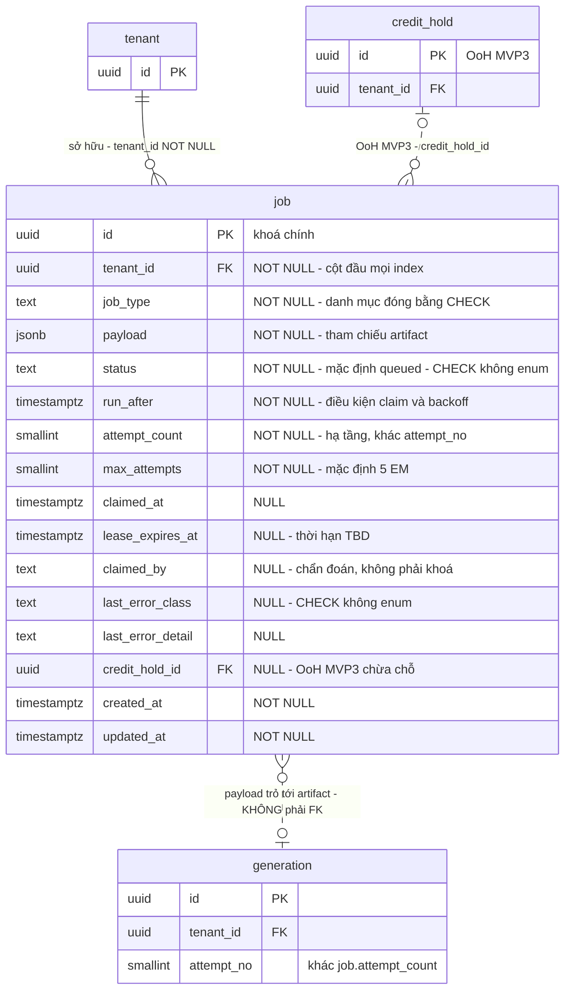

# DB Entity: Job Queue

Đặc tả bảng `public.job` — hàng đợi công việc **nằm trong PostgreSQL**, nơi API và Worker giao tiếp với nhau và là chỗ **câu SQL nóng nhất hệ thống** (câu CLAIM) chạy.

> [!IMPORTANT]
> ⚠️ **Tên đủ điều kiện là `public.job`**, ⛔ **KHÔNG** phải `generation.job`.
> `findings/architect.md` §3.3 xếp bảng này vào schema `generation` — đó là bản đồ viết **trước** ADR-005. [SDD §3.3](../Architecture/SDD-Comic-Studio.md) đã hiệu chỉnh tường minh và [ADR-005 `Q1`](../Architecture/ADR-005-Platform-Table-Schema-Placement.md) liệt kê `public.job` trong nhóm platform.
> Mọi câu SQL trong file này dùng **tên đủ điều kiện** theo guardrail `G-3`; ⛔ không dựa vào `search_path`.

## Decided in

| Nguồn | Nội dung kế thừa |
|---|---|
| [ADR-015 — Job Queue In Postgres](../Architecture/ADR-015-Job-Queue-In-Postgres.md) | `Q1` transactional enqueue · `Q2` hình dạng bảng · `Q3` fairness trong câu CLAIM · `Q4` retry/backoff/lease · `Q5` error taxonomy mức job · `Q6` `CT-POLL-2S` |
| [ADR-005 — Platform Table Schema Placement](../Architecture/ADR-005-Platform-Table-Schema-Placement.md) | `Q1` bảng thuộc `public` · `Q3` guardrail `G-1`…`G-4` |
| [ADR-006 — RLS Tenant Context Injection](../Architecture/ADR-006-RLS-Tenant-Context-Injection.md) | `D4.1` cặp policy carve-out của `app_worker` · `D4.2` trình tự claim · `W-1`…`W-4` |
| [ADR-017 — Provenance Chain And One Transaction Boundary](../Architecture/ADR-017-Provenance-Chain-And-One-Transaction-Boundary.md) | `Q4.1` phát biểu `KC-4` · `Q4.5` ranh giới `KC-4` ≠ vòng đời job |
| [ADR-016 — Image Provider Adapter](../Architecture/ADR-016-Image-Provider-Adapter-And-Version-Pinning.md) | `Q1` adapter trả **lớp lỗi đã phân loại** ⇒ ánh xạ sang `last_error_class` |
| [SDD §3.3, §4.1 `B-2`, §5.2 `F5`, §7.3, §7.5, §9.2 `P-5`](../Architecture/SDD-Comic-Studio.md) | Vị trí bảng · ranh giới API ↔ Worker · luồng sinh ảnh · job theo đồng hồ |
| Requirement gốc | `SRS-FR-25`, `SRS-FR-26`, `SRS-NFR-01`, `SRS-NFR-02`, `SRS-NFR-03`, `SRS-NFR-06`, `SRS-NFR-21` |
| Story | [Story-Job-Queue-In-Postgres](../../022-User-Stories/Backlog/Story-Job-Queue-In-Postgres.md) |

> [!NOTE]
> **File này đóng hàng `P-5`** của [SDD §9.2](../Architecture/SDD-Comic-Studio.md): kiểu cột · danh mục `job_type` · hình dạng index · thứ tự `ORDER BY` của câu CLAIM · chỗ chừa cho HOLD credit.
> ⚠️ [ADR-015](../Architecture/ADR-015-Job-Queue-In-Postgres.md) gọi file này là *"DB-Entity-Job.md"*; **tên đúng theo [SDD §3.4](../Architecture/SDD-Comic-Studio.md) là `DB-Entity-Job-Queue.md`** — ⛔ không phải một file thứ 14.

---

## Bảng

### `public.job`

Một dòng = **một đơn vị công việc hạ tầng** mà worker phải nhặt lên. ⛔ Dòng này **trỏ** tới dữ liệu nghiệp vụ, ⛔ **không chứa** dữ liệu nghiệp vụ.

| Cột | Kiểu | NULL? | Mặc định | Mô tả |
|---|---|:--:|---|---|
| `id` | `UUID` | ⛔ | `gen_random_uuid()` | Khoá chính |
| ⭐ `tenant_id` | `UUID` | ⛔ | — | Chủ sở hữu job. ⭐ **Là điều kiện tồn tại của `in_flight_per_tenant`** ([ADR-015 `Q3`](../Architecture/ADR-015-Job-Queue-In-Postgres.md)) — ⛔ không phải cột *"cho đủ bộ"* |
| `job_type` | `TEXT` | ⛔ | — | Loại công việc. **Danh mục đóng**, cưỡng chế bằng `CHECK (job_type IN (…))` — xem [Danh mục `job_type`](#danh-mục-job_type). ⛔ **Không** Postgres enum type ([`E15`](../../010-Planning/pm-runs/2026-08-28-phase-2-architecture-design-comic-studio/escalations.md)) |
| `payload` | `JSONB` | ⛔ | — | **Tham chiếu** tới artifact nghiệp vụ (ví dụ `{"generation_id": "..."}`). ⛔ Không nhét dữ liệu nghiệp vụ vào đây |
| `status` | `TEXT` | ⛔ | `'queued'` | Trạng thái vòng đời. Danh mục đóng theo [ADR-015 `Q5`](../Architecture/ADR-015-Job-Queue-In-Postgres.md), cưỡng chế bằng `CHECK (status IN (…))` — xem [Danh mục `job_status`](#danh-mục-job_status) |
| `run_after` | `TIMESTAMPTZ` | ⛔ | `now()` | Sớm nhất được claim từ lúc nào. Là cơ chế hiện thực **backoff** và là **điều kiện claim** |
| `attempt_count` | `SMALLINT` | ⛔ | `0` | Số lần worker đã nhặt job này lên. ⚠️ ⛔ **KHÔNG** phải `generation.attempt_no` — xem [cảnh báo](#-attempt_count--attempt_no) |
| `max_attempts` | `SMALLINT` | ⛔ | `5` | Trần thử lại cho lỗi transient. Giá trị `5` là `[EM]` — lựa chọn tầng design của [ADR-015 `Q4.2`](../Architecture/ADR-015-Job-Queue-In-Postgres.md), ⛔ không phải chỉ tiêu NFR |
| `claimed_at` | `TIMESTAMPTZ` | ✅ | `NULL` | Thời điểm lượt claim hiện tại bắt đầu |
| `lease_expires_at` | `TIMESTAMPTZ` | ✅ | `NULL` | Hạn lease. ⭐ Cơ chế chống job kẹt vĩnh viễn khi worker chết ([ADR-015 `Q4.3`](../Architecture/ADR-015-Job-Queue-In-Postgres.md)). **Thời hạn lease = `TBD`** |
| `claimed_by` | `TEXT` | ✅ | `NULL` | Định danh worker instance. Phục vụ chẩn đoán, ⛔ **không phải khoá** |
| `last_error_class` | `TEXT` | ✅ | `NULL` | Lớp lỗi lần gần nhất — quyết định retry hay không. Danh mục đóng, cưỡng chế bằng `CHECK (last_error_class IN (…))` — xem [Danh mục `job_error_class`](#danh-mục-job_error_class) |
| `last_error_detail` | `TEXT` | ✅ | `NULL` | Chi tiết lỗi để chẩn đoán. ⛔ Không được chứa secret/API key |
| `credit_hold_id` | `UUID` | ✅ | `NULL` | ⭐ **`[OoH]` MVP3 — chỗ chừa cho HOLD credit.** Xem [Chỗ chừa cho HOLD credit](#chỗ-chừa-cho-hold-credit) |
| `created_at` | `TIMESTAMPTZ` | ⛔ | `now()` | |
| `updated_at` | `TIMESTAMPTZ` | ⛔ | `now()` | Cập nhật ở mọi lần đổi trạng thái |

- **PK**: `(id)`
- **FK**: `tenant_id → public.tenant(id)` `ON DELETE CASCADE` (`SRS-NFR-05`)
- **FK** *(hoãn tới MVP3)*: `credit_hold_id → public.credit_hold(id)` — ⛔ chưa tạo được vì bảng đích thuộc [`DB-Entity-Credit-Ledger.md`](./DB-Entity-Credit-Ledger.md), `[OoH]` MVP3

⚠️ ⛔ **Không có FK `job → generation`.** Quan hệ đi qua `payload`, có chủ đích: một job trỏ tới artifact nghiệp vụ ở schema khác, và số dòng `generation` mà một job sinh ra là câu hỏi **còn mở** (xem [Ranh giới với `KC-4`](#ranh-giới-với-kc-4--file-này-không-đóng-q45)).

### Danh mục `job_type`

⭐ **Đóng hàng `P-5`** — `job_type` là **danh sách đóng**, cưỡng chế bằng `CHECK` ở tầng DB (cột `TEXT`, ⛔ **không** Postgres enum type — [`E15`](../../010-Planning/pm-runs/2026-08-28-phase-2-architecture-design-comic-studio/escalations.md)).

| Giá trị | Nghĩa | Neo |
|---|---|---|
| `generate_panel` | Sinh **N candidate** cho một đơn vị render rồi VLM QA-select | `SRS-FR-20`, `SRS-FR-25` · [SDD §5.2 `F5`](../Architecture/SDD-Comic-Studio.md) |

⚠️ **Danh mục MVP0–MVP2 có đúng MỘT giá trị. Đó là kết quả tra nguồn, ⛔ không phải sự thiếu sót.**

| Ứng viên bị loại | Vì sao ⛔ không thêm |
|---|---|
| Rollup `public.usage_daily` · golden dataset regression · hold reaper | [SDD §7.5](../Architecture/SDD-Comic-Studio.md) chốt chúng chạy bằng **subcommand của chính image**, ⛔ **không** đi qua `public.job` |
| Export chapter · preview render | ⛔ **Không nguồn nào trong repo enqueue hai việc này.** Thêm giá trị vì *"chắc là async"* là bịa |

⛔ **Quy tắc thêm giá trị**: một giá trị mới chỉ vào danh mục `CHECK` khi có nguồn nói việc đó **đi qua hàng đợi**. Migration lặng lẽ thêm giá trị là vi phạm ranh giới `B-2` ([SDD §4.1](../Architecture/SDD-Comic-Studio.md)).

### Danh mục `job_status`

Nguồn: [ADR-015 `Q5`](../Architecture/ADR-015-Job-Queue-In-Postgres.md) — ⛔ file này không thêm/bớt giá trị.

| `status` | Claim được? | ⭐ Được đếm bởi subquery in-flight? |
|---|:--:|:--:|
| `queued` | ✅ khi `run_after <= now()` | ⛔ |
| `running` | ⛔ | ⭐ **✅ BẮT BUỘC** |
| `succeeded` | ⛔ | ⛔ |
| `failed_permanent` | ⛔ | ⛔ |
| `failed_exhausted` | ⛔ | ⛔ |

### Danh mục `job_error_class`

Nguồn: [ADR-015 `Q5`](../Architecture/ADR-015-Job-Queue-In-Postgres.md). Phân loại **do adapter cung cấp** ([ADR-016 `Q1`](../Architecture/ADR-016-Image-Provider-Adapter-And-Version-Pinning.md)); hàng đợi chỉ **quyết định làm gì** với lớp đó.

| Lớp | Retry? | Trạng thái cuối khi không retry |
|---|:--:|---|
| `transient_infra` | ✅ | `failed_exhausted` khi hết `max_attempts` |
| `transient_provider` | ✅ | `failed_exhausted` khi hết `max_attempts` |
| `permanent_input` | ⛔ | `failed_permanent` |
| `permanent_policy` | ⛔ | `failed_permanent` — ⚠️ **phải ghi lại MỌI lần** (`SRS-NFR-20`), đích ghi là `generation.provider_refusal_log` ([`DB-Entity-Quality-Assets.md`](./DB-Entity-Quality-Assets.md)) |
| `permanent_unknown` | ⛔ | `failed_permanent` — ⚠️ **phải xuất hiện được trong chẩn đoán**, ⛔ không im lặng |

---

## Câu CLAIM — SQL nóng nhất hệ thống

⭐ Fairness nằm **TRONG** câu CLAIM, ⛔ **không** tách thành bước lọc ở tầng ứng dụng ([ADR-015 `Q3`](../Architecture/ADR-015-Job-Queue-In-Postgres.md), `SRS-FR-26`).

```sql
-- Bước 2 trong trình tự ADR-006 D4.2. Chạy dưới role app_worker.
-- ⛔ Statement KẾ TIẾP NGAY LẬP TỨC phải là SET LOCAL app.current_tenant (W-3).
SELECT j.id, j.tenant_id, j.job_type, j.payload, j.attempt_count, j.max_attempts
FROM   public.job AS j
WHERE  j.status = 'queued'
  AND  j.run_after <= now()
  AND  (
         SELECT count(*)
         FROM   public.job AS f
         WHERE  f.tenant_id = j.tenant_id
           AND  f.status = 'running'
           AND  f.lease_expires_at > now()
       ) < :in_flight_limit_n          -- ⛔ N = TBD, xem bảng TBD
ORDER  BY j.run_after ASC, j.created_at ASC, j.id ASC
FOR    UPDATE SKIP LOCKED
LIMIT  1;
```

### ⭐ Đóng hàng `P-5` — thứ tự `ORDER BY`

**`ORDER BY run_after ASC, created_at ASC, id ASC`** — FIFO theo *thời điểm đủ điều kiện*, với `id` làm **tie-breaker tạo thứ tự toàn phần**.

| Điều | Lý do |
|---|---|
| `run_after` dẫn đầu | Nó là chính điều kiện claim; job đang backoff ⛔ không được chen lên trước |
| `created_at` thứ hai | Hai job cùng `run_after` (trường hợp thường gặp: cùng `now()` mặc định) vẫn phải FIFO |
| ⭐ `id` cuối | ⛔ **Không được bỏ.** Thiếu tie-breaker, thứ tự giữa hai dòng trùng khoá là **không xác định** — với `SKIP LOCKED` chạy song song, điều đó biến hành vi hàng đợi thành thứ ⛔ không test lại được |
| ⛔ **Không có cột `priority`** | ⛔ Không nguồn Phase 1 nào đặt lớp ưu tiên. Thêm `priority` là **phát minh một quyết định**, và nó làm hỏng chính tính FIFO mà fairness đang dựa vào |

### ⚠️ Một thuộc tính phải nói thẳng — cửa sổ đếm thiếu dài đúng một statement

Dòng vừa bị `FOR UPDATE SKIP LOCKED` giữ vẫn mang `status = 'queued'` cho tới khi worker `UPDATE` nó sang `running` (bước 4 của [ADR-006 `D4.2`](../Architecture/ADR-006-RLS-Tenant-Context-Injection.md)). ⇒ Trong khoảng đó, subquery in-flight của một worker khác **đếm thiếu đúng số job đang được claim song song**.

- **Chặn trên của sai số**: bằng **số worker đang claim đồng thời** — ⛔ không tích luỹ, ⛔ không kéo dài.
- ⛔ **Không có nguy cơ claim trùng**: `SKIP LOCKED` khiến worker thứ hai bỏ qua hẳn dòng đã bị giữ.
- ⚠️ Đây là **thuộc tính được ghi nhận và chấp nhận**, ⛔ không phải bug bị bỏ sót. Sửa nó bằng cách gộp claim + `UPDATE status` vào một statement sẽ **đụng vào phạm vi `WITH CHECK` của policy `UPDATE`** trong [ADR-006 `D4.1`](../Architecture/ADR-006-RLS-Tenant-Context-Injection.md) ⇒ ⛔ **ngoài quyền của file này**; mở [ADR-006](../Architecture/ADR-006-RLS-Tenant-Context-Injection.md) nếu muốn đổi.

### ⚠️ `attempt_count` ≠ `attempt_no`

> [!CAUTION]
> ⛔ **`public.job.attempt_count` KHÔNG phải `generation.generation.attempt_no`.** Dùng một cột cho cả hai là **xoá mất chi phí thật**.
> - `attempt_count` = **hạ tầng**: bao nhiêu lần worker nhặt job này lên. Một retry vì DB timeout **trước khi gọi provider** ⛔ không tốn tiền.
> - `attempt_no` = **kinh tế/provenance** (`SRS-FR-31`): mỗi lần gọi provider tốn tiền thật là một dòng `generation` riêng.
> Nguồn: [ADR-015 `Q2`](../Architecture/ADR-015-Job-Queue-In-Postgres.md) · chi tiết cột ở [`DB-Entity-Generation.md`](./DB-Entity-Generation.md).

---

## Index

⚠️ **`tenant_id` là cột ĐẦU TIÊN của MỌI composite index** (`SRS-NFR-01`, `D-10`) — ⛔ không có ngoại lệ trên bảng này.

| Index | Định nghĩa | Phục vụ |
|---|---|---|
| `job_pkey` | `PRIMARY KEY (id)` | Khoá chính |
| ⭐ `ix_job_inflight` | `(tenant_id, status, lease_expires_at)` `WHERE status = 'running'` | ⭐ **Subquery đếm in-flight** của câu CLAIM ([ADR-015 `Q3`](../Architecture/ADR-015-Job-Queue-In-Postgres.md)) |
| ⭐ `ix_job_claim` | `(tenant_id, status, run_after, created_at, id)` `WHERE status = 'queued'` | Vế *claimable* + `ORDER BY` của câu CLAIM |
| `ix_job_lease_reaper` | `(tenant_id, lease_expires_at)` `WHERE status = 'running'` | Quét lease hết hạn để job quay lại hàng đợi |
| `ix_job_diagnostics` | `(tenant_id, status, updated_at DESC)` | Chẩn đoán: job thất bại gần nhất của một tenant; endpoint trạng thái job (`CT-POLL-2S`) |

> [!WARNING]
> ⚠️ **Một rủi ro phải đo, ⛔ không được tự giải bằng cách bỏ `tenant_id`.**
> Câu CLAIM là truy vấn **xuyên tenant** (carve-out `D4.1` của `app_worker` không thêm predicate `tenant_id`). Index dẫn đầu bằng `tenant_id` ⇒ planner ⛔ không có đường quét có thứ tự sạch trên `run_after` cho toàn bảng.
> - ⛔ **Không** được "sửa" bằng cách đảo cột dẫn đầu — [ADR-015 `Q2`](../Architecture/ADR-015-Job-Queue-In-Postgres.md) và `SRS-NFR-01` đều chốt `tenant_id` đứng đầu, và `D-10` là lớp phòng thủ cho **mọi** truy vấn khác trên bảng này, ⛔ không riêng câu CLAIM.
> - ⭐ **Việc phải làm**: chạy `EXPLAIN (ANALYZE, BUFFERS)` câu CLAIM trên dữ liệu MVP0 thật. Nếu kế hoạch không chấp nhận được ⇒ đây là **xung đột giữa `D-10` và hiệu năng câu CLAIM** và phải mở **ADR mới**, ⛔ không sửa lặng lẽ ở migration.
> - **Ai đóng**: Architect + Engineer, sau khi MVP0 có số đo. Cùng mốc với `T-8` và với `N`.

---

## Constraint & Invariant

| # | Ràng buộc | Cưỡng chế bằng | Bảo vệ điều gì |
|:--:|---|---|---|
| `J-1` | `tenant_id NOT NULL` | `NOT NULL` | `SRS-NFR-01`; ⭐ điều kiện **tồn tại** của fairness |
| `J-2` | `CHECK (attempt_count >= 0 AND attempt_count <= max_attempts)` | `CHECK` | ⛔ Không retry vượt trần |
| `J-3` | `CHECK (max_attempts >= 1)` | `CHECK` | ⛔ Không có job không bao giờ được thử |
| `J-4` | `CHECK ((status = 'running') = (claimed_at IS NOT NULL AND lease_expires_at IS NOT NULL AND claimed_by IS NOT NULL))` | `CHECK` | ⭐ Một job `running` **luôn** đếm được và **luôn** có lease ⇒ ⛔ không có row `running` vô hình với reaper hay với subquery in-flight |
| `J-5` | `CHECK (lease_expires_at IS NULL OR lease_expires_at > claimed_at)` | `CHECK` | ⛔ Lease hết hạn ngay lúc sinh ra |
| `J-6` | `CHECK (status <> 'failed_permanent' OR last_error_class IS NOT NULL)` và `CHECK (status <> 'failed_exhausted' OR last_error_class IS NOT NULL)` | `CHECK` | ⭐ **Job thất bại phải để lại trạng thái RÕ RÀNG**, ⛔ không bao giờ biến mất ([ADR-015 `Q5`](../Architecture/ADR-015-Job-Queue-In-Postgres.md)) |
| `J-7` | `CHECK (jsonb_typeof(payload) = 'object')` | `CHECK` | `payload` là **tham chiếu** có cấu trúc, ⛔ không phải scalar tự do |
| `J-8` | ⛔ **Không cột kiểu binary** trên bảng này | Test CI liệt kê `information_schema.columns` | Ranh giới `B-4` ([SDD §4.1](../Architecture/SDD-Comic-Studio.md)) |
| `J-9` | Enqueue = `INSERT public.job` **cùng transaction** với `INSERT generation.generation` | Kiến trúc 1-DB + test rollback | `SRS-FR-25` ⇒ ⛔ **không bao giờ có job mồ côi** |
| `J-10` | ⛔ Mọi truy vấn trực tiếp vào `public.job` **ngoài** hàm `claimJobAndBindTenant()` ⇒ CI đỏ | Lint rule (`W-3`, ranh giới `B-2`) | `SRS-NFR-02`, `SRS-NFR-03` |

### Hai invariant hành vi (⛔ không cưỡng chế được bằng constraint)

| # | Invariant | Đo bằng |
|:--:|---|---|
| `J-11` | ⭐ **Job handler phải idempotent (at-least-once).** Lease hết hạn ⛔ không chứng minh worker đã chết — nó có thể chỉ đang chậm | Kill worker giữa chừng, khởi động worker mới ⇒ job **được xử lý tiếp**, ⛔ không kẹt và ⛔ không tính tiền hai lần ([ADR-015 `Q4.3`](../Architecture/ADR-015-Job-Queue-In-Postgres.md) · `SRS-NFR-12`) |
| `J-12` | Backoff **luỹ thừa cơ số 2 có jitter**, ghi bằng `run_after = now() + backoff(attempt_count)`; worker **nhả job**, ⛔ không ngủ giữ slot | ⛔ Không có jitter ⇒ thundering herd ([ADR-015 `Q4.2`](../Architecture/ADR-015-Job-Queue-In-Postgres.md)) |

### Chỗ chừa cho HOLD credit

`credit_hold_id` tồn tại **ngay từ migration đầu**, dù `[OoH]` MVP3:

- `SRS-FR-28` (`D-60`): **check-rồi-gọi là race condition** ⇒ HOLD ⛔ **không phải** một lời gọi thêm đặt trước enqueue, mà là **một câu ghi bên trong chính transaction enqueue** ([SDD §8.2 `S-2`](../Architecture/SDD-Comic-Studio.md)).
- ⇒ Chèn cột này **sau** = viết lại ranh giới transaction enqueue, tức đụng vào `KC-4`.
- Ở MVP1/MVP2 cột **luôn `NULL`** và ⛔ không code path nào ghi nó. FK tới `public.credit_hold` được thêm khi [`DB-Entity-Credit-Ledger.md`](./DB-Entity-Credit-Ledger.md) ship.

### Ranh giới với `KC-4` — file này ⛔ KHÔNG đóng `Q4.5`

⛔ **`D-03` (transactional enqueue) và `KC-4` là HAI ràng buộc khác nhau** — [ADR-015 `Q1`](../Architecture/ADR-015-Job-Queue-In-Postgres.md).

- `D-03` ràng buộc: `generation` ↔ `job` — **file này** (`J-9`).
- `KC-4` ràng buộc: `generation` ↔ `change_log` + `usage_event` + `field_provenance` — nguồn duy nhất là [ADR-017 `Q4.1`](../Architecture/ADR-017-Provenance-Chain-And-One-Transaction-Boundary.md), ⛔ **không** đặc tả lại ở đây.

⚠️ ⛔ **Vì thế `payload` ⛔ không được hiểu thành *"1 job = đúng 1 dòng `generation`"*.** [SDD §6.4](../Architecture/SDD-Comic-Studio.md) ghi `INSERT generation` xảy ra **cả ở đường API lúc enqueue lẫn ở đường worker lúc ghi kết quả**. Ánh xạ chính xác là **`TBD` `Q4.5`** — xem [bảng `TBD`](#tbd-còn-lại).

---

## RLS Policy

> ⭐ **Nguồn duy nhất là [ADR-006 `D4`](../Architecture/ADR-006-RLS-Tenant-Context-Injection.md).** File này ⛔ **không** đặc tả lại policy; nó ghi lại **ràng buộc mà schema phải làm cho đúng** và **phép đo**.

- `ALTER TABLE public.job ENABLE ROW LEVEL SECURITY` (+ `FORCE`), theo `SRS-NFR-01` — RLS là **lớp phòng thủ thứ hai**, ⛔ **không thay thế** `WHERE tenant_id = ...` ở tầng ứng dụng.
- Đường **API** (`app_api`): policy tenant chuẩn, đọc context qua **một hàm helper duy nhất** — [ADR-006 `D2`, `D3`](../Architecture/ADR-006-RLS-Tenant-Context-Injection.md).
- Đường **Worker** (`app_worker`): ⭐ **đúng một cặp policy `SELECT`/`UPDATE`**, xuyên tenant, và ⛔ **chỉ trên bảng này** — [ADR-006 `D4.1`](../Architecture/ADR-006-RLS-Tenant-Context-Injection.md). ⛔ **TUYỆT ĐỐI KHÔNG `BYPASSRLS`**.

> [!CAUTION]
> ⭐⚠️ **CẠM BẪY HỎNG IM LẶNG — đây là lý do mục này tồn tại.**
> Điều kiện `in_flight_per_tenant < N` chứa một **subquery đếm** trên chính `public.job`, và **subquery ấy CŨNG đi qua RLS**.
> ⇒ Nếu policy `SELECT` của `app_worker` chỉ lộ row *"claim được"* mà ⛔ **không phủ row đang in-flight**, phép đếm **luôn trả `0`**, `0 < N` **luôn đúng**, fairness **không bao giờ ràng buộc** — và ⛔ **nó không báo lỗi**. Câu SQL vẫn chạy, worker vẫn nhận job.
> ⇒ ⭐ **Ràng buộc bắt buộc ([ADR-006 `D4.1`](../Architecture/ADR-006-RLS-Tenant-Context-Injection.md)): policy `SELECT` của `app_worker` PHẢI phủ CẢ HAI loại row — `status = 'queued'` (claim được) VÀ `status = 'running'` (in-flight).**

**Schema được viết sao cho lỗi này ⛔ không xảy ra được** — ba lớp, ⛔ không lớp nào thay lớp nào:

| Lớp | Cơ chế | Chặn được gì |
|:--:|---|---|
| **1 — Hình dạng dữ liệu** | `J-4`: `status = 'running'` **⇔** có `claimed_at` + `lease_expires_at` + `claimed_by`. ⇒ ⛔ **Không tồn tại** row in-flight nào mà vị từ của policy không nhận diện được. Vế in-flight của policy và vế in-flight của subquery dùng **đúng cùng một** biểu thức: `status = 'running' AND lease_expires_at > now()` | Chặn *"policy đúng nhưng dữ liệu có hình dạng thứ ba"* |
| **2 — Đối chiếu policy bằng hằng số trong repo** | `W-2`: test CI đối chiếu `pg_policies` với danh sách policy hằng trong repo; `pg_roles.rolbypassrls = false` cho `app_worker`; lệch ⇒ CI đỏ | Chặn *"ai đó sửa policy cho hẹp lại"* |
| **3 — Test fairness thật sự ràng buộc** | ⭐ `W-2b`: seed một tenant có **`N`** job in-flight, gọi CLAIM ⇒ phải trả **0 job** của tenant đó | Chặn đúng kịch bản *"subquery đếm ra 0"* |

⚠️ **`W-2b` chỉ chạy được sau khi `N` hết `TBD`.** ⇒ Tới lúc đó, fairness có **cấu trúc** nhưng chưa có **bằng chứng nó ràng buộc**. Đây là lỗ **hợp lệ** ([ADR-015 `Q3`](../Architecture/ADR-015-Job-Queue-In-Postgres.md)), ⛔ **không được lấp bằng một số bịa**.

⚠️ Nhắc lại [ADR-006 `D4.3`](../Architecture/ADR-006-RLS-Tenant-Context-Injection.md): khoảng hở giữa CLAIM và `SET LOCAL` dài **đúng một statement** và **fail-closed**. Phản xạ *"nới quyền `app_worker` cho hết `0 row`"* là cách hỏng thật sự — ⛔ cấm, cưỡng chế bằng `W-2`.

---

## ER Diagram



⚠️ Sơ đồ dùng tên **rút gọn** vì cú pháp Mermaid ⛔ không nhận dấu chấm trong tên entity. Tên đủ điều kiện tương ứng: `public.job`, `public.tenant`, `public.credit_hold`, `generation.generation` (guardrail `G-3`).

---

## `TBD` còn lại

| Mã | Khoảng trống | Vì sao ⛔ chưa đóng được | **Ai đóng** | Khi nào |
|:--:|---|---|---|---|
| ⭐ **`N`** | Giá trị `N` của `in_flight_per_tenant < N` | `SRS-FR-26`: *"`Analysis §6.2` viết đúng chữ `N`, **không cho giá trị**"*; `SRS` §5.2 cấm tự gán số performance — ⛔ **bịa một con số là lỗi nghiêm trọng hơn để trống nó** | **PM + Architect** | Sau khi MVP0 đo tải thật. ⚠️ **Cùng chủ và cùng mốc** với hàng `TBD` tương ứng trong [ADR-006](../Architecture/ADR-006-RLS-Tenant-Context-Injection.md) — ⛔ hai nơi không được có hai đáp án |
| **`T-8`** | Thời hạn **lease** (`lease_expires_at - claimed_at`) | Phụ thuộc thời gian sinh panel p50/p95, mà `SRS` §5.2 xếp vào nhóm ⛔ cấm gán số | **Architect + Engineer** | Sau khi MVP0 đo thời gian sinh panel thật |
| **`CO-1`** *(hệ quả của `Q4.5`)* | ~~Ánh xạ **1 job ↔ mấy dòng `generation`** — cụ thể: enqueue có sinh một dòng `generation` **cấp request** hay ⛔ không~~ ⇒ ✅ **ĐÃ ĐÓNG** | ⭐ **Phán quyết: phương án (a)** — cột phân loại `generation_kind` (`TEXT` + `CHECK`) trên `generation.generation`, PM quyết tại [escalations `E17`](../../010-Planning/pm-runs/2026-08-28-phase-2-architecture-design-comic-studio/escalations.md); đã áp ở [`DB-Entity-Generation.md`](./DB-Entity-Generation.md), ⛔ file này không lặp lại chi tiết. Phần `usage` đã đóng ở [`DB-Entity-Provenance-And-Usage.md`](./DB-Entity-Provenance-And-Usage.md) (`U-1`…`U-5`, `CO-1.1`…`CO-1.3`). ⚠️ Với **file này** thì kết quả nào cũng ⛔ **không đổi DDL**: `J-9` chỉ đòi `INSERT job` và `INSERT generation` **cùng transaction**, ⛔ không đòi tỉ lệ 1:1 | — (đã đóng) | — |
| **Index** | Kế hoạch thật của câu CLAIM với index dẫn đầu bằng `tenant_id` | Chưa có dữ liệu thật để `EXPLAIN` | **Architect + Engineer** | Sau MVP0 — ⚠️ nếu FAIL thì mở **ADR mới**, ⛔ không bỏ `tenant_id` khỏi cột dẫn đầu |
| **Vận hành** | Throughput job/giờ · queue depth alert threshold · latency | `SRS-FR-25`, `SRS` §5.2: *"Không có"* | **Founder + dev** | Sau MVP0 |

---

## Tài liệu tham khảo

- [ADR-005 — Platform Table Schema Placement](../Architecture/ADR-005-Platform-Table-Schema-Placement.md)
- [ADR-006 — RLS Tenant Context Injection](../Architecture/ADR-006-RLS-Tenant-Context-Injection.md)
- [ADR-015 — Job Queue In Postgres](../Architecture/ADR-015-Job-Queue-In-Postgres.md)
- [ADR-016 — Image Provider Adapter And Version Pinning](../Architecture/ADR-016-Image-Provider-Adapter-And-Version-Pinning.md)
- [ADR-017 — Provenance Chain And One Transaction Boundary](../Architecture/ADR-017-Provenance-Chain-And-One-Transaction-Boundary.md)
- [SDD — Comic Studio](../Architecture/SDD-Comic-Studio.md) — §3.3, §3.4, §4.1, §5.2, §7.3, §7.5, §9.2
- [SRS — Comic Studio](../../020-Requirements/SRS-Comic-Studio.md) — `SRS-FR-25`, `SRS-FR-26`, `SRS-NFR-01`, `SRS-NFR-02`, `SRS-NFR-03`, `SRS-NFR-05`, `SRS-NFR-06`, `SRS-NFR-12`, `SRS-NFR-20`, `SRS-NFR-21`
- [Story-Job-Queue-In-Postgres](../../022-User-Stories/Backlog/Story-Job-Queue-In-Postgres.md)
- [DB-Entity-Generation](./DB-Entity-Generation.md) · [DB-Entity-Provenance-And-Usage](./DB-Entity-Provenance-And-Usage.md) · [DB-Entity-Credit-Ledger](./DB-Entity-Credit-Ledger.md) · [DB-Entity-Quality-Assets](./DB-Entity-Quality-Assets.md)

---

_Created by System Architect — lô L9, Phase 2._
_Author: trisjr_
