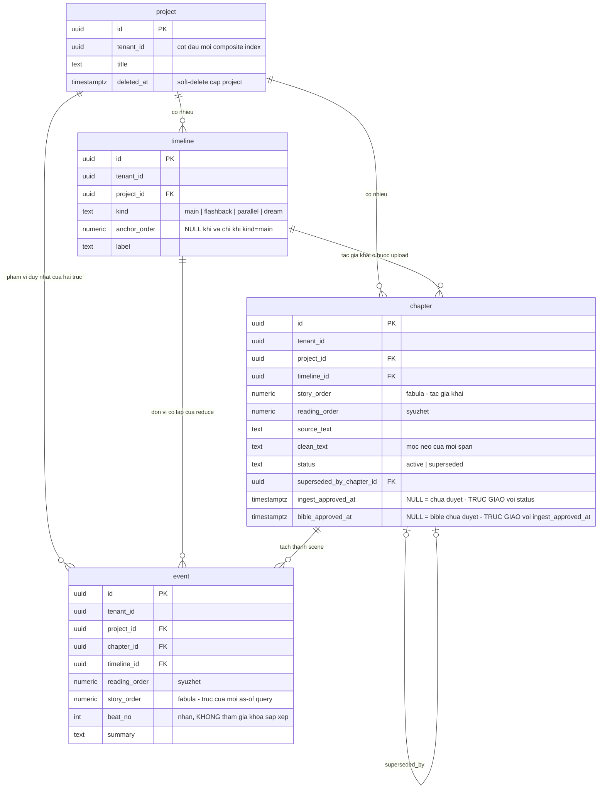

# DB Entity: Narrative Timeline

Cụm bốn bảng `story.project` · `story.chapter` · `story.timeline` · `story.event` tồn tại để **khoá thời gian tự sự hai trục** (`reading_order` = syuzhet, `story_order` = fabula) có một chỗ duy nhất được đặc tả — vì đó là **một invariant duy nhất trải cả bốn bảng**, tách ra thì không ai đọc được vì sao `story_order` phải là `NUMERIC` sparse.

**Decided in:**

- [ADR-011 — Khoá thời gian tự sự và mô hình rút gọn trạng thái](../Architecture/ADR-011-Narrative-Time-Key-And-State-Reduction.md) — `D1`–`D5` (khoá thời gian), `D9` (cô lập theo `timeline_id`), `D13` (hợp đồng: lô này được quyền đặc tả tên bảng, kiểu cột, PK/FK/index, `CHECK`, migration)
- [ADR-009 — Modular monolith, ba schema](../Architecture/ADR-009-Modular-Monolith-Three-Schemas.md) — bốn bảng này thuộc schema `story` (module `M1`)
- [ADR-010 — Cô lập tenant bằng `tenant_id` + RLS](../Architecture/ADR-010-Tenant-Isolation-With-RLS.md) — `D1`, `D2`, `D3` (`SRS-NFR-01`)
- [ADR-006 — RLS & tenant context injection](../Architecture/ADR-006-RLS-Tenant-Context-Injection.md) — `D2` (hàm helper `public.current_tenant_id()`), `D7` (role migration)
- [ADR-005 — Vị trí schema bảng platform](../Architecture/ADR-005-Platform-Table-Schema-Placement.md) — `G-3` (luôn dùng **tên đủ điều kiện**)
- [SDD Comic Studio](../Architecture/SDD-Comic-Studio.md) — §3.2 (invariant sống trong schema `story`), §4.2 (ràng buộc cưỡng chế ở tầng DB)

> [!IMPORTANT]
> ⭐ **`story.project` là PHÁT MINH CỦA PHASE 2, ⛔ không phải dẫn xuất.**
> `UC-01` bước 1 (*"chọn tác phẩm hoặc tạo tác phẩm mới"*) và `UC-11` bước 6 (*"soft-delete + disable-access ở **cấp project**"*) đều **giả định** một aggregate trên `chapter`, nhưng **không** `SRS-FR-*`/`SRS-NFR-*` nào, **không** hàng `MVP-Scope §3` nào và **không** Story nào sở hữu entity này ([findings/architect §7 `G13`](../../010-Planning/pm-runs/2026-08-28-phase-2-architecture-design-comic-studio/findings/architect.md)). Ghi ra đây để một run sau ⛔ không tưởng nó có anchor requirement.

---

## Bảng

### `story.project`

Aggregate gốc *"tác phẩm"* của một tenant — đơn vị của **soft-delete** và của **disable-access khi takedown**.

| Cột | Kiểu | NULL? | Mặc định | Mô tả |
|---|---|:--:|---|---|
| `id` | `UUID` | ⛔ | `gen_random_uuid()` | Khoá chính |
| `tenant_id` | `UUID` | ⛔ | — | Chủ sở hữu. `NOT NULL` bắt buộc theo `SRS-NFR-01` (`ADR-010 D1`) |
| `title` | `TEXT` | ⛔ | — | Tên tác phẩm do tác giả đặt |
| `deleted_at` | `TIMESTAMPTZ` | ✅ | `NULL` | Soft-delete cấp project (`UC-11` bước 6). ⛔ Không `DELETE` vật lý |
| `created_at` | `TIMESTAMPTZ` | ⛔ | `now()` | — |
| `updated_at` | `TIMESTAMPTZ` | ⛔ | `now()` | — |

- **Khoá chính**: `(id)`
- **Khoá ngoại**: `tenant_id → public.tenant(id)` *(bảng `public.tenant` thuộc `DB-Entity-Tenancy.md` — lô song song)*
- ⛔ **KHÔNG có cột trạng thái disable-access ở đây.** Trạng thái đó sống ở `public.project_access_state` (`DB-Entity-Compliance-And-Takedown.md`, lô song song). Hai khái niệm khác nhau: `deleted_at` là hành động của **tác giả**, disable-access là hệ quả của **takedown**.

### `story.chapter`

Một chương truyện chữ đã upload; **mang `timeline_id` + `story_order` do tác giả khai** ở bước upload (`UC-01` bước 2, `BR-002-07`).

| Cột | Kiểu | NULL? | Mặc định | Mô tả |
|---|---|:--:|---|---|
| `id` | `UUID` | ⛔ | `gen_random_uuid()` | Khoá chính |
| `tenant_id` | `UUID` | ⛔ | — | `SRS-NFR-01` |
| `project_id` | `UUID` | ⛔ | — | Tác phẩm cha |
| `timeline_id` | `UUID` | ⛔ | — | Nhánh thời gian **tác giả khai** (`UC-01` bước 2 · `ALT-4`) |
| `story_order` | `NUMERIC` | ⛔ | — | Vị trí fabula của chapter, **sparse bước 1000** (`D2`) |
| `reading_order` | `NUMERIC` | ⛔ | — | Vị trí syuzhet của chapter. `[Kiến trúc suy luận]` — `D1` cấm gộp hai trục; thiếu cột này thì thứ tự đọc phải suy ra từ `created_at`, đúng mẫu *"sai âm thầm"* mà `D1` tồn tại để chặn |
| `title` | `TEXT` | ⛔ | — | Tiêu đề chương |
| `source_text` | `TEXT` | ⛔ | — | Văn bản gốc như đã nạp. ⛔ Không đi qua object storage: `B-4` chỉ nói về **bytes ảnh** |
| `clean_text` | `TEXT` | ✅ | `NULL` | Kết quả `text clean` deterministic (`SRS-FR-06`). `NULL` = chưa chạy xong bước 7 |
| `status` | `TEXT` | ⛔ | `'active'` | `CHECK (status IN ('active','superseded'))` — `UC-01` `EXC-5`. ⛔ **Không** Postgres enum type ([`E15`](../../010-Planning/pm-runs/2026-08-28-phase-2-architecture-design-comic-studio/escalations.md)) |
| `superseded_by_chapter_id` | `UUID` | ✅ | `NULL` | Trỏ bản thay thế khi `status='superseded'` |
| ⭐ `ingest_approved_at` | `TIMESTAMPTZ` | ✅ | `NULL` | ⭐ **Mốc tác giả CHẤP NHẬN kết quả ingest / text clean** (`UC-01` bước 10). `NULL` ≡ *chưa duyệt*. ⚠️ **Trạng thái ĐỘC LẬP với `status`** — xem [khối dưới](#vì-sao-ingest_approved_at-là-cột-riêng-kiểu-timestamptz) |
| ⭐ `bible_approved_at` | `TIMESTAMPTZ` | ✅ | `NULL` | ⭐ **Mốc tác giả DUYỆT Story Bible của chương** (`UC-02` bước 12 · `SB-7`). `NULL` ≡ *chưa duyệt*; `bible_approved` trong response là **giá trị DẪN XUẤT** (`bible_approved_at IS NOT NULL`), `approved_at` là **chính cột** — cùng khuôn `ingest_approved_at`. ⚠️ **Trực giao với `ingest_approved_at` và với `status`** — xem `INV-14`. ⛔ Độ hạt là **chapter**, ⛔ **không** phải `story.bible_entity` (entity thuộc **project**, sống xuyên nhiều chương) |
| `ingested_at` | `TIMESTAMPTZ` | ⛔ | `now()` | Mốc nhận file |
| `created_at` | `TIMESTAMPTZ` | ⛔ | `now()` | — |
| `updated_at` | `TIMESTAMPTZ` | ⛔ | `now()` | — |

- **Khoá chính**: `(id)`
- **Khoá ngoại**: `(tenant_id, project_id) → story.project(tenant_id, id)` · `(tenant_id, timeline_id, project_id) → story.timeline(tenant_id, id, project_id)` · `superseded_by_chapter_id → story.chapter(id)`

#### Vì sao `ingest_approved_at` là cột RIÊNG, kiểu `TIMESTAMPTZ`

⭐ **Đóng `TBD-API-CH-1`** mà [`Endpoint-Chapter-Ingest.md`](../API/Endpoint-Chapter-Ingest.md) (`CH-5`) route sang tầng Schema. Trước lô này, `CH-5` có endpoint và `ingest_approved` có mặt trong response của `GET /v1/projects/{id}/chapters`, nhưng ⛔ **không cột nào lưu được trạng thái đó**.

> [!CAUTION]
> ⛔⛔ **TUYỆT ĐỐI KHÔNG nhét *"đã duyệt ingest"* thành giá trị thứ ba của `status`.** ⭐ Hai thứ **trực giao**, ⛔ không phải hai điểm trên một trục: một chapter **đã duyệt ingest** vẫn có thể bị `superseded` khi tác giả nạp lại (`UC-01` `ALT-3`/`EXC-5`). Gộp chúng ⇒ mất **một trong hai** sự thật ngay lần chuyển trạng thái đầu tiên, và làm hỏng UNIQUE partial index `WHERE status='active'` vốn phụ thuộc `status` chỉ mang **đúng một** nghĩa.

| Lựa chọn | Phán quyết |
|---|---|
| ⭐ **`ingest_approved_at TIMESTAMPTZ NULL`** | ✅ **CHỌN** |
| `ingest_approved TEXT` + `CHECK` | ⛔ Bác |
| Giá trị thứ ba của `status` | ⛔⛔ Bác — xem khối trên |

⭐ **Lý do chọn `TIMESTAMPTZ` nullable:**

1. ⭐ **Một cột mang ĐỦ hai thứ contract đã hứa.** `CH-5` trả `{"ingest_approved": true, "approved_at"}` và `CH-4` trả `ingest_approved` — với cột này, `ingest_approved` là **dẫn xuất** (`ingest_approved_at IS NOT NULL`) và `approved_at` là **chính cột**. Một cột `TEXT` + `CHECK` chỉ mang được **trạng thái**, vẫn phải thêm **cột thứ hai** cho mốc thời gian ⇒ hai cột phải luôn nhất quán với nhau, đúng mẫu *"sai âm thầm"* mà `D1` tồn tại để chặn.
2. ⚠️ **⛔ Điều này KHÔNG vi phạm `E15`.** Quy tắc *"`TEXT` + `CHECK`, ⛔ không Postgres enum type"* áp cho **cột DANH MỤC** (`status`, `kind`, `permanence`…). `ingest_approved_at` ⛔ **không phải** cột danh mục — nó là **một mốc thời gian**. ⛔ Đừng đọc `E15` thành *"mọi cột đều phải là `TEXT`"*.
3. ⭐ **Trực giao với `status` là thuộc tính có sẵn, ⛔ không cần cưỡng chế thêm.** Chapter `superseded` **giữ nguyên** `ingest_approved_at` của nó — ⛔ **không** trigger nào xoá giá trị đó. Lịch sử duyệt là bằng chứng `KC-2`, ⛔ không phải trạng thái tạm.
4. ⭐ **Nạp lại ⇒ row MỚI, bắt đầu từ `NULL`.** Theo `INV-7`/`ALT-3`, nạp lại **tạo row `chapter` mới** ⇒ chapter mới **chưa được duyệt** cho tới khi tác giả gọi `CH-5` lần nữa. ⛔ Không kế thừa trạng thái duyệt của bản cũ — *"đây là một file mới đi vào hệ thống"*.
5. ⛔ **CỐ Ý ⛔ KHÔNG thêm `ingest_approved_by_user_id`.** Bằng chứng **ai** đã duyệt sống ở dòng `public.change_log` với `action_type = 'approve_ingest'` ([`DB-Entity-Provenance-And-Usage.md`](./DB-Entity-Provenance-And-Usage.md)), và `CH-5` trả về `change_log_id` để nối hai đầu. Chép `actor_user_id` sang đây là **nguồn sự thật thứ hai** cho cùng một dữ kiện.

⇒ Ba invariant đi kèm cột này là `INV-11`, `INV-12`, `INV-13` — xem mục [Constraint & Invariant](#constraint--invariant).

### `story.timeline`

Mạch thời gian. Đây là **đơn vị cô lập của phép `reduce`** (`D9`).

| Cột | Kiểu | NULL? | Mặc định | Mô tả |
|---|---|:--:|---|---|
| `id` | `UUID` | ⛔ | `gen_random_uuid()` | Khoá chính |
| `tenant_id` | `UUID` | ⛔ | — | `SRS-NFR-01` |
| `project_id` | `UUID` | ⛔ | — | Tác phẩm cha |
| `kind` | `TEXT` | ⛔ | — | `CHECK (kind IN ('main','flashback','parallel','dream'))` — **đúng bốn giá trị của `D3`**, ⛔ không thêm. ⛔ **Không** Postgres enum type ([`E15`](../../010-Planning/pm-runs/2026-08-28-phase-2-architecture-design-comic-studio/escalations.md)) |
| `anchor_order` | `NUMERIC` | ✅ | `NULL` | Neo nhánh vào trục chính (`D3`). `NULL` **khi và chỉ khi** `kind='main'` |
| `label` | `TEXT` | ⛔ | — | Tên nhánh cho người biên tập |
| `created_at` | `TIMESTAMPTZ` | ⛔ | `now()` | — |

- **Khoá chính**: `(id)`
- **Khoá ngoại**: `(tenant_id, project_id) → story.project(tenant_id, id)`

### `story.event`

Sự kiện **mức scene** — nơi state được neo vào (`D4`). ⭐ Đây là bảng mà `state_at(N) = reduce(events where story_order <= N)` chạy trên (`D6`).

| Cột | Kiểu | NULL? | Mặc định | Mô tả |
|---|---|:--:|---|---|
| `id` | `UUID` | ⛔ | `gen_random_uuid()` | Khoá chính |
| `tenant_id` | `UUID` | ⛔ | — | `SRS-NFR-01` |
| `project_id` | `UUID` | ⛔ | — | Denormalize để phạm vi duy nhất của hai trục kiểm được ở tầng DB (xem `INV-3`) |
| `chapter_id` | `UUID` | ⛔ | — | Chapter mà event được tách ra (`UC-01` bước 8). ⛔ Không có event mồ côi (`EXC-3`) |
| `timeline_id` | `UUID` | ⛔ | — | Nhánh của event. Mặc định kế thừa `chapter.timeline_id`; **được phép khác** khi một scene hồi tưởng nằm trong chapter mạch chính |
| `reading_order` | `NUMERIC` | ⛔ | — | ⭐ Trục **syuzhet** — thứ tự người đọc gặp sự kiện (`D1`) |
| `story_order` | `NUMERIC` | ⛔ | — | ⭐ Trục **fabula** — trục dùng cho **MỌI** as-of state query (`D1`). `NUMERIC` sparse bước **1000** (`D2`), **editable qua UI** |
| `beat_no` | `INTEGER` | ✅ | `NULL` | Nhãn chia nhỏ trong một scene (`D4`). ⛔ **KHÔNG** tham gia khoá sắp xếp — xem `INV-5` |
| `summary` | `TEXT` | ⛔ | — | Tóm tắt scene, đầu vào của bước trích xuất event thuộc tính |
| `created_at` | `TIMESTAMPTZ` | ⛔ | `now()` | — |
| `updated_at` | `TIMESTAMPTZ` | ⛔ | `now()` | — |

- **Khoá chính**: `(id)`
- **Khoá ngoại**: `(tenant_id, chapter_id, project_id) → story.chapter(tenant_id, id, project_id)` · `(tenant_id, timeline_id, project_id) → story.timeline(tenant_id, id, project_id)`
- ⛔ **KHÔNG có cột `chapter_no`/`scene_no` làm khoá thời gian** (`D1`, `SRS-FR-04`). `story.chapter.reading_order` là thứ tự trình bày, ⛔ không được dùng để sắp xếp trong bất kỳ đường resolve state nào (`D8`, guardrail `D-17`).

---

## Index

> ⚠️ **`tenant_id` PHẢI là cột ĐẦU TIÊN của MỌI composite index** (`SRS-NFR-01`, [ADR-010 `D2`](../Architecture/ADR-010-Tenant-Isolation-With-RLS.md)). ⛔ Không phải *"có mặt trong index"* — **phải là cột đầu**. Kiểm bằng `pg_index` + `pg_attribute`: **0 index** vi phạm.

| Bảng | Index | Kiểu | Phục vụ truy vấn |
|---|---|---|---|
| `story.project` | `(id)` | PK | — |
| `story.project` | `(tenant_id, id)` | UNIQUE | Đích của composite FK từ `chapter`/`timeline` |
| `story.project` | `(tenant_id, deleted_at)` | BTREE | Liệt kê tác phẩm còn sống của một tenant |
| `story.chapter` | `(id)` | PK | — |
| `story.chapter` | `(tenant_id, id, project_id)` | UNIQUE | Đích của composite FK từ `event` |
| `story.chapter` | `(tenant_id, timeline_id, story_order)` **WHERE `status='active'`** | UNIQUE (partial) | Phát hiện nạp trùng chapter (`UC-01` `EXC-5`) |
| `story.chapter` | `(tenant_id, project_id, reading_order)` | BTREE | Duyệt chương theo mạch đọc |
| `story.timeline` | `(id)` | PK | — |
| `story.timeline` | `(tenant_id, id, project_id)` | UNIQUE | Đích của composite FK từ `chapter`/`event` |
| `story.timeline` | `(tenant_id, project_id)` **WHERE `kind='main'`** | UNIQUE (partial) | Cưỡng chế `INV-2` |
| `story.event` | `(id)` | PK | — |
| `story.event` | `(tenant_id, timeline_id, story_order)` | UNIQUE | ⭐ **Index nóng nhất của schema `story`** — chính là hình dạng của `reduce`: `WHERE tenant_id = ? AND timeline_id = ? AND story_order <= N`. Cưỡng chế luôn `INV-4` |
| `story.event` | `(tenant_id, chapter_id, reading_order)` | BTREE | Duyệt event theo mạch đọc trong một chapter |

⚠️ ⛔ **Không** tạo index nào trên `(chapter_id, beat_no)` hay bất kỳ hình dạng nào gợi ý `(chapter, scene)` là khoá thời gian — index là tín hiệu thiết kế mạnh nhất còn lại sau khi tài liệu bị quên.

---

## Constraint & Invariant

| ID | Ràng buộc | Cưỡng chế bằng | Neo |
|---|---|---|---|
| `INV-1` | **`story_order` không được thiếu.** Insert event thiếu `story_order` bị **từ chối**; ⛔ hệ thống **không tự suy ra** giá trị mặc định từ `(chapter, scene)` | `NOT NULL` trên `story.event.story_order` và `story.chapter.story_order`, ⛔ **không `DEFAULT`** | `D5` · `SRS-FR-04` |
| `INV-2` | Mỗi `project` có **tối đa một** timeline `kind='main'`; nhánh không phải `main` **phải** có `anchor_order` | UNIQUE partial index + `CHECK ((kind = 'main') = (anchor_order IS NULL))` | `D3` |
| `INV-3` | `event` và `chapter`/`timeline` của nó **luôn cùng một `project`** và cùng một `tenant` | Composite FK `(tenant_id, …, project_id)` — ⛔ không phải validation tầng ứng dụng | `SRS-NFR-01` · `R-1` (SDD §1.1) |
| `INV-4` | ⭐ **`(tenant_id, timeline_id, story_order)` là DUY NHẤT.** `[Kiến trúc suy luận]` — `D6` bắt `state_at(N)` **tất định** (*"gọi lại hai lần với cùng `N` cho hai output giống hệt nhau"*). Hai event cùng `(timeline_id, story_order)` là **hai phần tử không so sánh được** ⇒ thứ tự `reduce` phụ thuộc plan của Postgres ⇒ mất tính tất định. Cấp phát sparse bước 1000 (`D2`) khiến tính duy nhất **không tốn gì** | UNIQUE index | `D6` · `D2` |
| `INV-5` | ⭐ **`beat_no` ⛔ KHÔNG tham gia khoá sắp xếp.** `[Kiến trúc suy luận]` — `D6` định nghĩa `reduce` trên **một** vị từ `story_order <= N`; cho `beat_no` vào khoá sắp xếp là đổi định nghĩa của `D6`. Muốn chia nhỏ hơn scene thì **cấp một `story_order` riêng** (bước 1000 chừa sẵn chỗ), ⛔ không dùng `beat_no` | Quy ước schema + review DDL | `D4` · `D6` · `D13` |
| `INV-6` | Hai event **cùng `story_order`, khác `timeline_id`** là **hai chuỗi độc lập** — ⛔ `state_at` không được gộp | Đảm bảo ở tầng resolver (`resolveState()`); DB đảm bảo `timeline_id NOT NULL` để vị từ cô lập luôn viết được | `D9` |
| `INV-7` | ⭐ **`clean_text` là mỏ neo của mọi `*_span`.** `evidence_span` (xem [`DB-Entity-Story-Bible.md`](./DB-Entity-Story-Bible.md)) và `source_span` (xem [`DB-Entity-Dialogue-And-Gate.md`](./DB-Entity-Dialogue-And-Gate.md)) là **offset trên `chapter.clean_text`**. ⇒ Sau khi đã có event/span trỏ vào, `clean_text` **bất biến trên thực tế**: sửa tại chỗ làm **mọi span sai âm thầm** | Nạp lại chapter ⇒ **tạo row `chapter` MỚI** và đánh dấu row cũ `status='superseded'`; ⛔ **không `UPDATE` `clean_text` tại chỗ** | `UC-01` `ALT-3` (*"đây là một file mới đi vào hệ thống"*) · `EXC-5` (*"⛔ không âm thầm ghi đè"*) · `KC-2` |
| `INV-8` | ⛔ **Không có bảng state trong schema `story`.** State được **tính**, ⛔ không lưu sẵn | Vắng mặt bảng — kiểm bằng review DDL của cả hai file schema `story` | `D6` · `D7` |
| `INV-9` | Chapter bị nạp trùng theo `(timeline_id, story_order)` ⇒ tác giả **phải chọn** thay thế hoặc huỷ; ⛔ không ghi đè âm thầm | UNIQUE partial index `(tenant_id, timeline_id, story_order) WHERE status='active'` của `story.chapter` (xem mục [Index](#index)) + `change_log` row cho hành động chọn | `UC-01` `EXC-5` · `KC-2` |
| `INV-10` | ⛔ **Không cột kiểu binary** (`bytea`/`blob`) trong bốn bảng này | Test CI liệt kê `information_schema.columns` | `B-4` (SDD §4.1) |
| ⭐ `INV-11` | ⭐ **`ingest_approved_at` và `status` ⛔ KHÔNG ràng buộc lẫn nhau** — **mọi** tổ hợp đều hợp lệ, kể cả `('superseded', đã duyệt)`. ⛔ **Không** viết `CHECK` liên kết hai cột, ⛔ không trigger nào xoá `ingest_approved_at` khi chapter bị `superseded` | ⛔ **Vắng mặt constraint là CHỦ Ý** — kiểm bằng review DDL. ⚠️ Một `CHECK` liên kết ở đây là **bịa ra** một ràng buộc nghiệp vụ ⛔ không nguồn nào yêu cầu | `UC-01` `ALT-3` · `EXC-5` · [xem lập luận](#vì-sao-ingest_approved_at-là-cột-riêng-kiểu-timestamptz) |
| ⭐ `INV-12` | ⭐ **Lần ghi `ingest_approved_at` và dòng `public.change_log` `action_type='approve_ingest'` nằm trong MỘT transaction** | Tầng ứng dụng (`CH-5`) + test CI | [ADR-017 `Q4.1`](../Architecture/ADR-017-Provenance-Chain-And-One-Transaction-Boundary.md) `P-1` · [`DB-Entity-Provenance-And-Usage.md`](./DB-Entity-Provenance-And-Usage.md) |
| ⭐ `INV-13` | ⛔ **`ingest_approved_at` ⛔ KHÔNG BAO GIỜ bị ghi về `NULL`.** ⛔ Không tồn tại endpoint *"từ chối ingest"* — `UC-01` `ALT-3` chốt đường từ chối là **nạp lại từ đầu** (row mới, `ingest_approved_at = NULL`) | ⛔ Không đường ghi nào trong contract API nhận `NULL` cho cột này | `CH-5` [`Endpoint-Chapter-Ingest.md`](../API/Endpoint-Chapter-Ingest.md) · `INV-7` |
| ⭐ `INV-14` | ⭐ **`bible_approved_at` ⛔ KHÔNG ràng buộc `CHECK` với `ingest_approved_at` hay với `status`** — cùng khuôn `INV-11`. ⚠️ Điều kiện *"phải duyệt ingest trước"* (`409 INGEST_NOT_APPROVED` của `SB-7`) được cưỡng chế ở **tầng ứng dụng**, ⛔ **không** bằng `CHECK` liên cột: một `CHECK` ở đây khoá luôn cả trường hợp chapter `superseded` vẫn giữ lịch sử duyệt. Lần ghi `bible_approved_at` + dòng `public.change_log` nằm trong **MỘT** transaction (cùng khuôn `INV-12`) | ⛔ **Vắng mặt constraint là CHỦ Ý** — kiểm bằng review DDL; transaction kiểm bằng test CI | `SB-7` [`Endpoint-Story-Bible.md`](../API/Endpoint-Story-Bible.md) · `UC-02` bước 12 · `KC-2`, `KC-4` |

**Quy tắc cấp phát `story_order`** (`D2`): giá trị mới = `max(story_order) + 1000` trong phạm vi `timeline_id`; chèn giữa hai event = trung điểm. Người biên tập **sửa được** qua UI ⇒ mọi thay đổi `story_order` sinh `change_log` row (`KC-2`) và làm `state_at` **tính lại**, ⛔ không dùng lại giá trị cũ (`D11`).

### `TBD` còn lại — ⛔ không được bịa

| Khoảng trống | Ai đóng | Khi nào |
|---|---|---|
| **Ngữ nghĩa nghiệp vụ** của `beat_no` (nó chia nhỏ theo tiêu chí gì) — lô này chỉ đóng phần **schema** (`INV-5`) theo thẩm quyền `D13` | **BA + Architect** | Trước khi module `M1` có Director tiêu thụ `beat_no` |
| Hạn mức kích thước `chapter.source_text` / `clean_text` và ngưỡng chuyển sang object storage nếu chương quá lớn — ⛔ **không có số đo nào trong repo** | **Engineer**, sau khi MVP1 có chương thật đầu tiên | Trước khi mở đăng ký ngoài Founder |
| Ngữ nghĩa `reading_order` khi hai chapter thuộc hai `timeline` khác nhau cùng nằm trong một mạch đọc tuyến tính | **BA** | Trước Story `Story-Chapter-Ingest-And-Text-Clean` vào Active Sprint |

---

## RLS Policy

> ⭐ **Cơ chế là nguồn duy nhất ở [ADR-006](../Architecture/ADR-006-RLS-Tenant-Context-Injection.md)** — GUC phạm vi transaction `app.current_tenant` đặt bằng `SET LOCAL`, policy đọc qua **đúng một** hàm helper `public.current_tenant_id()` (`D1`, `D2`). ⛔ File này **không quyết lại** và **không chép** cơ chế.

Policy cụ thể cho bốn bảng của cụm này — **cùng một hình dạng, ⛔ không biến thể**:

```sql
ALTER TABLE story.project  ENABLE ROW LEVEL SECURITY;
ALTER TABLE story.project  FORCE  ROW LEVEL SECURITY;

CREATE POLICY p_project_tenant ON story.project
  USING      (tenant_id = public.current_tenant_id())
  WITH CHECK (tenant_id = public.current_tenant_id());
```

Lặp **y hệt** cho `story.chapter`, `story.timeline`, `story.event`.

| Điểm | Quy tắc |
|---|---|
| Dạng vị từ | ⛔ **Không** viết `tenant_id::text = current_setting(...)` — nó làm hỏng đúng cái index mà `ADR-010 D2` bắt đặt `tenant_id` lên cột đầu (`ADR-006 D2`) |
| `FORCE` | Bật để **chủ sở hữu bảng cũng chịu policy**, tránh migration/console vô tình đọc chéo tenant |
| `app_api` | `SELECT, INSERT, UPDATE, DELETE` trên cả bốn bảng |
| `app_worker` | ⭐ **CHỈ `SELECT`.** Worker đọc `story` để compile prompt; ⛔ không có nghiệp vụ ghi nào của worker nằm trong schema `story` |
| `app_public_intake` | ⛔ **Không quyền nào** — role này chỉ `INSERT` vào `public.takedown_request` (SDD §7.4) |
| owner / migration | Quyền DDL. ⚠️ ⛔ **TUYỆT ĐỐI không `BYPASSRLS`** cho role ứng dụng (`ADR-006 D4.3`) |

⚠️ **RLS là lớp phòng thủ THỨ HAI.** Code vẫn phải viết `WHERE tenant_id = ...`; RLS ⛔ không bảo vệ join thực hiện phía application (`SRS-NFR-01`, SDD §4.2).

---

## ER Diagram



**Chú giải**: mọi entity trong sơ đồ thuộc schema **`story`** — tên đủ điều kiện là `story.project`, `story.chapter`, `story.timeline`, `story.event` (`ADR-005 G-3`). Mermaid ⛔ không nhận dấu chấm trong tên entity nên phần schema được ghi ở chú giải này.

---

## Tài liệu tham khảo

- [ADR-011 — Narrative Time Key And State Reduction](../Architecture/ADR-011-Narrative-Time-Key-And-State-Reduction.md)
- [ADR-009 — Modular Monolith Three Schemas](../Architecture/ADR-009-Modular-Monolith-Three-Schemas.md)
- [ADR-010 — Tenant Isolation With RLS](../Architecture/ADR-010-Tenant-Isolation-With-RLS.md)
- [ADR-006 — RLS Tenant Context Injection](../Architecture/ADR-006-RLS-Tenant-Context-Injection.md)
- [ADR-005 — Platform Table Schema Placement](../Architecture/ADR-005-Platform-Table-Schema-Placement.md)
- [SDD Comic Studio](../Architecture/SDD-Comic-Studio.md) — §3.2, §3.4, §4.1 `B-4`, §4.2
- [DB-Entity-Story-Bible.md](./DB-Entity-Story-Bible.md) — cụm tiêu thụ khoá thời gian này
- [UC-01 — Upload And Ingest Chapter](../../020-Requirements/Use-Cases/UC-01-Upload-And-Ingest-Chapter.md) — bước 1, 2, 8 · `ALT-3`, `ALT-4` · `EXC-3`, `EXC-5`
- [UC-11 — Handle Takedown Request](../../020-Requirements/Use-Cases/UC-11-Handle-Takedown-Request.md) — bước 6 (soft-delete cấp project)
- [Story-Fix-Narrative-Time-Key](../../022-User-Stories/Backlog/Story-Fix-Narrative-Time-Key.md)
- [Story-Timeline-State-Resolver](../../022-User-Stories/Backlog/Story-Timeline-State-Resolver.md)
- [SRS Comic Studio](../../020-Requirements/SRS-Comic-Studio.md) — `SRS-FR-04`, `SRS-FR-05`, `SRS-FR-06`, `SRS-NFR-01`, `SRS-NFR-10`

---

_Created by System Architect — lô L8, Phase 2._
_Author: trisjr_
