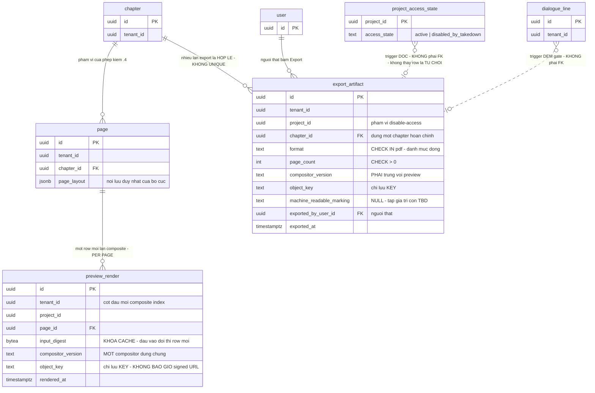

# DB Entity: Preview And Export

Cụm `comic.preview_render` · `comic.export_artifact` tồn tại cùng một chỗ vì **cả hai là output của ĐÚNG MỘT compositor** (`D-32`): preview là composite **read-only trong hệ thống**, export là **thành phẩm rời khỏi hệ thống**, và chúng ⛔ **không được phép là hai renderer**. Cột `compositor_version` **bắt buộc trên cả hai bảng** là hình dạng dữ liệu của chính invariant đó — đặc tả một bảng thôi thì ⛔ không viết được nó.

**Decided in:**

- [ADR-013 — Typeset layer tách khỏi art](../Architecture/ADR-013-Typeset-Layer-Separate-From-Art.md) — `## Decision` điều 8 (`D-32`, **một** compositor dùng chung preview + export), `## Consequences` **hợp đồng #7**, và ranh giới *"preview read-only, ⛔ không mở đường xuất bản"*
- [SDD Comic Studio](../Architecture/SDD-Comic-Studio.md) — §5.1 `F6`, §5.3, và ⭐ **§6.3 `SDD-HG-01`** (nguồn duy nhất của ràng buộc hai human gate)
- [ADR-004 — Object storage & signed URL](../Architecture/ADR-004-Object-Storage-Vendor-And-Signed-URL.md) — điều 2, ⭐ điều 3 (**signed URL ⛔ không bao giờ lưu bền**), điều 6 (key schema), điều 8 (⛔ không `DeleteObject`)
- [ADR-012 — Comic IR: spec là dữ liệu chính, ảnh chỉ là output](../Architecture/ADR-012-Comic-IR-Spec-As-Primary-Data.md) — `D-20`, `D-22` (bố cục **chỉ** sống trong `page.page_layout`)
- [ADR-017 — Chuỗi provenance và MỘT transaction boundary](../Architecture/ADR-017-Provenance-Chain-And-One-Transaction-Boundary.md) — `Q4` (`KC-4`), ⛔ file này **không đặc tả lại**
- [ADR-009 — Modular monolith, ba schema](../Architecture/ADR-009-Modular-Monolith-Three-Schemas.md) · [ADR-010 — Cô lập tenant bằng RLS](../Architecture/ADR-010-Tenant-Isolation-With-RLS.md) `D1`, `D2`, `D3` · [ADR-006 — RLS & tenant context injection](../Architecture/ADR-006-RLS-Tenant-Context-Injection.md) `D2`
- [ADR-015 — Job queue trong Postgres](../Architecture/ADR-015-Job-Queue-In-Postgres.md) — ranh giới *"cái gì đi qua hàng đợi"* (xem `CO-EX-3`)

> [!NOTE]
> **Vì sao file này là file thứ 14** (ngoài 13 file của [SDD §3.4](../Architecture/SDD-Comic-Studio.md)): hai entity `export_artifact` và `preview_render` **có mặt** ở [SDD §3.1](../Architecture/SDD-Comic-Studio.md) nhưng rơi khỏi bảng gom cụm. Quyết định và lý do gom **hai entity vào một file**: [escalations `E16`](../../010-Planning/pm-runs/2026-08-28-phase-2-architecture-design-comic-studio/escalations.md).

---

## ⭐ Quyết định #1 của lô này: `SDD-HG-01.4` ĐƯỢC cưỡng chế THÊM ở tầng DB

[SDD §6.3](../Architecture/SDD-Comic-Studio.md) để `TBD` nguyên văn: *"điều kiện `.4` có được cưỡng chế **thêm** ở tầng DB (trigger/constraint trên `comic.export_artifact`) hay chỉ ở tầng service"*, giao cho **Architect ở lô DB Schema**. [`DB-Entity-Dialogue-And-Gate.md`](./DB-Entity-Dialogue-And-Gate.md) nêu lại và ⛔ **không tự đóng** vì ⛔ không sở hữu bảng. **Lô này sở hữu `comic.export_artifact` ⇒ lô này đóng.**

> **CHỐT: CÓ — một trigger `BEFORE INSERT OR UPDATE` trên `comic.export_artifact` cưỡng chế `SDD-HG-01.4`. ⭐ Trigger và hàm dùng chung ở tầng service gọi ĐÚNG MỘT vị từ SQL `comic.export_is_permitted()` ⇒ ⛔ KHÔNG sinh nguồn sự thật thứ hai.**

### Hai chiều lập luận — trình đủ trước khi chốt

| | **Chỉ tầng service** | **Thêm tầng DB** |
|---|---|---|
| **Điểm mạnh** | [SDD §6.3](../Architecture/SDD-Comic-Studio.md) **đã CHỐT** *"đúng một hàm dùng chung + lint rule chặn mọi đường khác"*. Điều kiện `.4` trải trên `comic.dialogue_line`, `comic.human_gate_state`, `comic.panel` và `public.project_access_state` ⇒ ở tầng service nó đọc **tự nhiên**, thông báo lỗi liệt kê được **page nào thiếu gate nào** (`EF-1`) | ⭐ `R-1`: guardrail phải là thứ **MÁY cưỡng chế được**, vì `bus factor = 1` và ⛔ **không có code review** (`CF-1.2`). Một lint rule là **lời hứa**; một trigger là **cấu trúc**. `M2-4` được đo bằng **sự VẮNG MẶT của đường bypass** — mà `psql`, một migration, một script vận hành hay một code path thứ hai viết sau đều là đường bypass của tầng service |
| **Điểm yếu** | ⭐ Vị từ chỉ tồn tại trong code ứng dụng ⇒ **mọi đường ghi không đi qua nó đều lọt**. [UC-09 `EF-1`](../../020-Requirements/Use-Cases/UC-09-Export-Chapter.md): cái giá của một lần quên kiểm là **một artifact đã ra khỏi hệ thống**, và artifact đã export thì ⛔ **không thu hồi được** | Nguy cơ **hai nguồn sự thật** phải đồng bộ tay — đúng thứ [SDD `## Mục lục` callout](../Architecture/SDD-Comic-Studio.md) gọi là *"nợ chắc chắn vỡ"* với đội một người |

**Cách hoá giải điểm yếu của chiều được chọn — đây mới là nội dung của quyết định:**

| Quy tắc | Nội dung |
|---|---|
| `HG-DB-1` | ⭐ **Đúng MỘT vị từ**: hàm SQL `comic.export_is_permitted(p_tenant_id, p_chapter_id) RETURNS BOOLEAN`. Trigger gọi nó; hàm dùng chung ở tầng service (`SDD §6.3`) **cũng chỉ gọi nó** — thân hàm ở tầng service ⛔ **không được** tự viết lại phép kiểm. ⇒ ⛔ **không có nguồn thứ hai**, chỉ có **hai thời điểm đánh giá cùng một vị từ** |
| `HG-DB-2` | ⭐ **Phân vai rành mạch**: tầng service là **đường người dùng** — thông báo lỗi có danh sách page thiếu gate, và ghi audit lần từ chối. Trigger là **lưới fail-closed**; nó **⛔ KHÔNG BAO GIỜ được nổ trong production**. ⇒ mỗi lần trigger nổ là một **tín hiệu sự cố** (một đường ghi đã bỏ qua tầng service), ⛔ không phải một luồng người dùng |
| `HG-DB-3` | ⚠️ **Lần từ chối phải ghi audit ở transaction RIÊNG.** Trigger `RAISE EXCEPTION` ⇒ **rollback toàn bộ transaction**, kể cả một `public.change_log` row vừa ghi trong cùng transaction ấy. ⇒ audit của [`EF-3`](../../020-Requirements/Use-Cases/UC-09-Export-Chapter.md) (*"từ chối export và ghi lại lần từ chối"*) **phải commit trước/độc lập**, ⛔ không nằm trong transaction bị chặn. Xem `CO-EX-2` |
| `HG-DB-4` | ⛔ **Không thể là `CHECK`.** `CHECK` phải `IMMUTABLE` và ⛔ không đọc được bảng khác; vị từ `.4` đọc bốn bảng ⇒ **trigger là hình thức DB duy nhất khả thi**. Ghi ra đây để run sau ⛔ không đi tìm một `CHECK` không tồn tại |
| `HG-DB-5` | ⭐ **Một migration ⛔ không bịa được một export.** Muốn `INSERT` một `export_artifact` cho chapter chưa qua gate thì phải **tắt trigger** — một hành động **tường minh, đọc được trong diff**. Cùng tinh thần với `human_gate_state`: ghi `PASS` đòi **bịa ra một người có thật** ([`DB-Entity-Dialogue-And-Gate.md`](./DB-Entity-Dialogue-And-Gate.md) lý do #2) |
| `HG-DB-6` | ⛔ **Preview ⛔ KHÔNG có trigger tương ứng.** Sự **bất đối xứng** giữa hai bảng của file này **chính là nội dung** hệ quả #2 của `SDD-HG-01`: *"⚠️ Preview ⛔ KHÔNG bị chặn bởi gate"*. ⚠️ Bất đối xứng **hẹp đúng phạm vi hai human gate** — preview vẫn chịu RLS, và ⛔ không được suy ra rằng preview miễn kiểm `disable-access` |

⚠️ **Race — đọc đúng như `INV-4` của [`DB-Entity-Comic-IR.md`](./DB-Entity-Comic-IR.md)**: vị từ được đánh giá **tại thời điểm ghi**, ⛔ không phải tại thời điểm đọc màn hình. Một lần reset gate commit **sau** khi export đã commit là một **trạng thái mới**, ⛔ không phải một lần bypass — `SDD-HG-01.5` mô tả đúng vòng lặp đó.

---

## ⭐ Quyết định #2 của lô này: `preview_render` là **PER-PAGE**, ⛔ không có row cấp chapter

[findings/architect §3.2](../../010-Planning/pm-runs/2026-08-28-phase-2-architecture-design-comic-studio/findings/architect.md) mô tả `preview_render` là *"composite của một page/**chapter**"*. ⛔ Không đọc thành *"cần một artifact cấp chapter"*.

> **CHỐT: một row = một lần render composite của ĐÚNG MỘT `comic.page`. Preview cả chapter = `N` row page, ⛔ không phải một row thứ hai loại khác.**

**Ba lý do:**

1. ⭐ **Nguồn hẹp nhất nói thẳng điều đó.** AC của [Story-Server-Side-Page-And-Chapter-Preview](../../022-User-Stories/Backlog/Story-Server-Side-Page-And-Chapter-Preview.md): preview cả chapter ⇒ *"hệ thống trả về composite cho **từng trang**… số ảnh trả về = số trang đã có layout"*. Phạm vi chapter là một **phép gộp ở tầng đọc**, ⛔ không phải một artifact.
2. **Một loại row thứ hai làm hỏng chính tính chất cache.** Đổi một page ⇒ phải vô hiệu hoá **cả** row page **và** row chapter — hai đường vô hiệu hoá cho một sự kiện là chỗ sinh **preview cũ hiển thị như mới**, đúng loại lỗi mà [UC-08 `EX-2`](../../020-Requirements/Use-Cases/UC-08-Arrange-Page-And-Preview.md) cảnh báo.
3. **Export ⛔ không tiêu thụ preview_render.** Export chạy compositor **trực tiếp** trên dữ liệu nguồn (`UC-09` bước 6–8); preview là **cache để xem**, ⛔ không phải nguyên liệu của export. ⇒ ⛔ không có yêu cầu nào đòi một đơn vị preview cấp chapter.

⚠️ **Điều kiện đảo quyết định**: xuất hiện yêu cầu *"chia sẻ một link xem cả chapter dưới dạng một file"*. Khi đó thứ được thêm là một **`export_artifact` định dạng mới** (đường thành phẩm), ⛔ **không** phải một `preview_render` cấp chapter.

---

## Bảng

### `comic.preview_render`

Một lần render composite server-side, **read-only**, của một page. ⭐ **Row TỒN TẠI ⇔ một artifact composite đã render XONG.** ⛔ Không có row *"đang render"*.

| Cột | Kiểu | NULL? | Mặc định | Mô tả |
|---|---|:--:|---|---|
| `id` | `UUID` | ⛔ | `gen_random_uuid()` | Khoá chính |
| `tenant_id` | `UUID` | ⛔ | — | `SRS-NFR-01` |
| `project_id` | `UUID` | ⛔ | — | Phạm vi kiểm nhất quán + phạm vi `disable-access` |
| `page_id` | `UUID` | ⛔ | — | Page được render. ⭐ **Đơn vị duy nhất** (quyết định #2) |
| ⭐ `input_digest` | `BYTEA` | ⛔ | ⛔ **không có** | `sha256` của **toàn bộ đầu vào** của lần composite. Là **khoá cache**: đầu vào đổi ⇒ digest đổi ⇒ row cũ ⛔ không còn khớp. `[Kiến trúc suy luận]` — xem `INV-4` |
| ⭐ `compositor_version` | `TEXT` | ⛔ | ⛔ **không có** | ⭐ Phiên bản compositor đã render. **Cột này có mặt trên CẢ HAI bảng** — xem `INV-1` |
| `object_key` | `TEXT` | ⛔ | ⛔ **không có** | Key object storage, dạng `tenant/{tenant_id}/{sha256}` ([ADR-004](../Architecture/ADR-004-Object-Storage-Vendor-And-Signed-URL.md) điều 6). ⛔ **Không bao giờ** là blob; ⛔ **không bao giờ** là signed URL (`INV-6`) |
| `rendered_at` | `TIMESTAMPTZ` | ⛔ | `now()` | Mốc render xong |

- **Khoá chính**: `(id)`
- **Khoá ngoại**: `(tenant_id, page_id, project_id) → comic.page(tenant_id, id, project_id)` **ON DELETE CASCADE**
- ⛔ **Không cột `status`/`is_rendering`/`is_stale`.** *"Đang render"* ⛔ không tồn tại (`INV-3`); *"cũ rồi"* là **giá trị dẫn xuất** từ `input_digest`, ⛔ không materialize — cùng lý do [`DB-Entity-Dialogue-And-Gate.md`](./DB-Entity-Dialogue-And-Gate.md) ⛔ không materialize trạng thái gate mức page.
- ⛔ **Không cột `updated_at`.** Row là **bất biến**: đầu vào đổi ⇒ **row mới**, ⛔ không sửa row cũ.
- ⛔ **Không cột nào của bố cục** (`page_layout`, toạ độ panel…). Bố cục có **nơi lưu duy nhất** là `comic.page.page_layout` (`D-22`).

### `comic.export_artifact`

Thành phẩm đã rời khỏi hệ thống. ⭐ **Append-only** — đây là **bằng chứng**, ⛔ không phải trạng thái.

| Cột | Kiểu | NULL? | Mặc định | Mô tả |
|---|---|:--:|---|---|
| `id` | `UUID` | ⛔ | `gen_random_uuid()` | Khoá chính |
| `tenant_id` | `UUID` | ⛔ | — | `SRS-NFR-01` |
| `project_id` | `UUID` | ⛔ | — | ⭐ Phạm vi `disable-access` — vế thứ hai của vị từ `.4` |
| `chapter_id` | `UUID` | ⛔ | — | ⭐ **Phạm vi export = đúng một chapter hoàn chỉnh** (`M2-5`). ⛔ Không cột phạm vi từng phần — xem bảng `TBD` |
| `format` | `TEXT` | ⛔ | ⛔ **không có** | `CHECK (format IN ('pdf'))` — **danh mục đóng**, xem `INV-7` |
| `page_count` | `INTEGER` | ⛔ | ⛔ **không có** | Số trang trong file đã sinh. `[Kiến trúc suy luận]` — làm AC *"số trang PDF bằng số trang của chapter"* đo được **sau khi** file đã đi khỏi hệ thống |
| ⭐ `compositor_version` | `TEXT` | ⛔ | ⛔ **không có** | ⭐ Xem `INV-1`. Đây là cột làm `D-32` **kiểm chứng được ở tầng dữ liệu** |
| `object_key` | `TEXT` | ⛔ | ⛔ **không có** | Như trên; `NOT NULL` vì row chỉ tồn tại khi file đã sinh xong (`INV-3`) |
| `machine_readable_marking` | `TEXT` | ✅ | `NULL` | Dấu **máy đọc** đã nhúng ở export path. `NULL` = ⛔ chưa nhúng gì. ⚠️ **⛔ Không `CHECK`** — tập giá trị phụ thuộc `SRS-NFR-16` (`T-21`) còn `TBD`. `[Kiến trúc suy luận]`, lý do ở `INV-8` |
| `exported_by_user_id` | `UUID` | ⛔ | ⛔ **không có** | ⭐ **Người thật** đã export. Xuất bản là **hành động của con người**, ⛔ không của một cờ cấu hình |
| `exported_at` | `TIMESTAMPTZ` | ⛔ | `now()` | Mốc export |

- **Khoá chính**: `(id)`
- **Khoá ngoại**: `(tenant_id, chapter_id, project_id) → story.chapter(tenant_id, id, project_id)` — ⚠️ FK chéo schema, đọc theo `INV-8` của [`DB-Entity-Comic-IR.md`](./DB-Entity-Comic-IR.md) (**ràng buộc toàn vẹn**, ⛔ **không phải** một đường truy vấn) · `exported_by_user_id → public."user"(id)`
- ⛔ **Không FK sang `public.project_access_state`.** Trạng thái đó là **điều kiện tại thời điểm ghi**, ⛔ không phải quan hệ toàn vẹn — nó được đọc bởi vị từ `HG-DB-1` và **fail-closed khi ⛔ không thấy row** (`INV-2`).
- ⛔ **Không cột `status`.** Export thất bại ⇒ ⛔ **không row nào tồn tại** (`INV-3`) — đúng AC *"⛔ không tồn tại file output không hoàn chỉnh được đánh dấu **thành công**"*.
- ⛔ **Không cột `force`/`skip_gates`/`admin_override`/`is_draft_export` dưới bất kỳ tên nào** (`INV-5`).
- ⛔ **`AF-2` của [UC-09](../../020-Requirements/Use-Cases/UC-09-Export-Chapter.md) (export hồ sơ tenant khi KILL) ⛔ KHÔNG phải một row của bảng này.** Nó *"dùng chung cơ chế"* ở nghĩa đường compositor/tải file, nhưng nội dung là `public.change_log` + `public.field_provenance` của **cả tenant** — ⛔ không phải composite của một chapter. Ghi ra đây để ⛔ không ai nới `chapter_id` thành nullable vì `AF-2`.

---

## Index

> ⚠️ **`tenant_id` PHẢI là cột ĐẦU TIÊN của MỌI composite index** (`SRS-NFR-01`, [ADR-010 `D2`](../Architecture/ADR-010-Tenant-Isolation-With-RLS.md)).

| Bảng | Index | Kiểu | Phục vụ truy vấn |
|---|---|---|---|
| `comic.preview_render` | `(id)` | PK | — |
| `comic.preview_render` | `(tenant_id, page_id, input_digest)` | UNIQUE | ⭐ **Tra cache**: *"page này, đúng trạng thái đầu vào này, đã render chưa"* — một lần quét, và chặn ghi trùng |
| `comic.preview_render` | `(tenant_id, page_id, rendered_at DESC)` | BTREE | *"Bản preview mới nhất của page này"* — đường đọc của màn hình preview |
| `comic.export_artifact` | `(id)` | PK | — |
| `comic.export_artifact` | `(tenant_id, chapter_id, exported_at DESC)` | BTREE | ⭐ **Lịch sử export của một chapter**, mới nhất trước |
| `comic.export_artifact` | `(tenant_id, project_id)` | BTREE | *"Project này đã từng export ra những gì"* — đường tra khi có takedown |

> [!WARNING]
> ⛔ **KHÔNG UNIQUE trên `(tenant_id, chapter_id)` của `comic.export_artifact`.** Một chapter được export **nhiều lần** là hợp lệ và là chuyện thường: sửa thoại → re-gate → export lại. Một UNIQUE ở đây biến bảng bằng chứng thành bảng trạng thái và **xoá mất lịch sử** — cùng loại sai lầm mà hợp đồng #8 của [ADR-012](../Architecture/ADR-012-Comic-IR-Spec-As-Primary-Data.md) cấm khi nói *"⛔ không giả định 1 spec = 1 ảnh"*.

---

## Constraint & Invariant

| ID | Ràng buộc | Cưỡng chế bằng | Neo |
|---|---|---|---|
| `INV-1` | ⭐⭐ **MỘT compositor, kiểm chứng được ở tầng dữ liệu**: `compositor_version` `NOT NULL` trên **cả hai** bảng, và giá trị đến từ **cùng một hằng số của cùng một module** | `NOT NULL` + test CI: dựng một page, chạy **cả** preview **và** export, rồi khẳng định hai row mang **cùng** `compositor_version`. ⛔ Hai giá trị khác nhau ⇒ đã có renderer thứ hai ⇒ CI đỏ | `D-32` · hợp đồng #7 của [ADR-013](../Architecture/ADR-013-Typeset-Layer-Separate-From-Art.md) · `CF-9.1` |
| `INV-2` | ⭐⭐ **⛔ Không `export_artifact` nào được sinh khi điều kiện `SDD-HG-01.4` ⛔ không thoả** | Trigger `BEFORE INSERT OR UPDATE` gọi `comic.export_is_permitted()` — xem khối *"Cơ chế cưỡng chế `SDD-HG-01.4`"* | ⭐ [SDD §6.3 `SDD-HG-01.4`](../Architecture/SDD-Comic-Studio.md) — **nguồn duy nhất**, ⛔ file này không đặc tả lại điều kiện |
| `INV-3` | ⭐ **Row tồn tại ⇔ artifact đã hoàn tất.** ⛔ Không trạng thái *"đang render"*, ⛔ không *"file dở"* | ⛔ Vắng mặt cột `status` + `object_key NOT NULL` trên cả hai bảng ⇒ ⛔ **không biểu diễn được** một row chưa có artifact | `EX-7` của [UC-08](../../020-Requirements/Use-Cases/UC-08-Arrange-Page-And-Preview.md) (*⛔ không treo "đang render" vĩnh viễn*) · `EF-5` của [UC-09](../../020-Requirements/Use-Cases/UC-09-Export-Chapter.md) |
| `INV-4` | **Một preview cũ ⛔ không được hiển thị như bản mới** | `input_digest` là **khoá cache** + UNIQUE `(tenant_id, page_id, input_digest)`: đầu vào đổi ⇒ ⛔ không tìm thấy row ⇒ **buộc render lại**. ⛔ Không cột `is_stale` để quên cập nhật | `[Kiến trúc suy luận]` · tinh thần `EX-2` của [UC-08](../../020-Requirements/Use-Cases/UC-08-Arrange-Page-And-Preview.md) |
| `INV-5` | ⛔ **⛔ Không tồn tại cột/cờ nào mở đường xuất bản khi gate chưa `PASS`** — ⛔ không `force`, ⛔ không `skip_gates`, ⛔ không `admin_override` | ⛔ Vắng mặt cột + review DDL + `INV-2` | `SDD-HG-01.4` · `M2-4` |
| `INV-6` | ⭐ **DB chỉ lưu `key`, ⛔ TUYỆT ĐỐI không lưu signed URL** | `CHECK (object_key LIKE 'tenant/' \|\| tenant_id::text \|\| '/%')` trên **cả hai** bảng — một URL đã ký ⛔ không khớp tiền tố này. ⛔ Không cột binary (test CI `information_schema.columns`) | ⭐ [ADR-004](../Architecture/ADR-004-Object-Storage-Vendor-And-Signed-URL.md) điều 3 + điều 6 · `B-4` |
| `INV-7` | **`format` là danh mục ĐÓNG** | `CHECK (format IN ('pdf'))`. ⚠️ **Một giá trị là kết quả tra nguồn, ⛔ không phải thiếu sót**: `H4` = `🟡 PDF` ở **MVP2**; CBZ/webtoon là **MVP3, ⛔ NGOÀI horizon**. `EF-2` đòi hệ thống **từ chối** định dạng chưa có ⇒ ⛔ không được để `TEXT` tự do. Thêm giá trị = migration **cộng thêm**, ⛔ không đụng row cũ | `SRS-FR-42` · `M2-5` · `EF-2`, `AF-1` của [UC-09](../../020-Requirements/Use-Cases/UC-09-Export-Chapter.md) |
| `INV-8` | **Dấu máy đọc được GHI LẠI, ⛔ không được suy đoán** | `machine_readable_marking` ghi **cách đánh dấu đã áp dụng tại thời điểm export**. ⭐ Lý do cột có mặt sớm dù `TBD`: nó ⛔ **không backfill được** — một file đã giao đi thì ⛔ không ai biết lại được trong đó có gì (`R-4`). ⚠️ ⛔ **Không `CHECK`**, ⛔ không tự gán tập giá trị khi `SRS-NFR-16` còn `TBD` (`R-5`) | `SRS-NFR-16` (`T-21`) · `AF-3` của [UC-09](../../020-Requirements/Use-Cases/UC-09-Export-Chapter.md) · `SRS-FR-39` |
| `INV-9` | **`page_count > 0`** — ⛔ không tồn tại export rỗng | `CHECK (page_count > 0)` | `M2-5` (*"1 chapter **hoàn chỉnh**"*) |
| `INV-10` | ⭐ **`comic.export_artifact` là append-only** | ⛔ `REVOKE UPDATE, DELETE` khỏi mọi role ứng dụng (xem mục RLS). Bằng chứng bị sửa được ⛔ không phải bằng chứng | `SRS-NFR-13` · `KC-2` |
| `INV-11` | ⛔ **Không TTL/eviction do ứng dụng** trên object của hai bảng này | Credential của `api`/`worker` ⛔ **không có `DeleteObject`** ([ADR-004](../Architecture/ADR-004-Object-Storage-Vendor-And-Signed-URL.md) điều 8) ⇒ xoá row mà ⛔ không xoá được object là tạo **object mồ côi** ⇒ ⛔ không cấp `DELETE` cho role ứng dụng. Chính sách lưu giữ = `TBD` | [ADR-004](../Architecture/ADR-004-Object-Storage-Vendor-And-Signed-URL.md) điều 8 + `Consequences` #5 (*rác tích luỹ **có chủ ý***) |
| `INV-12` | **Artifact + `change_log` của lần export commit CÙNG một transaction** | ⭐ Nguồn duy nhất: [ADR-017 `Q4`](../Architecture/ADR-017-Provenance-Chain-And-One-Transaction-Boundary.md). ⛔ File này **không đặc tả lại `KC-4`**. ⚠️ Đọc kèm `HG-DB-3`: điều này áp cho lần export **thành công**; lần **bị từ chối** ⛔ không được nằm trong transaction đó | `UC-09` bước 9 · `KC-2`, `KC-4` |

### ⭐ Cơ chế cưỡng chế `SDD-HG-01.4`

```sql
CREATE FUNCTION comic.export_is_permitted(p_tenant_id UUID, p_chapter_id UUID)
  RETURNS BOOLEAN
  LANGUAGE sql
  STABLE
  SECURITY INVOKER
AS $$ /* ba vế, xem bảng dưới */ $$;

CREATE FUNCTION comic.trg_export_artifact_gate() RETURNS TRIGGER
  LANGUAGE plpgsql
  SECURITY INVOKER
AS $$
BEGIN
  IF NOT comic.export_is_permitted(NEW.tenant_id, NEW.chapter_id) THEN
    RAISE EXCEPTION 'SDD-HG-01.4: export bi chan cho chapter %', NEW.chapter_id
      USING ERRCODE = 'check_violation';
  END IF;
  RETURN NEW;
END $$;

CREATE TRIGGER export_artifact_gate_guard
  BEFORE INSERT OR UPDATE ON comic.export_artifact
  FOR EACH ROW EXECUTE FUNCTION comic.trg_export_artifact_gate();
```

⚠️ **Ba vế của vị từ — ⛔ chỉ ghi HÌNH DẠNG truy vấn, ⛔ KHÔNG đặc tả lại điều kiện** (nguồn duy nhất là [SDD §6.3](../Architecture/SDD-Comic-Studio.md)):

| Vế | Hình dạng | Neo |
|---|---|---|
| **(a)** hai gate | Đếm `comic.dialogue_line` trong phạm vi chapter **so với** đếm row `comic.human_gate_state` của cùng phạm vi cho **từng** `gate_kind`. Hai con số lệch ⇒ **fail-closed**. Đường join `dialogue_line → panel → page → chapter` do các UNIQUE index ở [`DB-Entity-Comic-IR.md`](./DB-Entity-Comic-IR.md) và [`DB-Entity-Dialogue-And-Gate.md`](./DB-Entity-Dialogue-And-Gate.md) phục vụ | `SDD-HG-01.4` |
| **(b)** ⭐ gate 2 còn hiệu lực | ⛔ **Không tồn tại** row gate `dialogue_condensation` nào có `text_budget_at_pass <> comic.panel.text_budget`. ⭐ Đây chính là chỗ dùng **vật liệu** mà [`DB-Entity-Dialogue-And-Gate.md`](./DB-Entity-Dialogue-And-Gate.md) `INV-6` đã đặt sẵn cho lô này: nó biến *"một lần reset `T1` đã trượt"* từ **thứ CI dò ra muộn** thành **thứ chặn được ngay tại đường export** | `INV-6` của [`DB-Entity-Dialogue-And-Gate.md`](./DB-Entity-Dialogue-And-Gate.md) · `SDD-HG-01.5` |
| **(c)** disable-access | `public.project_access_state` của `project_id` phải ở `'active'`. ⭐ **⛔ Không thấy row ⇒ TỪ CHỐI** — ⛔ tuyệt đối không đọc *"thiếu dòng"* thành `'active'`, đúng cảnh báo `INV-PAS-5` của [`DB-Entity-Compliance-And-Takedown.md`](./DB-Entity-Compliance-And-Takedown.md) | `D-69` · `EF-3` của [UC-09](../../020-Requirements/Use-Cases/UC-09-Export-Chapter.md) |

| Điểm | Nội dung |
|---|---|
| **`SECURITY INVOKER`** | ⭐ Vị từ **chịu RLS** như mọi câu query khác ⇒ ⛔ không có đường nào nó đếm gate của tenant khác. Cùng khuôn với trigger đếm nhân vật của [`DB-Entity-Comic-IR.md`](./DB-Entity-Comic-IR.md). ⛔ **Tuyệt đối không `SECURITY DEFINER`** — đó là `BYPASSRLS` trá hình ([ADR-006 `D4.3`](../Architecture/ADR-006-RLS-Tenant-Context-Injection.md)) |
| **`STABLE`, ⛔ không `IMMUTABLE`** | Vị từ đọc bảng ⇒ ⛔ không `IMMUTABLE` ⇒ ⛔ không dùng được trong `CHECK` (`HG-DB-4`) |
| **`BEFORE INSERT OR UPDATE`** | `UPDATE` cũng bị kiểm để ⛔ không ai *"đổi `chapter_id` của một export cũ"* thành một đường lách. Cùng với `INV-10` (`REVOKE UPDATE`) thì đây là **hai lớp cho một lỗ** — có chủ ý |
| **Test CI bắt buộc** | (1) `INSERT` thẳng bằng `psql` **bỏ qua tầng service** cho chapter có **đúng một** `dialogue_line` gate 2 `OPEN` ⇒ **phải bị từ chối**; (2) đổi diện tích panel của chapter đã PASS ⇒ vế (b) **phải** làm vị từ `false`; (3) xoá row `project_access_state` ⇒ **phải** từ chối. ⚠️ Test (1) là **đúng thứ mà tầng service ⛔ không kiểm được** |
| ⛔ **Không được làm** | ⛔ Không viết lại vị từ trong code ứng dụng (`HG-DB-1`); ⛔ không thêm tham số *"bỏ qua"* vào chữ ký hàm; ⛔ không `ALTER TABLE … DISABLE TRIGGER` trong bất kỳ migration nào; ⛔ không nới `RAISE EXCEPTION` thành `RAISE WARNING` |

---

## Ranh giới với các lô khác

| ID | Hợp đồng | Chủ sở hữu |
|---|---|---|
| `CO-EX-1` | ✅ **ĐÃ ĐƯỢC PIN.** Role thực thi `INSERT` vào `comic.export_artifact` **phải có `SELECT`** trên `public.project_access_state` (vế (c) chạy `SECURITY INVOKER`) — grant `GRANT SELECT ON public.project_access_state` được pin ở [`DB-Entity-Compliance-And-Takedown.md`](./DB-Entity-Compliance-And-Takedown.md), mục `CO-EX-1`. ⛔ Lô này ⛔ không lặp lại chi tiết grant | Lô sở hữu `DB-Entity-Compliance-And-Takedown.md` + `Spec-Security-*` |
| `CO-EX-2` | Lần export **bị từ chối** (`EF-1`, `EF-3`) cần một loại hành động trong `public.change_log`, ghi ở **transaction riêng** (`HG-DB-3`). ⛔ Lô này ⛔ không sở hữu `public.change_log` | Lô `DB-Entity-Provenance-And-Usage.md` + lô API |
| `CO-EX-3` | ⛔ **Lô này ⛔ không giả định export/preview đi qua hàng đợi.** [`DB-Entity-Job-Queue.md`](./DB-Entity-Job-Queue.md) chốt danh mục `job_type` **loại tường minh** *"Export chapter · preview render"*. Hình dạng hai bảng này **⛔ không đổi** dù compositor chạy trong request hay trong worker — cái đổi chỉ là **grant** (xem mục RLS). Nếu có nguồn nói export là async ⇒ thêm giá trị `job_type` **ở file đó**, ⛔ không ở đây | Lô `DB-Entity-Job-Queue.md` |
| `CO-EX-4` | Tiền ảnh chính xác của `input_digest` (thứ tự trường, cách canonical hoá) do lô **compositor/API** chốt. Lô này chốt **sự tồn tại + tính chất**: nó phải phủ `page_layout`, `object_key` của generation đã duyệt, toàn bộ `comic.bubble` của các panel, và `compositor_version` | Lô API + [`DB-Entity-Typeset-Layer.md`](./DB-Entity-Typeset-Layer.md) |

---

## `TBD` còn lại — ⛔ không được bịa

| Khoảng trống | Ai đóng | Khi nào |
|---|---|---|
| ~~`SDD-HG-01.4` có cưỡng chế thêm ở tầng DB không~~ ⇒ ✅ **ĐÃ ĐÓNG bởi lô này**: **CÓ**, trigger + vị từ dùng chung (`HG-DB-1`…`HG-DB-6`). Đây là hàng `P-2` của [SDD §9](../Architecture/SDD-Comic-Studio.md) và hàng tương ứng ở [`DB-Entity-Dialogue-And-Gate.md`](./DB-Entity-Dialogue-And-Gate.md) | — (đã đóng) | — |
| **Export TỪNG PHẦN** — `AF-4` của [UC-09](../../020-Requirements/Use-Cases/UC-09-Export-Chapter.md) ghi thẳng *"repo KHÔNG trả lời"*. ⇒ lô này giữ `chapter_id NOT NULL` và ⛔ **không** thêm cột phạm vi. Nếu đóng theo hướng *"được phép"*, việc phải làm là một bảng liên kết `export_artifact_page` **cộng thêm**, ⛔ không nới `chapter_id` | **Founder** (PM mang câu hỏi lên) | Trước khi Story export vào Active Sprint |
| **Tập giá trị của `machine_readable_marking`** — phụ thuộc `SRS-NFR-16` (`T-21`: SynthID của provider có thoả nghĩa vụ không) và phạm vi khoản 4 Điều 11 | **Luật sư** → PM → Architect | Trước mốc tuân thủ `~01/03/2027` (`GP-4`) |
| **Chính sách lưu giữ `comic.preview_render`** (row + object). ⛔ Không giải bằng `DELETE` ở tầng ứng dụng (`INV-11`) ⇒ phải là **bucket lifecycle policy**. ⛔ **Tuyệt đối không** phát minh một key prefix thứ hai — key schema đã CHỐT ở [ADR-004](../Architecture/ADR-004-Object-Storage-Vendor-And-Signed-URL.md) điều 6 | **DevOps + Architect** | Khi có số đo dung lượng thật (sau MVP2) |
| **Thời hạn signed URL** khi phát URL đọc `object_key` của hai bảng này ⇒ ⛔ không quyết ở đây, dùng **đúng một** hằng số của [ADR-004](../Architecture/ADR-004-Object-Storage-Vendor-And-Signed-URL.md) điều 4 (bản thân con số vẫn là `TBD` theo `SRS` §5.2) | **Founder + dev** | Theo [ADR-004](../Architecture/ADR-004-Object-Storage-Vendor-And-Signed-URL.md) |

---

## RLS Policy

> ⭐ **Cơ chế là nguồn duy nhất ở [ADR-006](../Architecture/ADR-006-RLS-Tenant-Context-Injection.md)** (`D1`, `D2`). ⛔ File này không quyết lại.

```sql
ALTER TABLE comic.preview_render  ENABLE ROW LEVEL SECURITY;
ALTER TABLE comic.preview_render  FORCE  ROW LEVEL SECURITY;
ALTER TABLE comic.export_artifact ENABLE ROW LEVEL SECURITY;
ALTER TABLE comic.export_artifact FORCE  ROW LEVEL SECURITY;

CREATE POLICY p_preview_render_tenant ON comic.preview_render
  USING      (tenant_id = public.current_tenant_id())
  WITH CHECK (tenant_id = public.current_tenant_id());
```

Lặp **y hệt** cho `comic.export_artifact`.

| Role | `comic.preview_render` | `comic.export_artifact` |
|---|---|---|
| `app_api` | `SELECT`, `INSERT`. ⛔ **Không `UPDATE`** (row bất biến), ⛔ **không `DELETE`** (`INV-11`) | `SELECT`, `INSERT`. ⛔ **Không `UPDATE`, ⛔ không `DELETE`** (`INV-10`) |
| `app_worker` | ⛔ **Không quyền nào** — ⛔ không nguồn nào nói preview chạy trong worker (`CO-EX-3`) | ⛔ **Không quyền nào** — cùng lý do |
| `app_public_intake` | ⛔ Không quyền nào | ⛔ Không quyền nào |
| owner / migration | DDL | DDL. ⚠️ ⛔ **Không migration nào được `INSERT`** — và ⛔ không làm được nếu ⛔ không tắt trigger (`HG-DB-5`) |

⚠️ ⭐ **Đọc kỹ hàng `app_worker`**: ⛔ **không** cấp quyền *"cho chắc"*. Ngày có nguồn nói export chạy async, việc phải làm là **một migration tường minh** cấp `INSERT` cho `app_worker` **cùng lượt** với việc thêm giá trị `job_type` (`CO-EX-3`) — và trigger `INV-2` vẫn kiểm y nguyên, vì nó nằm ở **bảng**, ⛔ không ở đường gọi.

⚠️ **RLS là lớp phòng thủ THỨ HAI** — code vẫn phải viết `WHERE tenant_id = ...` (`SRS-NFR-01`). ⛔ **Tuyệt đối không `BYPASSRLS`** ([ADR-006 `D4.3`](../Architecture/ADR-006-RLS-Tenant-Context-Injection.md)).

---

## ER Diagram



**Chú giải**: `preview_render`, `export_artifact`, `page`, `dialogue_line` thuộc schema **`comic`**; `chapter` thuộc **`story`**; `user` và `project_access_state` thuộc **`public`** (Mermaid ⛔ không nhận dấu chấm trong tên entity). ⭐ **Hai cạnh nét đứt ⛔ KHÔNG phải khoá ngoại** — chúng là thứ **trigger `INV-2` đọc tại thời điểm ghi**, ⛔ không phải quan hệ toàn vẹn. ⭐ **⛔ Không có cạnh nào từ `preview_render` tới gate** — đó là quyết định `HG-DB-6`, ⛔ không phải thiếu sót.

---

## Tài liệu tham khảo

- [SDD Comic Studio](../Architecture/SDD-Comic-Studio.md) — §3.1, §5.1 `F6`, §5.3, ⭐ **§6.3 `SDD-HG-01`** (nguồn duy nhất), §9 hàng `P-2`
- [ADR-013 — Typeset Layer Separate From Art](../Architecture/ADR-013-Typeset-Layer-Separate-From-Art.md) `D-32` · [ADR-004 — Object Storage And Signed URL](../Architecture/ADR-004-Object-Storage-Vendor-And-Signed-URL.md) · [ADR-012 — Comic IR Spec As Primary Data](../Architecture/ADR-012-Comic-IR-Spec-As-Primary-Data.md) · [ADR-017 — Provenance Chain And One Transaction Boundary](../Architecture/ADR-017-Provenance-Chain-And-One-Transaction-Boundary.md) · [ADR-015 — Job Queue In Postgres](../Architecture/ADR-015-Job-Queue-In-Postgres.md) · [ADR-009 — Modular Monolith Three Schemas](../Architecture/ADR-009-Modular-Monolith-Three-Schemas.md) · [ADR-010 — Tenant Isolation With RLS](../Architecture/ADR-010-Tenant-Isolation-With-RLS.md) · [ADR-006 — RLS Tenant Context Injection](../Architecture/ADR-006-RLS-Tenant-Context-Injection.md)
- [DB-Entity-Dialogue-And-Gate.md](./DB-Entity-Dialogue-And-Gate.md) · [DB-Entity-Comic-IR.md](./DB-Entity-Comic-IR.md) · [DB-Entity-Typeset-Layer.md](./DB-Entity-Typeset-Layer.md) · [DB-Entity-Compliance-And-Takedown.md](./DB-Entity-Compliance-And-Takedown.md) · [DB-Entity-Job-Queue.md](./DB-Entity-Job-Queue.md) · [DB-Entity-Generation.md](./DB-Entity-Generation.md)
- [UC-09 — Export Chapter](../../020-Requirements/Use-Cases/UC-09-Export-Chapter.md) bước 2–3, 6–10, `AF-1`, `AF-3`, `AF-4`, `EF-1`, `EF-3`, `EF-5` · [UC-08 — Arrange Page And Preview](../../020-Requirements/Use-Cases/UC-08-Arrange-Page-And-Preview.md) bước 10–13, `AF-3`, `EX-7`
- [Story-Server-Side-Page-And-Chapter-Preview](../../022-User-Stories/Backlog/Story-Server-Side-Page-And-Chapter-Preview.md) · [Story-Export-Chapter-To-PDF-CBZ-Webtoon](../../022-User-Stories/Backlog/Story-Export-Chapter-To-PDF-CBZ-Webtoon.md)
- [SRS Comic Studio](../../020-Requirements/SRS-Comic-Studio.md) — `SRS-FR-11`, `SRS-FR-14`, `SRS-FR-16`, `SRS-FR-39`, `SRS-FR-42`, `SRS-NFR-01`, `SRS-NFR-13`, `SRS-NFR-16`
- [escalations `E16`](../../010-Planning/pm-runs/2026-08-28-phase-2-architecture-design-comic-studio/escalations.md) — lý do file thứ 14 tồn tại

---

_Created by System Architect — lô L26, Phase 2._
_Author: trisjr_
