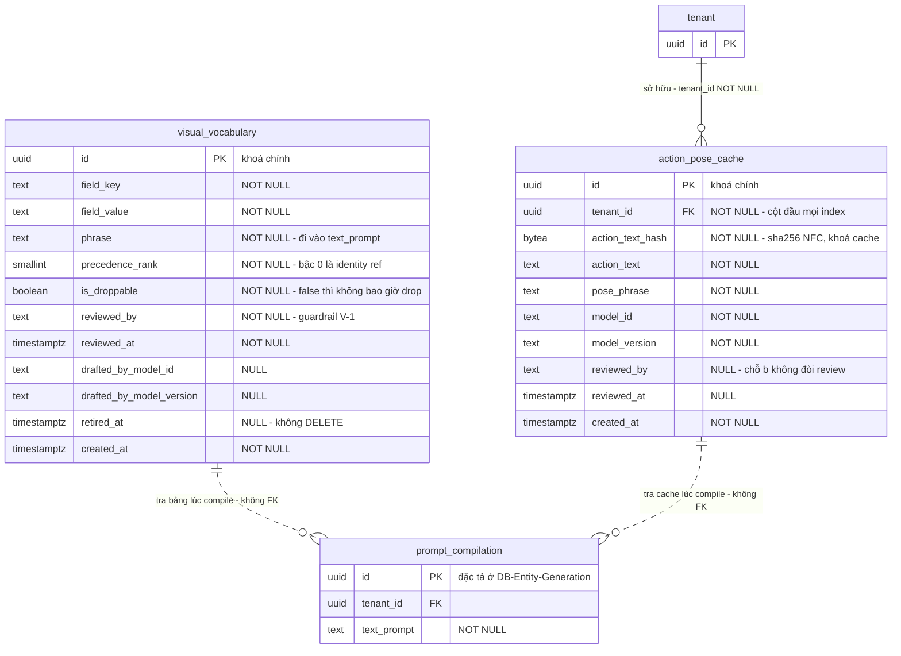

# DB Entity: Prompt Vocabulary

Đặc tả cặp bảng `generation.visual_vocabulary` + `generation.action_pose_cache` — **hai chỗ duy nhất** mà LLM được phép xuất hiện trong Visual Prompt Compiler, và **cả hai đều là DỮ LIỆU ĐÃ CACHE**, ⛔ không phải lời gọi ở runtime.

> [!CAUTION]
> ⛔⛔ **KHÔNG LLM Ở COMPILER RUNTIME (`D-34`, `SRS-FR-17`).**
> Compiler là **code**: tra bảng `field value → cụm từ`, sắp thứ tự, dedup, xử lý xung đột theo **precedence ladder**, thực thi **constraint budget**, ghi **drop log**.
> Phép đo đã ký: compiler **sinh được prompt khi network bị cắt** ([Story-Deterministic-Visual-Prompt-Compiler](../../022-User-Stories/Backlog/Story-Deterministic-Visual-Prompt-Compiler.md) AC-2).
> ⇒ **Hai bảng trong file này phải đọc CÙNG NHAU**, vì tách ra thì mất chính lý do tồn tại của chúng: chúng biến *"cần LLM"* thành *"tra một dòng trong DB"*.

## Decided in

| Nguồn | Nội dung kế thừa |
|---|---|
| [ADR-014 — Deterministic Prompt Compiler And Best-Of-N](../Architecture/ADR-014-Deterministic-Prompt-Compiler-And-Best-Of-N.md) | `Context` (a) ⛔ không LLM ở runtime · `Decision` điều 1, 2, 4 · `Consequences` hợp đồng #1, #2 |
| [ADR-008 — LLM Provider And Usage Boundaries](../Architecture/ADR-008-LLM-Provider-And-Usage-Boundaries.md) | Ranh giới nơi LLM được gọi |
| [ADR-006 — RLS Tenant Context Injection](../Architecture/ADR-006-RLS-Tenant-Context-Injection.md) | `D5` connection pool · `D7` role owner cho migration |
| [ADR-013 — Typeset Layer Separate From Art](../Architecture/ADR-013-Typeset-Layer-Separate-From-Art.md) | `Decision` điều 6 — chuẩn hoá **NFC** ngay tại biên ingest |
| [SDD §3.2, §4.1 `B-4`, §4.2](../Architecture/SDD-Comic-Studio.md) | Schema `generation` · ranh giới ảnh ↔ DB · invariant tầng DB |
| Requirement gốc | `SRS-FR-17`, `SRS-FR-18`, `SRS-FR-19`, `SRS-FR-27`, `SRS-NFR-01`, `SRS-NFR-12` |
| Story | [Story-Deterministic-Visual-Prompt-Compiler](../../022-User-Stories/Backlog/Story-Deterministic-Visual-Prompt-Compiler.md) |

---

## Bảng

### `generation.visual_vocabulary`

Chỗ LLM **(a)**: soạn từ vựng `field value → cụm từ` **OFFLINE một lần** → ⭐ **người review** → lưu vào bảng. Compiler **đọc bảng**, ⛔ không gọi model.

| Cột | Kiểu | NULL? | Mặc định | Mô tả |
|---|---|:--:|---|---|
| `id` | `UUID` | ⛔ | `gen_random_uuid()` | Khoá chính |
| `field_key` | `TEXT` | ⛔ | — | Tên field của panel spec cần tra (ví dụ `camera_angle`, `lighting`) |
| `field_value` | `TEXT` | ⛔ | — | Giá trị rời rạc của field đó |
| `phrase` | `TEXT` | ⛔ | — | ⭐ Cụm từ sẽ đi vào `text_prompt`. Đây là output duy nhất mà compiler dùng |
| `precedence_rank` | `SMALLINT` | ⛔ | — | Bậc trong **precedence ladder**. Số nhỏ = giữ lâu hơn khi constraint budget vượt |
| ⭐ `is_droppable` | `BOOLEAN` | ⛔ | `true` | ⛔ `false` cho identity reference — ⭐ **identity refs KHÔNG BAO GIỜ bị drop** (`D-34`) |
| `reviewed_by` | `TEXT` | ⛔ | — | ⭐ Người đã duyệt. ⛔ **`NOT NULL` là guardrail**, xem `V-1` |
| `reviewed_at` | `TIMESTAMPTZ` | ⛔ | — | Thời điểm duyệt |
| `drafted_by_model_id` | `TEXT` | ✅ | `NULL` | Model đã soạn bản nháp offline. `NULL` = người tự viết |
| `drafted_by_model_version` | `TEXT` | ✅ | `NULL` | Ghi **riêng biệt**, ⛔ không ghi đè — cùng kỷ luật `SRS-FR-23` |
| `retired_at` | `TIMESTAMPTZ` | ✅ | `NULL` | Thời điểm ngừng dùng. ⛔ **Không `DELETE`**, xem `V-4` |
| `created_at` | `TIMESTAMPTZ` | ⛔ | `now()` | |

- **PK**: `(id)`
- **FK**: ⛔ **không có** — đây là dữ liệu tham chiếu do operator soạn, ⛔ không dẫn xuất từ dữ liệu nghiệp vụ của tenant nào
- **UNIQUE**: `(field_key, field_value)` `WHERE retired_at IS NULL` — ⭐ đúng **một** cụm từ đang hiệu lực cho một cặp `field_key`/`field_value`; ⛔ không có đường cho compiler phải "chọn giữa hai entry"

> [!IMPORTANT]
> ⭐ **Bảng này ⛔ KHÔNG có `tenant_id` — và đó là quyết định có lập luận, ⛔ không phải sự bỏ sót.**
> `SRS-NFR-01` bắt `tenant_id NOT NULL` trên **mọi bảng nghiệp vụ**. Bảng này ⛔ **không phải bảng nghiệp vụ**:
> 1. Nội dung của nó do **operator soạn offline** và **người duyệt** (`D-36`(a)), ⛔ **không** sinh ra từ input của tenant nào.
> 2. Nó là **điều kiện để compiler xác định**: cùng một spec phải cho ra prompt **giống hệt byte-for-byte**. Từ vựng khác nhau theo tenant ⇒ tính xác định chỉ còn đúng **trong phạm vi một tenant** — làm hỏng chính phép đo của `SRS-FR-17`.
> 3. Nó ⛔ **không chứa** dữ liệu của bất kỳ tenant nào ⇒ ⛔ không có gì để rò rỉ.
> ⇒ Thay cho RLS, guardrail của bảng này là **quyền ghi** (`V-1`, `V-2`). Xem [RLS Policy](#rls-policy).
>
> ⚠️ ⭐ **Hệ quả cưỡng chế phải xử lý, ⛔ không được bỏ lửng**: `SRS-NFR-01` được kiểm bằng một **test CI toàn cục** *("`tenant_id` trên mọi bảng nghiệp vụ")*. Bảng này sẽ làm test đó **ĐỎ**.
> ⇒ Việc phải làm: **whitelist `generation.visual_vocabulary` trong chính test đó**, và ⭐ **whitelist phải mang comment trỏ về mục này**. ⛔ **Tuyệt đối không** giải bằng cách nới test thành *"tenant_id trên hầu hết bảng"* — `SRS-NFR-01` là thuộc tính **toàn cục**: *"`tenant_id` trên 8/10 bảng = **vẫn rò rỉ**"* ([SDD §4.2](../Architecture/SDD-Comic-Studio.md)). ⛔ Một whitelist có tên và có lý do là an toàn; một test bị nới thì ⛔ không.
> ⚠️ Whitelist này có **đúng một** phần tử ở horizon MVP0–MVP2. Thêm phần tử thứ hai phải qua **ADR**, ⛔ không qua PR sửa test.

### `generation.action_pose_cache`

Chỗ LLM **(b)**: dịch **action tự do → cụm pose** khi từ vựng chưa có entry. ⭐ **Cache theo hash của action text**, ⛔ không phải theo panel/spec id.

| Cột | Kiểu | NULL? | Mặc định | Mô tả |
|---|---|:--:|---|---|
| `id` | `UUID` | ⛔ | `gen_random_uuid()` | Khoá chính |
| ⭐ `tenant_id` | `UUID` | ⛔ | — | Chủ sở hữu entry cache. Xem [Vì sao cache có `tenant_id`](#vì-sao-cache-có-tenant_id-còn-từ-vựng-thì-không) |
| ⭐ `action_text_hash` | `BYTEA` | ⛔ | — | ⭐ **Khoá cache**: `sha256` của `action_text` đã chuẩn hoá **NFC**. ⛔ **Không** hash panel id, ⛔ không hash spec id |
| `action_text` | `TEXT` | ⛔ | — | Nguyên văn action đã chuẩn hoá NFC — giữ để người đọc lại được entry mà model đã dịch |
| `pose_phrase` | `TEXT` | ⛔ | — | Cụm pose sẽ đi vào `text_prompt` |
| `model_id` | `TEXT` | ⛔ | — | Model **thực sự được gọi** khi fill entry này |
| `model_version` | `TEXT` | ⛔ | — | Ghi **riêng biệt**, ⛔ không ghi đè khi provider trả version khác dưới cùng `model_id` |
| `reviewed_by` | `TEXT` | ✅ | `NULL` | ⚠️ Nullable **có chủ đích** — `D-36`(b) ⛔ **không** đòi người review cho chỗ (b), khác hẳn chỗ (a) |
| `reviewed_at` | `TIMESTAMPTZ` | ✅ | `NULL` | |
| `created_at` | `TIMESTAMPTZ` | ⛔ | `now()` | Thời điểm fill entry |

- **PK**: `(id)`
- **FK**: `tenant_id → public.tenant(id)` `ON DELETE CASCADE` (`SRS-NFR-05`)
- **UNIQUE**: ⭐ `(tenant_id, action_text_hash)` — chính là khoá cache, và `tenant_id` đứng **đầu**

> [!CAUTION]
> ⛔⛔ **Sự VẮNG MẶT của hai cột là ràng buộc, ⛔ không phải sự quên.**
> Bảng này ⛔ **KHÔNG có** `panel_id` và ⛔ **KHÔNG có** `generation_id`.
> Hợp đồng #2 của [ADR-014](../Architecture/ADR-014-Deterministic-Prompt-Compiler-And-Best-Of-N.md) chốt: khoá là **hash của action text**, ⛔ **không phải panel/spec id** — mục đích là để **hai panel cùng action dùng chung một entry**. Thêm `panel_id` biến cache thành log per-panel ⇒ hit rate rơi về 0 và chỗ (b) quay lại thành một lời gọi LLM mỗi lần compile, tức là **đúng phương án (c) mà ADR-014 đã LOẠI**.
> ⇒ **Test CI**: liệt kê `information_schema.columns` của bảng này; xuất hiện cột tên `%panel%` hoặc `%generation%` ⇒ **CI đỏ**.

### Vì sao cache có `tenant_id` còn từ vựng thì không

⚠️ Hai bảng nhìn giống nhau nhưng **nguồn gốc dữ liệu khác nhau về bản chất** — đó là toàn bộ lý do chúng có tenancy khác nhau.

| | `visual_vocabulary` | `action_pose_cache` |
|---|---|---|
| Dữ liệu đến từ đâu | **Operator soạn offline**, người duyệt | ⭐ **Action text của tenant** — là nội dung truyện của họ |
| Có `tenant_id`? | ⛔ Không | ✅ **Có, `NOT NULL`** |
| Guardrail thay thế | Quyền ghi (`V-1`, `V-2`) | RLS + `tenant_id` như mọi bảng nghiệp vụ |

⭐ **Lập luận đóng cho `tenant_id` trên cache** — ba vế, mỗi vế đủ đứng một mình:

1. `action_text` **là nội dung truyện của tenant**. Một cache dùng chung xuyên tenant khiến tenant A suy ra được tenant B đã viết cảnh gì (qua hit/miss timing và qua chính entry đọc được). Đây đúng mẫu mà ranh giới `B-4` cấm ở tầng object storage: ⛔ **không dedup chéo tenant** ([SDD §4.1](../Architecture/SDD-Comic-Studio.md)).
2. `SRS-NFR-01` áp cho **mọi bảng nghiệp vụ**, và bảng này **là** bảng nghiệp vụ theo tiêu chí *"nội dung dẫn xuất từ dữ liệu tenant"*.
3. ⭐ **Chi phí kiến trúc của việc tenant-scope bằng 0.** Cái duy nhất mất đi là **cache hit chéo tenant** — mà `SRS-NFR-12` (`D-64`) đã cấm tính cache vào bất kỳ phép tính margin nào: *"nếu một ước lượng margin cần cache mới PASS, thì ước lượng đó chưa PASS"*. ⇒ Không có khoản tiết kiệm nào bị hy sinh, vì khoản đó ⛔ **không được phép tồn tại trong mô hình tài chính** ngay từ đầu.

---

## Index

⚠️ **`tenant_id` là cột ĐẦU TIÊN của MỌI composite index** trên bảng có `tenant_id` (`SRS-NFR-01`, `D-10`).

### `generation.visual_vocabulary`

| Index | Định nghĩa | Phục vụ |
|---|---|---|
| `visual_vocabulary_pkey` | `PRIMARY KEY (id)` | Khoá chính |
| ⭐ `uq_vocab_lookup` | `UNIQUE (field_key, field_value)` `WHERE retired_at IS NULL` | ⭐ **Đường tra của compiler** — tra bảng là việc #1 trong năm việc của `D-34` |
| `ix_vocab_precedence` | `(precedence_rank, is_droppable)` | Thực thi constraint budget theo precedence ladder |
| `ix_vocab_history` | `(field_key, field_value, retired_at DESC)` | Truy vết *"prompt hôm đó dùng cụm từ nào"* |

⚠️ ⛔ **Bảng này không có index nào dẫn đầu bằng `tenant_id`, vì nó ⛔ không có cột đó.** Quy tắc `D-10` áp cho bảng **có** `tenant_id`; nó ⛔ không tạo ra nghĩa vụ **phải có** `tenant_id`.

### `generation.action_pose_cache`

| Index | Định nghĩa | Phục vụ |
|---|---|---|
| `action_pose_cache_pkey` | `PRIMARY KEY (id)` | Khoá chính |
| ⭐ `uq_pose_cache_key` | `UNIQUE (tenant_id, action_text_hash)` | ⭐ **Đường tra cache** — `tenant_id` đứng đầu, đúng `D-10` |
| `ix_pose_cache_recent` | `(tenant_id, created_at DESC)` | Rà soát entry mới fill, phục vụ review thủ công |

---

## Constraint & Invariant

| # | Ràng buộc | Cưỡng chế bằng | Bảo vệ điều gì |
|:--:|---|---|---|
| ⭐ `V-1` | `visual_vocabulary.reviewed_by NOT NULL` + `reviewed_at NOT NULL` | `NOT NULL` | ⭐ **Một dòng tồn tại nghĩa là ĐÃ CÓ NGƯỜI DUYỆT.** ⛔ **Không có trạng thái `draft` trong bảng này** — bản nháp của LLM sống **ngoài** DB. Đây là hình thức cưỡng chế được của hợp đồng #1: ⛔ **không có đường LLM ghi thẳng vào bảng từ vựng** |
| ⭐ `V-2` | `REVOKE INSERT, UPDATE, DELETE ON generation.visual_vocabulary FROM app_api, app_worker` — hai role ứng dụng chỉ có `SELECT` | Quyền DB | ⭐ Lớp thứ hai của `V-1`: kể cả khi code có bug, ⛔ **không process ứng dụng nào ghi được vào bảng từ vựng**. Ghi chỉ qua **role owner/migration** ([ADR-006 `D7`](../Architecture/ADR-006-RLS-Tenant-Context-Injection.md)) |
| `V-3` | `CHECK (is_droppable = false OR precedence_rank > 0)` và `CHECK (is_droppable OR precedence_rank = 0)` | `CHECK` | ⭐ Identity reference (`is_droppable = false`) chiếm **bậc 0 — bậc cao nhất**, và ⛔ không entry droppable nào chen vào bậc đó ⇒ *"identity refs không bao giờ bị drop"* thành thuộc tính của **dữ liệu**, ⛔ không phải của code |
| `V-4` | ⛔ Không `DELETE` entry từ vựng; ngừng dùng bằng `retired_at` | Quyền + quy ước migration | Xoá một entry làm **mọi prompt lịch sử** không giải thích lại được ⇒ mất mắt xích trong hồ sơ Điều 5a (`SRS-NFR-13`) |
| ⭐ `C-1` | `action_pose_cache` ⛔ **không có** `panel_id` / `generation_id` | Test CI trên `information_schema.columns` | Hợp đồng #2 — xem [cảnh báo ở trên](#generationaction_pose_cache) |
| `C-2` | `UNIQUE (tenant_id, action_text_hash)` | `UNIQUE` | Cache là **cache**: ⛔ một action text ⇒ đúng một cụm pose cho một tenant |
| `C-3` | `CHECK (length(action_text_hash) = 32)` | `CHECK` | Khoá cache luôn là `sha256` đủ 32 byte, ⛔ không phải một chuỗi tuỳ tiện |
| `C-4` | `action_text` và mọi input hash **chuẩn hoá NFC tại biên ingest** | Quy ước tầng ứng dụng + test | ⛔ *"ế"* dạng NFC và dạng NFD phải ra **cùng một hash**; nếu không, cache miss vô hạn trên tiếng Việt ([ADR-013](../Architecture/ADR-013-Typeset-Layer-Separate-From-Art.md) `Decision` điều 6) |
| `B-4` | ⛔ Không cột kiểu binary chứa **bytes ảnh** trên hai bảng này | Test CI `information_schema.columns` | Ranh giới `B-4`. ⚠️ `action_text_hash BYTEA` là **hash**, ⛔ không phải blob — test phải loại trừ tường minh cột này, ⛔ không nới rộng quy tắc |

### ⭐ Invariant hành vi quan trọng nhất — compiler ⛔ KHÔNG được fill cache

> [!CAUTION]
> ⛔⛔ **Compiler CHỈ ĐỌC hai bảng này. Nó ⛔ KHÔNG BAO GIỜ ghi, ⛔ không bao giờ gọi LLM để fill entry thiếu.**

Đây là hệ quả bắt buộc, ⛔ không phải một lựa chọn, và nó suy ra từ ba mảnh cùng lúc:

| Mảnh | Nội dung | Nguồn |
|---|---|---|
| 1 | Compiler phải **sinh được prompt khi network bị cắt** | AC-2 đã ký |
| 2 | Hành vi biên chốt: spec chứa field **không có trong bảng tra** ⇒ ⭐ **báo lỗi rõ ràng**; ⛔ tự bịa cụm từ · ⛔ bỏ qua âm thầm | `D-34` |
| 3 | Phương án *"cho phép LLM ở compiler chỉ khi cần (fallback online, ⛔ không cache)"* đã bị **LOẠI** | [ADR-014](../Architecture/ADR-014-Deterministic-Prompt-Compiler-And-Best-Of-N.md) Alternatives (c) |

⇒ **Hình dạng luồng bắt buộc**:

| Bước | Ai chạy | Được gọi LLM? |
|:--:|---|:--:|
| 1 | Bước **fill cache** riêng, **trước** compile: tra `action_pose_cache`; miss ⇒ gọi LLM, `INSERT` entry | ✅ |
| 2 | **Compile**: tra `visual_vocabulary` + `action_pose_cache`; miss ⇒ ⭐ **BÁO LỖI** | ⛔ **KHÔNG** |

⚠️ ⛔ **Cấm gộp bước 1 vào bước 2 "cho gọn"** — gộp là biến compiler thành thứ cần network, tức làm AC-2 ⛔ **không thể đo được**, chứ không phải làm nó *"khó đo"*.
⇒ Cưỡng chế: **lint rule ở CI** cấm mọi câu ghi (`INSERT`/`UPDATE`) vào hai bảng này từ trong module compiler, cùng mẫu với `W-3` của [ADR-006](../Architecture/ADR-006-RLS-Tenant-Context-Injection.md).

---

## RLS Policy

> ⭐ Nguồn duy nhất của cơ chế là [ADR-006](../Architecture/ADR-006-RLS-Tenant-Context-Injection.md) — GUC `app.current_tenant` phạm vi transaction, đọc qua **một hàm helper duy nhất** (`D2`). ⛔ File này không đặc tả lại policy.

| Bảng | RLS | Chi tiết |
|---|:--:|---|
| `generation.action_pose_cache` | ⭐ **BẬT** (`ENABLE` + `FORCE`) | Policy tenant chuẩn cho `app_api` và `app_worker`, đúng như mọi bảng nghiệp vụ. ⚠️ `app_worker` ⛔ **không** có policy xuyên tenant ở đây — carve-out `D4.1` **chỉ** áp cho `public.job` |
| `generation.visual_vocabulary` | ⛔ **KHÔNG** (không có `tenant_id`) | Guardrail thay thế là **quyền ghi**: `app_api`/`app_worker` chỉ `SELECT` (`V-2`). ⛔ Không có gì để cô lập vì bảng ⛔ không chứa dữ liệu của tenant nào |

⚠️ **RLS ⛔ KHÔNG thay thế `WHERE tenant_id = ...` ở tầng ứng dụng.** `SRS-NFR-01` gọi RLS là **lớp phòng thủ thứ hai**; `D-10` ghi rõ RLS ⛔ không bảo vệ join thực hiện phía application. Truy vấn cache vẫn phải viết `WHERE tenant_id = $1 AND action_text_hash = $2`.

⚠️ Mọi truy vấn chạm `action_pose_cache` phải nằm trong **transaction tường minh** — autocommit ⛔ không có context ⇒ trả `0 row`, tức **cache miss giả** ([ADR-006 `D5`](../Architecture/ADR-006-RLS-Tenant-Context-Injection.md)). ⚠️ Đây là failure mode **im lặng**: hệ thống vẫn chạy, chỉ tốn tiền LLM mỗi lần.

---

## ER Diagram

⚠️ Hai quan hệ nét đứt là **quan hệ tra bảng lúc compile**, ⛔ **không phải FK**: `prompt_compilation` lưu **kết quả** đã materialize (`text_prompt`), ⛔ không trỏ ngược về từng dòng từ vựng. Đó chính là điều làm prompt lịch sử đọc lại được **kể cả sau khi entry bị `retired_at`** (`V-4`).
⚠️ Tên rút gọn trong sơ đồ (cú pháp Mermaid ⛔ không nhận dấu chấm). Tên đủ điều kiện: `generation.visual_vocabulary`, `generation.action_pose_cache`, `generation.prompt_compilation`, `public.tenant`.

---

## `TBD` còn lại

| Khoảng trống | Vì sao ⛔ chưa đóng được | **Ai đóng** | Khi nào |
|---|---|---|---|
| **Số lượng ràng buộc thị giác** trong constraint budget (⇒ bao nhiêu dòng từ vựng được ghép vào một prompt) | `findings/architect.md` §1.5 ghi **5–8** với nhãn `[EM]`; ⛔ con số này **không** xuất hiện trong `SRS-FR-17` ⇒ xử lý như **cấu hình**, ⛔ không hard-code ([ADR-014](../Architecture/ADR-014-Deterministic-Prompt-Compiler-And-Best-Of-N.md) bảng `TBD`) | **Architect tại lô implementation** | Khi cài đặt compiler, hiệu chỉnh sau MVP0 |
| **Thứ hạng đầy đủ của precedence ladder** (giá trị cụ thể của `precedence_rank` cho từng `field_key`) | Nguồn chỉ chốt **hai đầu**: identity refs ⛔ không bao giờ drop; camera angle / composition / props phụ drop **trước**. Phần giữa ⛔ không có nguồn | **Architect tại lô implementation**, cùng mốc với hàng trên | Khi cài đặt compiler |
| **Chính sách làm mới `action_pose_cache`** (TTL / invalidate khi đổi model) | ⛔ Không nguồn nào đặt vòng đời cho entry cache. ⚠️ ⛔ **Không được giải bằng cách viện dẫn cache hit rate** — `SRS-NFR-12` (`D-64`) cấm dùng hit rate làm căn cứ | **Architect + Engineer** | Sau MVP0, khi có số đo thật về drift của `model_version` |

---

## Tài liệu tham khảo

- [ADR-006 — RLS Tenant Context Injection](../Architecture/ADR-006-RLS-Tenant-Context-Injection.md)
- [ADR-008 — LLM Provider And Usage Boundaries](../Architecture/ADR-008-LLM-Provider-And-Usage-Boundaries.md)
- [ADR-013 — Typeset Layer Separate From Art](../Architecture/ADR-013-Typeset-Layer-Separate-From-Art.md)
- [ADR-014 — Deterministic Prompt Compiler And Best-Of-N](../Architecture/ADR-014-Deterministic-Prompt-Compiler-And-Best-Of-N.md)
- [SDD — Comic Studio](../Architecture/SDD-Comic-Studio.md) — §3.2, §4.1, §4.2
- [SRS — Comic Studio](../../020-Requirements/SRS-Comic-Studio.md) — `SRS-FR-17`, `SRS-FR-18`, `SRS-FR-19`, `SRS-FR-23`, `SRS-FR-27`, `SRS-NFR-01`, `SRS-NFR-05`, `SRS-NFR-12`, `SRS-NFR-13`
- [Story-Deterministic-Visual-Prompt-Compiler](../../022-User-Stories/Backlog/Story-Deterministic-Visual-Prompt-Compiler.md)
- [DB-Entity-Generation](./DB-Entity-Generation.md) · [DB-Entity-Comic-IR](./DB-Entity-Comic-IR.md)

---

_Created by System Architect — lô L9, Phase 2._
_Author: trisjr_
