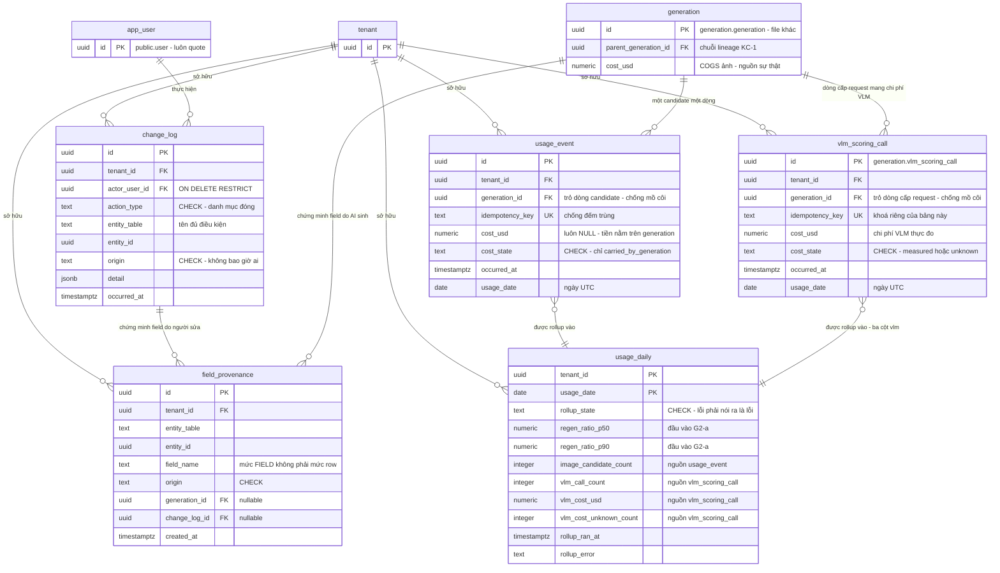

# DB Entity: Provenance & Usage

Đặc tả **năm** bảng — bốn bảng `public.change_log`, `public.field_provenance`, `public.usage_event`, `public.usage_daily`, cộng **một** bảng `generation.vlm_scoring_call` — nơi hệ thống giữ **bằng chứng "decisive contribution"** của con người và **sổ đo tiêu tài nguyên** dùng làm căn cứ đối soát.

> [!IMPORTANT]
> ⚠️ **Tên đủ điều kiện bắt buộc**: bốn bảng đầu nằm ở schema **`public`** — `public.change_log`, `public.field_provenance`, `public.usage_event`, `public.usage_daily` ([ADR-005 `Q1`](../Architecture/ADR-005-Platform-Table-Schema-Placement.md)). Bảng thứ năm nằm ở schema **`generation`** — `generation.vlm_scoring_call`. ⛔ Mọi câu SQL dùng tên đủ điều kiện theo guardrail `G-3`; ⛔ không dựa vào `search_path`.
>
> ⭐ **`KC-4` ⛔ KHÔNG được đặc tả lại ở đây.** Nguồn duy nhất là [ADR-017 `Q4`](../Architecture/ADR-017-Provenance-Chain-And-One-Transaction-Boundary.md), và [`Q4.7`](../Architecture/ADR-017-Provenance-Chain-And-One-Transaction-Boundary.md) đã lập sẵn hợp đồng trích dẫn cho **chính file này**: trỏ về `Q4.1`…`Q4.6`, ⛔ không copy nội dung — vì copy tạo ra **nguồn sự thật thứ hai**.

> [!NOTE]
> ⭐ **Hai ngoại lệ CÓ CHỦ Ý — ghi ra để lô verify ⛔ không báo nhầm là lỗi.**
>
> **(a) `generation.vlm_scoring_call` nằm ở schema `generation` nhưng được tài liệu hoá TRONG file này.** Vị trí schema ⛔ **không** đồng nghĩa quyền sở hữu tài liệu: cả **ba** nguồn — [ADR-018 `TBD-USAGE-VLM`](../Architecture/ADR-018-Usage-Event-And-Rollup-Model.md), [ADR-007 `Q8`](../Architecture/ADR-007-VLM-Provider-For-QA-Select.md), [SDD §9.2 `P-1`](../Architecture/SDD-Comic-Studio.md) — đều route hàng `TBD` này về **đúng file này**. Tách bảng sang file khác là làm mất địa chỉ của một `TBD` đã có ba đường trỏ tới.
>
> **(b) [ADR-018 `Q2`](../Architecture/ADR-018-Usage-Event-And-Rollup-Model.md)** phát biểu: *"`usage_daily` là **rollup dẫn xuất**, tính lại được từ `usage_event`"* và *"billing/metric là **hàm tổng hợp trên event thô**, ⛔ không counter tăng tại chỗ"*. Từ đây, `usage_daily` tổng hợp trên **HAI** bảng event thô (`public.usage_event` + `generation.vlm_scoring_call`). ⭐ Đây là cách đọc **nhất quán** với `Q2`, ⛔ **không phải vi phạm**: điều `Q2` cấm là **counter tăng tại chỗ**, ⛔ không phải *"chỉ được đọc đúng một bảng"*. Số bảng nguồn là chi tiết hiện thực; tính **dẫn xuất, tính lại được** — điều `Q2` thực sự bảo vệ — được giữ nguyên vẹn.

## Decided in

| Nguồn | Nội dung kế thừa |
|---|---|
| ⭐ [ADR-017 — Provenance Chain And One Transaction Boundary](../Architecture/ADR-017-Provenance-Chain-And-One-Transaction-Boundary.md) | `Q2` phạm vi ghi `change_log` · `Q3` provenance mức FIELD + cảnh báo race · `Q4.1` phát biểu chuẩn `KC-4` · `Q4.2` chính xác những bảng nào · `Q4.3` năm thuộc tính `P-1`…`P-5` · `Q4.4` transaction span nhiều schema · `Q4.5` cảnh báo phạm vi + `TBD` vòng đời · `Q4.6` guardrail `GR-1`…`GR-5` · `Q4.7` hợp đồng trích dẫn |
| [ADR-018 — Usage Event And Rollup Model](../Architecture/ADR-018-Usage-Event-And-Rollup-Model.md) | `Q1` append-only · `Q2` rollup là hàm tổng hợp · `Q3` idempotency key · `Q5` ba `usage_event` cho một panel · `Q7` ranh giới · `TBD-USAGE-VLM` |
| [ADR-005 — Platform Table Schema Placement](../Architecture/ADR-005-Platform-Table-Schema-Placement.md) | `Q1` bốn bảng thuộc `public` · `Q3` guardrail `G-1`…`G-4` |
| [ADR-006 — RLS Tenant Context Injection](../Architecture/ADR-006-RLS-Tenant-Context-Injection.md) | `D2`, `D3` hàm `public.current_tenant_id()` và khuôn policy chuẩn |
| [ADR-010 — Tenant Isolation With RLS](../Architecture/ADR-010-Tenant-Isolation-With-RLS.md) | `D1` `tenant_id NOT NULL` · `D2` `tenant_id` là cột đầu mọi composite index · `D7` hai đường xoá tách biệt |
| [ADR-007 — VLM Provider For QA Select](../Architecture/ADR-007-VLM-Provider-For-QA-Select.md) | `Q8` — cùng xung đột `TBD-USAGE-VLM`, ⚠️ lệch tên file đích, hợp nhất ở [mục dưới](#-đóng-tbd-usage-vlm--ràng-buộc-kép-và-lời-giải) |
| ⭐ [PM run-state — `E20`](../../010-Planning/pm-runs/2026-08-28-phase-2-architecture-design-comic-studio/escalations.md) | **Quyết định đã chốt**: chi phí VLM-select ra **bảng riêng ở schema `generation`**; `public.usage_event` trở lại **đồng nhất**. ⛔ File này **thi hành**, ⛔ không quyết lại |
| [PM run-state — `E15`](../../010-Planning/pm-runs/2026-08-28-phase-2-architecture-design-comic-studio/escalations.md) | **`TEXT` + `CHECK` cho TOÀN BỘ tầng Schema, ⛔ không ngoại lệ** — ⛔ không Postgres enum type |
| [ADR-015 — Job Queue In Postgres](../Architecture/ADR-015-Job-Queue-In-Postgres.md) | `Q4.3` job queue **at-least-once** ⇒ idempotency là điều kiện đúng đắn |
| [ADR-016 — Image Provider Adapter](../Architecture/ADR-016-Image-Provider-Adapter-And-Version-Pinning.md) | Adapter là nơi `cost_usd` / `model_id` / `model_version` **thực đo** được sinh ra |
| [SDD §3.4, §4.1 `B-3`, §6.2, §6.4, §7.4, §7.5, §9.2](../Architecture/SDD-Comic-Studio.md) | Vị trí file · ranh giới `M1–M6 → M8` · nơi `KC-4` áp · bốn dòng audit · bốn DB role · rollup chạy bằng subcommand |
| Requirement gốc | `SRS-FR-30`, `SRS-FR-31`, `SRS-FR-35`, `SRS-FR-36`, `SRS-NFR-01`, `SRS-NFR-05`, `SRS-NFR-12`, `SRS-NFR-13`, `SRS-NFR-14`, `SRS-NFR-21` |
| Story | [Story-Change-Log-On-Every-Editor-Action](../../022-User-Stories/Backlog/Story-Change-Log-On-Every-Editor-Action.md) · [Story-Provenance-Committed-In-Same-Transaction](../../022-User-Stories/Backlog/Story-Provenance-Committed-In-Same-Transaction.md) · [Story-Usage-Event-And-Daily-Rollup](../../022-User-Stories/Backlog/Story-Usage-Event-And-Daily-Rollup.md) · [Story-Generation-Cost-And-Model-Metadata](../../022-User-Stories/Backlog/Story-Generation-Cost-And-Model-Metadata.md) |

> [!NOTE]
> **File này đóng ba hàng của [SDD §9.2](../Architecture/SDD-Comic-Studio.md)**:
> - ⭐ **`P-1`** — xung đột `usage_event` vs AC *"đúng 3 row"* (`TBD-USAGE-VLM`).
> - **`P-7`** — hình dạng idempotency key · cấu trúc `usage_daily` · cách đánh dấu *"rollup thiếu/lỗi"* · **phần `usage_event`** của thứ tự gắn trong vòng đời job ([ADR-017 `Q4.5`](../Architecture/ADR-017-Provenance-Chain-And-One-Transaction-Boundary.md)).
> - Danh mục `action_type` — `TBD` mà [ADR-017 `Q2`](../Architecture/ADR-017-Provenance-Chain-And-One-Transaction-Boundary.md) route sang lô DB Schema.
>
> ⚠️ Phần `cost_usd` của `P-7` (biểu diễn *"chưa biết"* trên `generation`) thuộc [`DB-Entity-Generation.md`](./DB-Entity-Generation.md) — ⛔ file này không quyết thay, chỉ nêu **ràng buộc giao diện** [`CO-1`](#co-1--ràng-buộc-giao-diện-với-db-entity-generationmd).

---

## Bảng

### `public.change_log`

Một dòng = **một hành động của con người** đã xảy ra. Đây là bảng mà nghĩa vụ chứng minh *"decisive contribution"* dựa vào — mất nó là **mất bảo hộ bản quyền**.

| Cột | Kiểu | NULL? | Mặc định | Mô tả |
|---|---|:--:|---|---|
| `id` | `UUID` | ⛔ | `gen_random_uuid()` | Khoá chính |
| ⭐ `tenant_id` | `UUID` | ⛔ | — | Chủ sở hữu bằng chứng (`KC-5`, [ADR-017 `GR-5`](../Architecture/ADR-017-Provenance-Chain-And-One-Transaction-Boundary.md)) |
| `actor_user_id` | `UUID` | ⛔ | — | Ai thực hiện hành động. Ánh xạ trường `actor` của AC |
| `action_type` | `TEXT` + `CHECK` | ⛔ | — | Loại hành động. **Danh mục đóng** — xem [Danh mục `action_type`](#danh-mục-action_type) |
| `entity_table` | `TEXT` | ⛔ | — | Tên đủ điều kiện của bảng bị tác động, ví dụ `comic.panel`. ⛔ Không FK — đích trải trên **cả bốn** schema |
| `entity_id` | `UUID` | ⛔ | — | Khoá của dòng bị tác động. Ánh xạ trường `entity_id` của AC |
| `origin` | `TEXT` + `CHECK` | ⛔ | — | `'human'` hoặc `'ai_edited'`. ⛔ **Không bao giờ `'ai'`** — xem [`INV-CL-2`](#constraint--invariant) |
| `detail` | `JSONB` | ✅ | `NULL` | Ngữ cảnh tối thiểu của hành động (ví dụ generation nào được chọn thay generation nào). ⛔ Không chứa secret, ⛔ không chứa bytes ảnh |
| `occurred_at` | `TIMESTAMPTZ` | ⛔ | `now()` | Thời điểm hành động. Ánh xạ trường `timestamp` của AC |

- **PK**: `(id)`
- **FK**: `tenant_id → public.tenant(id)` `ON DELETE CASCADE` (`SRS-NFR-05`)
- **FK**: `actor_user_id → public."user"(id)` ⭐ **`ON DELETE RESTRICT`** — ⛔ **không CASCADE**: xoá một `user` ⛔ không được phép xoá bằng chứng của tenant. Xem [`INV-CL-4`](#constraint--invariant)

⚠️ **Vì sao `entity_table` là `TEXT` chứ không phải FK**: `change_log` là bảng **duy nhất** ghi hành động ở **mọi** module ([ADR-005 `Alternatives (c)`](../Architecture/ADR-005-Platform-Table-Schema-Placement.md) cấm rải nó theo module). Một FK đa hình ⛔ không tồn tại trong PostgreSQL; chọn `TEXT` là chấp nhận **mất ràng buộc tham chiếu** để **giữ tính duy nhất** — và tính duy nhất mới là điều kiện kiểm chứng của `KC-4` ([ADR-017 `Q4.4`](../Architecture/ADR-017-Provenance-Chain-And-One-Transaction-Boundary.md)).

#### Danh mục `action_type`

⭐ **Đóng `TBD` mà [ADR-017 `Q2`](../Architecture/ADR-017-Provenance-Chain-And-One-Transaction-Boundary.md) route sang lô này.** Danh mục **đóng**, cưỡng chế bằng `CHECK (action_type IN (…))` ở tầng DB. Mỗi giá trị có **một mỏ neo**; ⛔ ⛔ không giá trị nào được thêm vì *"chắc là cần"*.

> ⚠️ **Kiểu cột là `TEXT` + `CHECK`, ⛔ KHÔNG phải Postgres enum type** — quyết định toàn tầng Schema, ⛔ không ngoại lệ ([`E15`](../../010-Planning/pm-runs/2026-08-28-phase-2-architecture-design-comic-studio/escalations.md)). Lý do: đội **1 dev**, schema còn đổi nhiều; `ALTER TYPE` để **xoá/đổi** một giá trị là thao tác đau, còn `CHECK` sửa bằng **một** `ALTER TABLE`. ⭐ Quy tắc này áp cho **mọi** cột danh mục trong file này: `action_type`, `origin`, `cost_state`, `rollup_state`.

| Giá trị | Hành động | Neo |
|---|---|---|
| `edit_bible_field` | Sửa một field trong Story Bible editor | [Story-Change-Log](../../022-User-Stories/Backlog/Story-Change-Log-On-Every-Editor-Action.md) mục 4 AC-1 |
| `edit_dialogue` | Sửa **NỘI DUNG** thoại (`dialogue_rendered`). ⛔ **Không** phủ hành động **gán speaker** — hành động đó có giá trị riêng `assign_speaker` (phán quyết **BA `L29`**, đóng `T-CL-SPEAKER`) | `SRS-FR-35` · [Story-Change-Log](../../022-User-Stories/Backlog/Story-Change-Log-On-Every-Editor-Action.md) mục 4 (*"sửa bubble/dialogue"*) |
| ⭐ `assign_speaker` | ⭐ **Gán / gán lại người nói** cho một dòng thoại tại **human gate 1** — mọi lần ghi `speaker_id`, **kể cả `null` ≡ `UNKNOWN`** (đó là **một quyết định của người**, ⛔ không phải một ô trống). ⛔ **Không** phải `edit_dialogue`: nội dung thoại ⛔ **không** bị chạm. ⛔ **Không** phải `human_gate_pass`: gán speaker và xác nhận gate là **hai hành động khác nhau** (`SDD-HG-01.2`, `.3`) | [UC-04](../../020-Requirements/Use-Cases/UC-04-Human-Gate-Speaker-Attribution.md) bước 5 + bước 6 (*"xác nhận của con người là **bằng chứng đóng góp trí tuệ**"*) · `ALT-3` của UC-04 (sửa **nội dung** thoại trong lúc gán speaker sinh `change_log` ⭐ **RIÊNG** ⇒ hai hành động ⛔ **không được** dùng chung một giá trị) · `#2` [Endpoint-Human-Gates](../API/Endpoint-Human-Gates.md) §4.2 · ⭐ **BA `L29`** đóng `T-CL-SPEAKER` |
| `move_bubble` | Kéo bubble | `SRS-FR-35` |
| `change_camera` | Đổi camera | `SRS-FR-35` |
| ⭐ `select_generation` | **Chọn generation X thay vì Y** | `SRS-FR-35` — ⚠️ đây là hành động mà một dev sẽ theo bản năng coi là *"không phải thay đổi dữ liệu"* ([ADR-017 `Q2`](../Architecture/ADR-017-Provenance-Chain-And-One-Transaction-Boundary.md)) |
| `swap_panel` | Swap panel trong page layout — ⭐ **đổi chỗ ĐÚNG HAI panel** (`#3`). ⛔ **Không** phủ hành động **reorder** (hoán vị đầy đủ) — hành động đó có giá trị riêng `reorder_panel` (phán quyết **BA `L29`**, đóng `T-CL-REORDER-PANEL`) | [Story-Change-Log](../../022-User-Stories/Backlog/Story-Change-Log-On-Every-Editor-Action.md) mục 4 |
| ⭐ `reorder_panel` | ⭐ **Sắp xếp lại thứ tự đọc của các panel trong MỘT page** — một **hoán vị đầy đủ** tập panel (`#4`). ⚠️ Một thao tác của người = **MỘT** dòng `change_log`; ⛔ **không** phân rã thành N dòng `swap_panel` — phân rã là **bịa ra** những hành động chưa từng xảy ra. ⛔ **Vì sao không tái dụng `swap_panel`**: dòng log `swap_panel` nói *"người đã đổi chỗ hai panel"*, trong khi việc đã xảy ra là *"người đã sắp lại thứ tự đọc của **cả trang**"* — đọc trước hội đồng, nó **hạ thấp** đúng phần *selection & arrangement* mà `KC-2` cần chứng minh | [UC-08](../../020-Requirements/Use-Cases/UC-08-Arrange-Page-And-Preview.md) bước 7 (liệt ⭐ **ba** thao tác **RIÊNG BIỆT** — *chọn template · swap panel · **reorder*** — và đòi *"một `change_log` row cho **mỗi** thao tác"*) + bước 5 · `#4` [Endpoint-Page-Layout](../API/Endpoint-Page-Layout.md) §4.1 · ⭐ **BA `L29`** đóng `T-CL-REORDER-PANEL` |
| `change_page_template` | Đổi template của page | [Story-Change-Log](../../022-User-Stories/Backlog/Story-Change-Log-On-Every-Editor-Action.md) mục 4 |
| `export` | Export chapter | `SRS-FR-35` · [ADR-017 `Q2`](../Architecture/ADR-017-Provenance-Chain-And-One-Transaction-Boundary.md) |
| `human_gate_pass` | Một human gate chuyển `OPEN → PASS` | [SDD §6.2](../Architecture/SDD-Comic-Studio.md) hàng **M4 → M8** (`SDD-HG-01.6`) |
| `takedown_disable_access` | Operator thực hiện disable-access theo takedown | [SDD §6.2](../Architecture/SDD-Comic-Studio.md) hàng **M9 → M8** (`UC-11` bước 7) |
| ⭐ `export_denied` | ⭐ Một lần export **BỊ TỪ CHỐI** — thiếu human gate, hoặc project đang `disable-access` do takedown. ⛔ **Tuyệt đối không** dùng `export` cho hành động này: làm vậy là **đếm một lần từ chối như một lần export thành công**. ⚠️ Ghi ở **transaction RIÊNG** — xem [`INV-CL-6`](#constraint--invariant) | [UC-09](../../020-Requirements/Use-Cases/UC-09-Export-Chapter.md) `EF-1` và `EF-3` (nguyên văn: *"từ chối export và **ghi lại lần từ chối**"*) · `E-PE-3` [Endpoint-Preview-Export](../API/Endpoint-Preview-Export.md) · `CO-EX-2` [`DB-Entity-Preview-And-Export.md`](./DB-Entity-Preview-And-Export.md) |
| `create_membership` | Gán một `user` vào một `tenant` (tạo một dòng `membership`) | `E-TN-4` [Endpoint-Tenancy](../API/Endpoint-Tenancy.md) · [ADR-017 `Q2`](../Architecture/ADR-017-Provenance-Chain-And-One-Transaction-Boundary.md). ⚠️ Mỏ neo là **đường ghi API**, ⛔ **không phải** [Story-Tenant-User-Membership](../../022-User-Stories/Backlog/Story-Tenant-User-Membership-As-Three-Entities.md) — Story đó **cố ý ⛔ không xây luồng invite** |
| `create_bubble` | **Tạo** một bubble trong một panel | ⭐ [ADR-017 `Q2`](../Architecture/ADR-017-Provenance-Chain-And-One-Transaction-Boundary.md) (**mọi** đường ghi của editor sinh `change_log`) · `E-BT-2` [Endpoint-Bubble-Typeset](../API/Endpoint-Bubble-Typeset.md) · [UC-07](../../020-Requirements/Use-Cases/UC-07-Edit-Bubble-And-Dialogue-In-Panel.md) bước 9 (*"một `change_log` row cho **mỗi** thao tác của actor"*). ⚠️ **Trung thực về mỏ neo**: UC-07 liệt **bốn** thao tác (kéo · sửa thoại · đổi kiểu · kéo tail) và ⛔ **không** liệt tạo/xoá/sắp xếp ⇒ mỏ neo bắt buộc là **`Q2` + đường ghi API**, ⛔ không phải một dòng liệt kê của UC |
| `delete_bubble` | **Xoá** một bubble | ⭐ [ADR-017 `Q2`](../Architecture/ADR-017-Provenance-Chain-And-One-Transaction-Boundary.md) · `E-BT-5` [Endpoint-Bubble-Typeset](../API/Endpoint-Bubble-Typeset.md) · cùng lưu ý mỏ neo như `create_bubble` |
| `reorder_bubble` | **Sắp xếp lại thứ tự đọc** của bubble trong **một** panel. ⚠️ Một thao tác của người = **MỘT** dòng `change_log`, ⛔ không phải N dòng | ⭐ [ADR-017 `Q2`](../Architecture/ADR-017-Provenance-Chain-And-One-Transaction-Boundary.md) · `E-BT-4` [Endpoint-Bubble-Typeset](../API/Endpoint-Bubble-Typeset.md) (*"sinh **một** `change_log` cho **cả** thao tác sắp xếp"*). ⛔ **Khác** hành động reorder **panel** ở page layout — giá trị của hành động đó là `reorder_panel` (⭐ **BA `L29`**) |
| `edit_panel_field` | Sửa **một field của `Panel Specification` NGOÀI `camera`**: `action`, `visual_constraints`, `text_safe_zone`, `beat_type`, `emphasis`, tập nhân vật có mặt. ⛔ **`camera` giữ nguyên `change_camera`**, ⛔ không nuốt vào giá trị này | [UC-03](../../020-Requirements/Use-Cases/UC-03-Review-Panel-Script.md) bước 9 · [Endpoint-Panel-Script](../API/Endpoint-Panel-Script.md) §4.4 (`#4 PATCH panel`) · `T-CL-PANEL-EDIT` |
| `split_panel` | **Tách** một panel thành nhiều panel | [UC-03](../../020-Requirements/Use-Cases/UC-03-Review-Panel-Script.md) bước 9 (*"gộp / tách panel"*) · [Endpoint-Panel-Script](../API/Endpoint-Panel-Script.md) §4.5 (`#5 split`) |
| `merge_panel` | **Gộp** nhiều panel thành một | [UC-03](../../020-Requirements/Use-Cases/UC-03-Review-Panel-Script.md) bước 9 · [Endpoint-Panel-Script](../API/Endpoint-Panel-Script.md) §4.5 (`#6 merge`) |
| `approve_panel_script` | Đánh dấu **panel script** của một chapter là đã duyệt. ⚠️ Hàng này chỉ mở **giá trị `action_type`**; ⛔ **đích LƯU trạng thái duyệt vẫn là `T-PS-APPROVE`**, ⛔ lô này không chọn thay | [UC-03](../../020-Requirements/Use-Cases/UC-03-Review-Panel-Script.md) bước 11 · [Endpoint-Panel-Script](../API/Endpoint-Panel-Script.md) §4.6 (`#7 panel-script:approve`) |
| `approve_ingest` | Tác giả **chấp nhận kết quả ingest / text clean** của một chapter | [UC-01](../../020-Requirements/Use-Cases/UC-01-Upload-And-Ingest-Chapter.md) bước 10 · `CH-5` [Endpoint-Chapter-Ingest](../API/Endpoint-Chapter-Ingest.md) |
| `approve_bible` | Đánh dấu **Story Bible** của một chapter là đã duyệt | [UC-02](../../020-Requirements/Use-Cases/UC-02-Review-And-Edit-Story-Bible.md) bước 12 · `SB-7` [Endpoint-Story-Bible](../API/Endpoint-Story-Bible.md) |

> [!WARNING]
> ⚠️ **Ba giá trị `export`, `human_gate_pass`, `takedown_disable_access` nằm NGOÀI phạm vi editor** mà [Story-Change-Log](../../022-User-Stories/Backlog/Story-Change-Log-On-Every-Editor-Action.md) mục 4 tự giới hạn. Chúng ⛔ **không phải phát minh của file này**: [SDD §6.2](../Architecture/SDD-Comic-Studio.md) liệt kê tường minh ba điểm chạm `M4 → M8`, `M6 → M8`, `M9 → M8` là nơi `change_log` được ghi. Phạm vi **build** của Story đó vẫn là editor; phạm vi **danh mục** thì rộng hơn.
>
> ⛔ **Quy tắc thêm giá trị**: một giá trị mới chỉ vào `CHECK` khi có **một mỏ neo yêu cầu ĐÃ TỒN TẠI** nói rằng hành động đó có thật và sinh `change_log` — ⭐ **một Story, một Use Case (`docs/020-Requirements/Use-Cases/`), một mục `SRS`, hoặc một mục SDD/ADR**. ⚠️ **Làm rõ ở `L28b`**: bản đầu của quy tắc chỉ ghi *"Story hoặc SDD/ADR"*, nhưng **Use Case nằm ở tầng Requirement cao hơn Story** ⇒ nó là mỏ neo **hợp lệ**, và phần lớn giá trị bổ sung neo vào **một bước UC cụ thể** cộng với đường ghi API đã đặc tả. ⛔ Một endpoint **một mình** ⛔ **không đủ** — phải có một bước UC, một mục `SRS`, hoặc một mục SDD/ADR đứng sau nó. ⛔ Migration lặng lẽ nới `CHECK` là mở lại `KC-2` — ⛔ không hợp lệ.

> [!IMPORTANT]
> ⭐ **Mười một giá trị được bổ sung ở lô sửa `L28b`, ⛔ không phải nới danh mục cho vui.** Nguồn: [`E24`](../../010-Planning/pm-runs/2026-08-28-phase-2-architecture-design-comic-studio/escalations.md) — **ba lô API độc lập** (L12, L13, L14) đâm vào **cùng một bức tường**: danh mục **đóng** thiếu giá trị cho những hành động **có thật** đã được UC + endpoint đặc tả. ⇒ Đây là **lỗi hệ thống**, ⛔ không phải ba sự cố lẻ, và cả ba lô đều xử lý đúng khi ⛔ **không tự phát minh giá trị**.
>
> ⛔⛔ **NGUYÊN TẮC CỨNG — TUYỆT ĐỐI KHÔNG TÁI DỤNG THẦM LẶNG.** ⛔ Không được lấy một giá trị **gần đúng** để log một hành động **khác** chỉ vì danh mục chưa có giá trị riêng. Đó **chính xác** là cách `public.change_log` **mất giá trị làm bằng chứng** — mà bảng này là `KC-2`, thứ đứng giữa hệ thống và **mất bảo hộ bản quyền**. Một hàng log ghi sai loại hành động ⛔ không phải *"gần đúng"*: trước một hội đồng nó là **bằng chứng sai**. ⇒ Gặp hành động chưa có giá trị: **dừng lại và mở một hàng `TBD`**, ⛔ không mượn tạm.
>
> ✅ ⭐ **Hai cách đọc RỘNG đã có PHÁN QUYẾT BA ở lô `L29` — cả hai đều BỊ BÁC.** ⛔ `swap_panel` **không** phủ reorder panel; ⛔ `edit_dialogue` **không** phủ gán speaker. Thay vào đó, **hai giá trị mới** được mở: `reorder_panel` và `assign_speaker`. ⚠️ Đây là **hai giá trị của `L29`**, ⛔ **không** phải giá trị thứ mười hai/mười ba của lô `L28b` ở trên.
>
> ⭐ **Phép thử đã dùng để quyết, ghi lại để lô sau dùng tiếp**: câu hỏi ⛔ **không phải** *"giá trị gần đúng này có tạm dùng được không"*, mà là ⭐ ***"khi một luật sư đọc dòng log này để chứng minh đóng góp quyết định của con người, nó có nói ĐÚNG việc đã xảy ra không?"*** — nếu **không**, thêm giá trị mới. ⚠️ Thêm một giá trị là **rẻ** (một `ALTER TABLE` sửa `CHECK`); một dòng log **nói sai sự thật** thì ⛔ **không sửa được về sau** vì bảng này **append-only** (`INV-CL-3`).

---

### `public.field_provenance`

Một dòng = **nguồn gốc của MỘT FIELD**, ⛔ không phải của một row. Đây là thứ vẽ ra **ranh giới phần được bảo hộ** theo Điều 5a ([ADR-017 `Q3`](../Architecture/ADR-017-Provenance-Chain-And-One-Transaction-Boundary.md)).

| Cột | Kiểu | NULL? | Mặc định | Mô tả |
|---|---|:--:|---|---|
| `id` | `UUID` | ⛔ | `gen_random_uuid()` | Khoá chính |
| ⭐ `tenant_id` | `UUID` | ⛔ | — | `KC-5` |
| `entity_table` | `TEXT` | ⛔ | — | Tên đủ điều kiện của bảng chứa field, ví dụ `story.bible_entity` |
| `entity_id` | `UUID` | ⛔ | — | Khoá của dòng chứa field |
| ⭐ `field_name` | `TEXT` | ⛔ | — | **Tên field** — đây là chỗ mức FIELD khác mức row |
| `origin` | `TEXT` + `CHECK` | ⛔ | — | `'ai'` / `'ai_edited'` / `'human'` cho **đúng field đó** |
| `generation_id` | `UUID` | ✅ | `NULL` | Generation đã sinh ra giá trị field này. Bắt buộc khi `origin = 'ai'` |
| `change_log_id` | `UUID` | ✅ | `NULL` | Hành động người đã ghi/sửa field này. Bắt buộc khi `origin ∈ ('human','ai_edited')` |
| `created_at` | `TIMESTAMPTZ` | ⛔ | `now()` | Thời điểm ghi nhận |

- **PK**: `(id)`
- **FK**: `tenant_id → public.tenant(id)` `ON DELETE CASCADE`
- **FK**: `generation_id → generation.generation(id)` `ON DELETE CASCADE` — FK **span hai schema**, hoàn toàn hợp lệ ([ADR-017 `Q4.4`](../Architecture/ADR-017-Provenance-Chain-And-One-Transaction-Boundary.md))
- **FK**: `change_log_id → public.change_log(id)` `ON DELETE RESTRICT`

> [!CAUTION]
> ⭐⚠️ **⛔ TUYỆT ĐỐI KHÔNG đặt `UNIQUE (entity_table, entity_id, field_name)`.**
> [ADR-017 `Q3`](../Architecture/ADR-017-Provenance-Chain-And-One-Transaction-Boundary.md) ghi ràng buộc race nguyên văn: hai request tạo generation đồng thời cho cùng một panel ⛔ **không được ghi đè `field_provenance` của nhau — CẢ HAI dòng phải tồn tại**.
> Một `UNIQUE` trên bộ ba đó buộc đường ghi thành `UPSERT` ⇒ dòng sau **xoá dấu** dòng trước ⇒ phá đúng ràng buộc trên, và phá luôn thuộc tính `P-2` của [`Q4.3`](../Architecture/ADR-017-Provenance-Chain-And-One-Transaction-Boundary.md).
> ⇒ **Provenance "hiện hành" của một field = dòng `created_at` mới nhất**, ⛔ không phải *"dòng duy nhất"*. Bảng này là **lịch sử**, không phải trạng thái.

---

### `public.usage_event`

⭐ **Một dòng = MỘT image candidate đã sinh.** ⛔ Không phải *"kết quả có dùng được không"* — tiền đã tiêu là tiền đã tiêu ([ADR-018 `Q5`](../Architecture/ADR-018-Usage-Event-And-Rollup-Model.md)).

> ⭐ **Bảng này ĐỒNG NHẤT** theo [`E20`](../../010-Planning/pm-runs/2026-08-28-phase-2-architecture-design-comic-studio/escalations.md): ⛔ **không** có cột phân loại, ⛔ **không** có dòng nào không ứng với một candidate. Chi phí VLM-select nằm ở [`generation.vlm_scoring_call`](#generationvlm_scoring_call).

| Cột | Kiểu | NULL? | Mặc định | Mô tả |
|---|---|:--:|---|---|
| `id` | `UUID` | ⛔ | `gen_random_uuid()` | Khoá chính |
| ⭐ `tenant_id` | `UUID` | ⛔ | — | `KC-5` |
| `generation_id` | `UUID` | ⛔ | — | ⭐ Cưỡng chế `P-3` *(⛔ không `usage_event` mồ côi)* bằng **FK** — guardrail `GR-2`. Luôn trỏ dòng `generation` của **chính candidate đó**, xem [`CO-1`](#co-1--ràng-buộc-giao-diện-với-db-entity-generationmd) |
| `idempotency_key` | `TEXT` | ⛔ | — | Chống đếm trùng khi retry ([ADR-018 `Q3`](../Architecture/ADR-018-Usage-Event-And-Rollup-Model.md)). Hình dạng: xem [Hình dạng idempotency key](#hình-dạng-idempotency-key) |
| `cost_usd` | `NUMERIC` | ✅ | `NULL` | ⚠️ **Luôn `NULL` ở bảng này.** Độ chính xác `12,6`. `NULL` ⛔ **không** có nghĩa *"bằng 0"* — nghĩa được `cost_state` nói ra |
| ⭐ `cost_state` | `TEXT` + `CHECK` | ⛔ | — | ⭐ **Đúng một giá trị: `'carried_by_generation'`** — chi phí ảnh là của `generation.generation.cost_usd`, ⛔ không của dòng này. Cột tồn tại để ⛔ **không có `NULL` âm thầm và ⛔ không có `0` ngầm định** ([ADR-018 `Q2`, `Q4`](../Architecture/ADR-018-Usage-Event-And-Rollup-Model.md)) |
| `occurred_at` | `TIMESTAMPTZ` | ⛔ | `now()` | Thời điểm tiêu tài nguyên |
| `usage_date` | `DATE` | ⛔ | — | ⭐ **Ngày UTC** dẫn xuất từ `occurred_at` — khoá gộp của rollup. Xem [`INV-UE-5`](#constraint--invariant) |

- **PK**: `(id)`
- **FK**: `tenant_id → public.tenant(id)` `ON DELETE CASCADE`
- **FK**: `generation_id → generation.generation(id)` `ON DELETE CASCADE` — ⭐ **`GR-2`**
- **UNIQUE**: `(tenant_id, idempotency_key)` — ⭐ cưỡng chế chống đếm trùng **ở tầng DB**, ⛔ không ở tầng code

> [!IMPORTANT]
> ⭐ **Vì sao giữ một cột chỉ có MỘT giá trị hợp lệ — đây là guardrail, ⛔ không phải cột thừa.** Rủi ro cần chặn: một lô sau này thêm một loại tiêu tài nguyên **có tiền thật** vào bảng này ⇒ phép đo AC `COUNT(*) = 3` **gãy** và phép cộng COGS **đếm đôi**. Với `CHECK (cost_state = 'carried_by_generation')`, việc thêm đó **buộc phải `ALTER` cái `CHECK`** — tức thất bại **ồn ào** ở migration và phải qua review, ⛔ không lặng lẽ trôi vào. Xem [`INV-UE-3`](#constraint--invariant).

> ⭐ **Cột `event_kind` đã bị BỎ — và điều đó đã được VERIFY, ⛔ không phải giả định.** `grep` toàn repo (`usage_event`, và `cost`/`chi phí` trong [ADR-008](../Architecture/ADR-008-LLM-Provider-And-Usage-Boundaries.md)) cho thấy ⛔ **không tồn tại** một loại `usage_event` nào **có tài liệu** ngoài image candidate: chi phí LLM được [ADR-008](../Architecture/ADR-008-LLM-Provider-And-Usage-Boundaries.md) tuyên bố nguyên văn là *"⛔ **không có dòng nào trong repo xác nhận nó đã được tính hay chưa** ⇒ đối xử như **chưa xác định**"* và ⛔ **không** route về `usage_event`. ⇒ Một cột phân loại **một giá trị** là cột chết; nó bị bỏ, ⛔ không giữ *"cho tương lai"*.

#### Hình dạng idempotency key

⭐ **Đóng phần *"hình dạng idempotency key"* của `P-7`.** Nguồn chỉ nói *"có idempotency key"* ([ADR-018 `Q3`](../Architecture/ADR-018-Usage-Event-And-Rollup-Model.md)) ⇒ hình dạng là quyết định của lô này.

> **Quy tắc `IK-1`**: `idempotency_key` phải định danh **một lần tiêu tài nguyên THỰC**, ⛔ **không phải một lần GỬI**.

Thành phần cấu tạo, do **adapter** sinh ([ADR-016](../Architecture/ADR-016-Image-Provider-Adapter-And-Version-Pinning.md) là nơi duy nhất biết một lời gọi provider đã thực sự xảy ra):

`idempotency_key = {generation_id} : {provider_call_ref}`

| Thành phần | Vì sao có mặt |
|---|---|
| `generation_id` | Neo sự kiện vào artifact — cùng khoá với `GR-2` |
| `provider_call_ref` | ⭐ Định danh do adapter cấp **một lần cho mỗi lời gọi provider thực tế**. Worker retry **chuyển tiếp cùng một lời gọi** ⇒ cùng `ref` ⇒ cùng key ⇒ `UNIQUE` từ chối dòng thứ hai. Một lời gọi **mới** ⇒ `ref` mới ⇒ dòng mới, **đúng**, vì tài nguyên đã tiêu thêm một lần |

⭐ **Thành phần `{event_kind}` đã bị BỎ khỏi khoá.** Nó tồn tại chỉ vì hai loại tiêu tài nguyên từng **dùng chung một `UNIQUE`**. Hai bảng tách ⇒ hai `UNIQUE` tách ⇒ ⛔ không còn khả năng đụng khoá ⇒ thành phần đó **hết lý do tồn tại** ([`E20`](../../010-Planning/pm-runs/2026-08-28-phase-2-architecture-design-comic-studio/escalations.md)).

⚠️ **Đây ⛔ không phải tối ưu.** [ADR-015 `Q4.3`](../Architecture/ADR-015-Job-Queue-In-Postgres.md) chốt job queue là **at-least-once**: một job **sẽ** chạy lại. ⛔ Không có key thì mỗi lần chạy lại là một lần **đếm phồng chi phí**, và số phồng đó đi thẳng vào gate `G2`.

⚠️ **Ràng buộc để lại cho lô API**: `provider_call_ref` phải **bền qua retry** (sinh trước lời gọi, lưu cùng kết quả), ⛔ không được sinh lại ở mỗi lần worker nhặt job. Đích đặc tả: `Spec-Integration-Image-Provider.md` — ⛔ ngoài phạm vi file này.

---

### `generation.vlm_scoring_call`

⭐ **Một dòng = MỘT lời gọi provider VLM đã xảy ra** để chấm N candidate của một request. Đây là **nguồn sự thật DUY NHẤT** của khoản chi phí VLM-select — phần **chưa tính** của `CF-3.5`.

> [!IMPORTANT]
> ⭐ **Vì sao tên là `vlm_scoring_call` chứ không phải `vlm_usage_event` hay `vlm_cost`:**
> 1. **Đơn vị đo nằm ngay trong tên** — một dòng là **một lời gọi** (`call`), ⛔ không phải một candidate, ⛔ không phải một điểm chấm. Một lời gọi chấm **cả N** candidate ([ADR-007 `Q5`](../Architecture/ADR-007-VLM-Provider-For-QA-Select.md) lấy *"nhiều ảnh trong một call"* làm tiêu chí chọn vendor) ⇒ tên nào gợi ý *"per candidate"* là tên **sai ngữ nghĩa**.
> 2. ⛔ **Không mang chữ `usage_event`** — để ⛔ không ai đọc nhầm rằng nó nằm trong tập mà AC `COUNT(*) = 3` đang đếm.
> 3. ⭐ **Tách khỏi `generation.vlm_evaluation` (đã có ở [SDD §3.1](../Architecture/SDD-Comic-Studio.md))**: `vlm_evaluation` giữ **điểm chấm**; `vlm_scoring_call` giữ **tiền**. [`DB-Entity-Generation.md`](./DB-Entity-Generation.md) đã cấm tường minh việc thêm `cost_usd` vào `vlm_evaluation` (*"tạo nguồn sự thật thứ hai cho cùng một khoản chi"*) — quyết định này **giữ đúng lệnh cấm đó**, chỉ đổi **đích** của khoản tiền từ `public.usage_event` sang bảng này.

| Cột | Kiểu | NULL? | Mặc định | Mô tả |
|---|---|:--:|---|---|
| `id` | `UUID` | ⛔ | `gen_random_uuid()` | Khoá chính |
| ⭐ `tenant_id` | `UUID` | ⛔ | — | `KC-5` · `SRS-NFR-01`. ⛔ Không có bảng nghiệp vụ nào ⛔ không mang `tenant_id` ([ADR-010 `D1`](../Architecture/ADR-010-Tenant-Isolation-With-RLS.md)) |
| ⭐ `generation_id` | `UUID` | ⛔ | — | ⭐ Trỏ dòng `generation` **cấp request** (**đã commit** trước bước chấm điểm). Giữ nguyên tinh thần `GR-2`: ⛔ **không có dòng chi phí mồ côi** — xem [`INV-VS-2`](#constraint--invariant) |
| `idempotency_key` | `TEXT` | ⛔ | — | ⭐ Khoá **riêng của bảng này**, chống đếm trùng khi retry — cùng nguyên tắc [ADR-018 `Q3`](../Architecture/ADR-018-Usage-Event-And-Rollup-Model.md). Hình dạng: `{generation_id} : {vlm_call_ref}` |
| `cost_usd` | `NUMERIC` | ✅ | `NULL` | Chi phí **thực đo** của **chính lời gọi này**. Độ chính xác `12,6`. ⚠️ `NULL` ⛔ **không** có nghĩa *"bằng 0"* |
| ⭐ `cost_state` | `TEXT` + `CHECK` | ⛔ | — | `'measured'` \| `'unknown'`. ⛔ **`'unknown'` TUYỆT ĐỐI không được gộp thành `0`** — *"chưa biết"* ⛔ không phải *"miễn phí"* ([ADR-018 `Q4`](../Architecture/ADR-018-Usage-Event-And-Rollup-Model.md)) |
| `occurred_at` | `TIMESTAMPTZ` | ⛔ | `now()` | Thời điểm lời gọi xảy ra |
| `usage_date` | `DATE` | ⛔ | — | ⭐ **Ngày UTC** dẫn xuất từ `occurred_at` — khoá gộp của rollup, **cùng quy ước** với `usage_event` |

- **PK**: `(id)`
- **FK**: `tenant_id → public.tenant(id)` `ON DELETE CASCADE` — FK **span hai schema**, hợp lệ ([ADR-017 `Q4.4`](../Architecture/ADR-017-Provenance-Chain-And-One-Transaction-Boundary.md))
- **FK**: `generation_id → generation.generation(id)` `ON DELETE CASCADE`
- **UNIQUE**: `(tenant_id, idempotency_key)`
- **Append-only** + **RLS `ENABLE` + `FORCE`** — xem [`INV-VS-1`](#constraint--invariant) và [RLS Policy](#rls-policy)

> [!WARNING]
> ⚠️ **Append-only của bảng này là QUYẾT ĐỊNH CỦA LÔ NÀY, ⛔ không phải một trích dẫn.** Guardrail `GR-3` của [ADR-017 `Q4.6`](../Architecture/ADR-017-Provenance-Chain-And-One-Transaction-Boundary.md) nêu **đúng hai** bảng: `change_log` và `usage_event`. Lô này **mở rộng cùng chế độ** (`REVOKE UPDATE, DELETE` khỏi mọi DB role ứng dụng) cho `generation.vlm_scoring_call` với **cùng một lý do gốc** mà [ADR-018 `Q1`](../Architecture/ADR-018-Usage-Event-And-Rollup-Model.md) trích từ `Glossary`: ***"Append-only là ĐIỀU KIỆN để nó dùng được làm căn cứ đối soát."*** Một bảng chi phí sửa được thì ⛔ không đối soát được với ai — và đây **là** một bảng chi phí. Tiền lệ trong chính file này: [`INV-FP-4`](#constraint--invariant).

⚠️ **Ràng buộc để lại cho lô API — song song với `provider_call_ref`**: `vlm_call_ref` phải **bền qua retry** (sinh **trước** lời gọi VLM, lưu cùng kết quả), ⛔ không sinh lại mỗi lần worker nhặt job. Đích đặc tả: adapter VLM ([ADR-007](../Architecture/ADR-007-VLM-Provider-For-QA-Select.md) chốt VLM là **adapter tách khỏi** image provider) — ⛔ ngoài phạm vi file này.

⚠️ **Cột ⛔ KHÔNG có ở đây, và cố ý**: ⛔ không `score`, ⛔ không `winner_generation_id` (đó là `generation.vlm_evaluation`); ⛔ không `candidate_count` — ⛔ chưa nguồn nào đòi chuẩn hoá chi phí *"per candidate"*, thêm là vi phạm quy tắc *"⛔ không cột nào vào vì chắc là cần"*.

---

### `public.usage_daily`

Một dòng = **một tenant × một ngày UTC**. Rollup **dẫn xuất**, tính lại được từ **hai** bảng event thô ([ADR-018 `Q2`](../Architecture/ADR-018-Usage-Event-And-Rollup-Model.md) — xem khối **Hai ngoại lệ CÓ CHỦ Ý**, ngoại lệ **(b)**, ở đầu file).

| Cột | Kiểu | NULL? | Mặc định | Bảng nguồn | Mô tả |
|---|---|:--:|---|---|---|
| ⭐ `tenant_id` | `UUID` | ⛔ | — | — | Thành phần thứ nhất của PK |
| `usage_date` | `DATE` | ⛔ | — | — | Ngày **UTC** |
| ⭐ `rollup_state` | `TEXT` + `CHECK` | ⛔ | `'missing'` | — | `'complete'` \| `'partial'` \| `'failed'` \| `'missing'`. ⭐ **Cột làm cho *"rollup lỗi phải NÓI RA là lỗi"* thành cưỡng chế được** |
| `regen_ratio_p50` | `NUMERIC` | ✅ | `NULL` | `usage_event` | p50 regen ratio của đúng ngày đó — đầu vào `G2-a` |
| `regen_ratio_p90` | `NUMERIC` | ✅ | `NULL` | `usage_event` | p90 regen ratio của đúng ngày đó — đầu vào `G2-a` |
| `image_candidate_count` | `INTEGER` | ✅ | `NULL` | `usage_event` | Số dòng `public.usage_event` trong ngày — ⭐ ⛔ **không cần mệnh đề lọc nào**, vì bảng đã đồng nhất |
| `vlm_call_count` | `INTEGER` | ✅ | `NULL` | ⭐ `vlm_scoring_call` | Số lời gọi VLM trong ngày |
| `vlm_cost_usd` | `NUMERIC` | ✅ | `NULL` | ⭐ `vlm_scoring_call` | Tổng `cost_usd` của các dòng có `cost_state = 'measured'` |
| `vlm_cost_unknown_count` | `INTEGER` | ✅ | `NULL` | ⭐ `vlm_scoring_call` | ⭐ Số lời gọi VLM có `cost_state = 'unknown'`. ⛔ **Không được gộp vào `vlm_cost_usd` như số 0** — nó là *"chưa biết"*, không phải *"miễn phí"* |
| `rollup_ran_at` | `TIMESTAMPTZ` | ✅ | `NULL` | — | Lần chạy rollup gần nhất cho ngày này |
| `rollup_error` | `TEXT` | ✅ | `NULL` | — | Lý do khi `rollup_state ∈ ('failed','partial')`. ⛔ Không chứa secret |

- **PK**: `(tenant_id, usage_date)` — ⭐ `tenant_id` là cột **đầu tiên** (`SRS-NFR-01`, [ADR-010 `D2`](../Architecture/ADR-010-Tenant-Isolation-With-RLS.md))
- **FK**: `tenant_id → public.tenant(id)` `ON DELETE CASCADE`

> [!CAUTION]
> ⭐⭐ **BA CỘT `vlm_*` LÀ FIRST-CLASS — VÀ ĐÂY CHÍNH LÀ CƠ CHẾ CHỐNG *"CHI PHÍ VLM BIẾN MẤT"*.**
> Cơ chế đó ⛔ **không** nằm ở chỗ *"chung một bảng thô"* — nó nằm **ở đây**, tại `usage_daily`: `vlm_call_count` / `vlm_cost_usd` / `vlm_cost_unknown_count` là **cột bắt buộc của mặt báo cáo**. `E20` đổi **bảng nguồn** của ba cột này từ `public.usage_event` sang `generation.vlm_scoring_call` và ⛔ **không đổi một dòng nào** của mặt báo cáo mà `G2-a` và phép tính COGS đọc.
> ⇒ Khoản chi phí VLM ⛔ **không thể biến mất bằng cách bị quên**: một ngày có `rollup_state = 'complete'` mà `vlm_call_count IS NULL` là **vi phạm `INV-UD-1`** — CI/test bắt được, ⛔ không phải trông vào việc ai đó nhớ viết `JOIN`.
> ⚠️ **Hệ quả vận hành**: một lần chạy rollup đọc **hai** bảng thô; **hỏng ở bất kỳ bảng nào** ⇒ ngày đó ⛔ **không được** mang `rollup_state = 'complete'`.

> [!IMPORTANT]
> ⭐ **`public.usage_daily` ⛔ KHÔNG nằm dưới guardrail `GR-3`** (append-only bằng `REVOKE UPDATE, DELETE`). [ADR-017 `Q4.6`](../Architecture/ADR-017-Provenance-Chain-And-One-Transaction-Boundary.md) `GR-3` nêu **đúng hai** bảng: `change_log` và `usage_event`.
> **Lý do phải nói ra vì nó phản trực giác**: `usage_daily` là **dữ liệu dẫn xuất, tính lại được**; nếu nó cũng append-only thì một lần rollup lỗi ⛔ **không bao giờ sửa lại được** — và AC chỉ đòi *"đánh dấu rõ là lỗi"*, ⛔ không đòi bất biến. ⇒ Job rollup được phép `INSERT … ON CONFLICT (tenant_id, usage_date) DO UPDATE`, và **chạy lại phải cho cùng kết quả** (idempotent recompute).

⚠️ **Định nghĩa số học của *"regen ratio"* (tử số / mẫu số / đơn vị quan sát) = `TBD`.** ⛔ Không nguồn nào trong repo — `Glossary` ⛔ không có mục này, `SRS-FR-30` chỉ chốt *"regen ratio là metric first-class, đo p50/p90"*. **Ai đóng**: PM (định nghĩa metric) + Engineer khi đo MVP0 (`M1-7`). ⛔ **File này không tự gán công thức** — nhưng schema **không chặn** cách đọc nào: `usage_event` giữ đủ `generation_id` + `usage_date` để tính p50/p90 theo bất kỳ đơn vị quan sát nào được chốt.

---

## ⭐ Đóng `TBD-USAGE-VLM` — ràng buộc kép và lời giải

> [!CAUTION]
> ⚠️ **Hàng `TBD` này được ba tài liệu route tới đúng file này**: [ADR-018 `TBD-USAGE-VLM`](../Architecture/ADR-018-Usage-Event-And-Rollup-Model.md), [ADR-007 `Q8`](../Architecture/ADR-007-VLM-Provider-For-QA-Select.md), [SDD §9.2 `P-1`](../Architecture/SDD-Comic-Studio.md).
> ⭐ **Hợp nhất lệch tên file — làm ở đây, một lần**: [ADR-007 `Q8`](../Architecture/ADR-007-VLM-Provider-For-QA-Select.md) ghi đích là *"`DB-Entity-Usage-Event.md`"*; [SDD §3.4](../Architecture/SDD-Comic-Studio.md) và [ADR-018](../Architecture/ADR-018-Usage-Event-And-Rollup-Model.md) chốt đích là **`DB-Entity-Provenance-And-Usage.md`** và ⛔ **không tồn tại** file `DB-Entity-Usage-Event.md`. ⇒ **MỘT hàng, ⛔ không phải hai. Hàng đó được đóng ở đây.**

### Ràng buộc kép — phải thoả ĐỒNG THỜI

| Vế | Nội dung | Nguồn |
|:--:|---|---|
| **(a)** | AC **đã ký**: *"Một lần sinh panel bằng best-of-N (N=3) tạo ra **đúng 3** `usage_event` row, **mỗi row ứng với 1 candidate** — đo bằng: trigger sinh 1 panel, query `COUNT(*)` `usage_event` **của panel đó** = 3"* | [Story-Usage-Event-And-Daily-Rollup](../../022-User-Stories/Backlog/Story-Usage-Event-And-Daily-Rollup.md) mục 4 |
| **(b)** | Chi phí **VLM call** (chấm N candidate) là **chi phí THẬT** và là phần **CHƯA TÍNH** của `CF-3.5` ⇒ nó phải **đo được** | `SRS` §4.3, §5.2 · [ADR-018](../Architecture/ADR-018-Usage-Event-And-Rollup-Model.md) Consequences |

⛔ **Hy sinh một vế để đạt vế kia ⛔ không phải lời giải.** *"Không đo"* là cách khoản chi phí này biến mất khỏi mô hình tài chính **lần thứ hai**.

### ✅ Lời giải — bảng đo riêng, đặt ở schema `generation`

> ⭐ **Quyết định này do PM chốt ở [`E20`](../../010-Planning/pm-runs/2026-08-28-phase-2-architecture-design-comic-studio/escalations.md). File này THI HÀNH, ⛔ không quyết lại.**

⭐ **Chọn hướng (ii) — biến thể đặt ở schema `generation`**, trong các hướng mà [ADR-018](../Architecture/ADR-018-Usage-Event-And-Rollup-Model.md) và [ADR-007 `Q8`](../Architecture/ADR-007-VLM-Provider-For-QA-Select.md) liệt kê: chi phí VLM-select đi vào [`generation.vlm_scoring_call`](#generationvlm_scoring_call); `public.usage_event` trở lại **đồng nhất — một dòng = một image candidate**.

| Vế | Thoả bằng cách nào |
|:--:|---|
| **(a)** | ⭐ **Đúng dưới CẢ HAI cách đọc câu đo.** `public.usage_event` **của panel đó** chỉ chứa 3 dòng candidate ⇒ `COUNT(*)` **không lọc** = 3, và `COUNT(*)` **có lọc** cũng = 3. ⇒ ⛔ **Không cần ai phân xử cách đọc AC**, ⛔ không cần sửa AC |
| **(b)** | Chi phí VLM có **bảng riêng**, `cost_state = 'measured'`, `cost_usd` **thực đo**, **append-only**, **có idempotency key**, **có FK chống mồ côi** — và hiện ra ở **ba cột first-class** của `usage_daily` ⇒ ⛔ không thể biến mất |

**Ba lý do quyết định (đã được PM verify bằng văn bản gốc — ⛔ file này ⛔ không tranh luận lại):**

| # | Lý do |
|:--:|---|
| 1 | ⭐ **Phép đo của AC ⛔ KHÔNG có mệnh đề lọc**: *"query `COUNT(*)` `usage_event` **của panel đó** = 3"*. Phạm vi duy nhất là *"của panel đó"* — mà một dòng `vlm_score` **cũng** thuộc *"panel đó"* ⇒ hướng cột phân loại cho ra **4** ⇒ **AC FAIL** |
| 2 | ⭐ **Hướng cột phân loại làm [SDD §3.4](../Architecture/SDD-Comic-Studio.md) đã đóng băng thành SAI.** Hàng *"Audit kinh tế"* viết: *"Một lần best-of-N (`N=3`) tạo **đúng 3** row"* — ⛔ không lọc. Lời giải này giữ câu đó **đúng nguyên văn** ⇒ ⛔ **không phải sửa `SDD`** |
| 3 | Bảng mới ở schema **`generation`** ⇒ ⛔ **không chạm** guardrail `G-2` của [ADR-005](../Architecture/ADR-005-Platform-Table-Schema-Placement.md) — `G-2` là closed list **của riêng schema `public`**. ⭐ Tiền lệ có sẵn: [SDD §3.1](../Architecture/SDD-Comic-Studio.md) đã liệt kê `generation.vlm_evaluation`, `generation.eval_run`, `generation.provider_refusal_log` |

**Phép đo chuẩn của AC (a)** — đây là câu truy vấn mà test tự động phải dùng:

```sql
SELECT COUNT(*)
FROM public.usage_event ue
JOIN generation.generation g ON g.id = ue.generation_id
WHERE ue.tenant_id           = :tenant_id
  AND g.parent_generation_id = :request_generation_id;
-- kỳ vọng: 3
-- ⛔ KHÔNG có mệnh đề lọc theo loại sự kiện: phạm vi duy nhất là "của panel đó".
```

**Phép tính COGS — ⭐ đây là chỗ chứng minh vế (b) không thể mất:**

```sql
-- COGS = chi phí ảnh (nguồn sự thật: generation.generation.cost_usd, theo G2-b/G2-c)
--      + chi phí VLM (nguồn sự thật DUY NHẤT: generation.vlm_scoring_call)
SELECT
  (SELECT SUM(g.cost_usd) FROM generation.generation g WHERE …)
+ (SELECT SUM(v.cost_usd) FROM generation.vlm_scoring_call v
     WHERE v.cost_state = 'measured' AND …)
AS cogs_usd;
```

> [!IMPORTANT]
> ⭐ **Phản bác *"bảng riêng tạo sổ đối soát thứ hai"* — ⛔ không đứng vững, và đây là lý do:**
> Phép cộng COGS ở trên **đã luôn là phép cộng HAI bảng**, kể cả ở phương án cột phân loại (`SUM(generation.cost_usd)` + `SUM(usage_event.cost_usd …)`). Và vì **mọi** dòng `public.usage_event` mang `cost_state = 'carried_by_generation'` + `cost_usd IS NULL` ([`INV-UE-3`](#constraint--invariant)), bảng đó đóng góp **đúng 0** vào COGS. ⇒ Đổi **bảng nguồn** của số hạng thứ hai làm COGS **vẫn đúng hai số hạng**. **Số sổ ⛔ không tăng.**

### ⛔ Vì sao ⛔ KHÔNG chọn ba hướng còn lại

| Hướng | ⛔ Vì sao loại |
|---|---|
| **(i) Cột phân loại `event_kind` trên `usage_event`** | ⛔ **LOẠI** vì ba lý do ở bảng trên: phép đo AC ⛔ không có mệnh đề lọc ⇒ ra **4**; nó biến một câu **đã đóng băng** của [SDD §3.4](../Architecture/SDD-Comic-Studio.md) thành sai; và nó **buộc phải phân xử cách đọc AC**, trong khi lời giải đã chọn **đúng dưới cả hai cách đọc** |
| **(iii) Sửa AC** | ⛔ AC là artefact Phase 1 **đã ký** — sửa **phải qua Product Owner**. ⭐ Lời giải đã chọn ⛔ **không cần tới** hướng này |
| **(iv) Cộng chi phí VLM vào 3 dòng candidate** | ⛔ Sai về bản chất: một lời gọi VLM chấm **cả 3** candidate ⇒ chia đều là **phân bổ**, ⛔ không phải **thực đo** — vi phạm `D-59` (*"`cost_usd` thực đo, ⛔ không phải ước lượng"*) và làm ⛔ không tách được COGS ảnh khỏi COGS VLM ở gate `G2` |

> [!NOTE]
> ✅ **Hàng "xác nhận cách đọc phép đo AC" ĐÃ ĐÓNG.** Nó được PM đóng ở [`E20`](../../010-Planning/pm-runs/2026-08-28-phase-2-architecture-design-comic-studio/escalations.md) — và đóng **bằng cách làm cho nó không còn cần thiết**: lời giải đúng dưới **cả hai** cách đọc. ⛔ Không còn hàng nào chờ PM xác nhận ở mục này.

---

## Vòng đời: dòng usage được `INSERT` lúc nào — đóng phần `usage` của `Q4.5`

⭐ [ADR-017 `Q4.5`](../Architecture/ADR-017-Provenance-Chain-And-One-Transaction-Boundary.md) route `TBD` này sang **lô DB Schema**, chia cho **hai** file. Phần thuộc file này:

| Mã | Quy tắc | Vì sao |
|:--:|---|---|
| **`U-1`** | Một dòng `public.usage_event` được `INSERT` **trong chính transaction ghi dòng `generation` của candidate đó** — tức lúc candidate **hoàn tất** và `cost_usd` đã **thực đo** trên `generation` | Thoả `KC-4` [`Q4.1`](../Architecture/ADR-017-Provenance-Chain-And-One-Transaction-Boundary.md) + `GR-2`: FK ⛔ không thoả được nếu dòng `generation` chưa tồn tại. Và thoả `D-59`: `cost_usd` đo **lúc hoàn tất**, ⛔ không ước lượng trước |
| **`U-2`** | ⛔ **Lúc enqueue ⛔ KHÔNG sinh `usage_event`** | Enqueue ⛔ chưa tiêu tài nguyên nào. [`Q4.2`](../Architecture/ADR-017-Provenance-Chain-And-One-Transaction-Boundary.md) đặt điều kiện *"khi nghiệp vụ có phát sinh usage"*; ghi trước là ghi một sự kiện **chưa xảy ra** |
| **`U-3`** | Ba dòng candidate được ghi **TRƯỚC khi biết kết quả VLM-select** | AC unhappy path đã ký: VLM-select timeout **sau khi 3 candidate đã sinh** ⇒ cả 3 dòng vẫn phải có ([Story-Usage-Event](../../022-User-Stories/Backlog/Story-Usage-Event-And-Daily-Rollup.md) mục 4) |
| ⭐ **`U-4`** | Một dòng `generation.vlm_scoring_call` được `INSERT` trong transaction của **bước chấm điểm**, trỏ tới dòng `generation` **cấp request** (đã commit). ⛔ **Không** sinh dòng `public.usage_event` nào ở bước này | ⚠️ Bước này ⛔ **không tạo artifact `generation` mới** ⇒ ⛔ **không nằm trong phạm vi `KC-4`** — [`Q4.5`](../Architecture/ADR-017-Provenance-Chain-And-One-Transaction-Boundary.md) cảnh báo tường minh rằng `KC-4` ⛔ **không phải** *"một transaction cho cả vòng đời job"*. FK chống mồ côi vẫn thoả vì dòng đích **đã tồn tại** |
| ⭐ **`U-4b`** | VLM-select **timeout/thất bại sau khi đã gọi provider** ⇒ dòng `vlm_scoring_call` **vẫn được ghi**, với `cost_state = 'unknown'` nếu chưa lấy được số | Cùng nguyên tắc `U-3`: **tài nguyên đã tiêu thì phải có bản ghi**. ⛔ Không xoá dòng, ⛔ không ghi `0` |
| **`U-5`** | ⛔ **Không `UPDATE` một dòng `usage_event` hay `vlm_scoring_call` để bổ sung cost về sau** | Append-only (`GR-3` cho `usage_event`; [`INV-VS-1`](#constraint--invariant) cho bảng mới). Sửa sai bằng **event bù**, ⛔ không bằng `UPDATE` ([ADR-018 `Alternatives (b)`](../Architecture/ADR-018-Usage-Event-And-Rollup-Model.md)) |

⚠️ **`cost_usd` *"chưa biết"* ⛔ không được xoá dòng.** Provider lỗi trước khi trả cost ⇒ dòng `vlm_scoring_call` vẫn được ghi với `cost_state = 'unknown'` ([`INV-VS-3`](#constraint--invariant)). ⛔ Không `NULL` âm thầm, ⛔ không `0` ngầm định, ⛔ không bỏ sót ([ADR-018 `Q4`](../Architecture/ADR-018-Usage-Event-And-Rollup-Model.md)).

### `CO-1` — ràng buộc giao diện với `DB-Entity-Generation.md`

> [!WARNING]
> ⚠️ **Đây là một ràng buộc CẮT NGANG hai file, và [`DB-Entity-Generation.md`](./DB-Entity-Generation.md) đang được viết ở lô song song.** File này ⛔ **không quyết thay** hình dạng bảng `generation`; nó phát biểu **điều mà `usage_event` + `vlm_scoring_call` cần** để `U-1`…`U-5` chạy được.

| # | Đường ghi usage yêu cầu `generation` phải có | Neo |
|:--:|---|---|
| `CO-1.1` | Một dòng `generation` **cấp request** được ghi lúc **enqueue** (`INSERT generation` + `INSERT job` cùng transaction) | `D-03`, `SRS-FR-25` · [ADR-015 `Q1`](../Architecture/ADR-015-Job-Queue-In-Postgres.md) · [SDD §6.2](../Architecture/SDD-Comic-Studio.md) (*"cả ở đường API lúc enqueue lẫn ở đường worker lúc ghi kết quả"*) |
| `CO-1.2` | Mỗi candidate có **dòng `generation` riêng**, `parent_generation_id` trỏ về dòng cấp request, `relation_kind = 'variation'` | Ràng buộc `C8` ⛔ không gộp ([ADR-018 `Q4`](../Architecture/ADR-018-Usage-Event-And-Rollup-Model.md)) · danh mục đóng của [ADR-017 `Q1`](../Architecture/ADR-017-Provenance-Chain-And-One-Transaction-Boundary.md) |
| `CO-1.3` | Dòng candidate được `INSERT` **lúc hoàn tất** (không phải lúc enqueue), để `U-1` giữ được `KC-4` | [ADR-017 `Q4.1`](../Architecture/ADR-017-Provenance-Chain-And-One-Transaction-Boundary.md) + `D-59` |

#### Trạng thái `CO-1` — đã có phản hồi từ file kia

⭐ [`DB-Entity-Generation.md`](./DB-Entity-Generation.md) (lô song song) **đã đối chiếu từng yêu cầu** và trả lời. Tóm tắt trạng thái, ⛔ **không lặp lại phân tích của file đó**:

| Yêu cầu | Trạng thái |
|---|---|
| `CO-1.2` · `CO-1.3` | ✅ **KHỚP** |
| `CO-1.1` (dòng `generation` **cấp request**) | ✅ ⭐ **ĐÃ PHÂN XỬ — phương án (a)**, PM quyết tại [escalations `E17`](../../010-Planning/pm-runs/2026-08-28-phase-2-architecture-design-comic-studio/escalations.md). Xung đột gốc: `D-03` (enqueue ghi một dòng `generation`) vs `D-59` (bốn trường bắt buộc trên **MỌI** `generation`, mà dòng cấp request ⛔ chưa có `model_id` thật). Lời giải: cột phân loại `generation_kind` (`'request'` \| `'candidate'`, **`TEXT` + `CHECK`**, ⛔ không Postgres enum type — [`E15`](../../010-Planning/pm-runs/2026-08-28-phase-2-architecture-design-comic-studio/escalations.md)), bốn trường `D-59` `NOT NULL` **trên dòng candidate**. ⇒ [`DB-Entity-Generation.md`](./DB-Entity-Generation.md) đã áp; ⛔ file này không lặp lại chi tiết |

⚠️ **Hệ quả cho file này, phát biểu ở phía `usage` (đây là phần em sở hữu):**

| Nhánh | `U-4` và phép đo AC |
|---|---|
| **(a)** — có dòng cấp request | ✅ `U-4` có **đích FK ổn định** cho `generation.vlm_scoring_call`; phép đo AC dùng `g.parent_generation_id = :request_generation_id` chạy đúng như viết ở trên |
| **(b)** — ⛔ không có dòng cấp request | ⛔ `generation.vlm_scoring_call` **mất đích FK** ⇒ ⚠️ **ràng buộc *"⛔ không dòng chi phí mồ côi"* ⛔ không thoả được cho chi phí VLM**, và phép đo AC phải đổi sang một khoá gộp khác. ⇒ ⭐ Nhánh này **⛔ chưa có lời giải cho vế (b) của ràng buộc kép** ⇒ nếu bước hợp nhất chọn (b), **phải mở lại phần neo FK của `vlm_scoring_call`** |

⇒ ⭐ **Từ phía `usage`, lời giải (a) là lời giải duy nhất giữ được ĐỒNG THỜI ràng buộc chống mồ côi, `U-1`…`U-5` và ràng buộc kép** — và **(a) là phương án PM đã chọn** ([`E17`](../../010-Planning/pm-runs/2026-08-28-phase-2-architecture-design-comic-studio/escalations.md)) ⇒ nhánh **(b)** ⛔ không còn phải tính đến, `U-4` **có đích FK ổn định**. ⚠️ Ràng buộc mang theo đã được thực hiện ở [`DB-Entity-Generation.md`](./DB-Entity-Generation.md): việc **thu hẹp cách đọc chữ *"MỌI"* của `D-59`** được **ghi nhận tường minh** tại `G-6`, ⛔ không lặng lẽ.

---

## Index

> ⭐ **Quy tắc tuyệt đối**: `tenant_id` là **cột ĐẦU TIÊN** của **MỌI** composite index (`SRS-NFR-01`, [ADR-010 `D2`](../Architecture/ADR-010-Tenant-Isolation-With-RLS.md)). ⛔ Không phải *"có mặt trong index"* — **phải đứng đầu**. Xác minh bằng catalog (`pg_index` + `pg_attribute`): **0 index** có `tenant_id` không đứng đầu.

| Bảng | Index | Cột | Phục vụ truy vấn nào |
|---|---|---|---|
| `public.change_log` | `ix_change_log_entity` | `(tenant_id, entity_table, entity_id, occurred_at DESC)` | *"Mọi hành động trên artifact X"* — truy vết bằng chứng Điều 5a |
| `public.change_log` | `ix_change_log_recent` | `(tenant_id, occurred_at DESC)` | Xuất `change_log` của một tenant khi export/KILL (`GP-5`) |
| `public.field_provenance` | `ix_field_prov_field` | `(tenant_id, entity_table, entity_id, field_name, created_at DESC)` | ⭐ *"Provenance hiện hành của field F"* = dòng đầu tiên — thay cho `UNIQUE` bị cấm |
| `public.field_provenance` | `ix_field_prov_generation` | `(tenant_id, generation_id)` | *"Field nào do generation này sinh ra"* |
| `public.usage_event` | `ux_usage_event_idem` | `(tenant_id, idempotency_key)` **UNIQUE** | ⭐ Chống đếm trùng — **cưỡng chế**, ⛔ không phải tối ưu |
| `public.usage_event` | `ix_usage_event_generation` | `(tenant_id, generation_id)` | ⭐ Chính là **phép đo AC `COUNT(*) = 3`**. ⛔ **Không** còn cột phân loại trong khoá — bảng đã đồng nhất |
| `public.usage_event` | `ix_usage_event_rollup` | `(tenant_id, usage_date)` | Job rollup ngày → `usage_daily` |
| ⭐ `generation.vlm_scoring_call` | `ux_vlm_scoring_call_idem` | `(tenant_id, idempotency_key)` **UNIQUE** | Chống đếm trùng chi phí VLM khi retry |
| ⭐ `generation.vlm_scoring_call` | `ix_vlm_scoring_call_generation` | `(tenant_id, generation_id)` | *"Những lời gọi VLM của request X"* — truy vết chi phí về đúng panel |
| ⭐ `generation.vlm_scoring_call` | `ix_vlm_scoring_call_rollup` | `(tenant_id, usage_date)` | Nhánh thứ hai của job rollup ngày → ba cột `vlm_*` |
| `public.usage_daily` | *(PK)* | `(tenant_id, usage_date)` | Đọc `G2-a` |

⚠️ **`public.usage_event` là bảng tăng nhanh nhất hệ thống** — N=3 cho **MỌI** panel, `[EM]` **180 ảnh/chapter** ⇒ ≥180 dòng/chapter/tenant. `generation.vlm_scoring_call` tăng chậm hơn một bậc (**~1 dòng/panel**, cộng dòng của các lời gọi lặp) nhưng **cũng append-only** ⇒ **cũng tăng vô hạn nếu ⛔ không có purge**. Chính sách **purge/retention** là **câu hỏi pháp lý** đang chờ (`SRS` §5.2 `b-3`) ⇒ ⛔ **file này không đặt partition/purge**; **ai đóng**: PM + luật sư SHTT. ⚠️ Ghi ra để lô vận hành sau ⛔ không tưởng rằng vấn đề này đã được xử lý.

---

## Constraint & Invariant

| Mã | Invariant | Cưỡng chế bằng |
|:--:|---|---|
| **`INV-CL-1`** | `tenant_id NOT NULL` trên **cả năm** bảng | `NOT NULL` + `FK` |
| **`INV-CL-2`** | `change_log.origin <> 'ai'` | `CHECK (origin IN ('human','ai_edited'))` — `change_log` ghi **hành động của con người**; một hành động ⛔ không thể có origin `'ai'`. Thoả ràng buộc cứng `KC-3` của [Story-Change-Log](../../022-User-Stories/Backlog/Story-Change-Log-On-Every-Editor-Action.md) mục 4 |
| **`INV-CL-3`** | `change_log` **append-only** | ⭐ `REVOKE UPDATE, DELETE` khỏi **mọi** DB role ứng dụng — guardrail `GR-3` ([ADR-017 `Q4.6`](../Architecture/ADR-017-Provenance-Chain-And-One-Transaction-Boundary.md)). ⛔ File này ⛔ không định nghĩa lại cơ chế |
| **`INV-CL-4`** | Xoá một `user` ⛔ **không** xoá bằng chứng | `FK … ON DELETE RESTRICT` trên `actor_user_id`. ⚠️ Hệ quả cố ý: muốn xoá một `user` thì phải đi qua đường hard-delete tenant (xoá `change_log` bằng `CASCADE` từ `tenant_id`) — **sau khi đã export** ([Story-ToS](../../022-User-Stories/Backlog/Story-ToS-User-Warrant-And-Tenant-Hard-Delete.md) mục 4) |
| **`INV-CL-5`** | `action_type` chỉ nhận giá trị trong [Danh mục `action_type`](#danh-mục-action_type) | `CHECK (action_type IN (…))` trên cột `TEXT` — ⛔ **không** Postgres enum type ([`E15`](../../010-Planning/pm-runs/2026-08-28-phase-2-architecture-design-comic-studio/escalations.md)) |
| ⭐ **`INV-CL-6`** *(`CO-EX-2`)* | ⭐ Dòng `action_type = 'export_denied'` phải commit ở **TRANSACTION RIÊNG**, ⛔ **không** nằm trong transaction bị chặn | ⭐ **Lý do là CƠ HỌC, ⛔ không phải khẩu vị**: trigger `RAISE EXCEPTION` chặn export ⇒ **rollback TOÀN BỘ** transaction, **kể cả** dòng `change_log` vừa ghi trong chính transaction ấy (`HG-DB-3`, [`DB-Entity-Preview-And-Export.md`](./DB-Entity-Preview-And-Export.md)) ⇒ audit của [UC-09](../../020-Requirements/Use-Cases/UC-09-Export-Chapter.md) `EF-1`/`EF-3` **biến mất đúng lúc cần nhất**. ⚠️ ⭐ **Điều này ⛔ KHÔNG mâu thuẫn `KC-4`**: lần từ chối ⛔ **không sinh artifact** ⇒ ⛔ không có gì để bất khả phân với nó; `KC-4` và `P-1` áp cho lần export **THÀNH CÔNG** (artifact + `change_log` **cùng** transaction). ⛔ Cưỡng chế ở **tầng ứng dụng + test CI** (`E-PE-3`, `API-PE-4` [Endpoint-Preview-Export](../API/Endpoint-Preview-Export.md)), ⛔ **không** phải một constraint DB |
| **`INV-FP-1`** | ⛔ **KHÔNG** `UNIQUE (entity_table, entity_id, field_name)` | Quy ước migration + test CI liệt kê `pg_index`. Lý do: race của [ADR-017 `Q3`](../Architecture/ADR-017-Provenance-Chain-And-One-Transaction-Boundary.md) |
| **`INV-FP-2`** | Đúng **một** trong `generation_id` / `change_log_id` khác `NULL` | `CHECK ((generation_id IS NULL) <> (change_log_id IS NULL))` — mọi provenance phải truy về **một** nguồn cụ thể |
| **`INV-FP-3`** | `origin = 'ai'` ⇒ có `generation_id`; `origin ∈ ('human','ai_edited')` ⇒ có `change_log_id` | `CHECK` — ⛔ không có provenance *"của con người"* mà ⛔ không chỉ ra được hành động nào |
| **`INV-FP-4`** | `field_provenance` là **INSERT-only** trên đường ứng dụng | ⚠️ **Quyết định của lô Schema, ⛔ không phải trích dẫn**: `GR-3` chỉ nêu `change_log` + `usage_event`. Lô này mở rộng cùng chế độ cho `field_provenance` vì `INV-FP-1` chỉ có nghĩa khi ⛔ không ai `UPDATE` đè dòng cũ |
| **`INV-UE-1`** | `usage_event` **append-only** | `GR-3` — `REVOKE UPDATE, DELETE`. Phép đo: `UPDATE`/`DELETE` trực tiếp **bị từ chối ở tầng DB** |
| **`INV-UE-2`** | ⛔ Không `usage_event` mồ côi | `FK generation_id` — guardrail `GR-2`, thuộc tính `P-3` |
| ⭐ **`INV-UE-3`** | ⭐ **`public.usage_event` ĐỒNG NHẤT**: **mọi** dòng là **một image candidate**, và ⛔ **không dòng nào mang tiền** | `CHECK (cost_state = 'carried_by_generation' AND cost_usd IS NULL)`. ⭐ Hai hệ quả cưỡng chế được: (1) phép đo AC `COUNT(*)` **⛔ không cần mệnh đề lọc** vẫn ra **3**; (2) `public.usage_event` đóng góp **đúng 0** vào COGS ⇒ ⛔ **không thể cộng đôi** chi phí ảnh. ⚠️ Cột một-giá-trị là **cố ý**: thêm một loại tiêu tài nguyên mới **buộc phải `ALTER` cái `CHECK`** ⇒ thất bại **ồn ào** ở migration, ⛔ không lặng lẽ phá hai hệ quả trên |
| **`INV-UE-4`** | Một sự kiện tiêu tài nguyên **chỉ đếm một lần** | `UNIQUE (tenant_id, idempotency_key)` |
| **`INV-UE-5`** | `usage_date` = ngày **UTC** của `occurred_at` | `CHECK (usage_date = (occurred_at AT TIME ZONE 'UTC')::date)`. ⭐ Pin múi giờ là **bắt buộc**: một biên ngày trôi làm rollup ⛔ không tất định và p50/p90 của `G2-a` ⛔ không tái lập được |
| ⭐ **`INV-VS-1`** | `generation.vlm_scoring_call` **append-only** | ⚠️ **Quyết định của lô này, ⛔ không phải trích dẫn** (`GR-3` nêu đúng hai bảng): `REVOKE UPDATE, DELETE` khỏi **mọi** DB role ứng dụng. Lý do gốc: *"append-only là **ĐIỀU KIỆN** để dùng được làm **căn cứ đối soát**"* ([ADR-018 `Q1`](../Architecture/ADR-018-Usage-Event-And-Rollup-Model.md)) |
| ⭐ **`INV-VS-2`** | ⛔ **Không dòng chi phí VLM mồ côi** | `FK generation_id → generation.generation(id)` `NOT NULL` — giữ nguyên **tinh thần `GR-2`** / thuộc tính `P-3` ([ADR-017 `Q4.3`](../Architecture/ADR-017-Provenance-Chain-And-One-Transaction-Boundary.md)), áp cho bảng mới. Đích là dòng **cấp request** (`U-4`) |
| ⭐ **`INV-VS-3`** | `cost_state` và `cost_usd` **luôn nhất quán**, và `'unknown'` ⛔ **không bao giờ là `0`** | `CHECK (cost_state IN ('measured','unknown') AND ((cost_state = 'measured') = (cost_usd IS NOT NULL)))`. ⭐ ⛔ **Không** có giá trị `'carried_by_generation'` ở bảng này — chi phí VLM ⛔ không được bảng nào khác mang hộ |
| ⭐ **`INV-VS-4`** | Một lời gọi VLM **chỉ đếm một lần** | `UNIQUE (tenant_id, idempotency_key)` — cùng nguyên tắc [ADR-018 `Q3`](../Architecture/ADR-018-Usage-Event-And-Rollup-Model.md), khoá **riêng của bảng này** |
| ⭐ **`INV-VS-5`** | `usage_date` = ngày **UTC** của `occurred_at` | `CHECK (usage_date = (occurred_at AT TIME ZONE 'UTC')::date)` — **cùng quy ước** với `INV-UE-5`, để hai nhánh rollup gộp theo **cùng một biên ngày** |
| **`INV-UD-1`** | `rollup_state <> 'complete'` ⇒ **mọi** cột metric là `NULL`; và `rollup_state = 'complete'` ⇒ **cả ba** cột `vlm_*` khác `NULL` | `CHECK`. ⭐ *"Rollup lỗi phải NÓI RA là lỗi"* — ⛔ **không bao giờ `0` ngầm định**, vì `0` là một giá trị **trông rất tốt** và sẽ bị đọc thành *"⛔ không ai regen"* / *"VLM ⛔ không tốn gì"* thay vì *"chúng ta ⛔ không biết"* ([ADR-018 `Q2`](../Architecture/ADR-018-Usage-Event-And-Rollup-Model.md)). ⭐ Vế sau là thứ làm cho việc **quên nhánh `vlm_scoring_call`** trở thành **lỗi bắt được**, ⛔ không phải im lặng |
| **`INV-UD-2`** | `rollup_state = 'complete'` ⇒ `regen_ratio_p50` và `regen_ratio_p90` khác `NULL` | `CHECK` — điều kiện để `G2-a` chạy được |
| **`INV-UD-3`** | ⛔ Không counter tăng tại chỗ ở bất kỳ đâu | Quy ước + review: mọi số billing/metric là **hàm tổng hợp trên event thô** (`SRS-FR-30`, [ADR-018 `Q2`](../Architecture/ADR-018-Usage-Event-And-Rollup-Model.md)) — nay là hàm tổng hợp trên **hai** bảng event thô, xem khối **Hai ngoại lệ CÓ CHỦ Ý**, ngoại lệ **(b)**, ở đầu file |
| **`INV-UD-4`** | `rollup_state` chỉ nhận `'complete'` / `'partial'` / `'failed'` / `'missing'` | `CHECK (rollup_state IN (…))` trên cột `TEXT` — ⛔ **không** Postgres enum type ([`E15`](../../010-Planning/pm-runs/2026-08-28-phase-2-architecture-design-comic-studio/escalations.md)) |

> [!CAUTION]
> ⭐⛔ **⛔ ĐỪNG viết ở bất kỳ đâu rằng "tầng DB cưỡng chế `KC-4`".** Câu đúng, nguyên trạng theo [ADR-017 `Q4.6`](../Architecture/ADR-017-Provenance-Chain-And-One-Transaction-Boundary.md): tầng DB cưỡng chế các **CỘT** và tính **APPEND-ONLY** (`GR-1`…`GR-5`); tính **NGUYÊN TỬ** được cưỡng chế bằng **kiến trúc 1-DB (`L1`) + middleware (`L2`) + test CI (`L3`)**. ⛔ Không `CHECK`, ⛔ không trigger nào bắt được *"anh phải `INSERT` thêm dòng kia trong cùng transaction"*.

### `GR-3` (append-only) và `SRS-NFR-05` (hard-delete tenant) ⛔ không mâu thuẫn

⚠️ Câu hỏi sẽ được hỏi lại: *"append-only mà vẫn `ON DELETE CASCADE` từ `tenant` thì append-only kiểu gì?"*

| Đường | Ai chạy | Hiệu lực |
|---|---|---|
| Đường **ứng dụng** (`app_api`, `app_worker`) | Role ứng dụng | ⛔ **Không có** `UPDATE`/`DELETE` — `GR-3` (và `INV-VS-1` cho bảng mới) |
| Đường **hard-delete tenant** | Role **owner/operator** ([SDD §7.4](../Architecture/SDD-Comic-Studio.md)) | `ON DELETE CASCADE` xoá cả `change_log`/`usage_event`/`vlm_scoring_call` của tenant đó |

⇒ Append-only là ràng buộc trên **đường nghiệp vụ**, ⛔ không phải lời hứa bất tử của dữ liệu. Và [Story-ToS](../../022-User-Stories/Backlog/Story-ToS-User-Warrant-And-Tenant-Hard-Delete.md) mục 4 bắt buộc **export `change_log` + `field_provenance` TRƯỚC** khi xoá — vì đó là **hồ sơ chứng minh quyền tác giả CỦA KHÁCH**, ⛔ không phải log nội bộ.
⚠️ Đường xoá này **tách biệt tuyệt đối** với soft-delete của takedown — bảng đối chiếu ở [ADR-010 `D7`](../Architecture/ADR-010-Tenant-Isolation-With-RLS.md), ⛔ không lặp lại ở đây.

---

## RLS Policy

> ⭐ **Nguồn duy nhất: [ADR-006](../Architecture/ADR-006-RLS-Tenant-Context-Injection.md).** File này ⛔ **không** đặc tả lại cơ chế bơm context; nó ghi **ràng buộc mà schema phải làm đúng** và **phép đo**.

- **Cả năm** bảng: `ALTER TABLE … ENABLE ROW LEVEL SECURITY` (+ `FORCE`).
  - Bốn bảng `public.*`: guardrail `GR-5` ([ADR-017 `Q4.6`](../Architecture/ADR-017-Provenance-Chain-And-One-Transaction-Boundary.md)), `D-09`/`D3` ([ADR-010](../Architecture/ADR-010-Tenant-Isolation-With-RLS.md)).
  - ⭐ `generation.vlm_scoring_call`: ⚠️ ⛔ **không** dựa vào `GR-5` (guardrail đó liệt kê các bảng provenance), mà dựa thẳng vào `SRS-NFR-01` + [ADR-010 `D1`/`D3`](../Architecture/ADR-010-Tenant-Isolation-With-RLS.md) — **mọi bảng nghiệp vụ có `tenant_id` đều bật RLS**. ⛔ Không ngoại lệ cho bảng chi phí.
- Policy dùng **đúng một khuôn** của [ADR-006 `D2`](../Architecture/ADR-006-RLS-Tenant-Context-Injection.md):

```sql
USING (tenant_id = public.current_tenant_id())
```

- Đường **worker** ⛔ **không** có carve-out trên năm bảng này. Carve-out xuyên tenant tồn tại **duy nhất** trên `public.job` ([ADR-006 `D4.1`](../Architecture/ADR-006-RLS-Tenant-Context-Injection.md)) ⇒ worker ghi `usage_event` và `vlm_scoring_call` **sau bước bind tenant**, dưới đúng context của tenant đó.
- ⛔ **Không `BYPASSRLS`** cho bất kỳ role ứng dụng nào.
- Job rollup `usage_daily` chạy bằng **subcommand của image** ([SDD §7.5](../Architecture/SDD-Comic-Studio.md)) ⇒ ⚠️ nó phải chạy **theo từng tenant với context đã bind** cho **cả hai** nhánh đọc (`usage_event` và `vlm_scoring_call`), ⛔ **không** được coi là lý do cấp `BYPASSRLS`. **Ai đóng chi tiết vòng lặp tenant của job rollup**: lô API/vận hành — ⛔ ngoài phạm vi file này.

⚠️ **RLS ⛔ KHÔNG thay thế `WHERE tenant_id = …` ở tầng ứng dụng** — nó là **lớp phòng thủ thứ hai** (`SRS-NFR-01`, [ADR-010 `D10`](../Architecture/ADR-010-Tenant-Isolation-With-RLS.md)).

---

## ER Diagram



⚠️ **Bốn lưu ý đọc sơ đồ**: (1) `app_user` trong sơ đồ là bảng `public."user"` — Mermaid ⛔ không nhận dấu nháy, tên thật xem [`DB-Entity-Tenancy.md`](./DB-Entity-Tenancy.md); (2) `generation` thuộc [`DB-Entity-Generation.md`](./DB-Entity-Generation.md), vẽ ở đây **chỉ để thấy quan hệ**, ⛔ không phải đặc tả của nó; (3) hai quan hệ `→ usage_daily` là **quan hệ dẫn xuất theo `(tenant_id, usage_date)`**, ⛔ **không phải FK**; (4) ⭐ `vlm_scoring_call` thuộc schema **`generation`** (tên đủ điều kiện `generation.vlm_scoring_call`) — Mermaid ⛔ không nhận dấu chấm trong tên entity, xem khối **Hai ngoại lệ CÓ CHỦ Ý**, ngoại lệ **(a)**, ở đầu file.

---

## `TBD` còn lại

| `TBD` | Ai đóng | Khi nào |
|---|---|---|
| ~~⭐ **`T-CL-REORDER-PANEL`** — reorder panel có được đọc là **`swap_panel`** không?~~ ⇒ ✅ **ĐÃ ĐÓNG** bởi **phán quyết BA lô `L29`**: ⛔ **KHÔNG**. Mở giá trị riêng **`reorder_panel`**. Mỏ neo: [UC-08](../../020-Requirements/Use-Cases/UC-08-Arrange-Page-And-Preview.md) bước 7 liệt *chọn template · swap panel · **reorder*** là **ba** thao tác riêng, mỗi thao tác **một** row — hai cái đầu đã có giá trị riêng, cái thứ ba ⛔ không có lý do bị gộp. ⚠️ `#3` đổi chỗ **đúng 2** panel, `#4` là **hoán vị N** — ghi cái sau bằng `swap_panel` là **hạ thấp** đóng góp *arrangement* mà `KC-2` cần | — (đã đóng) | — |
| ~~⭐ **`T-CL-SPEAKER`** — gán speaker có được đọc là **`edit_dialogue`** không?~~ ⇒ ✅ **ĐÃ ĐÓNG** bởi **phán quyết BA lô `L29`**: ⛔ **KHÔNG**. Mở giá trị riêng **`assign_speaker`**. Mỏ neo quyết định: [UC-04](../../020-Requirements/Use-Cases/UC-04-Human-Gate-Speaker-Attribution.md) `ALT-3` nói việc sửa **nội dung** thoại trong lúc gán speaker sinh `change_log` ⭐ **RIÊNG** — nếu cả hai cùng ghi `edit_dialogue` thì hai row **không phân biệt được**, tức phá đúng điều `ALT-3` đòi. ⚠️ Thêm: `speaker_id = NULL ≡ UNKNOWN` là **một quyết định của người**, thứ mà *"sửa thoại"* ⛔ không diễn đạt nổi | — (đã đóng) | — |
| Định nghĩa số học của **regen ratio** (tử số/mẫu số/đơn vị quan sát) | **PM** + Engineer đo MVP0 | Trước `M1-7` |
| ~~Cách biểu diễn `cost_usd` *"chưa biết"* **trên `generation`**~~ ⇒ ✅ **ĐÃ ĐÓNG** bởi [`DB-Entity-Generation.md`](./DB-Entity-Generation.md): một **cột phụ `cost_status`** (`TEXT` + `CHECK`), ⛔ không sentinel. ⛔ File này không lặp lại chi tiết | — (đã đóng) | — |
| **Chi phí VLM per-call** và tổng khoản thiếu của `CF-3.5` — ⛔ không có số trong repo | PM + Architect | Sau đo MVP0 |
| Chính sách **purge / retention** cho `change_log` + `usage_event` + `generation.vlm_scoring_call` (cả ba đều append-only) | **PM + luật sư SHTT** (`SRS` §5.2 `b-3`) | Trước khi bảng đủ lớn để thành vấn đề vận hành |
| Vòng lặp theo tenant của **job rollup** dưới RLS, cho **cả hai** nhánh đọc | Lô API / vận hành | Trước khi rollup chạy lần đầu |
| `provider_call_ref` bền qua retry — đặc tả ở `Spec-Integration-Image-Provider.md` | **Architect, lô API** | Trước adapter đầu tiên |
| ⭐ `vlm_call_ref` bền qua retry — đặc tả ở adapter VLM (tách khỏi adapter ảnh theo [ADR-007](../Architecture/ADR-007-VLM-Provider-For-QA-Select.md)) | **Architect, lô API** | Trước adapter VLM đầu tiên |

---

## Tài liệu tham khảo

- [ADR-017 — Provenance Chain And One Transaction Boundary](../Architecture/ADR-017-Provenance-Chain-And-One-Transaction-Boundary.md) — ⭐ nguồn duy nhất của `KC-4`
- [ADR-018 — Usage Event And Rollup Model](../Architecture/ADR-018-Usage-Event-And-Rollup-Model.md)
- [ADR-007 — VLM Provider For QA Select](../Architecture/ADR-007-VLM-Provider-For-QA-Select.md) — `Q8`
- [ADR-005 — Platform Table Schema Placement](../Architecture/ADR-005-Platform-Table-Schema-Placement.md)
- [ADR-006 — RLS Tenant Context Injection](../Architecture/ADR-006-RLS-Tenant-Context-Injection.md)
- [ADR-008 — LLM Provider And Usage Boundaries](../Architecture/ADR-008-LLM-Provider-And-Usage-Boundaries.md) — chi phí LLM là **chưa xác định**, ⛔ không route về `usage_event`
- [ADR-010 — Tenant Isolation With RLS](../Architecture/ADR-010-Tenant-Isolation-With-RLS.md)
- [ADR-015 — Job Queue In Postgres](../Architecture/ADR-015-Job-Queue-In-Postgres.md)
- [ADR-016 — Image Provider Adapter And Version Pinning](../Architecture/ADR-016-Image-Provider-Adapter-And-Version-Pinning.md)
- [SDD — Comic Studio](../Architecture/SDD-Comic-Studio.md) — §3.1, §3.4, §4.1 `B-3`, §6.2, §6.4, §7.4, §7.5, §9.2
- [PM run-state — escalations (`E15`, `E20`)](../../010-Planning/pm-runs/2026-08-28-phase-2-architecture-design-comic-studio/escalations.md)
- [SRS — Comic Studio](../../020-Requirements/SRS-Comic-Studio.md) — `SRS-FR-30`, `SRS-FR-31`, `SRS-FR-35`, `SRS-FR-36`, `SRS-NFR-01`, `SRS-NFR-05`, `SRS-NFR-12`, `SRS-NFR-13`, `SRS-NFR-14`, `SRS-NFR-21`
- [Story-Change-Log-On-Every-Editor-Action](../../022-User-Stories/Backlog/Story-Change-Log-On-Every-Editor-Action.md)
- [Story-Provenance-Committed-In-Same-Transaction](../../022-User-Stories/Backlog/Story-Provenance-Committed-In-Same-Transaction.md)
- [Story-Usage-Event-And-Daily-Rollup](../../022-User-Stories/Backlog/Story-Usage-Event-And-Daily-Rollup.md)
- [Story-Generation-Cost-And-Model-Metadata](../../022-User-Stories/Backlog/Story-Generation-Cost-And-Model-Metadata.md)
- [Story-ToS-User-Warrant-And-Tenant-Hard-Delete](../../022-User-Stories/Backlog/Story-ToS-User-Warrant-And-Tenant-Hard-Delete.md)
- [`DB-Entity-Tenancy.md`](./DB-Entity-Tenancy.md) · [`DB-Entity-Generation.md`](./DB-Entity-Generation.md) · [`DB-Entity-Job-Queue.md`](./DB-Entity-Job-Queue.md)

---

_Created by system-architect_
_Author: trisjr_
