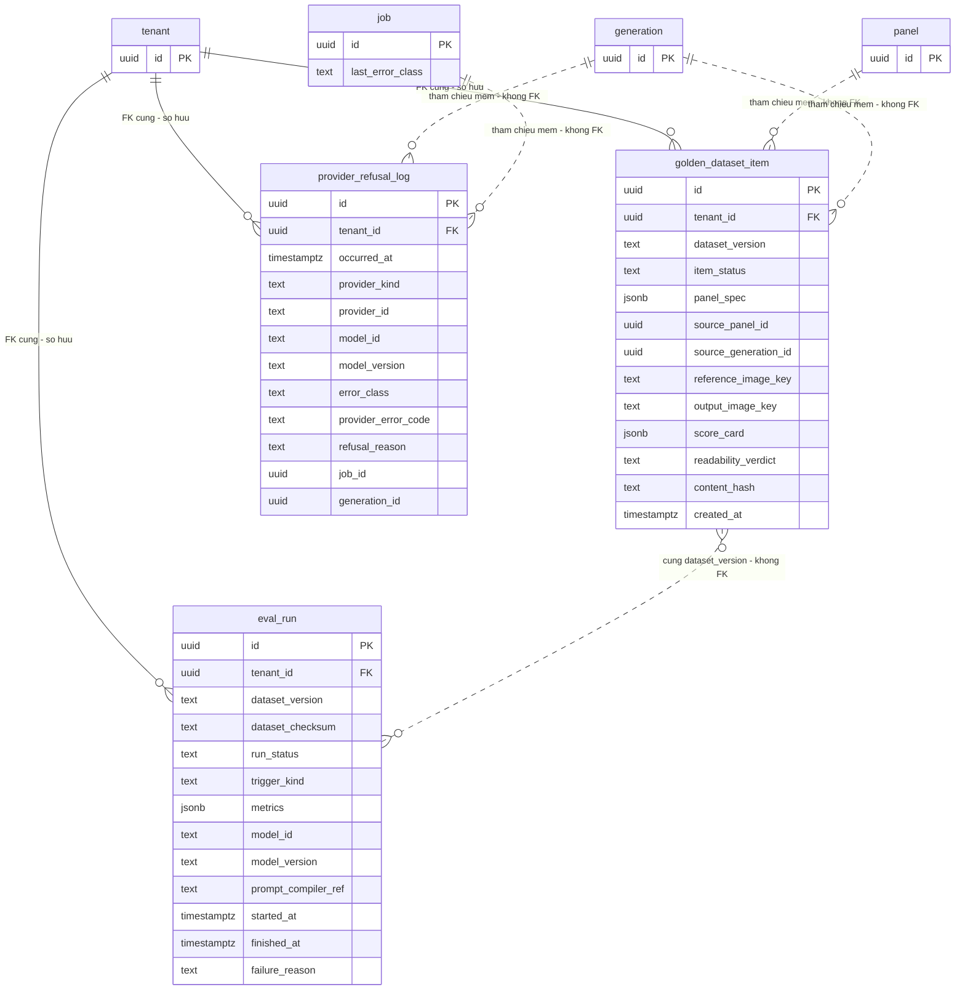

# DB Entity: Quality Assets (tài sản đo lường)

Ba bảng của schema `generation` giữ **tài sản đo lường** của hệ thống — golden dataset để phát hiện silent model drift, kết quả từng lần chạy eval kit, và log mọi lần provider từ chối vì content policy — nhóm chung vì cả ba có **vòng đời khác hẳn dữ liệu nghiệp vụ**: không thuộc một chapter cụ thể và ⛔ không bị takedown chạm tới.

**Decided in:**

- [ADR-005 — Vị trí schema cho nhóm bảng platform](../Architecture/ADR-005-Platform-Table-Schema-Placement.md) (`Q2` quy tắc phân loại · `G-3` tên đủ điều kiện · `G-4` bảng có `tenant_id` vẫn tuân `SRS-NFR-01`)
- [ADR-006 — Bơm tenant context vào session PostgreSQL cho RLS](../Architecture/ADR-006-RLS-Tenant-Context-Injection.md) (`D1`, `D2` dạng policy duy nhất)
- [ADR-007 — VLM provider cho QA-select](../Architecture/ADR-007-VLM-Provider-For-QA-Select.md) (`Q2` ghi mọi lần từ chối · `Q7` ⛔ không dùng VLM tự chấm golden dataset thay người)
- [ADR-015 — Job queue trong Postgres](../Architecture/ADR-015-Job-Queue-In-Postgres.md) (`Q5` error taxonomy mức job — ⭐ **nguồn của cách phân biệt** provider-từ-chối vs lỗi hạ tầng)
- [ADR-016 — Image provider adapter và version pinning](../Architecture/ADR-016-Image-Provider-Adapter-And-Version-Pinning.md) (phân loại lỗi **per provider** do adapter cung cấp · pin `model_id` + `model_version`)
- [ADR-018 — Mô hình `usage_event` và rollup `usage_daily`](../Architecture/ADR-018-Usage-Event-And-Rollup-Model.md) (ranh giới: đo **chi phí** ⛔ không thuộc cụm này)
- [SDD-Comic-Studio](../Architecture/SDD-Comic-Studio.md) §3.1 (ba bảng nằm ở schema `generation`) · §3.4 (ánh xạ file) · §6.4 (dòng *audit chất lượng model*) · §7.5 (job theo đồng hồ) · §8.2 `S-5` (seam âm)
- Requirement: [SRS-Comic-Studio](../../020-Requirements/SRS-Comic-Studio.md) `SRS-NFR-18`, `SRS-NFR-19`, `SRS-NFR-20`, `SRS-NFR-01`, `SRS-FR-23`
- Story: [Story-Golden-Dataset-For-Regression](../../022-User-Stories/Backlog/Story-Golden-Dataset-For-Regression.md) · [Story-HITL-Gate-And-Eval-Kit](../../022-User-Stories/Backlog/Story-HITL-Gate-And-Eval-Kit.md) · [Story-Record-Readability-Human-Judgement](../../022-User-Stories/Backlog/Story-Record-Readability-Human-Judgement.md) · [Story-Minimum-Abuse-Controls](../../022-User-Stories/Backlog/Story-Minimum-Abuse-Controls.md) · [Story-Log-Preference-Data](../../022-User-Stories/Backlog/Story-Log-Preference-Data.md)

> [!NOTE]
> **Quy ước tên** — mọi câu SQL dùng **tên đủ điều kiện** theo [ADR-005 `G-3`](../Architecture/ADR-005-Platform-Table-Schema-Placement.md): `generation.golden_dataset_item`, `generation.eval_run`, `generation.provider_refusal_log`. Sơ đồ ở [§ER Diagram](#er-diagram) dùng tên trần vì cú pháp Mermaid ⛔ không nhận dấu chấm trong tên entity.

---

## Bảng

### 1. `generation.golden_dataset_item`

**Mục đích**: mỗi dòng là **một panel** của golden dataset regression (15–20 panel, `SRS-NFR-19`), giữ đủ **spec + ref + ảnh + bảng chấm** để so sánh theo thời gian và phát hiện **silent model drift**.

| Cột | Kiểu | NULL? | Mặc định | Mô tả |
|---|---|:--:|---|---|
| `id` | `uuid` | NOT NULL | — | Khoá chính. Chiến lược sinh UUID là **quy ước chung của mọi file `DB-Entity-*`**, ⛔ file này không chốt |
| `tenant_id` | `uuid` | NOT NULL | — | Tenant sở hữu. Bắt buộc theo `SRS-NFR-01` và [ADR-005 `G-4`](../Architecture/ADR-005-Platform-Table-Schema-Placement.md) |
| `dataset_version` | `text` | NOT NULL | — | Nhãn phiên bản của **tập** dataset. ⭐ Item là **bất biến**: sửa nội dung ⇒ tạo `dataset_version` mới, ⛔ không `UPDATE` tại chỗ (`QA-1`) |
| `item_status` | `text` | NOT NULL | `'valid'` | `valid` \| `excluded_technical_error`. Panel lỗi kỹ thuật ở bước sinh ảnh bị **loại khỏi tập đếm 15–20**, ⛔ không xoá — giữ dòng để đối chiếu được *"không có phần giao nhau"* |
| `panel_spec` | `jsonb` | NOT NULL | — | Bản sao **đóng băng** của Panel Specification tại thời điểm đưa vào dataset. ⛔ Không phải con trỏ sang `comic.panel` (`QA-6`) |
| `source_panel_id` | `uuid` | NULL | — | Tham chiếu **mềm** tới `comic.panel`, ⛔ **KHÔNG FK** (`QA-6`). Chỉ để truy vết nguồn gốc |
| `source_generation_id` | `uuid` | NULL | — | Tham chiếu **mềm** tới `generation.generation`, ⛔ **KHÔNG FK** (`QA-6`) |
| `reference_image_key` | `text` | NOT NULL | — | Key object storage dạng `tenant/{tenant_id}/{sha256}`. ⛔ Không bytes trong DB (`B-4`) |
| `output_image_key` | `text` | NOT NULL | — | Key object storage của ảnh output đã sinh. Cùng ràng buộc `B-4` |
| `score_card` | `jsonb` | NOT NULL | — | **Bảng chấm**: giá trị các tiêu chí gate `G1` áp ở mức panel (`G1-a` consistency, `G1-d` attribute binding). ⭐ Do **người** chấm (`QA-11`) |
| `readability_verdict` | `text` | NOT NULL | `'not_scored'` | `ok` \| `not_ok` \| `not_scored`. ⭐ Cột **tách biệt** khỏi `score_card` — ⛔ không suy ra từ điểm kỹ thuật, ⛔ không mặc định PASS (`QA-3`) |
| `content_hash` | `text` | NOT NULL | — | Hash nội dung của item (spec + hai key ảnh + bảng chấm). Là nguyên liệu tính `eval_run.dataset_checksum` |
| `created_at` | `timestamptz` | NOT NULL | `now()` | Thời điểm item được đưa vào dataset |

- **PK**: `id`
- **FK**: `tenant_id` → `public.tenant(id)`. ⛔ **Không FK nào khác** — xem `QA-6`

### 2. `generation.eval_run`

**Mục đích**: mỗi dòng là **một lần chạy eval kit** trên một `dataset_version`, lưu bền để so sánh theo thời gian (`SRS-NFR-18`, `SRS-NFR-19`).

| Cột | Kiểu | NULL? | Mặc định | Mô tả |
|---|---|:--:|---|---|
| `id` | `uuid` | NOT NULL | — | Khoá chính |
| `tenant_id` | `uuid` | NOT NULL | — | Tenant sở hữu (`SRS-NFR-01`) |
| `dataset_version` | `text` | NOT NULL | — | Phiên bản dataset đã chạy. ⛔ Không FK sang `golden_dataset_item` — nó trỏ tới một **tập**, không tới một dòng |
| `dataset_checksum` | `text` | NOT NULL | — | Checksum tổng hợp từ `content_hash` của các item `valid` thuộc `dataset_version`, tính **tại thời điểm chạy** |
| `run_status` | `text` | NOT NULL | — | `valid` \| `invalid_dataset_mismatch` \| `failed` (`QA-7`) |
| `trigger_kind` | `text` | NOT NULL | — | `scheduled` \| `manual`. `scheduled` là đường chạy **định kỳ** của `SRS-NFR-19` — job theo đồng hồ, xem [SDD §7.5](../Architecture/SDD-Comic-Studio.md) |
| `metrics` | `jsonb` | NOT NULL | — | ⭐ **≥1 chỉ số số học tổng hợp**, ⛔ không phải mô tả định tính. Object rỗng bị chặn bởi `QA-7` |
| `model_id` | `text` | NOT NULL | — | Model đã pin khi chạy (`SRS-FR-23`, `D-40`) — điều kiện để quy trách một delta cho model |
| `model_version` | `text` | NOT NULL | — | Version pin **tường minh**. Thiếu nó thì drift ⛔ không truy được |
| `prompt_compiler_ref` | `text` | NULL | — | ⚠️ Định danh phiên bản Visual Prompt Compiler khi chạy. **Nội dung và định dạng = `TBD`** — [ADR-014](../Architecture/ADR-014-Deterministic-Prompt-Compiler-And-Best-Of-N.md) chưa định nghĩa khái niệm *version* cho compiler. Xem bảng `TBD` |
| `started_at` | `timestamptz` | NOT NULL | `now()` | Thời điểm bắt đầu chạy |
| `finished_at` | `timestamptz` | NULL | — | `NULL` khi run chưa kết thúc |
| `failure_reason` | `text` | NULL | — | Bắt buộc có giá trị khi `run_status <> 'valid'` (`QA-7`) |

- **PK**: `id`
- **FK**: `tenant_id` → `public.tenant(id)`

### 3. `generation.provider_refusal_log`

**Mục đích**: ghi **MỌI** lần provider ngoài từ chối một request **vì content policy** (`SRS-NFR-20`, `D-67`) — ⭐ tín hiệu abuse sớm gần như miễn phí, là AC của [Story-Minimum-Abuse-Controls](../../022-User-Stories/Backlog/Story-Minimum-Abuse-Controls.md).

| Cột | Kiểu | NULL? | Mặc định | Mô tả |
|---|---|:--:|---|---|
| `id` | `uuid` | NOT NULL | — | Khoá chính |
| `tenant_id` | `uuid` | NOT NULL | — | ⭐ AC bắt log phải có `tenant_id` — cũng là điều kiện để đếm được tín hiệu abuse **theo tenant** |
| `occurred_at` | `timestamptz` | NOT NULL | `now()` | ⭐ AC bắt log phải có **thời điểm** |
| `provider_kind` | `text` | NOT NULL | — | `image` \| `llm` \| `vlm`. `D-67` áp cho **cả ba** đường gọi ngoài — [ADR-016](../Architecture/ADR-016-Image-Provider-Adapter-And-Version-Pinning.md), [ADR-008](../Architecture/ADR-008-LLM-Provider-And-Usage-Boundaries.md) `Q8`, [ADR-007](../Architecture/ADR-007-VLM-Provider-For-QA-Select.md) `Q2` |
| `provider_id` | `text` | NOT NULL | — | Định danh provider/adapter đã trả về từ chối |
| `model_id` | `text` | NOT NULL | — | Model đang gọi khi bị từ chối |
| `model_version` | `text` | NULL | — | `NULL` khi đường gọi đó chưa pin version. ⚠️ Đường image đã bắt pin (`D-40`); đường LLM ⛔ chưa có ADR nào bắt |
| `error_class` | `text` | NOT NULL | `'permanent_policy'` | ⭐ **Cột phân định duy nhất.** `CHECK (error_class = 'permanent_policy')` — xem `QA-9` |
| `provider_error_code` | `text` | NULL | — | Mã lỗi **thô** do provider trả, giữ nguyên ⛔ không diễn giải lại |
| `refusal_reason` | `text` | NOT NULL | — | Lý do từ chối do adapter chuẩn hoá. ⭐ Provider ⛔ không nêu lý do ⇒ ghi giá trị **tường minh** `unspecified_by_provider`, ⛔ không để trống, ⛔ không `NULL` âm thầm |
| `job_id` | `uuid` | NULL | — | Tham chiếu **mềm** tới `public.job`, ⛔ **KHÔNG FK** (`QA-6`). `NULL` khi từ chối xảy ra ở đường API ⛔ không qua job |
| `generation_id` | `uuid` | NULL | — | Tham chiếu **mềm** tới `generation.generation`, ⛔ **KHÔNG FK**. `NULL` khi bị từ chối **trước** khi có dòng `generation` |

- **PK**: `id`
- **FK**: `tenant_id` → `public.tenant(id)`

> [!WARNING]
> ⛔ **Bảng này KHÔNG có cột chứa nội dung người dùng thô** (prompt đã gửi, đoạn văn nguồn, tên nhân vật…). Xem `QA-10` — đó chính là thứ giữ cho mệnh đề *"cụm này không bị takedown chạm tới"* **đúng**, thay vì chỉ là một mong muốn.

---

## Index

> ⚠️ `SRS-NFR-01` (`D-09`): **`tenant_id` là cột ĐẦU TIÊN của mọi composite index**. Quy tắc này được áp cho **toàn bộ** index bên dưới.
> **PK của cả ba bảng là một cột** (`id`) ⇒ ⛔ không phải composite index ⇒ không rơi vào phạm vi quy tắc cột đầu. Mọi index composite đều bắt đầu bằng `tenant_id`.

### `generation.golden_dataset_item`

| Index | Cột | Phục vụ truy vấn |
|---|---|---|
| `idx_gdi_version_status` | `(tenant_id, dataset_version, item_status)` | Đếm item `valid` của một phiên bản — phép đo *"15 ≤ số panel ≤ 20"* và phép đối chiếu *"panel lỗi kỹ thuật ⛔ không giao với dataset chính thức"* |
| `uq_gdi_version_hash` **UNIQUE** | `(tenant_id, dataset_version, content_hash)` | Cưỡng chế `QA-2` — ⛔ không hai item trùng nội dung trong cùng một phiên bản |
| `idx_gdi_readability` | `(tenant_id, readability_verdict)` | Tìm item còn `not_scored` — nghĩa vụ chấm là **liên tục**, ⛔ không dừng sau MVP0 |

### `generation.eval_run`

| Index | Cột | Phục vụ truy vấn |
|---|---|---|
| `idx_eval_version_time` | `(tenant_id, dataset_version, started_at DESC)` | ⭐ Câu truy vấn chính của `SRS-NFR-19`: **so sánh kết quả theo thời gian** trên cùng một phiên bản dataset |
| `idx_eval_status_time` | `(tenant_id, run_status, started_at DESC)` | Lọc nhanh run `invalid_dataset_mismatch` / `failed` khi chẩn đoán |

### `generation.provider_refusal_log`

| Index | Cột | Phục vụ truy vấn |
|---|---|---|
| `idx_prl_time` | `(tenant_id, occurred_at DESC)` | ⭐ Câu truy vấn abuse chính: **đếm số lần từ chối của một tenant trong một cửa sổ thời gian**. Ngưỡng số là `TBD` (`SRS-NFR-20` là hàng **LAI**: cơ chế CHỐT, ngưỡng chưa quyết) — ⛔ index ⛔ không được phụ thuộc vào giá trị ngưỡng |
| `idx_prl_kind_time` | `(tenant_id, provider_kind, occurred_at DESC)` | Tách tín hiệu theo đường gọi (`image` / `llm` / `vlm`) — ba đường có ba chính sách nội dung khác nhau |

---

## Constraint & Invariant

| Mã | Nội dung | Cưỡng chế bằng | Neo |
|---|---|---|---|
| **`QA-1`** | ⭐ **Item của golden dataset là bất biến.** Sửa spec/ref/ảnh/bảng chấm ⇒ tạo `dataset_version` **mới**, ⛔ không `UPDATE` tại chỗ. Đây là điều kiện làm cho `eval_run.dataset_checksum` và phép đo *"load hai lần cho cùng nội dung, diff = 0"* có nghĩa | `REVOKE UPDATE`/`DELETE` khỏi role ứng dụng, cùng khuôn `GR-3` của ADR-017. ⚠️ **Nhãn: lựa chọn tầng design của file này**, theo tiền lệ gắn nhãn của [ADR-015 `Q5`](../Architecture/ADR-015-Job-Queue-In-Postgres.md) | Story-Golden-Dataset (AC *"so sánh hash… diff = 0"*) |
| **`QA-2`** | ⛔ Không hai item trùng `content_hash` trong cùng `dataset_version` | `UNIQUE (tenant_id, dataset_version, content_hash)` | `QA-1` |
| **`QA-3`** | ⭐ **`readability_verdict` là cột riêng, ⛔ không suy được từ `score_card`.** Mặc định `not_scored`, ⛔ **không** PASS ngầm định. Điểm kỹ thuật ⛔ không được ghi đè hay ẩn điểm readability | `DEFAULT 'not_scored'` + `CHECK (readability_verdict IN ('ok','not_ok','not_scored'))`; ⛔ không trigger nào suy giá trị này | [Story-Record-Readability-Human-Judgement](../../022-User-Stories/Backlog/Story-Record-Readability-Human-Judgement.md) |
| **`QA-4`** | **Lịch sử chấm lại** (Founder đổi câu trả lời cho cùng một panel) ⛔ không ghi đè im lặng: mỗi lần đổi là **một hành động người dùng** ⇒ ghi vào `public.change_log` theo `KC-2`/`D-48` — cùng cơ chế mà preference data tái dùng | ⛔ **File này không định nghĩa `change_log`** — bảng đó thuộc file schema của nhóm provenance/usage (xem [SDD §3.4](../Architecture/SDD-Comic-Studio.md)) | `SRS-FR-35` · [Story-Log-Preference-Data](../../022-User-Stories/Backlog/Story-Log-Preference-Data.md) |
| **`QA-5`** | ⛔ **Không cột kiểu binary** trong cả ba bảng — ảnh chỉ tồn tại dưới dạng **key** object storage | Test CI liệt kê `information_schema.columns` (`B-4`) | [SDD §4.1 `B-4`](../Architecture/SDD-Comic-Studio.md) · `SRS-FR-02` |
| **`QA-6`** | ⭐ **⛔ Không FK cứng từ cụm này sang dữ liệu nghiệp vụ** (`comic.panel`, `generation.generation`, `public.job`). FK duy nhất là `tenant_id` → `public.tenant`. **Lý do**: vòng đời khác hẳn — takedown một chapter, dọn job cũ, hay xoá một `generation` ⛔ **không được** làm mất tài sản đo lường. Ngược lại: tham chiếu mềm có thể trỏ tới thứ đã biến mất ⇒ mọi truy vấn phải chịu được `NULL`/không phân giải được | Quy ước schema + code review. ⚠️ **Nhãn: lựa chọn tầng design của file này** | Story-Golden-Dataset (*"⛔ KHÔNG dùng dataset này làm hồ sơ pháp lý provenance"* ⇒ chiều ngược lại cũng đúng: hồ sơ nghiệp vụ ⛔ không chi phối vòng đời dataset) |
| **`QA-7`** | `eval_run` phải **fail rõ ràng**: `dataset_checksum` lệch so với kỳ vọng ⇒ `run_status = 'invalid_dataset_mismatch'`; dataset rỗng/hỏng ⇒ `run_status = 'failed'` + `failure_reason` ⛔ không `NULL`. ⛔ **Tuyệt đối không** chạy trên tập rỗng rồi báo *"100% pass"* | `CHECK (run_status IN (...))` · `CHECK (run_status = 'valid' OR failure_reason IS NOT NULL)` · `CHECK (jsonb_typeof(metrics) = 'object' AND metrics <> '{}'::jsonb)` | [Story-HITL-Gate-And-Eval-Kit](../../022-User-Stories/Backlog/Story-HITL-Gate-And-Eval-Kit.md) unhappy path |
| **`QA-8`** | ⛔ **`eval_run` KHÔNG có cột `cost_usd`** và ⛔ không mở rộng sang đo chi phí — chi phí thuộc `usage_event`/`usage_daily` ([ADR-018](../Architecture/ADR-018-Usage-Event-And-Rollup-Model.md)). ⛔ Bảng này cũng **không** giữ trạng thái human gate — đó là `comic.human_gate_state`, thuộc file schema khác | Closed list cột + code review | Story-HITL-Gate mục *"Story này KHÔNG làm"* |
| **`QA-9`** | ⭐⭐ **Phân định provider-từ-chối vs lỗi hạ tầng** — ba chân, phải đọc cùng nhau: **(a)** `CHECK (error_class = 'permanent_policy')` ⇒ bảng này **chỉ nhận đúng một lớp lỗi** của taxonomy đóng ở [ADR-015 `Q5`](../Architecture/ADR-015-Job-Queue-In-Postgres.md); **(b)** lỗi hạ tầng (`transient_infra` — DB timeout, deadlock; `transient_provider` — provider timeout, `5xx`, rate limit) sống ở `public.job.last_error_class` và ⛔ **không có đường vào bảng này**; **(c)** ⛔ `permanent_unknown` (chưa phân loại được) **KHÔNG** được ghi vào đây — *"chưa phân loại"* ⛔ không phải *"từ chối"*, ghi nhầm là **thổi phồng tín hiệu abuse**. ⇒ Phép đo *"đối chiếu log lỗi hạ tầng và log provider-reject, ⛔ không có phần giao nhau"* đúng **bằng cấu trúc**, ⛔ không nhờ kỷ luật con người | `CHECK` ở tầng DB + taxonomy đóng của ADR-015. ⚠️ **Việc phân loại do adapter cung cấp** ([ADR-016](../Architecture/ADR-016-Image-Provider-Adapter-And-Version-Pinning.md)), DB chỉ cưỡng chế **giá trị được phép** — ⛔ DB không tự suy lớp lỗi từ mã HTTP | `SRS-NFR-20` (`D-67`) · Story-Minimum-Abuse-Controls unhappy path |
| **`QA-10`** | ⛔ **`provider_refusal_log` không lưu nội dung người dùng thô.** Chỉ: định danh tenant, thời điểm, provider/model, mã lỗi thô, lý do do provider phát biểu, và **tham chiếu mềm**. Lưu prompt gốc sẽ kéo bảng này vào phạm vi takedown và **phá chính tính chất** *"vòng đời khác hẳn"* của cụm | Closed list cột + test CI trên `information_schema.columns` cùng khuôn `QA-5` | Hệ quả của `QA-6`; nhất quán với ranh giới `M9` ở [SDD §5.4](../Architecture/SDD-Comic-Studio.md) |
| **`QA-11`** | ⛔ **VLM không được tự chấm golden dataset thay người** (`D-66`). Hệ quả ở tầng schema: `score_card` và `readability_verdict` là giá trị **do người ghi**; điểm do VLM sinh ra sống ở bảng **khác** (`generation.vlm_evaluation`) và ⛔ không được ghi vào hai cột này | Ranh giới bảng + code review | `SRS-NFR-19` · [ADR-007 `Q7`](../Architecture/ADR-007-VLM-Provider-For-QA-Select.md) |
| **`QA-12`** | `eval_run` và `provider_refusal_log` là **append-only**. Một kết quả đo sửa được thì ⛔ không dùng để so sánh theo thời gian; một log abuse xoá được thì ⛔ không phải tín hiệu. Sửa sai bằng **dòng mới**, ⛔ không bằng `UPDATE` | `REVOKE UPDATE`/`DELETE`, cùng khuôn `GR-3` của ADR-017. ⚠️ **Nhãn: lựa chọn tầng design của file này** | `SRS-NFR-19`, `SRS-NFR-20` |
| **`QA-13`** | ⚠️ **Seam âm `S-5`** — file này ⛔ **không** thêm bất kỳ `UNIQUE`/FK nào khoá cardinality `generation` ⟷ `panel`. `source_panel_id` và `source_generation_id` đều là cột **mềm, nullable, không UNIQUE** ⇒ ⛔ không đóng đường đổi granularity sang whole-page render | Rà soát khi review migration | [SDD §8.2 `S-5`](../Architecture/SDD-Comic-Studio.md) · `SRS-FR-33` |

### `TBD` còn lại — và ai đóng

| Việc | Vì sao chưa đóng được ở đây | Ai đóng | Khi nào |
|---|---|---|---|
| ⚠️ **`stopped_reason` ở mức TẬP dataset** — AC của Story-Golden-Dataset đòi ghi *lý do dừng* khi MVP0 dừng giữa chừng và số panel < 15. [SDD §3.1](../Architecture/SDD-Comic-Studio.md) chốt danh sách **38 entity**, trong đó ⛔ **không có** bảng cấp *tập* dataset. Hai đường đi đều có giá (denormalize xuống từng item ⇒ nguy cơ lệch; hoặc thêm một entity ⇒ **sửa `SDD §3.1` trước**). ⛔ File này không tự chọn. *(Ghi chú: `actual_panel_count` ⛔ không cần cột — nó là `COUNT(*)` theo `dataset_version` với `item_status = 'valid'`, giữ **một** nguồn sự thật)* | Thêm bảng = mở lại closed list của SDD | Architect + PM | Trước khi migration đầu tiên của schema `generation` chạy |
| ⚠️ **Tenant nào sở hữu golden dataset của MVP0 khi nạp vào DB ở MVP1** — Story-Golden-Dataset ghi rõ MVP0 *"không DB, không tenant"*, nhưng `tenant_id NOT NULL` + RLS + job chạy định kỳ đều cần một câu trả lời. ⛔ Không tự gán một tenant hệ thống ở đây | Là quyết định vận hành, ⛔ không phải quyết định mô hình dữ liệu | Architect + PM | Trước exit criterion `M1-6` |
| ⚠️ **Nội dung và định dạng của `eval_run.prompt_compiler_ref`** — [ADR-014](../Architecture/ADR-014-Deterministic-Prompt-Compiler-And-Best-Of-N.md) ⛔ chưa định nghĩa khái niệm *version* cho Visual Prompt Compiler, nên ⛔ không có gì để trỏ tới. Cột giữ ở `NULL`-able để ⛔ không phải retrofit | Phụ thuộc một khái niệm chưa tồn tại | Architect + Engineer | Khi ADR-014 hoặc file schema của nhóm prompt/vocabulary chốt |
| ⚠️ **Ngưỡng số của tín hiệu abuse** (bao nhiêu lần từ chối trong bao lâu thì cảnh báo) — `SRS-NFR-20` là hàng **LAI**: cơ chế **CHỐT**, ngưỡng **CHƯA QUYẾT**. ⛔ Không gán số | `SRS` §5.2 cấm tự gán số | PM + Architect | Khi có dữ liệu thật từ MVP1 |

> [!NOTE]
> ⚠️ **Một xung đột của lô khác, ghi lại để ⛔ không rò sang đây**: [ADR-018](../Architecture/ADR-018-Usage-Event-And-Rollup-Model.md) và [ADR-007 `Q8`](../Architecture/ADR-007-VLM-Provider-For-QA-Select.md) để mở câu hỏi *"đo chi phí VLM ở đâu mà ⛔ không phá AC 'đúng 3 `usage_event` row'"*. Câu hỏi đó thuộc file schema của nhóm provenance/usage, ⛔ **không** thuộc cụm này — `eval_run` ⛔ không phải chỗ chữa nó (`QA-8`). *(Ghi chú tên file: ADR-007 gọi file đó là `DB-Entity-Usage-Event.md`, còn [SDD §3.4](../Architecture/SDD-Comic-Studio.md) — là ánh xạ file có thẩm quyền — gọi là `DB-Entity-Provenance-And-Usage.md`. Nêu bằng plain text để lô đó biết mà thống nhất.)*

---

## RLS Policy

Cơ chế bơm tenant context: **[ADR-006](../Architecture/ADR-006-RLS-Tenant-Context-Injection.md)** — ⛔ file này không quyết lại và ⛔ không chép lập luận.

| Điều | Nội dung |
|---|---|
| **Bật RLS** | Cả ba bảng đều có `tenant_id` ⇒ **bắt buộc** bật RLS (`SRS-NFR-01`, [ADR-005 `G-4`](../Architecture/ADR-005-Platform-Table-Schema-Placement.md)) |
| **Dạng policy** | Đúng **một** dạng theo [ADR-006 `D2`](../Architecture/ADR-006-RLS-Tenant-Context-Injection.md): `USING (tenant_id = public.current_tenant_id())`. ⛔ **Không** viết `tenant_id::text = current_setting(...)` — nó phá đúng cái index mà `SRS-NFR-01` bắt đặt `tenant_id` lên cột đầu |
| **Ngoại lệ** | ⛔ **Không có.** Cả ba bảng chịu policy tiêu chuẩn — ⛔ không carve-out, ⛔ không `BYPASSRLS` |
| ⭐ **Đường worker ghi `provider_refusal_log`** | Carve-out xuyên tenant của role `app_worker` chỉ tồn tại **trên `public.job`** ([ADR-006 `D4.1`](../Architecture/ADR-006-RLS-Tenant-Context-Injection.md)). Worker ghi dòng từ chối **sau khi** đã claim job và `SET LOCAL app.current_tenant` ⇒ dòng đó rơi vào policy tiêu chuẩn như mọi bảng nghiệp vụ. ⛔ Không cần và ⛔ không được cấp thêm đặc quyền nào cho bảng này |
| ⚠️ **Đường job theo đồng hồ** | Eval kit chạy **định kỳ** (`trigger_kind = 'scheduled'`, [SDD §7.5](../Architecture/SDD-Comic-Studio.md)) ⇒ nó cũng ⛔ không có HTTP request. Nó phải bind tenant context **tường minh** trước khi đọc/ghi, cùng khuôn `D4.2`. ⚠️ Tenant nào thì gắn với hàng `TBD` ở trên |
| **Lớp phòng thủ** | RLS là lớp **thứ hai** (`D-10`). ⛔ **Không** bỏ `WHERE tenant_id = ...` ở tầng ứng dụng vì *"đã có RLS"* |

---

## ER Diagram

**Cách đọc sơ đồ:**

| Ký hiệu | Nghĩa |
|---|---|
| Nét **liền** (`||--o{`) | FK **cứng** ở tầng DB. ⭐ Chỉ có **ba** đường, và cả ba đều đi tới `public.tenant` |
| Nét **đứt** (`||..o{`, `}o..o{`) | Tham chiếu **mềm**: cột `uuid`/`text` ⛔ **không có** FK — biểu diễn trực tiếp của `QA-6` |
| `tenant`, `panel`, `generation`, `job` | Vẽ ở mức **khung** (chỉ khoá) — chúng thuộc **file schema khác**, ⛔ file này không đặc tả |
| Tên trần | Tên đủ điều kiện: `public.tenant`, `comic.panel`, `generation.generation`, `public.job`, `generation.golden_dataset_item`, `generation.eval_run`, `generation.provider_refusal_log` |

⚠️ **Thứ ⛔ KHÔNG có trên sơ đồ này, và đó là điều cố ý**: ⛔ không đường nào nối `provider_refusal_log` với lớp lỗi hạ tầng. Lỗi hạ tầng sống trên `public.job.last_error_class` (vẽ để thấy nó **ở ngoài**) và ⛔ không có đường vào bảng từ chối — xem `QA-9`.

---

## Tài liệu tham khảo

| Tài liệu | Dùng cho phần nào |
|---|---|
| [SDD-Comic-Studio](../Architecture/SDD-Comic-Studio.md) | §3.1 vị trí schema · §3.4 ánh xạ file · §4.1 `B-4` · §4.2 bảng invariant · §6.4 audit chất lượng model · §7.5 job theo đồng hồ · §8.2 `S-5` |
| [ADR-005 — Platform Table Schema Placement](../Architecture/ADR-005-Platform-Table-Schema-Placement.md) | `G-3` tên đủ điều kiện · `G-4` `tenant_id` + RLS |
| [ADR-006 — RLS Tenant Context Injection](../Architecture/ADR-006-RLS-Tenant-Context-Injection.md) | Toàn bộ mục RLS Policy |
| [ADR-007 — VLM Provider For QA-Select](../Architecture/ADR-007-VLM-Provider-For-QA-Select.md) | `Q2` ghi mọi lần từ chối · `Q7` ⛔ không VLM tự chấm · `Q8` ranh giới đo chi phí |
| [ADR-008 — LLM Provider And Usage Boundaries](../Architecture/ADR-008-LLM-Provider-And-Usage-Boundaries.md) | `Q8` — `D-67` áp cho cả đường LLM |
| [ADR-015 — Job Queue In Postgres](../Architecture/ADR-015-Job-Queue-In-Postgres.md) | `Q5` error taxonomy — nguồn của `QA-9` |
| [ADR-016 — Image Provider Adapter And Version Pinning](../Architecture/ADR-016-Image-Provider-Adapter-And-Version-Pinning.md) | Phân loại lỗi per provider · pin `model_id`/`model_version` |
| [ADR-017 — Provenance Chain And One Transaction Boundary](../Architecture/ADR-017-Provenance-Chain-And-One-Transaction-Boundary.md) | `GR-3` — khuôn cưỡng chế append-only |
| [ADR-018 — Usage Event And Rollup Model](../Architecture/ADR-018-Usage-Event-And-Rollup-Model.md) | Ranh giới: đo chi phí ⛔ không thuộc cụm này |
| [SRS-Comic-Studio](../../020-Requirements/SRS-Comic-Studio.md) | `SRS-NFR-01` · `SRS-NFR-18` · `SRS-NFR-19` · `SRS-NFR-20` · `SRS-FR-02` · `SRS-FR-23` · `SRS-FR-33` · `SRS-FR-35` |
| [Story-Golden-Dataset-For-Regression](../../022-User-Stories/Backlog/Story-Golden-Dataset-For-Regression.md) | Cấu trúc `golden_dataset_item` · `QA-1`, `QA-2` |
| [Story-HITL-Gate-And-Eval-Kit](../../022-User-Stories/Backlog/Story-HITL-Gate-And-Eval-Kit.md) | Cấu trúc `eval_run` · `QA-7`, `QA-8` |
| [Story-Record-Readability-Human-Judgement](../../022-User-Stories/Backlog/Story-Record-Readability-Human-Judgement.md) | `readability_verdict` · `QA-3`, `QA-4` |
| [Story-Minimum-Abuse-Controls](../../022-User-Stories/Backlog/Story-Minimum-Abuse-Controls.md) | Cấu trúc `provider_refusal_log` · ⭐ `QA-9` |
| [Story-Log-Preference-Data](../../022-User-Stories/Backlog/Story-Log-Preference-Data.md) | `QA-4` — lịch sử chấm lại đi qua `change_log` |

---

_Created by architect_
_Author: trisjr_
