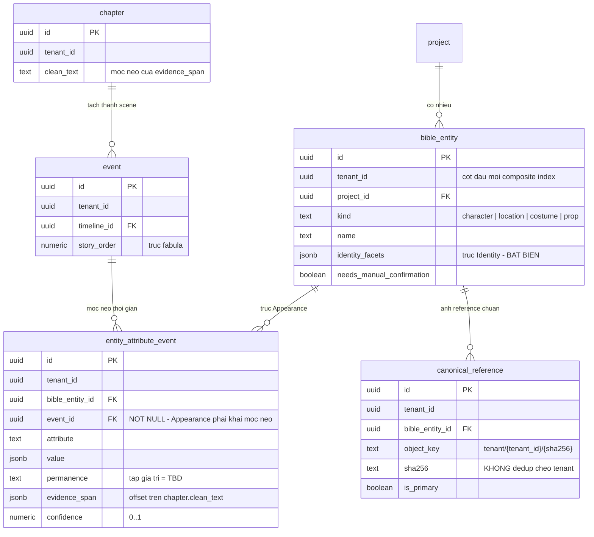

# DB Entity: Story Bible

Cụm ba bảng `story.bible_entity` · `story.entity_attribute_event` · `story.canonical_reference` tồn tại để giữ **ranh giới quyền lực**: *"LLM chỉ phát event, **code sở hữu state**"* — `state_at(N) = reduce(events where story_order <= N)` chỉ có nghĩa khi cả ba bảng nằm cùng một chỗ, tách ra là mất chính ràng buộc đó.

**Decided in:**

- [ADR-011 — Khoá thời gian tự sự và mô hình rút gọn trạng thái](../Architecture/ADR-011-Narrative-Time-Key-And-State-Reduction.md) — `D6` (`reduce` là hàm thuần), `D7` (LLM chỉ phát event), `D8` (đúng một `resolveState()`), `D9`–`D11`, `D12` (hai trục Identity/Appearance), `D13` (thẩm quyền của lô này)
- [ADR-009 — Modular monolith, ba schema](../Architecture/ADR-009-Modular-Monolith-Three-Schemas.md) — `B-1`: `comic` gọi `story` **chỉ** qua `resolveState()` và `getBible()`
- [ADR-010 — Cô lập tenant bằng `tenant_id` + RLS](../Architecture/ADR-010-Tenant-Isolation-With-RLS.md) — `D1`, `D2`, `D3`
- [ADR-006 — RLS & tenant context injection](../Architecture/ADR-006-RLS-Tenant-Context-Injection.md) — `D2`
- [ADR-017 — Provenance chain & one transaction boundary](../Architecture/ADR-017-Provenance-Chain-And-One-Transaction-Boundary.md) — `Q3` (**`origin` ở mức FIELD**, sống trong `public.field_provenance`)
- [ADR-004 — Object storage vendor & signed URL](../Architecture/ADR-004-Object-Storage-Vendor-And-Signed-URL.md) — khoá object, TTL
- [SDD Comic Studio](../Architecture/SDD-Comic-Studio.md) — §3.2, §4.1 `B-1`/`B-4`, §4.2

> [!IMPORTANT]
> ⭐ **Cụm này KHÔNG chứa bảng state — và đó là điểm chính của nó.**
> `D6` chốt state được **tính**, ⛔ **không được lưu sẵn**. `story.entity_attribute_event` là **input duy nhất** của `reduce()`. Nếu một run sau thêm một bảng kiểu `entity_state` / `bible_snapshot`, đó là **vi phạm `D6`**, ⛔ không phải một tối ưu hoá.

---

## Bảng

### `story.bible_entity`

Nhân vật / địa điểm / trang phục / prop — ⭐ đây là nơi trục **Identity** (bất biến qua các chương) sống.

| Cột | Kiểu | NULL? | Mặc định | Mô tả |
|---|---|:--:|---|---|
| `id` | `UUID` | ⛔ | `gen_random_uuid()` | Khoá chính |
| `tenant_id` | `UUID` | ⛔ | — | `SRS-NFR-01` |
| `project_id` | `UUID` | ⛔ | — | Tác phẩm cha |
| `kind` | `TEXT` | ⛔ | — | `CHECK (kind IN ('character','location','costume','prop'))` — ⛔ **không** Postgres enum type ([`E15`](../../010-Planning/pm-runs/2026-08-28-phase-2-architecture-design-comic-studio/escalations.md)). Prop quan trọng là **entity riêng**, ⛔ không mô tả bằng chữ trong panel spec |
| `name` | `TEXT` | ⛔ | — | Tên hiển thị |
| `aliases` | `TEXT[]` | ⛔ | `'{}'` | Biệt danh / cách gọi khác gặp trong văn bản |
| `identity_facets` | `JSONB` | ⛔ | `'{}'` | ⭐ **Trục Identity** — thuộc tính **bất biến** (cấu trúc khuôn mặt, dấu hiệu nhận dạng). ⛔ Không chứa trang phục / vết thương / tóc |
| `needs_manual_confirmation` | `BOOLEAN` | ⛔ | `false` | Entity do extraction sinh ra nhưng chưa được người xác nhận ([Story-Story-Bible-Extraction](../../022-User-Stories/Backlog/Story-Story-Bible-Extraction.md) AC) |
| `created_at` | `TIMESTAMPTZ` | ⛔ | `now()` | — |
| `updated_at` | `TIMESTAMPTZ` | ⛔ | `now()` | — |

- **Khoá chính**: `(id)`
- **Khoá ngoại**: `(tenant_id, project_id) → story.project(tenant_id, id)`
- ⛔ **Không có cột `origin`.** `origin` là thuộc tính **mức FIELD** và sống ở `public.field_provenance` ([ADR-017 `Q3`](../Architecture/ADR-017-Provenance-Chain-And-One-Transaction-Boundary.md)). Thêm một cột `origin` cục bộ ở đây là tạo **nguồn sự thật thứ hai**.
- ⛔ **Không có cột mô tả tự do gộp Identity + Appearance.** `D12` gọi việc gộp là *"nguyên nhân của phần lớn lỗi consistency"*.
- ⛔ **Không có cột *"đã duyệt"* ở bảng này.** Trạng thái *"bible của chương đã duyệt"* (`SB-7` · `UC-02` bước 12) sống ở **`story.chapter.bible_approved_at`** (`TIMESTAMPTZ` nullable — [`DB-Entity-Narrative-Timeline.md`](./DB-Entity-Narrative-Timeline.md), `INV-14`). ⭐ **Lý do là ĐỘ HẠT**: `SB-7` duyệt theo **chapter** (`POST /v1/chapters/{chapter_id}/bible:approve`), còn `bible_entity` thuộc **project** và sống **xuyên nhiều chương** ⇒ đặt cột duyệt ở đây là sai độ hạt và tạo nguồn sự thật thứ hai.

### `story.entity_attribute_event`

⭐ Event do LLM phát — **trục Appearance**, và là **input duy nhất** của `reduce()`.

| Cột | Kiểu | NULL? | Mặc định | Mô tả |
|---|---|:--:|---|---|
| `id` | `UUID` | ⛔ | `gen_random_uuid()` | Khoá chính |
| `tenant_id` | `UUID` | ⛔ | — | `SRS-NFR-01` |
| `project_id` | `UUID` | ⛔ | — | Phạm vi kiểm nhất quán entity ↔ event (`INV-3` của cụm timeline) |
| `bible_entity_id` | `UUID` | ⛔ | — | Entity bị tác động |
| `event_id` | `UUID` | ⛔ | — | ⭐ Event neo. `NOT NULL` là cưỡng chế của `D12`: *"thuộc tính Appearance **phải khai** nó neo vào event nào"* |
| `attribute` | `TEXT` | ⛔ | — | Tên thuộc tính (`D7` payload) |
| `value` | `JSONB` | ⛔ | — | Giá trị mới của thuộc tính (`D7` payload) |
| `permanence` | `TEXT` | ⛔ | — | Độ bền của thay đổi (`D7` payload). ⚠️ **Tập giá trị hợp lệ = `TBD`** — xem bảng `TBD` |
| `evidence_span` | `JSONB` | ⛔ | — | Trỏ về văn bản gốc (`D7` payload). Hình dạng: `{"chapter_id": <uuid>, "start": <int>, "end": <int>}`, offset **nửa mở** trên `story.chapter.clean_text` — `[Kiến trúc suy luận]`, xem `INV-6` |
| `confidence` | `NUMERIC` | ⛔ | — | Độ tin của LLM, `0..1` (`D7` payload) |
| `created_at` | `TIMESTAMPTZ` | ⛔ | `now()` | — |

- **Khoá chính**: `(id)`
- **Khoá ngoại**: `(tenant_id, bible_entity_id, project_id) → story.bible_entity(tenant_id, id, project_id)` · `(tenant_id, event_id, project_id) → story.event(tenant_id, id, project_id)`
- ⛔ **Không có cột `story_order` hay `timeline_id` ở đây.** Xem `INV-2` — denormalize hai trục xuống bảng này là tạo **cache lệch nguồn**, vi phạm `D11`.

### `story.canonical_reference`

Ảnh reference chuẩn của một entity — dùng làm `conditioning_set` khi sinh ảnh.

| Cột | Kiểu | NULL? | Mặc định | Mô tả |
|---|---|:--:|---|---|
| `id` | `UUID` | ⛔ | `gen_random_uuid()` | Khoá chính |
| `tenant_id` | `UUID` | ⛔ | — | `SRS-NFR-01` |
| `project_id` | `UUID` | ⛔ | — | Tác phẩm cha |
| `bible_entity_id` | `UUID` | ⛔ | — | Entity được tham chiếu |
| `object_key` | `TEXT` | ⛔ | — | ⭐ Khoá object storage, **bắt buộc dạng** `tenant/{tenant_id}/{sha256}` (`B-4`) |
| `sha256` | `TEXT` | ⛔ | — | Digest của bytes, dùng để đối chiếu — ⛔ **không** dùng để dedup chéo tenant |
| `mime_type` | `TEXT` | ⛔ | — | Kiểu nội dung |
| `is_primary` | `BOOLEAN` | ⛔ | `false` | Reference chính của entity |
| `created_at` | `TIMESTAMPTZ` | ⛔ | `now()` | — |

- **Khoá chính**: `(id)`
- **Khoá ngoại**: `(tenant_id, bible_entity_id, project_id) → story.bible_entity(tenant_id, id, project_id)`
- ⛔ **Không cột `bytea`/`blob`.** Bytes ảnh **chỉ** nằm ở object storage (`B-4`).

---

## Index

> ⚠️ **`tenant_id` PHẢI là cột ĐẦU TIÊN của MỌI composite index** (`SRS-NFR-01`, [ADR-010 `D2`](../Architecture/ADR-010-Tenant-Isolation-With-RLS.md)).

| Bảng | Index | Kiểu | Phục vụ truy vấn |
|---|---|---|---|
| `story.bible_entity` | `(id)` | PK | — |
| `story.bible_entity` | `(tenant_id, id)` | UNIQUE | ⭐ Đích của FK từ `comic.panel_character` và `comic.dialogue_line.speaker_id` — xem `INV-5` |
| `story.bible_entity` | `(tenant_id, id, project_id)` | UNIQUE | Đích của composite FK trong cùng schema |
| `story.bible_entity` | `(tenant_id, project_id, kind)` | BTREE | `getBible()` liệt kê entity theo loại |
| `story.bible_entity` | `(tenant_id, project_id, needs_manual_confirmation)` | BTREE | Màn hình *"cần xác nhận thủ công"* của `UC-02` |
| `story.entity_attribute_event` | `(id)` | PK | — |
| `story.entity_attribute_event` | `(tenant_id, bible_entity_id, event_id)` | BTREE | ⭐ **Vế thứ nhất của `reduce`** — lấy toàn bộ event thuộc tính của một entity |
| `story.entity_attribute_event` | `(tenant_id, event_id)` | BTREE | Xoá/sửa một event ⇒ tìm ngay các attribute event neo vào nó (`D11`) |
| `story.canonical_reference` | `(id)` | PK | — |
| `story.canonical_reference` | `(tenant_id, object_key)` | UNIQUE | Một object của một tenant chỉ đăng ký một lần. ⛔ **Không** UNIQUE trên `sha256` toàn cục — đó chính là dedup chéo tenant bị cấm |
| `story.canonical_reference` | `(tenant_id, bible_entity_id, is_primary)` | BTREE | Lấy reference chính khi dựng `conditioning_set` |

> [!WARNING]
> ⛔ **KHÔNG tạo UNIQUE trên `(tenant_id, project_id, lower(name))` của `bible_entity`.**
> [Story-Story-Bible-Extraction](../../022-User-Stories/Backlog/Story-Story-Bible-Extraction.md) ký nguyên văn: chapter có tên nhân vật viết hoa/thường không nhất quán khiến extraction tách một người thành hai entity ⇒ *"hệ thống **không** tự động merge âm thầm; **cả hai** entity vẫn tồn tại và truy vấn được"*. Một unique index case-insensitive sẽ **từ chối** entity thứ hai ⇒ **phá đúng AC đó**. Trùng tên được xử lý bằng `needs_manual_confirmation` + `UC-02`, ⛔ không bằng constraint.

**Vế thứ hai của `reduce`** — lọc theo `timeline_id` + `story_order <= N` — được phục vụ bởi index `(tenant_id, timeline_id, story_order)` của `story.event` (xem [`DB-Entity-Narrative-Timeline.md`](./DB-Entity-Narrative-Timeline.md)). ⇒ `reduce` là **một join hai index**, ⛔ không phải một quét bảng.

---

## Constraint & Invariant

| ID | Ràng buộc | Cưỡng chế bằng | Neo |
|---|---|---|---|
| `INV-1` | ⭐ **⛔ Không tồn tại bảng state.** `state_at(N)` là **hàm thuần** trên tập event, ⛔ không có đường code nào cho LLM ghi trực tiếp vào state | Vắng mặt bảng + rà soát quyền ghi ở tầng schema/service ([Story-Timeline-State-Resolver](../../022-User-Stories/Backlog/Story-Timeline-State-Resolver.md) AC) | `D6`, `D7` |
| `INV-2` | ⭐ **⛔ Không denormalize `story_order`/`timeline_id` xuống `entity_attribute_event`.** `[Kiến trúc suy luận]` — `story_order` **editable qua UI** (`D2`); một bản sao ở bảng con sẽ lệch ngay lần biên tập đầu tiên, và `D11` cấm *"cache lệch nguồn"*. Hai trục **chỉ** sống ở `story.event` | Quy ước schema + review DDL | `D2`, `D11` |
| `INV-3` | `entity_attribute_event.event_id` là `NOT NULL` — thuộc tính **Appearance phải khai** nó neo vào event nào; thuộc tính **Identity** thì ⛔ không neo (nó nằm ở `bible_entity.identity_facets`) | `NOT NULL` + tách bảng | `D12` · `UC-02` bước 7 |
| `INV-4` | `confidence` nằm trong `[0,1]` | `CHECK (confidence >= 0 AND confidence <= 1)` | `D7` |
| `INV-5` | ⭐ **FK chéo schema `comic → story` là ràng buộc TOÀN VẸN, ⛔ KHÔNG phải một đường truy vấn.** `B-1` cấm module `comic` **truy vấn** bảng schema `story` (cưỡng chế bằng lint rule ở CI); nó ⛔ **không** cấm khoá ngoại. Ngược lại, [ADR-012 hợp đồng #4](../Architecture/ADR-012-Comic-IR-Spec-As-Primary-Data.md) **bắt buộc** spec tham chiếu `character_id` không tồn tại phải bị từ chối **tại thời điểm ghi** ⇒ FK là cách duy nhất đạt được điều đó ở tầng DB. Đọc dữ liệu vẫn **chỉ** qua `resolveState()`/`getBible()` | FK `(tenant_id, bible_entity_id) → story.bible_entity(tenant_id, id)` + lint rule của `B-1` | `D8` · `B-1` · `ADR-012` hợp đồng #4 |
| `INV-6` | `evidence_span` là offset trên `story.chapter.clean_text` ⇒ `clean_text` **bất biến trên thực tế** sau khi có span trỏ vào. Nạp lại chapter = **row `chapter` mới** + đánh dấu `superseded`, ⛔ không `UPDATE` tại chỗ | Xem `INV-7` của [`DB-Entity-Narrative-Timeline.md`](./DB-Entity-Narrative-Timeline.md) | `UC-01` `ALT-3`, `EXC-5` |
| `INV-7` | `object_key` **luôn mang `tenant_id` ở tiền tố**; ⛔ không dedup chéo tenant; ⛔ không bucket public | `CHECK (object_key LIKE 'tenant/' \|\| tenant_id::text \|\| '/%')` + ⛔ không UNIQUE toàn cục trên `sha256` | `B-4` · `SRS-FR-02` · [Story-Per-Tenant-Object-Storage-No-Cross-Dedup](../../022-User-Stories/Backlog/Story-Per-Tenant-Object-Storage-No-Cross-Dedup.md) |
| `INV-8` | ⛔ **Không TTL / eviction tự động** trên object mà `canonical_reference` trỏ tới | Chính sách vận hành object storage (`ADR-004`) — ⛔ không phải một cột | [ADR-012 `## Context` (a)](../Architecture/ADR-012-Comic-IR-Spec-As-Primary-Data.md) · `SRS-NFR-13` |
| `INV-9` | ⛔ Không cột kiểu binary trong ba bảng này | Test CI trên `information_schema.columns` | `B-4` |
| `INV-10` | Mỗi hành động người dùng trên Story Bible (sửa entity, xác nhận, gộp thủ công) sinh **một** `change_log` row, commit **cùng transaction** | ⭐ Nguồn duy nhất: [ADR-017 `Q2`](../Architecture/ADR-017-Provenance-Chain-And-One-Transaction-Boundary.md) và [`Q4.1`](../Architecture/ADR-017-Provenance-Chain-And-One-Transaction-Boundary.md) — ⛔ file này **không đặc tả lại** | `SRS-FR-35` · `KC-2`, `KC-4` |

**Seam đọc — nhắc lại, ⛔ không quyết lại**: `resolveState(entity, at_event)` và `getBible()` là **API duy nhất** để module `comic` đọc dữ liệu của cụm này (`D8`). ⭐ **ĐÚNG MỘT** hàm `resolveState()` trong toàn hệ thống; guardrail test: ⛔ **không được có `ORDER BY chapter_no`** trong bất kỳ đường resolve state nào (`D-17`).

### `TBD` còn lại — ⛔ không được bịa

| Khoảng trống | Ai đóng | Khi nào |
|---|---|---|
| **Tập giá trị hợp lệ của `permanence`** — nguồn chỉ liệt kê nó là một field của event payload, ⛔ không liệt kê giá trị ([ADR-011 mục `TBD`](../Architecture/ADR-011-Narrative-Time-Key-And-State-Reduction.md)). ⇒ Lô này để `TEXT` ⛔ chưa có `CHECK`; khi chốt sẽ siết thành `CHECK (permanence IN (…))` + migration backfill — ⛔ **không** Postgres enum type ([`E15`](../../010-Planning/pm-runs/2026-08-28-phase-2-architecture-design-comic-studio/escalations.md)) | **BA + Architect** (cần chốt cùng ngữ nghĩa nghiệp vụ) | Trước khi `Story-Story-Bible-Extraction` vào Active Sprint |
| Quy tắc `reduce` khi **hai attribute event cùng entity, cùng attribute, cùng `story_order`** ở **cùng** timeline — `INV-4` của cụm timeline khiến trường hợp này ⛔ không xảy ra ở mức `event`, nhưng hai attribute event **khác nhau** vẫn có thể neo vào **cùng một** event | **Architect + BA**, khi đặc tả `resolveState()` | Trước khi `Story-Timeline-State-Resolver` vào Active Sprint |
| Ngưỡng `confidence` để bật `needs_manual_confirmation` tự động — ⛔ **không có số đo nào trong repo**; `M1-3` (`≥80%`) là ngưỡng **độ phủ extraction**, ⛔ không phải ngưỡng confidence từng entity | **BA + Founder**, sau MVP1 có số đo thật | Trước gate `M1-3` |

---

## RLS Policy

> ⭐ **Cơ chế là nguồn duy nhất ở [ADR-006](../Architecture/ADR-006-RLS-Tenant-Context-Injection.md)** (`D1`, `D2`). ⛔ File này không quyết lại.

```sql
ALTER TABLE story.bible_entity ENABLE ROW LEVEL SECURITY;
ALTER TABLE story.bible_entity FORCE  ROW LEVEL SECURITY;

CREATE POLICY p_bible_entity_tenant ON story.bible_entity
  USING      (tenant_id = public.current_tenant_id())
  WITH CHECK (tenant_id = public.current_tenant_id());
```

Lặp **y hệt** cho `story.entity_attribute_event` và `story.canonical_reference`.

| Điểm | Quy tắc |
|---|---|
| `app_api` | `SELECT, INSERT, UPDATE, DELETE` trên cả ba bảng |
| `app_worker` | `SELECT` trên cả ba bảng (dựng `conditioning_set`, compile prompt). ⭐ **`INSERT` trên `story.entity_attribute_event`** — worker là nơi pipeline extraction chạy và `D7` cho phép LLM **phát event**; ⛔ **không** `UPDATE`/`DELETE` |
| `app_public_intake` | ⛔ Không quyền nào |
| ⚠️ Cưỡng chế `D7` ở tầng quyền | ⭐ Vì ⛔ **không tồn tại bảng state** (`INV-1`), *"LLM không có đường ghi state"* là một **thuộc tính cấu trúc**, không phải một `GRANT` phải nhớ. Đây là lý do `INV-1` đáng giá hơn mọi policy viết thêm |
| ⛔ Cấm tuyệt đối | Không `BYPASSRLS` cho role ứng dụng (`ADR-006 D4.3`) |

⚠️ **RLS là lớp phòng thủ THỨ HAI** — code vẫn phải viết `WHERE tenant_id = ...` (`SRS-NFR-01`).

---

## ER Diagram



**Chú giải**: mọi entity thuộc schema **`story`** (`story.bible_entity`, `story.entity_attribute_event`, `story.canonical_reference`). `event` và `chapter` vẽ ở dạng rút gọn — đặc tả đầy đủ ở [`DB-Entity-Narrative-Timeline.md`](./DB-Entity-Narrative-Timeline.md). ⛔ **Không có node state** — đó là chủ ý của `D6`.

---

## Tài liệu tham khảo

- [ADR-011 — Narrative Time Key And State Reduction](../Architecture/ADR-011-Narrative-Time-Key-And-State-Reduction.md)
- [ADR-009 — Modular Monolith Three Schemas](../Architecture/ADR-009-Modular-Monolith-Three-Schemas.md)
- [ADR-010 — Tenant Isolation With RLS](../Architecture/ADR-010-Tenant-Isolation-With-RLS.md)
- [ADR-006 — RLS Tenant Context Injection](../Architecture/ADR-006-RLS-Tenant-Context-Injection.md)
- [ADR-017 — Provenance Chain And One Transaction Boundary](../Architecture/ADR-017-Provenance-Chain-And-One-Transaction-Boundary.md) — `Q2`, `Q3`, `Q4.1`
- [ADR-012 — Comic IR Spec As Primary Data](../Architecture/ADR-012-Comic-IR-Spec-As-Primary-Data.md) — hợp đồng #4
- [ADR-004 — Object Storage Vendor And Signed URL](../Architecture/ADR-004-Object-Storage-Vendor-And-Signed-URL.md)
- [SDD Comic Studio](../Architecture/SDD-Comic-Studio.md) — §3.2, §4.1, §4.2
- [DB-Entity-Narrative-Timeline.md](./DB-Entity-Narrative-Timeline.md) · [DB-Entity-Comic-IR.md](./DB-Entity-Comic-IR.md)
- [UC-02 — Review And Edit Story Bible](../../020-Requirements/Use-Cases/UC-02-Review-And-Edit-Story-Bible.md) — bước 3, 6, 7
- [Story-Story-Bible-Extraction](../../022-User-Stories/Backlog/Story-Story-Bible-Extraction.md) · [Story-Timeline-State-Resolver](../../022-User-Stories/Backlog/Story-Timeline-State-Resolver.md) · [Story-Per-Tenant-Object-Storage-No-Cross-Dedup](../../022-User-Stories/Backlog/Story-Per-Tenant-Object-Storage-No-Cross-Dedup.md)
- [SRS Comic Studio](../../020-Requirements/SRS-Comic-Studio.md) — `SRS-FR-02`, `SRS-FR-05`, `SRS-FR-35`, `SRS-NFR-01`, `SRS-NFR-04`, `SRS-NFR-10`, `SRS-NFR-13`

---

_Created by System Architect — lô L8, Phase 2._
_Author: trisjr_
