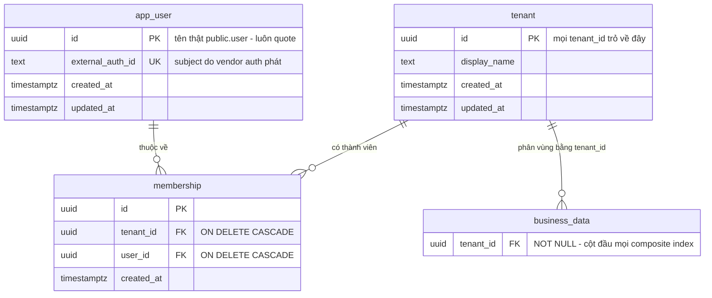

# DB Entity: Tenancy

Đặc tả ba bảng định danh `public.tenant`, `public."user"`, `public.membership` — đơn vị cô lập dữ liệu của toàn hệ thống, và là chỗ mọi `tenant_id` trong 12 file schema còn lại trỏ về.

> [!IMPORTANT]
> ⚠️ **Tên đủ điều kiện bắt buộc**: `public.tenant`, `public."user"`, `public.membership` ([ADR-005 `Q1`](../Architecture/ADR-005-Platform-Table-Schema-Placement.md), guardrail `G-3`). ⛔ Không dựa vào `search_path`.
>
> ⭐ **`user` là TỪ KHOÁ SQL** — xem [Quy tắc quoting bắt buộc](#-quy-tắc-quoting-bắt-buộc-cho-publicuser). Sai chỗ này thì **migration số 1 ⛔ không chạy được**.

## Decided in

| Nguồn | Nội dung kế thừa |
|---|---|
| ⭐ [ADR-010 — Tenant Isolation With RLS](../Architecture/ADR-010-Tenant-Isolation-With-RLS.md) | `D1` `tenant_id NOT NULL` mọi bảng nghiệp vụ · `D2` `tenant_id` là cột **đầu tiên** mọi composite index · `D3` RLS bật trên 100% bảng có `tenant_id` · `D4` shared DB + shared schema · `D5` ⛔ cấm isolation bằng filter tầng ứng dụng · `D6` **ba entity riêng** · ⭐ `D7` **hai đường xoá TÁCH BIỆT** · `D8` DoD là test nhị phân `M1-1` · `D9` ba hành vi biên |
| [ADR-005 — Platform Table Schema Placement](../Architecture/ADR-005-Platform-Table-Schema-Placement.md) | `Q1` ba bảng thuộc `public` · `Q3` guardrail `G-1`…`G-4` · ⭐ `Q4` **route policy RLS của ba bảng này sang lô DB Schema** |
| [ADR-006 — RLS Tenant Context Injection](../Architecture/ADR-006-RLS-Tenant-Context-Injection.md) | `D2` hàm `public.current_tenant_id()` · `D3` hàm `SECURITY DEFINER` phân giải `user → tenant` · `D6` bề mặt **không có tenant** · `D7` migration |
| [ADR-003 — Auth And Billing Vendor Selection](../Architecture/ADR-003-Auth-And-Billing-Vendor-Selection.md) | Vendor auth sở hữu định danh; bảng `user` của ta giữ **`external_auth_id`** có `UNIQUE`; ⛔ không FK nghiệp vụ nào trỏ vào định danh vendor |
| [SDD §3.3, §3.4, §4.2, §6.1, §7.4, §9.2 `P-3`](../Architecture/SDD-Comic-Studio.md) | Vị trí bảng · ràng buộc cưỡng chế tầng DB · tenant context · **bốn DB role** |
| Requirement gốc | `SRS-FR-01`, `SRS-NFR-01`, `SRS-NFR-05`, `SRS-NFR-08`, `SRS-NFR-20` |
| Story | [Story-Tenant-User-Membership-As-Three-Entities](../../022-User-Stories/Backlog/Story-Tenant-User-Membership-As-Three-Entities.md) · [Story-Tenant-Id-And-RLS-Everywhere](../../022-User-Stories/Backlog/Story-Tenant-Id-And-RLS-Everywhere.md) · [Story-ToS-User-Warrant-And-Tenant-Hard-Delete](../../022-User-Stories/Backlog/Story-ToS-User-Warrant-And-Tenant-Hard-Delete.md) · ⭐ [Story-Minimum-Abuse-Controls](../../022-User-Stories/Backlog/Story-Minimum-Abuse-Controls.md) |

> [!NOTE]
> **File này đóng hàng `P-3`** của [SDD §9.2](../Architecture/SDD-Comic-Studio.md) — phần policy RLS cho `public.tenant` / `public."user"` / `public.membership` (phần `public.takedown_request` đóng ở [`DB-Entity-Compliance-And-Takedown.md`](./DB-Entity-Compliance-And-Takedown.md)).
> **Và** đóng **quyết định rate limit cho `generate`** — xem [mục riêng](#-rate-limit-cho-generate--state-sống-ở-đâu).

---

## ⚠️ Quy tắc quoting bắt buộc cho `public."user"`

`user` là **từ khoá reserved của SQL và của PostgreSQL** (`USER` là một hàm-từ-khoá dựng sẵn, tương đương `current_user`). Hệ quả **cứng**:

| Viết thế nào | Kết quả |
|---|---|
| `CREATE TABLE user (…)` | ❌ **Syntax error** |
| `CREATE TABLE public.user (…)` | ❌ **Syntax error** — ⚠️ **schema-qualify ⛔ KHÔNG cứu được**; từ khoá reserved vẫn phải quote sau dấu chấm |
| `SELECT … FROM public.user` | ❌ **Syntax error** |
| ✅ `CREATE TABLE public."user" (…)` · `SELECT … FROM public."user" u` | ✅ Đúng |

> **Quy tắc `Q-1`**: mọi lần tên bảng này xuất hiện trong migration, trong SQL của code, trong policy RLS, trong `GRANT`/`REVOKE` — **luôn viết `public."user"`**, ⛔ **không ngoại lệ**.
> **Quy tắc `Q-2`**: dấu nháy kép làm tên trở thành **case-sensitive** ⇒ tên thật là chữ thường `user`. ⛔ **Không** viết `"User"` hay `"USER"` — đó là **ba bảng khác nhau** với PostgreSQL.
> **Quy tắc `Q-3`**: alias trong query nên đặt tường minh (`public."user" AS u`) để phần còn lại của câu SQL ⛔ không phải quote lại.

⚠️ **Vì sao ⛔ không đổi tên bảng thành `app_user` cho gọn**: [Story-Tenant-User-Membership](../../022-User-Stories/Backlog/Story-Tenant-User-Membership-As-Three-Entities.md) mục 4 đo bằng *"liệt kê bảng…, xác nhận có mặt đủ 3 tên bảng"*, và [ADR-005 `Q1`](../Architecture/ADR-005-Platform-Table-Schema-Placement.md) liệt kê tên **`public.user`** trong **closed list** của guardrail `G-2`. Đổi tên là **sửa ADR-005 trước** — ⛔ ngoài thẩm quyền lô này. ⇒ Chi phí quoting là **chi phí đã chọn**, ⛔ không phải sơ suất.

---

## Bảng

### `public.tenant`

Một dòng = **một đơn vị cô lập dữ liệu**. ⭐ Mọi bảng nghiệp vụ trỏ `tenant_id` về đây, ⛔ **không** trỏ `user_id` (`D-11`, `SRS-FR-01`).

| Cột | Kiểu | NULL? | Mặc định | Mô tả |
|---|---|:--:|---|---|
| `id` | `UUID` | ⛔ | `gen_random_uuid()` | Khoá chính. ⭐ Đây chính là giá trị mà mọi `tenant_id` trong hệ thống mang |
| `display_name` | `TEXT` | ⛔ | — | Tên hiển thị. ⛔ Không phải khoá, ⛔ không `UNIQUE` |
| `created_at` | `TIMESTAMPTZ` | ⛔ | `now()` | |
| `updated_at` | `TIMESTAMPTZ` | ⛔ | `now()` | |

- **PK**: `(id)`

⚠️ **⛔ KHÔNG có cột `status`/`is_deleted` trên bảng này.** Hai lý do, cả hai đều là quyết định đã chốt ở nơi khác:
1. **Hard-delete tenant là xoá CỨNG** (`SRS-NFR-05`) ⇒ ⛔ không có trạng thái *"đã xoá"* để lưu — dòng biến mất.
2. **Soft-delete là ngữ nghĩa của takedown và ở cấp PROJECT**, ⛔ không phải cấp tenant ⇒ nó sống ở `public.project_access_state` ([`DB-Entity-Compliance-And-Takedown.md`](./DB-Entity-Compliance-And-Takedown.md)).
⇒ Bảng đối chiếu đầy đủ **hard-delete vs takedown** nằm ở [ADR-010 `D7`](../Architecture/ADR-010-Tenant-Isolation-With-RLS.md) — ⛔ **file này không lặp lại**, chỉ ghi hệ quả trên hình dạng bảng.

⚠️ **⛔ KHÔNG có cột `plan`/`tier` ở horizon này.** `D-62` cấm **retrofit** ba tầng giá, và chỗ chừa cho nó thuộc hàng `P-6` ([SDD §9.2](../Architecture/SDD-Comic-Studio.md)) cùng [`DB-Entity-Credit-Ledger.md`](./DB-Entity-Credit-Ledger.md) + `ADR-019` (`[OoH]` MVP3) — ⛔ ngoài phạm vi file này. ⚠️ Ghi ra để lô sau ⛔ không tưởng file này đã đóng hàng đó.

---

### `public."user"`

Một dòng = **một ánh xạ tới định danh do vendor auth sở hữu**. ⛔ Đây **không phải** hệ thống định danh của ta ([ADR-003](../Architecture/ADR-003-Auth-And-Billing-Vendor-Selection.md)).

| Cột | Kiểu | NULL? | Mặc định | Mô tả |
|---|---|:--:|---|---|
| `id` | `UUID` | ⛔ | `gen_random_uuid()` | Khoá chính **của ta**. ⭐ Mọi FK nội bộ trỏ vào cột này, ⛔ **không** trỏ vào định danh vendor |
| ⭐ `external_auth_id` | `TEXT` | ⛔ | — | Subject do vendor auth phát. **`UNIQUE`**. ⭐ **Đổi vendor auth = remap đúng MỘT cột** ([ADR-003](../Architecture/ADR-003-Auth-And-Billing-Vendor-Selection.md)) |
| `created_at` | `TIMESTAMPTZ` | ⛔ | `now()` | |
| `updated_at` | `TIMESTAMPTZ` | ⛔ | `now()` | |

- **PK**: `(id)`
- **UNIQUE**: `(external_auth_id)`

⚠️ **⛔ Bảng này KHÔNG có `tenant_id`.** Đó là **có chủ đích**: một `user` có thể thuộc nhiều `tenant` (chính là lý do `membership` tồn tại từ ngày đầu, `SRS-FR-01`). Hệ quả phải đọc kỹ ở [RLS Policy](#rls-policy) và [`INV-T-5`](#constraint--invariant).

⚠️ **Danh sách trường đồng bộ từ vendor (email, tên hiển thị, avatar…) = `TBD`.** `SRS-NFR-08` để **vendor** ở trạng thái `TBD`; [ADR-003](../Architecture/ADR-003-Auth-And-Billing-Vendor-Selection.md) chốt **nguyên tắc** (ta chỉ giữ ánh xạ) chứ ⛔ không chốt danh sách trường. ⛔ **File này không tự thêm cột `email`** — thêm một cột dữ liệu cá nhân là tạo nghĩa vụ mà ⛔ chưa ai xác định (`SRS` §5.2 `b-4`). **Ai đóng**: PM + Architect khi chốt vendor.

---

### `public.membership`

Một dòng = **quan hệ `user` ↔ `tenant`**. ⭐ Tồn tại như **entity riêng ngay từ đầu, kể cả khi quan hệ đang là 1:1** (`SRS-FR-01`, `D-11`).

| Cột | Kiểu | NULL? | Mặc định | Mô tả |
|---|---|:--:|---|---|
| `id` | `UUID` | ⛔ | `gen_random_uuid()` | Khoá chính |
| ⭐ `tenant_id` | `UUID` | ⛔ | — | `KC-5` |
| `user_id` | `UUID` | ⛔ | — | Thành viên |
| `created_at` | `TIMESTAMPTZ` | ⛔ | `now()` | |

- **PK**: `(id)`
- **UNIQUE**: `(tenant_id, user_id)` — ⭐ AC đo trực tiếp: insert 2 dòng trùng cặp ⇒ **DB từ chối** ([Story-Tenant-User-Membership](../../022-User-Stories/Backlog/Story-Tenant-User-Membership-As-Three-Entities.md) mục 4)
- **FK**: `tenant_id → public.tenant(id)` `ON DELETE CASCADE` (`SRS-NFR-05`)
- **FK**: `user_id → public."user"(id)` `ON DELETE CASCADE` — ⚠️ xoá `user` chỉ xoá **quan hệ**, ⛔ **không** chạm dòng `tenant` ([Story](../../022-User-Stories/Backlog/Story-Tenant-User-Membership-As-Three-Entities.md) mục 4, unhappy path)

⚠️ **⛔ KHÔNG có cột `role` ở horizon này.** SSO + team nhiều thành viên có role là hàng `E8`, **hoãn tới Full Scope, ⛔ không có mốc**; và Story tự loại tường minh *"⛔ không xây luồng invite user vào tenant hay đổi role"*. ⭐ Giá trị của `membership` **hôm nay** là ⛔ **không phải migrate FK nghiệp vụ vào ngày bán gói team** — ⛔ không phải là chỗ chứa role. **Ai đóng cột `role`**: lô sau, khi `E8` vào scope.

---

## ⭐ Rate limit cho `generate` — state sống ở đâu

> [!IMPORTANT]
> **Bối cảnh quyết định**: khách hàng đã chốt tại gate Phase 2 (escalation tầng 3) rằng ở **MVP1–MVP2**, thay cho **HOLD credit** ở [UC-06](../../020-Requirements/Use-Cases/UC-06-Generate-Panel-And-Pick-Variant.md) bước 4, hệ thống dùng **rate limit per tenant cho hành động `generate`**.
> ⛔ **Điều này ⛔ KHÔNG mở lại `D-60`/`KC-7`** (credit ledger + HOLD 3 credit/panel + hard quota) — hàng đó vẫn `[OoH]` **MVP3**, thuộc [`DB-Entity-Credit-Ledger.md`](./DB-Entity-Credit-Ledger.md) + `ADR-019`.

> [!WARNING]
> ⚠️⭐ **Phải đọc cùng: quyết định gate này ĐÈ LÊN một dòng "Story này KHÔNG làm" — ghi ra thay vì để người kiểm phát hiện.**
> [Story-Minimum-Abuse-Controls](../../022-User-Stories/Backlog/Story-Minimum-Abuse-Controls.md) mục 5 có dòng nguyên văn: ⛔ *"KHÔNG áp rate limit cho các hành động khác ngoài `upload` trong phạm vi Story này (ví dụ rate limit cho API sinh ảnh — **thuộc phạm vi MVP3, ngoài horizon**)"*. Và AC-1 của Story đó chỉ nói về `upload`.
> ⇒ **Cái đã đổi là PHẠM VI HÀNH ĐỘNG, ⛔ không phải cơ chế**: `generate` được kéo từ MVP3 về **MVP1–MVP2**, **thay cho HOLD credit** ở [UC-06](../../020-Requirements/Use-Cases/UC-06-Generate-Panel-And-Pick-Variant.md) bước 4. Cơ chế, ngữ nghĩa đếm, tính độc lập theo tenant và quy tắc fail-safe **kế thừa nguyên vẹn**, ⛔ không sửa một chữ nào của Story.
> ⇒ ⭐ **Việc mở phạm vi này là quyết định của KHÁCH HÀNG tại gate Phase 2 (escalation tầng 3), ⛔ KHÔNG phải lô DB Schema tự mở.** ⛔ Một lô sau ⛔ không được coi đây là tiền lệ để tự nới phạm vi một Story đã ký.
> ⚠️ **Việc còn lại**: cập nhật dòng *"KHÔNG làm"* của Story cho khớp là việc của **PM/PO** — ⛔ ngoài quyền sở hữu của lô này.

### Sáu ràng buộc diễn giải phải tuân

| # | Ràng buộc | Neo |
|:--:|---|---|
| `RL-a` | **Mở rộng đúng cơ chế đã có** — rate limit per tenant, hiện đang áp cho `upload` — sang `generate` | [Story-Minimum-Abuse-Controls](../../022-User-Stories/Backlog/Story-Minimum-Abuse-Controls.md) mục 4 AC-1 · `SRS-NFR-20` |
| `RL-b` | ⭐ **Đếm SỐ REQUEST trong một khung thời gian**, ⛔ **KHÔNG đếm tiền/credit** | AC-1 nguyên văn: *"vượt ngưỡng đã định nghĩa **trong một khung thời gian cố định** bị từ chối"* |
| `RL-c` | ⛔ **Không entity kiểu ledger, ⛔ không bảng `credit_*`** cho việc này | [Story](../../022-User-Stories/Backlog/Story-Minimum-Abuse-Controls.md) mục 5 *"Story này KHÔNG làm"*: ⛔ *"KHÔNG xây credit ledger / hard quota cưỡng chế chi phí — đó thuộc `KC-7` (MVP3). Story này chỉ sở hữu **tín hiệu abuse**, ⛔ không sở hữu cưỡng chế kinh tế"* |
| `RL-d` | Áp **độc lập theo `tenant_id`** — một tenant chạm ngưỡng ⛔ không ảnh hưởng tenant khác | AC-4 của cùng Story |
| `RL-e` | **Fail-safe**: counter mất do restart ⇒ mặc định **an toàn** (*"chặn tạm thời hoặc giá trị bảo thủ"*), ⛔ **không** *"cho phép không giới hạn"* | Unhappy path của cùng Story |
| `RL-f` | **Ngưỡng cụ thể = `TBD`** | `SRS-NFR-20` là hàng **LAI**: cơ chế **CHỐT**, **ngưỡng số CHƯA QUYẾT**. ⛔ **Không tự gán số** ([SDD §9.3](../Architecture/SDD-Comic-Studio.md) quy tắc 1) |

> [!CAUTION]
> ⭐⛔ **`RL-b` là ranh giới giữ cho hạng mục này là *tín hiệu abuse*, ⛔ không phải *cưỡng chế chi phí*.**
> Một biến thể nghe rất hợp lý — *"đếm theo credit/`cost_usd` cho chuẩn với chi phí thật"* — là **vượt ranh giới**: nó biến rate limit thành **hard quota cưỡng chế chi phí**, đúng thứ `RL-c` cấm và đúng thứ thuộc `KC-7`/MVP3.
> ⇒ ⛔ **CẤM tường minh**: đường rate limit ⛔ **không được đọc `generation.cost_usd`**, ⛔ **không được đếm dòng `public.usage_event`**, ⛔ **không được tham chiếu bất kỳ bảng `credit_*` nào.**

### ⭐ Quyết định `RL-1` — state đếm sống **NGOÀI data model**

> **`RL-1`**: state của rate limit (bộ đếm request theo cửa sổ thời gian) ⛔ **KHÔNG** là một entity trong data model. Nó là **state vận hành phù du** sống ở **tầng ứng dụng, trong tiến trình**, dùng **đúng cùng một cơ chế** đang áp cho `upload`; khoá đếm là `(tenant_id, action)` với `action ∈ {upload, generate}`.
> ⇒ ⛔ **Không bảng mới**, ⛔ **không cột mới trên `public.tenant`** ở horizon này.

**Bốn căn cứ, ⛔ không phải sở thích:**

| # | Căn cứ | Vì sao nó quyết định |
|:--:|---|---|
| 1 | ⭐ **Guardrail `G-2` của [ADR-005](../Architecture/ADR-005-Platform-Table-Schema-Placement.md)**: danh sách bảng trong `public` là **closed list**; thêm bảng mới **phải sửa ADR-005 trước** | Một bảng `rate_limit_counter` ⛔ **không thể** được tạo bởi lô này — tầng Architecture đã đóng băng. Đây là ràng buộc **cứng**, ⛔ không phải cân nhắc |
| 2 | **Bộ đếm là ghi nóng trên đúng database phục vụ câu CLAIM** — *"câu SQL nóng nhất hệ thống"* ([`DB-Entity-Job-Queue.md`](./DB-Entity-Job-Queue.md), `D-42`) | Mỗi request `generate` sẽ thành thêm một `UPDATE` trên DB nghiệp vụ, để đổi lấy độ bền của một con số **sẽ bị vứt sau vài phút** |
| 3 | ⭐ **`D-58` cấm counter tăng tại chỗ** như một trạng thái tự trị (`SRS-FR-30`) | Đưa một counter `n = n + 1` vào chính database vừa cấm counter là gửi **tín hiệu ngược** cho người đọc schema. Rate limit ⛔ không phải billing, nhưng chỗ đặt nó ⛔ không nên dạy sai bài học |
| 4 | **`RL-e` (fail-safe) thoả được ⛔ KHÔNG cần độ bền** — xem `RL-2` | Lý do duy nhất phải lưu bền là *"mất counter thì cho qua"*. Khi mất counter mặc định là **chặn**, độ bền ⛔ không còn là yêu cầu |

**Hai phương án đã cân nhắc và ⛔ loại:**

| Phương án | ⛔ Vì sao loại |
|---|---|
| **(A) Bảng riêng `public.rate_limit_counter`** | ⛔ Va thẳng `G-2` (căn cứ 1). Và nó là **một bảng trạng thái ghi-đè** đặt cạnh hai bảng append-only — đúng loại nhầm lẫn mà `RL-c` cảnh báo |
| **(B) Cột đếm trên `public.tenant`** | ⛔ Biến bảng **định danh** thành bảng **trạng thái runtime**: mọi request `generate` `UPDATE` một dòng `tenant` ⇒ contention trên chính dòng mà **mọi** truy vấn khác đang đọc, và `updated_at` của tenant mất nghĩa. ⚠️ Ngoài ra ngưỡng hiện là `TBD` (`RL-f`) ⇒ thêm cột **cấu hình** bây giờ là thêm một cột ⛔ không ai điền được |

⚠️ **Đường mở (⛔ chưa mở)**: nếu sau này cần **ngưỡng riêng theo tenant**, hình dạng đúng là **một cột cấu hình** trên `public.tenant` (ví dụ `generate_rate_limit_per_window`) — ⛔ **không phải** một cột đếm. ⛔ Chưa tạo, vì ⛔ không nguồn nào nói ngưỡng khác nhau giữa các tenant.

### `RL-2` — fail-safe khi mất bộ đếm

> **`RL-2`**: sau khi tiến trình khởi động lại, bộ đếm của **mọi** tenant được **seed ở giá trị bảo thủ** (coi như cửa sổ hiện tại **đã dùng hết**), và giá trị seed đó **giảm dần theo thời gian còn lại của cửa sổ**. ⇒ Trạng thái mặc định sau restart là **chặn tạm thời**, ⛔ **không bao giờ** là *"cho phép không giới hạn"*.

- Thoả đúng nguyên văn `RL-e`: *"chặn tạm thời **hoặc giá trị bảo thủ**"*.
- **Trần thiệt hại**: tối đa **một cửa sổ**, ⛔ không phải vô hạn — sau một cửa sổ đầy đủ, bộ đếm đã tự dựng lại từ lưu lượng thật.
- ⛔ **Không** giải bằng cách lưu bền bộ đếm: xem `RL-1` căn cứ 4.

### `RL-3` — điều kiện làm quyết định này **hết hiệu lực**

⚠️ `RL-1` đúng vì `D-01` chốt **1 process** ([ADR-009](../Architecture/ADR-009-Modular-Monolith-Three-Schemas.md), `SRS-NFR-02`). Bộ đếm trong tiến trình là **bộ đếm toàn cục** đúng chừng nào chỉ có một tiến trình.

> ⛔ **Ngày nào hệ thống chạy nhiều hơn một tiến trình API, `RL-1` PHẢI được mở lại bằng một ADR mới.** Với N tiến trình, mỗi tiến trình chỉ thấy ~1/N lưu lượng ⇒ ngưỡng thực tế phồng lên N lần **mà ⛔ không có lỗi nào được báo** — đúng loại hỏng im lặng.

### `RL-4` — cái mà **data model** thật sự đóng góp

| Thứ | Ở đâu | Ghi chú |
|---|---|---|
| **Khoá phân vùng** `tenant_id` | `public.tenant.id` + `tenant_id` trên mọi bảng nghiệp vụ | ⭐ Thoả `RL-d`: rate limit *"theo tenant"* dựa trên `tenant_id` **đã tồn tại từ `KC-5`**, ⛔ ⛔ không tự tạo cơ chế định danh tenant riêng (ràng buộc cứng của Story) |
| **Ngưỡng** | Tham số **cấu hình cấp hệ thống**, nạp qua biến môi trường | Giá trị = **`TBD`** (`RL-f`, `SRS-NFR-20`). **Ai đóng**: PM/Founder, sau số đo MVP0 |
| **Bộ đếm** | ⛔ Không ở DB (`RL-1`) | — |
| **Log provider từ chối** | `generation.provider_refusal_log` ([`DB-Entity-Quality-Assets.md`](./DB-Entity-Quality-Assets.md)) | Hạng mục thứ ba của `SRS-NFR-20`, ⛔ **không** thuộc file này |

---

## Index

> ⭐ **Quy tắc tuyệt đối**: `tenant_id` là **cột ĐẦU TIÊN** của **MỌI** composite index (`SRS-NFR-01`, [ADR-010 `D2`](../Architecture/ADR-010-Tenant-Isolation-With-RLS.md)) — ⛔ không phải *"có mặt trong index"*.

| Bảng | Index | Cột | Phục vụ truy vấn nào |
|---|---|---|---|
| `public.tenant` | *(PK)* | `(id)` | ⚠️ Index **một cột**, `id` **chính là** giá trị tenant ⇒ quy tắc *"cột đầu"* thoả **hiển nhiên** |
| `public."user"` | *(PK)* | `(id)` | Một cột |
| `public."user"` | `ux_user_external_auth` | `(external_auth_id)` **UNIQUE** | ⭐ Đăng nhập: vendor subject → `user`. ⚠️ **Một cột, ⛔ không có `tenant_id`** — xem cảnh báo dưới |
| `public.membership` | `ux_membership_tenant_user` | `(tenant_id, user_id)` **UNIQUE** | ⭐ AC đo trực tiếp; `tenant_id` đứng đầu ✅ |
| `public.membership` | `ix_membership_user` | `(user_id, tenant_id)` | ⚠️ *"User này thuộc những tenant nào"* — **cột đầu ⛔ không phải `tenant_id`**, xem cảnh báo dưới |

> [!WARNING]
> ⚠️ **Hai ngoại lệ của quy tắc `D2` — ghi ra thay vì giấu.**
> `ux_user_external_auth` và `ix_membership_user` phục vụ **đúng một truy vấn**: bước phân giải `user → tenant` **TRƯỚC KHI** tenant context tồn tại ([ADR-006 `D3`](../Architecture/ADR-006-RLS-Tenant-Context-Injection.md), hàm `SECURITY DEFINER`). Ở thời điểm đó ⛔ **chưa có `tenant_id` để đặt lên đầu** — đó là bản chất bài toán *"cần tenant context để đọc, mà phải đọc mới biết tenant"* mà [ADR-005 `Q4`](../Architecture/ADR-005-Platform-Table-Schema-Placement.md) đã nêu.
> ⇒ **Cách đọc đúng của `D2`**: nó áp cho **index trên dữ liệu nghiệp vụ phân vùng theo tenant**. Ba bảng định danh là **đầu vào của chính cơ chế phân vùng**, ⛔ không phải đầu ra của nó.
> ⇒ **Test catalog của `M1-1` phải mang theo danh sách miễn trừ đúng hai index này** — xem [`INV-T-6`](#constraint--invariant). ⛔ Không có allowlist thì test hoặc **đỏ oan**, hoặc bị nới lỏng cho **mọi** bảng — và cái thứ hai mới là mất mát thật.

---

## Constraint & Invariant

| Mã | Invariant | Cưỡng chế bằng |
|:--:|---|---|
| **`INV-T-1`** | Ba bảng **riêng biệt**, ⛔ không bảng nào gộp hai vai trò | Schema + AC liệt kê bảng ([Story](../../022-User-Stories/Backlog/Story-Tenant-User-Membership-As-Three-Entities.md) mục 4) |
| **`INV-T-2`** | Một cặp `(tenant_id, user_id)` chỉ có **một** `membership` | `UNIQUE (tenant_id, user_id)` — AC đo bằng insert trùng ⇒ **DB từ chối** |
| **`INV-T-3`** | Xoá `user` ⛔ **không** xoá `tenant` | `FK user_id … ON DELETE CASCADE` chỉ xoá dòng `membership`; ⛔ không có FK nào từ `tenant` tới `"user"` |
| **`INV-T-4`** | Một `tenant` có **0 `membership`** là trạng thái **hợp lệ** (transient khi vừa tạo) | ⛔ **Không** ràng buộc *"ít nhất một membership"*; truy vấn danh sách user trả **mảng rỗng**, ⛔ không lỗi ([Story](../../022-User-Stories/Backlog/Story-Tenant-User-Membership-As-Three-Entities.md) mục 4, unhappy path) |
| **`INV-T-5`** | ⛔ **Không** bảng nghiệp vụ nào dùng `user_id` làm khoá phân vùng | Test CI liệt kê FK của mọi bảng nghiệp vụ: **0 bảng** dùng `user_id` phân vùng (`D-11`, AC-3 của Story) |
| **`INV-T-6`** | Danh sách miễn trừ **index** của `D2` do file này đóng góp là **đóng và đúng hai tên**: `ux_user_external_auth`, `ix_membership_user` | Hằng số trong repo + test catalog. ⛔ Thêm một tên phải sửa file này trước. ⚠️ **Allowlist toàn hệ thống là HỢP NHẤT của các file schema**: [`DB-Entity-Compliance-And-Takedown.md`](./DB-Entity-Compliance-And-Takedown.md) đóng góp thêm `ix_takedown_sla` (bảng `public.takedown_request` ⛔ không có `tenant_id`) |
| **`INV-T-7`** | ⭐ Mọi FK trỏ `public.tenant(id)` khai **`ON DELETE CASCADE`** | Test CI đếm FK tới `tenant.id` và xác nhận **100%** dùng `CASCADE` ([Story-ToS](../../022-User-Stories/Backlog/Story-ToS-User-Warrant-And-Tenant-Hard-Delete.md) mục 4). ⚠️ Đây là **điều kiện tồn tại** của đường hard-delete |
| **`INV-T-8`** | ⛔ Rate limit ⛔ không đọc `cost_usd`, ⛔ không đếm `usage_event`, ⛔ không chạm bảng `credit_*` | Lint/review theo `RL-b`, `RL-c`. ⛔ Không cưỡng chế được bằng constraint — ghi trung thực |

### Hard-delete tenant — hình dạng ràng buộc mà file này chịu

⭐ **`SRS-NFR-05` biến `INV-T-7` thành ràng buộc XUYÊN TOÀN BỘ 13 file schema**, ⛔ không phải một dòng trong file này:

- Đường xoá cứng phải **tồn tại VÀ đã được kiểm thử tự động** — phép đo: chạy hard-delete cho một tenant test rồi query **mọi** bảng nghiệp vụ với `tenant_id` đó ⇒ **0 dòng**.
- Trước khi xoá, phải có đường **export đầy đủ**, gồm **cả `change_log` + `field_provenance`** — vì đó là **hồ sơ chứng minh quyền tác giả của khách** ([Story-ToS](../../022-User-Stories/Backlog/Story-ToS-User-Warrant-And-Tenant-Hard-Delete.md) mục 4).
- ⚠️ **`public."user"` ⛔ không có `tenant_id`** ⇒ nó ⛔ **không** nằm trong phạm vi phép đo *"0 dòng theo `tenant_id`"*, và ⛔ **không** bị xoá bởi hard-delete tenant (một user có thể thuộc tenant khác). **Việc xoá dòng ánh xạ `user` khi user ⛔ không còn `membership` nào = `TBD`** — nó chạm nghĩa vụ **dữ liệu cá nhân** mà `SRS` §5.2 hàng `b-4` ghi rõ là **chưa ai xác định**. **Ai đóng**: PM + luật sư. ⛔ File này ⛔ không tự quyết.

> [!CAUTION]
> ⛔ **Hard-delete tenant (`SRS-NFR-05`) và soft-delete của takedown là HAI ĐƯỜNG TÁCH BIỆT, ⛔ không được gộp.**
> ⭐ **Bảng đối chiếu đầy đủ — ai khởi xướng, cơ chế, dữ liệu sau đó, vì sao tồn tại — nằm ở [ADR-010 `D7`](../Architecture/ADR-010-Tenant-Isolation-With-RLS.md).** ⛔ File này **không lặp lại nội dung đó**; nó chỉ ghi hệ quả lên schema: `public.tenant` ⛔ **không có** cột soft-delete, và soft-delete sống ở `public.project_access_state` ([`DB-Entity-Compliance-And-Takedown.md`](./DB-Entity-Compliance-And-Takedown.md)).

---

## RLS Policy

> ⭐ **Cơ chế bơm context: nguồn duy nhất là [ADR-006](../Architecture/ADR-006-RLS-Tenant-Context-Injection.md).** ⛔ File này không đặc tả lại `SET LOCAL app.current_tenant`, bốn DB role, hay khoảng hở một statement của worker.
> ⭐ **File này đóng hàng `P-3`** — policy cụ thể cho ba bảng định danh, việc mà [ADR-005 `Q4`](../Architecture/ADR-005-Platform-Table-Schema-Placement.md) route sang lô DB Schema.

Cả ba bảng: `ENABLE ROW LEVEL SECURITY` (+ `FORCE`).

| Bảng | Policy `SELECT` (role `app_api`) | Ghi chú |
|---|---|---|
| `public.tenant` | `USING (id = public.current_tenant_id())` | ⚠️ Vị từ dùng **`id`**, ⛔ không phải `tenant_id` — với bảng này chúng là **một** |
| `public.membership` | `USING (tenant_id = public.current_tenant_id())` | ⭐ Khuôn chuẩn của [ADR-006 `D2`](../Architecture/ADR-006-RLS-Tenant-Context-Injection.md), ⛔ không biến thể |
| `public."user"` | `USING (EXISTS (SELECT 1 FROM public.membership m WHERE m.user_id = public."user".id AND m.tenant_id = public.current_tenant_id()))` | ⭐ Một user chỉ hiện ra với tenant **mà họ có membership**. ⚠️ Bảng ⛔ không có `tenant_id` nên ⛔ không dùng được khuôn chuẩn |

⚠️ **Ba điều bắt buộc đi kèm:**

1. ⭐ **Vòng lặp "cần tenant context để đọc, mà phải đọc mới biết tenant"** ⛔ **không** được giải bằng cách tắt RLS hay cấp `BYPASSRLS`. Nó đã có lời giải: **hàm `SECURITY DEFINER` phân giải `user → tenant`** ([ADR-006 `D3`](../Architecture/ADR-006-RLS-Tenant-Context-Injection.md)) — một trong **ba điểm đặc quyền đếm được** của toàn hệ thống. ⇒ Đường đăng nhập đi qua **đúng hàm đó**, ⛔ không truy vấn thẳng `public."user"` khi chưa có context.
2. **Session ⛔ không có tenant context ⇒ trả 0 dòng (fail-closed)**, ⛔ không phải lỗi 500 ([ADR-010 `D9`](../Architecture/ADR-010-Tenant-Isolation-With-RLS.md) hành vi 2). Hàm helper trả `NULL` khi ⛔ không ép kiểu được ⇒ mọi vị từ trên đều **sai** ⇒ 0 dòng. ✅ Đúng hướng mong muốn.
3. ⛔ **Không** carve-out xuyên tenant nào trên ba bảng này. Carve-out duy nhất của hệ thống nằm trên `public.job` ([ADR-006 `D4.1`](../Architecture/ADR-006-RLS-Tenant-Context-Injection.md)).

> [!WARNING]
> ⭐⚠️ **Phép đo của [ADR-010 `D3`](../Architecture/ADR-010-Tenant-Isolation-With-RLS.md) phải mang theo một danh sách miễn trừ — nếu ⛔ không, nó BÁO ĐỎ OAN.**
> `D3` đo bằng: *"số bảng xuất hiện trong `pg_policies` **bằng đúng** số bảng có cột `tenant_id`"*.
> ⇒ `public.tenant` và `public."user"` **có policy** mà ⛔ **không có cột `tenant_id`** ⇒ đẳng thức lệch **đúng 2**.
> ⭐ **Cách đọc giữ nguyên ý định bảo mật** (hướng an toàn, ⛔ không nới lỏng): phép đo là **`0` bảng có `tenant_id` mà THIẾU policy**, cộng một **allowlist đóng** các bảng **có policy mà ⛔ không có cột `tenant_id`** — những bảng này bị bảo vệ **chặt hơn** mức tối thiểu, ⛔ không phải lỏng hơn.
> ⭐ **Allowlist hợp nhất toàn hệ thống có đúng BA tên**: `public.tenant`, `public."user"` (file này) và `public.takedown_request` — bề mặt **không auth, không tenant context**, đóng ở [`DB-Entity-Compliance-And-Takedown.md`](./DB-Entity-Compliance-And-Takedown.md). ⛔ **Một danh sách, ⛔ không phải hai.**
> **Ai xác nhận cách đo**: người viết test `M1-1` (PM/QA). ⛔ Lô Schema ⛔ không tự sửa AC của Story; nó cung cấp **đúng danh sách miễn trừ** để test viết được.

---

## ER Diagram

⚠️ **Ba lưu ý đọc sơ đồ**: (1) `app_user` là bí danh sơ đồ của `public."user"` — Mermaid ⛔ không nhận dấu nháy kép trong tên thực thể, tên thật **luôn** là `public."user"`; (2) `business_data` ⛔ **không phải một bảng** — nó đại diện cho **mọi** bảng nghiệp vụ ở 4 schema, vẽ ra để thấy `D-11`: dữ liệu nghiệp vụ trỏ **`tenant_id`**, ⛔ **không** trỏ `user_id`; (3) ⛔ **không có** cạnh nào từ `tenant` tới `app_user` — quan hệ **luôn** đi qua `membership`, kể cả khi hiện tại là 1:1.

---

## `TBD` còn lại

| `TBD` | Ai đóng | Khi nào |
|---|---|---|
| **Ngưỡng số** của rate limit (`upload` và `generate`) + độ dài cửa sổ | **PM / Founder**, sau số đo MVP0 (`SRS-NFR-20`) | Trước khi bật cưỡng chế thật |
| Danh sách **trường đồng bộ từ vendor auth** vào `public."user"` | PM + Architect ([ADR-003](../Architecture/ADR-003-Auth-And-Billing-Vendor-Selection.md), `SRS-NFR-08`) | Khi chốt vendor |
| Xoá dòng ánh xạ `user` khi ⛔ không còn `membership` — chạm nghĩa vụ **dữ liệu cá nhân** | **PM + luật sư** (`SRS` §5.2 `b-4`) | Trước khi có người dùng ngoài |
| Xác nhận **cách đo `D3`** kèm allowlist hai bảng định danh | Người viết test `M1-1` (PM/QA) | Khi duyệt file này |
| Cột `role` trên `membership` | Lô sau, khi `E8` vào scope | ⛔ Chưa có mốc |
| Chỗ chừa **ba tầng giá** trên `tenant` (`D-62`) | Architect + `ADR-019`, [`DB-Entity-Credit-Ledger.md`](./DB-Entity-Credit-Ledger.md) (hàng `P-6`) | Trước khi lô DB Schema được duyệt |

---

## Tài liệu tham khảo

- [ADR-010 — Tenant Isolation With RLS](../Architecture/ADR-010-Tenant-Isolation-With-RLS.md) — ⭐ `D7` bảng đối chiếu hard-delete vs takedown
- [ADR-005 — Platform Table Schema Placement](../Architecture/ADR-005-Platform-Table-Schema-Placement.md) — `Q1`, `Q3` `G-2`, `Q4`
- [ADR-006 — RLS Tenant Context Injection](../Architecture/ADR-006-RLS-Tenant-Context-Injection.md) — `D2`, `D3`, `D4.1`, `D6`
- [ADR-003 — Auth And Billing Vendor Selection](../Architecture/ADR-003-Auth-And-Billing-Vendor-Selection.md)
- [ADR-009 — Modular Monolith Three Schemas](../Architecture/ADR-009-Modular-Monolith-Three-Schemas.md)
- [SDD — Comic Studio](../Architecture/SDD-Comic-Studio.md) — §3.3, §3.4, §4.2, §6.1, §7.4, §9.2 `P-3`, §9.3
- [SRS — Comic Studio](../../020-Requirements/SRS-Comic-Studio.md) — `SRS-FR-01`, `SRS-NFR-01`, `SRS-NFR-05`, `SRS-NFR-08`, `SRS-NFR-20`
- [Story-Tenant-User-Membership-As-Three-Entities](../../022-User-Stories/Backlog/Story-Tenant-User-Membership-As-Three-Entities.md)
- [Story-Tenant-Id-And-RLS-Everywhere](../../022-User-Stories/Backlog/Story-Tenant-Id-And-RLS-Everywhere.md)
- [Story-ToS-User-Warrant-And-Tenant-Hard-Delete](../../022-User-Stories/Backlog/Story-ToS-User-Warrant-And-Tenant-Hard-Delete.md)
- [Story-Minimum-Abuse-Controls](../../022-User-Stories/Backlog/Story-Minimum-Abuse-Controls.md)
- [`DB-Entity-Provenance-And-Usage.md`](./DB-Entity-Provenance-And-Usage.md) · [`DB-Entity-Compliance-And-Takedown.md`](./DB-Entity-Compliance-And-Takedown.md) · [`DB-Entity-Job-Queue.md`](./DB-Entity-Job-Queue.md) · [`DB-Entity-Credit-Ledger.md`](./DB-Entity-Credit-Ledger.md)

---

_Created by system-architect_
_Author: trisjr_
