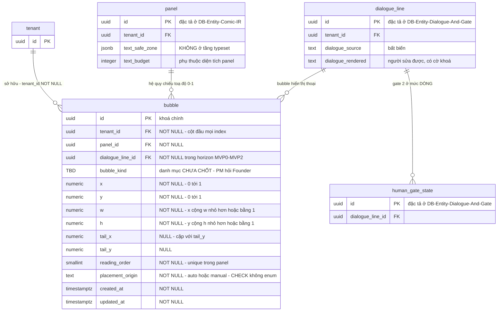

# DB Entity: Typeset Layer

Đặc tả bảng `comic.bubble` — tầng chữ **tách khỏi ảnh**, nơi ranh giới **art ↔ chữ** của hệ thống được cưỡng chế bằng hình dạng dữ liệu chứ ⛔ không bằng kỷ luật của người viết prompt.

> [!IMPORTANT]
> ⭐ **Vì sao bảng này đứng riêng một file**: nó là **ranh giới art ↔ chữ** (`D-29`). Bên trái ranh giới là pixel do model sinh ra — ⛔ **không chứa một ký tự nào**. Bên phải là string, sửa được, so được, test được. Ghép nó vào file khác là làm mờ đúng đường mà `SRS-FR-11` tồn tại để vạch.
> ⚠️ **File này mang một `TBD` chặn DDL** — xem [`TBD-BUBBLE-KIND`](#tbd-còn-lại).

## Decided in

| Nguồn | Nội dung kế thừa |
|---|---|
| [ADR-013 — Typeset Layer Separate From Art](../Architecture/ADR-013-Typeset-Layer-Separate-From-Art.md) | `Decision` điều 1–4 (art không chứa chữ, bubble là layer dữ liệu, render bằng code, vi phạm được đo) · điều 6 (NFC) · điều 7 (auto-placement + kéo tay) · điều 8 (một compositor) · điều 9 (reset gate) · `Consequences` hợp đồng #3, #4, #5, #8 · bảng `TBD` |
| [ADR-012 — Comic IR Spec As Primary Data](../Architecture/ADR-012-Comic-IR-Spec-As-Primary-Data.md) | `Decision` điều 5 (toạ độ chuẩn hoá 0–1) · điều 9 (`text_safe_zone`, `text_budget`, `negative_space_hint` là **field của panel spec**, ⛔ không nằm ở tầng typeset) |
| [ADR-006 — RLS Tenant Context Injection](../Architecture/ADR-006-RLS-Tenant-Context-Injection.md) | Cơ chế bơm tenant context, policy đường API |
| [ADR-017 — Provenance Chain And One Transaction Boundary](../Architecture/ADR-017-Provenance-Chain-And-One-Transaction-Boundary.md) | `Q2` — mọi thao tác typeset của người dùng sinh một dòng `change_log` |
| [SDD §3.2, §4.1 `B-4`, §5.3, §6.3 `SDD-HG-01`](../Architecture/SDD-Comic-Studio.md) | Schema `comic` · ranh giới ảnh ↔ DB · hai human gate |
| Requirement gốc | `SRS-FR-11`, `SRS-FR-12`, `SRS-FR-13`, `SRS-FR-16`, `SRS-FR-35`, `SRS-NFR-01` |
| Story | [Story-Typeset-Layer-And-Bubble-Overlay](../../022-User-Stories/Backlog/Story-Typeset-Layer-And-Bubble-Overlay.md) |

---

## Bảng

### `comic.bubble`

Một dòng = **một bubble** đặt trên một panel, mang đúng một dòng thoại. Toạ độ **chuẩn hoá 0–1 trong hệ quy chiếu của PANEL**.

| Cột | Kiểu | NULL? | Mặc định | Mô tả |
|---|---|:--:|---|---|
| `id` | `UUID` | ⛔ | `gen_random_uuid()` | Khoá chính |
| ⭐ `tenant_id` | `UUID` | ⛔ | — | Chủ sở hữu. Cột **đầu tiên** của mọi composite index (`SRS-NFR-01`) |
| `panel_id` | `UUID` | ⛔ | — | Panel mà bubble nằm trên. ⭐ Cũng là **hệ quy chiếu toạ độ** |
| `dialogue_line_id` | `UUID` | ⛔ | — | Dòng thoại mà bubble hiển thị. Xem [ghi chú nullability](#ghi-chú-về-dialogue_line_id) |
| ⭐ `bubble_kind` | ⛔ **`TBD`** | — | — | ⭐⛔ **Danh mục kiểu bubble CHƯA ĐƯỢC CHỐT.** ⛔ Không được đoán một danh mục — xem [`TBD-BUBBLE-KIND`](#tbd-còn-lại). ⚠️ Khi chốt, cột là `TEXT` + `CHECK`, ⛔ **không** Postgres enum type ([`E15`](../../010-Planning/pm-runs/2026-08-28-phase-2-architecture-design-comic-studio/escalations.md)) |
| `x` | `NUMERIC(6,5)` | ⛔ | — | Mép trái, chuẩn hoá 0–1 theo **chiều rộng panel** |
| `y` | `NUMERIC(6,5)` | ⛔ | — | Mép trên, chuẩn hoá 0–1 theo **chiều cao panel** |
| `w` | `NUMERIC(6,5)` | ⛔ | — | Chiều rộng, chuẩn hoá 0–1 |
| `h` | `NUMERIC(6,5)` | ⛔ | — | Chiều cao, chuẩn hoá 0–1 |
| `tail_x` | `NUMERIC(6,5)` | ✅ | `NULL` | Điểm đuôi trỏ (tail) — thường trỏ về miệng speaker. `NULL` = ⛔ không có đuôi |
| `tail_y` | `NUMERIC(6,5)` | ✅ | `NULL` | Cặp với `tail_x`, xem `T-5` |
| ⭐ `reading_order` | `SMALLINT` | ⛔ | — | Thứ tự đọc **trong panel**. ⭐ Auto-placement phải *"đúng thứ tự đọc"* (`SRS-FR-16`) ⇒ thứ tự là **dữ liệu**, ⛔ không phải hệ quả của toạ độ |
| ⭐ `placement_origin` | `TEXT` | ⛔ | `'auto'` | `CHECK (placement_origin IN ('auto','manual'))` — ⛔ **không** Postgres enum type ([`E15`](../../010-Planning/pm-runs/2026-08-28-phase-2-architecture-design-comic-studio/escalations.md)). `'auto'` = heuristic đặt · `'manual'` = **người đã kéo tay**. Xem `T-7` |
| `created_at` | `TIMESTAMPTZ` | ⛔ | `now()` | |
| `updated_at` | `TIMESTAMPTZ` | ⛔ | `now()` | |

- **PK**: `(id)`
- **FK**: `tenant_id → public.tenant(id)` `ON DELETE CASCADE` (`SRS-NFR-05`)
- **FK**: `panel_id → comic.panel(id)` `ON DELETE CASCADE`
- **FK**: `dialogue_line_id → comic.dialogue_line(id)` `ON DELETE CASCADE` — ⚠️ hai bảng đích thuộc [`DB-Entity-Comic-IR.md`](./DB-Entity-Comic-IR.md) và [`DB-Entity-Dialogue-And-Gate.md`](./DB-Entity-Dialogue-And-Gate.md); file này ⛔ **không** đặc tả lại chúng
- **UNIQUE**: `(tenant_id, panel_id, reading_order)`

`CHECK (placement_origin IN ('auto', 'manual'))` — ⛔ danh sách đóng.

### Ghi chú về `dialogue_line_id`

`NOT NULL` ở horizon **MVP0–MVP2**: [UC-07](../../020-Requirements/Use-Cases/UC-07-Edit-Bubble-And-Dialogue-In-Panel.md) `AF-6` xếp **SFX / narration box / caption** ra **NGOÀI** bốn thao tác được liệt kê ⇒ trong horizon này ⛔ **không tồn tại** bubble không gắn dòng thoại.

⚠️ ⛔ **Không được nới thành nullable "cho chắc".** Nếu `TBD` SFX/narration đóng theo hướng *"có"*, việc phải làm là một migration **có chủ đích**: nới `dialogue_line_id` + thêm cột phân loại vai trò. ⛔ Nới trước khi biết hình dạng là **thiết kế cho một yêu cầu chưa tồn tại**, và nó xoá mất chính ràng buộc *"mọi bubble đều truy được về một dòng thoại"* mà `field_provenance` đang dựa vào.

### ⛔ Bốn thứ KHÔNG nằm trong bảng này

| ⛔ Không ở đây | Ở đâu | Vì sao |
|---|---|---|
| `text_safe_zone`, `text_budget`, `negative_space_hint` | ⭐ **`comic.panel`** — [`DB-Entity-Comic-IR.md`](./DB-Entity-Comic-IR.md) | [ADR-012](../Architecture/ADR-012-Comic-IR-Spec-As-Primary-Data.md) `Decision` điều 9 chốt chúng là **field của panel spec**, ⛔ không phải của tầng typeset. Ràng buộc đi **NGƯỢC** từ typesetting vào compiler (`SRS-FR-13`) — nó phải khai được **trước khi ảnh tồn tại** |
| `dialogue_source`, `dialogue_rendered`, cờ khoá | `comic.dialogue_line` — [`DB-Entity-Dialogue-And-Gate.md`](./DB-Entity-Dialogue-And-Gate.md) | `SRS-FR-12`: hai field cho thoại, ⛔ không phải một. Bubble hiển thị thoại, ⛔ không **sở hữu** thoại |
| Trạng thái human gate #2 | `comic.human_gate_state` mức **DÒNG THOẠI** — [`DB-Entity-Dialogue-And-Gate.md`](./DB-Entity-Dialogue-And-Gate.md) | Hợp đồng #4 của [ADR-013](../Architecture/ADR-013-Typeset-Layer-Separate-From-Art.md): gate #2 lưu ở mức dòng, ⛔ không phải mức panel/page — vì `T2` reset **đúng một dòng** |
| Bytes ảnh, thành phẩm đã composite | Object storage, key `tenant/{tenant_id}/{sha256}` | Ranh giới `B-4`. ⚠️ [ADR-013](../Architecture/ADR-013-Typeset-Layer-Separate-From-Art.md) `Consequences`: **thành phẩm ⛔ KHÔNG tồn tại sẵn ở đâu** — trước khi composite nó là **hai tầng dữ liệu** |

---

## Index

⚠️ **`tenant_id` là cột ĐẦU TIÊN của MỌI composite index** (`SRS-NFR-01`, `D-10`) — ⛔ không ngoại lệ.

| Index | Định nghĩa | Phục vụ |
|---|---|---|
| `bubble_pkey` | `PRIMARY KEY (id)` | Khoá chính |
| ⭐ `ix_bubble_panel_order` | `UNIQUE (tenant_id, panel_id, reading_order)` | ⭐ **Đường nóng của compositor**: lấy toàn bộ bubble của một panel **theo đúng thứ tự đọc**, một lần quét. Preview và export dùng chung đường này (`D-32`) |
| `ix_bubble_line` | `(tenant_id, dialogue_line_id)` | Từ một dòng thoại tìm ngược bubble — cần khi `T2` reset gate #2 vì thoại bị sửa |
| `ix_bubble_manual` | `(tenant_id, panel_id)` `WHERE placement_origin = 'manual'` | Auto-placement chạy lại phải biết **ngay** bubble nào ⛔ không được đụng vào (`T-7`) |

⚠️ ⛔ **Không tạo index trên `(x, y)` hay index không gian.** ⛔ Không nguồn nào có truy vấn *"tìm bubble theo vùng"*; compositor luôn đọc **toàn bộ** bubble của một panel. Thêm index không gian là chi phí ghi thuần tuý.

---

## Constraint & Invariant

| # | Ràng buộc | Cưỡng chế bằng | Bảo vệ điều gì |
|:--:|---|---|---|
| ⭐ `T-1` | `CHECK (x >= 0 AND y >= 0 AND w > 0 AND h > 0 AND x + w <= 1 AND y + h <= 1)` | `CHECK` | ⭐ **Toạ độ chuẩn hoá 0–1 là ràng buộc tầng DB, ⛔ không phải quy ước.** [ADR-012](../Architecture/ADR-012-Comic-IR-Spec-As-Primary-Data.md) `Context` (b): đọc `0–1` thành *"đơn vị lưu trữ, đổi sang pixel cho tiện cũng được"* là **đóng một cánh cửa đang mở** — đường nâng cấp lên canvas ⛔ không phải migrate |
| `T-2` | `NUMERIC(6,5)` cho mọi toạ độ, ⛔ **không** `FLOAT`/`REAL` | Kiểu cột | Preview và export **phải cho ra cùng một trang** (`D-32`). Sai số nhị phân của floating point làm hai lần render lệch nhau ở mép bubble ⇒ *"cái người dùng duyệt"* ⛔ không còn **là** *"cái họ nhận"* |
| `T-3` | ⛔ **Không cột kiểu binary** trên bảng này | Test CI `information_schema.columns` | Ranh giới `B-4` ([SDD §4.1](../Architecture/SDD-Comic-Studio.md)) |
| ⭐ `T-4` | ⛔ **Không cột nào của `comic.bubble` chứa pixel, và ⛔ không cột nào của bảng artifact ảnh chứa chữ** | `T-3` + test đối chiếu ở tầng pipeline | ⭐ Đây là **phát biểu schema của ranh giới art ↔ chữ** (`D-29`, `SRS-FR-11`) |
| `T-5` | `CHECK ((tail_x IS NULL) = (tail_y IS NULL))` và `CHECK (tail_x IS NULL OR (tail_x BETWEEN 0 AND 1 AND tail_y BETWEEN 0 AND 1))` | `CHECK` | ⛔ Không có nửa cái đuôi trỏ |
| `T-6` | `UNIQUE (tenant_id, panel_id, reading_order)` | `UNIQUE` | Thứ tự đọc trong một panel là **toàn phần và xác định**; ⛔ hai bubble không cùng một chỗ trong thứ tự |
| ⭐ `T-7` | Auto-placement chạy lại ⛔ **KHÔNG được ghi đè** bubble có `placement_origin = 'manual'` | Tầng service + test | ⭐ Cùng mẫu lỗi với cờ khoá của `dialogue_rendered` (hợp đồng #2 [ADR-013](../Architecture/ADR-013-Typeset-Layer-Separate-From-Art.md)): một lần chạy lại không tôn trọng khoá sẽ **xoá âm thầm** công người dùng. ⚠️ [ADR-013](../Architecture/ADR-013-Typeset-Layer-Separate-From-Art.md) chốt cờ khoá cho **thoại**, ⛔ **không** chốt riêng cho vị trí bubble ⇒ ở đây ràng buộc **suy ra từ `placement_origin`**, ⛔ không phải một cột mới được phát minh |
| `T-8` | Mọi thao tác typeset của người dùng (kéo bubble, đổi kiểu, sửa thứ tự) sinh **một dòng `public.change_log`** trong **cùng** unit-of-work | Middleware `change_log` ([ADR-017 `Q2`](../Architecture/ADR-017-Provenance-Chain-And-One-Transaction-Boundary.md)) | `SRS-FR-35` — bằng chứng *"decisive contribution"*. ⛔ File này **không** đặc tả `change_log`; nguồn duy nhất là [ADR-017](../Architecture/ADR-017-Provenance-Chain-And-One-Transaction-Boundary.md) |
| `T-9` | Chuỗi thoại render qua bubble đã chuẩn hoá **NFC** tại biên ingest | Quy ước tầng ứng dụng + test | [ADR-013](../Architecture/ADR-013-Typeset-Layer-Separate-From-Art.md) `Decision` điều 6. ⚠️ Wrap phải chạy ở **cùng runtime với compositor** và đo bằng **chính font sẽ render** |

### ⭐ Ba invariant hành vi — ⛔ constraint không đỡ được

| # | Invariant | Đo bằng |
|:--:|---|---|
| `T-10` | ⭐ **Art sinh ra ⛔ KHÔNG chứa chữ.** Bốn token `text`, `letters`, `watermark`, `speech bubble` nằm trong negative prompt cho **100%** panel có thoại | Kiểm log prompt gửi tới model. ⭐ Cột lưu negative prompt là `generation.prompt_compilation.negative_prompt` ([`DB-Entity-Generation.md`](./DB-Entity-Generation.md)) — ⭐ **đó là chỗ ràng buộc này trở thành dữ liệu kiểm được, ⛔ không phải bảng này** |
| `T-11` | ⭐ **Vi phạm được ĐO, ⛔ không được bỏ qua.** Model vẫn sinh chữ trong ảnh dù đã có negative prompt ⇒ panel đó ⛔ **không** được tính vào tử số **100%** của `G1-e`, phải **ghi nhận là vi phạm và loại khỏi bộ đã duyệt** | AC của [Story-Typeset-Layer-And-Bubble-Overlay](../../022-User-Stories/Backlog/Story-Typeset-Layer-And-Bubble-Overlay.md). ⛔ **Không có nhánh *"chữ mờ nên cho qua"*** |
| ⭐ `T-12` | **Reset gate #2** khi `text_budget` đổi — **hai trigger, ⛔ không được bỏ cái nào** | Nguồn duy nhất: [ADR-013](../Architecture/ADR-013-Typeset-Layer-Separate-From-Art.md) `Decision` điều 9. ⛔ File này **không** đặc tả lại; trạng thái gate sống ở [`DB-Entity-Dialogue-And-Gate.md`](./DB-Entity-Dialogue-And-Gate.md) |

⚠️ **`T-12` chạm bảng này ở đâu**: `T1` (diện tích panel đổi ⇒ tính lại `text_budget`) làm bubble của panel đó **có thể phải đặt lại**. ⇒ Bubble `placement_origin = 'manual'` vẫn được `T-7` bảo vệ, nhưng ⛔ **`T-7` KHÔNG được đọc thành "bubble manual thì khỏi reset gate"** — hai chuyện độc lập: `T-7` bảo vệ **vị trí**, `T-12` reset **trạng thái duyệt của dòng thoại**. Nhầm hai cái là tạo ra một **đường bypass** ⇒ `M2-4` FAIL.

---

## RLS Policy

> ⭐ Nguồn duy nhất là [ADR-006](../Architecture/ADR-006-RLS-Tenant-Context-Injection.md). ⛔ File này không đặc tả lại policy.

- `ALTER TABLE comic.bubble ENABLE ROW LEVEL SECURITY` (+ `FORCE`) — `SRS-NFR-01`, RLS là **lớp phòng thủ thứ hai**.
- Policy tenant chuẩn cho `app_api`, đọc context qua **một hàm helper duy nhất** ([ADR-006 `D2`, `D3`](../Architecture/ADR-006-RLS-Tenant-Context-Injection.md)).
- ⚠️ `app_worker` chịu **đúng cùng một** policy như đường API trên bảng này. Carve-out xuyên tenant `D4.1` **chỉ** tồn tại trên `public.job`, ⛔ **không** lan sang bất kỳ bảng nghiệp vụ nào.
- ⚠️ **RLS ⛔ KHÔNG thay thế `WHERE tenant_id = ...`** ở tầng ứng dụng (`D-10`). Compositor đọc bubble bằng join `panel → bubble`; ⭐ join thực hiện phía application ⛔ **không** được RLS bảo vệ.
- ⛔ `app_public_intake` ⛔ không có quyền gì trên bảng này ([ADR-006 `D6`](../Architecture/ADR-006-RLS-Tenant-Context-Injection.md)).

---

## ER Diagram

⚠️ Tên rút gọn trong sơ đồ (cú pháp Mermaid ⛔ không nhận dấu chấm). Tên đủ điều kiện: `comic.bubble`, `comic.panel`, `comic.dialogue_line`, `comic.human_gate_state`, `public.tenant` (guardrail `G-3`).

---

## `TBD` còn lại

> [!CAUTION]
> ⭐⛔ **`TBD-BUBBLE-KIND` CHẶN DDL của file này.**
> [ADR-013](../Architecture/ADR-013-Typeset-Layer-Separate-From-Art.md) ghi mốc đóng nguyên văn: ***"Trước khi viết DDL của typeset layer"***.
> ⇒ ⛔ **Không được chuyển file này sang migration** khi `bubble_kind` còn `TBD`. Và ⛔ **tuyệt đối không** "tạm" đặt một danh mục đoán (`speech`/`thought`/`shout`/`whisper`) rồi sửa sau: một danh mục đã ship là **dữ liệu đã ghi**, và đổi nó về sau là migration dữ liệu, ⛔ không phải đổi một hằng số.

| Mã | Khoảng trống | Vì sao ⛔ chưa đóng được | **Ai đóng** | Khi nào |
|:--:|---|---|---|---|
| ⭐ `TBD-BUBBLE-KIND` | **Danh mục kiểu bubble** (giá trị của `bubble_kind`) | [UC-07](../../020-Requirements/Use-Cases/UC-07-Edit-Bubble-And-Dialogue-In-Panel.md) bước 6 chỉ ghi *"chọn kiểu bubble"*; ⛔ **danh mục cụ thể chưa được định nghĩa ở đâu trong repo** — `findings/architect.md` §7 `G9` | ⭐ **PM hỏi Founder.** Architect ghi vào **file này** + `Endpoint-Bubble-Typeset` sau khi có câu trả lời | ⭐ **Trước khi viết DDL của typeset layer** |
| ⭐ `TBD-SFX-NARRATION` | **SFX / narration box / caption** — có phải bubble không, hay là một hình dạng dữ liệu khác | [UC-07](../../020-Requirements/Use-Cases/UC-07-Edit-Bubble-And-Dialogue-In-Panel.md) `AF-6` xếp chúng **NGOÀI** bốn thao tác được liệt kê ⇒ ⛔ chưa có hình dạng dữ liệu. [Story-Typeset-Layer-And-Bubble-Overlay](../../022-User-Stories/Backlog/Story-Typeset-Layer-And-Bubble-Overlay.md) mục *"Story này KHÔNG làm"* xác nhận lại | ⭐ **PM hỏi Founder** | Cùng lúc với hàng trên |
| `TBD-FONT` | **Font sẽ render** (họ font, glyph coverage tiếng Việt) | Lỗi *"font không đủ glyph"* ⛔ **không có benchmark định lượng nào**; chỉ phát hiện được bằng **kiểm thủ công** từng panel | **Architect + Founder** | Sau MVP0, **trước gate `G1-e`** |

⚠️ **Ba hàng trên ⛔ KHÔNG thuộc thẩm quyền của lô DB Schema.** ⛔ Không được đóng bằng cách suy diễn từ quy ước ngành comic — `findings/architect.md` §7 `G9` ghi rõ nguồn **không có**, và writer của lô L7 đã **từ chối tự thiết kế thêm**.

---

## Tài liệu tham khảo

- [ADR-006 — RLS Tenant Context Injection](../Architecture/ADR-006-RLS-Tenant-Context-Injection.md)
- [ADR-012 — Comic IR Spec As Primary Data](../Architecture/ADR-012-Comic-IR-Spec-As-Primary-Data.md)
- [ADR-013 — Typeset Layer Separate From Art](../Architecture/ADR-013-Typeset-Layer-Separate-From-Art.md)
- [ADR-017 — Provenance Chain And One Transaction Boundary](../Architecture/ADR-017-Provenance-Chain-And-One-Transaction-Boundary.md)
- [SDD — Comic Studio](../Architecture/SDD-Comic-Studio.md) — §3.2, §3.4, §4.1, §4.2, §5.3, §6.3
- [SRS — Comic Studio](../../020-Requirements/SRS-Comic-Studio.md) — `SRS-FR-11`, `SRS-FR-12`, `SRS-FR-13`, `SRS-FR-14`, `SRS-FR-16`, `SRS-FR-35`, `SRS-NFR-01`, `SRS-NFR-05`
- [UC-07 — Edit Bubble And Dialogue In Panel](../../020-Requirements/Use-Cases/UC-07-Edit-Bubble-And-Dialogue-In-Panel.md) · [UC-08 — Arrange Page And Preview](../../020-Requirements/Use-Cases/UC-08-Arrange-Page-And-Preview.md)
- [Story-Typeset-Layer-And-Bubble-Overlay](../../022-User-Stories/Backlog/Story-Typeset-Layer-And-Bubble-Overlay.md)
- [DB-Entity-Comic-IR](./DB-Entity-Comic-IR.md) · [DB-Entity-Dialogue-And-Gate](./DB-Entity-Dialogue-And-Gate.md) · [DB-Entity-Generation](./DB-Entity-Generation.md)

---

_Created by System Architect — lô L9, Phase 2._
_Author: trisjr_
